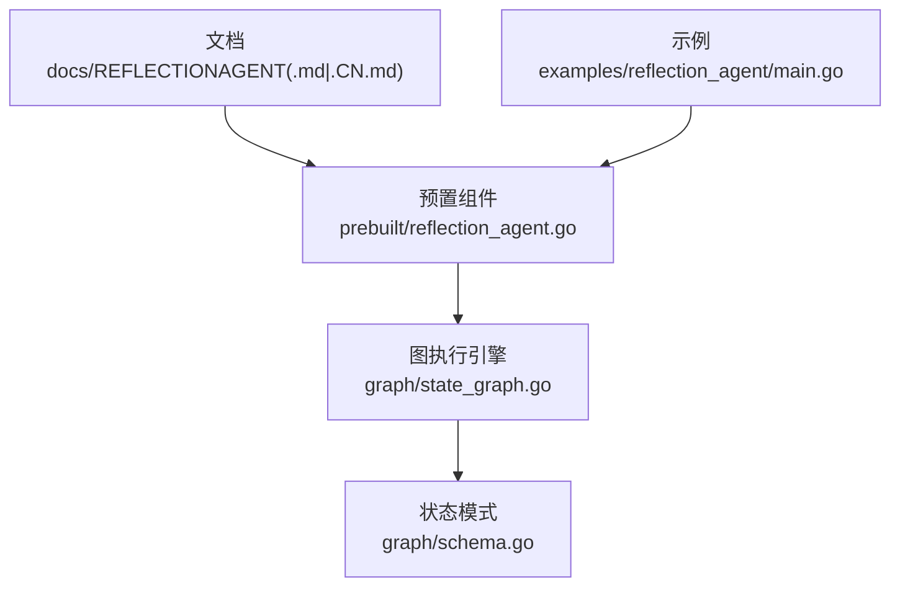
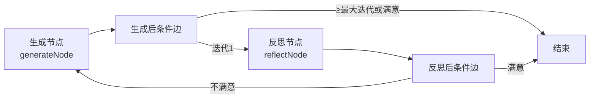
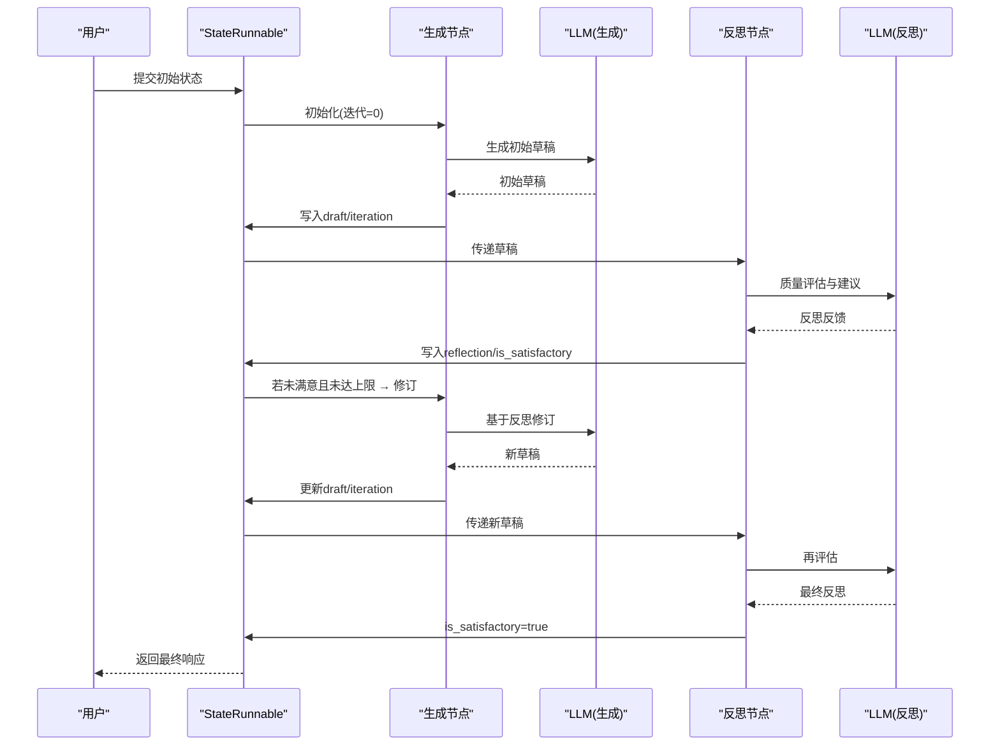
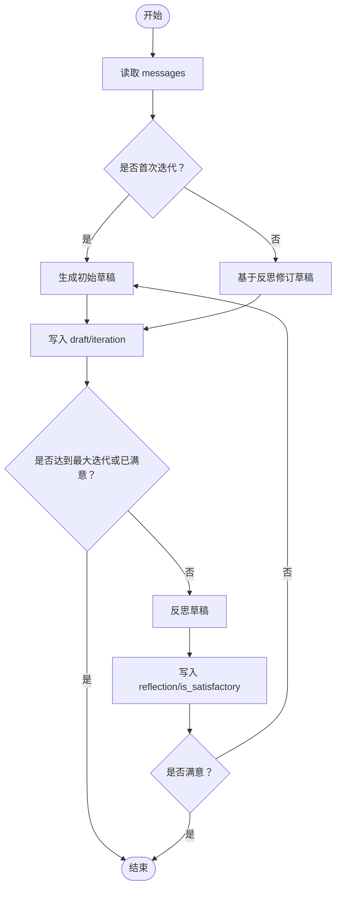
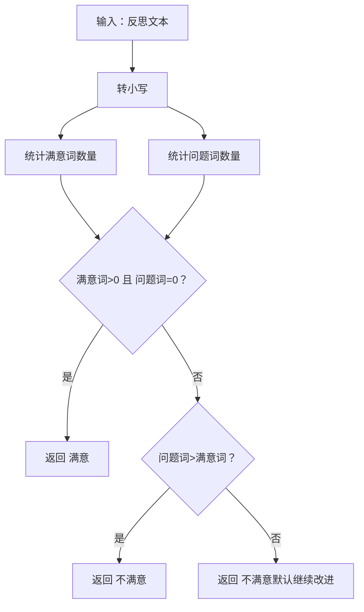
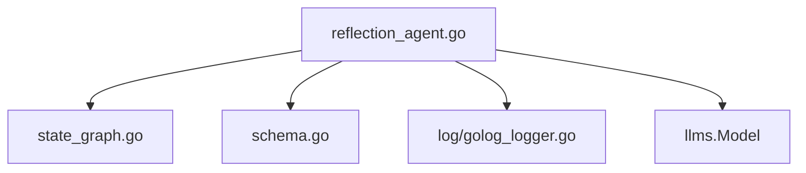

# 反思代理

<cite>
**本文引用的文件**
- [reflection_agent.go](file://prebuilt/reflection_agent.go)
- [REFLECTIONAGENT.md](file://docs/REFLECTIONAGENT.md)
- [REFLECTIONAGENT_CN.md](file://docs/REFLECTIONAGENT_CN.md)
- [main.go](file://examples/reflection_agent/main.go)
- [reflection_agent_test.go](file://prebuilt/reflection_agent_test.go)
- [reflection_agent_example_test.go](file://prebuilt/reflection_agent_example_test.go)
- [state_graph.go](file://graph/state_graph.go)
- [schema.go](file://graph/schema.go)
</cite>

## 目录
1. [简介](#简介)
2. [项目结构](#项目结构)
3. [核心组件](#核心组件)
4. [架构总览](#架构总览)
5. [详细组件分析](#详细组件分析)
6. [依赖关系分析](#依赖关系分析)
7. [性能考量](#性能考量)
8. [故障排查指南](#故障排查指南)
9. [结论](#结论)
10. [附录](#附录)

## 简介
本文件系统化梳理“反思代理”（Reflection Agent）的设计与实现，围绕其迭代自我改进的工作流、状态管理、路由决策、以及与底层图执行引擎的集成展开。目标读者既包括希望快速上手的开发者，也包括需要深入理解实现细节的技术人员。

## 项目结构
- 文档层：位于 docs 目录，包含英文与中文两版“反思代理”使用文档，涵盖架构、工作原理、API 参考、示例与最佳实践。
- 预置组件层：prebuilt/reflection_agent.go 提供反射代理的完整实现，包括节点、状态、条件边与编译流程。
- 示例层：examples/reflection_agent/main.go 展示如何创建模型、配置代理并执行。
- 图执行与状态层：graph/state_graph.go 与 graph/schema.go 提供状态图编译、节点执行、状态合并等基础能力。

图表来源
- [REFLECTIONAGENT.md](file://docs/REFLECTIONAGENT.md#L61-L111)
- [reflection_agent.go](file://prebuilt/reflection_agent.go#L43-L102)
- [state_graph.go](file://graph/state_graph.go#L1-L120)
- [schema.go](file://graph/schema.go#L1-L82)

章节来源
- [REFLECTIONAGENT.md](file://docs/REFLECTIONAGENT.md#L61-L111)
- [reflection_agent.go](file://prebuilt/reflection_agent.go#L43-L102)
- [state_graph.go](file://graph/state_graph.go#L1-L120)
- [schema.go](file://graph/schema.go#L1-L82)

## 核心组件
- 反射代理配置（ReflectionAgentConfig）：控制模型、反思模型、最大迭代次数、系统消息、反思提示与日志开关。
- 工作流构建（CreateReflectionAgent）：注册生成与反思节点、设置入口点、添加条件边、编译为 StateRunnable。
- 生成节点（generateNode）：首轮生成初始草稿；后续根据反思修订。
- 反思节点（reflectNode）：对草稿进行质量评估，输出反思与满意度标记。
- 条件路由（shouldContinueAfterGenerate / shouldContinueAfterReflect）：依据迭代计数、最大迭代限制与满意度决定下一步。
- 状态模式（MapSchema + Reducers）：messages（追加）、draft（覆盖）、iteration（覆盖）、reflection（覆盖）、is_satisfactory（覆盖）。
- 默认反思提示（buildDefaultReflectionPrompt）：提供结构化的评估维度与格式。
- 满意度判定（isResponseSatisfactory）：关键词匹配策略，兼顾“满意词”与“问题词”的排除逻辑。
- 原始请求提取（getOriginalRequest）：从消息历史中抽取原始用户请求。

章节来源
- [reflection_agent.go](file://prebuilt/reflection_agent.go#L13-L33)
- [reflection_agent.go](file://prebuilt/reflection_agent.go#L43-L102)
- [reflection_agent.go](file://prebuilt/reflection_agent.go#L104-L199)
- [reflection_agent.go](file://prebuilt/reflection_agent.go#L201-L260)
- [reflection_agent.go](file://prebuilt/reflection_agent.go#L262-L309)
- [reflection_agent.go](file://prebuilt/reflection_agent.go#L311-L384)
- [reflection_agent.go](file://prebuilt/reflection_agent.go#L386-L428)
- [schema.go](file://graph/schema.go#L1-L82)

## 架构总览
反思代理采用“生成-反思-修订-再反思”的循环，通过条件边在生成与反思之间切换，直至满足满意度或达到最大迭代次数。状态通过 MapSchema 的 Reducer 精确控制字段更新。

图表来源
- [reflection_agent.go](file://prebuilt/reflection_agent.go#L43-L102)
- [reflection_agent.go](file://prebuilt/reflection_agent.go#L262-L309)

章节来源
- [REFLECTIONAGENT.md](file://docs/REFLECTIONAGENT.md#L111-L149)
- [reflection_agent.go](file://prebuilt/reflection_agent.go#L43-L102)

## 详细组件分析

### 组件A：反射代理配置与工作流构建
- 配置项
  - Model：生成与反思使用的 LLM。
  - ReflectionModel：可选的独立反思模型，默认与生成模型相同。
  - MaxIterations：最大迭代次数，默认 3。
  - SystemMessage：生成阶段的系统提示，默认通用助手提示。
  - ReflectionPrompt：反思阶段的系统提示，默认提供结构化评估框架。
  - Verbose：开启详细日志。
- 工作流构建
  - 注册生成节点与反思节点。
  - 设置入口点为“generate”。
  - 添加两条条件边：
    - 生成后：若迭代达到上限或上次已满意，则结束；否则进入反思。
    - 反思后：若满意则结束；否则回到生成进行修订。
  - 编译为 StateRunnable 以便执行。

图表来源
- [reflection_agent.go](file://prebuilt/reflection_agent.go#L43-L102)
- [reflection_agent.go](file://prebuilt/reflection_agent.go#L104-L199)
- [reflection_agent.go](file://prebuilt/reflection_agent.go#L201-L260)
- [reflection_agent.go](file://prebuilt/reflection_agent.go#L262-L309)

章节来源
- [reflection_agent.go](file://prebuilt/reflection_agent.go#L43-L102)
- [REFLECTIONAGENT.md](file://docs/REFLECTIONAGENT.md#L151-L209)

### 组件B：状态管理与数据流
- 状态键
  - messages：对话历史（追加）。
  - draft：当前草稿（覆盖）。
  - reflection：最新反思（覆盖）。
  - iteration：当前迭代计数（覆盖）。
  - is_satisfactory：是否满意（覆盖）。
- Reducer 行为
  - AppendReducer：向 messages 追加新消息。
  - OverwriteReducer：覆盖 draft、reflection、iteration、is_satisfactory。
- 数据流
  - 生成节点：读取 messages，构造系统提示与人类提示，调用 LLM 生成 draft，并写回状态。
  - 反思节点：读取 draft 与 messages，构造反思提示，调用 LLM 产出反思与满意度标记。

图表来源
- [reflection_agent.go](file://prebuilt/reflection_agent.go#L104-L199)
- [reflection_agent.go](file://prebuilt/reflection_agent.go#L201-L260)
- [reflection_agent.go](file://prebuilt/reflection_agent.go#L262-L309)
- [schema.go](file://graph/schema.go#L1-L82)

章节来源
- [reflection_agent.go](file://prebuilt/reflection_agent.go#L104-L199)
- [reflection_agent.go](file://prebuilt/reflection_agent.go#L201-L260)
- [schema.go](file://graph/schema.go#L1-L82)

### 组件C：满意度判定与默认反思提示
- 满意度判定（isResponseSatisfactory）
  - 关键词策略：优先统计“满意词”，再统计“问题词”，并排除“问题词”出现在“满意词”中的情形。
  - 若存在满意指示且无问题指示，视为满意；否则继续改进。
- 默认反思提示（buildDefaultReflectionPrompt）
  - 明确要求输出“优点/缺点/改进建议”，并给出准确性、完整性、清晰度、相关性、质量等评估维度。

图表来源
- [reflection_agent.go](file://prebuilt/reflection_agent.go#L311-L384)
- [reflection_agent.go](file://prebuilt/reflection_agent.go#L400-L428)

章节来源
- [reflection_agent.go](file://prebuilt/reflection_agent.go#L311-L384)
- [reflection_agent.go](file://prebuilt/reflection_agent.go#L400-L428)

### 组件D：示例与测试验证
- 示例程序（examples/reflection_agent/main.go）
  - 展示基础反射、技术写作定制提示、代码评审定制提示三类用法。
  - 输出最终草稿与迭代次数，便于观察改进效果。
- 单元测试（prebuilt/reflection_agent_test.go）
  - 验证代理创建、调用、状态字段存在性、最大迭代限制、满意度判定、默认反思提示与原始请求提取。
- 示例测试（prebuilt/reflection_agent_example_test.go）
  - 展示独立反思模型与自定义评估标准的用法。

章节来源
- [main.go](file://examples/reflection_agent/main.go#L1-L191)
- [reflection_agent_test.go](file://prebuilt/reflection_agent_test.go#L1-L255)
- [reflection_agent_example_test.go](file://prebuilt/reflection_agent_example_test.go#L1-L166)

## 依赖关系分析
- 预置组件依赖
  - graph/state_graph.go：工作流编译、节点执行、条件边与入口点设置。
  - graph/schema.go：MapSchema 与 Reducer（追加/覆盖），用于精确控制状态字段更新。
  - log/golog_logger.go：Verbose 日志记录（在生成与反思节点中使用）。
- 外部依赖
  - llms.Model：LangChainGo 的 LLM 接口，用于生成与反思。
- 内聚与耦合
  - 反射代理内部高度内聚：生成、反思、路由、状态均在单一文件中实现。
  - 与图执行引擎解耦：通过 StateRunnable 与 StateSchema 抽象对外暴露。

图表来源
- [reflection_agent.go](file://prebuilt/reflection_agent.go#L1-L20)
- [state_graph.go](file://graph/state_graph.go#L1-L120)
- [schema.go](file://graph/schema.go#L1-L82)

章节来源
- [reflection_agent.go](file://prebuilt/reflection_agent.go#L1-L20)
- [state_graph.go](file://graph/state_graph.go#L1-L120)
- [schema.go](file://graph/schema.go#L1-L82)

## 性能考量
- 迭代次数与成本
  - 反复调用 LLM 会带来成本上升。建议根据任务复杂度合理设置 MaxIterations（通常 3-5 次）。
- 模型选择
  - 生成与反思使用同一模型简化流程；若追求成本优化，可使用不同模型（如生成用更强模型，反思用较弱模型）。
- 日志开销
  - Verbose 模式有助于调试，但在生产环境建议关闭以降低 I/O 与日志解析成本。
- 状态更新
  - 使用 OverwriteReducer 与 AppendReducer 精准控制状态字段，避免不必要的拷贝与冲突。

[本节为通用指导，不直接分析具体文件]

## 故障排查指南
- 代理总在第一次迭代后停止
  - 可能原因：反思提示过于宽松或满意度判定过于敏感。
  - 解决方案：调整反思提示，使其更严格；或放宽满意度判定逻辑。
- 代理总是达到最大迭代次数仍未满意
  - 可能原因：反思提示过于严苛、期望过高、关键词匹配不准确。
  - 解决方案：适度放宽反思标准；检查满意度判定；适当提高最大迭代次数。
- 反思反馈过于泛泛
  - 可能原因：反思提示未明确评估维度。
  - 解决方案：在反思提示中列出具体评估标准与示例。

章节来源
- [REFLECTIONAGENT.md](file://docs/REFLECTIONAGENT.md#L610-L655)
- [REFLECTIONAGENT_CN.md](file://docs/REFLECTIONAGENT_CN.md#L636-L655)

## 结论
反思代理通过“生成-反思-修订”的闭环，显著提升了输出质量与一致性。其设计以清晰的状态模式与条件路由为核心，配合灵活的提示工程与迭代限制，既能满足高质量内容生成，又具备良好的可扩展性与可维护性。建议在实际应用中结合任务复杂度与成本预算，合理配置模型与迭代次数，并持续优化反思提示以获得稳定的效果。

[本节为总结性内容，不直接分析具体文件]

## 附录
- 快速开始
  - 创建 LLM 模型与反射代理配置，准备初始状态（包含 messages），调用 StateRunnable.Invoke 获取最终状态并提取 draft 与 iteration。
- API 参考
  - ReflectionAgentConfig：包含 Model、ReflectionModel、MaxIterations、SystemMessage、ReflectionPrompt、Verbose。
  - CreateReflectionAgent：返回 StateRunnable。
  - State 结构：messages、draft、reflection、iteration、is_satisfactory。

章节来源
- [REFLECTIONAGENT.md](file://docs/REFLECTIONAGENT.md#L250-L323)
- [reflection_agent.go](file://prebuilt/reflection_agent.go#L13-L33)
- [reflection_agent.go](file://prebuilt/reflection_agent.go#L43-L102)