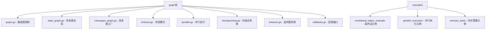
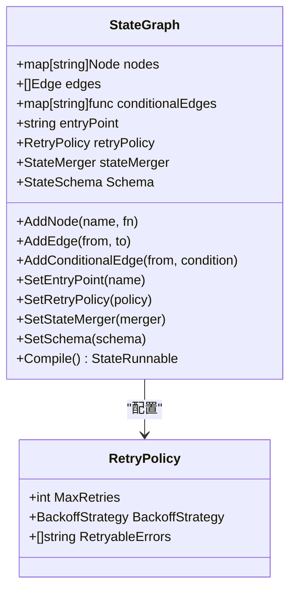
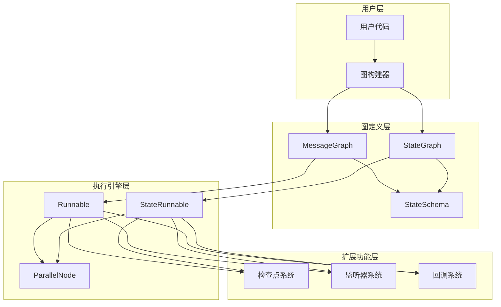
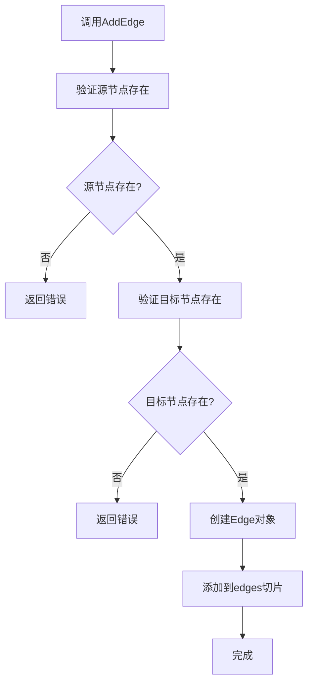
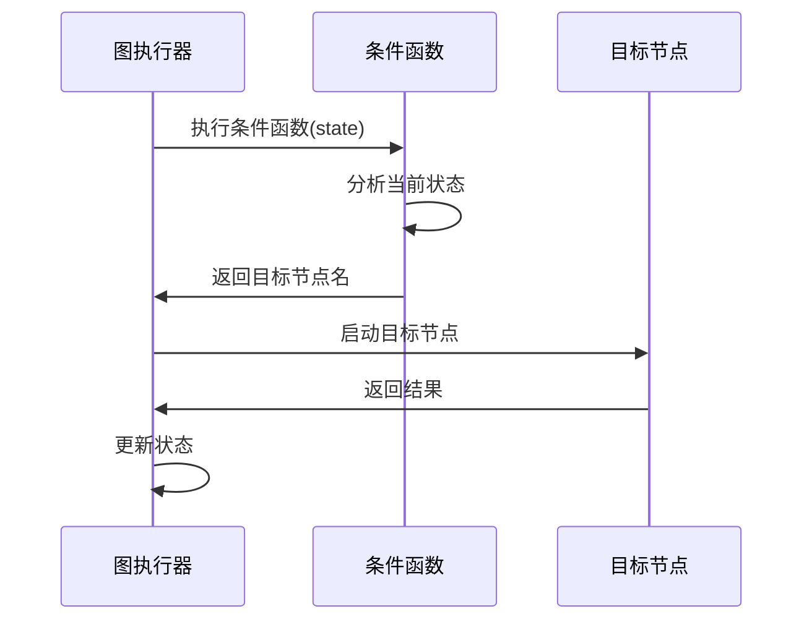
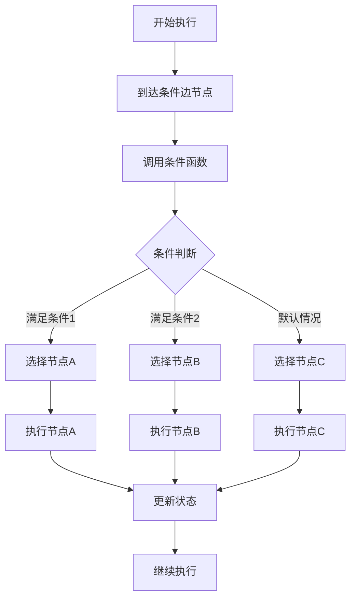
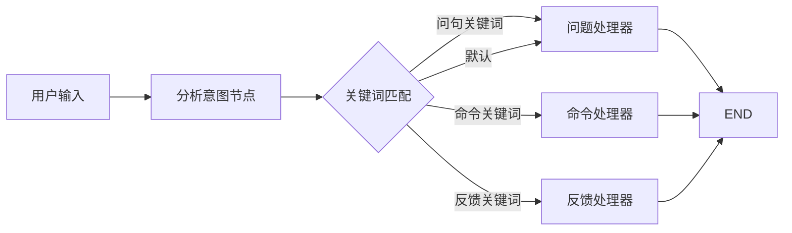
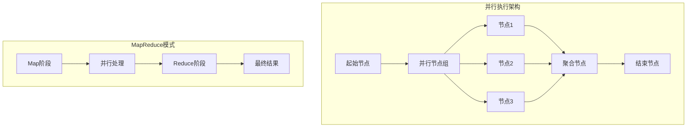
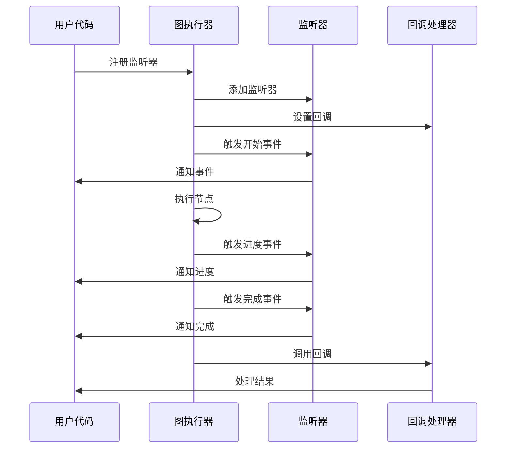
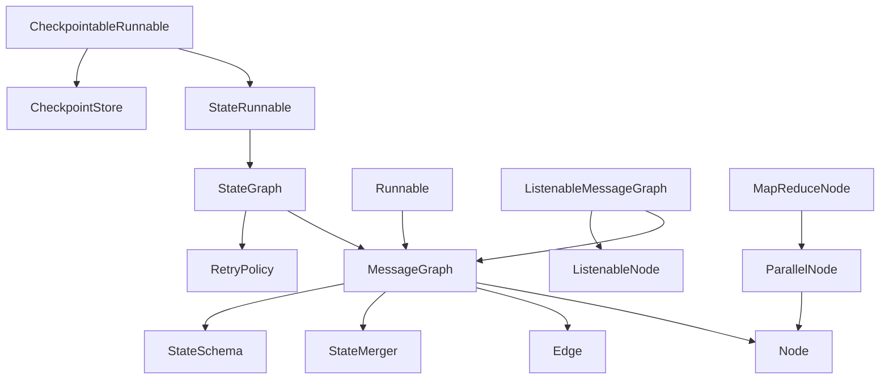

# 图定义

<cite>
**本文档中引用的文件**
- [graph.go](file://graph/graph.go)
- [state_graph.go](file://graph/state_graph.go)
- [messages_graph.go](file://graph/messages_graph.go)
- [schema.go](file://graph/schema.go)
- [conditional_edges_test.go](file://graph/conditional_edges_test.go)
- [parallel.go](file://graph/parallel.go)
- [checkpointing.go](file://graph/checkpointing.go)
- [listeners.go](file://graph/listeners.go)
- [callbacks.go](file://graph/callbacks.go)
- [main.go](file://examples/conditional_edges_example/main.go)
- [main.go](file://examples/parallel_execution/main.go)
- [main.go](file://examples/memory_basic/main.go)
</cite>

## 目录
1. [简介](#简介)
2. [项目结构](#项目结构)
3. [核心组件](#核心组件)
4. [架构概览](#架构概览)
5. [详细组件分析](#详细组件分析)
6. [依赖关系分析](#依赖关系分析)
7. [性能考虑](#性能考虑)
8. [故障排除指南](#故障排除指南)
9. [结论](#结论)

## 简介

langgraphgo 是一个强大的图式编程框架，提供了灵活的消息图（MessageGraph）和状态图（StateGraph）两种主要的图类型。该框架支持复杂的图结构构建，包括条件边、并行执行、检查点持久化、监听器系统等高级功能。本文档将深入解析图定义的核心概念、结构体设计、方法实现以及实际应用场景。

## 项目结构

langgraphgo 的图定义功能主要集中在 `graph` 包中，包含以下关键文件：



**图表来源**
- [graph.go](file://graph/graph.go#L1-L50)
- [state_graph.go](file://graph/state_graph.go#L1-L50)
- [messages_graph.go](file://graph/messages_graph.go#L1-L13)

## 核心组件

### MessageGraph 结构体

MessageGraph 是消息图的核心结构体，用于构建基于消息传递的图结构：

```mermaid
classDiagram
class MessageGraph {
+map[string]Node nodes
+[]Edge edges
+map[string]func stateMerger
+StateSchema Schema
+string entryPoint
+AddNode(name, fn)
+AddEdge(from, to)
+AddConditionalEdge(from, condition)
+SetEntryPoint(name)
+SetStateMerger(merger)
+SetSchema(schema)
+Compile() Runnable
}
class Node {
+string Name
+func Function
}
class Edge {
+string From
+string To
}
class StateMerger {
+func(ctx, state, newStates) (interface{}, error)
}
MessageGraph --> Node : "包含"
MessageGraph --> Edge : "包含"
MessageGraph --> StateMerger : "使用"
```

**图表来源**
- [graph.go](file://graph/graph.go#L74-L93)

### StateGraph 结构体

StateGraph 提供了更丰富的状态管理功能，支持重试策略和监听器：



**图表来源**
- [state_graph.go](file://graph/state_graph.go#L10-L31)

**章节来源**
- [graph.go](file://graph/graph.go#L74-L93)
- [state_graph.go](file://graph/state_graph.go#L10-L31)

## 架构概览

langgraphgo 的图定义架构采用分层设计，支持多种执行模式和扩展功能：



**图表来源**
- [graph.go](file://graph/graph.go#L140-L170)
- [state_graph.go](file://graph/state_graph.go#L99-L109)

## 详细组件分析

### 图构建方法详解

#### AddNode 方法

AddNode 方法用于向图中添加节点，支持两种图类型：

| 参数 | 类型 | 描述 | 使用场景 |
|------|------|------|----------|
| name | string | 节点唯一标识符 | 用于节点间引用和调试 |
| fn | func | 节点执行函数 | 接收上下文和状态，返回新状态和错误 |

**实现细节：**
- 函数签名：`func (g *MessageGraph) AddNode(name string, fn func(ctx context.Context, state interface{}) (interface{}, error))`
- 支持并发安全的节点注册
- 自动验证节点名称唯一性

#### AddEdge 方法

AddEdge 方法建立节点间的静态连接：

| 参数 | 类型 | 描述 | 验证规则 |
|------|------|------|----------|
| from | string | 源节点名称 | 必须存在于图中 |
| to | string | 目标节点名称 | 必须存在于图中 |

**执行流程：**


**图表来源**
- [graph.go](file://graph/graph.go#L111-L117)

#### AddConditionalEdge 方法

条件边允许在运行时动态决定下一个执行节点：

| 参数 | 类型 | 描述 | 返回值要求 |
|------|------|------|------------|
| from | string | 源节点名称 | 必须存在于图中 |
| condition | func | 条件判断函数 | 返回目标节点名称或空字符串 |

**条件函数签名：**
`func(ctx context.Context, state interface{}) string`

**运行时决策机制：**


**图表来源**
- [graph.go](file://graph/graph.go#L119-L123)

#### SetEntryPoint 方法

设置图的入口点，这是执行开始的位置：

| 参数 | 类型 | 描述 | 默认行为 |
|------|------|------|----------|
| name | string | 入口节点名称 | 必须在编译前设置 |

**重要约束：**
- 编译时必须设置入口点
- 入口节点必须存在于图中
- 不可重复设置

#### SetSchema 方法

配置状态模式，控制状态更新逻辑：

| 功能 | 描述 | 实现方式 |
|------|------|----------|
| 状态初始化 | 定义初始状态结构 | Init() interface{} |
| 状态合并 | 定义状态更新规则 | Update(current, new) (interface{}, error) |
| 清理机制 | 处理临时状态变量 | Cleanup(state) interface{} |

**章节来源**
- [graph.go](file://graph/graph.go#L103-L137)
- [state_graph.go](file://graph/state_graph.go#L58-L96)

### 条件边的运行时决策机制

条件边是 langgraphgo 的核心特性之一，它允许图根据当前状态动态选择执行路径：



**图表来源**
- [conditional_edges_test.go](file://graph/conditional_edges_test.go#L45-L56)

**实际应用示例：**

在条件边示例中，展示了意图路由的实现：



**图表来源**
- [main.go](file://examples/conditional_edges_example/main.go#L66-L89)

### 并行执行的边处理逻辑

langgraphgo 支持高效的并行节点执行，通过 `ParallelNode` 和 `MapReduceNode` 实现：



**图表来源**
- [parallel.go](file://graph/parallel.go#L23-L83)

**并行执行特点：**
- 使用 Goroutine 并发执行
- 自动错误收集和传播
- 支持节点间状态隔离
- 提供超时和中断机制

**章节来源**
- [parallel.go](file://graph/parallel.go#L1-L178)

### 检查点系统

检查点系统提供持久化的状态保存和恢复功能：

```mermaid
classDiagram
class Checkpoint {
+string ID
+string NodeName
+interface{} State
+map[string]interface{} Metadata
+time.Time Timestamp
+int Version
}
class CheckpointStore {
<<interface>>
+Save(ctx, checkpoint) error
+Load(ctx, id) Checkpoint
+List(ctx, executionID) []Checkpoint
+Delete(ctx, id) error
+Clear(ctx, executionID) error
}
class MemoryCheckpointStore {
+map[string]Checkpoint checkpoints
+sync.RWMutex mutex
}
class CheckpointableRunnable {
+runnable *ListenableRunnable
+config CheckpointConfig
+SaveCheckpoint(ctx, node, state) error
+LoadCheckpoint(ctx, id) Checkpoint
+ListCheckpoints(ctx) []Checkpoint
+ResumeFromCheckpoint(ctx, id) interface{}
}
CheckpointStore <|.. MemoryCheckpointStore
CheckpointableRunnable --> CheckpointStore
```

**图表来源**
- [checkpointing.go](file://graph/checkpointing.go#L12-L21)
- [checkpointing.go](file://graph/checkpointing.go#L22-L38)

**检查点配置选项：**

| 配置项 | 类型 | 默认值 | 描述 |
|--------|------|--------|------|
| Store | CheckpointStore | MemoryCheckpointStore | 存储后端 |
| AutoSave | bool | true | 是否自动保存 |
| SaveInterval | time.Duration | 30s | 保存间隔 |
| MaxCheckpoints | int | 10 | 最大检查点数量 |

**章节来源**
- [checkpointing.go](file://graph/checkpointing.go#L188-L201)

### 监听器和回调系统

监听器系统提供图执行过程中的事件通知机制：



**图表来源**
- [listeners.go](file://graph/listeners.go#L127-L175)
- [callbacks.go](file://graph/callbacks.go#L8-L37)

**事件类型：**

| 事件类型 | 描述 | 触发时机 |
|----------|------|----------|
| NodeEventStart | 节点开始执行 | 节点函数调用前 |
| NodeEventComplete | 节点执行完成 | 节点函数成功返回后 |
| NodeEventError | 节点执行出错 | 节点函数返回错误后 |
| EventChainStart | 图开始执行 | 图执行开始时 |
| EventChainEnd | 图执行完成 | 图执行结束时 |

**章节来源**
- [listeners.go](file://graph/listeners.go#L10-L49)
- [callbacks.go](file://graph/callbacks.go#L8-L37)

## 依赖关系分析

langgraphgo 的图定义功能具有清晰的模块化设计，各组件间通过接口和组合实现松耦合：



**图表来源**
- [graph.go](file://graph/graph.go#L52-L70)
- [state_graph.go](file://graph/state_graph.go#L397-L458)

**核心依赖关系：**

1. **图类型继承关系：** StateGraph 继承 MessageGraph 的基础功能
2. **扩展功能组合：** 监听器、检查点等功能通过组合而非继承实现
3. **接口驱动设计：** 通过接口解耦具体实现，提高可测试性和可扩展性

**章节来源**
- [graph.go](file://graph/graph.go#L1-L50)
- [state_graph.go](file://graph/state_graph.go#L1-L50)

## 性能考虑

### 并发执行优化

langgraphgo 在并行执行方面采用了多项优化措施：

1. **Goroutine 池管理：** 使用 WaitGroup 确保所有并行任务完成
2. **错误聚合：** 及时捕获和传播错误，避免部分失败导致的资源泄漏
3. **状态隔离：** 每个节点独立执行，避免状态竞争
4. **超时控制：** 支持上下文取消，防止长时间阻塞

### 内存管理

1. **状态清理：** 通过 `CleaningStateSchema` 接口支持临时状态清理
2. **检查点优化：** 支持增量保存和压缩存储
3. **监听器管理：** 提供监听器的动态添加和移除

### 执行效率

1. **条件边缓存：** 条件函数的结果可以被缓存以提高性能
2. **边缘检测：** 编译时验证图的有效性，减少运行时错误
3. **状态合并优化：** 通过自定义 reducer 实现高效的状态更新

## 故障排除指南

### 常见错误及解决方案

| 错误类型 | 错误信息 | 可能原因 | 解决方案 |
|----------|----------|----------|----------|
| ErrEntryPointNotSet | entry point not set | 未设置入口节点 | 调用 SetEntryPoint() |
| ErrNodeNotFound | node not found | 引用了不存在的节点 | 检查节点名称拼写 |
| ErrNoOutgoingEdge | no outgoing edge found | 节点没有出边 | 添加适当的边或条件边 |
| GraphInterrupt | graph interrupted | 执行被中断 | 检查中断配置 |

### 调试技巧

1. **启用监听器：** 使用监听器系统跟踪执行过程
2. **检查点调试：** 利用检查点系统保存中间状态
3. **日志记录：** 在节点函数中添加详细的日志输出
4. **单元测试：** 为每个节点编写独立的测试用例

### 性能监控

1. **执行时间测量：** 使用监听器记录节点执行时间
2. **内存使用监控：** 关注状态大小和检查点存储
3. **并发度分析：** 监控并行节点的执行效率

**章节来源**
- [graph.go](file://graph/graph.go#L13-L22)
- [listeners.go](file://graph/listeners.go#L127-L175)

## 结论

langgraphgo 的图定义功能提供了强大而灵活的图式编程能力。通过 MessageGraph 和 StateGraph 两种核心类型，开发者可以根据具体需求选择合适的抽象层次。框架的模块化设计使得功能扩展变得简单，而完善的监听器、检查点和回调系统则确保了生产环境的可靠性和可观测性。

主要优势包括：

1. **灵活性：** 支持静态和动态的边关系
2. **可扩展性：** 模块化设计便于功能扩展
3. **可靠性：** 完善的错误处理和恢复机制
4. **可观测性：** 丰富的监听器和回调系统
5. **性能：** 高效的并行执行和内存管理

通过深入理解这些核心概念和实现细节，开发者可以更好地利用 langgraphgo 构建复杂的图式应用程序。