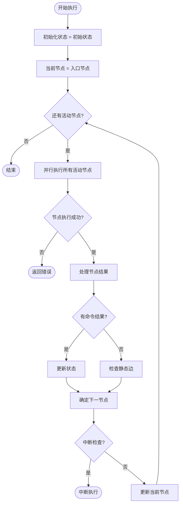

# 图引擎

<cite>
**本文档中引用的文件**
- [messages_graph.go](file://graph/messages_graph.go)
- [state_graph.go](file://graph/state_graph.go)
- [graph.go](file://graph/graph.go)
- [schema.go](file://graph/schema.go)
- [parallel.go](file://graph/parallel.go)
- [streaming.go](file://graph/streaming.go)
- [checkpointing.go](file://graph/checkpointing.go)
- [listeners.go](file://graph/listeners.go)
- [conditional_edges_example/main.go](file://examples/conditional_edges_example/main.go)
- [parallel_execution/main.go](file://examples/parallel_execution/main.go)
</cite>

## 目录
1. [简介](#简介)
2. [核心架构](#核心架构)
3. [MessageGraph 核心 API](#messagegraph-核心-api)
4. [StateGraph 核心 API](#stategraph-核心-api)
5. [StateRunnable 和 Runnable 执行机制](#staterunnable-和-runnable-执行机制)
6. [并行执行和条件路由](#并行执行和条件路由)
7. [检查点和持久化](#检查点和持久化)
8. [流式处理](#流式处理)
9. [监听器和回调](#监听器和回调)
10. [实际应用示例](#实际应用示例)
11. [最佳实践](#最佳实践)

## 简介

langgraphgo 的图引擎是一个强大的工作流编排系统，提供了灵活的状态管理和执行控制能力。它支持同步和异步执行、并行处理、条件路由、动态跳转、检查点持久化等功能，适用于构建复杂的业务流程和 AI 应用管道。

图引擎的核心设计理念是将业务逻辑抽象为有向无环图（DAG），通过节点（Node）表示处理步骤，通过边（Edge）表示数据流向，通过条件边（Conditional Edge）实现动态路由决策。

## 核心架构

```mermaid
classDiagram
class MessageGraph {
+map~string,Node~ nodes
+[]Edge edges
+map~string,func~ conditionalEdges
+string entryPoint
+StateMerger stateMerger
+StateSchema Schema
+AddNode(name, fn)
+AddEdge(from, to)
+AddConditionalEdge(from, condition)
+SetEntryPoint(name)
+SetStateMerger(merger)
+SetSchema(schema)
+Compile() Runnable
}
class StateGraph {
+map~string,Node~ nodes
+[]Edge edges
+map~string,func~ conditionalEdges
+string entryPoint
+RetryPolicy retryPolicy
+StateMerger stateMerger
+StateSchema Schema
+AddNode(name, fn)
+AddEdge(from, to)
+AddConditionalEdge(from, condition)
+SetEntryPoint(name)
+SetRetryPolicy(policy)
+SetStateMerger(merger)
+SetSchema(schema)
+Compile() StateRunnable
}
class Runnable {
+MessageGraph graph
+Tracer tracer
+Invoke(ctx, state) interface{}
+InvokeWithConfig(ctx, state, config) interface{}
+SetTracer(tracer)
+WithTracer(tracer) Runnable
}
class StateRunnable {
+StateGraph graph
+Invoke(ctx, initialState) interface{}
+InvokeWithConfig(ctx, initialState, config) interface{}
}
class Node {
+string Name
+func Function
}
class Edge {
+string From
+string To
}
MessageGraph --> Node : contains
MessageGraph --> Edge : contains
StateGraph --> Node : contains
StateGraph --> Edge : contains
Runnable --> MessageGraph : wraps
StateRunnable --> StateGraph : wraps
```

**图表来源**
- [graph.go](file://graph/graph.go#L52-L101)
- [state_graph.go](file://graph/state_graph.go#L10-L97)

## MessageGraph 核心 API

### 构造函数

#### NewMessageGraph()
创建一个新的消息图实例。

**签名：**
```go
func NewMessageGraph() *MessageGraph
```

**用途：**
- 初始化一个新的消息图对象
- 用于构建基于消息的工作流
- 支持消息传递和状态更新

**使用示例：**
```go
g := graph.NewMessageGraph()
```

### 核心方法

#### AddNode(name string, fn func) *MessageGraph
向图中添加一个新节点。

**参数：**
- `name string`: 节点名称，必须唯一
- `fn func`: 节点执行函数，接收上下文和状态，返回结果和错误

**返回值：**
- `*MessageGraph`: 当前图实例，支持链式调用

**签名：**
```go
func (g *MessageGraph) AddNode(name string, fn func(ctx context.Context, state interface{}) (interface{}, error)) *MessageGraph
```

**使用示例：**
```go
g.AddNode("process_data", func(ctx context.Context, state interface{}) (interface{}, error) {
    // 处理逻辑
    return processedData, nil
})
```

#### AddEdge(from string, to string) *MessageGraph
添加静态边，定义节点间的固定执行顺序。

**参数：**
- `from string`: 源节点名称
- `to string`: 目标节点名称

**返回值：**
- `*MessageGraph`: 当前图实例

**签名：**
```go
func (g *MessageGraph) AddEdge(from, to string) *MessageGraph
```

**使用示例：**
```go
g.AddEdge("start", "validation")
g.AddEdge("validation", "processing")
g.AddEdge("processing", "end")
```

#### AddConditionalEdge(from string, condition func) *MessageGraph
添加条件边，在运行时根据条件动态决定下一个执行节点。

**参数：**
- `from string`: 源节点名称
- `condition func`: 条件函数，接收上下文和状态，返回目标节点名称

**返回值：**
- `*MessageGraph`: 当前图实例

**签名：**
```go
func (g *MessageGraph) AddConditionalEdge(from string, condition func(ctx context.Context, state interface{}) string) *MessageGraph
```

**使用示例：**
```go
g.AddConditionalEdge("analyze_input", func(ctx context.Context, state interface{}) string {
    input := state.(string)
    if strings.HasPrefix(input, "ERROR:") {
        return "handle_error"
    }
    return "process_success"
})
```

#### SetEntryPoint(name string) *MessageGraph
设置图的入口节点。

**参数：**
- `name string`: 入口节点名称

**返回值：**
- `*MessageGraph`: 当前图实例

**签名：**
```go
func (g *MessageGraph) SetEntryPoint(name string) *MessageGraph
```

**使用示例：**
```go
g.SetEntryPoint("start_processing")
```

#### SetStateMerger(merger StateMerger) *MessageGraph
设置状态合并器，用于处理多个并发节点的结果。

**参数：**
- `merger StateMerger`: 合并器函数

**返回值：**
- `*MessageGraph`: 当前图实例

**签名：**
```go
func (g *MessageGraph) SetStateMerger(merger StateMerger) *MessageGraph
```

#### SetSchema(schema StateSchema) *MessageGraph
设置状态模式，定义状态结构和更新规则。

**参数：**
- `schema StateSchema`: 状态模式接口

**返回值：**
- `*MessageGraph`: 当前图实例

**签名：**
```go
func (g *MessageGraph) SetSchema(schema StateSchema) *MessageGraph
```

#### Compile() (*Runnable, error)
编译图并返回可执行的 Runnable 实例。

**返回值：**
- `*Runnable`: 编译后的可执行实例
- `error`: 如果入口点未设置则返回错误

**签名：**
```go
func (g *MessageGraph) Compile() (*Runnable, error)
```

**使用示例：**
```go
runnable, err := g.Compile()
if err != nil {
    log.Fatal(err)
}
```

**章节来源**
- [graph.go](file://graph/graph.go#L95-L158)

## StateGraph 核心 API

StateGraph 是 MessageGraph 的增强版本，专门用于状态驱动的工作流，提供了更丰富的状态管理功能。

### 构造函数

#### NewStateGraph()
创建一个新的状态图实例。

**签名：**
```go
func NewStateGraph() *StateGraph
```

**特点：**
- 支持复杂的状态结构
- 提供状态验证和约束
- 内置重试机制
- 支持状态合并器

**使用示例：**
```go
g := graph.NewStateGraph()
```

### 核心扩展方法

#### SetRetryPolicy(policy *RetryPolicy) *StateGraph
设置重试策略，处理节点执行失败的情况。

**参数：**
- `policy *RetryPolicy`: 重试策略配置

**返回值：**
- `*StateGraph`: 当前图实例

**签名：**
```go
func (g *StateGraph) SetRetryPolicy(policy *RetryPolicy) *StateGraph
```

**重试策略类型：**
```go
type RetryPolicy struct {
    MaxRetries      int
    BackoffStrategy BackoffStrategy
    RetryableErrors []string
}

type BackoffStrategy int
const (
    FixedBackoff BackoffStrategy = iota
    ExponentialBackoff
    LinearBackoff
)
```

#### SetStateMerger(merger StateMerger) *StateGraph
设置状态合并器，处理并行执行后的状态合并。

**参数：**
- `merger StateMerger`: 合并器函数

**返回值：**
- `*StateGraph`: 当前图实例

**签名：**
```go
func (g *StateGraph) SetStateMerger(merger StateMerger) *StateGraph
```

#### SetSchema(schema StateSchema) *StateGraph
设置状态模式，提供强类型的状态管理。

**参数：**
- `schema StateSchema`: 状态模式接口

**返回值：**
- `*StateGraph`: 当前图实例

**签名：**
```go
func (g *StateGraph) SetSchema(schema StateSchema) *StateGraph
```

#### Compile() (*StateRunnable, error)
编译状态图并返回可执行的 StateRunnable 实例。

**返回值：**
- `*StateRunnable`: 编译后的可执行实例
- `error`: 如果入口点未设置则返回错误

**签名：**
```go
func (g *StateGraph) Compile() (*StateRunnable, error)
```

**章节来源**
- [state_graph.go](file://graph/state_graph.go#L50-L113)

## StateRunnable 和 Runnable 执行机制

### Invoke 方法

#### Invoke(ctx context.Context, initialState interface{}) (interface{}, error)
执行编译后的图，从初始状态开始。

**参数：**
- `ctx context.Context`: 上下文对象
- `initialState interface{}`: 初始状态

**返回值：**
- `interface{}`: 最终状态
- `error`: 执行过程中发生的任何错误

**签名：**
```go
func (r *StateRunnable) Invoke(ctx context.Context, initialState interface{}) (interface{}, error)
func (r *Runnable) Invoke(ctx context.Context, initialState interface{}) (interface{}, error)
```

**执行流程：**



**图表来源**
- [state_graph.go](file://graph/state_graph.go#L115-L296)
- [graph.go](file://graph/graph.go#L174-L491)

### InvokeWithConfig 方法

#### InvokeWithConfig(ctx context.Context, initialState interface{}, config *Config) (interface{}, error)
带配置执行图，支持高级功能如中断、恢复、跟踪等。

**参数：**
- `ctx context.Context`: 上下文对象
- `initialState interface{}`: 初始状态
- `config *Config`: 配置对象

**返回值：**
- `interface{}`: 最终状态
- `error`: 执行过程中发生的任何错误

**签名：**
```go
func (r *StateRunnable) InvokeWithConfig(ctx context.Context, initialState interface{}, config *Config) (interface{}, error)
func (r *Runnable) InvokeWithConfig(ctx context.Context, initialState interface{}, config *Config) (interface{}, error)
```

**Config 结构：**
```go
type Config struct {
    Configurable map[string]interface{}
    Callbacks    []CallbackHandler
    Tags         []string
    Metadata     map[string]interface{}
    InterruptBefore []string
    InterruptAfter  []string
    ResumeFrom      []string
    ResumeValue     interface{}
}
```

**使用示例：**
```go
config := &graph.Config{
    Configurable: map[string]interface{}{
        "thread_id": "thread-123",
    },
    Metadata: map[string]interface{}{
        "user_id":    "alice",
        "request_id": "req-456",
    },
    InterruptBefore: []string{"critical_node"},
}

result, err := runnable.InvokeWithConfig(ctx, initialState, config)
```

### 并行处理机制

图引擎的核心优势之一是支持并行执行。当多个节点可以同时执行时，引擎会自动启动多个 goroutine 并发执行。

**并行执行特点：**
- 使用 WaitGroup 管理并发
- 错误传播机制
- 状态安全的并发访问
- 资源清理保证

**章节来源**
- [state_graph.go](file://graph/state_graph.go#L115-L296)
- [graph.go](file://graph/graph.go#L174-L491)

## 并行执行和条件路由

### 并行节点执行

#### NewParallelNode(name string, nodes ...Node) *ParallelNode
创建并行节点组，所有节点同时执行。

**参数：**
- `name string`: 并行节点组名称
- `nodes ...Node`: 要并行执行的节点列表

**返回值：**
- `*ParallelNode`: 并行节点实例

**签名：**
```go
func NewParallelNode(name string, nodes ...Node) *ParallelNode
```

#### Execute(ctx context.Context, state interface{}) (interface{}, error)
执行并行节点组。

**参数：**
- `ctx context.Context`: 上下文对象
- `state interface{}`: 共享状态

**返回值：**
- `interface{}`: 节点结果数组
- `error`: 执行错误

**签名：**
```go
func (pn *ParallelNode) Execute(ctx context.Context, state interface{}) (interface{}, error)
```

### MapReduce 模式

#### NewMapReduceNode(name string, reducer func, mapNodes ...Node) *MapReduceNode
创建 MapReduce 节点，先并行执行 map 阶段，然后串行执行 reduce 阶段。

**参数：**
- `name string`: 节点名称
- `reducer func`: 归约函数
- `mapNodes ...Node`: map 阶段的节点

**返回值：**
- `*MapReduceNode`: MapReduce 节点实例

**签名：**
```go
func NewMapReduceNode(name string, reducer func, mapNodes ...Node) *MapReduceNode
```

### 条件路由机制

#### 命令式路由 (Command)
通过返回 Command 对象实现动态路由。

**Command 结构：**
```go
type Command struct {
    Update map[string]interface{} // 更新状态
    Goto   interface{}           // 下一节点或节点列表
}
```

**使用示例：**
```go
g.AddNode("router", func(ctx context.Context, state interface{}) (interface{}, error) {
    count := state.(int)
    
    if count > 5 {
        return &graph.Command{
            Update: map[string]interface{}{"status": "high"},
            Goto:   "end_high",
        }, nil
    }
    
    return &graph.Command{
        Update: map[string]interface{}{"status": "normal"},
        Goto:   []string{"process_a", "process_b"},
    }, nil
})
```

#### 条件边路由
通过 AddConditionalEdge 实现基于状态的条件路由。

**使用示例：**
```go
g.AddConditionalEdge("analyze", func(ctx context.Context, state interface{}) string {
    data := state.(map[string]interface{})
    if data["priority"].(string) == "high" {
        return "high_priority_handler"
    }
    return "low_priority_handler"
})
```

**章节来源**
- [parallel.go](file://graph/parallel.go#L15-L178)

## 检查点和持久化

### Checkpoint 结构

检查点保存执行过程中的状态快照，支持断点续传和状态恢复。

**Checkpoint 定义：**
```go
type Checkpoint struct {
    ID        string                 `json:"id"`
    NodeName  string                 `json:"node_name"`
    State     interface{}            `json:"state"`
    Metadata  map[string]interface{} `json:"metadata"`
    Timestamp time.Time              `json:"timestamp"`
    Version   int                    `json:"version"`
}
```

### CheckpointStore 接口

**接口定义：**
```go
type CheckpointStore interface {
    Save(ctx context.Context, checkpoint *Checkpoint) error
    Load(ctx context.Context, checkpointID string) (*Checkpoint, error)
    List(ctx context.Context, executionID string) ([]*Checkpoint, error)
    Delete(ctx context.Context, checkpointID string) error
    Clear(ctx context.Context, executionID string) error
}
```

### 内存检查点存储

**MemoryCheckpointStore：**
```go
type MemoryCheckpointStore struct {
    checkpoints map[string]*Checkpoint
    mutex       sync.RWMutex
}
```

**使用示例：**
```go
store := graph.NewMemoryCheckpointStore()
config := graph.CheckpointConfig{
    Store:      store,
    AutoSave:   true,
    SaveInterval: 30 * time.Second,
}
```

### CheckpointableRunnable

**CheckpointableRunnable 包装器：**
```go
type CheckpointableRunnable struct {
    runnable *ListenableRunnable
    config   CheckpointConfig
    executionID string
}
```

**主要方法：**
```go
func (cr *CheckpointableRunnable) SaveCheckpoint(ctx context.Context, nodeName string, state interface{}) error
func (cr *CheckpointableRunnable) LoadCheckpoint(ctx context.Context, checkpointID string) (*Checkpoint, error)
func (cr *CheckpointableRunnable) ListCheckpoints(ctx context.Context) ([]*Checkpoint, error)
func (cr *CheckpointableRunnable) ResumeFromCheckpoint(ctx context.Context, checkpointID string) (interface{}, error)
```

**章节来源**
- [checkpointing.go](file://graph/checkpointing.go#L12-L560)

## 流式处理

### StreamMode 类型

**可用的流式模式：**
```go
type StreamMode string
const (
    StreamModeValues   StreamMode = "values"   // 输出完整状态
    StreamModeUpdates  StreamMode = "updates"  // 输出更新内容
    StreamModeMessages StreamMode = "messages" // 输出消息内容
    StreamModeDebug    StreamMode = "debug"    // 输出调试事件
)
```

### StreamConfig 配置

**配置选项：**
```go
type StreamConfig struct {
    BufferSize         int
    EnableBackpressure bool
    MaxDroppedEvents   int
    Mode               StreamMode
}
```

### StreamingRunnable

**流式执行器：**
```go
type StreamingRunnable struct {
    runnable *ListenableRunnable
    config   StreamConfig
}
```

**Stream 方法：**
```go
func (sr *StreamingRunnable) Stream(ctx context.Context, initialState interface{}) *StreamResult
```

**StreamResult 结构：**
```go
type StreamResult struct {
    Events <-chan StreamEvent
    Result <-chan interface{}
    Errors <-chan error
    Done   <-chan struct{}
    Cancel context.CancelFunc
}
```

### 流式事件处理

**StreamEvent 结构：**
```go
type StreamEvent struct {
    Timestamp time.Time
    NodeName  string
    Event     NodeEvent
    State     interface{}
    Error     error
    Metadata  map[string]interface{}
    Duration  time.Duration
}
```

**使用示例：**
```go
executor := graph.NewStreamingExecutor(streamingRunnable)
executor.ExecuteWithCallback(ctx, initialState, 
    func(event graph.StreamEvent) {
        fmt.Printf("Event: %s from %s\n", event.Event, event.NodeName)
    },
    func(result interface{}, err error) {
        if err != nil {
            fmt.Printf("Error: %v\n", err)
        } else {
            fmt.Printf("Final result: %v\n", result)
        }
    },
)
```

**章节来源**
- [streaming.go](file://graph/streaming.go#L9-L476)

## 监听器和回调

### NodeListener 接口

**监听器接口：**
```go
type NodeListener interface {
    OnNodeEvent(ctx context.Context, event NodeEvent, nodeName string, state interface{}, err error)
}
```

**可用的事件类型：**
```go
const (
    NodeEventStart NodeEvent = "start"
    NodeEventComplete NodeEvent = "complete"
    NodeEventError NodeEvent = "error"
    EventChainStart NodeEvent = "chain_start"
    EventChainEnd NodeEvent = "chain_end"
    EventToolStart NodeEvent = "tool_start"
    EventToolEnd NodeEvent = "tool_end"
    EventLLMStart NodeEvent = "llm_start"
    EventLLMEnd NodeEvent = "llm_end"
)
```

### ListenableMessageGraph

**增强的监听器支持：**
```go
type ListenableMessageGraph struct {
    *MessageGraph
    listenableNodes map[string]*ListenableNode
}
```

**添加监听器：**
```go
func (g *ListenableMessageGraph) AddNode(name string, fn func) *ListenableNode
func (g *ListenableMessageGraph) AddGlobalListener(listener NodeListener)
```

### 回调处理器

**GraphCallbackHandler 接口：**
```go
type GraphCallbackHandler interface {
    OnGraphStep(ctx context.Context, stepNode string, state interface{})
}
```

**使用示例：**
```go
type MyCallback struct{}

func (c *MyCallback) OnGraphStep(ctx context.Context, stepNode string, state interface{}) {
    fmt.Printf("Step completed: %s, State: %v\n", stepNode, state)
}

callback := &MyCallback{}
config := &graph.Config{
    Callbacks: []CallbackHandler{callback},
}

runnable.InvokeWithConfig(ctx, initialState, config)
```

**章节来源**
- [listeners.go](file://graph/listeners.go#L10-L335)

## 实际应用示例

### 基础工作流示例

以下是一个包含条件边和并行执行的复杂工作流示例：

```go
// 创建状态图
g := graph.NewStateGraph()

// 设置状态模式
schema := graph.NewMapSchema()
schema.RegisterReducer("results", graph.AppendReducer)
g.SetSchema(schema)

// 添加节点
g.AddNode("start", func(ctx context.Context, state interface{}) (interface{}, error) {
    return map[string]interface{}{
        "status": "started",
        "tasks":  []string{"task1", "task2", "task3"},
    }, nil
})

g.AddNode("process_parallel", func(ctx context.Context, state interface{}) (interface{}, error) {
    tasks := state.(map[string]interface{})["tasks"].([]string)
    
    // 并行处理任务
    results := make([]string, len(tasks))
    for i, task := range tasks {
        results[i] = fmt.Sprintf("Processed: %s", task)
    }
    
    return map[string]interface{}{
        "processed_tasks": results,
    }, nil
})

g.AddNode("aggregate", func(ctx context.Context, state interface{}) (interface{}, error) {
    results := state.(map[string]interface{})["processed_tasks"].([]string)
    return map[string]interface{}{
        "status": "completed",
        "summary": fmt.Sprintf("Processed %d tasks", len(results)),
    }, nil
})

// 设置入口点
g.SetEntryPoint("start")

// 添加边
g.AddEdge("start", "process_parallel")
g.AddEdge("process_parallel", "aggregate")
g.AddEdge("aggregate", graph.END)

// 编译执行
runnable, err := g.Compile()
if err != nil {
    log.Fatal(err)
}

initialState := map[string]interface{}{
    "results": []string{},
}

result, err := runnable.Invoke(context.Background(), initialState)
if err != nil {
    log.Fatal(err)
}

fmt.Printf("Final result: %v\n", result)
```

### 条件路由示例

```go
// 条件路由工作流
g := graph.NewMessageGraph()

g.AddNode("analyze_input", func(ctx context.Context, state interface{}) (interface{}, error) {
    input := state.(string)
    return map[string]interface{}{
        "input_type": detectInputType(input),
        "raw_input":  input,
    }, nil
})

g.AddNode("handle_text", func(ctx context.Context, state interface{}) (interface{}, error) {
    return map[string]interface{}{
        "processed": fmt.Sprintf("Text processed: %v", state),
    }, nil
})

g.AddNode("handle_image", func(ctx context.Context, state interface{}) (interface{}, error) {
    return map[string]interface{}{
        "processed": fmt.Sprintf("Image processed: %v", state),
    }, nil
})

g.AddNode("handle_audio", func(ctx context.Context, state interface{}) (interface{}, error) {
    return map[string]interface{}{
        "processed": fmt.Sprintf("Audio processed: %v", state),
    }, nil
})

// 条件路由
g.AddConditionalEdge("analyze_input", func(ctx context.Context, state interface{}) string {
    inputType := state.(map[string]interface{})["input_type"].(string)
    switch inputType {
    case "text":
        return "handle_text"
    case "image":
        return "handle_image"
    case "audio":
        return "handle_audio"
    default:
        return "handle_text" // 默认处理
    }
})

g.AddEdge("handle_text", graph.END)
g.AddEdge("handle_image", graph.END)
g.AddEdge("handle_audio", graph.END)

g.SetEntryPoint("analyze_input")

runnable, _ := g.Compile()
```

### 并行执行示例

```go
// 并行执行工作流
g := graph.NewStateGraph()

// 设置状态模式
schema := graph.NewMapSchema()
schema.RegisterReducer("results", graph.AppendReducer)
g.SetSchema(schema)

g.AddNode("start", func(ctx context.Context, state interface{}) (interface{}, error) {
    return map[string]interface{}{
        "tasks": []string{"task_a", "task_b", "task_c"},
    }, nil
})

// 并行处理节点
g.AddNode("parallel_processor", func(ctx context.Context, state interface{}) (interface{}, error) {
    tasks := state.(map[string]interface{})["tasks"].([]string)
    
    // 模拟并行处理
    results := make([]string, len(tasks))
    var wg sync.WaitGroup
    
    for i, task := range tasks {
        wg.Add(1)
        go func(i int, t string) {
            defer wg.Done()
            // 模拟处理时间
            time.Sleep(time.Duration(rand.Intn(100)) * time.Millisecond)
            results[i] = fmt.Sprintf("%s_processed", t)
        }(i, task)
    }
    
    wg.Wait()
    
    return map[string]interface{}{
        "individual_results": results,
    }, nil
})

g.AddNode("aggregator", func(ctx context.Context, state interface{}) (interface{}, error) {
    results := state.(map[string]interface{})["individual_results"].([]string)
    return map[string]interface{}{
        "status": "all_tasks_completed",
        "final_results": results,
    }, nil
})

g.SetEntryPoint("start")
g.AddEdge("start", "parallel_processor")
g.AddEdge("parallel_processor", "aggregator")
g.AddEdge("aggregator", graph.END)

runnable, _ := g.Compile()
```

**章节来源**
- [conditional_edges_example/main.go](file://examples/conditional_edges_example/main.go#L1-L303)
- [parallel_execution/main.go](file://examples/parallel_execution/main.go#L1-L97)

## 最佳实践

### 1. 状态设计原则

- **保持状态简洁**：避免过度复杂的状态结构
- **使用类型安全**：通过 StateSchema 实现类型安全
- **支持增量更新**：使用 Reducer 函数进行状态增量更新

### 2. 错误处理策略

- **明确错误分类**：区分可重试和不可重试错误
- **实现优雅降级**：为关键路径提供备用方案
- **记录执行上下文**：在错误中包含足够的诊断信息

### 3. 性能优化

- **合理使用并行**：避免过多的并行节点导致资源竞争
- **状态共享优化**：避免不必要的状态复制
- **内存管理**：及时清理临时状态和中间结果

### 4. 可观测性

- **添加监听器**：实现完整的执行监控
- **使用检查点**：支持断点续传和状态恢复
- **配置跟踪**：启用详细的执行跟踪

### 5. 测试策略

- **单元测试**：单独测试每个节点的功能
- **集成测试**：测试完整的执行流程
- **并发测试**：验证并行执行的正确性

### 6. 生产部署

- **配置管理**：使用环境变量和配置文件管理参数
- **监控告警**：建立完善的监控和告警机制
- **版本控制**：对工作流定义进行版本管理

通过遵循这些最佳实践，可以构建稳定、高效、可维护的图引擎应用，充分发挥 langgraphgo 图引擎的强大功能。