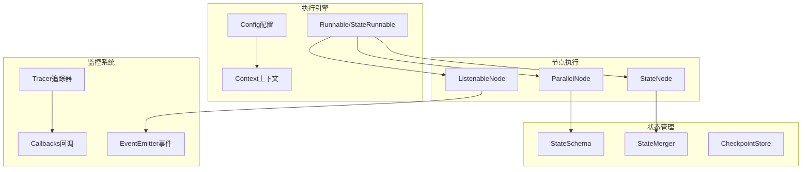
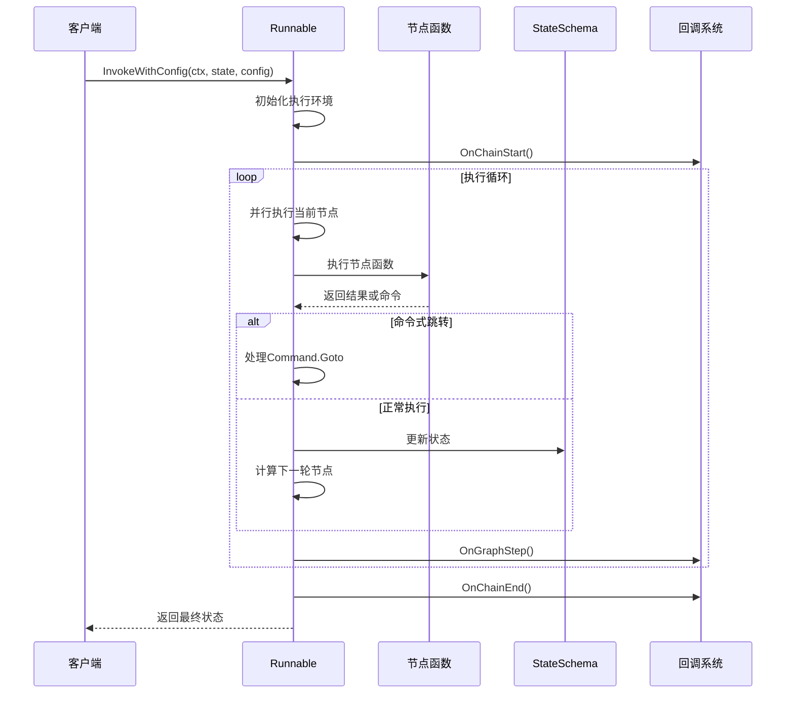
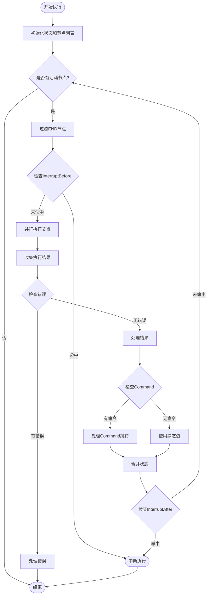
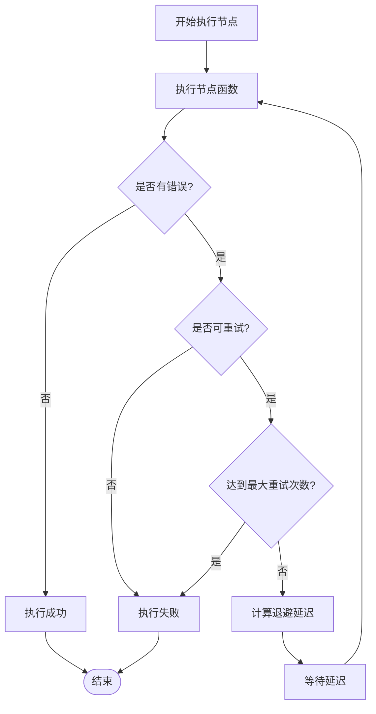
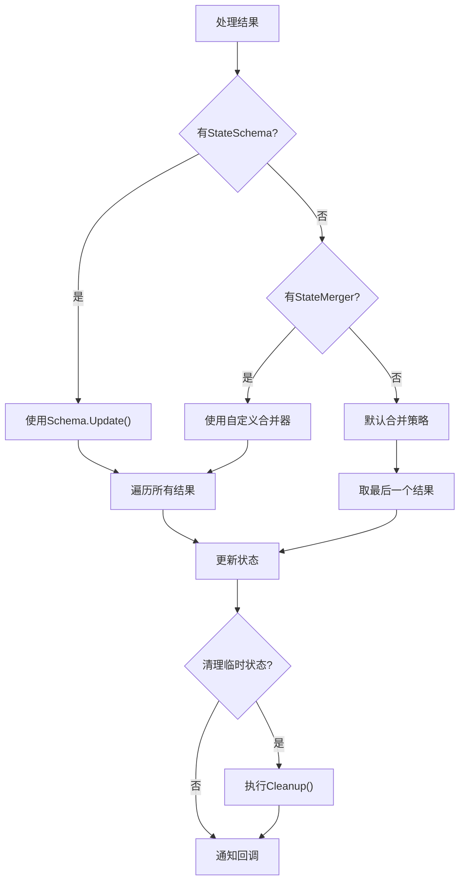
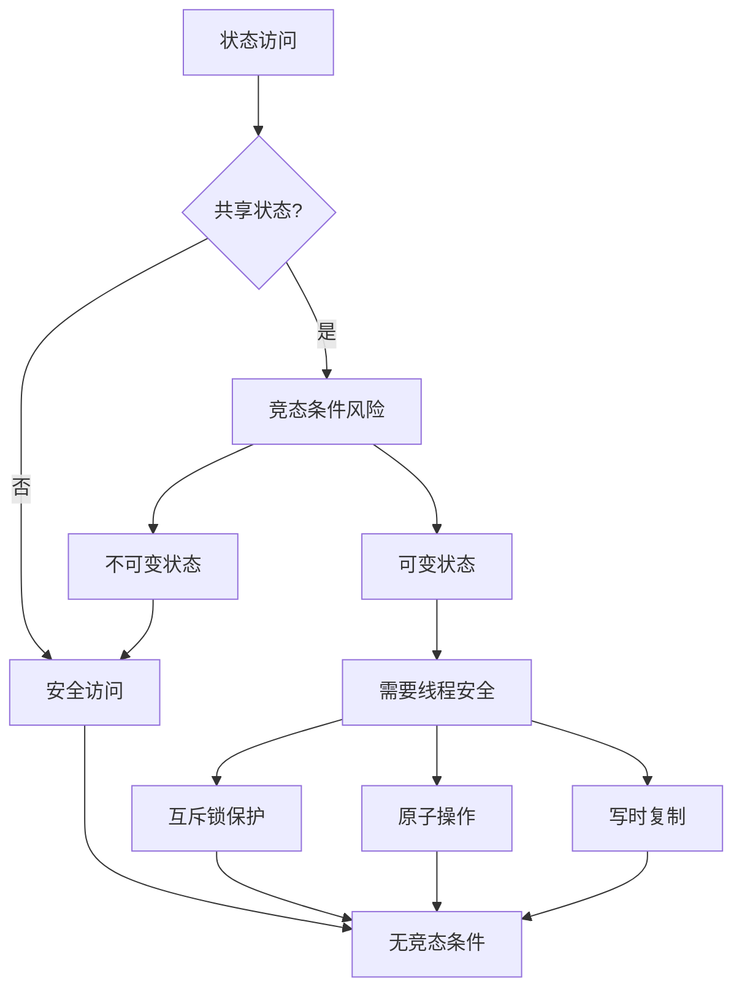
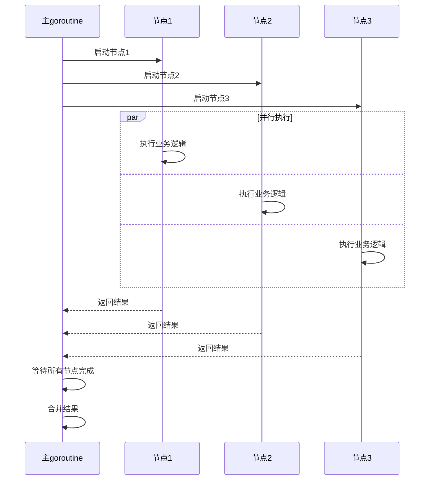
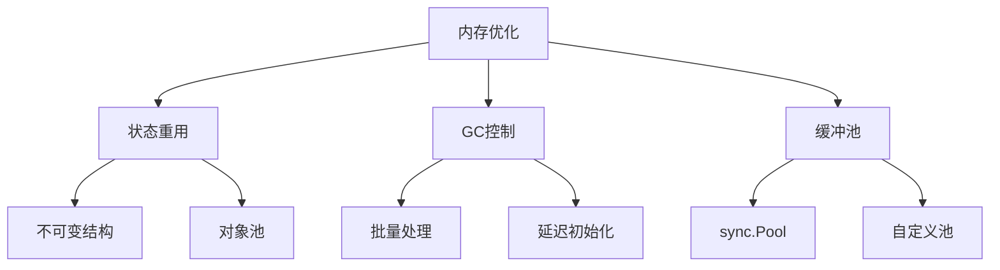

# 图执行机制深度技术文档

<cite>
**本文档引用的文件**
- [graph.go](file://graph/graph.go)
- [state_graph.go](file://graph/state_graph.go)
- [command.go](file://graph/command.go)
- [config.go](file://graph/config.go)
- [parallel.go](file://graph/parallel.go)
- [listeners.go](file://graph/listeners.go)
- [tracing.go](file://graph/tracing.go)
- [context.go](file://graph/context.go)
- [main.go](file://examples/parallel_execution/main.go)
- [main.go](file://examples/dynamic_interrupt/main.go)
- [main.go](file://examples/command_api/main.go)
- [main.go](file://examples/time_travel/main.go)
</cite>

## 目录
1. [简介](#简介)
2. [核心架构概览](#核心架构概览)
3. [Runnable 和 StateRunnable 执行机制](#runnable-和-staterunnable-执行机制)
4. [并行节点执行与同步控制](#并行节点执行与同步控制)
5. [上下文传递与配置管理](#上下文传递与配置管理)
6. [命令式跳转机制](#命令式跳转机制)
7. [错误处理与中断机制](#错误处理与中断机制)
8. [状态合并与回调通知](#状态合并与回调通知)
9. [追踪日志系统](#追踪日志系统)
10. [并发安全与竞态条件](#并发安全与竞态条件)
11. [性能优化建议](#性能优化建议)
12. [总结](#总结)

## 简介

langgraphgo 的图执行机制是一个高度灵活且功能强大的工作流引擎，支持同步和异步执行模式、并行节点处理、动态跳转控制以及丰富的可观测性功能。该系统通过精心设计的架构，实现了高效的状态管理和复杂的执行流程控制。

## 核心架构概览

图执行机制的核心由以下几个关键组件构成：



**图表来源**
- [graph.go](file://graph/graph.go#L140-L170)
- [state_graph.go](file://graph/state_graph.go#L99-L115)
- [parallel.go](file://graph/parallel.go#L9-L21)

**章节来源**
- [graph.go](file://graph/graph.go#L1-L50)
- [state_graph.go](file://graph/state_graph.go#L1-L50)

## Runnable 和 StateRunnable 执行机制

### Invoke 方法执行流程

`Invoke` 和 `InvokeWithConfig` 方法是图执行的核心入口点，它们负责协调整个执行过程：



**图表来源**
- [graph.go](file://graph/graph.go#L174-L492)
- [state_graph.go](file://graph/state_graph.go#L115-L296)

### 执行循环核心逻辑

执行循环是图执行机制的心脏，它不断推进工作流直到完成：



**图表来源**
- [graph.go](file://graph/graph.go#L224-L475)
- [state_graph.go](file://graph/state_graph.go#L129-L294)

**章节来源**
- [graph.go](file://graph/graph.go#L174-L492)
- [state_graph.go](file://graph/state_graph.go#L115-L296)

## 并行节点执行与同步控制

### ParallelNode 实现机制

并行节点执行通过 Go 的 goroutine 和 sync.WaitGroup 实现：

```mermaid
classDiagram
class ParallelNode {
+nodes []Node
+name string
+Execute(ctx, state) (interface{}, error)
}
class MapReduceNode {
+name string
+mapNodes []Node
+reducer func
+Execute(ctx, state) (interface{}, error)
}
class ParallelExecution {
+results chan result
+wg sync.WaitGroup
+ExecuteNodes()
+CollectResults()
}
ParallelNode --> ParallelExecution : 使用
MapReduceNode --> ParallelNode : 包含
```

**图表来源**
- [parallel.go](file://graph/parallel.go#L9-L178)

### 并发安全机制

并行执行采用以下安全措施：

1. **goroutine 隔离**: 每个节点在独立的 goroutine 中执行
2. **panic 恢复**: 自动捕获和处理节点中的 panic
3. **WaitGroup 同步**: 确保所有节点完成后才继续
4. **通道通信**: 使用带缓冲的通道收集结果

**章节来源**
- [parallel.go](file://graph/parallel.go#L23-L83)

## 上下文传递与配置管理

### Config 结构与作用域

配置系统提供了灵活的执行控制机制：

```mermaid
classDiagram
class Config {
+Configurable map[string]interface{}
+Metadata map[string]interface{}
+Tags []string
+Callbacks []Callback
+ResumeFrom []string
+ResumeValue interface{}
+InterruptBefore []string
+InterruptAfter []string
}
class Context {
+WithValue(key, value) Context
+Value(key) interface{}
}
class WithConfig {
+InjectConfig(ctx, config) Context
+GetConfig(ctx) Config
}
Config --> Context : 注入到
WithConfig --> Context : 操作
```

**图表来源**
- [config.go](file://graph/config.go)
- [context.go](file://graph/context.go#L1-L16)

### 配置参数详解

| 参数 | 类型 | 描述 | 影响 |
|------|------|------|------|
| `ResumeFrom` | `[]string` | 指定从哪些节点重新开始执行 | 覆盖默认的执行路径 |
| `ResumeValue` | `interface{}` | 提供给中断节点的恢复值 | 直接返回给 `graph.Interrupt()` |
| `InterruptBefore` | `[]string` | 在指定节点前中断执行 | 触发 GraphInterrupt 错误 |
| `InterruptAfter` | `[]string` | 在指定节点后中断执行 | 返回当前状态和中断信息 |

**章节来源**
- [config.go](file://graph/config.go)
- [context.go](file://graph/context.go#L1-L16)

## 命令式跳转机制

### Command 结构与 Goto 功能

Command 对象允许节点动态控制执行流程：

```mermaid
classDiagram
class Command {
+Update interface{}
+Goto interface{}
}
class StateRunnable {
+InvokeWithConfig(ctx, state, config) (interface{}, error)
+executeNodeWithRetry(ctx, node, state) (interface{}, error)
}
class MessageGraph {
+Compile() (*Runnable, error)
+Invoke(ctx, state) (interface{}, error)
}
StateRunnable --> Command : 处理
MessageGraph --> Command : 支持
```

**图表来源**
- [command.go](file://graph/command.go#L1-L15)
- [state_graph.go](file://graph/state_graph.go#L178-L198)

### Goto 覆盖机制

Command.Goto 具有最高优先级，可以覆盖静态边定义：

```mermaid
flowchart TD
NodeResult["节点执行结果"] --> CheckCommand{"是否为Command?"}
CheckCommand --> |是| ExtractGoto["提取Goto目标"]
CheckCommand --> |否| UseStaticEdge["使用静态边"]
ExtractGoto --> TypeCheck{"Goto类型检查"}
TypeCheck --> |string| SingleNode["单个节点"]
TypeCheck --> |[]string| MultiNode["多个节点"]
SingleNode --> OverrideEdges["覆盖静态边"]
MultiNode --> OverrideEdges
UseStaticEdge --> CalculateNext["计算下一轮节点"]
OverrideEdges --> Deduplicate["去重处理"]
Deduplicate --> CalculateNext
CalculateNext --> ExecuteNext["执行下一轮"]
```

**图表来源**
- [graph.go](file://graph/graph.go#L393-L402)
- [state_graph.go](file://graph/state_graph.go#L225-L234)

**章节来源**
- [command.go](file://graph/command.go#L1-L15)
- [graph.go](file://graph/graph.go#L344-L360)

## 错误处理与中断机制

### GraphInterrupt 错误类型

系统提供了多种中断和错误处理机制：

```mermaid
classDiagram
class GraphInterrupt {
+Node string
+State interface{}
+NextNodes []string
+InterruptValue interface{}
+Error() string
}
class NodeInterrupt {
+Node string
+Value interface{}
}
class RetryPolicy {
+MaxRetries int
+BackoffStrategy BackoffStrategy
+RetryableErrors []string
}
GraphInterrupt --> NodeInterrupt : 包含
StateRunnable --> RetryPolicy : 使用
```

**图表来源**
- [graph.go](file://graph/graph.go#L24-L50)
- [state_graph.go](file://graph/state_graph.go#L34-L48)

### 中断触发时机

中断可以在以下时机触发：

1. **InterruptBefore**: 在节点执行前中断
2. **InterruptAfter**: 在节点执行后中断
3. **NodeInterrupt**: 节点主动中断

### 重试机制

StateRunnable 提供了内置的重试功能：



**图表来源**
- [state_graph.go](file://graph/state_graph.go#L299-L338)

**章节来源**
- [graph.go](file://graph/graph.go#L24-L50)
- [state_graph.go](file://graph/state_graph.go#L299-L338)

## 状态合并与回调通知

### 状态更新策略

系统支持多种状态合并策略：



**图表来源**
- [graph.go](file://graph/graph.go#L368-L388)
- [state_graph.go](file://graph/state_graph.go#L200-L220)

### 回调通知机制

回调系统提供了丰富的事件通知：

| 事件类型 | 触发时机 | 传递参数 |
|----------|----------|----------|
| `OnChainStart` | 图执行开始 | 输入状态、运行ID |
| `OnToolStart` | 节点开始执行 | 节点信息、输入数据 |
| `OnToolEnd` | 节点执行完成 | 输出数据、运行ID |
| `OnGraphStep` | 执行步骤完成 | 节点名称、状态 |
| `OnChainEnd` | 图执行结束 | 输出状态、运行ID |
| `OnChainError` | 执行出错 | 错误信息、运行ID |

**章节来源**
- [graph.go](file://graph/graph.go#L368-L388)
- [state_graph.go](file://graph/state_graph.go#L200-L220)

## 追踪日志系统

### Tracer 架构

追踪系统提供了完整的可观测性支持：

```mermaid
classDiagram
class Tracer {
+hooks []TraceHook
+spans map[string]*TraceSpan
+StartSpan(ctx, event, nodeName) *TraceSpan
+EndSpan(ctx, span, state, err)
+TraceEdgeTraversal(ctx, from, to)
}
class TraceSpan {
+ID string
+Event TraceEvent
+NodeName string
+StartTime time.Time
+EndTime time.Time
+Duration time.Duration
+State interface{}
+Error error
+Metadata map[string]interface{}
}
class TraceHook {
+OnEvent(ctx, span)
}
Tracer --> TraceSpan : 创建
Tracer --> TraceHook : 通知
```

**图表来源**
- [tracing.go](file://graph/tracing.go#L84-L148)

### 追踪事件类型

| 事件类型 | 描述 | 包含信息 |
|----------|------|----------|
| `TraceEventGraphStart` | 图执行开始 | 图标识、初始状态 |
| `TraceEventGraphEnd` | 图执行结束 | 最终状态、执行时间 |
| `TraceEventNodeStart` | 节点开始执行 | 节点名称、当前状态 |
| `TraceEventNodeEnd` | 节点执行完成 | 输出状态、执行时间 |
| `TraceEventNodeError` | 节点执行错误 | 错误详情、堆栈信息 |
| `TraceEventEdgeTraversal` | 边遍历 | 源节点、目标节点 |

**章节来源**
- [tracing.go](file://graph/tracing.go#L8-L68)

## 并发安全与竞态条件

### 竞态条件分析

图执行机制中可能存在的竞态条件：



### 并发安全最佳实践

1. **状态隔离**: 每个节点使用独立的状态副本
2. **只读访问**: 尽可能使用只读状态访问
3. **批量更新**: 通过 Schema 或 Merger 批量更新状态
4. **上下文传递**: 通过 Context 传递不可变数据

### 并发执行注意事项



**图表来源**
- [graph.go](file://graph/graph.go#L249-L318)

**章节来源**
- [graph.go](file://graph/graph.go#L249-L318)
- [parallel.go](file://graph/parallel.go#L35-L83)

## 性能优化建议

### 执行效率优化

1. **合理使用并行**: 对于 I/O 密集型任务启用并行执行
2. **状态设计**: 使用高效的 StateSchema 实现
3. **回调最小化**: 减少不必要的回调调用
4. **追踪控制**: 生产环境中禁用详细追踪

### 内存管理优化



### 监控指标建议

| 指标类型 | 关键指标 | 监控目的 |
|----------|----------|----------|
| 执行性能 | 平均执行时间、吞吐量 | 性能调优 |
| 资源使用 | 内存占用、CPU使用率 | 资源规划 |
| 错误统计 | 错误率、重试频率 | 稳定性监控 |
| 并发度 | 活跃goroutine数 | 并发控制 |

## 总结

langgraphgo 的图执行机制通过精心设计的架构，实现了高性能、高可靠性和高可观察性的工作流执行能力。其核心优势包括：

1. **灵活的执行模型**: 支持同步、异步和并行执行
2. **强大的控制能力**: 通过 Command 和配置参数实现精细控制
3. **完善的可观测性**: 提供全面的追踪、监控和调试支持
4. **健壮的错误处理**: 多层次的错误处理和恢复机制
5. **优秀的并发安全**: 通过 goroutine 隔离和同步机制保证线程安全

开发者在使用时应注意状态设计的安全性、合理利用并行执行能力，并根据具体需求选择合适的配置选项。通过深入理解这些机制，可以构建出高效稳定的工作流应用。