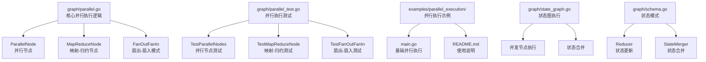
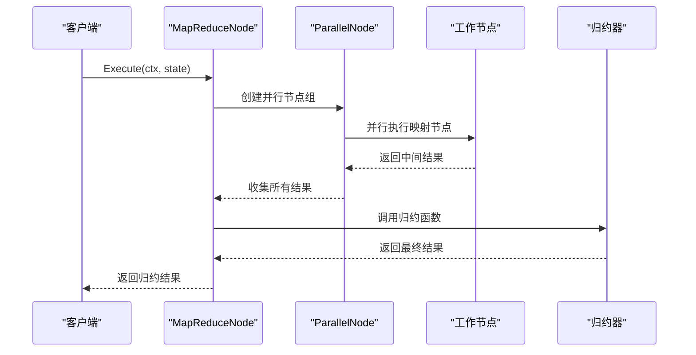
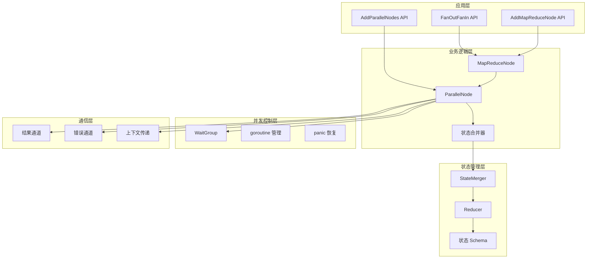
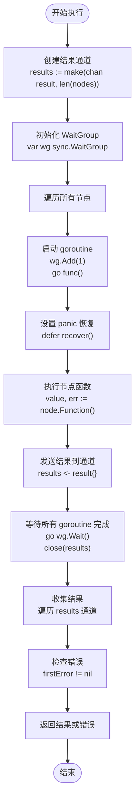
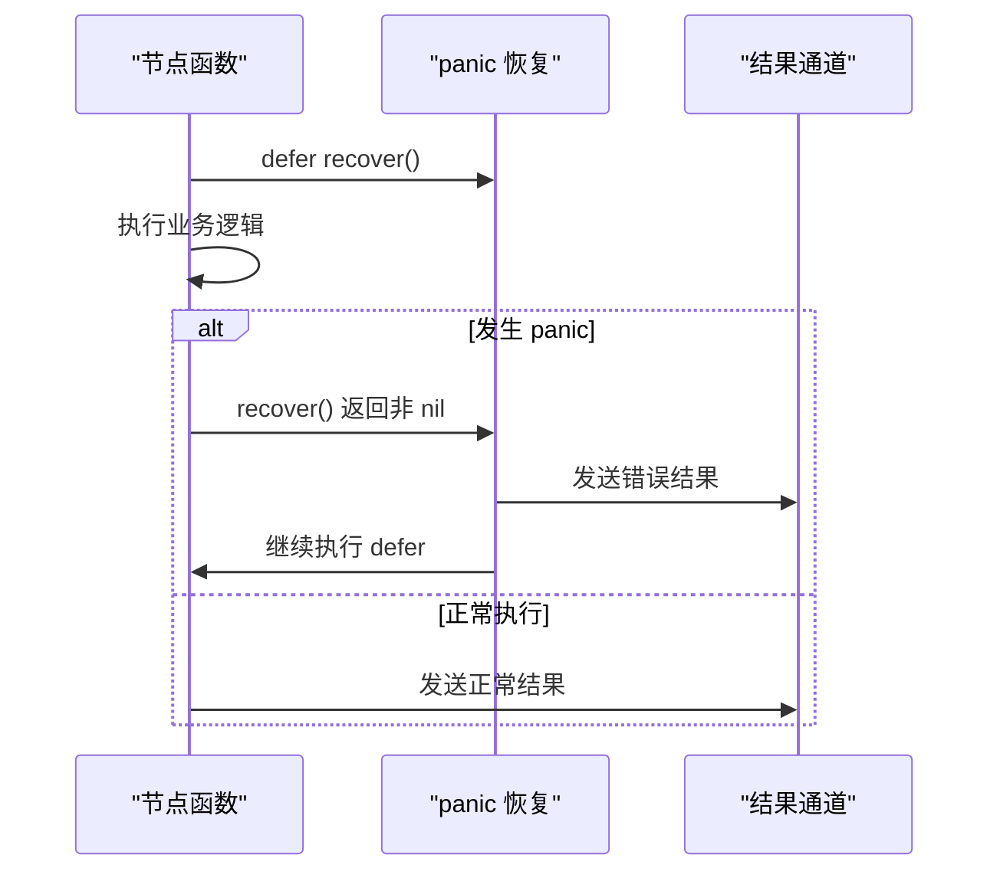
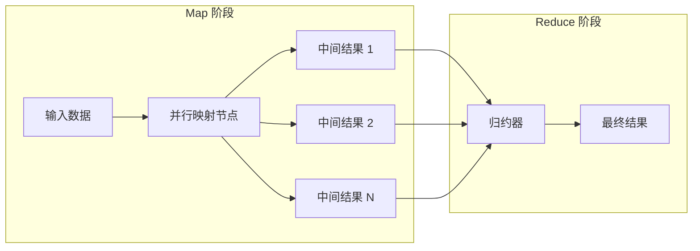
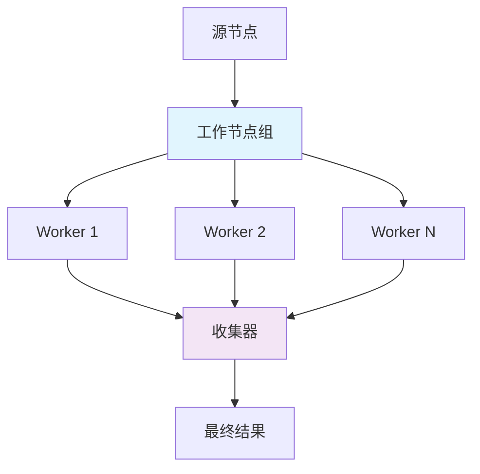
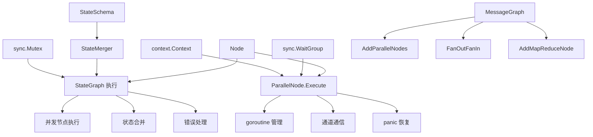
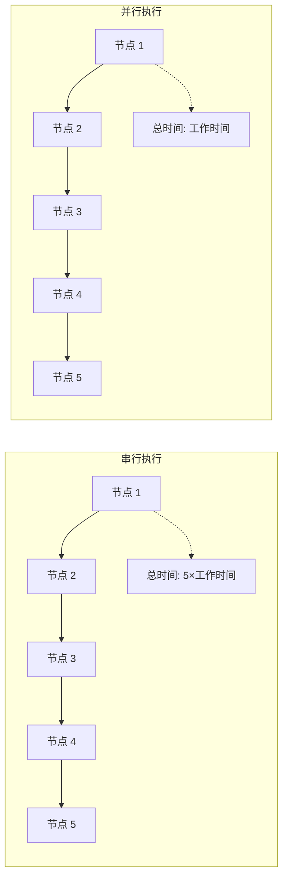

# 并行执行

<cite>
**本文档中引用的文件**
- [graph/parallel.go](file://graph/parallel.go)
- [graph/parallel_test.go](file://graph/parallel_test.go)
- [graph/parallel_execution_test.go](file://graph/parallel_execution_test.go)
- [examples/parallel_execution/main.go](file://examples/parallel_execution/main.go)
- [graph/graph.go](file://graph/graph.go)
- [graph/state_graph.go](file://graph/state_graph.go)
- [graph/schema.go](file://graph/schema.go)
- [examples/parallel_execution/README.md](file://examples/parallel_execution/README.md)
</cite>

## 目录
1. [简介](#简介)
2. [项目结构](#项目结构)
3. [核心组件](#核心组件)
4. [架构概览](#架构概览)
5. [详细组件分析](#详细组件分析)
6. [依赖关系分析](#依赖关系分析)
7. [性能考虑](#性能考虑)
8. [故障排除指南](#故障排除指南)
9. [结论](#结论)

## 简介

LangGraphGo 的并行执行机制是其核心功能之一，提供了强大的并发处理能力。该系统通过 `ParallelNode`、`MapReduceNode` 和 `FanOutFanIn` 三种主要模式，实现了高效的任务分发、同步等待、结果收集和错误处理。本文档深入分析这些组件的内部实现，包括 goroutine 管理、panic 恢复机制以及状态传递的线程安全性问题，并提供性能基准测试的解读。

## 项目结构

LangGraphGo 的并行执行功能主要分布在以下关键文件中：



**图表来源**
- [graph/parallel.go](file://graph/parallel.go#L1-L178)
- [graph/parallel_test.go](file://graph/parallel_test.go#L1-L361)
- [examples/parallel_execution/main.go](file://examples/parallel_execution/main.go#L1-L97)

**章节来源**
- [graph/parallel.go](file://graph/parallel.go#L1-L178)
- [examples/parallel_execution/main.go](file://examples/parallel_execution/main.go#L1-L97)

## 核心组件

### ParallelNode - 并行节点

`ParallelNode` 是并行执行的核心组件，负责管理一组可以同时执行的节点。

#### 数据结构设计

```mermaid
classDiagram
class ParallelNode {
+[]Node nodes
+string name
+NewParallelNode(name string, nodes ...Node) *ParallelNode
+Execute(ctx context.Context, state interface{}) (interface{}, error)
}
class Node {
+string Name
+func Function
+Execute(ctx context.Context, state interface{}) (interface{}, error)
}
class result {
+int index
+interface{} value
+error err
}
ParallelNode --> Node : "包含多个"
ParallelNode --> result : "收集结果"
```

**图表来源**
- [graph/parallel.go](file://graph/parallel.go#L10-L13)
- [graph/parallel.go](file://graph/parallel.go#L54-L60)

#### 执行流程

ParallelNode 的执行过程遵循以下步骤：

1. **任务分发**：为每个节点启动独立的 goroutine
2. **并发执行**：所有节点同时运行
3. **结果收集**：通过通道收集执行结果
4. **错误处理**：捕获并传播任何错误
5. **状态返回**：返回所有节点的结果数组

**章节来源**
- [graph/parallel.go](file://graph/parallel.go#L24-L82)

### MapReduceNode - 映射-归约节点

`MapReduceNode` 实现了经典的 Map-Reduce 并行计算模式。

#### 架构设计



**图表来源**
- [graph/parallel.go](file://graph/parallel.go#L118-L131)

**章节来源**
- [graph/parallel.go](file://graph/parallel.go#L101-L131)

### FanOutFanIn - 扇出-扇入模式

`FanOutFanIn` 提供了一种更灵活的并行执行模式，支持自定义工作节点和收集器。

#### 使用场景

这种模式特别适用于：
- 复杂的数据处理流水线
- 需要自定义结果聚合逻辑的场景
- 可配置的工作节点数量

**章节来源**
- [graph/parallel.go](file://graph/parallel.go#L154-L177)

## 架构概览

LangGraphGo 的并行执行架构采用分层设计，从底层的 goroutine 管理到高层的业务逻辑抽象：



**图表来源**
- [graph/parallel.go](file://graph/parallel.go#L1-L178)
- [graph/state_graph.go](file://graph/state_graph.go#L1-L200)

## 详细组件分析

### ParallelNode 内部实现

#### goroutine 管理机制

ParallelNode 使用 `sync.WaitGroup` 来管理并发 goroutine：



**图表来源**
- [graph/parallel.go](file://graph/parallel.go#L24-L82)

#### Panic 恢复机制

系统实现了完善的 panic 恢复机制：



**图表来源**
- [graph/parallel.go](file://graph/parallel.go#L41-L49)

#### 线程安全性分析

ParallelNode 的线程安全特性体现在：

1. **无共享可变状态**：每个 goroutine 处理独立的节点
2. **通道通信**：通过通道进行安全的结果传递
3. **WaitGroup 同步**：确保所有 goroutine 完成后再继续
4. **panic 恢复**：防止单个节点失败影响整个系统

**章节来源**
- [graph/parallel.go](file://graph/parallel.go#L24-L82)

### MapReduceNode 并行计算模式

#### Map-Reduce 流程

MapReduceNode 实现了两阶段的并行计算：



**图表来源**
- [graph/parallel.go](file://graph/parallel.go#L118-L131)

#### 错误处理策略

MapReduceNode 的错误处理遵循以下原则：

1. **早期失败**：map 阶段的任何错误都会导致整个操作失败
2. **错误传播**：错误信息包含详细的上下文信息
3. **资源清理**：确保所有 goroutine 在错误发生时正确退出

**章节来源**
- [graph/parallel.go](file://graph/parallel.go#L118-L131)

### FanOutFanIn 扇出-扇入模式

#### 灵活的架构设计

FanOutFanIn 模式提供了最大的灵活性：



**图表来源**
- [graph/parallel.go](file://graph/parallel.go#L154-L177)

#### API 设计特点

FanOutFanIn 方法的设计考虑了以下因素：

1. **向后兼容性**：保留了 `workers` 参数但未使用
2. **清晰的职责分离**：源节点负责触发，收集器负责聚合
3. **灵活的配置**：允许自定义工作节点和收集逻辑

**章节来源**
- [graph/parallel.go](file://graph/parallel.go#L154-L177)

### 状态管理系统

#### StateMerger 接口

状态合并是并行执行中的关键环节：

```mermaid
classDiagram
class StateMerger {
<<interface>>
+func(ctx Context, current interface{}, newStates []interface{}) (interface{}, error)
}
class MapSchema {
+map[string]Reducer Reducers
+map[string]bool EphemeralKeys
+Update(current, new interface{}) (interface{}, error)
+Cleanup(state interface{}) interface{}
}
class AppendReducer {
+func(current, new interface{}) (interface{}, error)
}
class OverwriteReducer {
+func(current, new interface{}) (interface{}, error)
}
StateMerger <|.. MapSchema
MapSchema --> AppendReducer
MapSchema --> OverwriteReducer
```

**图表来源**
- [graph/schema.go](file://graph/schema.go#L1-L185)

#### 并发状态更新

在并行执行中，状态更新需要考虑以下挑战：

1. **竞态条件**：多个 goroutine 同时修改状态
2. **一致性保证**：确保状态更新的原子性
3. **性能优化**：减少锁竞争和内存分配

**章节来源**
- [graph/schema.go](file://graph/schema.go#L1-L185)

## 依赖关系分析

### 核心依赖图



**图表来源**
- [graph/parallel.go](file://graph/parallel.go#L1-L7)
- [graph/state_graph.go](file://graph/state_graph.go#L1-L7)

### 外部依赖

并行执行模块依赖以下外部包：

| 依赖项 | 版本要求 | 用途 |
|--------|----------|------|
| context | Go 标准库 | 上下文传递和取消机制 |
| sync | Go 标准库 | 并发控制和同步原语 |
| testing | Go 标准库 | 单元测试框架 |

**章节来源**
- [graph/parallel.go](file://graph/parallel.go#L1-L7)

## 性能考虑

### 基准测试分析

系统提供了详细的基准测试来评估性能：

#### 并行 vs 串行性能对比



**图表来源**
- [graph/parallel_test.go](file://graph/parallel_test.go#L266-L360)

#### 性能优化建议

基于基准测试结果，以下优化策略被验证有效：

1. **合理的工作负载分布**：确保各并行任务的工作量均衡
2. **适当的并发度控制**：避免过多的 goroutine 创建开销
3. **内存使用优化**：减少不必要的状态复制
4. **通道缓冲区大小**：根据实际需求调整通道容量

### 吞吐量影响因素

并行执行对系统吞吐量的影响取决于多个因素：

| 因素 | 影响程度 | 优化建议 |
|------|----------|----------|
| CPU 密集型任务 | 高 | 增加并发节点数 |
| I/O 密集型任务 | 中等 | 保持适度并发度 |
| 内存使用 | 中等 | 优化状态结构 |
| 网络延迟 | 低 | 减少跨网络通信 |

**章节来源**
- [graph/parallel_test.go](file://graph/parallel_test.go#L266-L360)

## 故障排除指南

### 常见问题及解决方案

#### 并发死锁问题

**症状**：程序卡在并行执行阶段，无法完成

**原因分析**：
- goroutine 泄漏：某些 goroutine 未能正确退出
- 通道阻塞：结果通道未正确关闭
- 死锁：WaitGroup 计数不匹配

**解决方案**：
1. 检查 panic 恢复是否正确实施
2. 确保所有 goroutine 都调用了 `wg.Done()`
3. 验证通道关闭逻辑

#### 状态不一致问题

**症状**：并行执行后的状态不符合预期

**原因分析**：
- 状态合并器实现错误
- Reducer 函数存在竞态条件
- 并发读写冲突

**解决方案**：
1. 验证 StateMerger 的实现
2. 检查 Reducer 的线程安全性
3. 使用适当的同步机制

#### 性能瓶颈识别

**诊断步骤**：
1. 使用 Go 的 pprof 工具分析 CPU 和内存使用
2. 监控 goroutine 数量和通道使用情况
3. 分析网络和 I/O 操作的时间消耗

**章节来源**
- [graph/parallel_test.go](file://graph/parallel_test.go#L181-L360)

### 调试技巧

#### 日志记录策略

推荐的调试日志包括：

```mermaid
flowchart TD
A["节点启动"] --> B["节点执行中"]
B --> C["节点完成"]
C --> D["结果收集"]
D --> E["错误处理"]
A -.-> F["log.Info(\"Starting node %s\", name)"]
B -.-> G["log.Debug(\"Executing node %s\", name)"]
C -.-> H["log.Info(\"Node %s completed\", name)"]
D -.-> I["log.Debug(\"Collecting results\")"]
E -.-> J["log.Error(\"Node %s failed: %v\", name, err)"]
```

#### 单元测试最佳实践

针对并行执行的测试应关注：

1. **并发安全性测试**：验证多 goroutine 场景下的正确性
2. **错误传播测试**：确保错误能够正确传播
3. **超时处理测试**：验证 context 取消机制
4. **资源泄漏测试**：检查 goroutine 和内存泄漏

**章节来源**
- [graph/parallel_test.go](file://graph/parallel_test.go#L1-L361)

## 结论

LangGraphGo 的并行执行机制通过精心设计的架构和完善的错误处理，为开发者提供了强大而可靠的并发处理能力。主要优势包括：

1. **简洁的 API 设计**：通过 `AddParallelNodes`、`AddMapReduceNode` 和 `FanOutFanIn` 提供了直观的并行编程接口
2. **强大的错误处理**：完善的 panic 恢复和错误传播机制确保系统的稳定性
3. **灵活的状态管理**：通过 StateMerger 和 Reducer 实现了复杂的状态合并逻辑
4. **优秀的性能表现**：经过充分的基准测试验证，在适当场景下能显著提升吞吐量

对于开发者而言，理解和掌握这些并行执行机制的关键在于：

- 理解 goroutine 生命周期和同步原语的使用
- 掌握状态合并的最佳实践
- 学会编写线程安全的代码
- 掌握性能调优和故障排除技巧

随着系统规模的增长和复杂度的提升，这些并行执行机制将继续发挥重要作用，为构建高性能的分布式应用提供坚实的基础。