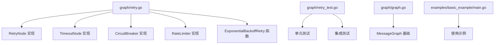
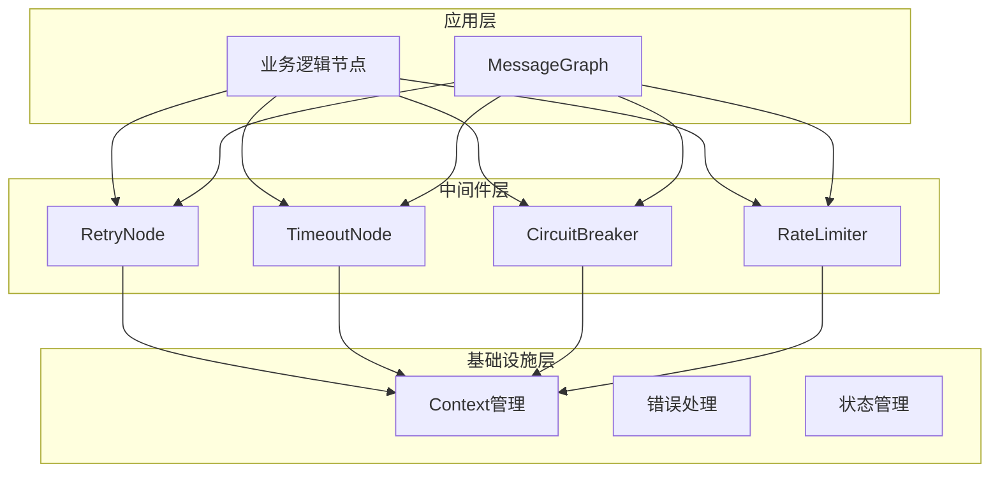
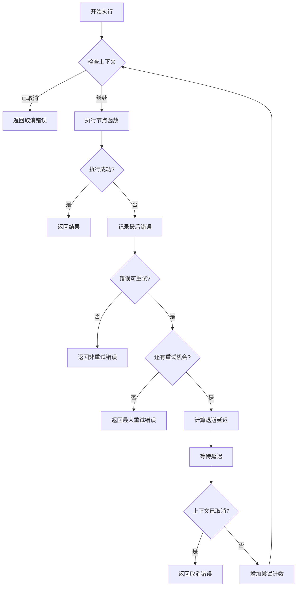
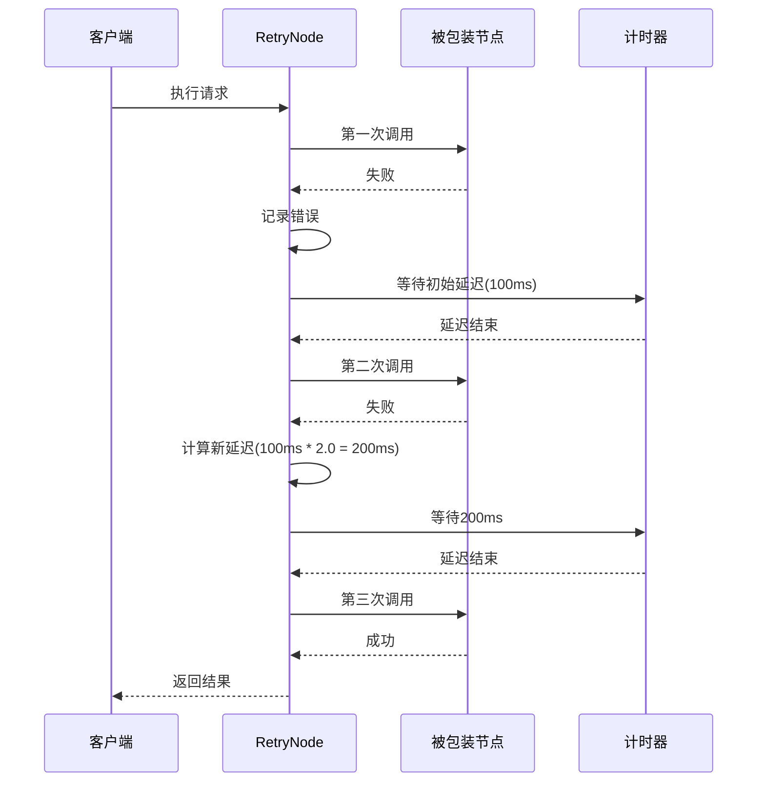
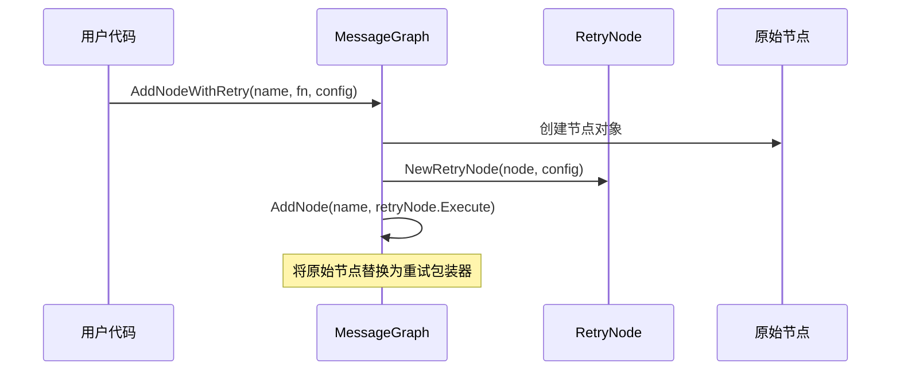
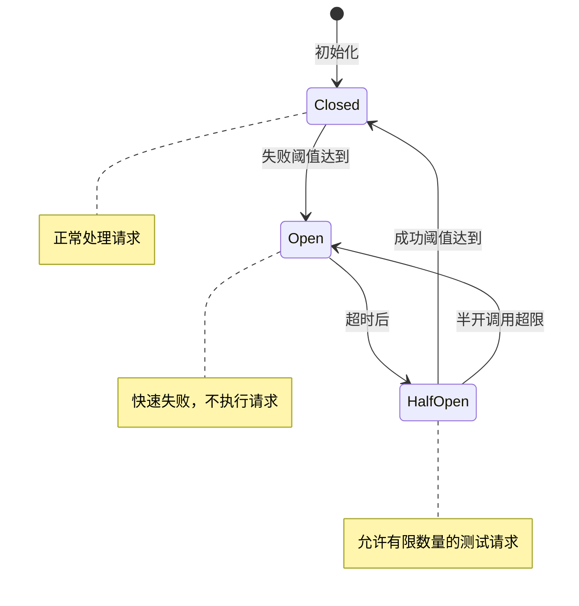
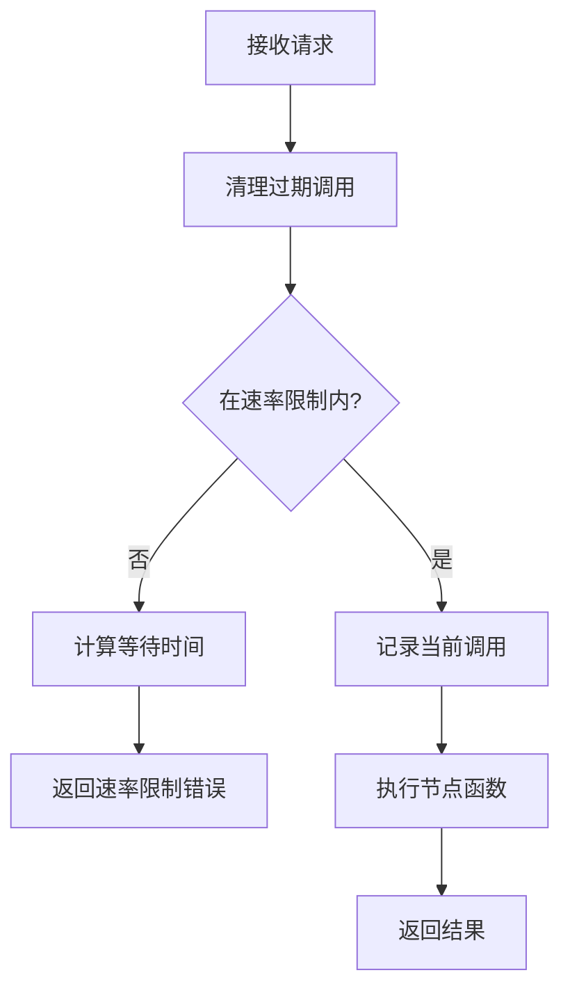
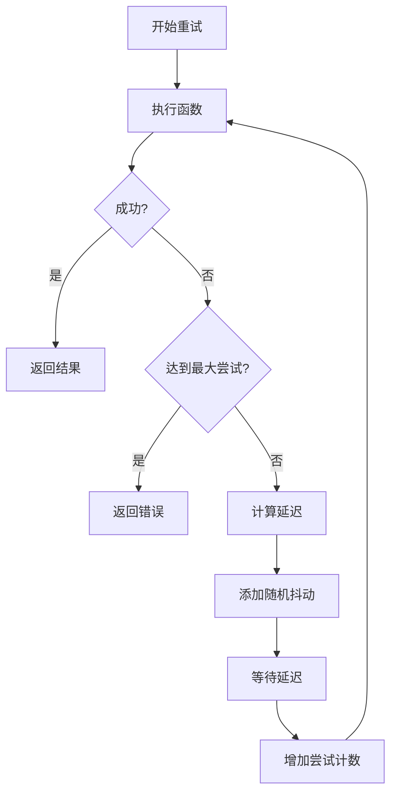
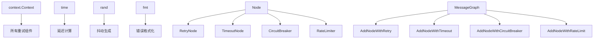
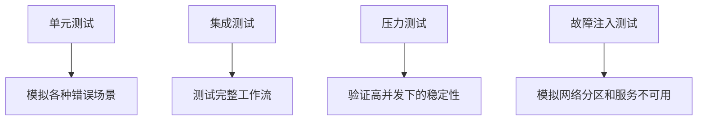

# 错误重试策略

<cite>
**本文档中引用的文件**
- [graph/retry.go](file://graph/retry.go)
- [graph/retry_test.go](file://graph/retry_test.go)
- [graph/graph.go](file://graph/graph.go)
- [examples/basic_example/main.go](file://examples/basic_example/main.go)
</cite>

## 目录
1. [简介](#简介)
2. [项目结构](#项目结构)
3. [核心组件](#核心组件)
4. [架构概览](#架构概览)
5. [详细组件分析](#详细组件分析)
6. [依赖关系分析](#依赖关系分析)
7. [性能考虑](#性能考虑)
8. [故障排除指南](#故障排除指南)
9. [结论](#结论)

## 简介

langgraphgo 提供了一套完整的错误处理和重试机制，旨在提高分布式工作流系统的可靠性和韧性。该框架实现了多种重试策略，包括指数退避、固定间隔、超时控制、断路器模式和速率限制等高级功能。这些机制能够有效应对网络不稳定、服务过载和临时性故障等常见问题。

本文档深入解析了 RetryNode 的实现原理，详细说明了重试策略的配置方式、执行流程以及最佳实践。通过实际代码示例和配置参数说明，帮助开发者理解和正确使用这些强大的错误恢复功能。

## 项目结构

langgraphgo 的错误重试机制主要集中在 `graph` 包中，包含以下关键文件：



**图表来源**
- [graph/retry.go](file://graph/retry.go#L1-L364)
- [graph/retry_test.go](file://graph/retry_test.go#L1-L566)

**章节来源**
- [graph/retry.go](file://graph/retry.go#L1-L364)
- [graph/retry_test.go](file://graph/retry_test.go#L1-L566)

## 核心组件

### RetryConfig 配置结构

RetryConfig 是重试机制的核心配置结构，定义了重试行为的所有参数：

| 参数 | 类型 | 默认值 | 描述 |
|------|------|--------|------|
| MaxAttempts | int | 3 | 最大重试次数 |
| InitialDelay | time.Duration | 100ms | 初始退避延迟时间 |
| MaxDelay | time.Duration | 5s | 最大退避延迟时间 |
| BackoffFactor | float64 | 2.0 | 指数退避因子 |
| RetryableErrors | func(error) bool | 返回 true | 决定是否应该触发重试的函数 |

### RetryNode 核心实现

RetryNode 是一个包装器结构，负责在现有节点基础上添加重试逻辑：

```mermaid
classDiagram
class RetryNode {
+Node node
+RetryConfig config
+Execute(ctx, state) (interface{}, error)
}
class RetryConfig {
+int MaxAttempts
+time.Duration InitialDelay
+time.Duration MaxDelay
+float64 BackoffFactor
+func(error) bool RetryableErrors
}
class Node {
+string Name
+func(ctx, state) (interface{}, error) Function
}
RetryNode --> RetryConfig : "使用"
RetryNode --> Node : "包装"
```

**图表来源**
- [graph/retry.go](file://graph/retry.go#L34-L48)
- [graph/retry.go](file://graph/retry.go#L11-L27)

**章节来源**
- [graph/retry.go](file://graph/retry.go#L11-L48)

## 架构概览

langgraphgo 的错误处理架构采用分层设计，提供了从底层重试到高层工作流管理的完整解决方案：



**图表来源**
- [graph/retry.go](file://graph/retry.go#L97-L327)
- [graph/graph.go](file://graph/graph.go#L103-L108)

## 详细组件分析

### RetryNode 实现原理

#### 重试策略详解

RetryNode 实现了智能重试逻辑，支持多种重试策略：



**图表来源**
- [graph/retry.go](file://graph/retry.go#L52-L95)

#### 指数退避算法

指数退避是 RetryNode 的核心算法，实现了动态延迟调整：



**图表来源**
- [graph/retry.go](file://graph/retry.go#L52-L95)

#### AddNodeWithRetry 方法

AddNodeWithRetry 是将普通节点转换为可重试节点的关键方法：



**图表来源**
- [graph/retry.go](file://graph/retry.go#L97-L108)

**章节来源**
- [graph/retry.go](file://graph/retry.go#L52-L95)
- [graph/retry.go](file://graph/retry.go#L97-L108)

### TimeoutNode 超时控制

TimeoutNode 为节点执行添加超时保护，防止长时间阻塞：

```mermaid
classDiagram
class TimeoutNode {
+Node node
+time.Duration timeout
+Execute(ctx, state) (interface{}, error)
}
class TimeoutNode_Execute {
+context.WithTimeout()
+goroutine 执行
+select 语句
}
TimeoutNode --> TimeoutNode_Execute : "实现"
```

**图表来源**
- [graph/retry.go](file://graph/retry.go#L111-L151)

**章节来源**
- [graph/retry.go](file://graph/retry.go#L111-L151)

### CircuitBreaker 断路器模式

断路器模式提供智能的故障隔离和恢复机制：



**图表来源**
- [graph/retry.go](file://graph/retry.go#L178-L252)

**章节来源**
- [graph/retry.go](file://graph/retry.go#L178-L252)

### RateLimiter 速率限制

速率限制器控制节点的调用频率，防止服务过载：



**图表来源**
- [graph/retry.go](file://graph/retry.go#L268-L312)

**章节来源**
- [graph/retry.go](file://graph/retry.go#L268-L312)

### ExponentialBackoffRetry 独立重试函数

ExponentialBackoffRetry 提供独立的指数退避重试功能：



**图表来源**
- [graph/retry.go](file://graph/retry.go#L329-L363)

**章节来源**
- [graph/retry.go](file://graph/retry.go#L329-L363)

## 依赖关系分析

langgraphgo 的错误重试机制具有清晰的依赖层次：



**图表来源**
- [graph/retry.go](file://graph/retry.go#L1-L10)

**章节来源**
- [graph/retry.go](file://graph/retry.go#L1-L10)

## 性能考虑

### 重试对延迟的影响

重试机制会显著影响工作流的整体延迟，需要合理配置参数：

| 场景 | 默认配置 | 预期延迟 | 适用场景 |
|------|----------|----------|----------|
| 快速失败 | MaxAttempts=1 | 基础延迟 | 对延迟敏感的应用 |
| 平衡策略 | MaxAttempts=3, BackoffFactor=2.0 | 300-1000ms | 一般应用场景 |
| 强韧性 | MaxAttempts=5, BackoffFactor=3.0 | 1-10s | 关键业务流程 |

### 内存使用优化

- **CircuitBreaker**: 使用固定大小的状态变量，内存占用稳定
- **RateLimiter**: 动态维护调用时间戳列表，但有窗口限制
- **RetryNode**: 仅维护基本配置和状态，内存开销最小

### 并发安全性

所有重试组件都经过并发安全设计：
- 使用原子操作保护共享状态
- 适当的锁机制避免竞态条件
- 上下文取消信号的及时响应

## 故障排除指南

### 常见问题及解决方案

#### 重试循环导致无限等待

**问题**: 配置不当导致节点持续重试而不返回结果

**解决方案**:
```go
// 推荐配置
config := &graph.RetryConfig{
    MaxAttempts:   5,           // 限制最大重试次数
    InitialDelay:  100 * time.Millisecond,
    MaxDelay:      10 * time.Second,
    BackoffFactor: 2.0,
    RetryableErrors: func(err error) bool {
        // 只对特定类型的错误进行重试
        return strings.Contains(err.Error(), "temporary")
    },
}
```

#### 上下文取消未被正确处理

**问题**: 在长时间运行的重试过程中，上下文取消信号被忽略

**解决方案**: RetryNode 和 TimeoutNode 都实现了上下文检查，确保及时响应取消信号。

#### 断路器状态异常

**问题**: 断路器无法正常切换状态

**解决方案**: 检查失败阈值和成功阈值配置，确保数值合理。建议使用默认配置进行测试。

**章节来源**
- [graph/retry_test.go](file://graph/retry_test.go#L17-L566)

### 测试和验证

推荐的测试策略：



**章节来源**
- [graph/retry_test.go](file://graph/retry_test.go#L17-L566)

## 结论

langgraphgo 的错误重试机制提供了一套完整而灵活的解决方案，能够有效应对分布式系统中的各种故障场景。通过合理配置重试参数、结合超时控制、断路器模式和速率限制，可以构建高度可靠的分布式工作流系统。

关键优势：
- **模块化设计**: 各种重试策略可以独立使用或组合
- **智能退避**: 指数退避算法配合随机抖动，避免惊群效应
- **上下文感知**: 完整支持 Go 的上下文取消机制
- **性能优化**: 最小化内存占用和 CPU 开销
- **易于测试**: 提供丰富的测试用例和边界情况覆盖

在实际应用中，建议根据具体的业务需求和系统特性，选择合适的重试策略组合，并通过充分的测试验证配置的有效性。同时，要注意监控重试行为对系统性能的影响，避免过度重试导致的资源浪费。