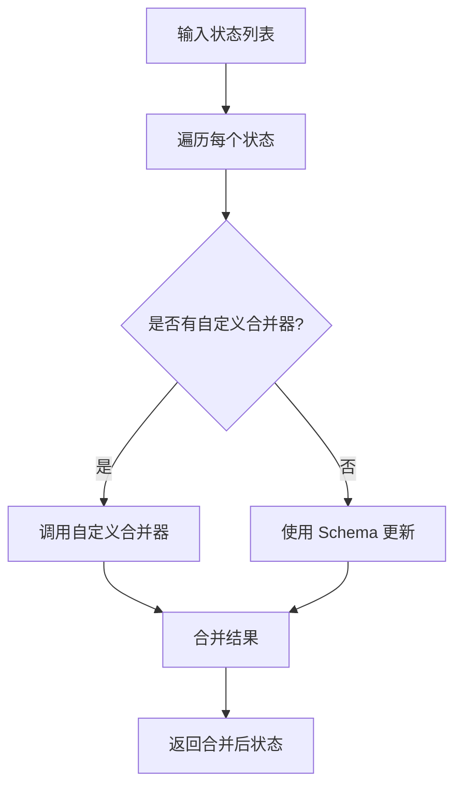
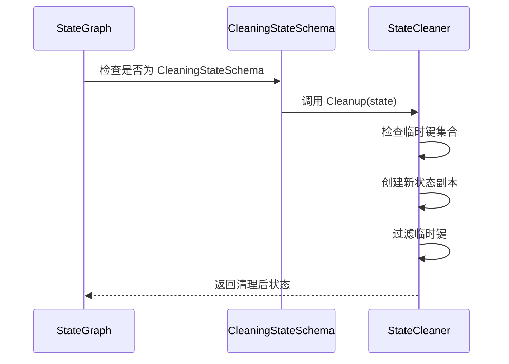
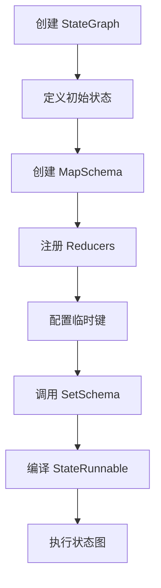
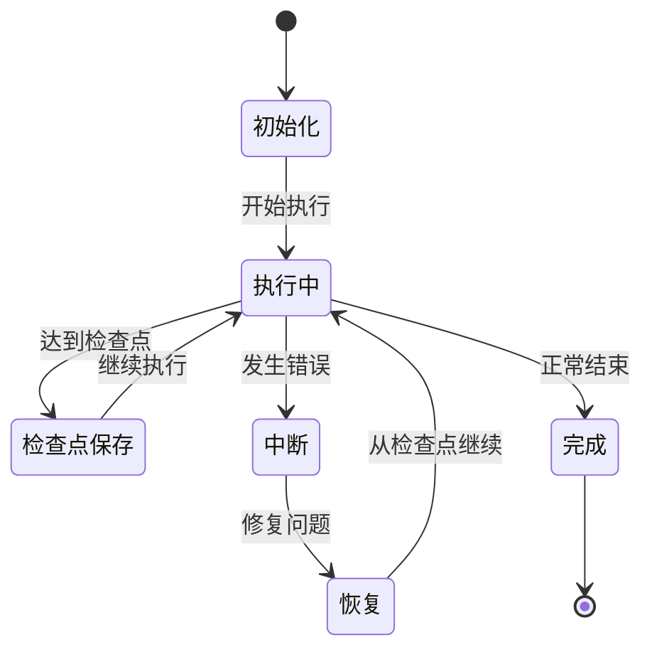
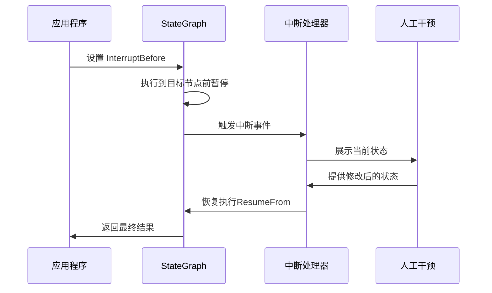
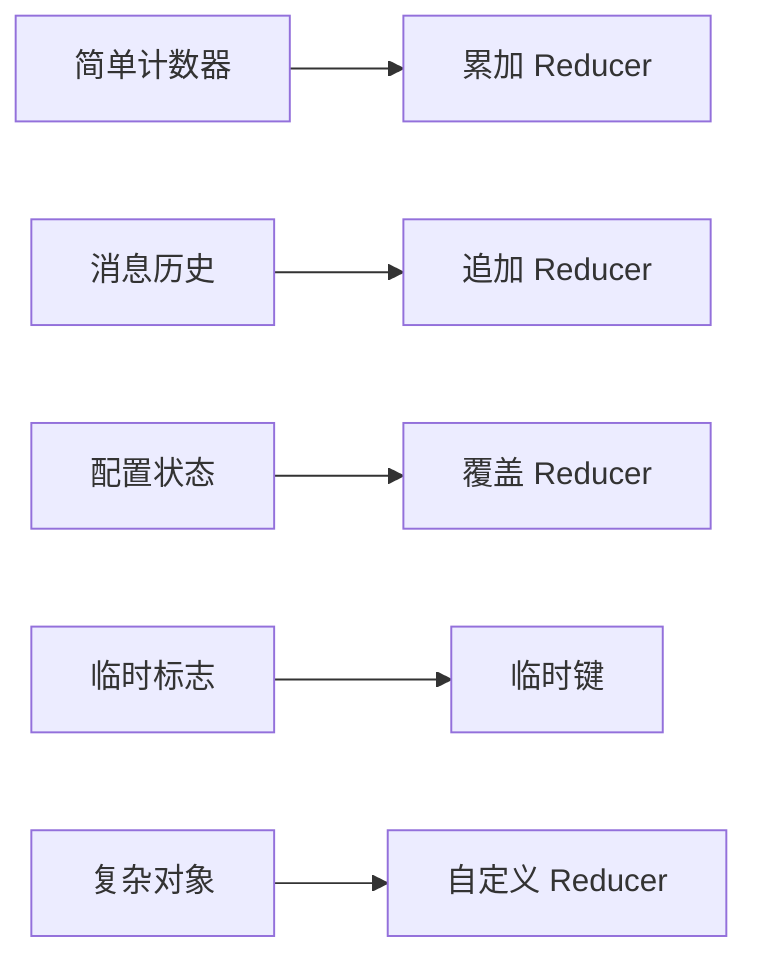

# 状态图

<cite>
**本文档引用的文件**
- [graph/state_graph.go](file://graph/state_graph.go)
- [graph/schema.go](file://graph/schema.go)
- [graph/messages_graph.go](file://graph/messages_graph.go)
- [examples/state_schema/main.go](file://examples/state_schema/main.go)
- [examples/state_schema/README.md](file://examples/state_schema/README.md)
- [examples/memory_basic/main.go](file://examples/memory_basic/main.go)
- [examples/memory_chatbot/main.go](file://examples/memory_chatbot/main.go)
- [examples/human_in_the_loop/main.go](file://examples/human_in_the_loop/main.go)
- [examples/human_in_the_loop/README.md](file://examples/human_in_the_loop/README.md)
- [examples/time_travel/main.go](file://examples/time_travel/main.go)
- [examples/time_travel/README.md](file://examples/time_travel/README.md)
- [graph/checkpointing.go](file://graph/checkpointing.go)
- [graph/update_state_test.go](file://graph/update_state_test.go)
- [prebuilt/rag.go](file://prebuilt/rag.go)
- [prebuilt/react_agent.go](file://prebuilt/react_agent.go)
- [graph/state_graph_typed.go](file://graph/state_graph_typed.go)
- [graph/schema_typed.go](file://graph/schema_typed.go)
- [graph/graph.go](file://graph/graph.go)
- [docs/GENERIC/RFC_GENERIC_STATEGRAPH.md](file://docs/GENERIC/RFC_GENERIC_STATEGRAPH.md)
- [docs/MERGE_SUMMARY.md](file://docs/MERGE_SUMMARY.md)
- [docs/MESSAGEGRAPH_DELETION_SUMMARY.md](file://docs/MESSAGEGRAPH_DELETION_SUMMARY.md)
- [examples/generic_state_graph/main.go](file://examples/generic_state_graph/main.go)
</cite>

## 更新摘要
**已更改内容**
- 更新了文档以反映从MessageGraph到StateGraph的架构合并
- 新增了泛型类型系统（StateGraphTyped[S]）的详细说明
- 更新了核心架构、状态模式、状态合并器等章节以包含泛型版本
- 添加了新的“泛型状态图”章节
- 更新了所有代码示例和图表以反映最新的API设计

## 目录
1. [简介](#简介)
2. [核心架构](#核心架构)
3. [状态模式与 Schema 定义](#状态模式与-schema-定义)
4. [状态合并器与自定义逻辑](#状态合并器与自定义逻辑)
5. [状态清理机制](#状态清理机制)
6. [SetSchema 方法详解](#setSchema-方法详解)
7. [持久化检查点](#持久化检查点)
8. [人机交互场景](#人机交互场景)
9. [预构建组件集成](#预构建组件集成)
10. [泛型状态图](#泛型状态图)
11. [最佳实践与示例](#最佳实践与示例)
12. [总结](#总结)

## 简介

LangGraphGo 的状态图（StateGraph）是一个强大的状态管理系统，相较于基础的消息图（MessageGraph），提供了更丰富的状态管理模式和更灵活的数据处理能力。状态图通过结构化的状态模式、智能的状态合并机制和持久化能力，为复杂的多步骤工作流和人机交互场景提供了坚实的基础。

根据最新的架构更新，MessageGraph 已与 StateGraph 合并，所有 MessageGraph 的功能现在都集成在 StateGraph 中。同时，引入了泛型类型系统（StateGraphTyped[S]），为开发者提供了编译时类型安全。

状态图的核心优势在于：
- **架构统一**：StateGraph 现在包含所有 MessageGraph 的功能，消除了代码重复
- **结构化状态管理**：通过 StateSchema 定义明确的状态结构和更新规则
- **智能状态合并**：支持多种合并策略，满足不同业务场景的需求
- **持久化能力**：完整的检查点机制确保状态的可恢复性
- **人机交互支持**：内置中断和恢复机制，支持人工干预
- **泛型类型安全**：通过 StateGraphTyped[S] 提供编译时类型检查
- **预构建组件集成**：与 RAG、Agent 等预构建组件无缝协作

**章节来源**
- [docs/MESSAGEGRAPH_DELETION_SUMMARY.md](file://docs/MESSAGEGRAPH_DELETION_SUMMARY.md#L1-L229)
- [docs/MERGE_SUMMARY.md](file://docs/MERGE_SUMMARY.md#L83-L237)

## 核心架构

StateGraph 的核心架构围绕状态管理和流程控制展开，其设计体现了现代状态机的最佳实践。最新的架构合并了 MessageGraph 的功能，并引入了泛型版本。

```mermaid
classDiagram
class StateGraph {
+map~string,Node~ nodes
+[]Edge edges
+map~string,func~ conditionalEdges
+string entryPoint
+RetryPolicy retryPolicy
+StateMerger stateMerger
+StateSchema Schema
+AddNode(name, fn)
+AddEdge(from, to)
+AddConditionalEdge(from, condition)
+SetEntryPoint(name)
+SetRetryPolicy(policy)
+SetStateMerger(merger)
+SetSchema(schema)
}
class StateSchema {
<<interface>>
+Init() interface{}
+Update(current, new) (interface{}, error)
}
class MapSchema {
+map~string,Reducer~ Reducers
+map~string,bool~ EphemeralKeys
+RegisterReducer(key, reducer)
+RegisterChannel(key, reducer, isEphemeral)
+Init() interface{}
+Update(current, new) (interface{}, error)
+Cleanup(state) interface{}
}
class StateRunnable {
+*StateGraph graph
+Invoke(ctx, initialState) (interface{}, error)
+InvokeWithConfig(ctx, initialState, config) (interface{}, error)
}
class ListenableStateGraph {
+*StateGraph StateGraph
+*EventEmitter eventEmitter
+AddListener(listener)
}
class StateGraphTyped[S] {
+map~string,NodeTyped[S]~ nodes
+[]Edge edges
+map~string,func~ conditionalEdges
+string entryPoint
+RetryPolicy retryPolicy
+StateMergerTyped[S] stateMerger
+StateSchemaTyped[S] Schema
+AddNode(name, fn)
+AddEdge(from, to)
+AddConditionalEdge(from, condition)
+SetEntryPoint(name)
+SetRetryPolicy(policy)
+SetStateMerger(merger)
+SetSchema(schema)
}
class StateRunnableTyped[S] {
+*StateGraphTyped[S] graph
+Invoke(ctx, initialState) (S, error)
+InvokeWithConfig(ctx, initialState, config) (S, error)
}
class StructSchema[S] {
+S InitialValue
+func(S, S) (S, error) MergeFunc
+Init() S
+Update(current, new) (S, error)
}
StateGraph --> StateSchema : "uses"
StateGraph --> StateRunnable : "compiles to"
StateGraph <|-- ListenableStateGraph : "extends"
MapSchema ..|> StateSchema : "implements"
StateGraphTyped[S] --> StateSchemaTyped[S] : "uses"
StateGraphTyped[S] --> StateRunnableTyped[S] : "compiles to"
StructSchema[S] ..|> StateSchemaTyped[S] : "implements"
```

**图表来源**
- [graph/state_graph.go](file://graph/state_graph.go#L11-L32)
- [graph/schema.go](file://graph/schema.go#L12-L19)
- [graph/state_graph_typed.go](file://graph/state_graph_typed.go#L25-L45)
- [graph/schema_typed.go](file://graph/schema_typed.go#L36-L39)

**章节来源**
- [graph/state_graph.go](file://graph/state_graph.go#L11-L32)
- [graph/schema.go](file://graph/schema.go#L12-L19)
- [graph/state_graph_typed.go](file://graph/state_graph_typed.go#L25-L45)

## 状态模式与 Schema 定义

状态图的核心在于其状态模式的设计，通过 StateSchema 接口定义了状态的结构和更新行为。这种设计使得状态管理既灵活又类型安全。

### StateSchema 接口设计

StateSchema 接口定义了状态的基本契约：

```mermaid
classDiagram
class StateSchema {
<<interface>>
+Init() interface{}
+Update(current, new) (interface{}, error)
}
class CleaningStateSchema {
<<interface>>
+Cleanup(state) interface{}
}
class MapSchema {
+map~string,Reducer~ Reducers
+map~string,bool~ EphemeralKeys
+Init() interface{}
+Update(current, new) (interface{}, error)
+Cleanup(state) interface{}
}
StateSchema <|-- CleaningStateSchema : "extends"
MapSchema ..|> StateSchema : "implements"
MapSchema ..|> CleaningStateSchema : "implements"
```

**图表来源**
- [graph/schema.go](file://graph/schema.go#L12-L19)
- [graph/schema.go](file://graph/schema.go#L21-L27)
- [graph/schema.go](file://graph/schema.go#L29-L42)

### MapSchema 实现详解

MapSchema 是最常用的状态模式实现，它基于键值对结构，支持为每个键注册特定的更新逻辑：

| 特性 | 描述 | 默认行为 |
|------|------|----------|
| 键值映射 | 将状态组织为字符串键到任意值的映射 | 支持任意 Go 类型 |
| Reducer 注册 | 为特定键注册自定义更新逻辑 | 可覆盖默认行为 |
| 临时键 | 支持标记某些键为临时，执行后自动清理 | 默认不过滤任何键 |
| 初始化 | 提供空状态的初始化方法 | 返回空 map |

**章节来源**
- [graph/schema.go](file://graph/schema.go#L29-L100)

## 状态合并器与自定义逻辑

状态合并器（StateMerger）提供了比 Schema 更高级的状态合并能力，适用于复杂的状态聚合场景。

### 自定义状态合并器



**图表来源**
- [graph/state_graph.go](file://graph/state_graph.go#L200-L220)

### Reducer 函数体系

LangGraphGo 提供了完整的 Reducer 函数体系，支持常见的状态更新模式：

| Reducer 类型 | 用途 | 实现特点 |
|-------------|------|----------|
| OverwriteReducer | 覆盖旧值 | 直接替换，不保留历史 |
| AppendReducer | 追加元素 | 支持切片追加和单元素添加 |
| SumReducer | 数值累加 | 适用于计数器和统计场景 |
| 自定义 Reducer | 业务特定逻辑 | 完全可定制的更新规则 |

**章节来源**
- [graph/schema.go](file://graph/schema.go#L140-L186)
- [examples/state_schema/main.go](file://examples/state_schema/main.go#L11-L22)

## 状态清理机制

状态清理机制是状态图的重要特性，特别是对于临时数据和中间状态的管理。

### 清理状态 Schema



**图表来源**
- [graph/state_graph.go](file://graph/state_graph.go#L277-L280)
- [graph/schema.go](file://graph/schema.go#L102-L137)

### 临时通道（Ephemeral Channels）

临时通道是一种特殊的状态管理机制，用于处理只在单个执行周期内有效的数据：

| 特性 | 描述 | 应用场景 |
|------|------|----------|
| 生命周期 | 仅在当前执行周期内有效 | 中间计算结果、临时标志 |
| 自动清理 | 执行完成后自动移除 | 避免状态污染 |
| 性能优化 | 减少不必要的状态存储 | 提高内存效率 |
| 类型安全 | 编译时检查临时键定义 | 防止运行时错误 |

**章节来源**
- [graph/schema.go](file://graph/schema.go#L30-L55)

## SetSchema 方法详解

SetSchema 方法是状态图配置的核心入口，它决定了整个状态管理的行为模式。

### Schema 配置流程



**图表来源**
- [examples/state_schema/main.go](file://examples/state_schema/main.go#L28-L41)

### Schema 配置最佳实践

| 配置项 | 推荐做法 | 注意事项 |
|--------|----------|----------|
| Reducer 选择 | 根据业务需求选择合适的合并策略 | 避免意外的状态覆盖 |
| 临时键设置 | 明确标识不需要持久化的数据 | 平衡性能和功能需求 |
| 初始化逻辑 | 提供有意义的默认状态 | 确保状态图的健壮性 |
| 类型安全 | 使用强类型状态结构 | 减少运行时错误 |

**章节来源**
- [examples/state_schema/main.go](file://examples/state_schema/main.go#L28-L41)
- [examples/state_schema/README.md](file://examples/state_schema/README.md#L14-L28)

## 持久化检查点

持久化检查点是状态图可靠性的基石，它确保了长时间运行的工作流能够从中断处恢复。

### 检查点存储架构

```mermaid
classDiagram
class CheckpointStore {
<<interface>>
+Save(ctx, checkpoint) error
+Load(ctx, checkpointID) (*Checkpoint, error)
+List(ctx, executionID) ([]*Checkpoint, error)
+Delete(ctx, checkpointID) error
+Clear(ctx, executionID) error
}
class Checkpoint {
+string ID
+string NodeName
+interface{} State
+map~string,interface{}~ Metadata
+time.Time Timestamp
+int Version
}
class MemoryCheckpointStore {
+map~string,*Checkpoint~ checkpoints
+sync.RWMutex mutex
+Save(ctx, checkpoint) error
+Load(ctx, checkpointID) (*Checkpoint, error)
+List(ctx, executionID) ([]*Checkpoint, error)
+Delete(ctx, checkpointID) error
+Clear(ctx, executionID) error
}
class SqliteCheckpointStore {
+*sql.DB db
+string tableName
+Save(ctx, checkpoint) error
+Load(ctx, checkpointID) (*Checkpoint, error)
+List(ctx, executionID) ([]*Checkpoint, error)
+Delete(ctx, checkpointID) error
+Clear(ctx, executionID) error
}
CheckpointStore <|.. MemoryCheckpointStore : "implements"
CheckpointStore <|.. SqliteCheckpointStore : "implements"
CheckpointStore --> Checkpoint : "manages"
```

**图表来源**
- [graph/checkpointing.go](file://graph/checkpointing.go#L12-L38)
- [graph/checkpointing.go](file://graph/checkpointing.go#L40-L50)

### 检查点生命周期



**章节来源**
- [graph/checkpointing.go](file://graph/checkpointing.go#L1-L485)

## 人机交互场景

人机交互（Human-in-the-Loop, HITL）是状态图的重要应用场景，它允许人类在自动化流程中进行干预和决策。

### 中断机制



**图表来源**
- [examples/human_in_the_loop/main.go](file://examples/human_in_the_loop/main.go#L68-L100)

### 状态编辑与时间旅行

时间旅行功能允许开发者探索不同的执行路径：

| 功能 | 描述 | 应用场景 |
|------|------|----------|
| 状态快照 | 保存特定执行点的状态 | 调试和测试 |
| 状态编辑 | 修改暂停时的状态 | 人工校正 |
| 分叉执行 | 从修改后的状态继续 | A/B 测试 |
| 历史追踪 | 记录所有状态变更 | 审计和分析 |

**章节来源**
- [examples/human_in_the_loop/README.md](file://examples/human_in_the_loop/README.md#L1-L85)
- [examples/time_travel/README.md](file://examples/time_travel/README.md#L1-L55)

## 预构建组件集成

状态图与 LangGraphGo 的预构建组件紧密集成，形成了完整的应用开发框架。

### RAG 系统集成

```mermaid
classDiagram
class RAGState {
+string Query
+[]Document Documents
+[]Document RetrievedDocuments
+[]DocumentWithScore RankedDocuments
+string Context
+string Answer
+[]string Citations
+map~string,interface{}~ Metadata
}
class RAGPipeline {
+*RAGConfig config
+*graph.MessageGraph graph
+BuildBasicRAG() error
+BuildAdvancedRAG() error
+BuildConditionalRAG() error
}
class StateGraph {
+StateSchema Schema
+SetSchema(schema)
}
RAGPipeline --> RAGState : "manages"
StateGraph --> RAGState : "integrates"
```

**图表来源**
- [prebuilt/rag.go](file://prebuilt/rag.go#L57-L67)
- [prebuilt/rag.go](file://prebuilt/rag.go#L107-L123)

### React Agent 集成

React Agent 展示了状态图在多轮对话和工具调用场景中的应用：

| 组件 | 功能 | 状态管理 |
|------|------|----------|
| Agent 节点 | 处理用户查询和工具调用 | 管理消息历史 |
| Tools 节点 | 执行外部工具 | 处理工具响应 |
| 条件路由 | 根据响应决定流向 | 控制执行流程 |
| 状态 Schema | 结构化消息存储 | 使用 AppendReducer |

**章节来源**
- [prebuilt/react_agent.go](file://prebuilt/react_agent.go#L18-L182)
- [prebuilt/rag.go](file://prebuilt/rag.go#L1-L200)

## 泛型状态图

随着 Go 泛型的引入，StateGraph 现在提供了泛型版本 `StateGraphTyped[S]`，为开发者提供了编译时类型安全，同时保持了与非泛型版本的向后兼容性。

### 泛型架构设计

泛型状态图的核心是 `StateGraphTyped[S]` 结构体，它通过类型参数 `S` 实现了类型安全：

```go
type StateGraphTyped[S any] struct {
    nodes            map[string]NodeTyped[S]
    edges            []Edge
    conditionalEdges map[string]func(ctx context.Context, state S) string
    entryPoint       string
    retryPolicy      *RetryPolicy
    stateMerger      StateMergerTyped[S]
    Schema           StateSchemaTyped[S]
}
```

这种设计允许开发者在编译时捕获类型错误，避免了运行时的类型断言和潜在的 panic。

**章节来源**
- [graph/state_graph_typed.go](file://graph/state_graph_typed.go#L25-L45)
- [docs/GENERIC/RFC_GENERIC_STATEGRAPH.md](file://docs/GENERIC/RFC_GENERIC_STATEGRAPH.md#L124-L144)

### 泛型 API 对比

| 非泛型方法 | 泛型方法 | 描述 |
|-----------|---------|------|
| `AddNode(name, desc string, fn func(context.Context, any) (any, error))` | `AddNode(name, desc string, fn func(context.Context, S) (S, error))` | 添加节点到图中 |
| `AddConditionalEdge(from string, condition func(context.Context, any) string)` | `AddConditionalEdge(from string, condition func(context.Context, S) string)` | 添加条件边 |
| `Invoke(ctx context.Context, state any) (any, error)` | `Invoke(ctx context.Context, state S) (S, error)` | 执行图 |
| `OnNodeEvent(ctx context.Context, event NodeEvent, nodeName string, state any, err error)` | `OnNodeEvent(ctx context.Context, event NodeEvent, nodeName string, state S, err error)` | 处理节点事件 |

**章节来源**
- [docs/GENERIC/RFC_GENERIC_STATEGRAPH.md](file://docs/GENERIC/RFC_GENERIC_STATEGRAPH.md#L829-L837)

### 泛型 Schema 实现

泛型版本引入了 `StructSchema[S]`，为结构体状态提供了类型安全的合并逻辑：

```go
type StructSchema[S any] struct {
    InitialValue S
    MergeFunc    func(current, new S) (S, error)
}
```

这使得状态合并逻辑可以在编译时进行类型检查，避免了运行时的类型错误。

**章节来源**
- [graph/schema_typed.go](file://graph/schema_typed.go#L36-L39)
- [docs/GENERIC/RFC_GENERIC_STATEGRAPH.md](file://docs/GENERIC/RFC_GENERIC_STATEGRAPH.md#L858-L875)

### 迁移示例

从非泛型到泛型的迁移是渐进式的，无需破坏现有代码：

```go
// 迁移前：非泛型版本
func createGraphOld() *graph.StateRunnable {
    g := graph.NewStateGraph()
    g.AddNode("node1", "desc", func(ctx context.Context, state any) (any, error) {
        s := state.(MyState)  // 类型断言
        s.Count++
        return s, nil
    })
    g.SetEntryPoint("node1")
    g.AddEdge("node1", graph.END)
    app, _ := g.Compile()
    return app
}

// 迁移后：泛型版本
func createGraphNew() *graph.StateRunnableTyped[MyState] {
    g := graph.NewStateGraphTyped[MyState]()
    g.AddNode("node1", "desc", func(ctx context.Context, state MyState) (MyState, error) {
        state.Count++  // 无需类型断言！
        return state, nil
    })
    g.SetEntryPoint("node1")
    g.AddEdge("node1", graph.END)
    app, _ := g.Compile()
    return app
}
```

**章节来源**
- [docs/GENERIC/RFC_GENERIC_STATEGRAPH.md](file://docs/GENERIC/RFC_GENERIC_STATEGRAPH.md#L727-L775)
- [examples/generic_state_graph/main.go](file://examples/generic_state_graph/main.go#L1-L244)

### 使用建议

**使用泛型 StateGraphTyped[S] 的场景：**
- ✅ 您有明确定义的状态结构体
- ✅ 类型安全很重要
- ✅ 构建新项目
- ✅ 团队熟悉 Go 泛型

**使用非泛型 StateGraph 的场景：**
- ✅ 需要最大灵活性
- ✅ 状态结构是动态的
- ✅ 使用 map[string]any 配合复杂 reducer
- ✅ 从 Python LangGraph 迁移
- ✅ 原型设计或实验

**章节来源**
- [docs/GENERIC/RFC_GENERIC_STATEGRAPH.md](file://docs/GENERIC/RFC_GENERIC_STATEGRAPH.md#L562-L576)

## 最佳实践与示例

### 状态设计原则

1. **单一职责**：每个状态字段应该有明确的职责
2. **不可变性**：避免直接修改状态，使用更新函数
3. **类型安全**：使用强类型结构体而非 map
4. **向后兼容**：设计时考虑状态结构的演进

### 常见模式



### 性能优化建议

| 优化策略 | 适用场景 | 效果 |
|----------|----------|------|
| 状态压缩 | 大型消息历史 | 减少存储空间 |
| 增量更新 | 频繁的状态变更 | 提高更新效率 |
| 异步处理 | 耗时的状态操作 | 改善响应性 |
| 缓存机制 | 重复的状态查询 | 减少计算开销 |

**章节来源**
- [examples/state_schema/main.go](file://examples/state_schema/main.go#L1-L105)
- [examples/memory_basic/main.go](file://examples/memory_basic/main.go#L1-L266)
- [examples/memory_chatbot/main.go](file://examples/memory_chatbot/main.go#L1-L186)

## 总结

LangGraphGo 的状态图功能代表了现代状态管理系统的发展方向，它通过以下核心特性为复杂应用提供了强大的支撑：

### 核心优势

1. **架构统一**：StateGraph 现在包含所有 MessageGraph 的功能，消除了代码重复
2. **结构化状态管理**：通过 StateSchema 提供类型安全的状态定义
3. **灵活的合并策略**：支持多种 Reducer 和自定义合并逻辑
4. **可靠的持久化**：完整的检查点机制确保状态的可恢复性
5. **强大的人机交互**：内置中断和恢复机制支持人工干预
6. **泛型类型安全**：通过 StateGraphTyped[S] 提供编译时类型检查
7. **生态集成能力**：与预构建组件无缝协作

### 应用场景

- **复杂工作流管理**：多步骤、条件分支的业务流程
- **人机协作系统**：需要人工审核和决策的应用
- **长时任务处理**：需要从中断处恢复的长时间运行任务
- **调试和测试**：时间旅行功能支持开发和调试
- **多轮对话系统**：维护对话历史和上下文状态

### 发展方向

状态图功能将继续朝着更高的性能、更好的易用性和更强的扩展性发展，为构建下一代 AI 应用提供坚实的技术基础。