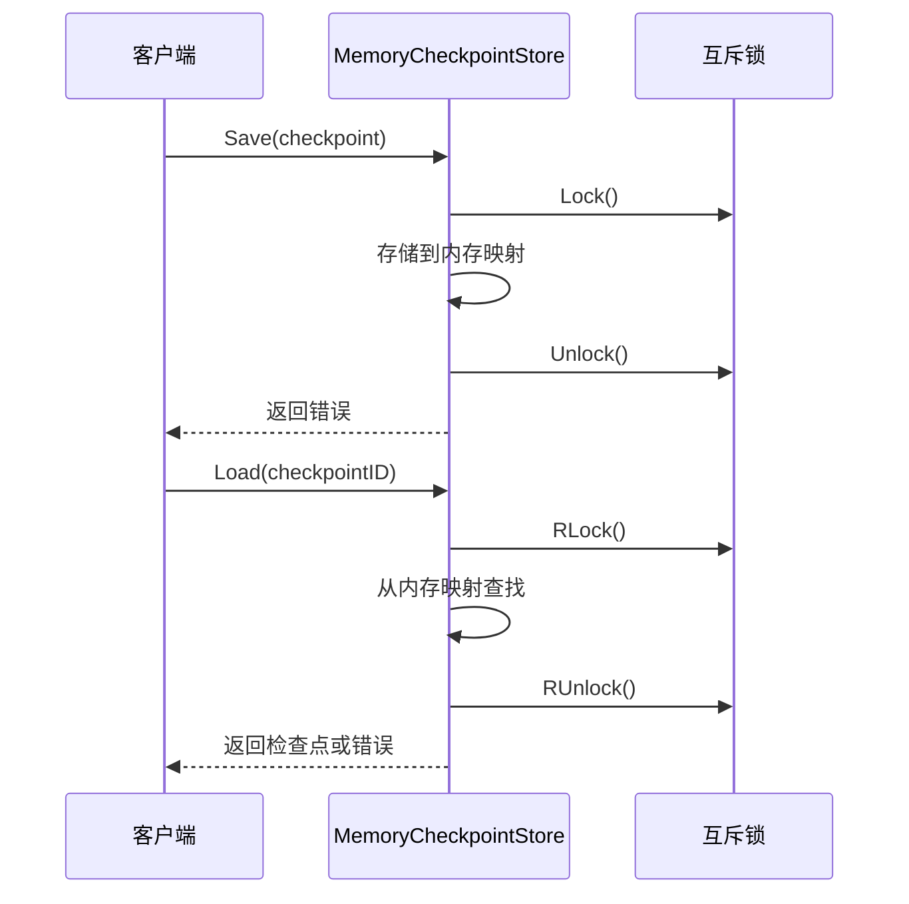
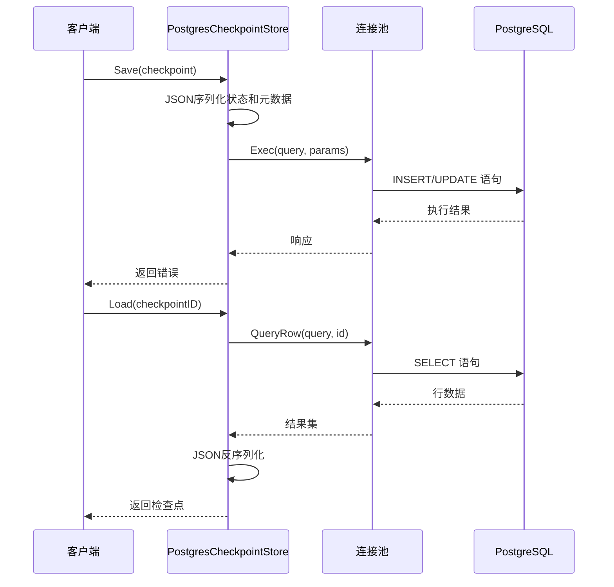
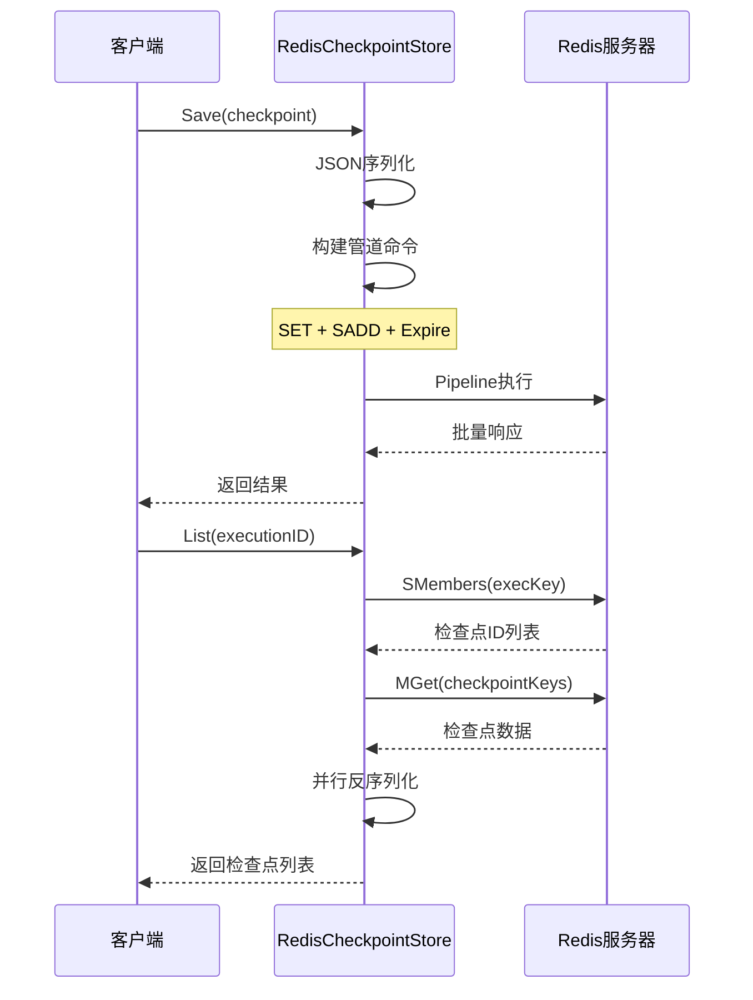
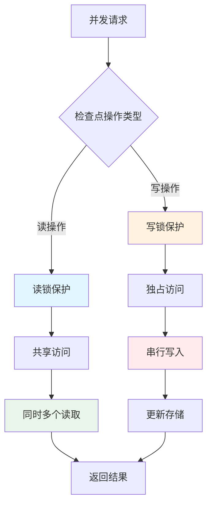
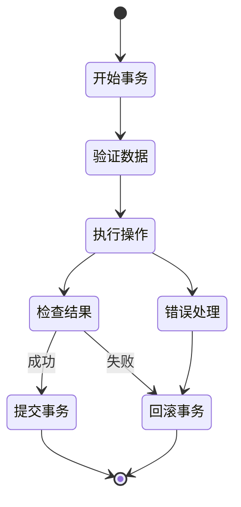
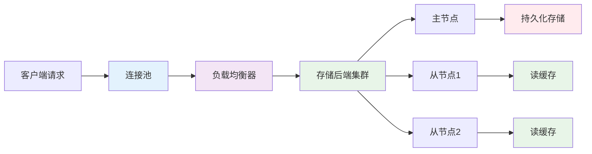
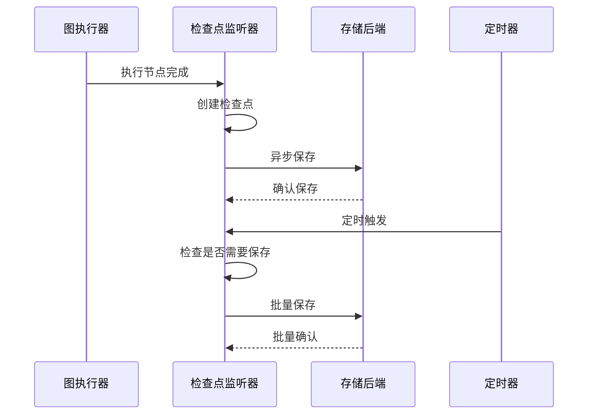
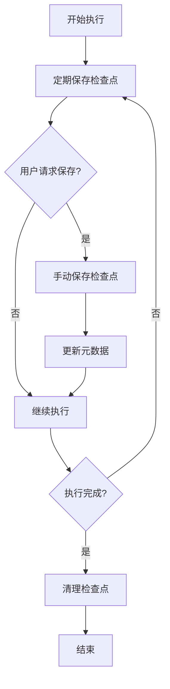
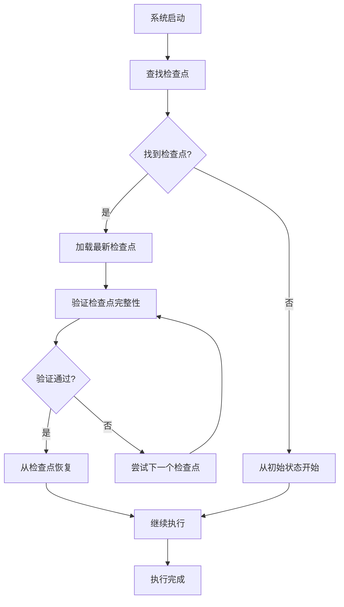
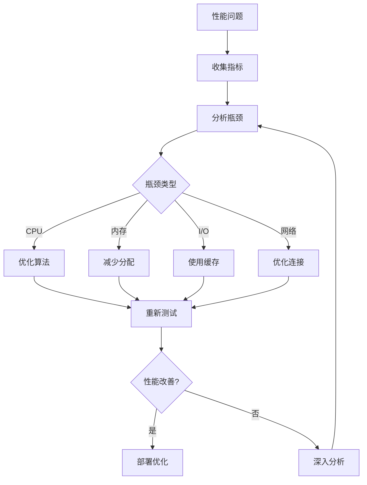

# CheckpointStore 接口 API 参考文档

<cite>
**本文档中引用的文件**
- [graph/checkpointing.go](file://graph/checkpointing.go)
- [checkpoint/postgres/postgres.go](file://checkpoint/postgres/postgres.go)
- [checkpoint/redis/redis.go](file://checkpoint/redis/redis.go)
- [checkpoint/sqlite/sqlite.go](file://checkpoint/sqlite/sqlite.go)
- [examples/checkpointing/main.go](file://examples/checkpointing/main.go)
- [examples/checkpointing/postgres/main.go](file://examples/checkpointing/postgres/main.go)
- [examples/checkpointing/redis/main.go](file://examples/checkpointing/redis/main.go)
- [examples/durable_execution/main.go](file://examples/durable_execution/main.go)
</cite>

## 目录
1. [简介](#简介)
2. [接口定义](#接口定义)
3. [核心方法详解](#核心方法详解)
4. [检查点数据结构](#检查点数据结构)
5. [实现示例](#实现示例)
6. [线程安全与事务一致性](#线程安全与事务一致性)
7. [自定义存储后端开发指南](#自定义存储后端开发指南)
8. [性能优化建议](#性能优化建议)
9. [典型使用场景](#典型使用场景)
10. [故障排除](#故障排除)

## 简介

CheckpointStore 接口是 langgraphgo 中负责图执行状态持久化的核心组件。它提供了统一的抽象层，允许开发者选择不同的存储后端（内存、文件系统、数据库等）来保存和恢复图的执行状态。该接口确保了图执行过程中的状态可恢复性、持久性和一致性。

检查点存储在分布式系统和长时间运行的任务中尤为重要，它使得系统能够在崩溃后从上次的状态继续执行，避免重复工作并保持数据完整性。

## 接口定义

CheckpointStore 接口定义了五个核心方法，每个方法都有明确的职责和语义：

```mermaid
classDiagram
class CheckpointStore {
<<interface>>
+Save(ctx Context, checkpoint *Checkpoint) error
+Load(ctx Context, checkpointID string) (*Checkpoint, error)
+List(ctx Context, executionID string) ([]*Checkpoint, error)
+Delete(ctx Context, checkpointID string) error
+Clear(ctx Context, executionID string) error
}
class Checkpoint {
+string ID
+string NodeName
+interface{} State
+map[string]interface{} Metadata
+time.Time Timestamp
+int Version
}
class MemoryCheckpointStore {
-map[string]*Checkpoint checkpoints
-sync.RWMutex mutex
+Save(ctx Context, checkpoint *Checkpoint) error
+Load(ctx Context, checkpointID string) (*Checkpoint, error)
+List(ctx Context, executionID string) ([]*Checkpoint, error)
+Delete(ctx Context, checkpointID string) error
+Clear(ctx Context, executionID string) error
}
class PostgresCheckpointStore {
-DBPool pool
-string tableName
+Save(ctx Context, checkpoint *Checkpoint) error
+Load(ctx Context, checkpointID string) (*Checkpoint, error)
+List(ctx Context, executionID string) ([]*Checkpoint, error)
+Delete(ctx Context, checkpointID string) error
+Clear(ctx Context, executionID string) error
+InitSchema(ctx Context) error
+Close()
}
class RedisCheckpointStore {
-redis.Client client
-string prefix
-time.Duration ttl
+Save(ctx Context, checkpoint *Checkpoint) error
+Load(ctx Context, checkpointID string) (*Checkpoint, error)
+List(ctx Context, executionID string) ([]*Checkpoint, error)
+Delete(ctx Context, checkpointID string) error
+Clear(ctx Context, executionID string) error
}
class SqliteCheckpointStore {
-sql.DB db
-string tableName
+Save(ctx Context, checkpoint *Checkpoint) error
+Load(ctx Context, checkpointID string) (*Checkpoint, error)
+List(ctx Context, executionID string) ([]*Checkpoint, error)
+Delete(ctx Context, checkpointID string) error
+Clear(ctx Context, executionID string) error
+InitSchema(ctx Context) error
+Close() error
}
CheckpointStore <|.. MemoryCheckpointStore
CheckpointStore <|.. PostgresCheckpointStore
CheckpointStore <|.. RedisCheckpointStore
CheckpointStore <|.. SqliteCheckpointStore
CheckpointStore --> Checkpoint : manages
```

**图表来源**
- [graph/checkpointing.go](file://graph/checkpointing.go#L22-L38)
- [checkpoint/postgres/postgres.go](file://checkpoint/postgres/postgres.go#L22-L25)
- [checkpoint/redis/redis.go](file://checkpoint/redis/redis.go#L13-L17)
- [checkpoint/sqlite/sqlite.go](file://checkpoint/sqlite/sqlite.go#L13-L16)

**节来源**
- [graph/checkpointing.go](file://graph/checkpointing.go#L22-L38)

## 核心方法详解

### Save 方法

**函数签名：**
```go
Save(ctx context.Context, checkpoint *Checkpoint) error
```

**功能描述：**
将指定的检查点保存到存储后端。如果检查点已存在，则更新现有记录。

**参数说明：**
- `ctx`: 上下文对象，用于控制操作的生命周期和超时
- `checkpoint`: 要保存的检查点对象，包含完整的状态信息

**返回值：**
- `error`: 操作成功返回 nil，失败返回具体错误

**错误类型：**
- 数据库连接失败
- 序列化/反序列化错误
- 存储空间不足
- 权限不足

**节来源**
- [graph/checkpointing.go](file://graph/checkpointing.go#L24-L24)
- [checkpoint/postgres/postgres.go](file://checkpoint/postgres/postgres.go#L91-L135)
- [checkpoint/redis/redis.go](file://checkpoint/redis/redis.go#L57-L84)
- [checkpoint/sqlite/sqlite.go](file://checkpoint/sqlite/sqlite.go#L77-L121)

### Load 方法

**函数签名：**
```go
Load(ctx context.Context, checkpointID string) (*Checkpoint, error)
```

**功能描述：**
根据检查点 ID 从存储后端检索特定的检查点。

**参数说明：**
- `ctx`: 上下文对象
- `checkpointID`: 要加载的检查点唯一标识符

**返回值：**
- `*Checkpoint`: 找到的检查点对象
- `error`: 操作结果，未找到时返回 `fmt.Errorf("checkpoint not found: %s", checkpointID)`

**错误类型：**
- 检查点不存在
- 数据库查询失败
- 反序列化错误
- 网络连接问题

**节来源**
- [graph/checkpointing.go](file://graph/checkpointing.go#L27-L27)
- [checkpoint/postgres/postgres.go](file://checkpoint/postgres/postgres.go#L137-L176)
- [checkpoint/redis/redis.go](file://checkpoint/redis/redis.go#L86-L103)
- [checkpoint/sqlite/sqlite.go](file://checkpoint/sqlite/sqlite.go#L123-L162)

### List 方法

**函数签名：**
```go
List(ctx context.Context, executionID string) ([]*Checkpoint, error)
```

**功能描述：**
获取指定执行的所有检查点，按时间戳升序排列。

**参数说明：**
- `ctx`: 上下文对象
- `executionID`: 执行实例的唯一标识符

**返回值：**
- `[]*Checkpoint`: 包含所有相关检查点的切片
- `error`: 操作结果

**错误类型：**
- 查询执行失败
- 数据格式不正确
- 存储后端不可用

**节来源**
- [graph/checkpointing.go](file://graph/checkpointing.go#L30-L30)
- [checkpoint/postgres/postgres.go](file://checkpoint/postgres/postgres.go#L178-L229)
- [checkpoint/redis/redis.go](file://checkpoint/redis/redis.go#L105-L155)
- [checkpoint/sqlite/sqlite.go](file://checkpoint/sqlite/sqlite.go#L164-L215)

### Delete 方法

**函数签名：**
```go
Delete(ctx context.Context, checkpointID string) error
```

**功能描述：**
删除指定的检查点。

**参数说明：**
- `ctx`: 上下文对象
- `checkpointID`: 要删除的检查点标识符

**返回值：**
- `error`: 操作结果，成功返回 nil

**错误类型：**
- 检查点不存在
- 删除权限不足
- 存储后端只读

**节来源**
- [graph/checkpointing.go](file://graph/checkpointing.go#L33-L33)
- [checkpoint/postgres/postgres.go](file://checkpoint/postgres/postgres.go#L231-L239)
- [checkpoint/redis/redis.go](file://checkpoint/redis/redis.go#L157-L181)
- [checkpoint/sqlite/sqlite.go](file://checkpoint/sqlite/sqlite.go#L217-L225)

### Clear 方法

**函数签名：**
```go
Clear(ctx context.Context, executionID string) error
```

**功能描述：**
删除指定执行的所有检查点。

**参数说明：**
- `ctx`: 上下文对象
- `executionID`: 执行实例标识符

**返回值：**
- `error`: 操作结果

**错误类型：**
- 清理操作失败
- 存储后端异常
- 权限问题

**节来源**
- [graph/checkpointing.go](file://graph/checkpointing.go#L36-L36)
- [checkpoint/postgres/postgres.go](file://checkpoint/postgres/postgres.go#L241-L249)
- [checkpoint/redis/redis.go](file://checkpoint/redis/redis.go#L183-L211)
- [checkpoint/sqlite/sqlite.go](file://checkpoint/sqlite/sqlite.go#L227-L236)

## 检查点数据结构

检查点（Checkpoint）是存储图执行状态的核心数据结构，包含了执行过程中的关键信息：

```mermaid
classDiagram
class Checkpoint {
+string ID
+string NodeName
+interface{} State
+map[string]interface{} Metadata
+time.Time Timestamp
+int Version
}
class MetadataFields {
+string execution_id
+string event
+string source
+string updated_by
+any custom_fields
}
Checkpoint --> MetadataFields : contains
```

**图表来源**
- [graph/checkpointing.go](file://graph/checkpointing.go#L12-L20)

### 字段说明

| 字段名 | 类型 | 描述 | 必需 |
|--------|------|------|------|
| ID | string | 检查点的唯一标识符 | 是 |
| NodeName | string | 触发检查点的节点名称 | 是 |
| State | interface{} | 图的当前状态数据 | 是 |
| Metadata | map[string]interface{} | 元数据信息，包含执行上下文 | 否 |
| Timestamp | time.Time | 检查点创建的时间戳 | 是 |
| Version | int | 检查点版本号，用于冲突解决 | 是 |

### 元数据字段

| 字段名 | 类型 | 描述 | 示例值 |
|--------|------|------|--------|
| execution_id | string | 执行实例标识符 | "exec_123456789" |
| event | string | 触发事件类型 | "step", "resume", "manual" |
| source | string | 操作来源 | "auto_save", "update_state" |
| updated_by | string | 更新节点名称 | "process_node" |

**节来源**
- [graph/checkpointing.go](file://graph/checkpointing.go#L12-L20)

## 实现示例

### 内存存储实现

内存存储是最简单的实现，适用于测试和临时状态保存：



**图表来源**
- [graph/checkpointing.go](file://graph/checkpointing.go#L40-L111)

**节来源**
- [graph/checkpointing.go](file://graph/checkpointing.go#L40-L111)

### PostgreSQL 存储实现

PostgreSQL 实现支持高并发和持久化存储：



**图表来源**
- [checkpoint/postgres/postgres.go](file://checkpoint/postgres/postgres.go#L91-L135)

**节来源**
- [checkpoint/postgres/postgres.go](file://checkpoint/postgres/postgres.go#L22-L250)

### Redis 存储实现

Redis 实现提供高性能的缓存式存储：



**图表来源**
- [checkpoint/redis/redis.go](file://checkpoint/redis/redis.go#L57-L155)

**节来源**
- [checkpoint/redis/redis.go](file://checkpoint/redis/redis.go#L13-L212)

### SQLite 存储实现

SQLite 实现提供轻量级的本地存储：

**节来源**
- [checkpoint/sqlite/sqlite.go](file://checkpoint/sqlite/sqlite.go#L13-L236)

## 线程安全与事务一致性

### 线程安全保证

CheckpointStore 接口的实现必须保证线程安全，特别是在多并发访问的情况下：



### 实现策略

1. **内存同步原语**：
   - 使用 `sync.RWMutex` 提供读写锁
   - 读操作共享锁，写操作独占锁

2. **数据库事务**：
   - 使用数据库连接池管理事务
   - 支持 ACID 特性

3. **分布式锁**：
   - Redis 实现使用原子操作
   - 数据库实现使用行级锁

### 事务一致性



**节来源**
- [graph/checkpointing.go](file://graph/checkpointing.go#L40-L111)
- [checkpoint/postgres/postgres.go](file://checkpoint/postgres/postgres.go#L91-L135)
- [checkpoint/redis/redis.go](file://checkpoint/redis/redis.go#L57-L84)

## 自定义存储后端开发指南

### 开发步骤

1. **实现接口**：
   ```go
   type CustomCheckpointStore struct {
       // 存储后端特定配置
   }
   
   func (s *CustomCheckpointStore) Save(ctx context.Context, checkpoint *Checkpoint) error {
       // 实现保存逻辑
   }
   
   // 实现其他方法...
   ```

2. **错误处理**：
   - 统一错误类型转换
   - 提供有意义的错误消息
   - 支持重试机制

3. **性能优化**：
   - 连接池管理
   - 缓存策略
   - 批量操作

### 集成方式

```mermaid
classDiagram
class CustomStore {
+Save(ctx Context, checkpoint *Checkpoint) error
+Load(ctx Context, checkpointID string) (*Checkpoint, error)
+List(ctx Context Context, executionID string) ([]*Checkpoint, error)
+Delete(ctx Context, checkpointID string) error
+Clear(ctx Context, executionID string) error
}
class CheckpointableRunnable {
-CheckpointStore store
-CheckpointConfig config
+Invoke(ctx Context, initialState interface{}) (interface{}, error)
+SaveCheckpoint(ctx Context, nodeName string, state interface{}) error
+LoadCheckpoint(ctx Context, checkpointID string) (*Checkpoint, error)
+ListCheckpoints(ctx Context) ([]*Checkpoint, error)
+ResumeFromCheckpoint(ctx Context, checkpointID string) (interface{}, error)
+ClearCheckpoints(ctx Context) error
}
class GraphEngine {
-CheckpointableRunnable runnable
+Execute(config Config) (interface{}, error)
+Resume(config Config) (interface{}, error)
}
CustomStore ..|> CheckpointStore
CheckpointableRunnable --> CheckpointStore
GraphEngine --> CheckpointableRunnable
```

**图表来源**
- [graph/checkpointing.go](file://graph/checkpointing.go#L22-L38)
- [graph/checkpointing.go](file://graph/checkpointing.go#L214-L295)

### 最佳实践

1. **错误处理**：
   ```go
   func (s *CustomStore) Save(ctx context.Context, checkpoint *Checkpoint) error {
       // 验证输入
       if checkpoint == nil {
           return fmt.Errorf("checkpoint cannot be nil")
       }
       
       // 执行操作
       err := s.performSave(ctx, checkpoint)
       if err != nil {
           return fmt.Errorf("failed to save checkpoint %s: %w", checkpoint.ID, err)
       }
       
       return nil
   }
   ```

2. **资源管理**：
   ```go
   func (s *CustomStore) Close() error {
       // 清理资源
       if s.connection != nil {
           return s.connection.Close()
       }
       return nil
   }
   ```

3. **配置验证**：
   ```go
   func NewCustomStore(config StoreConfig) (*CustomCheckpointStore, error) {
       if err := config.Validate(); err != nil {
           return nil, fmt.Errorf("invalid configuration: %w", err)
       }
       return &CustomCheckpointStore{config: config}, nil
   }
   ```

**节来源**
- [examples/durable_execution/main.go](file://examples/durable_execution/main.go#L16-L89)

## 性能优化建议

### 存储层优化

1. **批量操作**：
   - 使用数据库事务批量插入
   - Redis 管道操作
   - 文件系统批量写入

2. **索引优化**：
   - 在 `execution_id` 字段上建立索引
   - 在 `timestamp` 字段上建立排序索引
   - 使用复合索引提高查询效率

3. **缓存策略**：
   - LRU 缓存最近访问的检查点
   - 预加载常用检查点
   - 分层缓存架构

### 网络优化



### 内存优化

1. **对象池**：
   - 复用 Checkpoint 对象
   - 减少垃圾回收压力
   - 控制内存分配

2. **压缩存储**：
   - 使用 gzip 压缩状态数据
   - 选择合适的数据序列化格式
   - 实现增量存储

### 监控指标

| 指标类型 | 指标名称 | 描述 | 目标值 |
|----------|----------|------|--------|
| 延迟 | SaveLatency | 保存检查点的平均延迟 | < 10ms |
| 延迟 | LoadLatency | 加载检查点的平均延迟 | < 5ms |
| 吞吐量 | Throughput | 每秒处理的检查点数量 | > 1000 ops/s |
| 错误率 | ErrorRate | 操作失败率 | < 0.1% |
| 资源使用 | MemoryUsage | 内存使用量 | < 512MB |
| 资源使用 | CPUUsage | CPU 使用率 | < 30% |

## 典型使用场景

### 场景一：自动检查点保存



**图表来源**
- [graph/checkpointing.go](file://graph/checkpointing.go#L298-L330)

### 场景二：手动检查点管理



### 场景三：故障恢复



**节来源**
- [examples/checkpointing/main.go](file://examples/checkpointing/main.go#L1-119)
- [examples/durable_execution/main.go](file://examples/durable_execution/main.go#L150-242)

## 故障排除

### 常见问题及解决方案

| 问题类型 | 症状 | 可能原因 | 解决方案 |
|----------|------|----------|----------|
| 连接失败 | "connection refused" | 存储服务不可用 | 检查服务状态，重启连接 |
| 序列化错误 | "json marshal failed" | 状态数据包含不可序列化类型 | 使用兼容的数据类型 |
| 权限错误 | "permission denied" | 访问权限不足 | 检查用户权限设置 |
| 磁盘空间不足 | "no space left" | 存储空间耗尽 | 清理旧检查点，扩展存储 |
| 数据损坏 | "corruption detected" | 存储介质故障 | 从备份恢复，更换硬件 |

### 调试技巧

1. **启用详细日志**：
   ```go
   logger := log.New(os.Stdout, "CHECKPOINT: ", log.LstdFlags|log.Lshortfile)
   ```

2. **监控关键指标**：
   ```go
   metrics := prometheus.NewCounterVec(
       prometheus.CounterOpts{Name: "checkpoint_operations"},
       []string{"operation", "status"},
   )
   ```

3. **健康检查**：
   ```go
   func (s *Store) HealthCheck(ctx context.Context) error {
       // 测试基本操作
       return s.Save(ctx, &Checkpoint{ID: "health_check"})
   }
   ```

### 性能诊断



### 备份与恢复

1. **定期备份**：
   - 设置自动化备份任务
   - 验证备份完整性
   - 测试恢复流程

2. **灾难恢复**：
   - 制定恢复计划
   - 维护备用存储
   - 培训运维团队

**节来源**
- [checkpoint/postgres/postgres.go](file://checkpoint/postgres/postgres.go#L64-L84)
- [checkpoint/sqlite/sqlite.go](file://checkpoint/sqlite/sqlite.go#L50-L70)

## 结论

CheckpointStore 接口为 langgraphgo 提供了强大而灵活的状态持久化能力。通过统一的接口设计，开发者可以轻松切换不同的存储后端，满足不同场景的需求。正确的实现和优化能够显著提升系统的可靠性和性能。

在实际应用中，建议根据具体需求选择合适的存储方案，并实施适当的监控和维护策略，以确保系统的稳定运行。