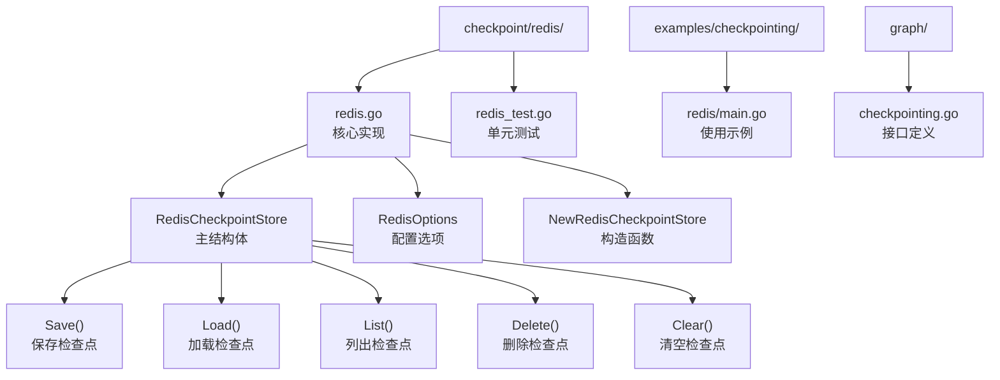
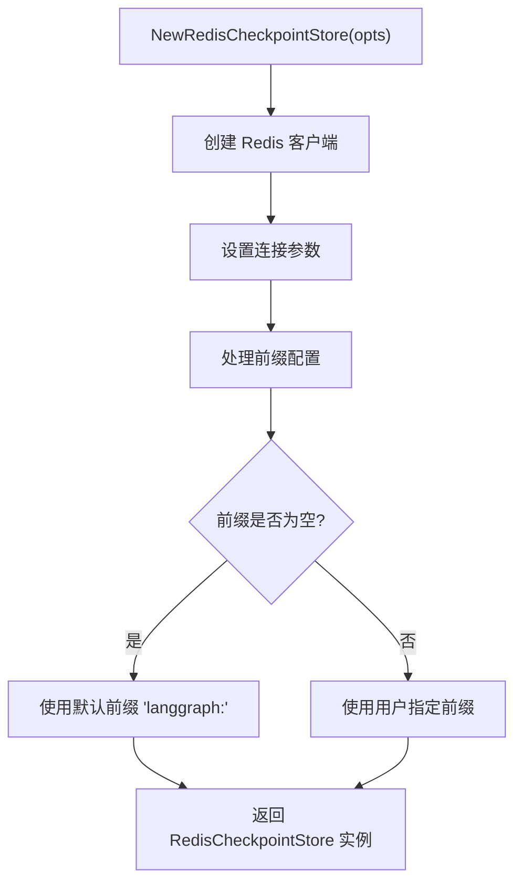
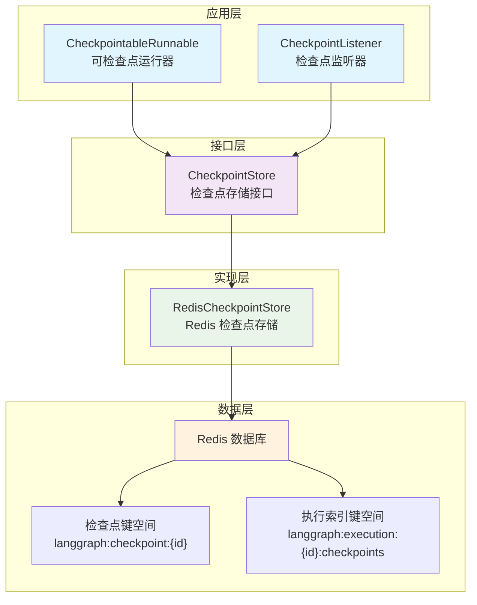
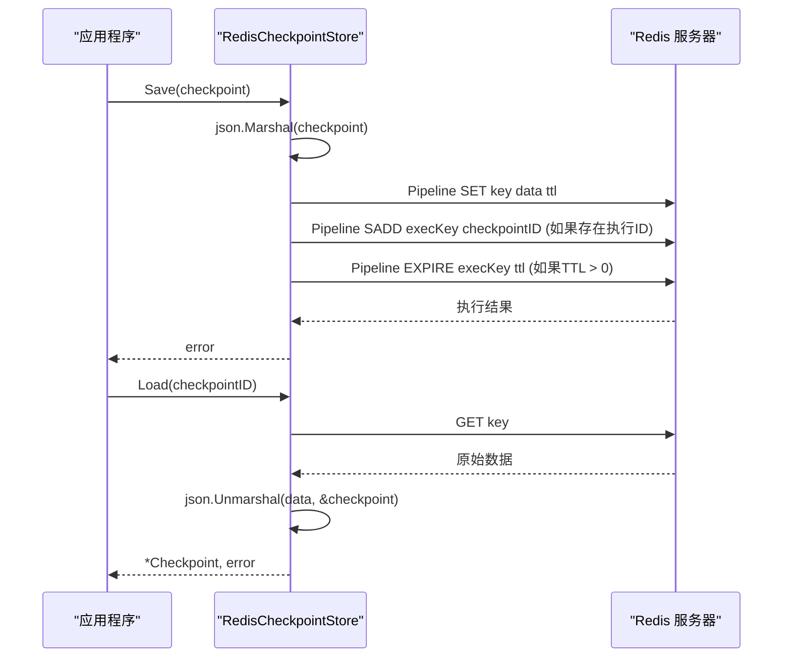
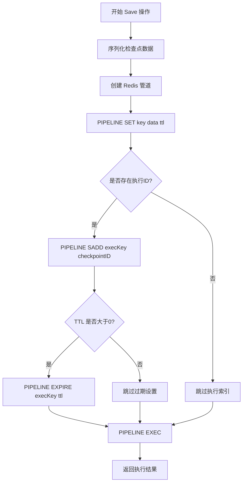
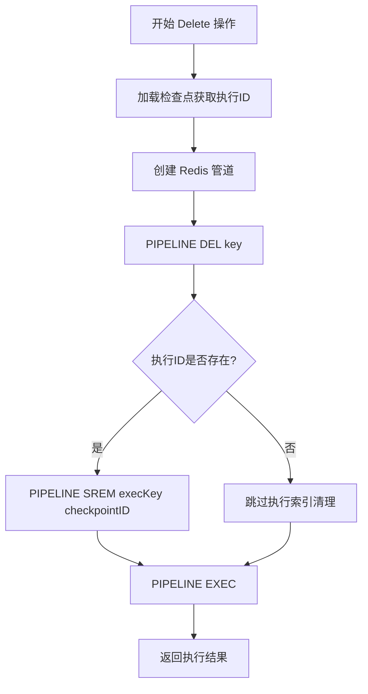
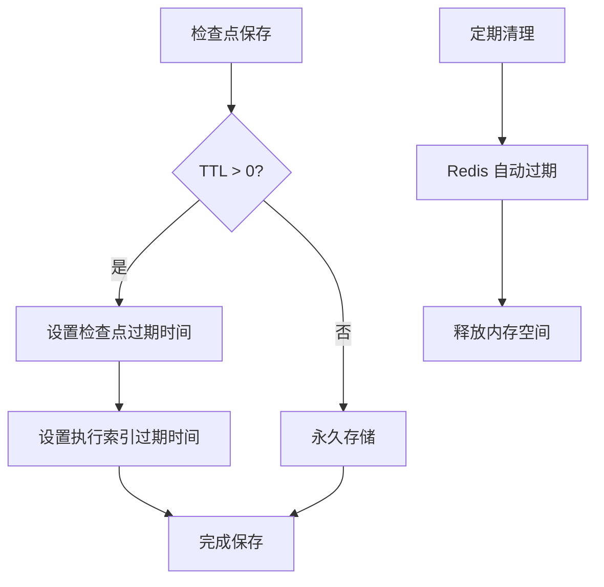
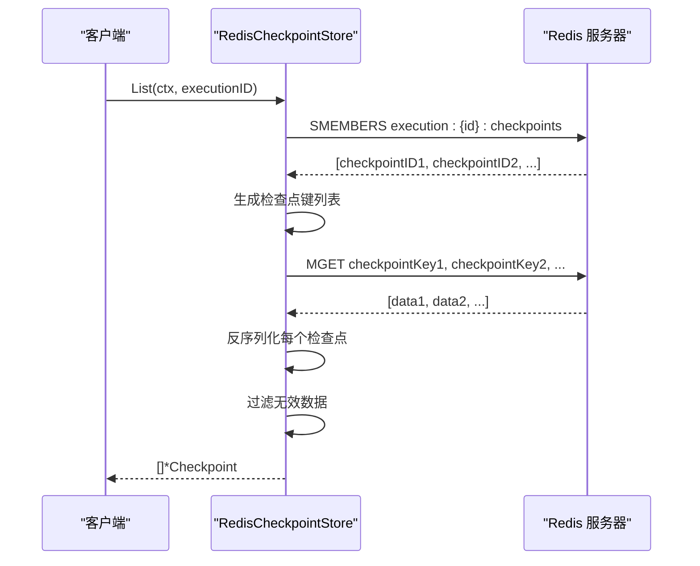
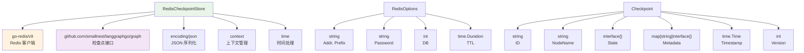

# Redis 检查点存储

<cite>
**本文档中引用的文件**
- [checkpoint/redis/redis.go](file://checkpoint/redis/redis.go)
- [checkpoint/redis/redis_test.go](file://checkpoint/redis/redis_test.go)
- [examples/checkpointing/redis/main.go](file://examples/checkpointing/redis/main.go)
- [graph/checkpointing.go](file://graph/checkpointing.go)
</cite>

## 目录
1. [简介](#简介)
2. [项目结构](#项目结构)
3. [核心组件](#核心组件)
4. [架构概览](#架构概览)
5. [详细组件分析](#详细组件分析)
6. [依赖关系分析](#依赖关系分析)
7. [性能考虑](#性能考虑)
8. [故障排除指南](#故障排除指南)
9. [结论](#结论)

## 简介

langgraphgo 的 Redis 检查点存储实现是一个高性能、可扩展的状态持久化解决方案，专为分布式系统中的状态恢复和检查点管理而设计。该实现基于 go-redis/v9 客户端，提供了完整的检查点存储接口，支持原子性操作、TTL 过期策略和高效的索引机制。

Redis 检查点存储通过管道（Pipeline）操作确保数据一致性，利用 Redis 集合（Set）实现按执行 ID 的高效索引，并提供灵活的 TTL 配置以控制内存使用和自动清理。

## 项目结构

Redis 检查点存储的项目结构清晰地分离了核心功能和测试代码：



**图表来源**
- [checkpoint/redis/redis.go](file://checkpoint/redis/redis.go#L1-L212)
- [examples/checkpointing/redis/main.go](file://examples/checkpointing/redis/main.go#L1-L145)

**章节来源**
- [checkpoint/redis/redis.go](file://checkpoint/redis/redis.go#L1-L212)
- [examples/checkpointing/redis/main.go](file://examples/checkpointing/redis/main.go#L1-L145)

## 核心组件

### RedisCheckpointStore 结构体

RedisCheckpointStore 是检查点存储的核心实现，封装了 Redis 客户端和配置参数：

| 字段 | 类型 | 描述 |
|------|------|------|
| client | *redis.Client | go-redis/v9 Redis 客户端实例 |
| prefix | string | 键前缀，默认为 "langgraph:" |
| ttl | time.Duration | 检查点过期时间，0 表示永不过期 |

### RedisOptions 配置选项

RedisOptions 提供了完整的 Redis 连接和存储配置：

| 字段 | 类型 | 默认值 | 描述 |
|------|------|--------|------|
| Addr | string | 必需 | Redis 服务器地址 |
| Password | string | "" | Redis 认证密码 |
| DB | int | 0 | 使用的数据库编号 |
| Prefix | string | "langgraph:" | 键名前缀 |
| TTL | time.Duration | 0 | 检查点过期时间 |

### NewRedisCheckpointStore 构造函数

构造函数负责初始化 Redis 客户端并设置默认配置：



**图表来源**
- [checkpoint/redis/redis.go](file://checkpoint/redis/redis.go#L29-L46)

**章节来源**
- [checkpoint/redis/redis.go](file://checkpoint/redis/redis.go#L13-L46)

## 架构概览

Redis 检查点存储采用分层架构设计，确保了良好的可维护性和扩展性：



**图表来源**
- [checkpoint/redis/redis.go](file://checkpoint/redis/redis.go#L13-L212)
- [graph/checkpointing.go](file://graph/checkpointing.go#L22-L38)

## 详细组件分析

### 键命名策略

Redis 检查点存储实现了两种主要的键命名策略：

#### 检查点键格式
```
{prefix}checkpoint:{checkpoint_id}
```

#### 执行索引键格式
```
{prefix}execution:{execution_id}:checkpoints
```

```mermaid
classDiagram
class RedisCheckpointStore {
-client *redis.Client
-prefix string
-ttl time.Duration
+Save(ctx, checkpoint) error
+Load(ctx, checkpointID) *Checkpoint
+List(ctx, executionID) []*Checkpoint
+Delete(ctx, checkpointID) error
+Clear(ctx, executionID) error
-checkpointKey(id string) string
-executionKey(id string) string
}
class Checkpoint {
+ID string
+NodeName string
+State interface{}
+Metadata map[string]interface{}
+Timestamp time.Time
+Version int
}
RedisCheckpointStore --> Checkpoint : "管理"
note for RedisCheckpointStore "键命名策略 : \n- 检查点键 : langgraph : checkpoint : {id}\n- 执行索引 : langgraph : execution : {id} : checkpoints"
```

**图表来源**
- [checkpoint/redis/redis.go](file://checkpoint/redis/redis.go#L13-L212)
- [graph/checkpointing.go](file://graph/checkpointing.go#L12-L20)

### 数据序列化与反序列化

所有检查点数据都通过 JSON 序列化存储在 Redis 中：



**图表来源**
- [checkpoint/redis/redis.go](file://checkpoint/redis/redis.go#L57-L103)

### 管道操作与原子性保证

Redis 检查点存储使用管道操作确保关键操作的原子性：

#### 保存检查点的管道操作


**图表来源**
- [checkpoint/redis/redis.go](file://checkpoint/redis/redis.go#L57-L82)

#### 删除检查点的管道操作


**图表来源**
- [checkpoint/redis/redis.go](file://checkpoint/redis/redis.go#L157-L181)

### 执行索引机制

Redis 检查点存储利用 Redis Set 数据结构实现高效的执行 ID 索引：

| 操作 | Redis 命令 | 用途 |
|------|------------|------|
| 添加检查点 | SADD execution:{id}:checkpoints checkpointID | 将检查点 ID 添加到执行索引 |
| 获取检查点列表 | SMEMBERS execution:{id}:checkpoints | 获取特定执行的所有检查点 ID |
| 移除检查点 | SREM execution:{id}:checkpoints checkpointID | 从执行索引中移除检查点 |
| 清空索引 | DEL execution:{id}:checkpoints | 删除整个执行索引 |

### TTL 过期策略

Redis 检查点存储支持灵活的 TTL 配置：

| TTL 设置 | 行为 | 适用场景 |
|----------|------|----------|
| 0 (默认) | 永不过期 | 开发环境或长期存储需求 |
| 正整数 | 指定过期时间 | 生产环境的内存管理 |
| 负数 | 立即过期 | 测试或临时存储 |



**图表来源**
- [checkpoint/redis/redis.go](file://checkpoint/redis/redis.go#L67-L76)

**章节来源**
- [checkpoint/redis/redis.go](file://checkpoint/redis/redis.go#L49-L82)
- [checkpoint/redis/redis.go](file://checkpoint/redis/redis.go#L157-L181)

### 列表操作优化

List 方法实现了高效的批量检查点检索：



**图表来源**
- [checkpoint/redis/redis.go](file://checkpoint/redis/redis.go#L105-L155)

**章节来源**
- [checkpoint/redis/redis.go](file://checkpoint/redis/redis.go#L105-L155)

## 依赖关系分析

Redis 检查点存储的依赖关系清晰明确：



**图表来源**
- [checkpoint/redis/redis.go](file://checkpoint/redis/redis.go#L3-L11)
- [graph/checkpointing.go](file://graph/checkpointing.go#L12-L20)

**章节来源**
- [checkpoint/redis/redis.go](file://checkpoint/redis/redis.go#L3-L11)
- [graph/checkpointing.go](file://graph/checkpointing.go#L12-L20)

## 性能考虑

### 内存管理

Redis 检查点存储在内存管理方面采用了多项优化策略：

1. **TTL 过期机制**：通过设置合理的 TTL 值，自动清理过期的检查点数据
2. **管道操作**：减少网络往返次数，提高批量操作效率
3. **选择性索引**：仅在需要时建立执行 ID 索引，避免不必要的内存占用

### 高并发性能

在高并发场景下，Redis 检查点存储表现出色：

| 场景 | 性能特点 | 优化建议 |
|------|----------|----------|
| 单检查点操作 | 低延迟，原子性保证 | 使用管道操作 |
| 批量检查点操作 | 高吞吐量 | 合理设置管道大小 |
| 并发访问 | 支持多客户端 | Redis 集群部署 |
| 大量检查点 | 内存优化 | 启用压缩和 TTL |

### 生产环境部署建议

1. **Redis 配置优化**
   - 启用持久化（RDB/AOF）
   - 配置合适的 maxmemory 和淘汰策略
   - 设置合理的超时时间和连接池大小

2. **监控和告警**
   - 监控 Redis 内存使用率
   - 跟踪检查点保存成功率
   - 设置 TTL 过期事件监控

3. **备份策略**
   - 定期备份 Redis 数据
   - 实现检查点数据的异地复制
   - 建立灾难恢复计划

## 故障排除指南

### 常见问题及解决方案

#### 连接问题
- **症状**：无法连接到 Redis 服务器
- **原因**：网络问题、认证失败、端口被阻止
- **解决方案**：检查网络连通性、验证认证凭据、确认防火墙设置

#### 性能问题
- **症状**：检查点操作响应缓慢
- **原因**：网络延迟、Redis 负载过高、TTL 设置不当
- **解决方案**：优化网络配置、调整 Redis 配置、合理设置 TTL

#### 数据一致性问题
- **症状**：检查点数据不一致或丢失
- **原因**：管道操作失败、Redis 主从同步延迟
- **解决方案**：启用 Redis 持久化、检查网络稳定性、实施重试机制

**章节来源**
- [checkpoint/redis/redis_test.go](file://checkpoint/redis/redis_test.go#L1-L89)
- [examples/checkpointing/redis/main.go](file://examples/checkpointing/redis/main.go#L21-L36)

## 结论

langgraphgo 的 Redis 检查点存储实现是一个功能完整、性能优异的状态持久化解决方案。它通过以下特性为分布式系统提供了可靠的检查点管理能力：

1. **完整的接口实现**：完全符合 CheckpointStore 接口规范
2. **高性能设计**：利用 Redis 的原生特性和管道操作
3. **灵活的配置选项**：支持多种部署场景和需求
4. **强大的索引机制**：通过 Redis Set 实现高效的执行 ID 索引
5. **智能的过期策略**：通过 TTL 机制实现自动内存管理

该实现特别适合需要高可用性、高性能和灵活配置的生产环境，为构建可靠的分布式状态管理系统提供了坚实的基础。