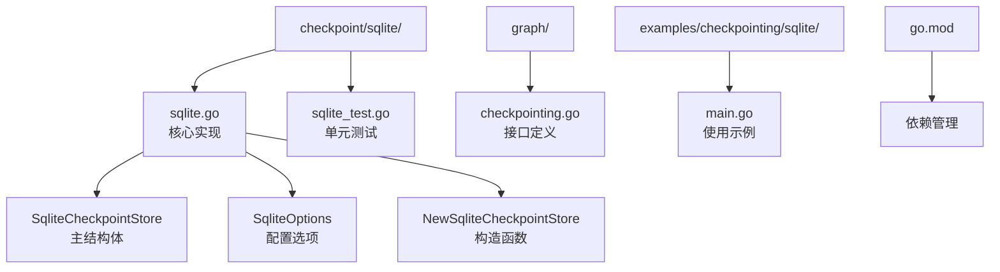
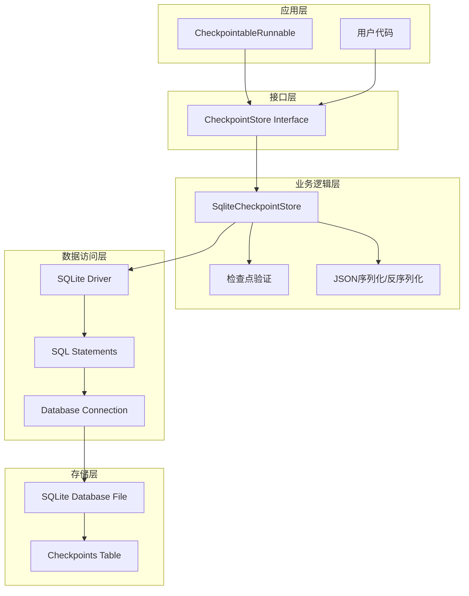
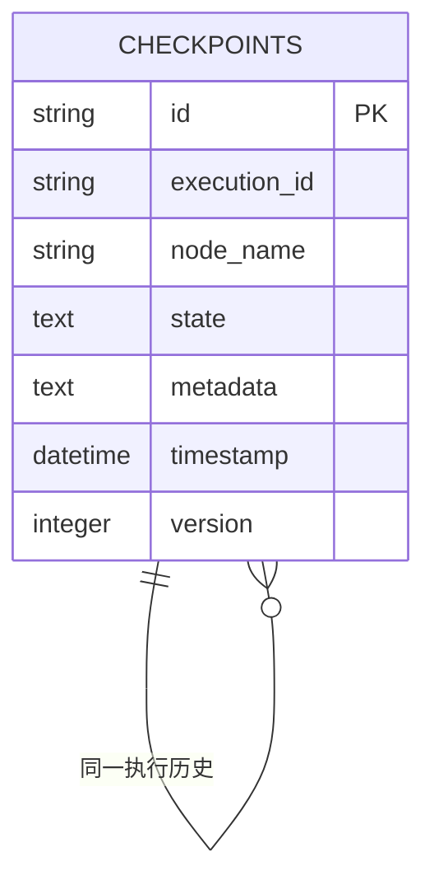
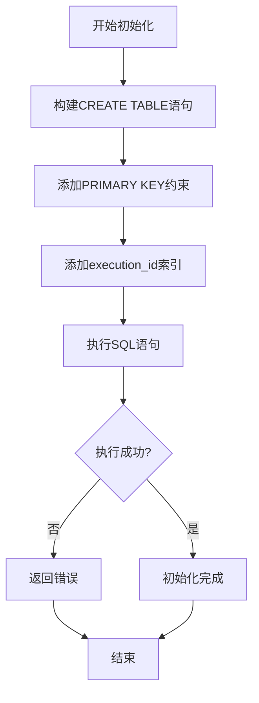
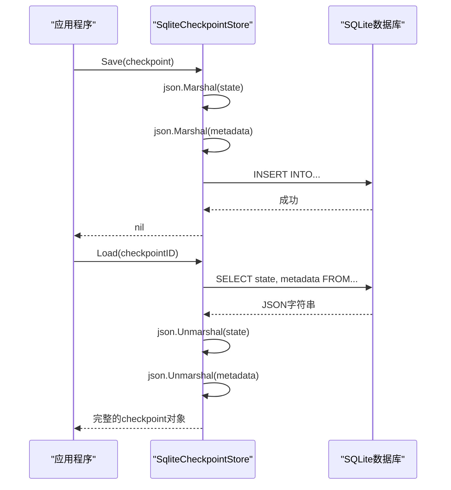
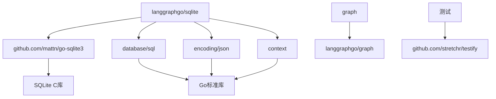
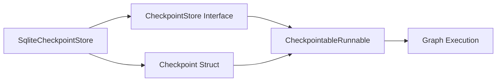

# SQLite 检查点存储

<cite>
**本文档中引用的文件**
- [sqlite.go](file://checkpoint/sqlite/sqlite.go)
- [sqlite_test.go](file://checkpoint/sqlite/sqlite_test.go)
- [checkpointing.go](file://graph/checkpointing.go)
- [main.go](file://examples/checkpointing/sqlite/main.go)
- [go.mod](file://go.mod)
</cite>

## 目录
1. [简介](#简介)
2. [项目结构](#项目结构)
3. [核心组件](#核心组件)
4. [架构概览](#架构概览)
5. [详细组件分析](#详细组件分析)
6. [依赖关系分析](#依赖关系分析)
7. [性能考虑](#性能考虑)
8. [故障排除指南](#故障排除指南)
9. [结论](#结论)

## 简介

langgraphgo 的 SQLite 检查点存储实现是一个基于 SQLite 数据库的持久化解决方案，专门用于保存和恢复图执行过程中的状态快照。该实现使用 `mattn/go-sqlite3` 驱动程序，提供了轻量级、嵌入式的存储方案，特别适合单机应用、原型开发和资源受限的环境。

该存储后端实现了 `CheckpointStore` 接口，支持完整的检查点生命周期管理，包括保存、加载、列表查询、删除和清理操作。通过 JSON 序列化技术，它能够存储任意复杂的数据结构作为检查点状态。

## 项目结构

SQLite 检查点存储的项目结构清晰明确，主要包含以下关键文件：



**图表来源**
- [sqlite.go](file://checkpoint/sqlite/sqlite.go#L1-L236)
- [checkpointing.go](file://graph/checkpointing.go#L22-L38)

**章节来源**
- [sqlite.go](file://checkpoint/sqlite/sqlite.go#L1-L236)
- [sqlite_test.go](file://checkpoint/sqlite/sqlite_test.go#L1-L83)

## 核心组件

### SqliteCheckpointStore 结构体

`SqliteCheckpointStore` 是 SQLite 检查点存储的核心结构体，负责管理数据库连接和表名配置：

```mermaid
classDiagram
class SqliteCheckpointStore {
-db *sql.DB
-tableName string
+InitSchema(ctx Context) error
+Save(ctx Context, checkpoint *Checkpoint) error
+Load(ctx Context, checkpointID string) *Checkpoint
+List(ctx Context, executionID string) []*Checkpoint
+Delete(ctx Context, checkpointID string) error
+Clear(ctx Context, executionID string) error
+Close() error
}
class SqliteOptions {
+Path string
+TableName string
}
class Checkpoint {
+ID string
+NodeName string
+State interface{}
+Metadata map[string]interface{}
+Timestamp time.Time
+Version int
}
SqliteCheckpointStore --> SqliteOptions : "使用"
SqliteCheckpointStore --> Checkpoint : "管理"
```

**图表来源**
- [sqlite.go](file://checkpoint/sqlite/sqlite.go#L13-L17)
- [sqlite.go](file://checkpoint/sqlite/sqlite.go#L19-L23)
- [checkpointing.go](file://graph/checkpointing.go#L12-L20)

### SqliteOptions 配置选项

`SqliteOptions` 提供了 SQLite 存储的配置参数：

| 字段 | 类型 | 默认值 | 描述 |
|------|------|--------|------|
| Path | string | - | SQLite 数据库文件路径，支持 ":memory:" 内存数据库 |
| TableName | string | "checkpoints" | 存储检查点的表名 |

### NewSqliteCheckpointStore 构造函数

`NewSqliteCheckpointStore` 函数是创建 SQLite 检查点存储的主要入口点，它执行以下关键步骤：

1. **数据库连接建立**：使用 `mattn/go-sqlite3` 驱动程序打开数据库连接
2. **表名配置**：处理默认表名设置
3. **模式初始化**：调用 `InitSchema` 创建必要的数据库表结构
4. **错误处理**：确保在初始化失败时正确关闭数据库连接

**章节来源**
- [sqlite.go](file://checkpoint/sqlite/sqlite.go#L25-L47)

## 架构概览

SQLite 检查点存储采用分层架构设计，从上到下包括接口层、业务逻辑层和数据访问层：



**图表来源**
- [sqlite.go](file://checkpoint/sqlite/sqlite.go#L13-L17)
- [checkpointing.go](file://graph/checkpointing.go#L22-L38)

## 详细组件分析

### 数据库表结构

SQLite 检查点存储使用以下表结构来组织数据：



**图表来源**
- [sqlite.go](file://checkpoint/sqlite/sqlite.go#L53-L61)

#### 字段说明

| 字段名 | 数据类型 | 约束 | 描述 |
|--------|----------|------|------|
| id | TEXT | PRIMARY KEY | 唯一标识符，检查点的主键 |
| execution_id | TEXT | NOT NULL | 执行会话标识符，用于分组相关检查点 |
| node_name | TEXT | NOT NULL | 触发检查点的节点名称 |
| state | TEXT | NOT NULL | JSON 序列化的状态数据 |
| metadata | TEXT | - | JSON 序列化的元数据信息 |
| timestamp | DATETIME | NOT NULL | 检查点创建时间戳 |
| version | INTEGER | NOT NULL | 版本号，用于冲突解决 |

### 模式初始化 (InitSchema)

`InitSchema` 方法负责创建必要的数据库结构：



**图表来源**
- [sqlite.go](file://checkpoint/sqlite/sqlite.go#L51-L69)

### SQL 语句详解

#### 保存检查点 (Save)

保存操作使用 `INSERT...ON CONFLICT` 语法实现幂等性：

```sql
INSERT INTO table_name (id, execution_id, node_name, state, metadata, timestamp, version)
VALUES (?, ?, ?, ?, ?, ?, ?)
ON CONFLICT(id) DO UPDATE SET
    execution_id = excluded.execution_id,
    node_name = excluded.node_name,
    state = excluded.state,
    metadata = excluded.metadata,
    timestamp = excluded.timestamp,
    version = excluded.version
```

这种设计确保：
- 如果检查点不存在，则创建新记录
- 如果检查点已存在，则更新所有字段
- 支持版本控制和冲突解决

#### 加载检查点 (Load)

加载操作执行简单的 SELECT 查询：

```sql
SELECT id, node_name, state, metadata, timestamp, version
FROM table_name
WHERE id = ?
```

#### 列表查询 (List)

列表查询按时间顺序返回特定执行的所有检查点：

```sql
SELECT id, node_name, state, metadata, timestamp, version
FROM table_name
WHERE execution_id = ?
ORDER BY timestamp ASC
```

#### 删除操作

- 单个检查点删除：`DELETE FROM table_name WHERE id = ?`
- 批量清理：`DELETE FROM table_name WHERE execution_id = ?`

**章节来源**
- [sqlite.go](file://checkpoint/sqlite/sqlite.go#L78-L121)
- [sqlite.go](file://checkpoint/sqlite/sqlite.go#L124-L162)
- [sqlite.go](file://checkpoint/sqlite/sqlite.go#L165-L215)
- [sqlite.go](file://checkpoint/sqlite/sqlite.go#L218-L235)

### JSON 序列化机制

SQLite 存储使用 JSON 序列化来处理复杂的数据结构：



**图表来源**
- [sqlite.go](file://checkpoint/sqlite/sqlite.go#L79-L114)
- [sqlite.go](file://checkpoint/sqlite/sqlite.go#L131-L159)

**章节来源**
- [sqlite.go](file://checkpoint/sqlite/sqlite.go#L78-L121)
- [sqlite.go](file://checkpoint/sqlite/sqlite.go#L124-L162)
- [sqlite.go](file://checkpoint/sqlite/sqlite.go#L165-L215)

## 依赖关系分析

### 外部依赖

SQLite 检查点存储依赖以下外部包：



**图表来源**
- [sqlite.go](file://checkpoint/sqlite/sqlite.go#L3-L11)
- [go.mod](file://go.mod#L6-L13)

### 内部依赖

系统内部组件之间的依赖关系：



**图表来源**
- [sqlite.go](file://checkpoint/sqlite/sqlite.go#L13-L17)
- [checkpointing.go](file://graph/checkpointing.go#L22-L38)

**章节来源**
- [sqlite.go](file://checkpoint/sqlite/sqlite.go#L3-L11)
- [go.mod](file://go.mod#L6-L13)

## 性能考虑

### 优势特性

1. **轻量级设计**：无需独立的数据库服务器进程
2. **嵌入式友好**：可直接打包到 Go 应用程序中
3. **内存数据库支持**：开发和测试阶段使用 `:memory:` 模式
4. **自动索引**：`execution_id` 上的索引优化查询性能

### 性能限制

1. **并发写入瓶颈**：SQLite 在高并发写入场景下可能成为性能瓶颈
2. **文件锁机制**：单文件写入需要等待其他写操作完成
3. **磁盘 I/O 限制**：频繁的检查点操作可能影响整体性能
4. **内存使用**：大型检查点可能导致内存压力

### 最佳实践建议

1. **文件路径配置**
   - 使用绝对路径避免相对路径问题
   - 考虑使用临时目录进行测试
   - 生产环境中使用持久化存储位置

2. **数据库文件管理**
   - 定期备份重要数据
   - 监控文件大小增长
   - 实施轮换策略防止文件过大

3. **事务处理**
   - 利用 SQLite 的 ACID 特性保证数据一致性
   - 合理使用事务边界减少锁定时间

4. **应用程序集成**
   - 在应用启动时初始化存储
   - 正确处理关闭时机释放资源
   - 实施适当的错误处理和重试机制

## 故障排除指南

### 常见问题及解决方案

#### 数据库连接问题

**症状**：无法打开数据库文件
**原因**：文件权限不足或路径错误
**解决方案**：
- 检查文件路径是否存在
- 确认应用程序有读写权限
- 使用绝对路径而非相对路径

#### 模式初始化失败

**症状**：表创建失败
**原因**：权限不足或数据库文件损坏
**解决方案**：
- 检查数据库文件权限
- 验证 SQLite 驱动程序安装
- 尝试重新初始化数据库

#### JSON 序列化错误

**症状**：状态数据无法序列化
**原因**：包含不可序列化的数据类型
**解决方案**：
- 确保状态数据只包含基本类型
- 自定义序列化方法处理复杂类型
- 使用简单的数据结构

#### 性能问题

**症状**：检查点操作缓慢
**原因**：频繁写入或大量数据
**解决方案**：
- 减少不必要的检查点保存
- 实施批量操作
- 考虑使用内存存储进行缓存

**章节来源**
- [sqlite.go](file://checkpoint/sqlite/sqlite.go#L27-L30)
- [sqlite.go](file://checkpoint/sqlite/sqlite.go#L42-L45)

## 结论

langgraphgo 的 SQLite 检查点存储实现提供了一个功能完整、易于使用的持久化解决方案。它充分利用了 SQLite 的嵌入式特性和 JSON 序列化能力，为图执行提供了可靠的检查点管理功能。

### 主要优势

1. **简单易用**：零配置的部署和使用体验
2. **跨平台兼容**：支持所有 Go 可运行平台
3. **数据完整性**：利用 SQLite 的 ACID 特性
4. **灵活配置**：支持自定义表名和文件路径
5. **测试友好**：内存数据库模式便于单元测试

### 适用场景

- **原型开发**：快速验证概念而无需配置数据库
- **单机应用**：不需要分布式存储的小型应用
- **嵌入式系统**：资源受限环境下的状态持久化
- **学习研究**：理解检查点机制的理想选择

### 发展方向

随着应用需求的增长，可以考虑以下扩展：
- 添加连接池支持高并发
- 实现检查点压缩以节省存储空间
- 提供监控指标和健康检查功能
- 支持检查点迁移和版本升级

该实现为 langgraphgo 生态系统提供了坚实的基础设施支持，是构建可靠、可恢复的图执行系统的重要组成部分。