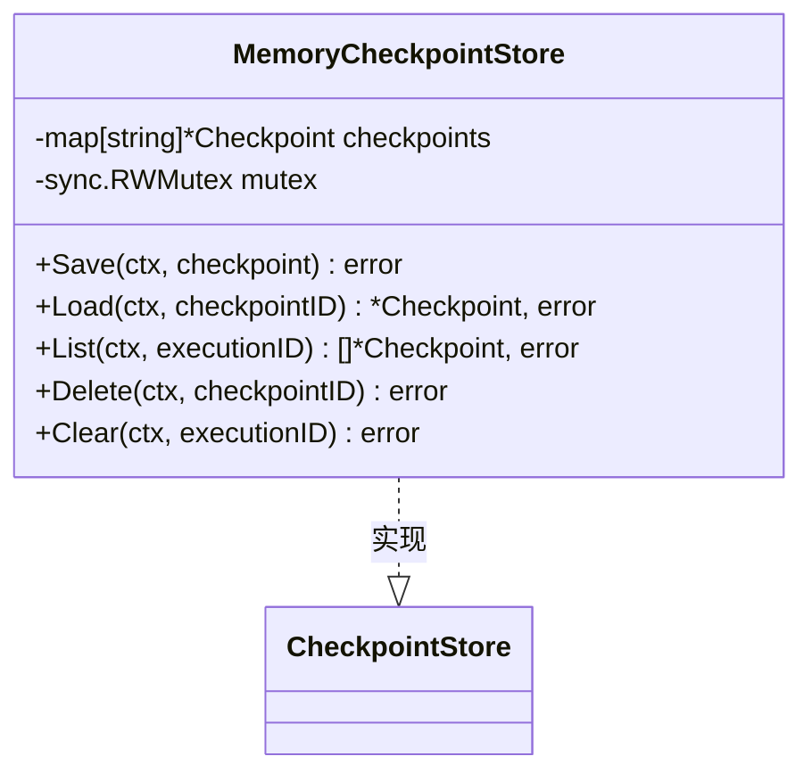
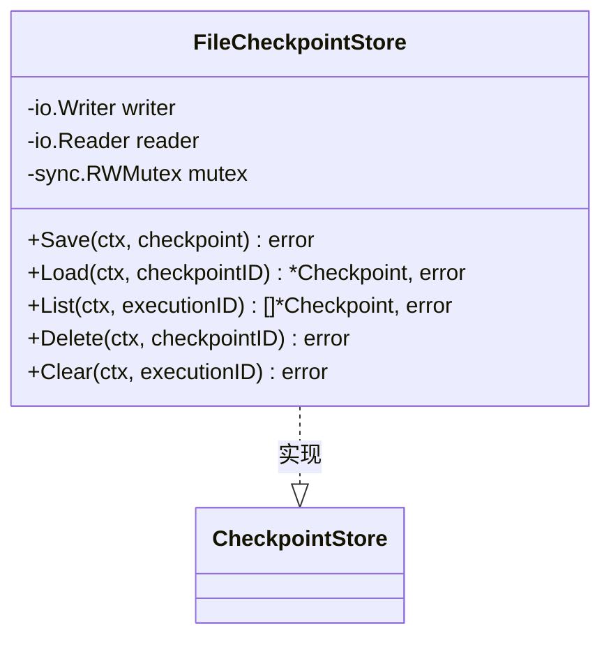
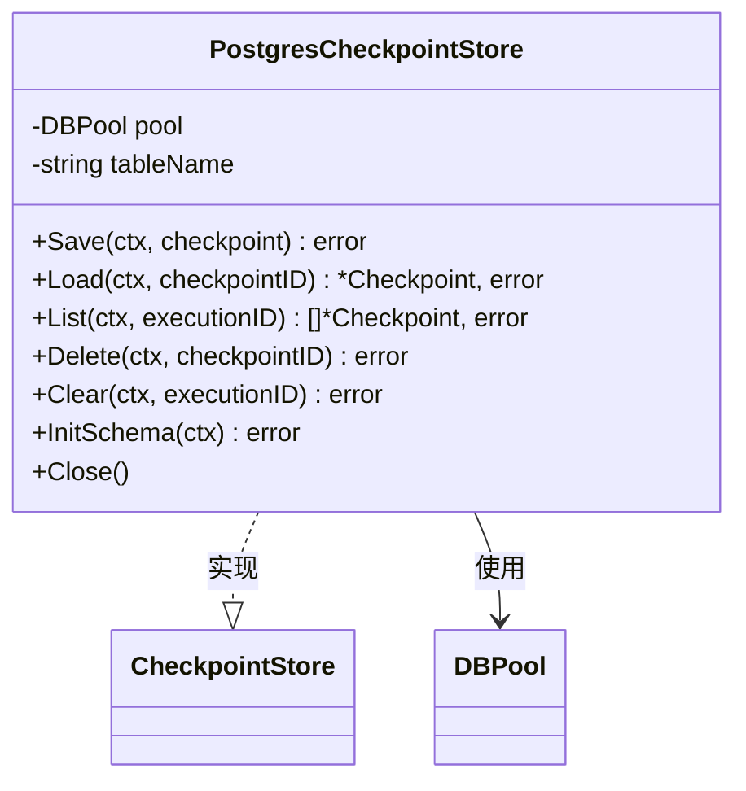
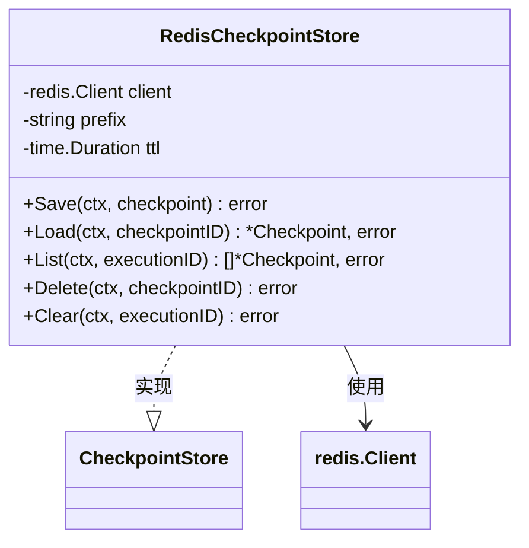
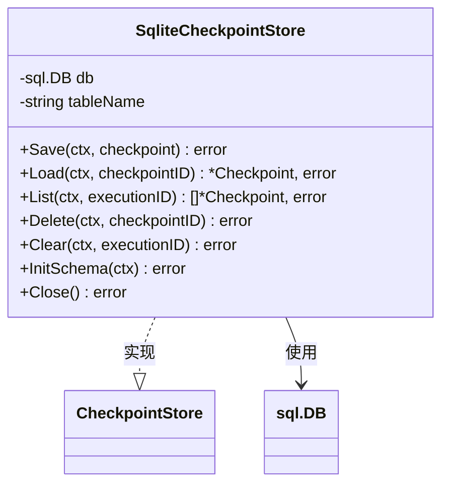
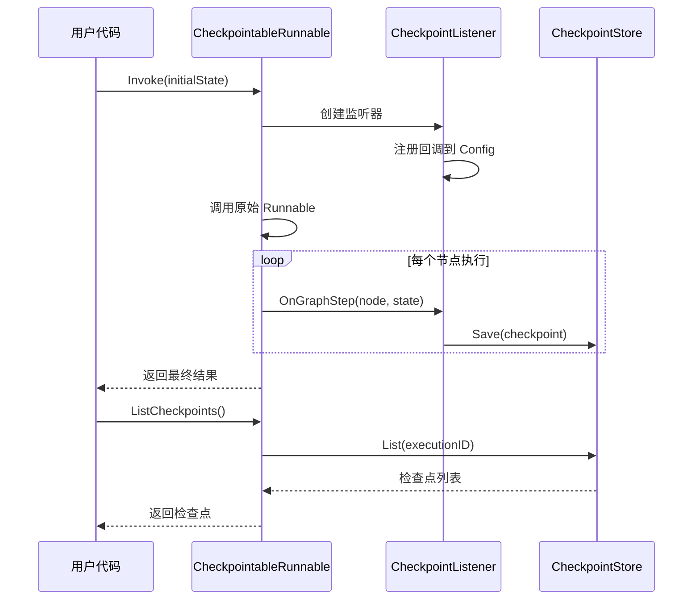
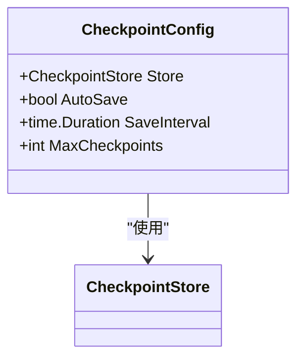
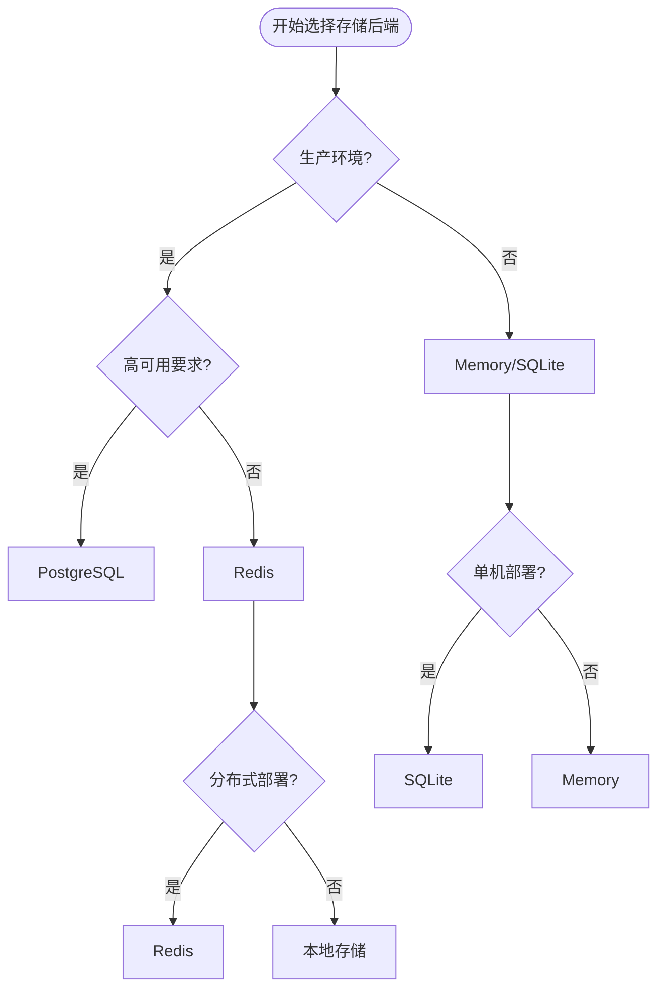

# 检查点模块 API 参考文档

<cite>
**本文档中引用的文件**
- [checkpoint/postgres/postgres.go](file://checkpoint/postgres/postgres.go)
- [checkpoint/redis/redis.go](file://checkpoint/redis/redis.go)
- [checkpoint/sqlite/sqlite.go](file://checkpoint/sqlite/sqlite.go)
- [graph/checkpointing.go](file://graph/checkpointing.go)
- [examples/checkpointing/main.go](file://examples/checkpointing/main.go)
- [examples/checkpointing/postgres/main.go](file://examples/checkpointing/postgres/main.go)
- [examples/checkpointing/redis/main.go](file://examples/checkpointing/redis/main.go)
- [examples/checkpointing/sqlite/main.go](file://examples/checkpointing/sqlite/main.go)
- [graph/checkpointing_test.go](file://graph/checkpointing_test.go)
</cite>

## 目录
1. [简介](#简介)
2. [核心接口与数据结构](#核心接口与数据结构)
3. [检查点存储实现](#检查点存储实现)
4. [CheckpointableRunnable 使用指南](#checkpointablerunnable-使用指南)
5. [配置选项](#配置选项)
6. [集成示例](#集成示例)
7. [性能考量](#性能考量)
8. [故障排除](#故障排除)

## 简介

langgraphgo 的检查点模块提供了强大的状态持久化和恢复功能，支持多种存储后端，包括内存、文件系统、PostgreSQL、Redis 和 SQLite。该模块允许在长时间运行的图执行过程中保存中间状态，并在需要时从中断点恢复执行。

### 核心特性

- **多存储后端支持**：支持内存、文件系统、PostgreSQL、Redis 和 SQLite 存储
- **自动和手动检查点**：支持自动保存和手动触发检查点
- **状态恢复**：可以从任意检查点恢复执行
- **执行历史管理**：支持清理和查询特定执行的历史记录
- **异步操作**：检查点保存采用异步方式，不影响主流程执行

## 核心接口与数据结构

### Checkpoint 结构体

检查点表示图执行过程中的一个状态快照。

```mermaid
classDiagram
class Checkpoint {
+string ID
+string NodeName
+interface{} State
+map[string]interface{} Metadata
+time.Time Timestamp
+int Version
}
class CheckpointStore {
<<interface>>
+Save(ctx, checkpoint) error
+Load(ctx, checkpointID) *Checkpoint, error
+List(ctx, executionID) []*Checkpoint, error
+Delete(ctx, checkpointID) error
+Clear(ctx, executionID) error
}
class CheckpointConfig {
+CheckpointStore Store
+bool AutoSave
+time.Duration SaveInterval
+int MaxCheckpoints
}
CheckpointStore --> Checkpoint : "管理"
CheckpointConfig --> CheckpointStore : "配置"
```

**图表来源**
- [graph/checkpointing.go](file://graph/checkpointing.go#L12-L20)
- [graph/checkpointing.go](file://graph/checkpointing.go#L22-L38)
- [graph/checkpointing.go](file://graph/checkpointing.go#L188-L201)

### CheckpointStore 接口

所有检查点存储实现都必须遵循此接口：

| 方法 | 描述 | 参数 | 返回值 |
|------|------|------|--------|
| `Save` | 保存检查点 | `ctx`: 上下文<br/>`checkpoint`: 要保存的检查点 | `error`: 错误信息 |
| `Load` | 加载指定 ID 的检查点 | `ctx`: 上下文<br/>`checkpointID`: 检查点标识符 | `*Checkpoint, error`: 检查点对象和错误 |
| `List` | 获取特定执行的所有检查点 | `ctx`: 上下文<br/>`executionID`: 执行标识符 | `[]*Checkpoint, error`: 检查点列表和错误 |
| `Delete` | 删除指定的检查点 | `ctx`: 上下文<br/>`checkpointID`: 检查点标识符 | `error`: 错误信息 |
| `Clear` | 清除特定执行的所有检查点 | `ctx`: 上下文<br/>`executionID`: 执行标识符 | `error`: 错误信息 |

**节来源**
- [graph/checkpointing.go](file://graph/checkpointing.go#L22-L38)

## 检查点存储实现

### MemoryCheckpointStore

基于内存的检查点存储，适用于开发和测试环境。



**图表来源**
- [graph/checkpointing.go](file://graph/checkpointing.go#L40-L111)

**特点**：
- 完全基于内存，速度快
- 数据在程序重启后丢失
- 支持并发访问（读写锁）
- 适合单次执行场景

**节来源**
- [graph/checkpointing.go](file://graph/checkpointing.go#L40-L111)

### FileCheckpointStore

基于文件系统的检查点存储，支持简单的文件持久化。



**图表来源**
- [graph/checkpointing.go](file://graph/checkpointing.go#L113-L186)

**限制**：
- `List`、`Delete` 和 `Clear` 方法未完全实现
- 仅支持单个检查点的读写
- 不适合生产环境

**节来源**
- [graph/checkpointing.go](file://graph/checkpointing.go#L113-L186)

### PostgresCheckpointStore

基于 PostgreSQL 的持久化检查点存储。



**图表来源**
- [checkpoint/postgres/postgres.go](file://checkpoint/postgres/postgres.go#L22-L250)

**数据库模式**：
```sql
CREATE TABLE IF NOT EXISTS checkpoints (
    id TEXT PRIMARY KEY,
    execution_id TEXT NOT NULL,
    node_name TEXT NOT NULL,
    state JSONB NOT NULL,
    metadata JSONB,
    timestamp TIMESTAMPTZ NOT NULL,
    version INTEGER NOT NULL
);
CREATE INDEX IF NOT EXISTS idx_checkpoints_execution_id ON checkpoints (execution_id);
```

**特点**：
- 支持复杂查询和索引优化
- 数据持久化，支持高可用性
- 支持事务操作
- 需要 PostgreSQL 连接池

**节来源**
- [checkpoint/postgres/postgres.go](file://checkpoint/postgres/postgres.go#L22-L250)

### RedisCheckpointStore

基于 Redis 的高性能检查点存储。



**图表来源**
- [checkpoint/redis/redis.go](file://checkpoint/redis/redis.go#L13-L212)

**键命名约定**：
- 检查点键：`{prefix}checkpoint:{checkpointID}`
- 执行索引键：`{prefix}execution:{executionID}:checkpoints`

**特点**：
- 极高的读写性能
- 支持 TTL 自动过期
- 内存优化的数据结构
- 支持分布式部署

**节来源**
- [checkpoint/redis/redis.go](file://checkpoint/redis/redis.go#L13-L212)

### SqliteCheckpointStore

基于 SQLite 的轻量级检查点存储。



**图表来源**
- [checkpoint/sqlite/sqlite.go](file://checkpoint/sqlite/sqlite.go#L13-L236)

**数据库模式**：
```sql
CREATE TABLE IF NOT EXISTS checkpoints (
    id TEXT PRIMARY KEY,
    execution_id TEXT NOT NULL,
    node_name TEXT NOT NULL,
    state TEXT NOT NULL,
    metadata TEXT,
    timestamp DATETIME NOT NULL,
    version INTEGER NOT NULL
);
CREATE INDEX IF NOT EXISTS idx_sqlite_execution_id ON checkpoints (execution_id);
```

**特点**：
- 单文件部署，简单易用
- 无需额外数据库服务
- 支持 ACID 特性
- 适合小型应用

**节来源**
- [checkpoint/sqlite/sqlite.go](file://checkpoint/sqlite/sqlite.go#L13-L236)

## CheckpointableRunnable 使用指南

### 基本概念

`CheckpointableRunnable` 是一个包装器，为普通的可监听运行器添加检查点功能。



**图表来源**
- [graph/checkpointing.go](file://graph/checkpointing.go#L230-L251)
- [graph/checkpointing.go](file://graph/checkpointing.go#L297-L330)

### 创建 CheckpointableRunnable

```go
// 创建可监听消息图
g := graph.NewCheckpointableMessageGraph()

// 设置检查点配置
config := graph.CheckpointConfig{
    Store:          graph.NewMemoryCheckpointStore(),
    AutoSave:       true,
    SaveInterval:   30 * time.Second,
    MaxCheckpoints: 10,
}

// 设置配置
g.SetCheckpointConfig(config)

// 添加节点和边...
// ...

// 编译为可检查点的运行器
runnable, err := g.CompileCheckpointable()
if err != nil {
    log.Fatal(err)
}
```

**节来源**
- [graph/checkpointing.go](file://graph/checkpointing.go#L213-L228)

### 关键 API 方法

| 方法 | 描述 | 参数 | 返回值 |
|------|------|------|--------|
| `Invoke` | 执行图并自动保存检查点 | `ctx`: 上下文<br/>`initialState`: 初始状态 | `interface{}, error`: 执行结果和错误 |
| `InvokeWithConfig` | 带配置参数执行图 | `ctx`: 上下文<br/>`initialState`: 初始状态<br/>`config`: 配置参数 | `interface{}, error`: 执行结果和错误 |
| `SaveCheckpoint` | 手动保存检查点 | `ctx`: 上下文<br/>`nodeName`: 节点名称<br/>`state`: 状态数据 | `error`: 错误信息 |
| `LoadCheckpoint` | 加载指定检查点 | `ctx`: 上下文<br/>`checkpointID`: 检查点标识符 | `*Checkpoint, error`: 检查点对象和错误 |
| `ListCheckpoints` | 获取当前执行的所有检查点 | `ctx`: 上下文 | `[]*Checkpoint, error`: 检查点列表和错误 |
| `ResumeFromCheckpoint` | 从检查点恢复执行 | `ctx`: 上下文<br/>`checkpointID`: 检查点标识符 | `interface{}, error`: 恢复的状态和错误 |
| `ClearCheckpoints` | 清除当前执行的所有检查点 | `ctx`: 上下文 | `error`: 错误信息 |

**节来源**
- [graph/checkpointing.go](file://graph/checkpointing.go#L230-L295)

### 手动检查点示例

```go
// 手动保存检查点
err := runnable.SaveCheckpoint(ctx, "custom_node", map[string]interface{}{
    "step": 1,
    "data": "custom state",
})
if err != nil {
    log.Printf("保存检查点失败: %v", err)
}

// 加载检查点
checkpoint, err := runnable.LoadCheckpoint(ctx, "checkpoint_123")
if err != nil {
    log.Printf("加载检查点失败: %v", err)
} else {
    fmt.Printf("检查点时间: %v\n", checkpoint.Timestamp)
    fmt.Printf("检查点状态: %v\n", checkpoint.State)
}
```

**节来源**
- [graph/checkpointing.go](file://graph/checkpointing.go#L254-L272)

## 配置选项

### CheckpointConfig 结构体



**图表来源**
- [graph/checkpointing.go](file://graph/checkpointing.go#L188-L201)

### 默认配置

```go
func DefaultCheckpointConfig() CheckpointConfig {
    return CheckpointConfig{
        Store:          NewMemoryCheckpointStore(),
        AutoSave:       true,
        SaveInterval:   30 * time.Second,
        MaxCheckpoints: 10,
    }
}
```

### 配置选项详解

| 字段 | 类型 | 默认值 | 描述 |
|------|------|--------|------|
| `Store` | `CheckpointStore` | `MemoryCheckpointStore` | 检查点存储后端 |
| `AutoSave` | `bool` | `true` | 是否自动保存检查点 |
| `SaveInterval` | `time.Duration` | `30s` | 自动保存间隔（当 AutoSave 为 false 时有效） |
| `MaxCheckpoints` | `int` | `10` | 最大保留检查点数量 |

### 存储后端选择指南

| 场景 | 推荐存储 | 理由 |
|------|----------|------|
| 开发测试 | `MemoryCheckpointStore` | 快速、简单 |
| 单机部署 | `SqliteCheckpointStore` | 无依赖、轻量 |
| 高性能需求 | `RedisCheckpointStore` | 内存存储、快速访问 |
| 生产环境 | `PostgresCheckpointStore` | 持久化、可靠性高 |
| 分布式系统 | `RedisCheckpointStore` 或 `PostgresCheckpointStore` | 支持多实例共享 |

**节来源**
- [graph/checkpointing.go](file://graph/checkpointing.go#L203-L211)

## 集成示例

### 基础集成示例

以下是一个完整的检查点集成示例：

```go
package main

import (
    "context"
    "fmt"
    "time"
    
    "github.com/smallnest/langgraphgo/graph"
)

type ProcessState struct {
    Step    int
    Data    string
    History []string
}

func main() {
    // 创建可检查点的消息图
    g := graph.NewCheckpointableMessageGraph()
    
    // 配置检查点
    config := graph.CheckpointConfig{
        Store:          graph.NewMemoryCheckpointStore(),
        AutoSave:       true,
        SaveInterval:   2 * time.Second,
        MaxCheckpoints: 5,
    }
    g.SetCheckpointConfig(config)
    
    // 添加处理节点
    g.AddNode("step1", func(ctx context.Context, state interface{}) (interface{}, error) {
        s := state.(ProcessState)
        s.Step = 1
        s.Data += " → Step1"
        s.History = append(s.History, "Completed Step 1")
        fmt.Println("执行 Step 1...")
        time.Sleep(500 * time.Millisecond)
        return s, nil
    })
    
    g.AddNode("step2", func(ctx context.Context, state interface{}) (interface{}, error) {
        s := state.(ProcessState)
        s.Step = 2
        s.Data += " → Step2"
        s.History = append(s.History, "Completed Step 2")
        fmt.Println("执行 Step 2...")
        time.Sleep(500 * time.Millisecond)
        return s, nil
    })
    
    g.AddNode("step3", func(ctx context.Context, state interface{}) (interface{}, error) {
        s := state.(ProcessState)
        s.Step = 3
        s.Data += " → Step3"
        s.History = append(s.History, "Completed Step 3")
        fmt.Println("执行 Step 3...")
        time.Sleep(500 * time.Millisecond)
        return s, nil
    })
    
    // 构建管道
    g.SetEntryPoint("step1")
    g.AddEdge("step1", "step2")
    g.AddEdge("step2", "step3")
    g.AddEdge("step3", graph.END)
    
    // 编译可检查点的运行器
    runnable, err := g.CompileCheckpointable()
    if err != nil {
        panic(err)
    }
    
    ctx := context.Background()
    initialState := ProcessState{
        Step:    0,
        Data:    "Start",
        History: []string{"Initialized"},
    }
    
    fmt.Println("=== 开始带检查点的执行 ===")
    
    // 执行带有自动检查点
    result, err := runnable.Invoke(ctx, initialState)
    if err != nil {
        panic(err)
    }
    
    finalState := result.(ProcessState)
    fmt.Printf("\n=== 执行完成 ===\n")
    fmt.Printf("最终步骤: %d\n", finalState.Step)
    fmt.Printf("最终数据: %s\n", finalState.Data)
    fmt.Printf("历史记录: %v\n", finalState.History)
    
    // 列出保存的检查点
    checkpoints, err := runnable.ListCheckpoints(ctx)
    if err != nil {
        panic(err)
    }
    
    fmt.Printf("\n=== 创建了 %d 个检查点 ===\n", len(checkpoints))
    for i, cp := range checkpoints {
        fmt.Printf("检查点 %d: ID=%s, 时间=%v\n", i+1, cp.ID, cp.Timestamp)
    }
    
    // 演示从检查点恢复
    if len(checkpoints) > 1 {
        fmt.Printf("\n=== 从检查点 %s 恢复 ===\n", checkpoints[1].ID)
        resumedState, err := runnable.ResumeFromCheckpoint(ctx, checkpoints[1].ID)
        if err != nil {
            fmt.Printf("恢复错误: %v\n", err)
        } else {
            resumed := resumedState.(ProcessState)
            fmt.Printf("恢复到步骤: %d\n", resumed.Step)
            fmt.Printf("恢复数据: %s\n", resumed.Data)
            fmt.Printf("恢复历史: %v\n", resumed.History)
        }
    }
}
```

**节来源**
- [examples/checkpointing/main.go](file://examples/checkpointing/main.go#L1-L119)

### PostgreSQL 集成示例

```go
package main

import (
    "context"
    "encoding/json"
    "fmt"
    "os"
    "time"
    
    "github.com/smallnest/langgraphgo/checkpoint/postgres"
    "github.com/smallnest/langgraphgo/graph"
)

func main() {
    // 获取 PostgreSQL 连接字符串
    connString := os.Getenv("POSTGRES_CONN_STRING")
    if connString == "" {
        fmt.Println("POSTGRES_CONN_STRING 环境变量未设置")
        return
    }
    
    // 创建可检查点的消息图
    g := graph.NewCheckpointableMessageGraph()
    
    // 初始化 PostgreSQL 检查点存储
    store, err := postgres.NewPostgresCheckpointStore(context.Background(), 
        postgres.PostgresOptions{
            ConnString: connString,
            TableName:  "example_checkpoints",
        })
    if err != nil {
        panic(fmt.Errorf("创建 PostgreSQL 存储失败: %w", err))
    }
    defer store.Close()
    
    // 初始化表结构
    if err := store.InitSchema(context.Background()); err != nil {
        panic(fmt.Errorf("初始化表结构失败: %w", err))
    }
    
    // 配置检查点
    config := graph.CheckpointConfig{
        Store:          store,
        AutoSave:       true,
        SaveInterval:   2 * time.Second,
        MaxCheckpoints: 5,
    }
    g.SetCheckpointConfig(config)
    
    // 添加处理节点...
    // ...
    
    // 编译和执行...
}
```

**节来源**
- [examples/checkpointing/postgres/main.go](file://examples/checkpointing/postgres/main.go#L1-L152)

### Redis 集成示例

```go
package main

import (
    "context"
    "encoding/json"
    "fmt"
    "os"
    "time"
    
    "github.com/smallnest/langgraphgo/checkpoint/redis"
    "github.com/smallnest/langgraphgo/graph"
)

func main() {
    // 获取 Redis 地址
    redisAddr := os.Getenv("REDIS_ADDR")
    if redisAddr == "" {
        redisAddr = "localhost:6379"
    }
    
    // 创建可检查点的消息图
    g := graph.NewCheckpointableMessageGraph()
    
    // 初始化 Redis 检查点存储
    store := redis.NewRedisCheckpointStore(redis.RedisOptions{
        Addr:   redisAddr,
        Prefix: "example_checkpoints:",
        TTL:    1 * time.Hour,
    })
    
    // 配置检查点
    config := graph.CheckpointConfig{
        Store:          store,
        AutoSave:       true,
        SaveInterval:   2 * time.Second,
        MaxCheckpoints: 5,
    }
    g.SetCheckpointConfig(config)
    
    // 添加处理节点...
    // ...
    
    // 编译和执行...
}
```

**节来源**
- [examples/checkpointing/redis/main.go](file://examples/checkpointing/redis/main.go#L1-L145)

### SQLite 集成示例

```go
package main

import (
    "context"
    "encoding/json"
    "fmt"
    "os"
    "time"
    
    "github.com/smallnest/langgraphgo/checkpoint/sqlite"
    "github.com/smallnest/langgraphgo/graph"
)

func main() {
    // 获取数据库路径
    dbPath := os.Getenv("SQLITE_DB_PATH")
    if dbPath == "" {
        dbPath = "./checkpoints.db"
    }
    
    // 创建可检查点的消息图
    g := graph.NewCheckpointableMessageGraph()
    
    // 初始化 SQLite 检查点存储
    store, err := sqlite.NewSqliteCheckpointStore(sqlite.SqliteOptions{
        Path:      dbPath,
        TableName: "example_checkpoints",
    })
    if err != nil {
        panic(fmt.Errorf("创建 SQLite 存储失败: %w", err))
    }
    defer store.Close()
    
    // 配置检查点
    config := graph.CheckpointConfig{
        Store:          store,
        AutoSave:       true,
        SaveInterval:   2 * time.Second,
        MaxCheckpoints: 5,
    }
    g.SetCheckpointConfig(config)
    
    // 添加处理节点...
    // ...
    
    // 编译和执行...
}
```

**节来源**
- [examples/checkpointing/sqlite/main.go](file://examples/checkpointing/sqlite/main.go#L1-L147)

## 性能考量

### 存储后端性能对比

| 存储类型 | 读取延迟 | 写入延迟 | 并发支持 | 持久化 | 适用场景 |
|----------|----------|----------|----------|--------|----------|
| Memory | 极低 (<1ms) | 极低 (<1ms) | 优秀 | 否 | 开发测试 |
| File | 中等 (1-10ms) | 中等 (1-10ms) | 差 | 是 | 简单持久化 |
| SQLite | 低 (1-5ms) | 低 (1-5ms) | 良好 | 是 | 单机应用 |
| Redis | 极低 (<1ms) | 极低 (<1ms) | 优秀 | 否 | 高性能缓存 |
| PostgreSQL | 中等 (5-20ms) | 中等 (5-20ms) | 优秀 | 是 | 生产环境 |

### 性能优化建议

#### 1. 自动保存配置优化

```go
config := graph.CheckpointConfig{
    Store:          store,
    AutoSave:       true,           // 启用自动保存
    SaveInterval:   5 * time.Second, // 适当的时间间隔
    MaxCheckpoints: 20,             // 控制检查点数量
}
```

#### 2. 异步操作优化

检查点保存是异步进行的，不会阻塞主流程：

```go
// 在 CheckpointListener 中
go func(ctx context.Context) {
    if saveErr := cl.store.Save(ctx, checkpoint); saveErr != nil {
        // 记录错误但不中断主流程
        log.Printf("保存检查点失败: %v", saveErr)
    }
}(ctx)
```

#### 3. 存储后端选择策略



### 内存使用优化

#### 1. 限制检查点数量

```go
config := graph.CheckpointConfig{
    MaxCheckpoints: 10, // 限制最大检查点数量
}
```

#### 2. 使用适当的 TTL

对于 Redis 存储，设置合理的过期时间：

```go
store := redis.NewRedisCheckpointStore(redis.RedisOptions{
    TTL: 24 * time.Hour, // 24小时后自动过期
})
```

#### 3. 定期清理

```go
// 定期清理旧的检查点
func cleanupOldCheckpoints(runnable *graph.CheckpointableRunnable) {
    ctx := context.Background()
    checkpoints, err := runnable.ListCheckpoints(ctx)
    if err != nil {
        log.Printf("获取检查点列表失败: %v", err)
        return
    }
    
    // 保留最新的5个检查点
    if len(checkpoints) > 5 {
        for i := 0; i < len(checkpoints)-5; i++ {
            err := runnable.ClearCheckpoints(ctx)
            if err != nil {
                log.Printf("清理检查点失败: %v", err)
            }
        }
    }
}
```

## 故障排除

### 常见问题及解决方案

#### 1. 检查点保存失败

**问题症状**：
- 日志中出现保存检查点的错误
- `SaveCheckpoint` 方法返回错误

**可能原因**：
- 存储连接问题
- 数据库权限不足
- 网络超时

**解决方案**：
```go
// 检查存储连接
func checkStoreConnection(store graph.CheckpointStore) error {
    ctx := context.Background()
    
    // 尝试保存临时检查点
    tempCheckpoint := &graph.Checkpoint{
        ID:        "test_connection",
        NodeName:  "test",
        State:     "test",
        Timestamp: time.Now(),
        Version:   1,
    }
    
    err := store.Save(ctx, tempCheckpoint)
    if err != nil {
        return fmt.Errorf("存储连接测试失败: %w", err)
    }
    
    // 清理测试数据
    err = store.Delete(ctx, "test_connection")
    if err != nil {
        log.Printf("清理测试数据失败: %v", err)
    }
    
    return nil
}
```

#### 2. 检查点加载失败

**问题症状**：
- `LoadCheckpoint` 返回错误
- 检查点数据损坏

**解决方案**：
```go
func robustCheckpointLoad(runnable *graph.CheckpointableRunnable, checkpointID string) (interface{}, error) {
    ctx := context.Background()
    
    // 尝试加载检查点
    checkpoint, err := runnable.LoadCheckpoint(ctx, checkpointID)
    if err != nil {
        return nil, fmt.Errorf("加载检查点失败: %w", err)
    }
    
    // 验证检查点完整性
    if checkpoint.ID == "" || checkpoint.State == nil {
        return nil, fmt.Errorf("检查点数据不完整")
    }
    
    return checkpoint.State, nil
}
```

#### 3. 内存泄漏问题

**问题症状**：
- 应用程序内存使用持续增长
- 检查点数量无限增加

**解决方案**：
```go
// 实现定期清理机制
func periodicCleanup(runnable *graph.CheckpointableRunnable) {
    ticker := time.NewTicker(1 * time.Hour)
    defer ticker.Stop()
    
    for {
        <-ticker.C
        ctx := context.Background()
        
        // 清理超过最大数量的检查点
        checkpoints, err := runnable.ListCheckpoints(ctx)
        if err != nil {
            log.Printf("获取检查点列表失败: %v", err)
            continue
        }
        
        if len(checkpoints) > 100 { // 超过100个检查点
            err = runnable.ClearCheckpoints(ctx)
            if err != nil {
                log.Printf("清理检查点失败: %v", err)
            } else {
                log.Printf("已清理过期检查点")
            }
        }
    }
}
```

#### 4. 并发访问冲突

**问题症状**：
- 检查点数据不一致
- 并发修改错误

**解决方案**：
```go
// 使用互斥锁保护关键操作
type SafeCheckpointManager struct {
    store graph.CheckpointStore
    mu    sync.Mutex
}

func (m *SafeCheckpointManager) SaveCheckpoint(ctx context.Context, checkpoint *graph.Checkpoint) error {
    m.mu.Lock()
    defer m.mu.Unlock()
    
    return m.store.Save(ctx, checkpoint)
}

func (m *SafeCheckpointManager) LoadCheckpoint(ctx context.Context, checkpointID string) (*graph.Checkpoint, error) {
    m.mu.Lock()
    defer m.mu.Unlock()
    
    return m.store.Load(ctx, checkpointID)
}
```

### 调试技巧

#### 1. 启用详细日志

```go
// 设置日志级别
log.SetLevel(log.DebugLevel)

// 记录检查点操作
func logCheckpointOperation(operation, checkpointID string, err error) {
    if err != nil {
        log.WithFields(log.Fields{
            "operation": operation,
            "checkpoint": checkpointID,
            "error": err,
        }).Error("检查点操作失败")
    } else {
        log.WithFields(log.Fields{
            "operation": operation,
            "checkpoint": checkpointID,
        }).Debug("检查点操作成功")
    }
}
```

#### 2. 检查点验证工具

```go
// 检查点完整性验证
func validateCheckpointIntegrity(runnable *graph.CheckpointableRunnable) error {
    ctx := context.Background()
    
    checkpoints, err := runnable.ListCheckpoints(ctx)
    if err != nil {
        return fmt.Errorf("获取检查点列表失败: %w", err)
    }
    
    for _, checkpoint := range checkpoints {
        // 验证基本字段
        if checkpoint.ID == "" {
            return fmt.Errorf("检查点 %s 缺少 ID", checkpoint.ID)
        }
        
        if checkpoint.Timestamp.IsZero() {
            return fmt.Errorf("检查点 %s 缺少时间戳", checkpoint.ID)
        }
        
        // 验证状态序列化
        data, err := json.Marshal(checkpoint.State)
        if err != nil {
            return fmt.Errorf("检查点 %s 状态序列化失败: %w", checkpoint.ID, err)
        }
        
        if len(data) == 0 {
            return fmt.Errorf("检查点 %s 状态为空", checkpoint.ID)
        }
    }
    
    return nil
}
```

通过以上详细的 API 参考文档，开发者可以全面了解 langgraphgo 检查点模块的功能和使用方法，选择合适的存储后端，并正确集成到自己的应用程序中。检查点模块为构建可靠、可恢复的图执行系统提供了强大的基础设施支持。