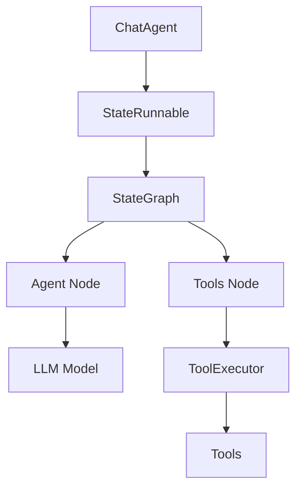
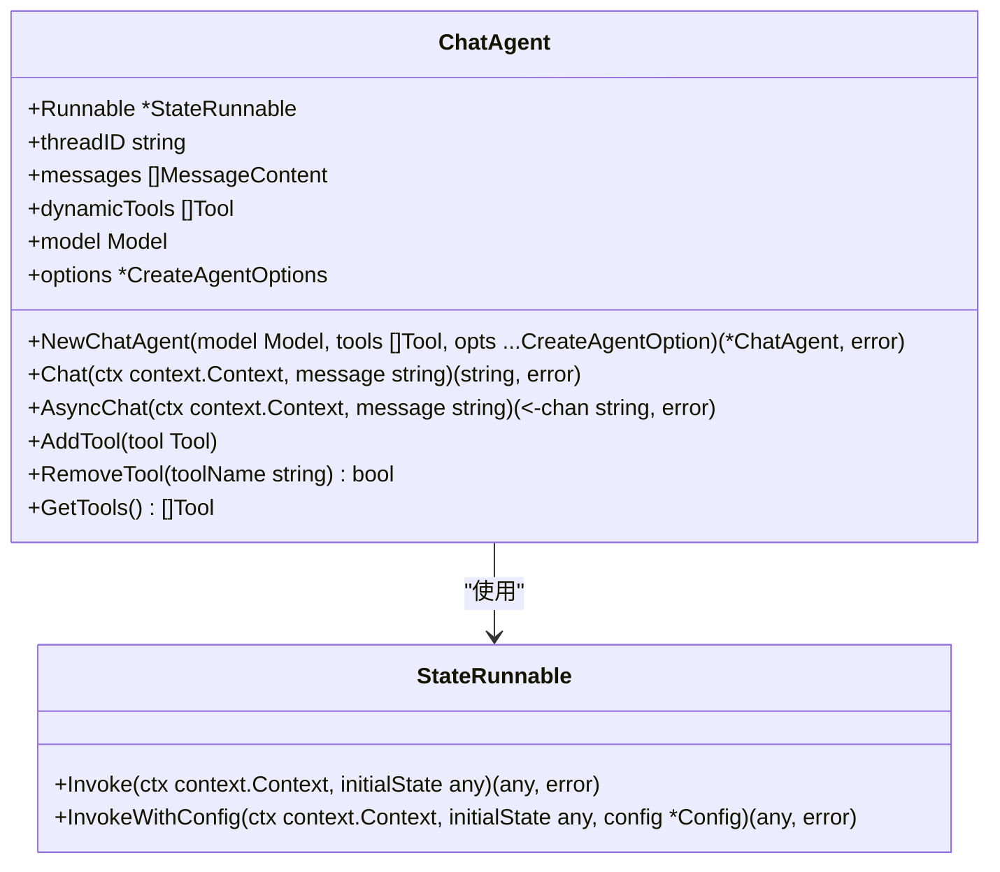
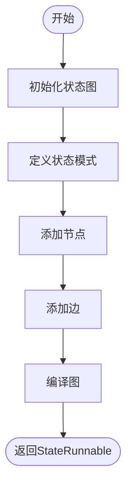
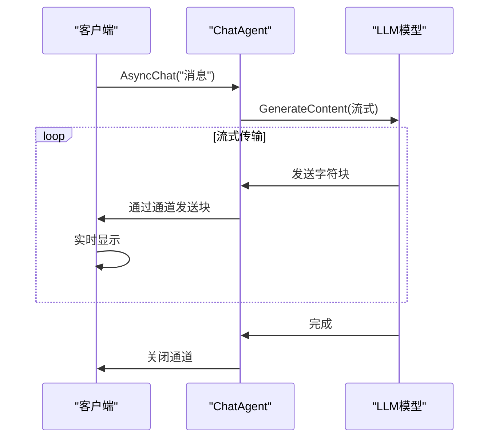

# 聊天代理

<cite>
**本文档中引用的文件**   
- [chat_agent.go](file://prebuilt/chat_agent.go)
- [create_agent.go](file://prebuilt/create_agent.go)
- [tool_executor.go](file://prebuilt/tool_executor.go)
- [state_graph.go](file://graph/state_graph.go)
- [schema.go](file://graph/schema.go)
- [main.go](file://examples/chat_agent/main.go)
- [main.go](file://examples/chat_agent_async/main.go)
- [main.go](file://examples/chat_agent_dynamic_tools/main.go)
- [CHAT_AGENT.md](file://docs/CHAT_AGENT.md)
- [README.md](file://examples/chat_agent/README.md)
- [README.md](file://examples/chat_agent_async/README.md)
- [README.md](file://examples/chat_agent_dynamic_tools/README.md)
</cite>

## 目录
1. [简介](#简介)
2. [核心功能](#核心功能)
3. [架构与设计](#架构与设计)
4. [详细组件分析](#详细组件分析)
5. [动态工具管理](#动态工具管理)
6. [异步流式处理](#异步流式处理)
7. [使用示例](#使用示例)
8. [配置选项](#配置选项)
9. [结论](#结论)

## 简介

聊天代理（ChatAgent）是LangGraphGo框架中的一个高级API，旨在简化多轮对话系统的构建。它提供了一个会话式的接口，能够自动管理对话历史和会话状态，使开发者能够轻松创建具有记忆能力的对话代理。

该系统基于底层的`CreateAgent`函数构建，封装了复杂的图结构和状态管理逻辑，为开发者提供了简洁易用的`Chat()`方法。每个`ChatAgent`实例都代表一个独立的对话会话，具有唯一的会话ID（thread ID），并自动维护完整的对话历史记录。

**Section sources**
- [CHAT_AGENT.md](file://docs/CHAT_AGENT.md#L1-L410)
- [README.md](file://examples/chat_agent/README.md#L1-L63)

## 核心功能

聊天代理系统提供了以下核心功能：

- **会话管理**：每个`ChatAgent`实例都有一个唯一的会话ID，用于标识和区分不同的对话会话
- **对话历史**：自动累积和维护完整的对话历史，确保代理能够参考之前的对话内容
- **简单API**：通过`Chat()`方法提供简洁的接口，支持多轮对话
- **记忆能力**：代理能够在多轮对话中记住上下文信息，如用户姓名等
- **动态工具**：支持在对话过程中动态添加、移除或更新工具
- **异步流式处理**：通过`AsyncChat()`和`AsyncChatWithChunks()`方法支持实时流式响应

这些功能使得聊天代理非常适合构建需要上下文感知和长期记忆的复杂对话系统。

**Section sources**
- [CHAT_AGENT.md](file://docs/CHAT_AGENT.md#L5-L12)
- [README.md](file://examples/chat_agent/README.md#L7-L10)

## 架构与设计

聊天代理系统的架构基于状态图（StateGraph）模式，利用`StateRunnable`来管理对话流程。系统的核心组件包括：

- `ChatAgent`：高层API，封装了会话管理和对话历史
- `CreateAgent`：底层函数，创建状态图并定义代理的行为
- `StateRunnable`：可执行的状态图实例
- `ToolExecutor`：工具执行器，负责执行各种工具调用



**Diagram sources **
- [chat_agent.go](file://prebuilt/chat_agent.go#L15-L28)
- [create_agent.go](file://prebuilt/create_agent.go#L67-L402)
- [tool_executor.go](file://prebuilt/tool_executor.go#L17-L29)

**Section sources**
- [chat_agent.go](file://prebuilt/chat_agent.go#L15-L28)
- [create_agent.go](file://prebuilt/create_agent.go#L67-L402)

## 详细组件分析

### ChatAgent 结构分析

`ChatAgent`结构体是整个系统的核心，它封装了对话会话的所有状态和行为。其主要字段包括：

- `Runnable`：底层的`StateRunnable`实例，负责实际的图执行
- `threadID`：会话的唯一标识符，使用UUID生成
- `messages`：存储完整的对话历史消息
- `dynamicTools`：动态工具列表，可在运行时修改
- `model`：使用的LLM模型引用
- `options`：创建代理时使用的配置选项



**Diagram sources **
- [chat_agent.go](file://prebuilt/chat_agent.go#L15-L28)

**Section sources**
- [chat_agent.go](file://prebuilt/chat_agent.go#L15-L28)

### CreateAgent 工作流程

`CreateAgent`函数负责创建底层的状态图，其工作流程如下：

1. **初始化状态图**：创建一个新的`StateGraph`实例
2. **定义状态模式**：使用`MapSchema`并注册`AppendReducer`用于消息和额外工具
3. **添加节点**：根据配置添加技能选择节点、代理节点和工具节点
4. **定义边**：设置节点之间的连接关系，包括条件边
5. **编译图**：将定义好的图编译为可执行的`StateRunnable`



**Diagram sources **
- [create_agent.go](file://prebuilt/create_agent.go#L67-L402)

**Section sources**
- [create_agent.go](file://prebuilt/create_agent.go#L67-L402)

## 动态工具管理

聊天代理系统支持在运行时动态管理工具，这为构建灵活的对话系统提供了强大的能力。主要的工具管理方法包括：

- `SetTools()`：用新工具列表替换所有动态工具
- `AddTool()`：向动态工具列表添加新工具
- `RemoveTool()`：从动态工具列表中移除指定工具
- `GetTools()`：获取当前动态工具列表的副本
- `ClearTools()`：清空所有动态工具

这些功能使得代理能够根据对话上下文动态调整其能力，例如在用户提到数学计算时添加计算器工具，或在用户认证后授予文件访问权限。

**Section sources**
- [chat_agent.go](file://prebuilt/chat_agent.go#L134-L179)
- [README.md](file://examples/chat_agent_dynamic_tools/README.md#L23-L40)

## 异步流式处理

聊天代理系统提供了两种异步流式处理方法，以支持实时响应：

- `AsyncChat()`：使用LLM的原生流式API，以字符级别流式传输响应
- `AsyncChatWithChunks()`：以单词级别流式传输响应，提供更好的可读性

这两种方法都返回一个字符串通道（channel），允许客户端在响应生成时立即开始处理，而不是等待完整响应。这提供了更好的用户体验，如实时打字效果和更快的感知性能。



**Diagram sources **
- [chat_agent.go](file://prebuilt/chat_agent.go#L185-L242)
- [README.md](file://examples/chat_agent_async/README.md#L26-L50)

**Section sources**
- [chat_agent.go](file://prebuilt/chat_agent.go#L185-L242)

## 使用示例

### 基本多轮对话

```go
// 创建ChatAgent
agent, err := prebuilt.NewChatAgent(model, nil)
if err != nil {
    log.Fatal(err)
}

// 多轮对话
response1, err := agent.Chat(ctx, "Hello! My name is Alice.")
response2, err := agent.Chat(ctx, "What's my name?")
// 代理会从历史中记住名字
```

### 动态工具管理

```go
// 添加计算器工具
calcTool := &CalculatorTool{}
agent.AddTool(calcTool)

// 添加天气工具
weatherTool := &WeatherTool{}
agent.AddTool(weatherTool)

// 移除计算器工具
agent.RemoveTool("calculator")
```

### 异步流式处理

```go
// 字符级别流式传输
respChan, err := agent.AsyncChat(ctx, "Explain quantum computing")
for char := range respChan {
    fmt.Print(char) // 立即打印每个字符
}

// 单词级别流式传输
respChan, err := agent.AsyncChatWithChunks(ctx, "Explain AI")
for word := range respChan {
    fmt.Print(word) // 立即打印每个单词
}
```

**Section sources**
- [main.go](file://examples/chat_agent/main.go#L12-L67)
- [main.go](file://examples/chat_agent_dynamic_tools/main.go#L93-L190)
- [main.go](file://examples/chat_agent_async/main.go#L13-L128)

## 配置选项

创建聊天代理时可以使用多种配置选项：

- `WithSystemMessage(message string)`：设置系统消息
- `WithStateModifier(func)`：在发送到模型前修改消息
- `WithVerbose(verbose bool)`：启用详细日志
- `WithSkillDir(dir string)`：启用基于技能的工具选择

```go
agent, err := prebuilt.NewChatAgent(
    model,
    tools,
    prebuilt.WithSystemMessage("You are a helpful assistant."),
    prebuilt.WithVerbose(true),
)
```

**Section sources**
- [create_agent.go](file://prebuilt/create_agent.go#L30-L64)
- [CHAT_AGENT.md](file://docs/CHAT_AGENT.md#L323-L340)

## 结论

聊天代理系统为构建复杂的对话应用提供了一个强大而灵活的框架。通过封装底层的图结构和状态管理，它为开发者提供了简洁易用的高层API，同时保留了足够的灵活性来支持高级功能如动态工具管理和异步流式处理。

该系统的设计充分考虑了实际应用需求，如会话管理、上下文记忆和实时响应，使其成为构建现代对话AI应用的理想选择。通过结合不同的功能特性，开发者可以创建出能够适应各种场景的智能对话代理。