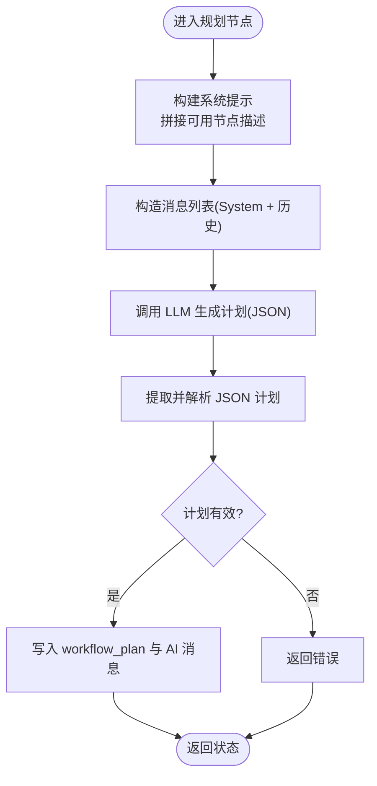

# 规划代理

<cite>
**本文引用的文件**
- [prebuilt/planning_agent.go](file://prebuilt/planning_agent.go)
- [examples/planning_agent/main.go](file://examples/planning_agent/main.go)
- [docs/PLANNINGAGENT.md](file://docs/PLANNINGAGENT.md)
- [docs/PLANNINGAGENT_CN.md](file://docs/PLANNINGAGENT_CN.md)
- [graph/state_graph.go](file://graph/state_graph.go)
- [graph/schema.go](file://graph/schema.go)
- [prebuilt/create_agent.go](file://prebuilt/create_agent.go)
</cite>

## 目录
1. [简介](#简介)
2. [项目结构](#项目结构)
3. [核心组件](#核心组件)
4. [架构总览](#架构总览)
5. [详细组件分析](#详细组件分析)
6. [依赖关系分析](#依赖关系分析)
7. [性能考量](#性能考量)
8. [故障排查指南](#故障排查指南)
9. [结论](#结论)
10. [附录](#附录)

## 简介
本文件系统性介绍“规划代理”（Planning Agent），该代理通过大模型（LLM）为每次用户请求动态生成工作流计划，再按计划动态构建并执行工作流，从而实现“按需适配”的工作流编排能力。相比固定工作流的代理，规划代理具备更高的灵活性与可扩展性，适用于复杂、多变的任务编排场景。

## 项目结构
围绕规划代理的关键文件与模块如下：
- 预置代理实现：规划代理的核心逻辑位于预置模块中，负责计划生成、动态图构建与执行。
- 示例应用：提供完整的端到端示例，展示如何定义节点、创建代理并执行。
- 文档：官方文档提供了架构、API、使用指南、最佳实践与故障排查。
- 图执行与状态管理：底层图执行引擎与状态 Schema 提供了状态合并、节点调度与执行编排的基础能力。

图表来源
- [prebuilt/planning_agent.go](file://prebuilt/planning_agent.go#L35-L228)
- [examples/planning_agent/main.go](file://examples/planning_agent/main.go#L1-L125)
- [graph/state_graph.go](file://graph/state_graph.go#L1-L120)
- [graph/schema.go](file://graph/schema.go#L1-L82)
- [docs/PLANNINGAGENT.md](file://docs/PLANNINGAGENT.md#L131-L191)
- [docs/PLANNINGAGENT_CN.md](file://docs/PLANNINGAGENT_CN.md#L131-L191)

章节来源
- [prebuilt/planning_agent.go](file://prebuilt/planning_agent.go#L35-L228)
- [examples/planning_agent/main.go](file://examples/planning_agent/main.go#L1-L125)
- [docs/PLANNINGAGENT.md](file://docs/PLANNINGAGENT.md#L1-L120)
- [docs/PLANNINGAGENT_CN.md](file://docs/PLANNINGAGENT_CN.md#L1-L120)

## 核心组件
- 规划节点（Planner Node）：接收用户请求与可用节点描述，调用 LLM 生成 JSON 格式的工作流计划；输出包含 messages 与 workflow_plan 的状态。
- 执行节点（Executor Node）：接收工作流计划，动态构建 StateGraph，添加节点与边，设置入口点，编译并执行工作流，返回最终状态。
- 工作流计划（WorkflowPlan）：由 nodes 与 edges 组成，支持 START/END 特殊节点与可选条件边；解析时会提取并校验 JSON。
- 状态 Schema：messages 使用追加合并（AppendReducer），workflow_plan 使用覆盖合并（OverwriteReducer），保证消息累积与计划替换的正确性。
- 图执行引擎：StateGraph 提供节点、边、条件边、入口点、Schema、编译与执行能力；StateRunnable 负责 Invoke 执行。

章节来源
- [prebuilt/planning_agent.go](file://prebuilt/planning_agent.go#L16-L34)
- [prebuilt/planning_agent.go](file://prebuilt/planning_agent.go#L58-L114)
- [prebuilt/planning_agent.go](file://prebuilt/planning_agent.go#L116-L219)
- [graph/state_graph.go](file://graph/state_graph.go#L1-L120)
- [graph/schema.go](file://graph/schema.go#L1-L82)

## 架构总览
规划代理采用“两阶段”执行：先规划后执行。规划阶段由 Planner 节点生成 JSON 计划；执行阶段由 Executor 节点动态构建 StateGraph 并运行。

图表来源
- [prebuilt/planning_agent.go](file://prebuilt/planning_agent.go#L58-L114)
- [prebuilt/planning_agent.go](file://prebuilt/planning_agent.go#L116-L219)
- [graph/state_graph.go](file://graph/state_graph.go#L102-L140)

章节来源
- [docs/PLANNINGAGENT.md](file://docs/PLANNINGAGENT.md#L84-L130)
- [docs/PLANNINGAGENT_CN.md](file://docs/PLANNINGAGENT_CN.md#L84-L130)

## 详细组件分析

### 规划节点（Planner Node）
- 输入：messages（含用户请求）、可用节点描述。
- 处理：构造系统提示，拼接历史消息，调用 LLM 生成 JSON 计划；解析并校验计划有效性；将计划写入 workflow_plan 字段。
- 输出：更新后的状态（messages 追加 AI 回答，workflow_plan 写入计划）。

图表来源
- [prebuilt/planning_agent.go](file://prebuilt/planning_agent.go#L58-L114)
- [prebuilt/planning_agent.go](file://prebuilt/planning_agent.go#L230-L278)
- [prebuilt/planning_agent.go](file://prebuilt/planning_agent.go#L280-L319)

章节来源
- [prebuilt/planning_agent.go](file://prebuilt/planning_agent.go#L58-L114)
- [prebuilt/planning_agent.go](file://prebuilt/planning_agent.go#L230-L278)
- [prebuilt/planning_agent.go](file://prebuilt/planning_agent.go#L280-L319)

### 执行节点（Executor Node）
- 输入：状态中的 workflow_plan。
- 处理：动态创建 StateGraph，注册 Schema，遍历计划 nodes 添加节点，遍历 edges 添加边（含条件边占位逻辑），设置入口点，编译并执行。
- 输出：返回动态图执行结果。

图表来源
- [prebuilt/planning_agent.go](file://prebuilt/planning_agent.go#L116-L219)
- [graph/state_graph.go](file://graph/state_graph.go#L1-L120)

章节来源
- [prebuilt/planning_agent.go](file://prebuilt/planning_agent.go#L116-L219)
- [graph/state_graph.go](file://graph/state_graph.go#L1-L120)

### 工作流计划（WorkflowPlan）与 JSON 解析
- 结构：nodes（节点名与类型）、edges（起止与可选条件）。
- 解析：支持 Markdown 代码块包裹的 JSON 与直接 JSON；解析后进行非空校验。
- 条件边：当前实现为占位，实际条件评估可扩展。

图表来源
- [prebuilt/planning_agent.go](file://prebuilt/planning_agent.go#L16-L34)
- [prebuilt/planning_agent.go](file://prebuilt/planning_agent.go#L280-L319)

章节来源
- [prebuilt/planning_agent.go](file://prebuilt/planning_agent.go#L16-L34)
- [prebuilt/planning_agent.go](file://prebuilt/planning_agent.go#L280-L319)

### 状态 Schema 与合并策略
- messages：使用 AppendReducer，保证消息累积。
- workflow_plan：使用 OverwriteReducer，保证每次规划覆盖上一次计划。
- 默认回退：未注册键使用覆盖策略。

图表来源
- [graph/schema.go](file://graph/schema.go#L1-L82)
- [graph/schema.go](file://graph/schema.go#L84-L134)

章节来源
- [graph/schema.go](file://graph/schema.go#L1-L82)
- [graph/schema.go](file://graph/schema.go#L84-L134)

### 图执行引擎与编译
- StateGraph：维护节点、边、条件边、入口点、Schema、重试策略与状态合并器。
- StateRunnable：编译后可执行，Invoke 时按入口点推进，支持中断、追踪与回调。

图表来源
- [graph/state_graph.go](file://graph/state_graph.go#L1-L120)
- [graph/state_graph.go](file://graph/state_graph.go#L102-L140)

章节来源
- [graph/state_graph.go](file://graph/state_graph.go#L1-L120)
- [graph/state_graph.go](file://graph/state_graph.go#L102-L140)

### 示例应用（数据处理流水线）
- 定义节点：fetch_data、validate_data、transform_data、analyze_data、save_results、generate_report。
- 创建代理：传入 LLM、节点集合与可选选项（如 verbose）。
- 执行：构造初始状态（messages），调用 agent.Invoke，打印最终消息链。

图表来源
- [examples/planning_agent/main.go](file://examples/planning_agent/main.go#L1-L125)
- [examples/planning_agent/main.go](file://examples/planning_agent/main.go#L127-L225)

章节来源
- [examples/planning_agent/main.go](file://examples/planning_agent/main.go#L1-L125)
- [examples/planning_agent/main.go](file://examples/planning_agent/main.go#L127-L225)

## 依赖关系分析
- 规划代理依赖：
  - 图执行引擎：StateGraph、StateRunnable。
  - 状态 Schema：MapSchema、AppendReducer、OverwriteReducer。
  - LLM：用于生成 JSON 计划。
  - 日志：verbose 模式下的信息输出。
- 示例应用依赖：
  - 规划代理 API。
  - LangChain LLM（OpenAI）初始化与调用。

图表来源
- [examples/planning_agent/main.go](file://examples/planning_agent/main.go#L1-L125)
- [prebuilt/planning_agent.go](file://prebuilt/planning_agent.go#L35-L228)
- [graph/state_graph.go](file://graph/state_graph.go#L1-L120)
- [graph/schema.go](file://graph/schema.go#L1-L82)

章节来源
- [examples/planning_agent/main.go](file://examples/planning_agent/main.go#L1-L125)
- [prebuilt/planning_agent.go](file://prebuilt/planning_agent.go#L35-L228)
- [graph/state_graph.go](file://graph/state_graph.go#L1-L120)
- [graph/schema.go](file://graph/schema.go#L1-L82)

## 性能考量
- 规划阶段开销：每次请求都需要调用 LLM 生成计划，带来额外推理成本。
- 动态图编译：执行阶段需要动态构建 StateGraph 并编译，存在一次性编译成本。
- 优化建议：
  - 对频繁使用的节点集合与提示词进行缓存或复用。
  - 在开发阶段开启 verbose 便于定位计划与执行问题，生产环境可关闭。
  - 控制计划复杂度，避免过长的节点链路导致执行时间增长。
  - 对条件边与分支进行合理设计，减少不必要的分支爆炸。

[本节为通用性能讨论，不直接分析具体文件]

## 故障排查指南
- 规划失败（LLM 未返回有效 JSON）：
  - 检查节点描述是否清晰、语义明确。
  - 确认 LLM 支持 JSON 输出格式。
  - 在系统提示中增加示例与约束。
- 节点选择错误：
  - 改进节点命名与描述，使其更语义化。
  - 在系统提示中加入领域知识与约束。
- 动态图编译失败：
  - 确保计划中的节点均存在于可用节点集合。
  - 检查 edges 是否形成环或缺少 START/END 连接。
  - 使用 verbose 模式查看构建过程日志。
- 执行异常：
  - 检查节点函数的错误处理与状态返回是否符合预期。
  - 核对 messages 与 workflow_plan 的状态合并是否正确。

章节来源
- [docs/PLANNINGAGENT.md](file://docs/PLANNINGAGENT.md#L582-L626)
- [docs/PLANNINGAGENT_CN.md](file://docs/PLANNINGAGENT_CN.md#L582-L626)
- [prebuilt/planning_agent.go](file://prebuilt/planning_agent.go#L280-L319)

## 结论
规划代理通过“LLM 规划 + 动态执行”的双阶段机制，实现了面向复杂任务的自适应工作流编排。其优势在于无需预设所有可能的组合，而是依据用户请求即时生成最优路径；同时，借助底层图执行引擎与状态 Schema，保证了执行的确定性与可观测性。结合示例与文档，开发者可快速落地数据处理、分析与报告生成等典型场景。

[本节为总结性内容，不直接分析具体文件]

## 附录
- API 参考（CreatePlanningAgent）与选项（verbose、system message、max iterations）详见文档。
- 使用指南与最佳实践（节点描述、错误处理、调试技巧）详见文档。
- 与其他代理（ReAct、Supervisor）的对比与适用场景详见文档。

章节来源
- [docs/PLANNINGAGENT.md](file://docs/PLANNINGAGENT.md#L131-L191)
- [docs/PLANNINGAGENT_CN.md](file://docs/PLANNINGAGENT_CN.md#L131-L191)
- [docs/PLANNINGAGENT.md](file://docs/PLANNINGAGENT.md#L390-L482)
- [docs/PLANNINGAGENT_CN.md](file://docs/PLANNINGAGENT_CN.md#L390-L482)