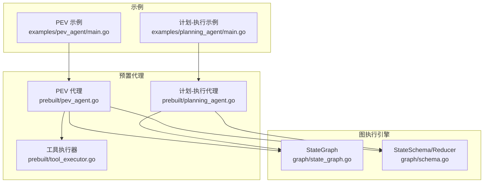
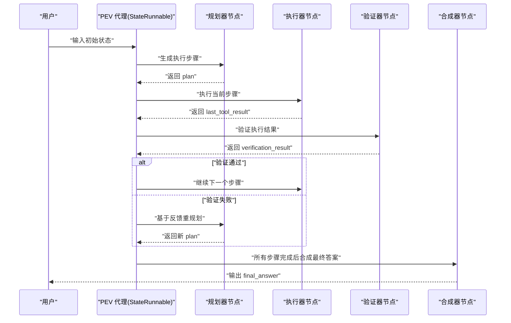
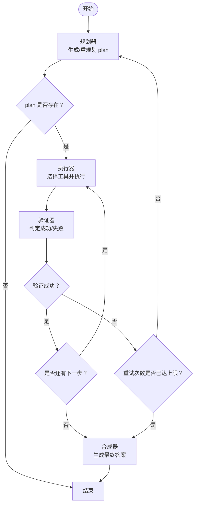
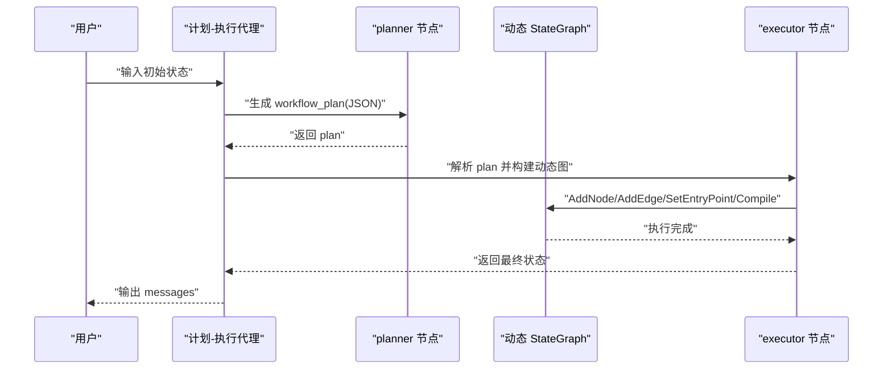
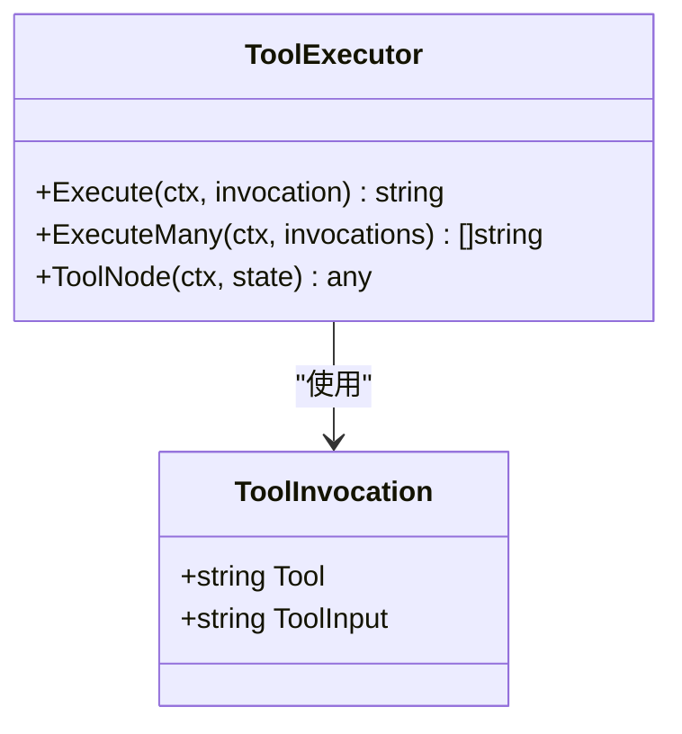
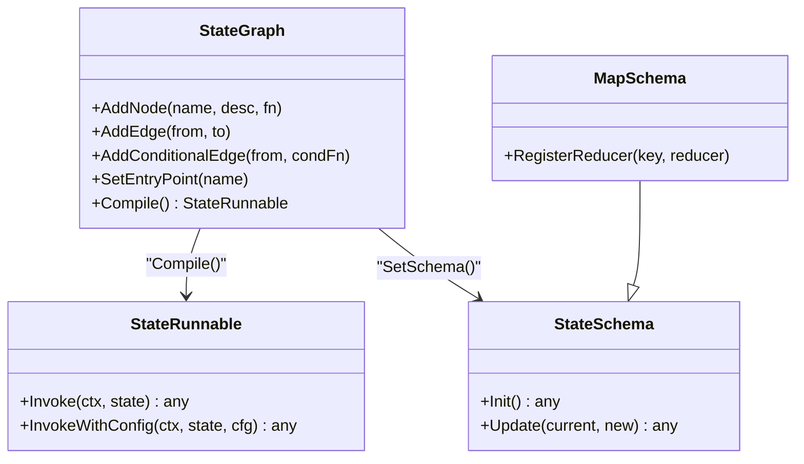
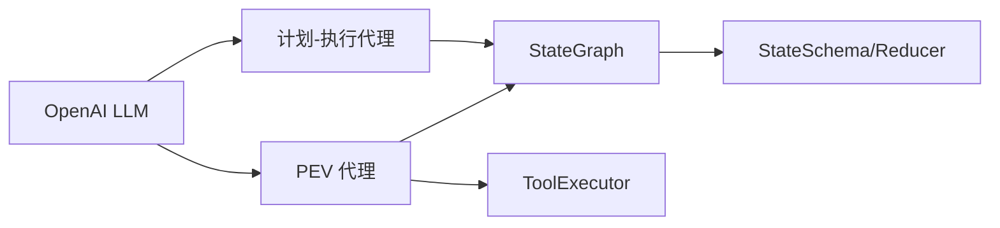

# 计划-执行-验证代理

<cite>
**本文引用的文件**
- [prebuilt/planning_agent.go](file://prebuilt/planning_agent.go)
- [examples/planning_agent/main.go](file://examples/planning_agent/main.go)
- [prebuilt/pev_agent.go](file://prebuilt/pev_agent.go)
- [examples/pev_agent/main.go](file://examples/pev_agent/main.go)
- [prebuilt/tool_executor.go](file://prebuilt/tool_executor.go)
- [graph/state_graph.go](file://graph/state_graph.go)
- [graph/schema.go](file://graph/schema.go)
- [examples/pev_agent/README_CN.md](file://examples/pev_agent/README_CN.md)
- [examples/pev_agent/README.md](file://examples/pev_agent/README.md)
- [prebuilt/planning_agent_test.go](file://prebuilt/planning_agent_test.go)
- [prebuilt/pev_agent_test.go](file://prebuilt/pev_agent_test.go)
</cite>

## 目录
1. [简介](#简介)
2. [项目结构](#项目结构)
3. [核心组件](#核心组件)
4. [架构总览](#架构总览)
5. [详细组件分析](#详细组件分析)
6. [依赖关系分析](#依赖关系分析)
7. [性能考量](#性能考量)
8. [故障排查指南](#故障排查指南)
9. [结论](#结论)
10. [附录](#附录)

## 简介
本文件围绕“计划-执行-验证”两类代理模式展开，系统化梳理了仓库中的两类核心能力：
- 计划-执行-验证（PEV）代理：通过“规划-执行-验证-重试-合成”的闭环，实现稳健可靠的多步任务执行，尤其适用于高风险、工具不可靠或流程复杂的应用场景。
- 计划-执行（Planning Agent）代理：由 LLM 生成工作流计划，随后动态编译并执行该计划，适合“先规划再执行”的场景。

两者均基于统一的状态图引擎，具备可观测性、可中断、可恢复等通用能力，并提供丰富的状态合并策略与路由机制。

## 项目结构
- 预置代理位于 prebuilt 目录，包含 PEV 与 Planning Agent 的完整实现。
- 图执行引擎位于 graph 目录，提供状态图、节点、边、条件边、Schema、Reducer 等基础能力。
- 工具执行器位于 prebuilt/tool_executor.go，封装工具选择与调用逻辑。
- 示例位于 examples 目录，分别演示 PEV 与 Planning Agent 的典型用法与行为。

图表来源
- [prebuilt/pev_agent.go](file://prebuilt/pev_agent.go#L1-L130)
- [prebuilt/planning_agent.go](file://prebuilt/planning_agent.go#L1-L120)
- [prebuilt/tool_executor.go](file://prebuilt/tool_executor.go#L1-L84)
- [graph/state_graph.go](file://graph/state_graph.go#L1-L120)
- [graph/schema.go](file://graph/schema.go#L46-L97)
- [examples/pev_agent/main.go](file://examples/pev_agent/main.go#L1-L120)
- [examples/planning_agent/main.go](file://examples/planning_agent/main.go#L1-L120)

章节来源
- [prebuilt/pev_agent.go](file://prebuilt/pev_agent.go#L1-L130)
- [prebuilt/planning_agent.go](file://prebuilt/planning_agent.go#L1-L120)
- [graph/state_graph.go](file://graph/state_graph.go#L1-L120)
- [graph/schema.go](file://graph/schema.go#L46-L97)
- [examples/pev_agent/main.go](file://examples/pev_agent/main.go#L1-L120)
- [examples/planning_agent/main.go](file://examples/planning_agent/main.go#L1-L120)

## 核心组件
- PEV 代理（Plan-Execute-Verify）
  - 节点：planner、executor、verifier、synthesizer
  - 状态键：messages、plan、current_step、last_tool_result、intermediate_steps、retries、verification_result、final_answer
  - 路由：根据验证结果决定继续下一步还是重试/合成
- 计划-执行代理（Planning Agent）
  - 节点：planner、executor
  - 状态键：messages、workflow_plan
  - 行为：LLM 生成 JSON 形式的节点与边，动态构建并执行工作流
- 工具执行器（ToolExecutor）
  - 将 LLM 选择的工具与参数转换为实际调用，返回字符串结果
- 图执行引擎（StateGraph）
  - 支持 AddNode/AddEdge/AddConditionalEdge/SetEntryPoint/Compile/Invoke 等
  - 提供 Schema 与 Reducer，支持消息追加、覆盖等合并策略

章节来源
- [prebuilt/pev_agent.go](file://prebuilt/pev_agent.go#L1-L130)
- [prebuilt/planning_agent.go](file://prebuilt/planning_agent.go#L1-L120)
- [prebuilt/tool_executor.go](file://prebuilt/tool_executor.go#L1-L84)
- [graph/state_graph.go](file://graph/state_graph.go#L1-L120)
- [graph/schema.go](file://graph/schema.go#L46-L97)

## 架构总览
PEV 与 Planning Agent 均基于 StateGraph 编排，前者采用“规划-执行-验证-重试-合成”的闭环；后者采用“计划-执行”的两段式流程。二者共享统一的图执行与状态管理能力。

图表来源
- [prebuilt/pev_agent.go](file://prebuilt/pev_agent.go#L110-L210)
- [prebuilt/pev_agent.go](file://prebuilt/pev_agent.go#L210-L448)

章节来源
- [prebuilt/pev_agent.go](file://prebuilt/pev_agent.go#L110-L210)
- [prebuilt/pev_agent.go](file://prebuilt/pev_agent.go#L210-L448)

## 详细组件分析

### PEV 代理（计划-执行-验证）
- 节点职责
  - planner：根据用户请求与历史消息生成步骤清单；失败时结合验证反馈重规划
  - executor：从工具集中选择并执行当前步骤，返回字符串结果
  - verifier：判断上一步执行是否成功，返回布尔结果与理由
  - synthesizer：汇总中间步骤，生成面向用户的最终回答
- 状态与合并策略
  - messages：AppendReducer（追加对话）
  - plan/current_step/last_tool_result/intermediate_steps/retries/verification_result/final_answer：OverwriteReducer（覆盖）
- 路由规则
  - 规划后：若 plan 为空则结束，否则进入执行器
  - 执行后：总是进入验证器
  - 验证后：成功则推进到下一步；失败且未达最大重试次数则回到规划器重规划；达到上限则进入合成器

图表来源
- [prebuilt/pev_agent.go](file://prebuilt/pev_agent.go#L110-L210)
- [prebuilt/pev_agent.go](file://prebuilt/pev_agent.go#L210-L448)

章节来源
- [prebuilt/pev_agent.go](file://prebuilt/pev_agent.go#L1-L130)
- [prebuilt/pev_agent.go](file://prebuilt/pev_agent.go#L132-L210)
- [prebuilt/pev_agent.go](file://prebuilt/pev_agent.go#L210-L448)
- [graph/schema.go](file://graph/schema.go#L46-L97)

### 计划-执行代理（Planning Agent）
- 节点职责
  - planner：基于可用节点描述与用户请求，生成 JSON 形式的节点与边
  - executor：解析 JSON 计划，动态构建 StateGraph 并执行
- 状态与合并策略
  - messages：AppendReducer（追加对话）
  - workflow_plan：OverwriteReducer（覆盖）
- 动态编译
  - 根据 plan 中的节点名查找原始节点函数，添加到动态图中
  - 解析 edges，设置入口点与终止边，编译并执行

图表来源
- [prebuilt/planning_agent.go](file://prebuilt/planning_agent.go#L58-L120)
- [prebuilt/planning_agent.go](file://prebuilt/planning_agent.go#L120-L228)

章节来源
- [prebuilt/planning_agent.go](file://prebuilt/planning_agent.go#L1-L120)
- [prebuilt/planning_agent.go](file://prebuilt/planning_agent.go#L120-L228)

### 工具执行器（ToolExecutor）
- 职责：将 LLM 输出的工具选择与参数映射为具体工具调用，返回字符串结果
- 能力：单次执行、批量执行（顺序）、从多种状态格式解析调用参数

图表来源
- [prebuilt/tool_executor.go](file://prebuilt/tool_executor.go#L1-L84)

章节来源
- [prebuilt/tool_executor.go](file://prebuilt/tool_executor.go#L1-L84)

### 图执行引擎（StateGraph）与状态 Schema
- StateGraph
  - 节点：AddNode
  - 边：AddEdge、AddConditionalEdge
  - 入口：SetEntryPoint
  - 编译：Compile 返回 StateRunnable
  - 执行：Invoke/InvokeWithConfig
- StateSchema/Reducer
  - OverwriteReducer：覆盖旧值
  - AppendReducer：向切片追加元素或切片
  - MapSchema：按键注册 Reducer，支持默认覆盖

图表来源
- [graph/state_graph.go](file://graph/state_graph.go#L1-L120)
- [graph/schema.go](file://graph/schema.go#L46-L97)

章节来源
- [graph/state_graph.go](file://graph/state_graph.go#L1-L120)
- [graph/schema.go](file://graph/schema.go#L46-L97)

## 依赖关系分析
- PEV 代理依赖
  - StateGraph：编排节点与边
  - ToolExecutor：工具选择与执行
  - StateSchema/Reducer：状态合并策略
- Planning Agent 代理依赖
  - StateGraph：动态构建与执行工作流
  - StateSchema/Reducer：状态合并策略
- 示例依赖
  - OpenAI LLM：PEV 与 Planning Agent 的 LLM 供应商
  - 自定义工具：计算器、天气查询、数据库查询等

图表来源
- [examples/pev_agent/main.go](file://examples/pev_agent/main.go#L1-L120)
- [examples/planning_agent/main.go](file://examples/planning_agent/main.go#L1-L120)
- [prebuilt/pev_agent.go](file://prebuilt/pev_agent.go#L1-L130)
- [prebuilt/planning_agent.go](file://prebuilt/planning_agent.go#L1-L120)
- [graph/state_graph.go](file://graph/state_graph.go#L1-L120)
- [graph/schema.go](file://graph/schema.go#L46-L97)

章节来源
- [examples/pev_agent/main.go](file://examples/pev_agent/main.go#L1-L120)
- [examples/planning_agent/main.go](file://examples/planning_agent/main.go#L1-L120)
- [prebuilt/pev_agent.go](file://prebuilt/pev_agent.go#L1-L130)
- [prebuilt/planning_agent.go](file://prebuilt/planning_agent.go#L1-L120)
- [graph/state_graph.go](file://graph/state_graph.go#L1-L120)
- [graph/schema.go](file://graph/schema.go#L46-L97)

## 性能考量
- LLM 调用成本
  - PEV：规划、验证、合成各一次 LLM 调用；失败重试会增加调用次数
  - Planning Agent：规划一次 LLM 调用；动态执行期间按节点数量调用
- 工具调用稳定性
  - 不可靠的外部工具会触发 PEV 的重试与重规划，提高成功率但可能增加延迟
- 状态增长
  - messages 与 intermediate_steps 使用 AppendReducer，长期运行可能导致状态体积增大，建议在合成阶段清理冗余信息
- 并行执行
  - StateGraph 支持并行节点与合并器；PEV 默认顺序执行，如需加速可在工具层面引入并行策略

## 故障排查指南
- 常见错误与定位
  - 规划器/验证器/执行器节点缺少必要状态键：检查 StateSchema 注册与 Reducer 设置
  - 工具未找到或参数不合法：检查 ToolExecutor 的工具映射与输入解析
  - 动态工作流构建失败：检查 workflow_plan 的节点名是否存在于可用节点集合
  - LLM 输出格式异常：PEV 的工具选择与验证结果解析均尝试提取 JSON，若格式不符将导致解析失败
- 测试参考
  - PEV：包含模型与工具缺失、步骤解析、验证结果解析等测试用例
  - Planning Agent：包含简单工作流与详细日志的测试用例

章节来源
- [prebuilt/pev_agent_test.go](file://prebuilt/pev_agent_test.go#L1-L200)
- [prebuilt/planning_agent_test.go](file://prebuilt/planning_agent_test.go#L1-L200)

## 结论
PEV 与 Planning Agent 两种代理模式分别面向“稳健的多步任务执行”和“先规划再执行”的工作流场景。它们共享统一的图执行引擎与状态管理能力，具备可观测性、可中断、可恢复与自纠错特性。在实际应用中，应根据任务复杂度、工具可靠性与质量要求选择合适的模式，并结合工具并行化与状态清理策略优化性能与成本。

## 附录
- 使用场景建议
  - PEV：高风险自动化、工具不可靠、复杂多步骤任务、质量关键应用
  - Planning Agent：需求明确、节点可复用、希望由 LLM 自动生成工作流
- 状态模式参考
  - PEV 代理状态键与用途详见示例文档

章节来源
- [examples/pev_agent/README_CN.md](file://examples/pev_agent/README_CN.md#L61-L97)
- [examples/pev_agent/README.md](file://examples/pev_agent/README.md#L68-L97)