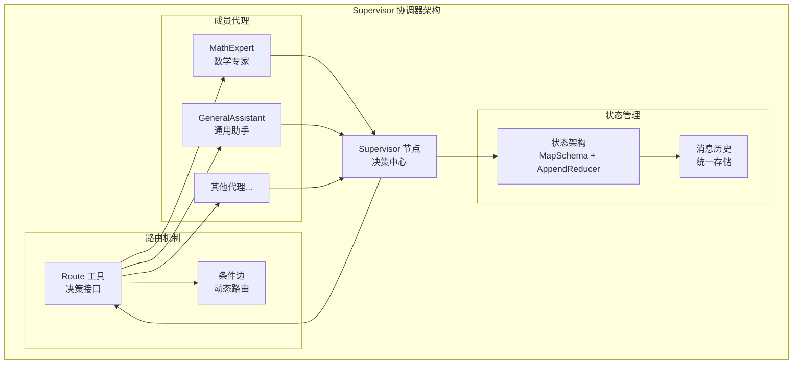
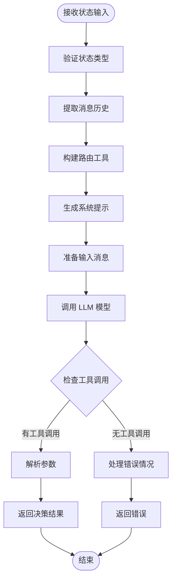
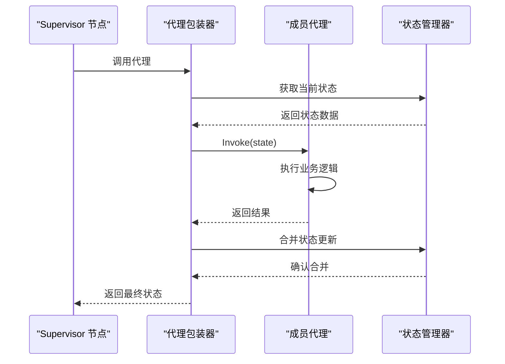
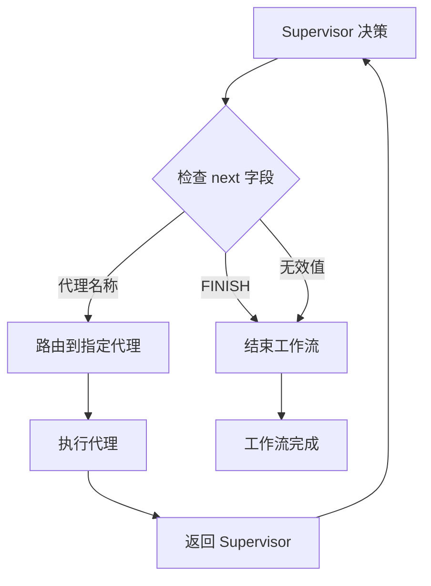
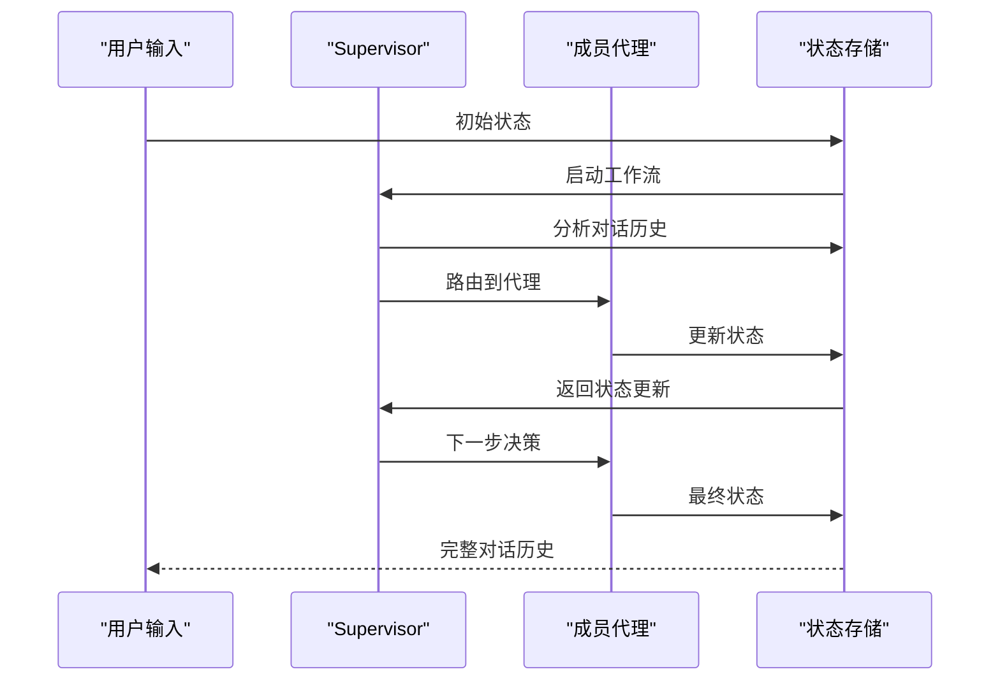
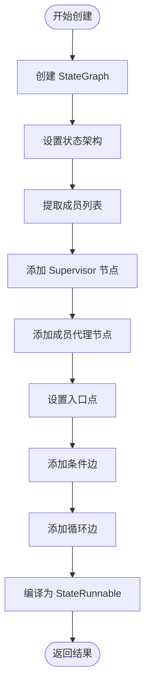
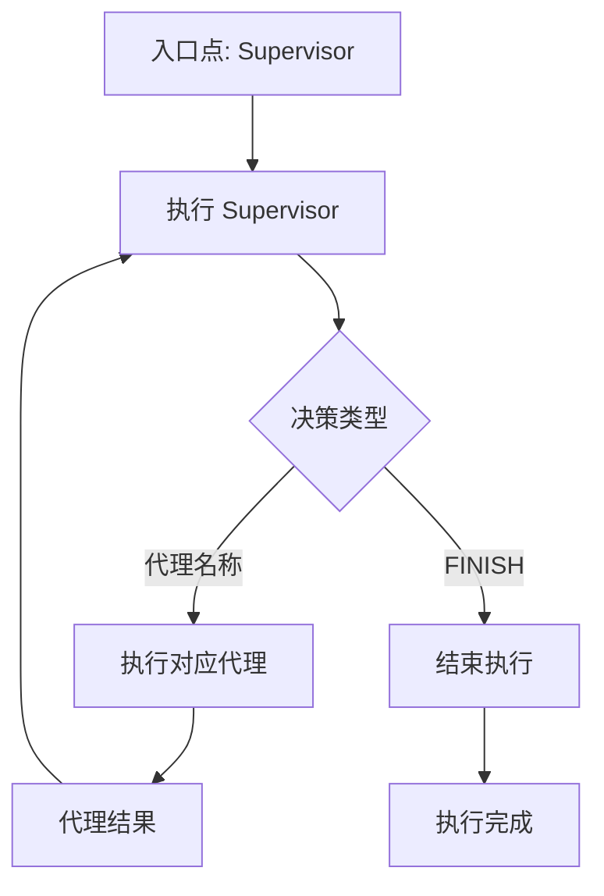

# 协调器 (Supervisor) API 参考文档

<cite>
**本文档中引用的文件**
- [prebuilt/supervisor.go](file://prebuilt/supervisor.go)
- [examples/supervisor/main.go](file://examples/supervisor/main.go)
- [examples/supervisor/README.md](file://examples/supervisor/README.md)
- [graph/state_graph.go](file://graph/state_graph.go)
- [prebuilt/create_agent.go](file://prebuilt/create_agent.go)
- [prebuilt/supervisor_test.go](file://prebuilt/supervisor_test.go)
</cite>

## 目录
1. [简介](#简介)
2. [函数签名与参数](#函数签名与参数)
3. [核心架构](#核心架构)
4. [详细组件分析](#详细组件分析)
5. [状态管理](#状态管理)
6. [执行流程](#执行流程)
7. [使用示例](#使用示例)
8. [最佳实践](#最佳实践)
9. [故障排除](#故障排除)
10. [总结](#总结)

## 简介

`CreateSupervisor` 函数是 langgraphgo 中用于创建多代理系统协调器的核心函数。它实现了 Supervisor 模式，这是一种中央协调者模式，其中 supervisor 代理负责在多个专门化的工作者代理之间路由任务。这种模式特别适用于需要复杂工作流管理和任务分配的多代理系统。

### 核心功能特性

- **智能路由决策**：基于对话历史和当前状态，使用 LLM 做出路由决策
- **动态工作流管理**：支持运行时的工作流配置和调整
- **状态一致性保证**：维护统一的状态结构，确保各代理间的数据同步
- **灵活的终止机制**：支持通过 "FINISH" 命令优雅地结束工作流

## 函数签名与参数

### 函数原型

```go
func CreateSupervisor(model llms.Model, members map[string]*graph.StateRunnable) (*graph.StateRunnable, error)
```

### 参数详解

#### llms.Model（模型参数）

**类型**：`llms.Model`

**作用**：用于决策的大型语言模型实例

**关键特性**：
- **推理能力**：负责分析对话历史并做出路由决策
- **工具调用**：支持通过工具调用机制选择下一个执行的代理
- **上下文理解**：能够理解复杂的对话上下文和任务需求

**实现细节**：
- 使用 `GenerateContent` 方法进行推理
- 配置工具调用选项以强制使用路由工具
- 支持各种 LLM 实现（如 OpenAI、本地模型等）

#### members（成员映射参数）

**类型**：`map[string]*graph.StateRunnable`

**作用**：成员代理的映射表，键为代理名称，值为对应的 StateRunnable 实例

**设计原则**：
- **命名规范**：代理名称应具有描述性，便于理解和调试
- **状态兼容性**：所有成员代理必须共享相同的状态架构
- **可扩展性**：支持动态添加或移除代理成员

**内部处理**：
- 自动提取代理名称列表
- 为每个代理创建相应的节点
- 维护代理间的循环依赖关系

**Section sources**
- [prebuilt/supervisor.go](file://prebuilt/supervisor.go#L13-L153)

## 核心架构

### 整体架构图



**图表来源**
- [prebuilt/supervisor.go](file://prebuilt/supervisor.go#L14-L153)
- [graph/state_graph.go](file://graph/state_graph.go#L10-L56)

### 状态架构设计

```mermaid
classDiagram
class StateSchema {
+RegisterReducer(key, reducer)
+MergeStates(states)
}
class MapSchema {
+reducers map[string]Reducer
+RegisterReducer(key, reducer)
+MergeStates(states)
}
class AppendReducer {
+Reduce(oldValue, newValue) interface{}
}
class StateRunnable {
+Invoke(ctx, state) interface{}
+Compile() StateRunnable
}
StateSchema <|-- MapSchema
MapSchema --> AppendReducer : "使用"
StateRunnable --> StateSchema : "依赖"
```

**图表来源**
- [prebuilt/supervisor.go](file://prebuilt/supervisor.go#L17-L21)
- [graph/state_graph.go](file://graph/state_graph.go#L100-L113)

**Section sources**
- [prebuilt/supervisor.go](file://prebuilt/supervisor.go#L17-L21)

## 详细组件分析

### Supervisor 节点实现

#### 决策逻辑核心

Supervisor 节点是整个协调器的核心，负责分析当前状态并做出路由决策：



**图表来源**
- [prebuilt/supervisor.go](file://prebuilt/supervisor.go#L30-L105)

#### 路由工具定义

路由工具是 Supervisor 做出决策的关键机制：

**工具规格**：
- **名称**：`route`
- **描述**：选择下一个角色
- **参数结构**：包含 `next` 字段的枚举类型
- **可用选项**：所有成员代理名称 + "FINISH"

**参数验证**：
- 必需字段：`next`
- 枚举值：代理名称列表或 "FINISH"
- 类型约束：字符串类型

#### 系统提示模板

Supervisor 使用精心设计的系统提示来指导 LLM 做出正确的决策：

**提示内容结构**：
1. **角色定位**：明确 Supervisor 的职责
2. **可用资源**：列出所有可用的代理成员
3. **决策规则**：强调使用 `route` 工具的重要性
4. **输出格式**：要求严格的工具调用格式

**Section sources**
- [prebuilt/supervisor.go](file://prebuilt/supervisor.go#L41-L76)

### 成员代理节点

#### 代理包装机制

每个成员代理都被包装成一个标准的 StateRunnable 节点：



**图表来源**
- [prebuilt/supervisor.go](file://prebuilt/supervisor.go#L116-L126)

#### 状态传递策略

成员代理采用直接状态传递的方式：
- **完整状态传递**：将整个状态对象传递给代理
- **状态隔离**：确保代理只能访问允许修改的部分
- **状态合并**：自动合并代理返回的状态更新

**Section sources**
- [prebuilt/supervisor.go](file://prebuilt/supervisor.go#L116-L126)

### 条件边路由机制

#### 动态路由逻辑

条件边根据 Supervisor 的决策动态确定下一个执行节点：



**图表来源**
- [prebuilt/supervisor.go](file://prebuilt/supervisor.go#L134-L144)

#### 路由条件实现

条件边的判断逻辑简洁而高效：

**判断规则**：
1. **正常路由**：当 `next` 等于某个代理名称时，路由到该代理
2. **工作流结束**：当 `next` 等于 "FINISH" 时，结束工作流
3. **异常处理**：其他情况下视为工作流结束

**Section sources**
- [prebuilt/supervisor.go](file://prebuilt/supervisor.go#L134-L144)

## 状态管理

### 状态架构设计

#### MapSchema 架构

Supervisor 使用 MapSchema 作为状态架构的基础：

**核心特性**：
- **键值对存储**：以字符串键存储任意类型的值
- **可扩展性**：支持动态添加新的状态字段
- **类型安全**：通过类型断言确保数据完整性

#### AppendReducer 机制

消息历史使用 AppendReducer 进行特殊处理：

**处理逻辑**：
- **追加操作**：新消息总是追加到现有消息列表末尾
- **顺序保持**：确保消息按时间顺序排列
- **不可变性**：原有消息不会被修改

### 状态流转过程



**图表来源**
- [prebuilt/supervisor.go](file://prebuilt/supervisor.go#L17-L21)

**Section sources**
- [prebuilt/supervisor.go](file://prebuilt/supervisor.go#L17-L21)

## 执行流程

### 初始化阶段

#### 图表构建过程



**图表来源**
- [prebuilt/supervisor.go](file://prebuilt/supervisor.go#L14-L152)

#### 状态初始化

**初始状态结构**：
```go
initialState := map[string]interface{}{
    "messages": []llms.MessageContent{
        llms.TextParts(llms.ChatMessageTypeHuman, "用户请求"),
    },
}
```

**状态字段说明**：
- **messages**：对话历史记录
- **next**：Supervisor 决策结果（运行时添加）

### 执行阶段

#### 主循环流程



**图表来源**
- [graph/state_graph.go](file://graph/state_graph.go#L126-L200)

#### 并发执行机制

StateGraph 支持并发节点执行：

**并发特性**：
- **并行执行**：多个节点可以同时执行
- **状态隔离**：每个节点拥有独立的状态副本
- **结果合并**：自动合并所有节点的执行结果

**Section sources**
- [prebuilt/supervisor.go](file://prebuilt/supervisor.go#L146-L152)
- [graph/state_graph.go](file://graph/state_graph.go#L126-L200)

## 使用示例

### 基础使用示例

以下展示了如何创建和使用 Supervisor 协调器的基本流程：

#### 代理创建

```go
// 创建数学专家代理
mathAgent, err := prebuilt.CreateReactAgent(model, []tools.Tool{CalculatorTool{}})
if err != nil {
    log.Fatal(err)
}

// 创建通用助手代理
generalAgent, err := prebuilt.CreateReactAgent(model, []tools.Tool{})
if err != nil {
    log.Fatal(err)
}
```

#### 协调器配置

```go
members := map[string]*graph.StateRunnable{
    "MathExpert":       mathAgent,
    "GeneralAssistant": generalAgent,
}

supervisor, err := prebuilt.CreateSupervisor(model, members)
if err != nil {
    log.Fatal(err)
}
```

#### 执行流程

```go
// 设置初始状态
initialState := map[string]interface{}{
    "messages": []llms.MessageContent{
        llms.TextParts(llms.ChatMessageTypeHuman, "计算 10 * 5 并告诉我关于结果的笑话"),
    },
}

// 执行工作流
ctx, cancel := context.WithTimeout(context.Background(), 30*time.Second)
defer cancel()

result, err := supervisor.Invoke(ctx, initialState)
if err != nil {
    log.Fatal(err)
}
```

### 高级使用场景

#### 多层代理协作

```go
// 创建多层级代理系统
researchAgent, _ := prebuilt.CreateReactAgent(model, []tools.Tool{ResearchTool{}})
analysisAgent, _ := prebuilt.CreateReactAgent(model, []tools.Tool{AnalysisTool{}})
reportAgent, _ := prebuilt.CreateReactAgent(model, []tools.Tool{ReportTool{}})

multiLevelMembers := map[string]*graph.StateRunnable{
    "Researcher": researchAgent,
    "Analyst":    analysisAgent,
    "Reporter":   reportAgent,
}

multiLevelSupervisor, _ := CreateSupervisor(model, multiLevelMembers)
```

#### 条件路由示例

```go
// 基于任务类型的条件路由
conditionalSupervisor, _ := CreateSupervisor(model, map[string]*graph.StateRunnable{
    "DataProcessor": dataProcessor,
    "TextGenerator": textGenerator,
    "ImageCreator":  imageCreator,
})

// Supervisor 将根据任务内容自动选择合适的代理
```

**Section sources**
- [examples/supervisor/main.go](file://examples/supervisor/main.go#L71-L137)

## 最佳实践

### 代理设计原则

#### 代理职责分离

**单一职责原则**：
- 每个代理应该专注于特定的任务领域
- 避免创建过于通用的代理
- 明确代理的能力边界

#### 代理命名规范

**命名建议**：
- 使用描述性的代理名称
- 避免使用技术术语
- 考虑用户的理解角度

### 状态管理最佳实践

#### 状态架构设计

**推荐模式**：
- 使用统一的消息历史字段
- 为特殊状态添加专用字段
- 保持状态结构的简洁性

#### 错误处理策略

**容错机制**：
- 实现超时控制
- 添加重试机制
- 提供有意义的错误信息

### 性能优化建议

#### 并发执行优化

**优化策略**：
- 合理设计代理间的依赖关系
- 避免不必要的状态复制
- 监控内存使用情况

#### LLM 调用优化

**调优建议**：
- 使用适当的温度参数
- 优化提示词设计
- 考虑成本效益平衡

## 故障排除

### 常见问题及解决方案

#### Supervisor 决策失败

**问题症状**：
- Supervisor 不调用路由工具
- 返回空结果或错误信息

**解决方案**：
1. 检查 LLM 模型配置
2. 验证路由工具定义
3. 确认系统提示的清晰度

#### 状态同步问题

**问题症状**：
- 代理间状态不一致
- 消息历史丢失

**解决方案**：
1. 验证状态架构配置
2. 检查状态合并逻辑
3. 确认代理状态传递方式

#### 循环依赖问题

**问题症状**：
- 工作流无法正常结束
- 无限循环执行

**解决方案**：
1. 检查条件边配置
2. 验证 "FINISH" 路径
3. 添加递归深度限制

### 调试技巧

#### 状态监控

```go
// 启用调试输出
fmt.Printf("Debug: Current state: %+v\n", currentState)
fmt.Printf("Debug: Supervisor decision: %s\n", decision)
```

#### 执行跟踪

```go
// 添加执行时间跟踪
startTime := time.Now()
result, err := supervisor.Invoke(ctx, initialState)
elapsedTime := time.Since(startTime)
fmt.Printf("Execution time: %v\n", elapsedTime)
```

**Section sources**
- [prebuilt/supervisor_test.go](file://prebuilt/supervisor_test.go#L65-L128)

## 总结

`CreateSupervisor` 函数为 langgraphgo 提供了强大而灵活的多代理系统协调能力。通过智能的路由决策、统一的状态管理和动态的工作流控制，它能够有效地管理复杂的多代理交互场景。

### 核心优势

1. **智能化决策**：利用 LLM 的推理能力做出最优路由决策
2. **灵活的架构**：支持动态添加和移除代理成员
3. **状态一致性**：确保所有代理共享统一的状态视图
4. **优雅的终止**：通过 "FINISH" 机制实现工作流的优雅结束

### 应用场景

- **客服系统**：根据客户问题类型路由到不同专业客服
- **研发协作**：协调不同领域的研发人员完成复杂项目
- **内容创作**：组织多个创作者协同完成内容生产
- **数据分析**：协调数据收集、处理和分析的不同阶段

### 发展方向

随着 AI 技术的发展，Supervisor 模式将在以下方面继续演进：
- 更智能的决策算法
- 更丰富的状态管理功能
- 更高效的并发执行机制
- 更完善的监控和调试工具

通过深入理解和正确使用 `CreateSupervisor` 函数，开发者可以构建出更加智能和高效的多代理系统，为用户提供更好的服务体验。