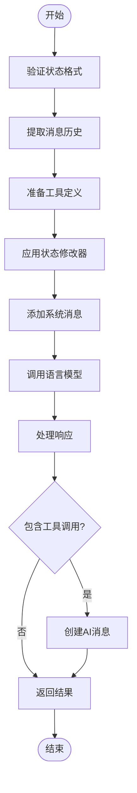
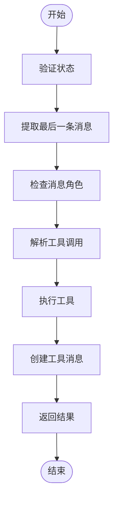
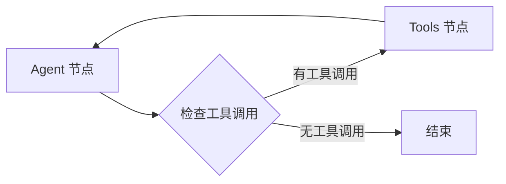
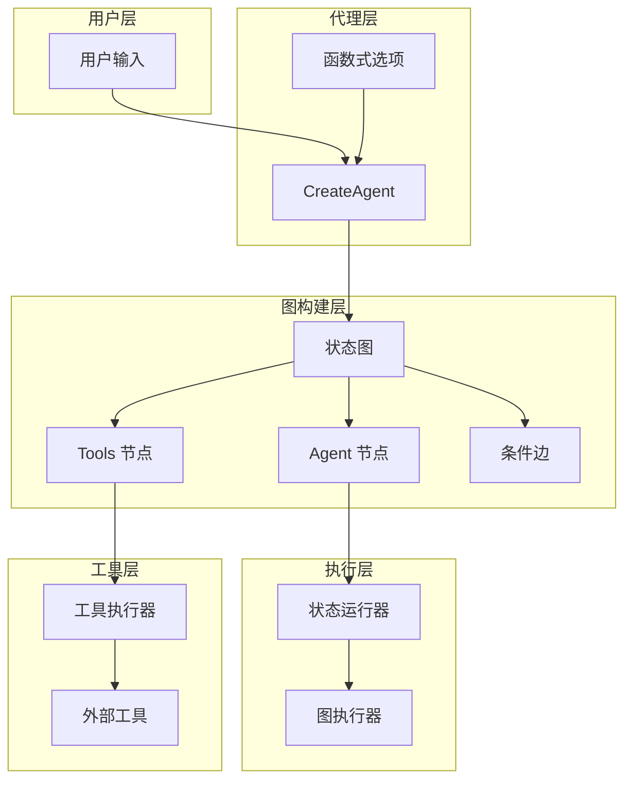
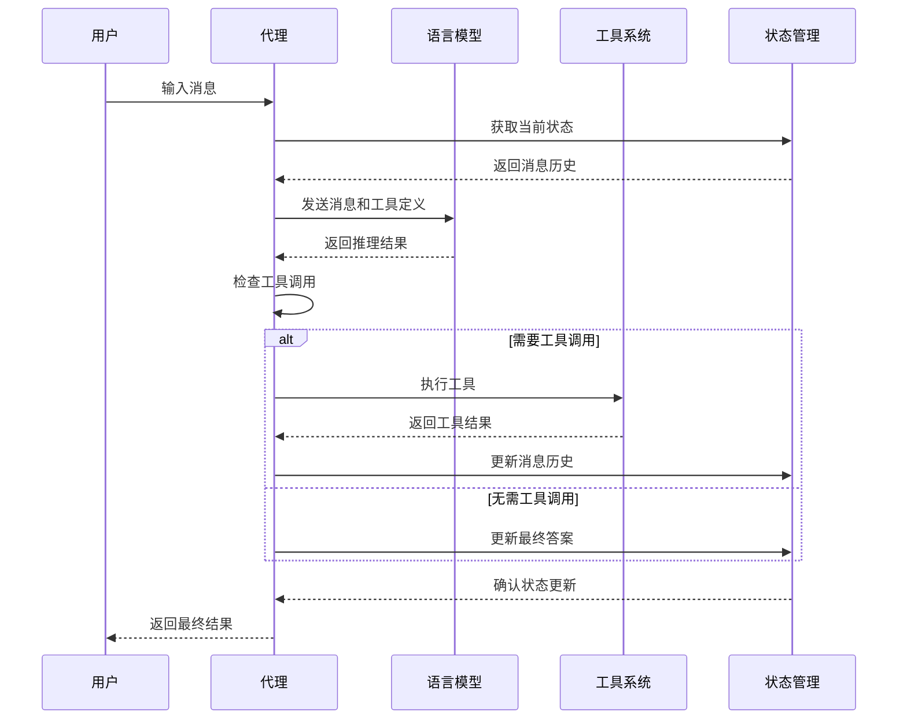
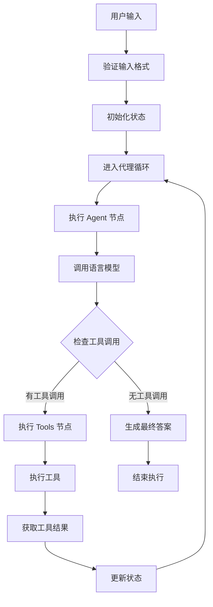

# 智能代理 (CreateAgent) API 参考文档

<cite>
**本文档中引用的文件**
- [prebuilt/create_agent.go](file://prebuilt/create_agent.go)
- [examples/create_agent/main.go](file://examples/create_agent/main.go)
- [examples/create_agent/README.md](file://examples/create_agent/README.md)
- [prebuilt/tool_executor.go](file://prebuilt/tool_executor.go)
- [graph/state_graph.go](file://graph/state_graph.go)
</cite>

## 目录
1. [简介](#简介)
2. [核心功能概述](#核心功能概述)
3. [函数签名与参数](#函数签名与参数)
4. [函数式选项详解](#函数式选项详解)
5. [返回值分析](#返回值分析)
6. [架构设计](#架构设计)
7. [工作流程详解](#工作流程详解)
8. [使用示例](#使用示例)
9. [最佳实践](#最佳实践)
10. [故障排除](#故障排除)

## 简介

`CreateAgent` 是 langgraphgo 库中的核心工厂函数，专门用于构建基于 ReAct 模式的智能代理。该函数采用函数式选项模式，提供了灵活而强大的配置能力，使开发者能够轻松创建具有工具调用能力的智能代理系统。

ReAct 模式代表 "Reasoning and Acting"（推理与行动），这是一种经典的智能代理构建范式，其中模型不仅生成文本响应，还会推理问题、调用外部工具、观察结果，并重复这一过程直到能够回答用户的问题。

## 核心功能概述

`CreateAgent` 函数的主要职责包括：

- **代理图构建**: 自动创建包含智能推理和工具调用逻辑的状态图
- **工具集成**: 将提供的工具无缝集成到代理的工作流中
- **消息管理**: 处理复杂的对话历史和消息流转
- **条件路由**: 基于工具调用决策的智能路由机制
- **扩展性支持**: 通过函数式选项提供灵活的配置能力

## 函数签名与参数

### 主要函数签名

```go
func CreateAgent(model llms.Model, inputTools []tools.Tool, opts ...CreateAgentOption) (*graph.StateRunnable, error)
```

### 参数详解

| 参数 | 类型 | 描述 |
|------|------|------|
| `model` | `llms.Model` | 语言模型实例，负责推理和工具调用决策 |
| `inputTools` | `[]tools.Tool` | 工具列表，代理可以调用的外部功能集合 |
| `opts` | `...CreateAgentOption` | 可变数量的函数式选项，用于配置代理行为 |

### 返回值

- **`*graph.StateRunnable`**: 编译后的状态图运行器，可用于执行代理
- **`error`**: 错误信息，当创建过程中出现错误时返回

**章节来源**
- [prebuilt/create_agent.go](file://prebuilt/create_agent.go#L46-L251)

## 函数式选项详解

`CreateAgent` 支持三种主要的函数式选项，每种都提供了特定的配置能力：

### WithSystemMessage

#### 功能描述
设置代理的系统消息，定义代理的行为准则和角色定位。

#### 实现原理
```go
func WithSystemMessage(message string) CreateAgentOption {
    return func(o *CreateAgentOptions) {
        o.SystemMessage = message
    }
}
```

#### 使用场景
- **角色定义**: "你是一个专业的天气咨询助手"
- **行为指导**: "始终保持礼貌和专业"
- **任务说明**: "专注于提供准确的天气信息"

#### 执行时机
系统消息会在以下时机被处理：
1. 在消息历史处理之前添加到消息列表开头
2. 如果提供了 `StateModifier`，则在应用修改器之后添加
3. 确保代理始终知道其角色定位

### WithStateModifier

#### 功能描述
提供消息历史的动态修改能力，在消息发送给 LLM 之前进行拦截和处理。

#### 实现原理
```go
func WithStateModifier(modifier func(messages []llms.MessageContent) []llms.MessageContent) CreateAgentOption {
    return func(o *CreateAgentOptions) {
        o.StateModifier = modifier
    }
}
```

#### 核心特性
- **消息拦截**: 在推理前访问和修改完整的消息历史
- **动态处理**: 支持基于内容的条件修改逻辑
- **灵活性**: 可以实现各种高级功能如日志记录、过滤、增强等

#### 常见用途
```go
// 日志记录示例
prebuilt.WithStateModifier(func(msgs []llms.MessageContent) []llms.MessageContent {
    log.Printf("当前消息数量: %d", len(msgs))
    return msgs
})

// 消息过滤示例
prebuilt.WithStateModifier(func(msgs []llms.MessageContent) []llms.MessageContent {
    // 移除系统消息或其他特定消息类型
    filtered := make([]llms.MessageContent, 0)
    for _, msg := range msgs {
        if msg.Role != llms.ChatMessageTypeSystem {
            filtered = append(filtered, msg)
        }
    }
    return filtered
})
```

#### 执行顺序
1. **系统消息添加**: 首先添加 `SystemMessage` 到消息列表开头
2. **状态修改器应用**: 然后应用 `StateModifier` 函数
3. **LLM 调用**: 最终将修改后的消息发送给语言模型

### WithCheckpointer

#### 功能描述
设置检查点存储器，为代理提供状态持久化和恢复能力。

#### 实现原理
```go
func WithCheckpointer(checkpointer graph.CheckpointStore) CreateAgentOption {
    return func(o *CreateAgentOptions) {
        o.Checkpointer = checkpointer
    }
}
```

#### 当前状态
- **占位符实现**: 当前版本主要作为配置接口存在
- **未来扩展**: 计划支持状态保存、恢复和时间旅行功能
- **集成潜力**: 为复杂工作流提供断点恢复能力

**章节来源**
- [prebuilt/create_agent.go](file://prebuilt/create_agent.go#L23-L43)

## 返回值分析

### StateRunnable 结构

`CreateAgent` 返回的 `*graph.StateRunnable` 对象是整个代理系统的核心执行引擎，包含了完整的状态图编译结果。

#### 内部结构分析

```mermaid
classDiagram
class StateRunnable {
+graph *StateGraph
+Invoke(ctx, state) interface{}
+InvokeWithConfig(ctx, state, config) interface{}
}
class StateGraph {
+nodes map[string]Node
+edges []Edge
+conditionalEdges map[string]func
+entryPoint string
+Schema StateSchema
}
class Node {
+Name string
+Function func
}
class Edge {
+From string
+To string
}
StateRunnable --> StateGraph
StateGraph --> Node
StateGraph --> Edge
```

**图表来源**
- [graph/state_graph.go](file://graph/state_graph.go#L99-L112)
- [graph/state_graph.go](file://graph/state_graph.go#L11-L32)

#### 关键组件

##### Agent 节点
负责核心推理逻辑，是代理的大脑：



**图表来源**
- [prebuilt/create_agent.go](file://prebuilt/create_agent.go#L65-L164)

##### Tools 节点
负责执行工具调用，连接代理与外部世界：



**图表来源**
- [prebuilt/create_agent.go](file://prebuilt/create_agent.go#L166-L224)

### 条件边路由机制

#### Conditional Edge 实现

代理使用基于工具调用的智能路由机制：



**图表来源**
- [prebuilt/create_agent.go](file://prebuilt/create_agent.go#L229-L246)

#### 路由逻辑详解

条件边的判断逻辑非常简洁但功能强大：

1. **消息提取**: 从状态中提取最新的消息
2. **工具调用检测**: 遍历消息的所有部分，查找 `ToolCall` 类型
3. **路由决策**: 
   - 存在工具调用 → 返回 `"tools"`，路由到工具节点
   - 无工具调用 → 返回 `graph.END`，结束执行

**章节来源**
- [prebuilt/create_agent.go](file://prebuilt/create_agent.go#L229-L246)

## 架构设计

### 整体架构概览



**图表来源**
- [prebuilt/create_agent.go](file://prebuilt/create_agent.go#L46-L251)
- [graph/state_graph.go](file://graph/state_graph.go#L51-L97)

### 状态管理模式

#### 状态 Schema 设计

代理使用 `MapSchema` 和 `AppendReducer` 来管理消息历史：

```go
// 消息历史使用追加模式
agentSchema.RegisterReducer("messages", graph.AppendReducer)
```

这种设计确保：
- **消息有序**: 新消息总是添加到历史末尾
- **不可变性**: 原有消息不会被修改
- **高效追加**: O(1) 时间复杂度的追加操作

#### 状态更新流程



**图表来源**
- [prebuilt/create_agent.go](file://prebuilt/create_agent.go#L58-L63)
- [prebuilt/create_agent.go](file://prebuilt/create_agent.go#L137-L164)

**章节来源**
- [prebuilt/create_agent.go](file://prebuilt/create_agent.go#L58-L63)
- [graph/state_graph.go](file://graph/state_graph.go#L51-L97)

## 工作流程详解

### 完整执行周期

#### 第一阶段：初始化与配置

1. **选项处理**: 收集并应用所有函数式选项
2. **工具准备**: 创建工具执行器并建立工具映射
3. **图构建**: 初始化状态图并设置状态模式

#### 第二阶段：消息处理流程



**图表来源**
- [prebuilt/create_agent.go](file://prebuilt/create_agent.go#L65-L251)

#### 第三阶段：工具调用处理

当代理决定调用工具时，系统会执行以下步骤：

1. **工具解析**: 从模型响应中提取工具调用信息
2. **参数提取**: 解析工具调用的参数
3. **工具执行**: 调用相应的工具函数
4. **结果封装**: 将工具结果封装为标准消息格式
5. **状态更新**: 将工具结果添加到消息历史

#### 第四阶段：状态管理

代理使用精心设计的状态管理系统：

```mermaid
classDiagram
class StateManager {
+RegisterReducer(key, reducer)
+Update(state, result) interface{}
+Cleanup(state) interface{}
}
class AppendReducer {
+Reduce(oldValue, newValue) interface{}
}
class MapSchema {
+schema map[string]Reducer
+Update(state, result) interface{}
}
StateManager --> MapSchema
MapSchema --> AppendReducer
```

**图表来源**
- [prebuilt/create_agent.go](file://prebuilt/create_agent.go#L60-L62)

**章节来源**
- [prebuilt/create_agent.go](file://prebuilt/create_agent.go#L65-L251)

## 使用示例

### 基础使用示例

以下展示了如何创建一个基本的天气查询代理：

```go
// 1. 定义工具
type WeatherTool struct{}

func (t *WeatherTool) Name() string {
    return "get_weather"
}

func (t *WeatherTool) Description() string {
    return "获取指定城市的天气信息"
}

func (t *WeatherTool) Call(ctx context.Context, input string) (string, error) {
    return fmt.Sprintf("城市 %s 的天气状况：晴朗，温度 25°C", input), nil
}

// 2. 创建代理
agent, err := prebuilt.CreateAgent(
    model,
    []tools.Tool{&WeatherTool{}},
    prebuilt.WithSystemMessage("你是一个专业的天气咨询助手，始终保持礼貌和专业。"),
    prebuilt.WithStateModifier(func(msgs []llms.MessageContent) []llms.MessageContent {
        log.Printf("当前对话轮次: %d", len(msgs)/2)
        return msgs
    }),
)
```

### 高级配置示例

#### 多工具代理配置

```go
// 多个工具的配置示例
tools := []tools.Tool{
    &WeatherTool{},
    &CalculatorTool{},
    &WebSearchTool{},
}

agent, err := prebuilt.CreateAgent(
    model,
    tools,
    prebuilt.WithSystemMessage(`
    你是一个多功能助手，可以根据用户需求选择合适的工具：
    - 天气查询: 使用 get_weather 工具
    - 数学计算: 使用 calculator 工具
    - 信息搜索: 使用 web_search 工具
    始终保持友好和专业的态度。
    `),
    prebuilt.WithStateModifier(func(msgs []llms.MessageContent) []llms.MessageContent {
        // 添加上下文信息
        if len(msgs) > 10 {
            return msgs[len(msgs)-10:] // 限制历史长度
        }
        return msgs
    }),
)
```

#### 状态修改器高级用法

```go
// 高级状态修改器示例
prebuilt.WithStateModifier(func(msgs []llms.MessageContent) []llms.MessageContent {
    // 1. 日志记录
    log.Printf("消息总数: %d", len(msgs))
    
    // 2. 上下文窗口管理
    const maxContext = 20
    if len(msgs) > maxContext {
        // 保留最近的消息，移除早期的历史
        return append([]llms.MessageContent{
            llms.TextParts(llms.ChatMessageTypeSystem, "这是经过截断的对话历史摘要："),
        }, msgs[len(msgs)-maxContext:]...)
    }
    
    // 3. 消息质量检查
    for i, msg := range msgs {
        if len(msg.Parts) == 0 {
            log.Printf("警告: 第 %d 条消息为空", i)
        }
    }
    
    return msgs
})
```

### 执行示例

```go
// 执行代理
inputs := map[string]interface{}{
    "messages": []llms.MessageContent{
        llms.TextParts(llms.ChatMessageTypeHuman, "北京今天的天气怎么样？"),
    },
}

result, err := agent.Invoke(ctx, inputs)
if err != nil {
    log.Fatalf("代理执行失败: %v", err)
}

// 处理结果
mState := result.(map[string]interface{})
messages := mState["messages"].([]llms.MessageContent)
lastMsg := messages[len(messages)-1]

if len(lastMsg.Parts) > 0 {
    if textPart, ok := lastMsg.Parts[0].(llms.TextContent); ok {
        fmt.Printf("代理回复: %s\n", textPart.Text)
    }
}
```

**章节来源**
- [examples/create_agent/main.go](file://examples/create_agent/main.go#L30-L86)
- [examples/create_agent/README.md](file://examples/create_agent/README.md#L29-L59)

## 最佳实践

### 系统消息设计原则

#### 清晰的角色定义
```go
prebuilt.WithSystemMessage(`
你是一个专业的客户服务助手，具备以下特质：
- 保持耐心和友善
- 提供准确的信息
- 优先解决客户问题
- 避免使用技术术语
- 在必要时提供替代方案
`)
```

#### 行为约束说明
```go
prebuilt.WithSystemMessage(`
严格遵守以下规则：
- 不要编造信息
- 无法回答的问题请明确告知
- 保持对话的专业性
- 避免使用非正式语言
- 保护用户隐私
`)
```

### 状态修改器最佳实践

#### 性能优化
```go
prebuilt.WithStateModifier(func(msgs []llms.MessageContent) []llms.MessageContent {
    // 快速路径检查
    if len(msgs) < 100 {
        return msgs
    }
    
    // 智能截断：保留关键信息
    return append([]llms.MessageContent{
        llms.TextParts(llms.ChatMessageTypeSystem, 
            "对话历史已截断，以下是重要信息摘要："),
    }, msgs[len(msgs)-50:]...)
})
```

#### 数据验证
```go
prebuilt.WithStateModifier(func(msgs []llms.MessageContent) []llms.MessageContent {
    // 验证消息格式
    for i, msg := range msgs {
        if msg.Role == "" {
            log.Printf("警告: 第 %d 条消息缺少角色信息", i)
            // 尝试推断角色
            if i == 0 {
                msg.Role = llms.ChatMessageTypeHuman
            } else {
                msg.Role = llms.ChatMessageTypeAI
            }
        }
    }
    
    return msgs
})
```

### 工具集成策略

#### 工具选择逻辑
```go
// 基于用户意图的工具选择
prebuilt.WithStateModifier(func(msgs []llms.MessageContent) []llms.MessageContent {
    lastMsg := msgs[len(msgs)-1]
    text := extractTextFromMessage(lastMsg)
    
    if strings.Contains(text, "计算") || strings.Contains(text, "数学") {
        // 强制使用计算器工具
        return enforceCalculatorTool(msgs)
    }
    
    return msgs
})
```

#### 错误处理
```go
prebuilt.WithStateModifier(func(msgs []llms.MessageContent) []llms.MessageContent {
    // 检查工具调用错误
    for _, msg := range msgs {
        for _, part := range msg.Parts {
            if toolCall, ok := part.(llms.ToolCall); ok {
                if toolCall.FunctionCall.Name == "error_prone_tool" {
                    log.Printf("警告: 工具 %s 可能出错", toolCall.FunctionCall.Name)
                    // 添加错误处理提示
                    return append(msgs, llms.TextParts(
                        llms.ChatMessageTypeSystem,
                        "注意：某些工具可能需要额外的确认。",
                    ))
                }
            }
        }
    }
    
    return msgs
})
```

### 性能监控

#### 执行时间跟踪
```go
prebuilt.WithStateModifier(func(msgs []llms.MessageContent) []llms.MessageContent {
    startTime := time.Now()
    
    // 执行代理逻辑
    result := processMessages(msgs)
    
    duration := time.Since(startTime)
    if duration > time.Second {
        log.Printf("警告: 消息处理耗时过长: %v", duration)
    }
    
    return result
})
```

#### 资源使用监控
```go
prebuilt.WithStateModifier(func(msgs []llms.MessageContent) []llms.MessageContent {
    // 监控内存使用
    memStats := &runtime.MemStats{}
    runtime.ReadMemStats(memStats)
    
    if memStats.Alloc > 100*1024*1024 { // 100MB
        log.Printf("警告: 内存使用过高: %d MB", memStats.Alloc/(1024*1024))
    }
    
    return msgs
})
```

## 故障排除

### 常见问题与解决方案

#### 1. 代理无法正确调用工具

**症状**: 代理理解需要调用工具，但实际没有执行

**排查步骤**:
```go
// 启用调试日志
prebuilt.WithStateModifier(func(msgs []llms.MessageContent) []llms.MessageContent {
    log.Printf("调试: 检查工具调用状态")
    for i, msg := range msgs {
        for j, part := range msg.Parts {
            if toolCall, ok := part.(llms.ToolCall); ok {
                log.Printf("找到工具调用 #%d.%d: %s(%s)", i, j, 
                    toolCall.FunctionCall.Name, toolCall.FunctionCall.Arguments)
            }
        }
    }
    return msgs
})
```

**解决方案**:
- 检查工具名称是否匹配
- 验证工具参数格式
- 确认工具执行器正确初始化

#### 2. 状态修改器导致性能问题

**症状**: 代理响应时间过长

**诊断方法**:
```go
prebuilt.WithStateModifier(func(msgs []llms.MessageContent) []llms.MessageContent {
    start := time.Now()
    
    // 修改器逻辑
    result := expensiveProcessing(msgs)
    
    duration := time.Since(start)
    if duration > 100*time.Millisecond {
        log.Printf("警告: 状态修改器耗时 %v", duration)
    }
    
    return result
})
```

**优化建议**:
- 实现缓存机制
- 使用异步处理
- 添加快速路径检查

#### 3. 消息历史过长导致问题

**症状**: 模型响应质量下降或超出上下文限制

**解决方案**:
```go
prebuilt.WithStateModifier(func(msgs []llms.MessageContent) []llms.MessageContent {
    const maxHistory = 50
    
    if len(msgs) > maxHistory {
        // 创建摘要
        summary := createConversationSummary(msgs)
        
        // 保留摘要和最近的消息
        recent := msgs[len(msgs)-maxHistory/2:]
        return append([]llms.MessageContent{
            llms.TextParts(llms.ChatMessageTypeSystem, summary),
        }, recent...)
    }
    
    return msgs
})
```

#### 4. 条件边路由异常

**症状**: 代理在工具调用和直接回答之间切换不正常

**调试方法**:
```go
workflow.AddConditionalEdge("agent", func(ctx context.Context, state interface{}) string {
    mState := state.(map[string]interface{})
    messages := mState["messages"].([]llms.MessageContent)
    
    log.Printf("调试: 检查最后 %d 条消息", len(messages))
    
    lastMsg := messages[len(messages)-1]
    hasToolCalls := false
    
    for _, part := range lastMsg.Parts {
        if _, ok := part.(llms.ToolCall); ok {
            hasToolCalls = true
            break
        }
    }
    
    log.Printf("调试: hasToolCalls = %v", hasToolCalls)
    
    if hasToolCalls {
        return "tools"
    }
    return graph.END
})
```

### 调试技巧

#### 启用详细日志
```go
// 在开发环境中启用详细日志
if debugMode {
    prebuilt.WithStateModifier(func(msgs []llms.MessageContent) []llms.MessageContent {
        log.Printf("=== 消息历史 ===")
        for i, msg := range msgs {
            log.Printf("#%d Role: %s, Parts: %d", i, msg.Role, len(msg.Parts))
            for j, part := range msg.Parts {
                switch p := part.(type) {
                case llms.TextPart:
                    log.Printf("  Text[%d]: %s", j, truncateString(p.Text, 100))
                case llms.ToolCall:
                    log.Printf("  Tool[%d]: %s(%s)", j, p.FunctionCall.Name, p.FunctionCall.Arguments)
                }
            }
        }
        return msgs
    })
}
```

#### 状态快照
```go
// 在关键节点保存状态快照
agent, err := prebuilt.CreateAgent(model, tools,
    prebuilt.WithStateModifier(func(msgs []llms.MessageContent) []llms.MessageContent {
        // 保存状态到文件
        saveStateSnapshot(msgs, "agent_state.json")
        return msgs
    }),
)
```

**章节来源**
- [prebuilt/create_agent.go](file://prebuilt/create_agent.go#L104-L135)
- [examples/create_agent/main.go](file://examples/create_agent/main.go#L51-L55)

## 总结

`CreateAgent` 函数是 langgraphgo 中构建智能代理的核心工具，它通过精心设计的架构和灵活的配置选项，为开发者提供了强大而易用的代理创建能力。通过合理使用函数式选项，特别是 `WithSystemMessage` 和 `WithStateModifier`，开发者可以创建出功能丰富、行为可控的智能代理系统。

关键要点：
- **ReAct 模式**: 基于推理与行动的经典代理范式
- **函数式选项**: 提供清洁、可扩展的配置方式
- **条件路由**: 智能的工具调用决策机制
- **状态管理**: 完善的消息历史和状态维护
- **扩展性**: 支持检查点和未来功能扩展

通过遵循本文档的最佳实践和故障排除指南，开发者可以充分发挥 `CreateAgent` 的潜力，构建出高质量的智能代理应用。