# 检索增强生成 (RAG) API 参考文档

<cite>
**本文档中引用的文件**
- [prebuilt/rag.go](file://prebuilt/rag.go)
- [prebuilt/rag_components.go](file://prebuilt/rag_components.go)
- [examples/rag_basic/main.go](file://examples/rag_basic/main.go)
- [examples/rag_advanced/main.go](file://examples/rag_advanced/main.go)
- [examples/rag_conditional/main.go](file://examples/rag_conditional/main.go)
- [examples/rag_with_embeddings/main.go](file://examples/rag_with_embeddings/main.go)
- [examples/rag_pipeline/main.go](file://examples/rag_pipeline/main.go)
- [prebuilt/rag_test.go](file://prebuilt/rag_test.go)
</cite>

## 目录
1. [简介](#简介)
2. [核心数据结构](#核心数据结构)
3. [RAGConfig 配置详解](#ragconfig-配置详解)
4. [RAGPipeline 构建方法](#ragpipeline-构建方法)
5. [组件接口与实现](#组件接口与实现)
6. [完整代码示例](#完整代码示例)
7. [最佳实践与优化建议](#最佳实践与优化建议)
8. [故障排除指南](#故障排除指南)

## 简介

langgraphgo 的 RAGPipeline 是一个功能强大的检索增强生成系统，提供了三种不同的 RAG 模式：基础检索生成、高级检索重排序生成和条件路由生成。该系统采用图状架构设计，支持灵活的组件组合和可扩展的数据流处理。

### 主要特性

- **模块化设计**：支持多种组件接口，便于替换和扩展
- **三种构建模式**：满足不同复杂度需求的应用场景
- **灵活的配置选项**：提供丰富的参数控制生成行为
- **状态管理**：完整的 RAGState 数据模型跟踪处理过程
- **可视化支持**：内置图表生成功能，便于调试和理解流程

## 核心数据结构

### RAGState 数据模型

RAGState 是贯穿整个 RAG 处理流程的核心状态结构，包含了查询处理过程中的所有关键信息。

```mermaid
classDiagram
class RAGState {
+string Query
+[]Document Documents
+[]Document RetrievedDocuments
+[]DocumentWithScore RankedDocuments
+string Context
+string Answer
+[]string Citations
+map[string]interface{} Metadata
}
class Document {
+string PageContent
+map[string]interface{} Metadata
}
class DocumentWithScore {
+Document Document
+float64 Score
}
RAGState --> Document : "包含多个"
RAGState --> DocumentWithScore : "包含多个"
```

**图表来源**
- [prebuilt/rag.go](file://prebuilt/rag.go#L58-L67)
- [prebuilt/rag.go](file://prebuilt/rag.go#L13-L16)
- [prebuilt/rag.go](file://prebuilt/rag.go#L41-L45)

#### 字段说明

| 字段名 | 类型 | 描述 |
|--------|------|------|
| Query | string | 用户查询问题 |
| Documents | []Document | 当前处理的文档集合 |
| RetrievedDocuments | []Document | 初始检索得到的原始文档 |
| RankedDocuments | []DocumentWithScore | 重排序后的带分数文档 |
| Context | string | 构建的上下文文本 |
| Answer | string | 生成的回答内容 |
| Citations | []string | 文档引用列表 |
| Metadata | map[string]interface{} | 元数据信息 |

**章节来源**
- [prebuilt/rag.go](file://prebuilt/rag.go#L58-L67)

### 接口定义

系统定义了多个核心接口，支持组件的松耦合设计：

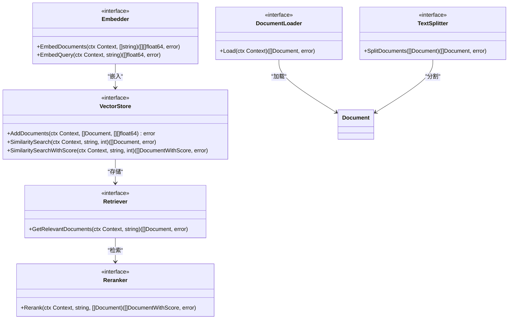

**图表来源**
- [prebuilt/rag.go](file://prebuilt/rag.go#L18-L55)

**章节来源**
- [prebuilt/rag.go](file://prebuilt/rag.go#L18-L55)

## RAGConfig 配置详解

RAGConfig 结构体是 RAGPipeline 的核心配置容器，包含了所有必要的参数设置。

### 配置字段分类

#### 检索配置

| 字段名 | 类型 | 默认值 | 描述 |
|--------|------|--------|------|
| TopK | int | 4 | 检索返回的文档数量 |
| ScoreThreshold | float64 | 0.7 | 文档相关性阈值 |
| UseReranking | bool | false | 是否启用重排序 |
| UseFallback | bool | false | 是否启用回退搜索 |

#### 生成配置

| 字段名 | 类型 | 默认值 | 描述 |
|--------|------|--------|------|
| SystemPrompt | string | "You are a helpful assistant..." | 系统提示词 |
| IncludeCitations | bool | true | 是否包含引用 |
| MaxTokens | int | 1000 | 最大生成令牌数 |
| Temperature | float64 | 0.0 | 生成温度参数 |

#### 组件配置

| 字段名 | 类型 | 描述 |
|--------|------|------|
| Loader | DocumentLoader | 文档加载器 |
| Splitter | TextSplitter | 文本分割器 |
| Embedder | Embedder | 嵌入生成器 |
| VectorStore | VectorStore | 向量数据库 |
| Retriever | Retriever | 检索器 |
| Reranker | Reranker | 重排序器 |
| LLM | llms.Model | 语言模型 |

### 默认配置

系统提供了合理的默认配置，适用于大多数应用场景：

```mermaid
flowchart TD
A[DefaultRAGConfig] --> B[TopK: 4]
A --> C[ScoreThreshold: 0.7]
A --> D[UseReranking: false]
A --> E[UseFallback: false]
A --> F[SystemPrompt: "You are a helpful assistant..."]
A --> G[IncludeCitations: true]
A --> H[MaxTokens: 1000]
A --> I[Temperature: 0.0]
```

**图表来源**
- [prebuilt/rag.go](file://prebuilt/rag.go#L93-L104)

**章节来源**
- [prebuilt/rag.go](file://prebuilt/rag.go#L69-L91)
- [prebuilt/rag.go](file://prebuilt/rag.go#L93-L104)

## RAGPipeline 构建方法

RAGPipeline 提供三种不同的构建方法，每种都针对特定的应用场景进行了优化。

### BuildBasicRAG - 基础检索生成

最简单的 RAG 实现，直接从检索到生成的线性流程。

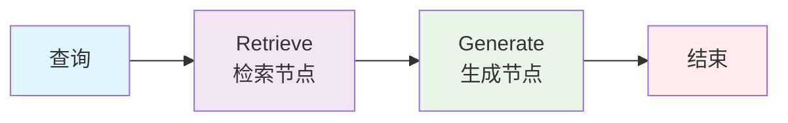

**图表来源**
- [prebuilt/rag.go](file://prebuilt/rag.go#L125-L145)

#### 内部节点

1. **retrieve 节点**：执行向量相似性搜索
2. **generate 节点**：基于检索结果生成回答

#### 使用场景
- 简单问答系统
- 快速原型开发
- 对性能要求较高的应用

**章节来源**
- [prebuilt/rag.go](file://prebuilt/rag.go#L125-L145)

### BuildAdvancedRAG - 检索-重排序-生成-引用

功能完整的 RAG 流程，包含重排序和引用生成。

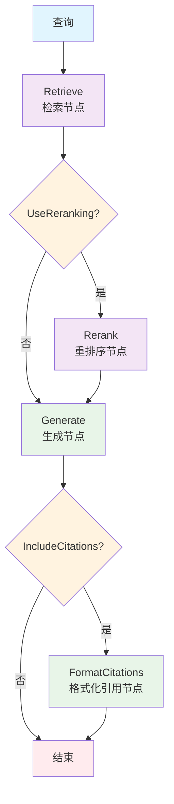

**图表来源**
- [prebuilt/rag.go](file://prebuilt/rag.go#L148-L190)

#### 内部节点详解

1. **retrieve 节点**：基础检索功能
2. **rerank 节点**：使用 Reranker 重新评估相关性
3. **generate 节点**：生成最终回答
4. **format_citations 节点**：格式化文档引用

#### 特色功能

- **智能重排序**：提高检索质量
- **精确引用**：提供准确的来源信息
- **灵活配置**：可根据需要启用或禁用功能

**章节来源**
- [prebuilt/rag.go](file://prebuilt/rag.go#L148-L190)

### BuildConditionalRAG - 条件路由生成

基于相关性分数的智能路由系统，能够根据检索质量决定是否触发回退搜索。

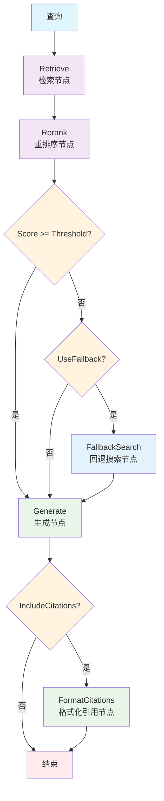

**图表来源**
- [prebuilt/rag.go](file://prebuilt/rag.go#L193-L248)

#### 条件路由逻辑

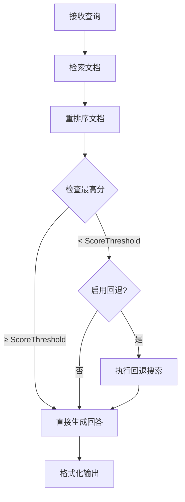

**图表来源**
- [prebuilt/rag.go](file://prebuilt/rag.go#L225-L234)

#### 关键特性

- **智能阈值判断**：自动评估检索质量
- **回退机制**：当检索质量不足时启用外部搜索
- **动态路由**：根据实际情况选择最优路径

**章节来源**
- [prebuilt/rag.go](file://prebuilt/rag.go#L193-L248)

## 组件接口与实现

### VectorStoreRetriever

VectorStoreRetriever 是最常用的检索器实现，基于向量数据库进行相似性搜索。

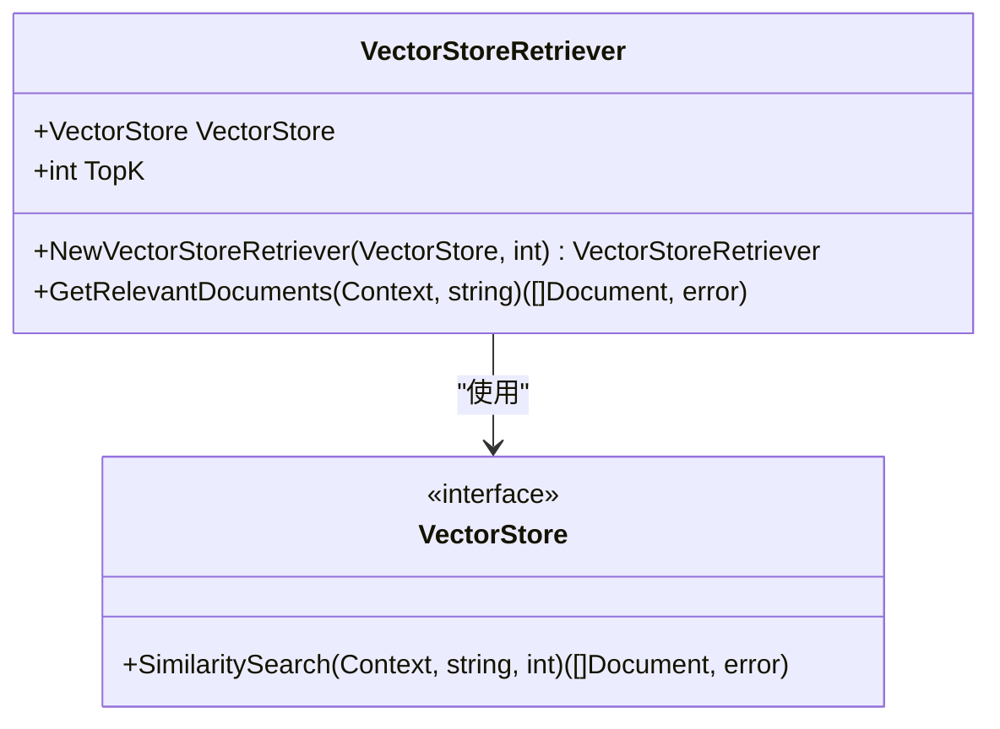

**图表来源**
- [prebuilt/rag.go](file://prebuilt/rag.go#L374-L391)

### 文本分割器

SimpleTextSplitter 提供灵活的文本分割功能：

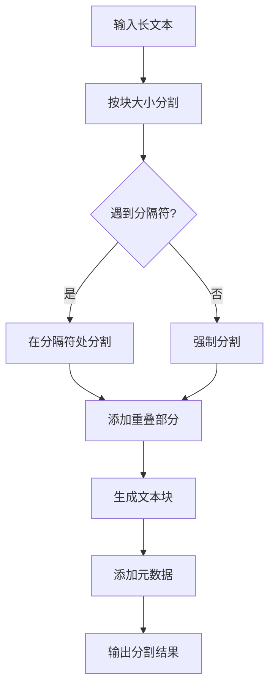

**图表来源**
- [prebuilt/rag_components.go](file://prebuilt/rag_components.go#L54-L91)

### 向量存储

InMemoryVectorStore 提供内存中的向量存储功能：

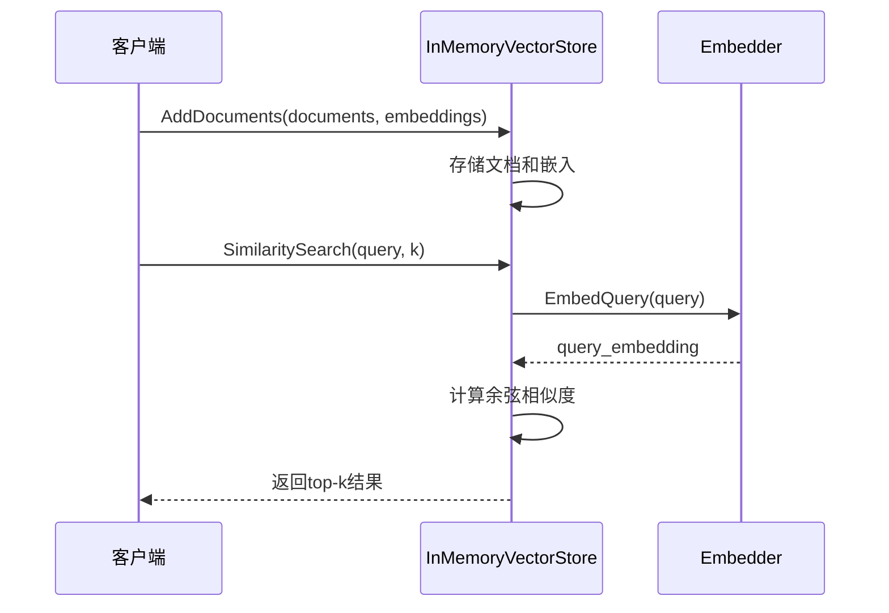

**图表来源**
- [prebuilt/rag_components.go](file://prebuilt/rag_components.go#L101-L184)

### 重排序器

SimpleReranker 基于关键词匹配进行简单重排序：

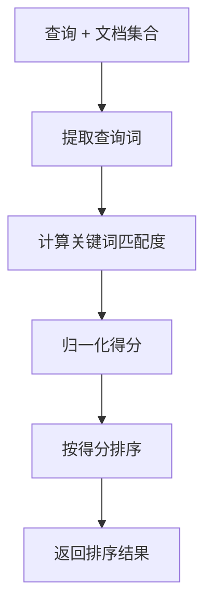

**图表来源**
- [prebuilt/rag_components.go](file://prebuilt/rag_components.go#L206-L261)

**章节来源**
- [prebuilt/rag.go](file://prebuilt/rag.go#L374-L391)
- [prebuilt/rag_components.go](file://prebuilt/rag_components.go#L10-L91)
- [prebuilt/rag_components.go](file://prebuilt/rag_components.go#L206-L261)

## 完整代码示例

### 基础 RAG 示例

以下展示了如何构建和使用基础 RAG 系统：

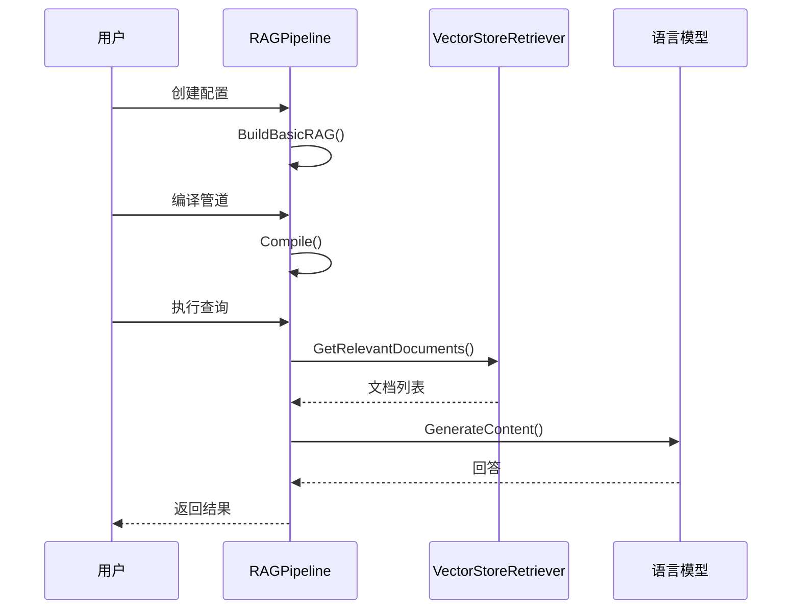

**图表来源**
- [examples/rag_basic/main.go](file://examples/rag_basic/main.go#L86-L105)

### 高级 RAG 示例

高级 RAG 包含重排序和引用功能：

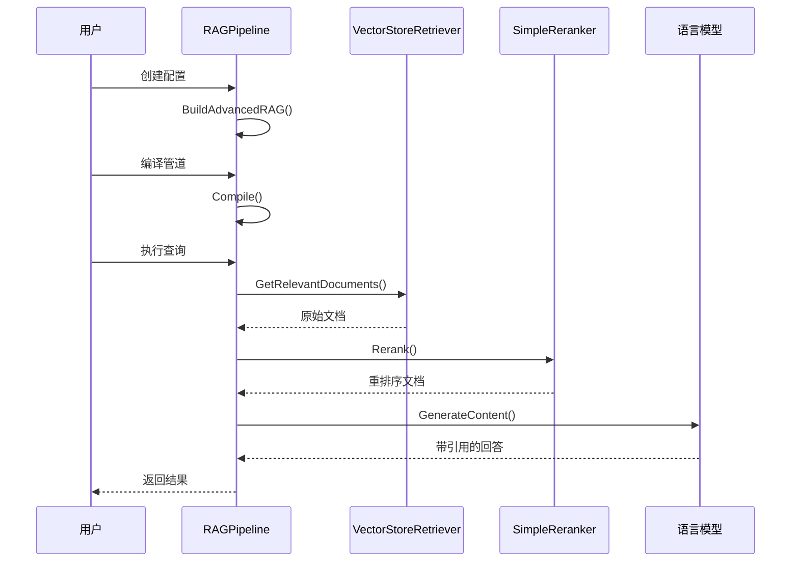

**图表来源**
- [examples/rag_advanced/main.go](file://examples/rag_advanced/main.go#L128-L140)

### 条件 RAG 示例

条件路由系统的完整工作流程：

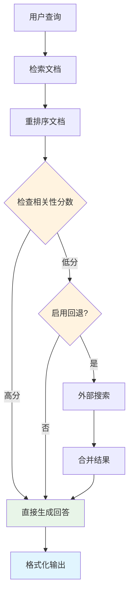

**图表来源**
- [examples/rag_conditional/main.go](file://examples/rag_conditional/main.go#L143-L150)

**章节来源**
- [examples/rag_basic/main.go](file://examples/rag_basic/main.go#L86-L105)
- [examples/rag_advanced/main.go](file://examples/rag_advanced/main.go#L128-L140)
- [examples/rag_conditional/main.go](file://examples/rag_conditional/main.go#L93-L113)

## 最佳实践与优化建议

### 性能优化

1. **合理设置 TopK 参数**
   - 基础 RAG：TopK=3-5
   - 高级 RAG：TopK=5-10
   - 条件 RAG：TopK=2-4（配合阈值）

2. **调整 ScoreThreshold**
   - 条件 RAG 中，根据数据质量设置合适的阈值
   - 通常设置在 0.6-0.8 之间

3. **组件选择策略**
   - 使用高质量的嵌入模型
   - 选择合适的向量数据库
   - 考虑缓存机制减少重复计算

### 质量提升

1. **文档预处理**
   - 使用合适的文本分割策略
   - 添加语义层次信息
   - 清洗和标准化文档内容

2. **检索优化**
   - 结合多种检索策略
   - 使用多模态嵌入
   - 实现查询扩展

3. **生成优化**
   - 调整系统提示词
   - 控制生成参数
   - 实现后处理过滤

### 可扩展性设计

1. **模块化架构**
   - 使用接口抽象组件
   - 支持插件式扩展
   - 提供配置驱动的组件选择

2. **监控和日志**
   - 记录关键指标
   - 监控性能瓶颈
   - 收集用户反馈

## 故障排除指南

### 常见问题及解决方案

#### 1. 检索质量差

**症状**：返回的文档与查询无关或质量不高

**可能原因**：
- 嵌入质量差
- 向量数据库配置不当
- 查询预处理不足

**解决方案**：
- 使用更高质量的嵌入模型
- 调整 TopK 和 ScoreThreshold
- 实现查询改写和扩展

#### 2. 生成答案不准确

**症状**：回答与检索文档不符或包含错误信息

**可能原因**：
- 上下文构建不当
- LLM 配置问题
- 系统提示词不够明确

**解决方案**：
- 优化上下文构建逻辑
- 调整生成参数
- 改进系统提示词设计

#### 3. 性能问题

**症状**：响应时间过长或资源消耗过高

**可能原因**：
- 向量数据库规模过大
- 并发处理能力不足
- 缓存机制缺失

**解决方案**：
- 实现分页检索
- 添加请求限流
- 使用缓存中间结果

### 调试技巧

1. **启用详细日志**：记录每个阶段的输入输出
2. **可视化流程**：使用内置的图表生成功能
3. **单元测试**：对每个组件进行独立测试
4. **性能分析**：监控各阶段的耗时分布

**章节来源**
- [prebuilt/rag_test.go](file://prebuilt/rag_test.go#L168-L248)

## 总结

langgraphgo 的 RAGPipeline 提供了一个功能完整、高度可配置的检索增强生成系统。通过三种不同的构建方法，开发者可以根据具体需求选择最适合的实现方案。系统的模块化设计使得组件替换和扩展变得简单，而完善的配置选项则确保了灵活性和可控性。

无论是快速原型开发还是生产环境部署，RAGPipeline 都能提供稳定可靠的服务。通过遵循最佳实践和持续优化，可以构建出高质量的智能问答系统。