# 预构建组件 API 参考文档

<cite>
**本文档中引用的文件**
- [create_agent.go](file://prebuilt/create_agent.go)
- [rag.go](file://prebuilt/rag.go)
- [supervisor.go](file://prebuilt/supervisor.go)
- [rag_components.go](file://prebuilt/rag_components.go)
- [tool_executor.go](file://prebuilt/tool_executor.go)
- [chat_agent.go](file://prebuilt/chat_agent.go)
- [pev_agent.go](file://prebuilt/pev_agent.go)
- [planning_agent.go](file://prebuilt/planning_agent.go)
- [reflection_agent.go](file://prebuilt/reflection_agent.go)
- [create_agent_test.go](file://prebuilt/create_agent_test.go)
- [rag_test.go](file://prebuilt/rag_test.go)
- [supervisor_test.go](file://prebuilt/supervisor_test.go)
- [main.go](file://examples/create_agent/main.go)
- [main.go](file://examples/rag_basic/main.go)
- [main.go](file://examples/rag_advanced/main.go)
- [main.go](file://examples/rag_conditional/main.go)
- [main.go](file://examples/supervisor/main.go)
- [main.go](file://examples/rag_pipeline/main.go)
</cite>

## 更新摘要
**已更改内容**
- 新增了 ChatAgent、PEV Agent、Planning Agent 和 Reflection Agent 的详细文档
- 扩展了预构建组件的类型化代理说明
- 添加了新的架构图和使用示例
- 更新了目录结构以包含新组件

## 目录
1. [简介](#简介)
2. [CreateAgent 组件](#createagent-组件)
3. [RAGPipeline 组件](#ragpipeline-组件)
4. [CreateSupervisor 组件](#createsupervisor-组件)
5. [工具组件](#工具组件)
6. [ChatAgent 组件](#chatagent-组件)
7. [PEV Agent 组件](#pev-agent-组件)
8. [Planning Agent 组件](#planning-agent-组件)
9. [Reflection Agent 组件](#reflection-agent-组件)
10. [架构概览](#架构概览)
11. [使用示例](#使用示例)
12. [最佳实践](#最佳实践)

## 简介

langgraphgo 提供了一套高级预构建组件，简化了复杂 AI 应用程序的开发。这些组件包括：
- **CreateAgent**: 创建智能代理，支持工具调用和状态管理
- **RAGPipeline**: 构建检索增强生成(RAG)系统
- **CreateSupervisor**: 协调多个代理的工作流程
- **ChatAgent**: 支持多轮对话的会话式代理
- **PEV Agent**: 实现计划-执行-验证模式的自纠正代理
- **Planning Agent**: 动态规划工作流的智能代理
- **Reflection Agent**: 通过自我反思迭代改进响应质量的代理

这些组件基于 langgraphgo 的核心图执行引擎，提供了开箱即用的功能和灵活的配置选项。

## CreateAgent 组件

CreateAgent 是一个高级代理创建函数，能够快速构建具备工具调用能力的智能代理。

### 核心功能

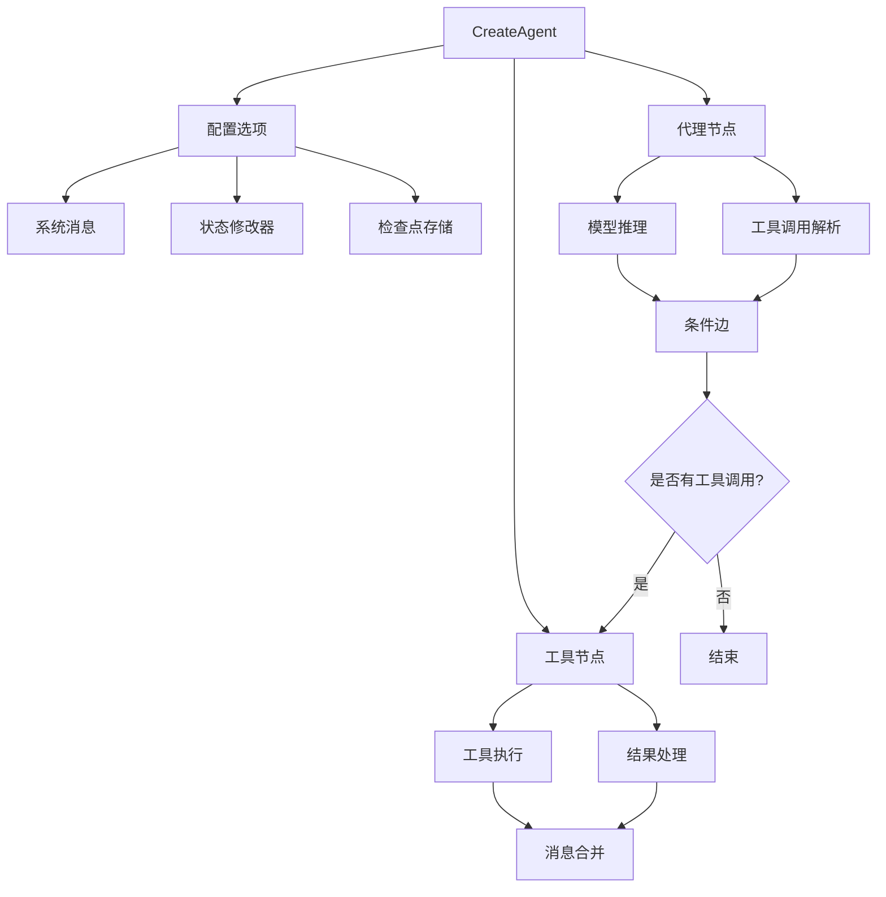

**图表来源**
- [create_agent.go](file://prebuilt/create_agent.go#L46-L251)

### 函数签名

```go
func CreateAgent(model llms.Model, inputTools []tools.Tool, opts ...CreateAgentOption) (*graph.StateRunnable, error)
```

### 参数说明

| 参数 | 类型 | 描述 |
|------|------|------|
| model | llms.Model | 语言模型实例，用于推理和工具调用 |
| inputTools | []tools.Tool | 工具列表，代理可以调用的外部功能 |
| opts | ...CreateAgentOption | 可选配置选项 |

### 配置选项

#### WithSystemMessage
设置代理的系统提示词。

```go
func WithSystemMessage(message string) CreateAgentOption
```

**参数：**
- `message`: 系统提示词字符串

**使用示例：**
```go
agent, err := CreateAgent(model, tools,
    WithSystemMessage("你是一个有用的天气助手。始终保持礼貌。"),
    WithStateModifier(customModifier),
)
```

#### WithStateModifier
设置状态修改器函数，在发送给模型之前修改消息列表。

```go
func WithStateModifier(modifier func(messages []llms.MessageContent) []llms.MessageContent) CreateAgentOption
```

**参数：**
- `modifier`: 修改器函数，接收消息列表并返回修改后的版本

**使用示例：**
```go
modifier := func(messages []llms.MessageContent) []llms.MessageContent) []llms.MessageContent {
    log.Printf("当前消息数量: %d", len(messages))
    return messages
}

agent, err := CreateAgent(model, tools, WithStateModifier(modifier))
```

#### WithCheckpointer
设置检查点存储，用于保存和恢复代理状态。

```go
func WithCheckpointer(checkpointer graph.CheckpointStore) CreateAgentOption
```

**注意：** 当前是占位实现，可能尚未完全集成到图执行中。

### 返回值

返回一个 `*graph.StateRunnable` 实例，表示编译后的代理图。

### 内部架构

```mermaid
classDiagram
class CreateAgentOptions {
+string SystemMessage
+func StateModifier
+CheckpointStore Checkpointer
}
class StateRunnable {
+Invoke(ctx, state) interface{}
+InvokeWithConfig(ctx, state, config) interface{}
}
class ToolExecutor {
+Execute(ctx, invocation) string
+ExecuteMany(ctx, invocations) []string
}
CreateAgent --> CreateAgentOptions
CreateAgent --> StateRunnable
StateRunnable --> ToolExecutor
```

**图表来源**
- [create_agent.go](file://prebuilt/create_agent.go#L13-L43)
- [tool_executor.go](file://prebuilt/tool_executor.go#L16-L84)

**章节来源**
- [create_agent.go](file://prebuilt/create_agent.go#L46-L251)
- [create_agent_test.go](file://prebuilt/create_agent_test.go#L1-L182)

## RAGPipeline 组件

RAGPipeline 提供了构建检索增强生成系统的完整框架，支持多种 RAG 模式和配置选项。

### 核心组件

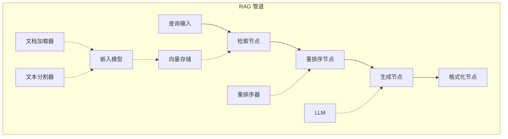

**图表来源**
- [rag.go](file://prebuilt/rag.go#L125-L249)

### RAGConfig 配置

RAGConfig 定义了 RAG 系统的所有配置选项：

| 配置项 | 类型 | 默认值 | 描述 |
|--------|------|--------|------|
| TopK | int | 4 | 检索的文档数量 |
| ScoreThreshold | float64 | 0.7 | 相关性阈值 |
| UseReranking | bool | false | 是否使用重排序 |
| UseFallback | bool | false | 是否使用回退搜索 |
| SystemPrompt | string | 帮助提示 | 系统提示词 |
| IncludeCitations | bool | true | 是否包含引用 |
| MaxTokens | int | 1000 | 最大令牌数 |
| Temperature | float64 | 0.0 | 温度参数 |

### 构建方法

#### BuildBasicRAG
构建基础 RAG 管道：检索 → 生成

```go
func (p *RAGPipeline) BuildBasicRAG() error
```

**特点：**
- 简单直接的管道结构
- 适用于大多数基本 RAG 场景
- 不包含重排序和引用格式化

#### BuildAdvancedRAG
构建高级 RAG 管道：检索 → 重排序 → 生成 → 引用格式化

```go
func (p *RAGPipeline) BuildAdvancedRAG() error
```

**特点：**
- 包含可选的重排序步骤
- 自动添加引用格式化节点
- 支持更高质量的检索结果

#### BuildConditionalRAG
构建条件 RAG 管道：根据相关性阈值决定是否使用回退搜索

```go
func (p *RAGPipeline) BuildConditionalRAG() error
```

**特点：**
- 基于相关性分数的条件路由
- 支持回退搜索机制
- 更灵活的错误处理

### 节点内部逻辑

#### retrieve 节点
负责从向量存储中检索相关文档。

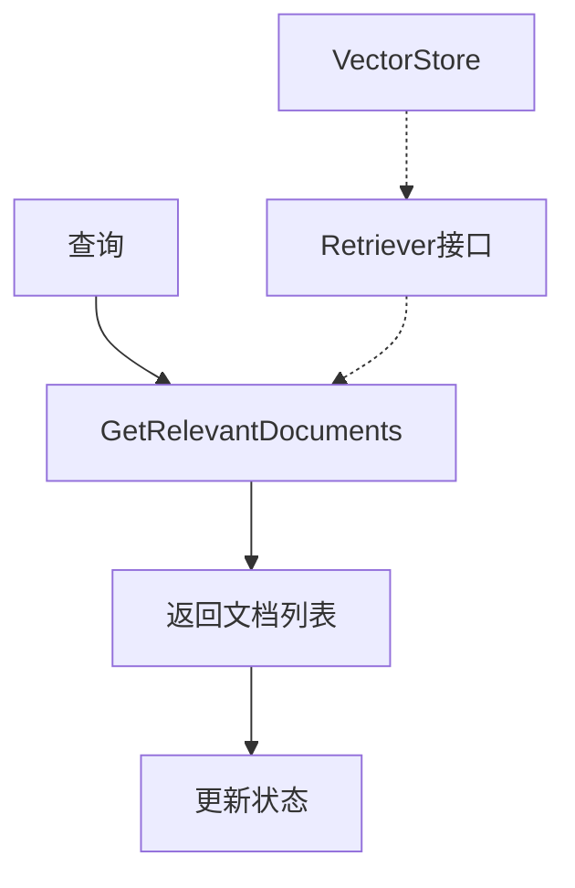

**图表来源**
- [rag.go](file://prebuilt/rag.go#L262-L275)

#### generate 节点
使用检索到的文档生成答案。

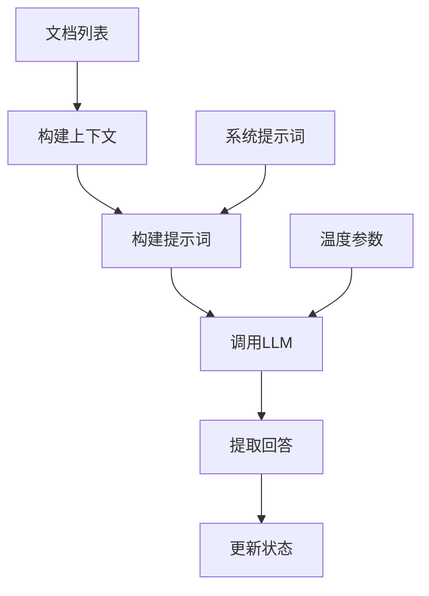

**图表来源**
- [rag.go](file://prebuilt/rag.go#L322-L355)

#### rerank 节点
对检索到的文档进行重新排序以提高质量。

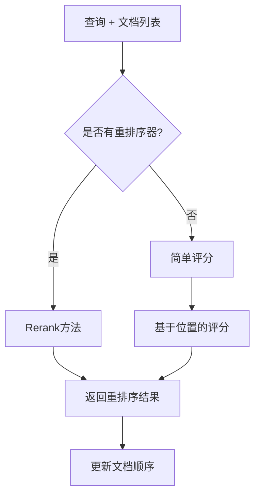

**图表来源**
- [rag.go](file://prebuilt/rag.go#L277-L308)

### RAGState 状态结构

```go
type RAGState struct {
    Query              string
    Documents          []Document
    RetrievedDocuments []Document
    RankedDocuments    []DocumentWithScore
    Context            string
    Answer             string
    Citations          []string
    Metadata           map[string]interface{}
}
```

### 组件接口

#### DocumentLoader
文档加载接口，支持从各种源加载文档。

```go
type DocumentLoader interface {
    Load(ctx context.Context) ([]Document, error)
}
```

#### TextSplitter
文本分割接口，将长文档分割成较小的块。

```go
type TextSplitter interface {
    SplitDocuments(documents []Document) ([]Document, error)
}
```

#### Embedder
嵌入生成接口，将文本转换为向量表示。

```go
type Embedder interface {
    EmbedDocuments(ctx context.Context, texts []string) ([][]float64, error)
    EmbedQuery(ctx context.Context, text string) ([]float64, error)
}
```

#### VectorStore
向量存储接口，支持相似性搜索。

```go
type VectorStore interface {
    AddDocuments(ctx context.Context, documents []Document, embeddings [][]float64) error
    SimilaritySearch(ctx context.Context, query string, k int) ([]Document, error)
    SimilaritySearchWithScore(ctx context.Context, query string, k int) ([]DocumentWithScore, error)
}
```

**章节来源**
- [rag.go](file://prebuilt/rag.go#L1-L392)
- [rag_components.go](file://prebuilt/rag_components.go#L1-L333)
- [rag_test.go](file://prebuilt/rag_test.go#L1-L338)

## CreateSupervisor 组件

CreateSupervisor 创建一个监督者代理，能够协调多个子代理的工作流程。

### 协调机制

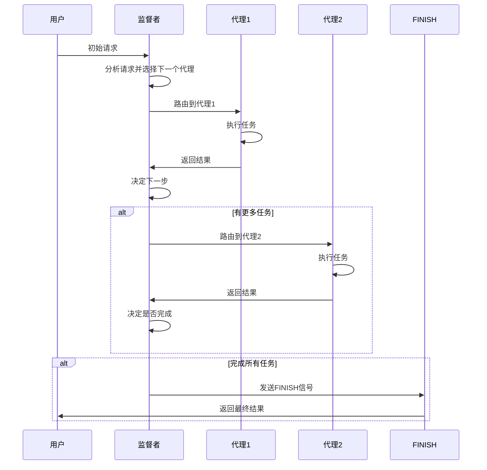

**图表来源**
- [supervisor.go](file://prebuilt/supervisor.go#L13-L153)

### 函数签名

```go
func CreateSupervisor(model llms.Model, members map[string]*graph.StateRunnable) (*graph.StateRunnable, error)
```

### 参数说明

| 参数 | 类型 | 描述 |
|------|------|------|
| model | llms.Model | 用于决策的语言模型 |
| members | map[string]*graph.StateRunnable | 代理成员映射表 |

### 成员代理管理

监督者通过以下方式管理成员代理：

1. **动态路由**: 根据当前状态和用户请求动态选择下一个代理
2. **状态共享**: 所有成员代理共享相同的状态模式
3. **循环协调**: 支持多个代理的循环执行直到完成

### 路由机制

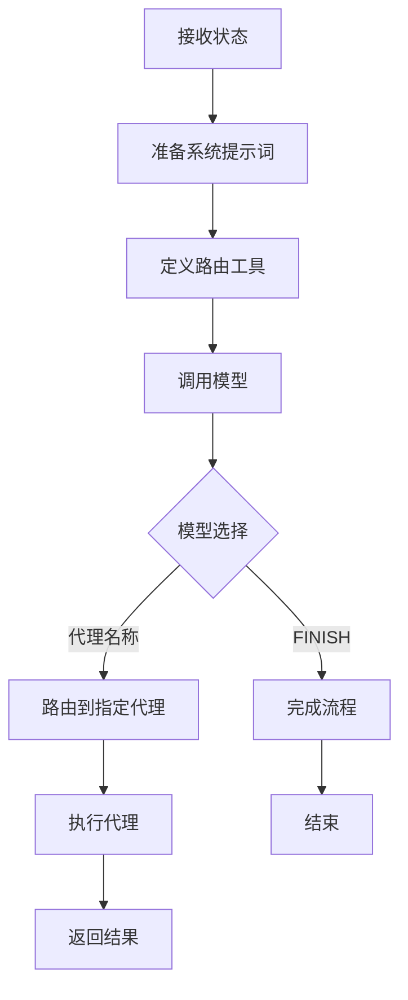

**图表来源**
- [supervisor.go](file://prebuilt/supervisor.go#L29-L106)

### 使用示例

```go
// 创建数学专家代理
mathAgent, err := prebuilt.CreateReactAgent(model, []tools.Tool{CalculatorTool{}})

// 创建通用助理代理  
generalAgent, err := prebuilt.CreateReactAgent(model, []tools.Tool{})

// 创建监督者
members := map[string]*graph.StateRunnable{
    "MathExpert":       mathAgent,
    "GeneralAssistant": generalAgent,
}

supervisor, err := prebuilt.CreateSupervisor(model, members)
```

**章节来源**
- [supervisor.go](file://prebuilt/supervisor.go#L13-L153)
- [supervisor_test.go](file://prebuilt/supervisor_test.go#L1-L129)

## 工具组件

### ToolExecutor

ToolExecutor 提供工具执行功能，支持单个和批量工具调用。

```mermaid
classDiagram
class ToolExecutor {
+map[string]tools.Tool tools
+Execute(ctx, invocation) string
+ExecuteMany(ctx, invocations) []string
+ToolNode(ctx, state) interface{}
}
class ToolInvocation {
+string Tool
+string ToolInput
}
ToolExecutor --> ToolInvocation
ToolExecutor --> tools.Tool
```

**图表来源**
- [tool_executor.go](file://prebuilt/tool_executor.go#L16-L84)

### 工具节点

ToolNode 是一个图节点函数，专门用于执行工具调用。

**支持的状态格式：**
- 单个 `ToolInvocation`
- `ToolInvocation` 切片
- 包含 `tool` 和 `tool_input` 键的映射

**章节来源**
- [tool_executor.go](file://prebuilt/tool_executor.go#L1-L84)

## ChatAgent 组件

ChatAgent 是一个高级会话代理，提供多轮对话支持和会话管理功能。

### 核心特性

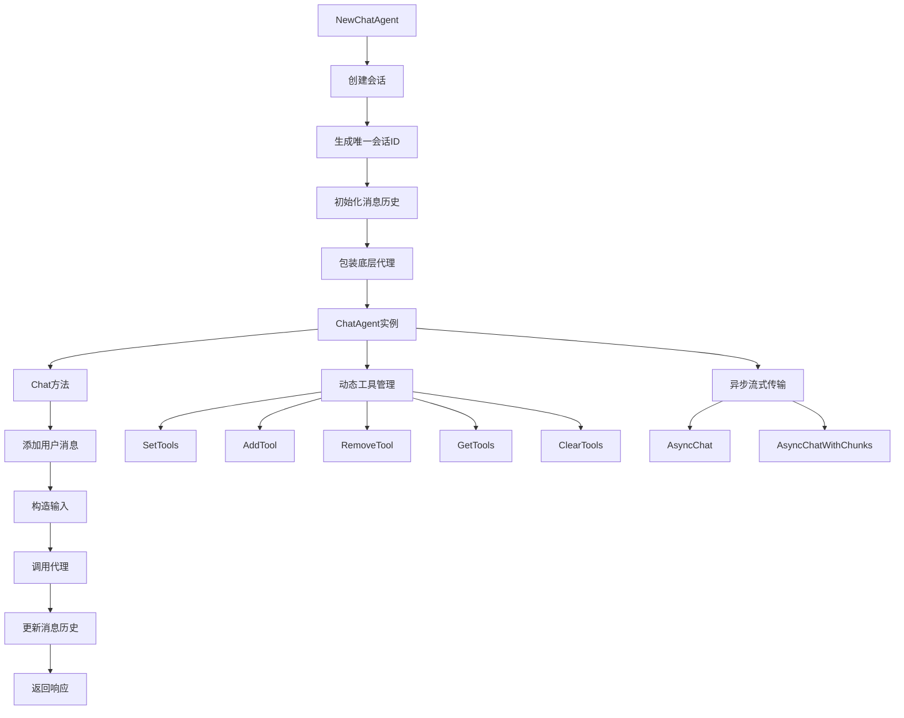

**图表来源**
- [chat_agent.go](file://prebuilt/chat_agent.go#L30-L242)

### 类型定义

```go
type ChatAgent struct {
    Runnable *graph.StateRunnable // 底层可运行代理
    threadID string               // 会话ID
    messages []llms.MessageContent // 对话历史
    dynamicTools []tools.Tool     // 动态工具
    model llms.Model              // 模型引用
    options *CreateAgentOptions   // 创建选项
}
```

### 构造函数

#### NewChatAgent
创建一个新的 ChatAgent 实例。

```go
func NewChatAgent(model llms.Model, inputTools []tools.Tool, opts ...CreateAgentOption) (*ChatAgent, error)
```

**参数：**
- `model`: 语言模型实例
- `inputTools`: 基础工具列表
- `opts`: 可选配置

**返回值：**
- `*ChatAgent`: 新的 ChatAgent 实例
- `error`: 创建过程中的错误

**章节来源**
- [chat_agent.go](file://prebuilt/chat_agent.go#L30-L55)

### 主要方法

#### Chat
发送消息并返回响应，自动维护对话历史。

```go
func (c *ChatAgent) Chat(ctx context.Context, message string) (string, error)
```

**工作流程：**
1. 将用户消息添加到历史记录
2. 构造包含完整对话历史的输入
3. 创建带有 thread_id 的配置
4. 调用底层代理
5. 更新对话历史
6. 提取并返回最后一条消息

**章节来源**
- [chat_agent.go](file://prebuilt/chat_agent.go#L63-L118)

#### ThreadID
返回当前会话的唯一标识符。

```go
func (c *ChatAgent) ThreadID() string
```

#### PrintStream
将代理响应打印到指定的写入器。

```go
func (c *ChatAgent) PrintStream(ctx context.Context, message string, w io.Writer) error
```

#### AsyncChat
提供真正的流式传输，使用 LLM 的原生流式 API。

```go
func (c *ChatAgent) AsyncChat(ctx context.Context, message string) (<-chan string, error)
```

**特点：**
- 实时流式传输：块在 LLM 生成时立即到达
- 原生 LLM 支持：使用底层模型的流式功能
- 低延迟：第一个令牌立即出现
- 高效：在发送前不缓冲完整响应

**章节来源**
- [chat_agent.go](file://prebuilt/chat_agent.go#L181-L241)

#### AsyncChatWithChunks
以单词大小的块流式传输响应，提高可读性。

```go
func (c *ChatAgent) AsyncChatWithChunks(ctx context.Context, message string) (<-chan string, error)
```

### 动态工具管理

ChatAgent 支持在对话过程中动态添加和删除工具。

#### SetTools
替换所有动态工具。

```go
func (c *ChatAgent) SetTools(newTools []tools.Tool)
```

#### AddTool
添加新工具，如果同名工具已存在则替换。

```go
func (c *ChatAgent) AddTool(tool tools.Tool)
```

#### RemoveTool
按名称删除工具。

```go
func (c *ChatAgent) RemoveTool(toolName string) bool
```

#### GetTools
返回当前动态工具列表的副本。

```go
func (c *ChatAgent) GetTools() []tools.Tool
```

#### ClearTools
移除所有动态工具。

```go
func (c *ChatAgent) ClearTools()
```

**章节来源**
- [chat_agent.go](file://prebuilt/chat_agent.go#L134-L179)

### 使用示例

```go
// 创建 LLM 模型
model, err := openai.New(openai.WithModel("gpt-4"))
if err != nil {
    log.Fatal(err)
}

// 创建 ChatAgent
agent, err := prebuilt.NewChatAgent(model, tools)
if err != nil {
    log.Fatal(err)
}

ctx := context.Background()

// 多轮对话
response1, err := agent.Chat(ctx, "Hello! My name is Alice.")
response2, err := agent.Chat(ctx, "What's my name?")

// 获取会话ID
sessionID := agent.ThreadID()
```

**章节来源**
- [CHAT_AGENT.md](file://docs/CHAT_AGENT.md#L1-L410)

## PEV Agent 组件

PEV Agent 实现计划-执行-验证（Plan, Execute, Verify）模式，提供自纠正的任务执行能力。

### 核心架构

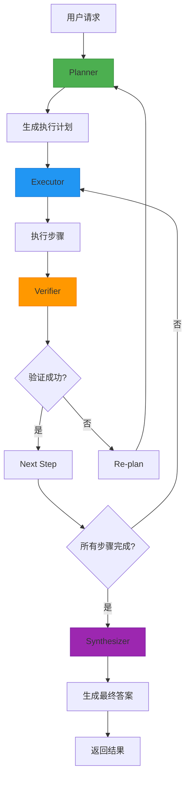

**图表来源**
- [pev_agent.go](file://prebuilt/pev_agent.go#L55-L129)

### 配置结构

```go
type PEVAgentConfig struct {
    Model llms.Model           // 用于规划和验证的LLM
    Tools []tools.Tool         // 可用工具
    MaxRetries int             // 验证失败时的最大重试次数
    SystemMessage string       // 规划器的系统消息
    VerificationPrompt string  // 验证器的提示
    Verbose bool               // 启用详细日志
}
```

### 创建函数

#### CreatePEVAgent
创建一个新的 PEV 代理。

```go
func CreatePEVAgent(config PEVAgentConfig) (*graph.StateRunnable, error)
```

**PEV 模式涉及：**
1. **计划**：将用户请求分解为可执行步骤
2. **执行**：使用可用工具运行每个步骤
3. **验证**：检查执行是否成功
4. **重试**：如果验证失败，重新规划并再次执行

**适用场景：**
- 高风险自动化场景
- 需要准确性验证的系统
- 外部工具不可靠的情况

**章节来源**
- [pev_agent.go](file://prebuilt/pev_agent.go#L42-L129)

### 工作流节点

#### plannerNode
创建或修订执行计划。

```go
func plannerNode(ctx context.Context, state any, model llms.Model, systemMessage string, verbose bool) (any, error)
```

**功能：**
- 初始规划或重新规划
- 生成结构化执行计划
- 解析计划步骤

#### executorNode
执行当前步骤。

```go
func executorNode(ctx context.Context, state any, toolExecutor *ToolExecutor, model llms.Model, verbose bool) (any, error)
```

**功能：**
- 使用 LLM 决定调用哪个工具
- 执行选定的工具调用
- 记录执行结果

#### verifierNode
验证执行结果。

```go
func verifierNode(ctx context.Context, state any, model llms.Model, verificationPrompt string, verbose bool) (any, error)
```

**功能：**
- 分析预期操作和实际结果
- 确定执行是否成功
- 提供详细的推理说明

#### synthesizerNode
从所有步骤中合成最终答案。

```go
func synthesizerNode(ctx context.Context, state any, model llms.Model, verbose bool) (any, error)
```

**功能：**
- 基于执行步骤生成最终答案
- 提供清晰简洁的响应
- 直接解决用户请求

**章节来源**
- [pev_agent.go](file://prebuilt/pev_agent.go#L91-L109)

### 条件路由

#### routeAfterPlanner
规划后路由。

```go
func routeAfterPlanner(state any, verbose bool) string
```

#### routeAfterExecutor
执行后路由。

```go
func routeAfterExecutor(state any, verbose bool) string
```

#### routeAfterVerifier
验证后路由。

```go
func routeAfterVerifier(state any, maxRetries int, verbose bool) string
```

**路由逻辑：**
- 验证成功：继续下一步或合成最终答案
- 验证失败：达到最大重试次数则合成答案，否则重新规划

**章节来源**
- [pev_agent.go](file://prebuilt/pev_agent.go#L391-L448)

### 使用示例

```go
// 配置 PEV 代理
config := prebuilt.PEVAgentConfig{
    Model: model,
    Tools: []tools.Tool{searchTool, calculatorTool},
    MaxRetries: 3,
    Verbose: true,
}

// 创建代理
agent, err := prebuilt.CreatePEVAgent(config)
if err != nil {
    log.Fatal(err)
}

// 执行任务
result, err := agent.Invoke(ctx, initialState)
```

## Planning Agent 组件

Planning Agent 是一个智能代理，首先使用 LLM 规划工作流，然后根据生成的计划执行。

### 架构设计

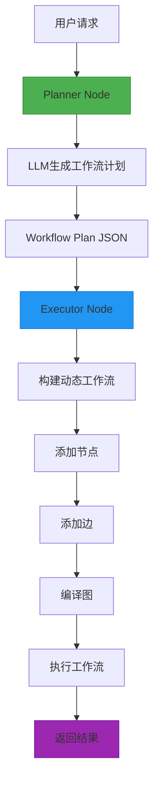

**图表来源**
- [planning_agent.go](file://prebuilt/planning_agent.go#L37-L226)

### 核心类型

#### WorkflowPlan
表示 LLM 生成的工作流计划。

```go
type WorkflowPlan struct {
    Nodes []WorkflowNode `json:"nodes"`
    Edges []WorkflowEdge `json:"edges"`
}
```

#### WorkflowNode
表示工作流中的节点。

```go
type WorkflowNode struct {
    Name string `json:"name"`
    Type string `json:"type"` // "start", "process", "end", "conditional"
}
```

#### WorkflowEdge
表示工作流中的边。

```go
type WorkflowEdge struct {
    From      string `json:"from"`
    To        string `json:"to"`
    Condition string `json:"condition,omitempty"` // 用于条件边
}
```

### 创建函数

#### CreatePlanningAgent
创建一个能够动态规划和执行工作流的代理。

```go
func CreatePlanningAgent(model llms.Model, nodes []*graph.Node, inputTools []tools.Tool, opts ...CreateAgentOption) (*graph.StateRunnable, error)
```

**参数：**
- `model`: 用于规划的 LLM
- `nodes`: 可用的节点，可组合成工作流
- `inputTools`: 代理可用的工具
- `opts`: 可选配置

**章节来源**
- [planning_agent.go](file://prebuilt/planning_agent.go#L37-L227)

### 工作流节点

#### plannerNode
生成工作流计划。

```go
func plannerNode(ctx context.Context, state any, model llms.Model, systemMessage string, verbose bool) (any, error)
```

**功能：**
- 分析用户请求和可用节点
- 调用 LLM 生成工作流计划
- 解析工作流计划
- 将计划存储在状态中

#### executorNode
执行计划的工作流。

```go
func executorNode(ctx context.Context, state any, model llms.Model, verbose bool) (any, error)
```

**功能：**
- 从计划中构建动态工作流
- 添加节点和边
- 编译并执行动态工作流

**章节来源**
- [planning_agent.go](file://prebuilt/planning_agent.go#L59-L220)

### 辅助函数

#### buildNodeDescriptions
创建描述所有可用节点的格式化字符串。

```go
func buildNodeDescriptions(nodes []*graph.Node) string
```

#### buildPlanningPrompt
创建 LLM 生成工作流计划的提示。

```go
func buildPlanningPrompt(nodeDescriptions string) string
```

#### parseWorkflowPlan
解析 LLM 响应以提取工作流计划。

```go
func parseWorkflowPlan(planText string) (*WorkflowPlan, error)
```

#### extractJSON
从可能包含 Markdown 代码块的文本中提取 JSON。

```go
func extractJSON(text string) string
```

**章节来源**
- [planning_agent.go](file://prebuilt/planning_agent.go#L230-L318)

### 使用示例

```go
// 定义可用节点
nodes := []*graph.Node{
    {
        Name:        "fetch_data",
        Description: "从数据库获取用户数据",
        Function:    fetchDataNode,
    },
    {
        Name:        "validate_data",
        Description: "验证数据的完整性和格式",
        Function:    validateDataNode,
    },
}

// 创建 Planning Agent
agent, err := prebuilt.CreatePlanningAgent(
    model,
    nodes,
    []tools.Tool{},
    prebuilt.WithVerbose(true),
)
```

**章节来源**
- [PLANNINGAGENT.md](file://docs/PLANNINGAGENT.md#L1-L626)

## Reflection Agent 组件

Reflection Agent 实现迭代自我改进模式，通过生成、反思和修订循环提高响应质量。

### 核心架构

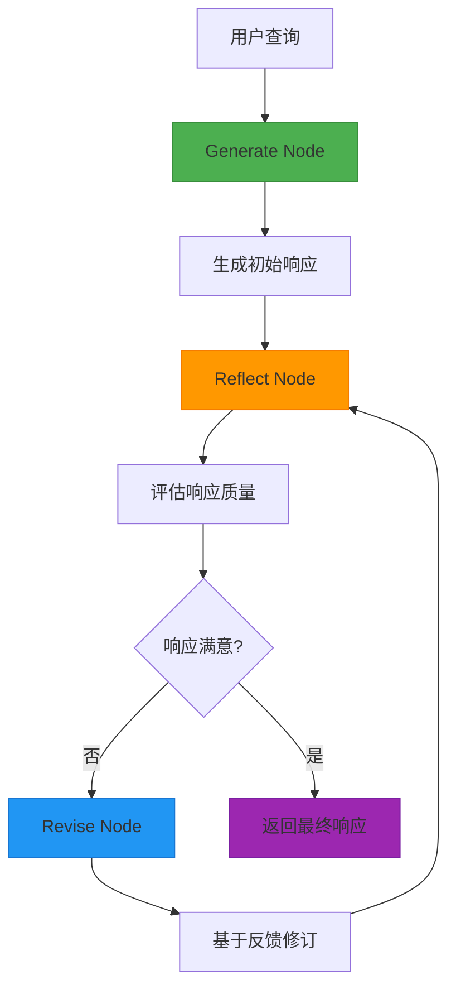

**图表来源**
- [reflection_agent.go](file://prebuilt/reflection_agent.go#L43-L101)

### 配置结构

```go
type ReflectionAgentConfig struct {
    Model llms.Model           // 用于生成和反射的LLM
    ReflectionModel llms.Model // 可选的单独反射模型
    MaxIterations int           // 生成-反射循环的最大次数
    SystemMessage string       // 生成步骤的系统消息
    ReflectionPrompt string    // 反射步骤的系统消息
    Verbose bool               // 启用详细日志
}
```

### 创建函数

#### CreateReflectionAgent
创建一个新的 Reflection Agent。

```go
func CreateReflectionAgent(config ReflectionAgentConfig) (*graph.StateRunnable, error)
```

**Reflection 模式涉及：**
1. **生成**：创建初始响应
2. **反思**：批判性地评估响应并提出改进建议
3. **修订**：根据反思生成改进版本
4. **重复**：直到满意或达到最大迭代次数

**章节来源**
- [reflection_agent.go](file://prebuilt/reflection_agent.go#L35-L101)

### 工作流节点

#### generateNode
生成或修订响应。

```go
func generateNode(ctx context.Context, state any, model llms.Model, systemMessage string, verbose bool) (any, error)
```

**功能：**
- 第一次迭代：生成初始响应
- 后续迭代：根据反思修订
- 跟踪迭代计数
- 在状态中存储草稿

#### reflectNode
反思生成的响应。

```go
func reflectNode(ctx context.Context, state any, model llms.Model, reflectionPrompt string, verbose bool) (any, error)
```

**功能：**
- 评估响应质量
- 识别优点和缺点
- 提出具体改进建议
- 确定响应是否满意

**章节来源**
- [reflection_agent.go](file://prebuilt/reflection_agent.go#L79-L86)

### 条件路由

#### shouldContinueAfterGenerate
决定是继续反思还是结束。

```go
func shouldContinueAfterGenerate(state any, maxIterations int, verbose bool) string
```

#### shouldContinueAfterReflect
决定是继续修订还是接受。

```go
func shouldContinueAfterReflect(state any, verbose bool) string
```

**决策逻辑：**
- 达到最大迭代次数：结束
- 上次反思满意：结束
- 否则：继续修订

**章节来源**
- [reflection_agent.go](file://prebuilt/reflection_agent.go#L92-L99)

### 辅助函数

#### isResponseSatisfactory
分析反思以确定响应是否良好。

```go
func isResponseSatisfactory(reflection string) bool
```

**评估标准：**
- 满意关键词：excellent, satisfactory, well done, comprehensive
- 问题关键词：missing, incomplete, unclear, lacks, incorrect
- 综合判断：满意指标多于问题指标且无重大问题

#### getOriginalRequest
从消息中提取原始用户请求。

```go
func getOriginalRequest(messages []llms.MessageContent) string
```

#### buildDefaultReflectionPrompt
创建默认的反思提示。

```go
func buildDefaultReflectionPrompt() string
```

**评价标准：**
- 准确性：信息是否正确？
- 完整性：是否完全解决了请求？
- 清晰度：是否易于理解？
- 相关性：是否专注于主题？
- 质量：写作是否清晰专业？

**章节来源**
- [reflection_agent.go](file://prebuilt/reflection_agent.go#L311-L427)

### 使用示例

```go
// 配置 Reflection Agent
config := prebuilt.ReflectionAgentConfig{
    Model:         model,
    MaxIterations: 3,
    Verbose:       true,
}

// 创建代理
agent, err := prebuilt.CreateReflectionAgent(config)
if err != nil {
    log.Fatal(err)
}

// 准备初始状态
initialState := map[string]any{
    "messages": []llms.MessageContent{
        llms.TextParts(llms.ChatMessageTypeHuman, "解释分布式系统中的CAP定理"),
    },
}

// 调用代理
result, err := agent.Invoke(context.Background(), initialState)
```

**章节来源**
- [REFLECTIONAGENT.md](file://docs/REFLECTIONAGENT.md#L1-L877)

## 架构概览

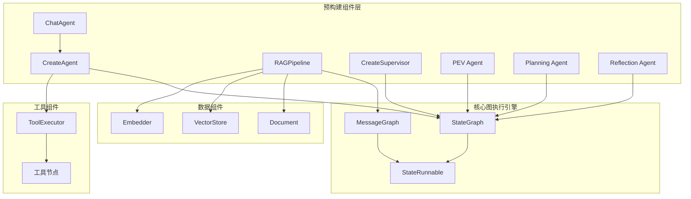

**图表来源**
- [create_agent.go](file://prebuilt/create_agent.go#L56-L251)
- [rag.go](file://prebuilt/rag.go#L108-L259)
- [chat_agent.go](file://prebuilt/chat_agent.go#L30-L242)
- [pev_agent.go](file://prebuilt/pev_agent.go#L55-L129)
- [planning_agent.go](file://prebuilt/planning_agent.go#L37-L226)
- [reflection_agent.go](file://prebuilt/reflection_agent.go#L35-L101)

## 使用示例

### CreateAgent 示例

```go
// 定义工具
type WeatherTool struct{}
func (t *WeatherTool) Name() string { return "get_weather" }
func (t *WeatherTool) Description() string { return "获取城市天气" }
func (t *WeatherTool) Call(ctx context.Context, input string) (string, error) {
    return fmt.Sprintf(" %s 天气晴朗，气温 25°C", input), nil
}

// 创建代理
agent, err := prebuilt.CreateAgent(model, []tools.Tool{&WeatherTool{}},
    prebuilt.WithSystemMessage("你是一个有用的天气助手。始终保持礼貌。"),
    prebuilt.WithStateModifier(func(msgs []llms.MessageContent) []llms.MessageContent {
        log.Printf("当前消息数量: %d", len(msgs))
        return msgs
    }),
)

// 运行代理
result, err := agent.Invoke(context.Background(), map[string]interface{}{
    "messages": []llms.MessageContent{
        llms.TextParts(llms.ChatMessageTypeHuman, "旧金山的天气怎么样？"),
    },
})
```

**章节来源**
- [main.go](file://examples/create_agent/main.go#L1-L86)

### RAGPipeline 基础示例

```go
// 创建文档
documents := []prebuilt.Document{
    {
        PageContent: "LangGraph 是一个用于构建带有 LLM 的有状态多参与者应用程序的库。",
        Metadata: map[string]interface{}{
            "source": "langgraph_intro.txt",
            "topic":  "LangGraph",
        },
    },
}

// 创建向量存储和检索器
embedder := prebuilt.NewMockEmbedder(128)
vectorStore := prebuilt.NewInMemoryVectorStore(embedder)
retriever := prebuilt.NewVectorStoreRetriever(vectorStore, 3)

// 配置 RAG 管道
config := prebuilt.DefaultRAGConfig()
config.Retriever = retriever
config.LLM = llm
config.TopK = 3

// 构建管道
pipeline := prebuilt.NewRAGPipeline(config)
err = pipeline.BuildBasicRAG()

// 编译和运行
runnable, err := pipeline.Compile()
result, err := runnable.Invoke(context.Background(), prebuilt.RAGState{
    Query: "什么是 LangGraph？",
})
```

**章节来源**
- [main.go](file://examples/rag_basic/main.go#L1-L155)

### RAGPipeline 高级示例

```go
// 创建高级 RAG 配置
config := prebuilt.DefaultRAGConfig()
config.Retriever = retriever
config.Reranker = reranker
config.LLM = llm
config.TopK = 5
config.UseReranking = true
config.IncludeCitations = true

// 构建高级管道
pipeline := prebuilt.NewRAGPipeline(config)
err = pipeline.BuildAdvancedRAG()

// 运行查询
result, err := runnable.Invoke(context.Background(), prebuilt.RAGState{
    Query: "LangGraph 在多代理系统中的应用是什么？",
})

finalState := result.(prebuilt.RAGState)
fmt.Printf("答案: %s\n", finalState.Answer)
fmt.Printf("引用: %v\n", finalState.Citations)
```

**章节来源**
- [main.go](file://examples/rag_advanced/main.go#L1-L223)

### CreateSupervisor 示例

```go
// 创建数学专家代理
mathAgent, err := prebuilt.CreateReactAgent(model, []tools.Tool{CalculatorTool{}})

// 创建通用助理代理
generalAgent, err := prebuilt.CreateReactAgent(model, []tools.Tool{})

// 创建监督者
members := map[string]*graph.StateRunnable{
    "MathExpert":       mathAgent,
    "GeneralAssistant": generalAgent,
}

supervisor, err := prebuilt.CreateSupervisor(model, members)

// 执行多步骤任务
result, err := supervisor.Invoke(context.Background(), map[string]interface{}{
    "messages": []llms.MessageContent{
        llms.TextParts(llms.ChatMessageTypeHuman, "计算 10 * 5 然后告诉我关于结果的笑话。"),
    },
})
```

**章节来源**
- [main.go](file://examples/supervisor/main.go#L1-L138)

### 条件 RAG 示例

```go
// 配置条件 RAG
config := prebuilt.DefaultRAGConfig()
config.Retriever = retriever
config.Reranker = reranker
config.LLM = llm
config.TopK = 2
config.ScoreThreshold = 0.5
config.UseReranking = true
config.UseFallback = true

// 构建条件管道
pipeline := prebuilt.NewRAGPipeline(config)
err = pipeline.BuildConditionalRAG()

// 测试低相关性查询
result, err := runnable.Invoke(context.Background(), prebuilt.RAGState{
    Query: "今天的天气怎么样？",
})

// 检查是否触发了回退搜索
if finalState.Metadata != nil {
    if fallbackUsed, ok := finalState.Metadata["fallback_used"]; ok && fallbackUsed.(bool) {
        fmt.Println("触发了回退搜索")
    }
}
```

**章节来源**
- [main.go](file://examples/rag_conditional/main.go#L1-L212)

### ChatAgent 示例

```go
// 创建 LLM 模型
model, err := openai.New(openai.WithModel("gpt-4"))
if err != nil {
    log.Fatal(err)
}

// 创建 ChatAgent
agent, err := prebuilt.NewChatAgent(model, tools)
if err != nil {
    log.Fatal(err)
}

ctx := context.Background()

// 多轮对话
response1, err := agent.Chat(ctx, "Hello! My name is Alice.")
response2, err := agent.Chat(ctx, "What's my name?")

// 动态添加工具
weatherTool := &WeatherTool{}
agent.AddTool(weatherTool)

// 异步流式传输
respChan, err := agent.AsyncChat(ctx, "Explain quantum computing")
if err != nil {
    log.Fatal(err)
}

// 处理流式响应
for chunk := range respChan {
    fmt.Print(chunk)
}
```

**章节来源**
- [CHAT_AGENT.md](file://docs/CHAT_AGENT.md#L1-L410)

### PEV Agent 示例

```go
// 配置 PEV 代理
config := prebuilt.PEVAgentConfig{
    Model: model,
    Tools: []tools.Tool{searchTool, calculatorTool},
    MaxRetries: 3,
    Verbose: true,
}

// 创建代理
agent, err := prebuilt.CreatePEVAgent(config)
if err != nil {
    log.Fatal(err)
}

// 执行任务
result, err := agent.Invoke(ctx, initialState)
```

**章节来源**
- [pev_agent.go](file://prebuilt/pev_agent.go#L55-L129)

### Planning Agent 示例

```go
// 定义可用节点
nodes := []*graph.Node{
    {
        Name:        "fetch_data",
        Description: "从数据库获取用户数据",
        Function:    fetchDataNode,
    },
    {
        Name:        "validate_data",
        Description: "验证数据的完整性和格式",
        Function:    validateDataNode,
    },
}

// 创建 Planning Agent
agent, err := prebuilt.CreatePlanningAgent(
    model,
    nodes,
    []tools.Tool{},
    prebuilt.WithVerbose(true),
)

// 执行用户请求
result, err := agent.Invoke(ctx, initialState)
```

**章节来源**
- [PLANNINGAGENT.md](file://docs/PLANNINGAGENT.md#L1-L626)

### Reflection Agent 示例

```go
// 配置 Reflection Agent
config := prebuilt.ReflectionAgentConfig{
    Model:         model,
    MaxIterations: 3,
    Verbose:       true,
}

// 创建代理
agent, err := prebuilt.CreateReflectionAgent(config)
if err != nil {
    log.Fatal(err)
}

// 准备初始状态
initialState := map[string]any{
    "messages": []llms.MessageContent{
        llms.TextParts(llms.ChatMessageTypeHuman, "解释分布式系统中的CAP定理"),
    },
}

// 调用代理
result, err := agent.Invoke(context.Background(), initialState)
```

**章节来源**
- [REFLECTIONAGENT.md](file://docs/REFLECTIONAGENT.md#L1-L877)

## 最佳实践

### CreateAgent 最佳实践

1. **系统消息设计**
   - 明确代理的角色和职责
   - 设定适当的语气和风格
   - 包含必要的约束和限制

2. **工具选择**
   - 只添加真正需要的工具
   - 确保工具描述清晰准确
   - 考虑工具的安全性和可靠性

3. **状态管理**
   - 使用状态修改器处理特殊需求
   - 注意消息历史的长度限制
   - 实现适当的错误处理

### RAGPipeline 最佳实践

1. **文档组织**
   - 合理的文档分割策略
   - 丰富的元数据信息
   - 保持文档质量一致性

2. **检索优化**
   - 选择合适的 TopK 值
   - 调整相关性阈值
   - 使用重排序提升质量

3. **生成控制**
   - 设置合理的最大令牌数
   - 调整温度参数
   - 使用适当的系统提示词

### CreateSupervisor 最佳实践

1. **代理设计**
   - 明确每个代理的专长领域
   - 避免功能重叠
   - 设计清晰的边界

2. **工作流设计**
   - 合理安排代理执行顺序
   - 处理代理间的依赖关系
   - 实现优雅的错误恢复

3. **监控和调试**
   - 记录代理执行过程
   - 监控性能指标
   - 提供详细的日志信息

### ChatAgent 最佳实践

1. **会话管理**
   - 为每个用户会话创建独立的 ChatAgent 实例
   - 保存会话 ID 以恢复对话
   - 注意内存使用，避免长时间会话导致内存泄漏

2. **动态工具管理**
   - 根据上下文动态添加/移除工具
   - 实现访问控制机制
   - 管理资源密集型工具的使用

3. **流式传输**
   - 使用 AsyncChat 实现真正的实时流式传输
   - 为用户提供打字机效果
   - 支持中断长响应

### PEV Agent 最佳实践

1. **规划质量**
   - 提供清晰的节点描述
   - 设计合理的系统消息
   - 测试不同场景的规划效果

2. **验证策略**
   - 定制验证提示以适应特定领域
   - 设置合理的最大重试次数
   - 实现详细的日志记录

3. **错误处理**
   - 处理规划失败的情况
   - 处理执行错误
   - 实现优雅的降级机制

### Planning Agent 最佳实践

1. **节点设计**
   - 编写清晰、具体的节点描述
   - 保持节点职责单一
   - 实现适当的错误处理

2. **规划优化**
   - 使用详细提示引导规划
   - 测试各种用户请求
   - 监控规划质量和执行性能

3. **调试技巧**
   - 启用详细日志
   - 检查生成的计划
   - 验证工作流的正确性

### Reflection Agent 最佳实践

1. **迭代次数**
   - 根据任务复杂性选择合适的迭代次数
   - 简单任务：2-3 次
   - 复杂任务：3-5 次
   - 关键内容：4-5 次

2. **反思提示**
   - 使用具体、可操作的评价标准
   - 避免模糊的提示
   - 针对特定领域定制提示

3. **成本质量平衡**
   - 考虑使用不同模型进行生成和反思
   - 设置合理的最大迭代次数
   - 监控成本和质量的权衡

### 性能优化

1. **并发处理**
   - 利用并行节点处理独立任务
   - 实现异步工具调用
   - 优化内存使用

2. **缓存策略**
   - 缓存嵌入结果
   - 缓存检索结果
   - 实现智能的检查点机制

3. **资源管理**
   - 控制并发连接数
   - 实现超时机制
   - 监控资源使用情况