# 工具执行框架

<cite>
**本文档中引用的文件**

- [tool_executor.go](file://prebuilt/tool_executor.go)
- [tool_node.go](file://prebuilt/tool_node.go)
- [tool_executor_test.go](file://prebuilt/tool_executor_test.go)
- [tool_node_test.go](file://prebuilt/tool_node_test.go)
- [exa.go](file://tool/exa.go)
- [tavily.go](file://tool/tavily.go)
- [main.go](file://examples/react_agent/main.go)
- [state_graph.go](file://graph/state_graph.go)
- [graph.go](file://graph/graph.go)
- [retry.go](file://graph/retry.go)
</cite>

## 目录
1. [简介](#简介)
2. [核心组件架构](#核心组件架构)
3. [ToolExecutor 设计与实现](#toolexecutor-设计与实现)
4. [ToolNode 角色与集成](#toolnode-角色与集成)
5. [工具接口抽象](#工具接口抽象)
6. [状态图集成机制](#状态图集成机制)
7. [错误传播与上下文处理](#错误传播与上下文处理)
8. [性能优化策略](#性能优化策略)
9. [自定义工具开发指南](#自定义工具开发指南)
10. [最佳实践与测试](#最佳实践与测试)
11. [总结](#总结)

## 简介

LangGraphGo 的工具执行框架是一个高度模块化和可扩展的系统，旨在为智能代理提供统一的工具调度和执行能力。该框架的核心设计理念是通过接口抽象支持多种工具类型，同时确保安全、高效的工具执行环境。

框架主要由两个核心组件构成：`ToolExecutor` 作为统一的工具调度中心，负责工具的注册、查找和执行；`ToolNode` 则作为图结构中的可调度节点，将工具执行无缝集成到状态图中。

## 核心组件架构

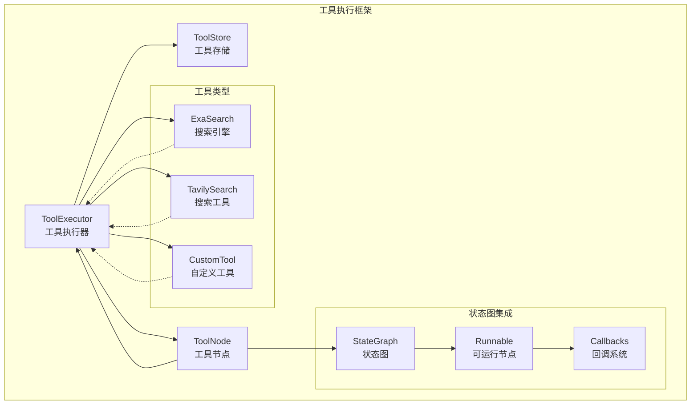

**图表来源**
- [tool_executor.go](file://prebuilt/tool_executor.go#L16-L29)
- [tool_node.go](file://prebuilt/tool_node.go#L12-L16)
- [state_graph.go](file://graph/state_graph.go#L10-L32)

**章节来源**
- [tool_executor.go](file://prebuilt/tool_executor.go#L1-L84)
- [tool_node.go](file://prebuilt/tool_node.go#L1-L108)

## ToolExecutor 设计与实现

### 统一调度中心

`ToolExecutor` 是整个工具执行框架的核心调度器，采用映射表结构存储已注册的工具，提供高效的一对一工具查找机制。

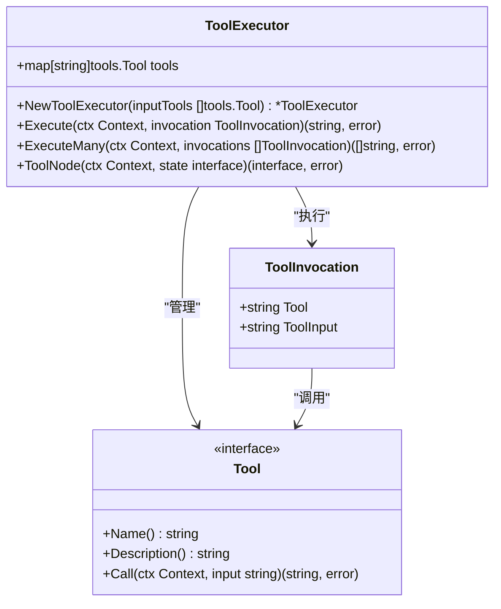

**图表来源**
- [tool_executor.go](file://prebuilt/tool_executor.go#L11-L19)
- [tool_executor.go](file://prebuilt/tool_executor.go#L21-L30)

### 接口抽象机制

框架通过 `langchaingo/tools.Tool` 接口实现工具类型的统一抽象，支持任何符合标准的工具实现：

| 方法 | 功能描述 | 参数 | 返回值 |
|------|----------|------|--------|
| `Name()` | 获取工具名称标识符 | 无 | `string` |
| `Description()` | 获取工具功能描述 | 无 | `string` |
| `Call()` | 执行工具操作 | `ctx Context, input string` | `(string, error)` |

### 安全执行机制

`ToolExecutor` 实现了多层安全检查机制：

1. **工具存在性验证**：执行前检查工具是否已注册
2. **输入参数验证**：确保传入的工具输入格式正确
3. **上下文传播**：支持取消信号和超时控制
4. **错误隔离**：单个工具失败不影响其他工具执行

### 多工具批量执行

框架支持批量工具执行，通过 `ExecuteMany` 方法实现：

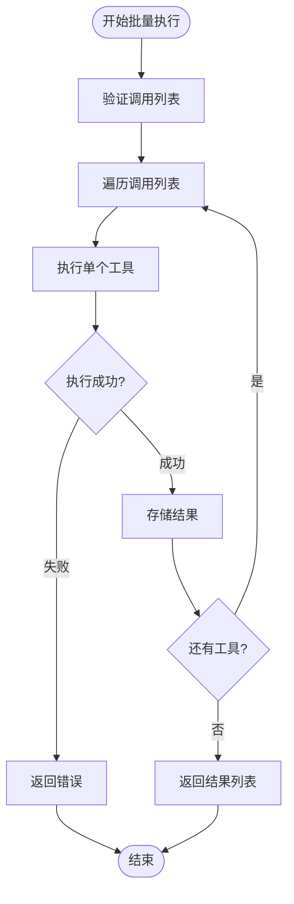

**图表来源**
- [tool_executor.go](file://prebuilt/tool_executor.go#L42-L53)

**章节来源**
- [tool_executor.go](file://prebuilt/tool_executor.go#L21-L84)
- [tool_executor_test.go](file://prebuilt/tool_executor_test.go#L1-L55)

## ToolNode 角色与集成

### 图节点封装

`ToolNode` 将工具执行封装为状态图中的可调度节点，提供灵活的状态处理能力：

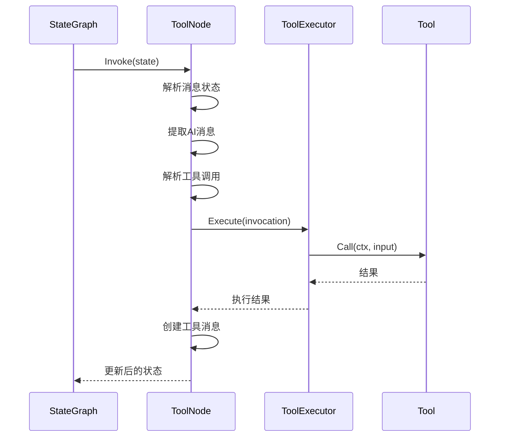

**图表来源**
- [tool_node.go](file://prebuilt/tool_node.go#L25-L107)
- [tool_executor.go](file://prebuilt/tool_executor.go#L56-L83)

### 状态处理策略

`ToolNode` 支持多种状态格式的自动解析：

| 输入格式 | 处理方式 | 示例 |
|----------|----------|------|
| `ToolInvocation` | 单工具执行 | `{Tool: "search", ToolInput: "query"}` |
| `[]ToolInvocation` | 批量工具执行 | `[inv1, inv2, inv3]` |
| `map[string]interface{}` | 键值对解析 | `{"tool": "search", "tool_input": "query"}` |

### 消息格式转换

框架实现了从 LLM 响应到工具调用的自动转换：

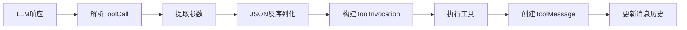

**图表来源**
- [tool_node.go](file://prebuilt/tool_node.go#L54-L96)

**章节来源**
- [tool_node.go](file://prebuilt/tool_node.go#L12-L108)
- [tool_node_test.go](file://prebuilt/tool_node_test.go#L1-L59)

## 工具接口抽象

### 内置工具实现

框架提供了多个内置工具的具体实现，展示标准接口的使用方式：

#### ExaSearch 工具

ExaSearch 是一个基于 API 的搜索引擎工具，支持配置化选项：

| 配置项 | 类型 | 默认值 | 描述 |
|--------|------|--------|------|
| `APIKey` | `string` | 必需 | Exa API 密钥 |
| `BaseURL` | `string` | `"https://api.exa.ai"` | API 基础地址 |
| `NumResults` | `int` | `5` | 返回结果数量 |

#### TavilySearch 工具

TavilySearch 提供高级搜索功能，支持深度搜索配置：

| 配置项 | 类型 | 默认值 | 可选值 | 描述 |
|--------|------|--------|--------|------|
| `APIKey` | `string` | 必需 | - | Tavily API 密钥 |
| `BaseURL` | `string` | `"https://api.tavily.com"` | - | API 基础地址 |
| `SearchDepth` | `string` | `"basic"` | `"basic"`, `"advanced"` | 搜索深度级别 |

### 自定义工具开发

开发者可以通过实现 `Tool` 接口创建自定义工具：

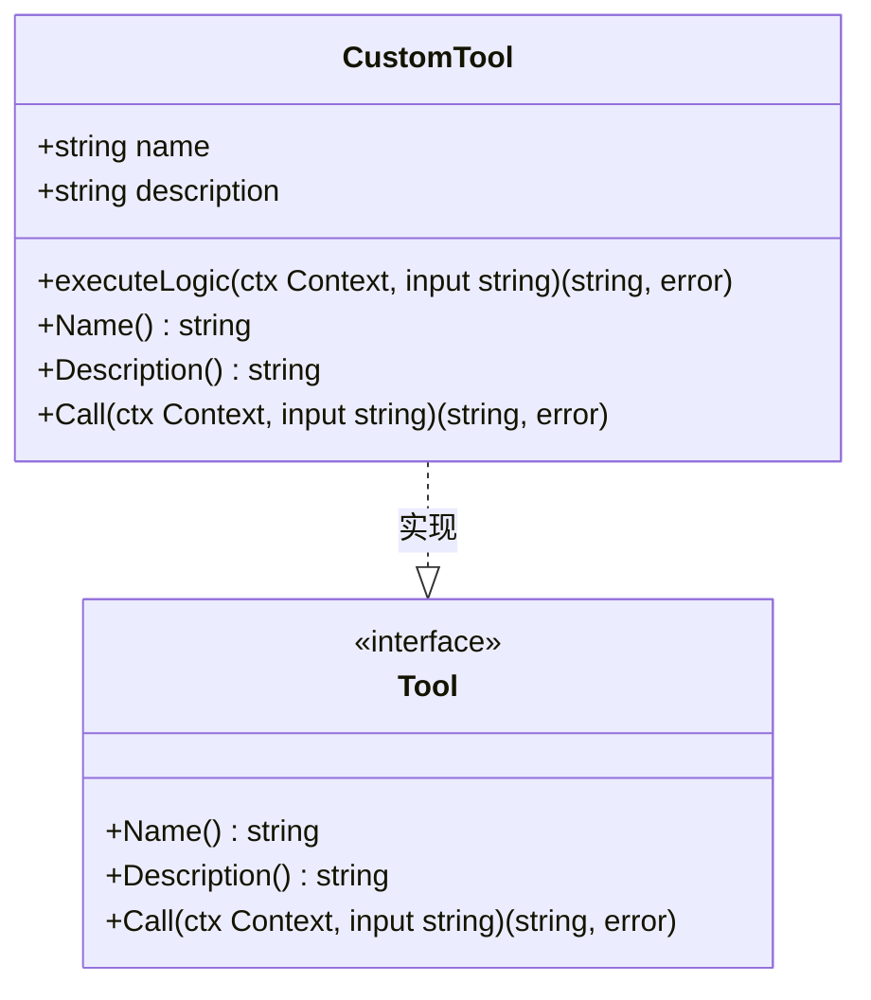

**图表来源**
- [main.go](file://examples/react_agent\main.go#L17-L64)
- [exa.go](file://tool/exa.go#L13-L128)

**章节来源**
- [exa.go](file://tool/exa.go#L1-L128)
- [tavily.go](file://tool/tavily.go#L1-L122)
- [main.go](file://examples/react_agent\main.go#L17-L64)

## 状态图集成机制

### StateGraph 集成

工具执行框架与 `StateGraph` 紧密集成，支持复杂的执行流程控制：

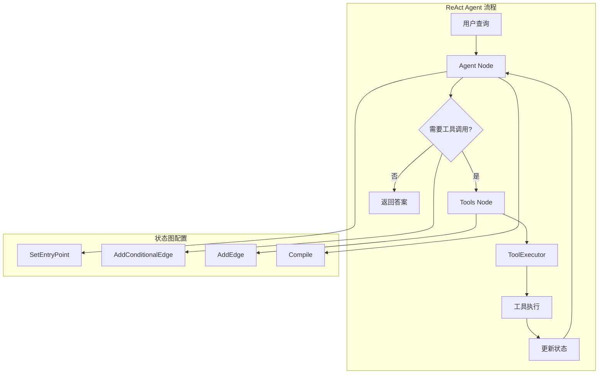

**图表来源**
- [state_graph.go](file://graph/state_graph.go#L10-L32)
- [create_agent.go](file://prebuilt/create_agent.go#L226-L251)

### 条件边逻辑

框架通过条件边实现智能路由决策：

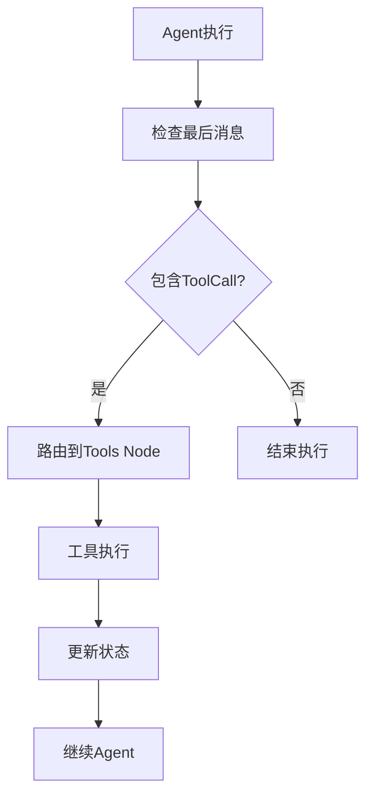

**图表来源**
- [create_agent.go](file://prebuilt/create_agent.go#L229-L246)

### 回调系统集成

工具执行过程中的关键事件会被记录到回调系统中：

| 事件类型 | 触发时机 | 数据内容 |
|----------|----------|----------|
| `OnToolStart` | 工具开始执行 | 工具名称、输入参数 |
| `OnToolEnd` | 工具执行完成 | 执行结果 |
| `OnNodeStart` | 节点开始执行 | 节点名称、状态 |
| `OnNodeEnd` | 节点执行完成 | 最终状态 |

**章节来源**
- [state_graph.go](file://graph/state_graph.go#L1-L326)
- [create_agent.go](file://prebuilt/create_agent.go#L192-L251)

## 错误传播与上下文处理

### 上下文传播机制

框架全面支持 Go 的 `context.Context` 机制，提供完整的生命周期管理：

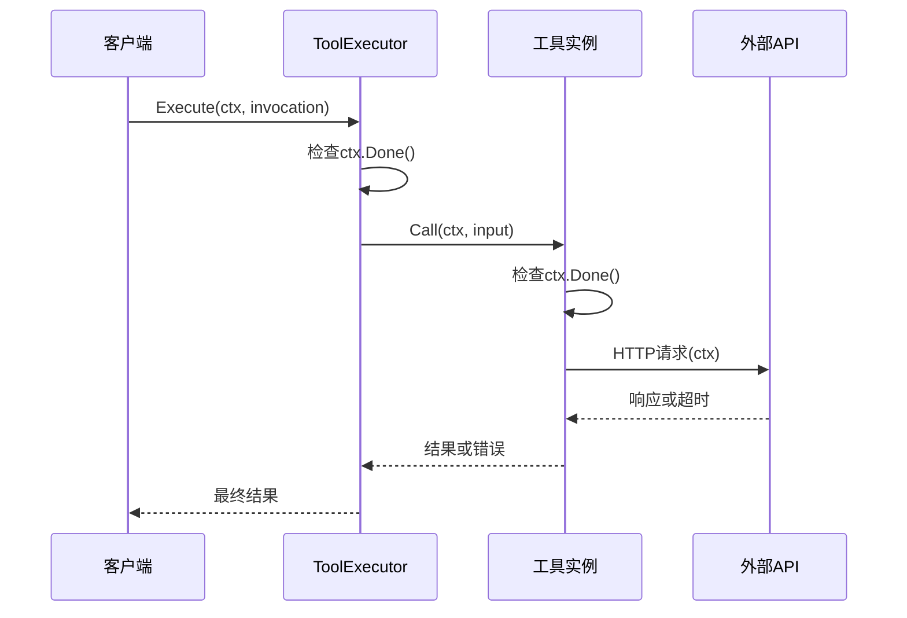

**图表来源**
- [tool_executor.go](file://prebuilt/tool_executor.go#L32-L40)
- [exa.go](file://tool/exa.go#L85-L94)

### 错误处理策略

框架实现了分层的错误处理机制：

1. **工具级错误**：单个工具执行失败时的处理
2. **节点级错误**：ToolNode 执行过程中的错误
3. **图级错误**：整个状态图执行中的错误

### 超时与重试机制

框架集成了多种容错机制：

| 机制 | 实现方式 | 配置选项 |
|------|----------|----------|
| 超时控制 | `context.WithTimeout` | 超时时间设置 |
| 重试策略 | 指数退避算法 | 最大重试次数、退避策略 |
| 熔断器 | 状态机模式 | 失败阈值、恢复时间 |
| 并发限制 | 信号量控制 | 最大并发数 |

**章节来源**
- [retry.go](file://graph/retry.go#L101-L363)
- [tool_executor.go](file://prebuilt/tool_executor.go#L32-L40)

## 性能优化策略

### 连接池管理

对于网络类工具，推荐实现连接池以提高性能：

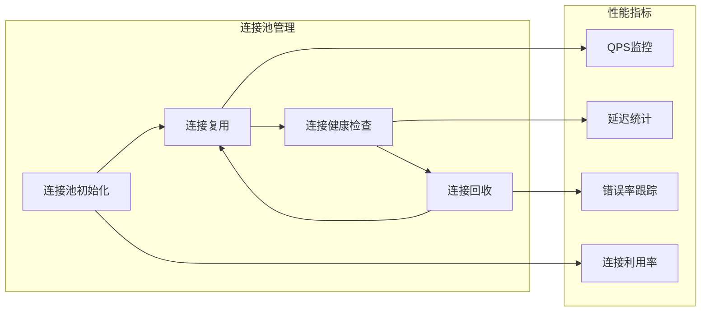

### 结果缓存策略

实现智能缓存机制减少重复计算：

| 缓存类型 | 适用场景 | 生命周期 | 清理策略 |
|----------|----------|----------|----------|
| LRU缓存 | 频繁查询的结果 | TTL过期 | 定期清理 |
| 分布式缓存 | 多实例共享 | 主动失效 | 版本控制 |
| 内存缓存 | 临时结果 | 应用重启清除 | 内存压力检测 |

### 并发控制优化

框架支持多种并发控制模式：

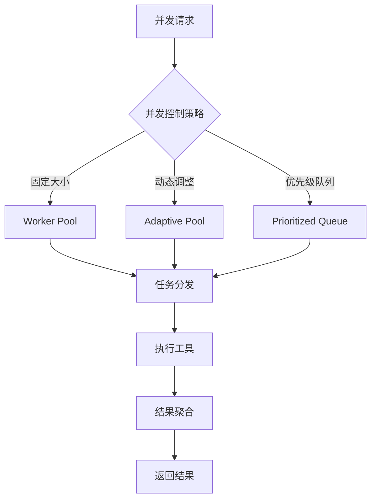

**章节来源**
- [tool_executor.go](file://prebuilt/tool_executor.go#L42-L53)
- [retry.go](file://graph/retry.go#L111-L151)

## 自定义工具开发指南

### 开发步骤

1. **实现 Tool 接口**
2. **注册到 ToolExecutor**
3. **集成到状态图**
4. **编写单元测试**

### 完整示例

以下是一个完整的自定义工具开发示例：

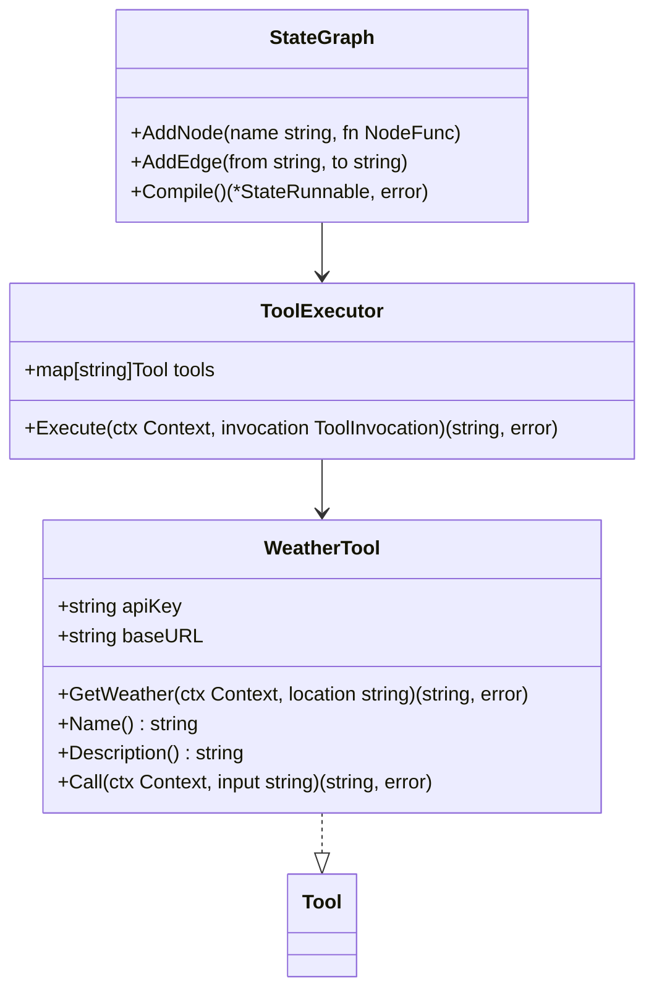

**图表来源**
- [main.go](file://examples/react_agent\main.go#L17-L64)

### 依赖注入模式

推荐使用依赖注入模式管理工具依赖：

| 注入方式 | 适用场景 | 优势 | 劣势 |
|----------|----------|------|------|
| 构造函数注入 | 复杂依赖关系 | 明确依赖关系 | 代码复杂度增加 |
| 工厂模式 | 动态创建 | 灵活性高 | 难以测试 |
| 配置注入 | 简单配置 | 使用方便 | 类型不安全 |

### 测试验证

完整的测试覆盖包括：

1. **单元测试**：工具核心功能测试
2. **集成测试**：与框架集成测试
3. **性能测试**：并发和负载测试
4. **错误测试**：边界条件和异常处理

**章节来源**
- [main.go](file://examples/react_agent\main.go#L17-L122)
- [tool_executor_test.go](file://prebuilt/tool_executor_test.go#L1-L55)

## 最佳实践与测试

### 设计原则

1. **单一职责**：每个工具专注于特定功能
2. **接口一致性**：遵循标准工具接口
3. **错误处理**：提供清晰的错误信息
4. **资源管理**：及时释放系统资源

### 性能监控

推荐实施的监控指标：

| 指标类别 | 具体指标 | 监控目的 |
|----------|----------|----------|
| 执行性能 | 响应时间、吞吐量 | 性能优化 |
| 系统健康 | 错误率、超时率 | 故障预警 |
| 资源使用 | CPU、内存、连接数 | 资源规划 |
| 用户体验 | 成功率、等待时间 | 服务质量 |

### 安全考虑

1. **输入验证**：严格验证工具输入参数
2. **权限控制**：限制工具访问范围
3. **审计日志**：记录所有工具调用
4. **数据保护**：敏感数据加密存储

**章节来源**
- [tool_executor_test.go](file://prebuilt/tool_executor_test.go#L1-L55)
- [tool_node_test.go](file://prebuilt/tool_node_test.go#L1-L59)

## 总结

LangGraphGo 的工具执行框架通过精心设计的架构实现了高度的模块化和可扩展性。`ToolExecutor` 作为统一的调度中心，通过接口抽象支持多种工具类型的安全执行；`ToolNode` 则巧妙地将工具执行集成到状态图中，为智能代理提供了强大的工具调用能力。

框架的核心优势包括：

1. **统一抽象**：通过标准接口支持任意工具类型
2. **安全可靠**：完善的错误处理和上下文管理
3. **高性能**：支持并发执行和智能缓存
4. **易于集成**：与状态图无缝集成
5. **可扩展性**：支持自定义工具开发

该框架为构建复杂的智能代理系统奠定了坚实的基础，无论是简单的工具调用还是复杂的多轮交互，都能得到优雅的解决方案。