# 工具集成

<cite>
**本文档中引用的文件**
- [tool/exa.go](file://tool/exa.go)
- [tool/tavily.go](file://tool/tavily.go)
- [tool/README.md](file://tool/README.md)
- [prebuilt/tool_executor.go](file://prebuilt/tool_executor.go)
- [prebuilt/tool_node.go](file://prebuilt/tool_node.go)
- [examples/tool_exa/main.go](file://examples/tool_exa/main.go)
- [examples/tool_tavily/main.go](file://examples/tool_tavily/main.go)
- [examples/react_agent/main.go](file://examples/react_agent/main.go)
- [showcases/deepagents/tools/filesystem.go](file://showcases/deepagents/tools/filesystem.go)
- [showcases/deepagents/tools/todo.go](file://showcases/deepagents/tools/todo.go)
- [showcases/deepagents/tools/subagent.go](file://showcases/deepagents/tools/subagent.go)
- [prebuilt/tool_executor_test.go](file://prebuilt/tool_executor_test.go)
- [prebuilt/tool_node_test.go](file://prebuilt/tool_node_test.go)
</cite>

## 目录
1. [简介](#简介)
2. [工具接口设计](#工具接口设计)
3. [内置搜索工具](#内置搜索工具)
4. [工具执行器架构](#工具执行器架构)
5. [工具节点机制](#工具节点机制)
6. [自定义工具开发](#自定义工具开发)
7. [工具集成示例](#工具集成示例)
8. [最佳实践](#最佳实践)
9. [故障排除](#故障排除)
10. [总结](#总结)

## 简介

langgraphgo 提供了一套完整的工具集成框架，允许智能代理通过工具节点与外部服务进行交互。该框架支持多种类型的工具，从简单的本地计算工具到复杂的外部 API 集成，为构建功能丰富的 AI 应用提供了强大的基础设施。

工具集成的核心价值在于：
- **扩展性**：通过工具系统，代理可以访问外部知识源和服务
- **安全性**：提供统一的工具调用接口和权限控制
- **可组合性**：多个工具可以协同工作完成复杂任务
- **可测试性**：标准化的接口便于单元测试和模拟

## 工具接口设计

langgraphgo 的工具系统基于 `langchaingo/tools.Tool` 接口，这是一个简洁而强大的抽象层。

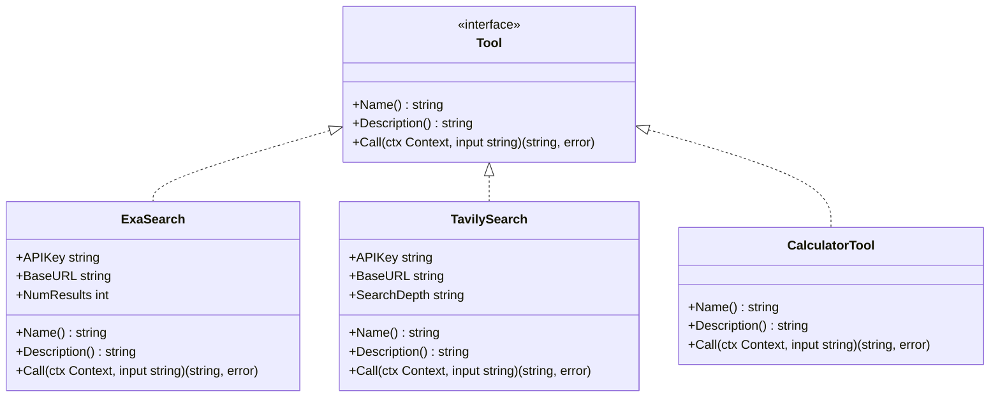

**图表来源**
- [tool/exa.go](file://tool/exa.go#L13-L128)
- [tool/tavily.go](file://tool/tavily.go#L13-L122)
- [examples/react_agent/main.go](file://examples/react_agent/main.go#L17-L63)

### 接口规范

每个工具都必须实现以下三个核心方法：

| 方法 | 类型 | 描述 | 使用场景 |
|------|------|------|----------|
| `Name()` | `string` | 返回工具的唯一标识符 | 工具注册和调用识别 |
| `Description()` | `string` | 返回工具的功能描述 | LLM 决定何时调用工具 |
| `Call()` | `(string, error)` | 执行工具逻辑并返回结果 | 实际的工具功能实现 |

**章节来源**
- [tool/README.md](file://tool/README.md#L49-L57)

## 内置搜索工具

langgraphgo 提供了两个经过优化的搜索工具，专门针对不同类型的搜索需求进行了定制。

### Exa 搜索工具

Exa 是一个专为 LLM 优化的神经搜索引擎，提供高质量的内容检索。

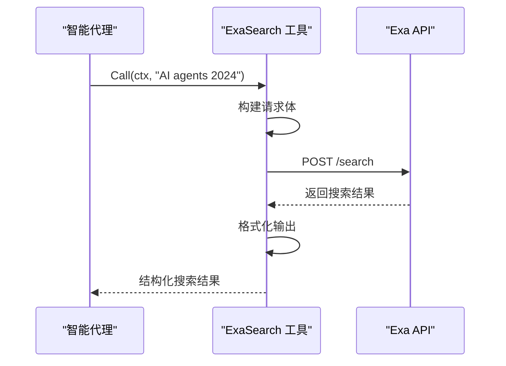

**图表来源**
- [tool/exa.go](file://tool/exa.go#L71-L127)

#### 配置选项

Exa 工具支持灵活的配置选项：

| 选项 | 类型 | 默认值 | 描述 |
|------|------|--------|------|
| `WithExaBaseURL` | `string` | `"https://api.exa.ai"` | API 基础 URL |
| `WithExaNumResults` | `int` | `5` | 返回结果数量 |

#### 认证配置

Exa 工具支持两种认证方式：
1. 直接提供 API 密钥
2. 通过环境变量 `EXA_API_KEY` 自动读取

**章节来源**
- [tool/exa.go](file://tool/exa.go#L36-L56)

### Tavily 搜索工具

Tavily 专注于提供全面、准确且可信的搜索结果，特别适合需要最新信息的场景。

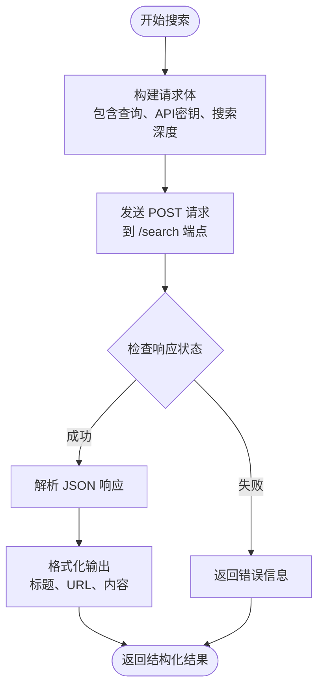

**图表来源**
- [tool/tavily.go](file://tool/tavily.go#L72-L121)

#### 配置选项

| 选项 | 类型 | 默认值 | 描述 |
|------|------|--------|------|
| `WithTavilyBaseURL` | `string` | `"https://api.tavily.com"` | API 基础 URL |
| `WithTavilySearchDepth` | `string` | `"basic"` | 搜索深度：basic/advanced |

#### 搜索深度对比

| 深度级别 | 特点 | 适用场景 |
|----------|------|----------|
| `basic` | 快速搜索，成本较低 | 日常信息查询 |
| `advanced` | 深度分析，更全面的结果 | 研究和深度分析 |

**章节来源**
- [tool/tavily.go](file://tool/tavily.go#L37-L57)

## 工具执行器架构

ToolExecutor 是工具系统的核心组件，负责安全、可靠地执行工具调用。

```mermaid
classDiagram
class ToolExecutor {
-tools map[string]Tool
+NewToolExecutor(inputTools []Tool) *ToolExecutor
+Execute(ctx Context, invocation ToolInvocation) (string, error)
+ExecuteMany(ctx Context, invocations []ToolInvocation) ([]string, error)
+ToolNode(ctx Context, state interface{}) (interface{}, error)
}
class ToolInvocation {
+Tool string
+ToolInput string
}
class Tool {
<<interface>>
+Name() string
+Description() string
+Call(ctx Context, input string) (string, error)
}
ToolExecutor --> ToolInvocation
ToolExecutor --> Tool
```

**图表来源**
- [prebuilt/tool_executor.go](file://prebuilt/tool_executor.go#L16-L84)

### 执行器设计原则

1. **映射存储**：工具按名称存储在映射中，确保 O(1) 查找性能
2. **类型安全**：通过接口约束保证工具的一致性
3. **错误处理**：统一的错误处理和传播机制
4. **状态兼容**：支持多种状态格式的解析

### 工具调用流程

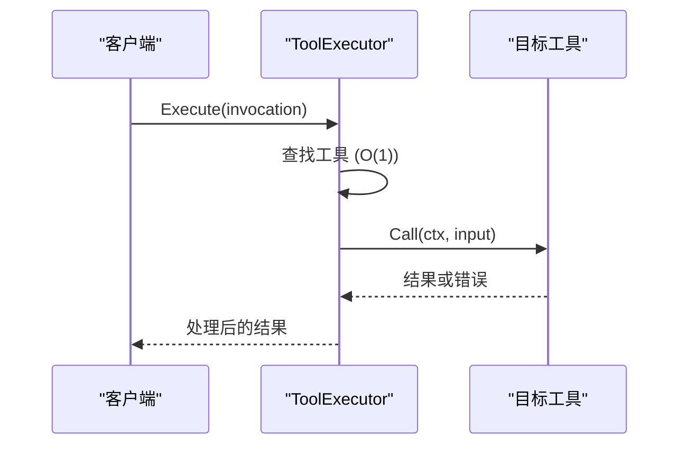

**图表来源**
- [prebuilt/tool_executor.go](file://prebuilt/tool_executor.go#L32-L40)

**章节来源**
- [prebuilt/tool_executor.go](file://prebuilt/tool_executor.go#L16-L84)

## 工具节点机制

ToolNode 是图中的专用节点，负责处理来自 AI 消息的工具调用。

### 节点功能特性

ToolNode 具备以下核心能力：

1. **消息解析**：从 AI 消息中提取工具调用
2. **参数提取**：解析 JSON 格式的工具参数
3. **执行协调**：调用相应的工具执行器
4. **结果封装**：将工具结果包装为工具消息

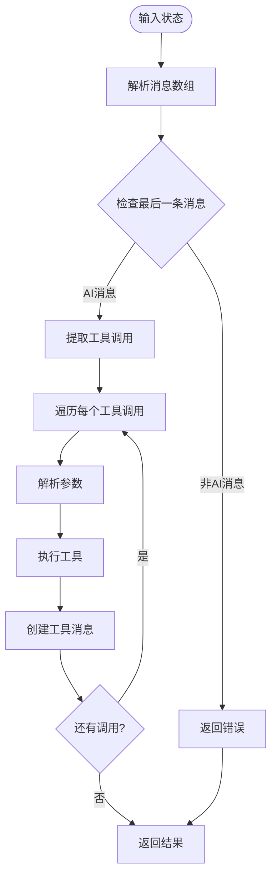

**图表来源**
- [prebuilt/tool_node.go](file://prebuilt/tool_node.go#L25-L107)

### 参数处理策略

ToolNode 支持多种参数格式：

| 格式 | 处理方式 | 示例 |
|------|----------|------|
| JSON 对象 | 解析为 map[string]interface{} | `{"input": "query"}` |
| 简单字符串 | 直接使用 | `"simple query"` |
| 缺失输入键 | 使用整个参数字符串 | `"{\"query\":\"test\"}"` |

**章节来源**
- [prebuilt/tool_node.go](file://prebuilt/tool_node.go#L12-L108)

## 自定义工具开发

langgraphgo 支持创建各种类型的自定义工具，从简单的本地功能到复杂的外部服务集成。

### 基础计算器工具

最简单的工具实现展示了标准模式：

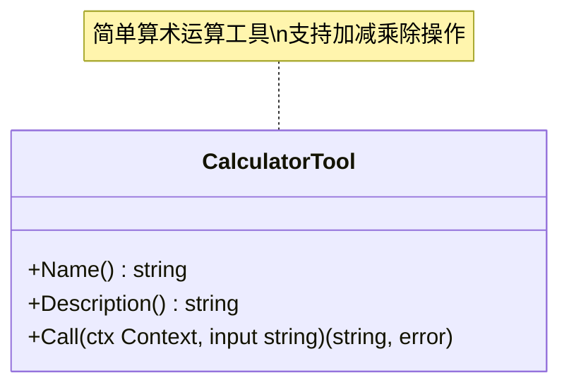

**图表来源**
- [examples/react_agent/main.go](file://examples/react_agent/main.go#L17-L63)

### 文件系统工具

文件系统工具展示了本地资源访问的实现模式：

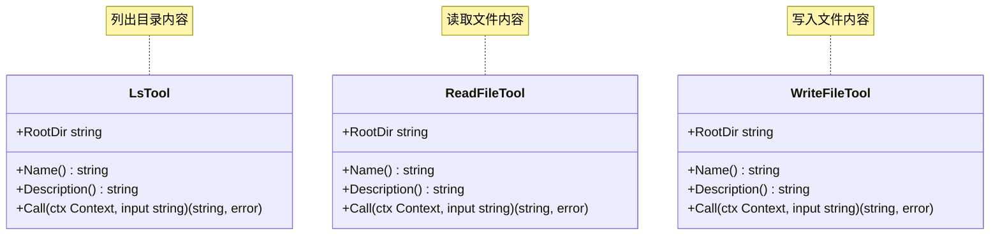

**图表来源**
- [showcases/deepagents/tools/filesystem.go](file://showcases/deepagents/tools/filesystem.go#L12-L104)

### 子代理工具

子代理工具展示了工具间的协作模式：

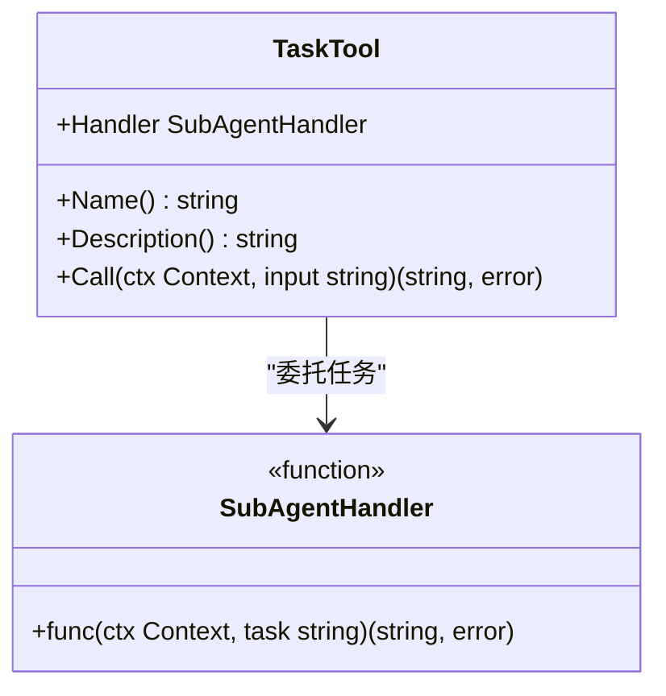

**图表来源**
- [showcases/deepagents/tools/subagent.go](file://showcases/deepagents/tools/subagent.go#L8-L30)

### 待办事项工具

待办事项工具展示了状态管理和并发控制：

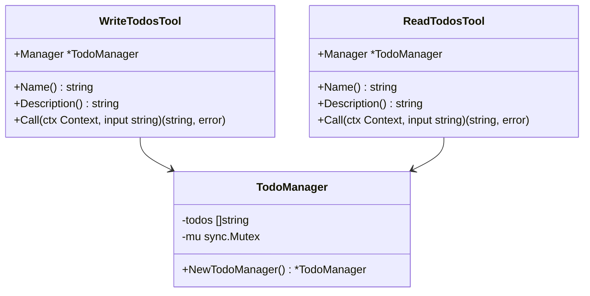

**图表来源**
- [showcases/deepagents/tools/todo.go](file://showcases/deepagents/tools/todo.go#L9-L72)

**章节来源**
- [examples/react_agent/main.go](file://examples/react_agent/main.go#L17-L63)
- [showcases/deepagents/tools/filesystem.go](file://showcases/deepagents/tools/filesystem.go#L12-L104)
- [showcases/deepagents/tools/subagent.go](file://showcases/deepagents/tools/subagent.go#L8-L30)
- [showcases/deepagents/tools/todo.go](file://showcases/deepagents/tools/todo.go#L9-L72)

## 工具集成示例

langgraphgo 提供了完整的工具集成示例，展示了从简单到复杂的各种应用场景。

### Exa 搜索集成

Exa 搜索工具的集成展示了如何将外部搜索能力注入到智能代理中：

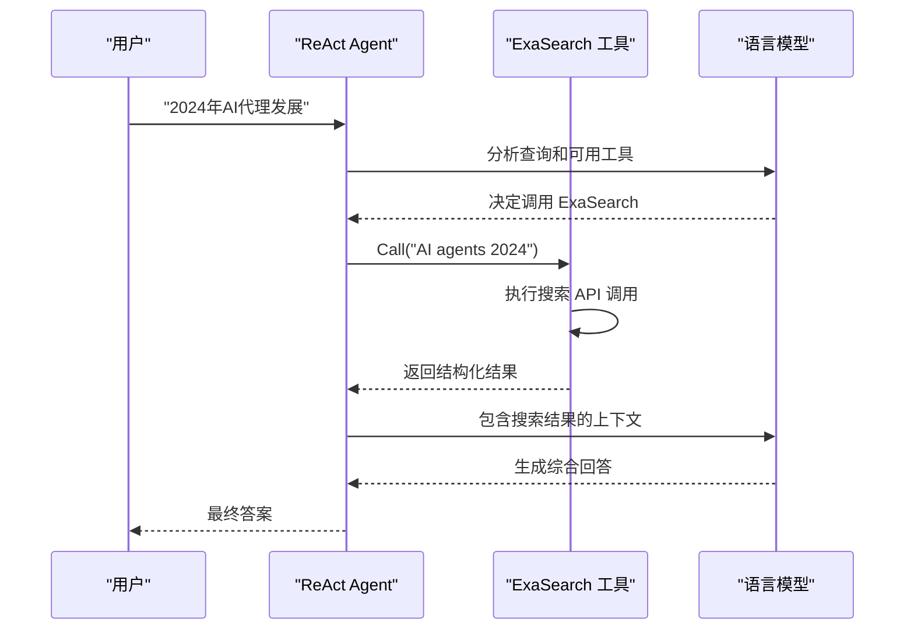

**图表来源**
- [examples/tool_exa/main.go](file://examples/tool_exa/main.go#L16-L73)

### Tavily 搜索集成

Tavily 工具的集成展示了高级搜索功能的应用：

```mermaid
flowchart TD
Start([用户查询]) --> InitLLM["初始化 LLM"]
InitLLM --> InitTool["初始化 Tavily 工具<br/>WithTavilySearchDepth(\"advanced\")"]
InitTool --> CreateAgent["创建 ReAct Agent"]
CreateAgent --> SendQuery["发送查询"]
SendQuery --> LLMReason["LLM 分析并决定搜索"]
LLMReason --> ToolCall["调用 Tavily 工具"]
ToolCall --> APICall["API 调用 (advanced)"]
APICall --> ProcessResults["处理详细结果"]
ProcessResults --> GenerateAnswer["生成最终回答"]
GenerateAnswer --> End([返回结果])
```

**图表来源**
- [examples/tool_tavily/main.go](file://examples/tool_tavily/main.go#L16-L78)

### 多工具组合

ReAct Agent 展示了多工具协同工作的模式：

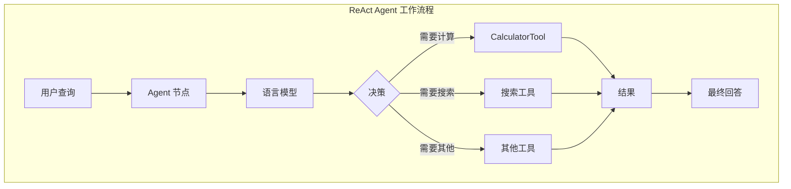

**图表来源**
- [examples/react_agent/main.go](file://examples/react_agent/main.go#L66-L122)

**章节来源**
- [examples/tool_exa/main.go](file://examples/tool_exa/main.go#L16-L73)
- [examples/tool_tavily/main.go](file://examples/tool_tavily/main.go#L16-L78)
- [examples/react_agent/main.go](file://examples/react_agent/main.go#L66-L122)

## 最佳实践

### 工具设计原则

1. **单一职责**：每个工具应该只解决一个特定问题
2. **幂等性**：工具调用应该是幂等的，避免副作用
3. **错误处理**：提供清晰的错误信息和恢复建议
4. **性能考虑**：合理设置超时和重试机制

### 安全最佳实践

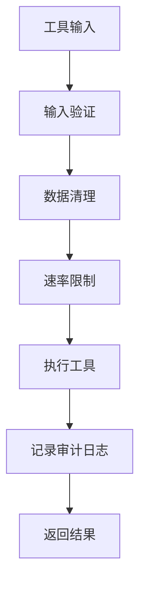

### 测试策略

工具测试应该覆盖以下方面：

| 测试类型 | 关注点 | 实现方式 |
|----------|--------|----------|
| 单元测试 | 工具逻辑正确性 | Mock 外部依赖 |
| 集成测试 | 工具与系统的交互 | 使用真实 API 或模拟 |
| 性能测试 | 响应时间和吞吐量 | 负载测试和基准测试 |
| 错误处理测试 | 异常情况处理 | 故障注入和边界测试 |

**章节来源**
- [prebuilt/tool_executor_test.go](file://prebuilt/tool_executor_test.go#L11-L55)
- [prebuilt/tool_node_test.go](file://prebuilt/tool_node_test.go#L12-L59)

## 故障排除

### 常见问题及解决方案

| 问题类型 | 症状 | 可能原因 | 解决方案 |
|----------|------|----------|----------|
| 认证失败 | API 调用被拒绝 | API 密钥无效或过期 | 检查环境变量和密钥有效性 |
| 工具未找到 | "tool not found" 错误 | 工具未正确注册 | 确保工具添加到工具列表 |
| 参数解析错误 | JSON 解析失败 | 输入格式不正确 | 验证输入格式和编码 |
| 超时问题 | 请求超时 | 网络延迟或服务不可用 | 增加超时时间或实现重试 |

### 调试技巧

1. **启用日志记录**：使用结构化日志跟踪工具调用
2. **监控指标**：跟踪工具执行时间和成功率
3. **错误分类**：区分临时错误和永久错误
4. **性能分析**：识别慢查询和瓶颈

## 总结

langgraphgo 的工具集成系统提供了一个强大而灵活的框架，支持从简单本地工具到复杂外部服务的各种集成需求。通过标准化的接口设计、安全的执行机制和丰富的示例，开发者可以轻松地扩展智能代理的功能。

关键优势包括：

- **统一接口**：所有工具遵循相同的接口规范
- **安全执行**：通过 ToolExecutor 提供安全的工具调用
- **灵活配置**：支持多种配置选项和认证方式
- **丰富生态**：内置多个实用工具，支持自定义扩展
- **生产就绪**：经过充分测试，适合生产环境使用

随着 AI 应用的发展，工具集成将成为构建智能代理的重要组成部分，langgraphgo 的工具系统为这一领域提供了坚实的基础。