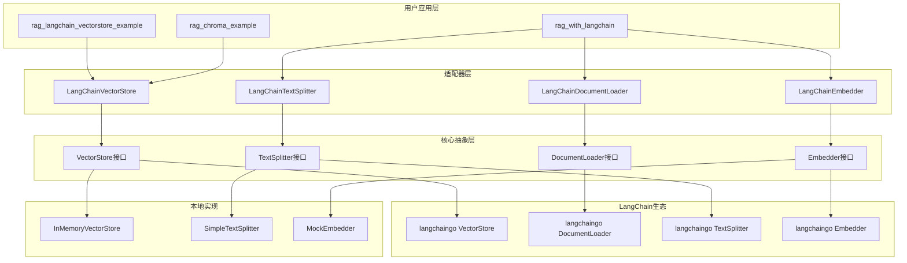
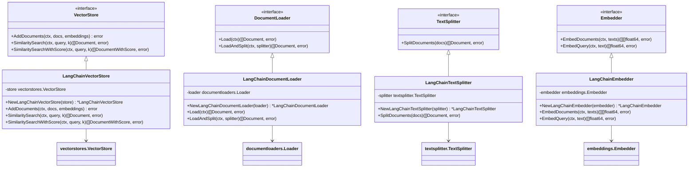
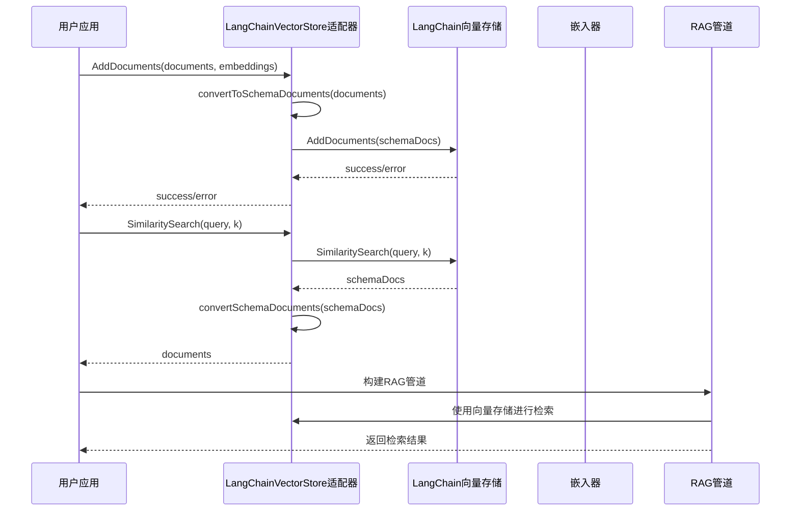
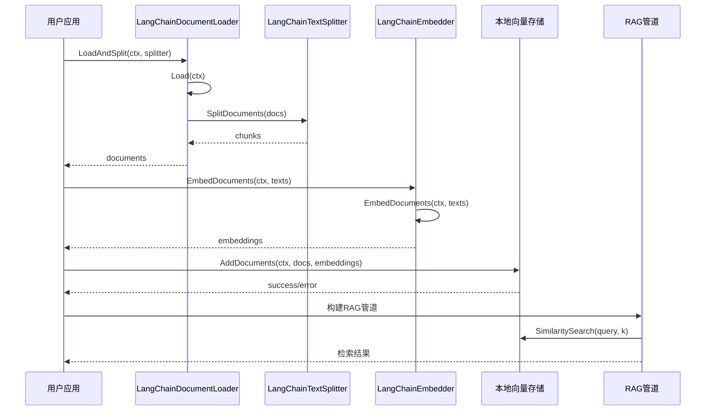
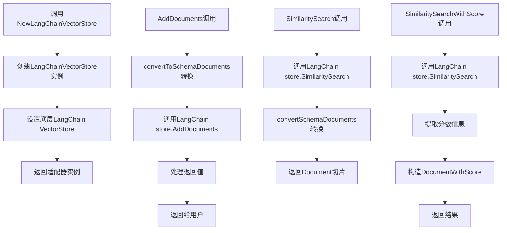

# LangChain生态集成

<cite>
**本文档引用的文件**
- [examples/rag_langchain_vectorstore_example/main.go](file://examples/rag_langchain_vectorstore_example/main.go)
- [examples/rag_with_langchain/main.go](file://examples/rag_with_langchain/main.go)
- [examples/rag_chroma_example/main.go](file://examples/rag_chroma_example/main.go)
- [prebuilt/rag_langchain_adapter.go](file://prebuilt/rag_langchain_adapter.go)
- [prebuilt/rag.go](file://prebuilt/rag.go)
- [prebuilt/rag_components.go](file://prebuilt/rag_components.go)
- [prebuilt/rag_langchain_vectorstore_test.go](file://prebuilt/rag_langchain_vectorstore_test.go)
</cite>

## 目录
1. [简介](#简介)
2. [项目结构概览](#项目结构概览)
3. [核心组件分析](#核心组件分析)
4. [架构对比分析](#架构对比分析)
5. [适配器实现机制](#适配器实现机制)
6. [向量存储迁移指南](#向量存储迁移指南)
7. [性能考虑](#性能考虑)
8. [故障排除指南](#故障排除指南)
9. [总结](#总结)

## 简介

LangGraphGo通过精心设计的适配层架构，成功实现了对LangChain生态系统的深度集成，特别是在向量存储方面的兼容性。本文档深入分析了两种主要的集成示例：`rag_langchain_vectorstore_example`和`rag_with_langchain`，详细阐述了`prebuilt/rag_langchain_adapter.go`中`NewLangChainVectorStore`的实现机制，并提供了从InMemoryVectorStore迁移到外部向量库的完整指南。

这种适配器模式不仅实现了不同向量数据库的无缝替换，还保持了LangGraphGo核心功能的一致性和可扩展性，为开发者提供了灵活且强大的向量存储解决方案。

## 项目结构概览

LangGraphGo的向量存储集成采用了模块化的架构设计，主要包含以下关键组件：



**图表来源**
- [prebuilt/rag.go](file://prebuilt/rag.go#L12-L40)
- [prebuilt/rag_langchain_adapter.go](file://prebuilt/rag_langchain_adapter.go#L172-L252)

**章节来源**
- [examples/rag_langchain_vectorstore_example/main.go](file://examples/rag_langchain_vectorstore_example/main.go#L1-L50)
- [examples/rag_with_langchain/main.go](file://examples/rag_with_langchain/main.go#L1-L50)

## 核心组件分析

### LangChain适配器架构

LangGraphGo的适配器系统采用了统一的接口适配模式，将LangChain的组件无缝集成到LangGraphGo的生态系统中：



**图表来源**
- [prebuilt/rag.go](file://prebuilt/rag.go#L34-L40)
- [prebuilt/rag.go](file://prebuilt/rag.go#L18-L26)
- [prebuilt/rag.go](file://prebuilt/rag.go#L24-L26)
- [prebuilt/rag.go](file://prebuilt/rag.go#L28-L32)

**章节来源**
- [prebuilt/rag_langchain_adapter.go](file://prebuilt/rag_langchain_adapter.go#L172-L252)

### 内存向量存储实现

LangGraphGo提供了高性能的内存向量存储实现，作为开发和测试的基础组件：

```mermaid
classDiagram
class InMemoryVectorStore {
-documents []Document
-embeddings [][]float64
-embedder Embedder
+NewInMemoryVectorStore(embedder) *InMemoryVectorStore
+AddDocuments(ctx, docs, embeddings) error
+SimilaritySearch(ctx, query, k) ([]Document, error)
+SimilaritySearchWithScore(ctx, query, k) ([]DocumentWithScore, error)
-cosineSimilarity(a, b []float64) float64
}
class Embedder {
<<interface>>
+EmbedDocuments(ctx, texts) ([][]float64, error)
+EmbedQuery(ctx, text) ([]float64, error)
}
class Document {
+PageContent string
+Metadata map[string]interface{}
}
class DocumentWithScore {
+Document Document
+Score float64
}
InMemoryVectorStore --> Embedder
InMemoryVectorStore --> Document
InMemoryVectorStore --> DocumentWithScore
```

**图表来源**
- [prebuilt/rag_components.go](file://prebuilt/rag_components.go#L94-L108)
- [prebuilt/rag.go](file://prebuilt/rag.go#L12-L16)
- [prebuilt/rag.go](file://prebuilt/rag.go#L41-L45)

**章节来源**
- [prebuilt/rag_components.go](file://prebuilt/rag_components.go#L94-L333)

## 架构对比分析

### rag_langchain_vectorstore_example vs rag_with_langchain

两种示例展示了不同的集成策略和应用场景：

#### rag_langchain_vectorstore_example - LangChain向量存储集成

该示例专注于利用LangChain生态的向量存储能力，特别是通过适配器模式集成外部向量数据库：



**图表来源**
- [examples/rag_langchain_vectorstore_example/main.go](file://examples/rag_langchain_vectorstore_example/main.go#L82-L120)
- [prebuilt/rag_langchain_adapter.go](file://prebuilt/rag_langchain_adapter.go#L184-L212)

#### rag_with_langchain - LangChain组件集成

该示例更全面地集成了LangChain的各种组件，包括文档加载器、文本分割器和嵌入器：



**图表来源**
- [examples/rag_with_langchain/main.go](file://examples/rag_with_langchain/main.go#L62-L120)
- [prebuilt/rag_langchain_adapter.go](file://prebuilt/rag_langchain_adapter.go#L18-L43)

**章节来源**
- [examples/rag_langchain_vectorstore_example/main.go](file://examples/rag_langchain_vectorstore_example/main.go#L19-L256)
- [examples/rag_with_langchain/main.go](file://examples/rag_with_langchain/main.go#L19-L239)

## 适配器实现机制

### NewLangChainVectorStore的实现原理

`NewLangChainVectorStore`是整个适配器系统的核心，它实现了LangGraphGo VectorStore接口与LangChain VectorStore接口之间的无缝转换：



**图表来源**
- [prebuilt/rag_langchain_adapter.go](file://prebuilt/rag_langchain_adapter.go#L178-L252)

### 关键实现细节

#### 文档格式转换

适配器在两个方向上进行文档格式转换：

1. **LangGraphGo到LangChain**：将`Document`转换为`schema.Document`
2. **LangChain到LangGraphGo**：将`schema.Document`转换为`Document`

这种双向转换确保了数据格式的一致性，同时保留了所有元数据信息。

#### 嵌入维度转换

由于LangChain使用`float32`而LangGraphGo使用`float64`，适配器自动处理了这一类型转换：

```go
// LangChain Embedder (float32) → LangGraphGo Embedder (float64)
embeddings32, err := e.embedder.EmbedDocuments(ctx, texts)
embeddings64 := make([][]float64, len(embeddings32))
for i, emb32 := range embeddings32 {
    embeddings64[i] = make([]float64, len(emb32))
    for j, val := range emb32 {
        embeddings64[i][j] = float64(val)
    }
}
```

**章节来源**
- [prebuilt/rag_langchain_adapter.go](file://prebuilt/rag_langchain_adapter.go#L135-L170)

## 向量存储迁移指南

### 从InMemoryVectorStore迁移到Chroma

以下是将向量存储从内存实现迁移到Chroma数据库的完整代码转换指南：

#### 1. 原始内存存储实现

```go
// 原始内存向量存储
embedder := prebuilt.NewMockEmbedder(128)
vectorStore := prebuilt.NewInMemoryVectorStore(embedder)

// 添加文档
err := vectorStore.AddDocuments(ctx, chunks, embeddings)
if err != nil {
    log.Fatalf("Failed to add documents: %v", err)
}

// 相似度搜索
results, err := vectorStore.SimilaritySearchWithScore(ctx, query, 3)
```

#### 2. 迁移到Chroma的完整代码

```go
// 1. 初始化OpenAI LLM和嵌入器
llm, err := openai.New()
if err != nil {
    log.Fatalf("Failed to create LLM: %v", err)
}

embedder, err := embeddings.NewEmbedder(llm)
if err != nil {
    log.Fatalf("Failed to create embedder: %v", err)
}

// 2. 创建Chroma向量存储
chromaStore, err := chroma.New(
    chroma.WithChromaURL("http://localhost:8000"),
    chroma.WithEmbedder(embedder),
    chroma.WithDistanceFunction("cosine"),
    chroma.WithNameSpace("langgraphgo_example"),
)
if err != nil {
    log.Fatalf("Failed to create Chroma store: %v", err)
}

// 3. 使用适配器包装Chroma存储
vectorStore := prebuilt.NewLangChainVectorStore(chromaStore)

// 4. 添加文档到Chroma
texts := make([]string, len(chunks))
for i, chunk := range chunks {
    texts[i] = chunk.PageContent
}

embeddings, err := prebuilt.NewLangChainEmbedder(embedder).EmbedDocuments(ctx, texts)
if err != nil {
    log.Fatalf("Failed to generate embeddings: %v", err)
}

err = vectorStore.AddDocuments(ctx, chunks, embeddings)
if err != nil {
    log.Fatalf("Failed to add documents to Chroma: %v", err)
}

// 5. 使用Chroma进行相似度搜索
results, err := vectorStore.SimilaritySearchWithScore(ctx, query, 3)
if err != nil {
    log.Fatalf("Search failed: %v", err)
}
```

#### 3. 迁移步骤详解

| 步骤 | 原始代码 | 迁移后代码 | 说明 |
|------|----------|------------|------|
| 1 | 创建嵌入器 | 创建嵌入器 | 保持不变 |
| 2 | 创建InMemoryVectorStore | 创建Chroma存储 | 替换存储实现 |
| 3 | 包装适配器 | 包装适配器 | 使用LangChain适配器 |
| 4 | 添加文档 | 添加文档 | 保持API一致 |
| 5 | 相似度搜索 | 相似度搜索 | 保持API一致 |

### 支持的向量数据库迁移

#### Weaviate集成

```go
// 创建Weaviate向量存储
weaviateStore, err := weaviate.New(
    weaviate.WithScheme("http"),
    weaviate.WithHost("localhost:8080"),
    weaviate.WithEmbedder(embedder),
)
if err != nil {
    log.Fatalf("Failed to create Weaviate store: %v", err)
}

vectorStore := prebuilt.NewLangChainVectorStore(weaviateStore)
```

#### Pinecone集成

```go
// 创建Pinecone向量存储
pineconeStore, err := pinecone.New(
    pinecone.WithAPIKey(apiKey),
    pinecone.WithEnvironment(environment),
    pinecone.WithIndex(indexName),
    pinecone.WithEmbedder(embedder),
)
if err != nil {
    log.Fatalf("Failed to create Pinecone store: %v", err)
}

vectorStore := prebuilt.NewLangChainVectorStore(pineconeStore)
```

#### Qdrant集成

```go
// 创建Qdrant向量存储
qdrantStore, err := qdrant.New(
    qdrant.WithEndpoint("http://localhost:6333"),
    qdrant.WithEmbedder(embedder),
)
if err != nil {
    log.Fatalf("Failed to create Qdrant store: %v", err)
}

vectorStore := prebuilt.NewLangChainVectorStore(qdrantStore)
```

**章节来源**
- [examples/rag_chroma_example/main.go](file://examples/rag_chroma_example/main.go#L81-L115)
- [examples/rag_langchain_vectorstore_example/main.go](file://examples/rag_langchain_vectorstore_example/main.go#L180-L224)

## 性能考虑

### 内存vs持久化存储

| 存储类型 | 优势 | 劣势 | 适用场景 |
|----------|------|------|----------|
| InMemoryVectorStore | 高性能，低延迟 | 数据易失，容量有限 | 开发测试，小规模数据 |
| Chroma | 持久化存储，分布式 | 网络延迟，配置复杂 | 生产环境，大规模数据 |
| Weaviate | 企业级功能，GraphQL API | 资源消耗较大 | 复杂查询需求 |
| Pinecone | 托管服务，高可用 | 成本较高 | 快速部署，生产环境 |

### 性能优化建议

1. **批量操作优化**
   - 使用批量添加API减少网络开销
   - 合理设置批次大小

2. **缓存策略**
   - 实现查询结果缓存
   - 缓存频繁访问的嵌入向量

3. **索引优化**
   - 选择合适的距离度量
   - 配置适当的分片策略

## 故障排除指南

### 常见问题及解决方案

#### 1. Chroma连接失败

**错误信息**：`Failed to create Chroma store: connection refused`

**解决方案**：
```bash
# 启动Chroma服务器
docker run -p 8000:8000 chromadb/chroma

# 检查服务器状态
curl http://localhost:8000/health
```

#### 2. 嵌入维度不匹配

**错误信息**：`number of documents must match number of embeddings`

**解决方案**：
```go
// 确保文档和嵌入数量一致
if len(chunks) != len(embeddings) {
    log.Fatalf("文档数量(%d)必须等于嵌入数量(%d)", len(chunks), len(embeddings))
}
```

#### 3. 类型转换错误

**错误信息**：`cannot convert float32 to float64`

**解决方案**：
适配器已自动处理此问题，无需手动干预。

**章节来源**
- [examples/rag_chroma_example/main.go](file://examples/rag_chroma_example/main.go#L199-L202)
- [prebuilt/rag_langchain_adapter.go](file://prebuilt/rag_langchain_adapter.go#L135-L170)

## 总结

LangGraphGo通过精心设计的适配器模式，成功实现了对LangChain生态系统的深度集成。这种架构设计具有以下关键优势：

### 技术优势

1. **无缝集成**：通过适配器模式，LangGraphGo能够无缝集成各种LangChain组件，包括文档加载器、文本分割器、嵌入器和向量存储。

2. **接口统一**：适配器提供了统一的接口，使得不同向量数据库可以以相同的方式被使用，实现了"一次编写，到处运行"的目标。

3. **类型安全**：自动处理了LangChain的`float32`和LangGraphGo的`float64`之间的类型转换，确保了类型安全。

4. **向后兼容**：新的向量存储实现完全兼容现有的LangGraphGo API，无需修改用户代码。

### 架构优势

1. **模块化设计**：清晰的分层架构使得各个组件职责明确，易于维护和扩展。

2. **可插拔架构**：支持多种向量数据库的无缝切换，为不同场景提供了灵活的选择。

3. **测试友好**：提供了完善的单元测试和模拟实现，确保了系统的可靠性。

### 应用价值

- **开发效率**：开发者可以快速切换向量存储，无需修改核心业务逻辑
- **成本控制**：根据实际需求选择合适的向量存储方案
- **技术栈灵活性**：充分利用LangChain生态的丰富组件

这种适配器模式不仅解决了当前的技术集成问题，更为未来的扩展奠定了坚实的基础，体现了LangGraphGo在架构设计上的前瞻性和实用性。