# 嵌入模型集成

<cite>
**本文档中引用的文件**
- [examples/rag_with_embeddings/main.go](file://examples/rag_with_embeddings/main.go)
- [prebuilt/rag_components.go](file://prebuilt/rag_components.go)
- [examples/rag_with_embeddings/README.md](file://examples/rag_with_embeddings/README.md)
- [prebuilt/rag_langchain_adapter.go](file://prebuilt/rag_langchain_adapter.go)
</cite>

## 目录
1. [简介](#简介)
2. [项目结构概览](#项目结构概览)
3. [核心组件分析](#核心组件分析)
4. [架构设计](#架构设计)
5. [详细组件分析](#详细组件分析)
6. [最佳实践](#最佳实践)
7. [故障排除指南](#故障排除指南)
8. [总结](#总结)

## 简介

langgraphgo中的嵌入模型集成为RAG（检索增强生成）系统提供了强大的语义搜索能力。本文档详细分析了examples/rag_with_embeddings/main.go中的实现流程，重点说明prebuilt/rag_components.go中InMemoryVectorStore和Embedder接口的设计原理，展示如何通过NewMockEmbedder和自定义嵌入器实现文本向量化。

该方案的核心优势在于：
- **无缝集成**：通过LangChain适配器实现与多种嵌入模型提供商的直接集成
- **灵活配置**：支持OpenAI、Cohere、HuggingFace等多种提供商
- **类型安全**：自动处理float32与float64之间的类型转换
- **开发友好**：提供Mock嵌入器用于开发测试场景

## 项目结构概览

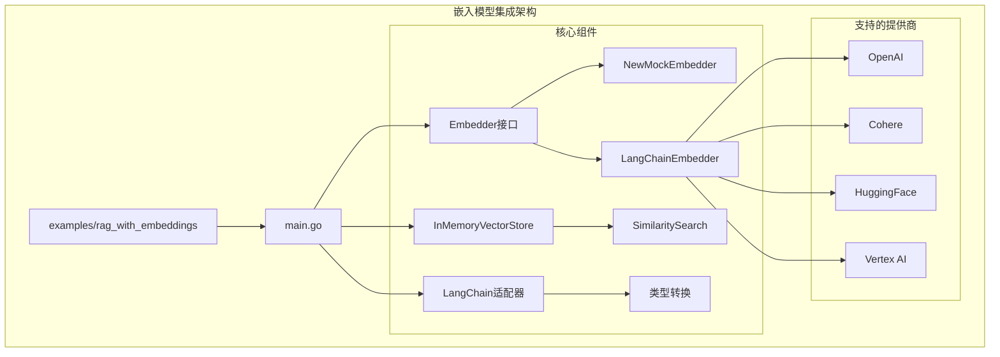

**图表来源**
- [examples/rag_with_embeddings/main.go](file://examples/rag_with_embeddings/main.go#L1-L290)
- [prebuilt/rag_components.go](file://prebuilt/rag_components.go#L1-L333)

**章节来源**
- [examples/rag_with_embeddings/main.go](file://examples/rag_with_embeddings/main.go#L1-L50)
- [prebuilt/rag_components.go](file://prebuilt/rag_components.go#L1-L100)

## 核心组件分析

### Embedder接口设计

Embedder接口是整个嵌入模型系统的核心抽象，定义了统一的文本向量化接口：

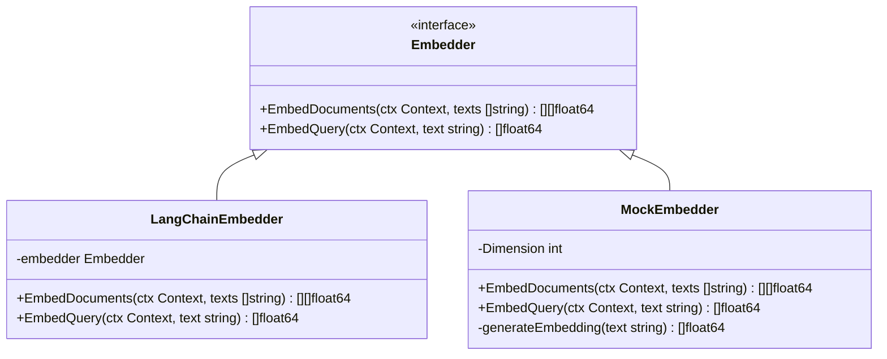

**图表来源**
- [prebuilt/rag.go](file://prebuilt/rag.go#L28-L31)
- [prebuilt/rag_langchain_adapter.go](file://prebuilt/rag_langchain_adapter.go#L123-L171)
- [prebuilt/rag_components.go](file://prebuilt/rag_components.go#L280-L332)

### InMemoryVectorStore实现

InMemoryVectorStore提供了内存中的向量存储解决方案，支持高效的相似度搜索：

```mermaid
classDiagram
class InMemoryVectorStore {
-documents []Document
-embeddings [][]float64
-embedder Embedder
+NewInMemoryVectorStore(embedder Embedder) *InMemoryVectorStore
+AddDocuments(ctx Context, documents []Document, embeddings [][]float64) error
+SimilaritySearch(ctx Context, query string, k int) []Document
+SimilaritySearchWithScore(ctx Context, query string, k int) []DocumentWithScore
}
class Document {
+PageContent string
+Metadata map[string]interface{}
}
class DocumentWithScore {
+Document Document
+Score float64
}
InMemoryVectorStore --> Document
InMemoryVectorStore --> DocumentWithScore
```

**图表来源**
- [prebuilt/rag_components.go](file://prebuilt/rag_components.go#L94-L184)

**章节来源**
- [prebuilt/rag_components.go](file://prebuilt/rag_components.go#L94-L184)

## 架构设计

### 整体架构流程

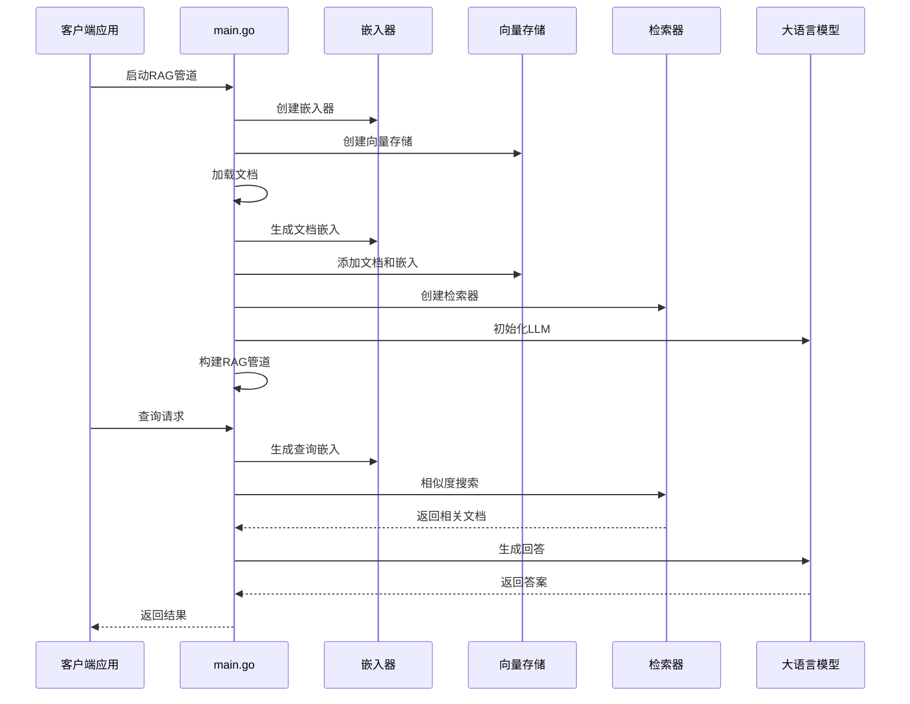

**图表来源**
- [examples/rag_with_embeddings/main.go](file://examples/rag_with_embeddings/main.go#L71-L220)

### LangChain适配器架构

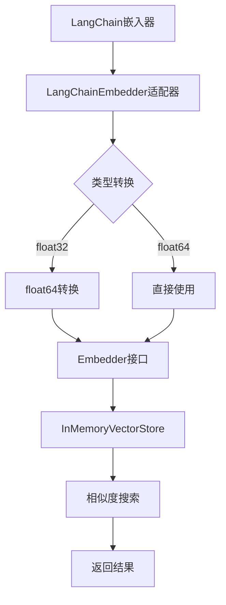

**图表来源**
- [prebuilt/rag_langchain_adapter.go](file://prebuilt/rag_langchain_adapter.go#L123-L171)

**章节来源**
- [examples/rag_with_embeddings/main.go](file://examples/rag_with_embeddings/main.go#L24-L85)
- [prebuilt/rag_langchain_adapter.go](file://prebuilt/rag_langchain_adapter.go#L123-L171)

## 详细组件分析

### LangChain嵌入器适配器

LangChainEmbedder适配器是连接langchaingo嵌入器与langgraphgo系统的桥梁，实现了以下关键功能：

#### 类型转换机制

适配器负责处理LangChain返回的float32类型与langgraphgo内部使用的float64类型之间的转换：

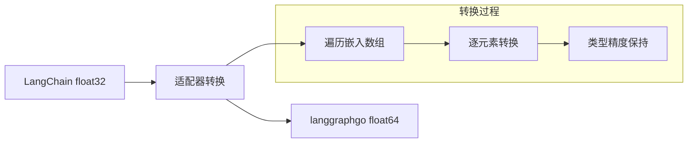

**图表来源**
- [prebuilt/rag_langchain_adapter.go](file://prebuilt/rag_langchain_adapter.go#L135-L170)

#### 嵌入生成流程

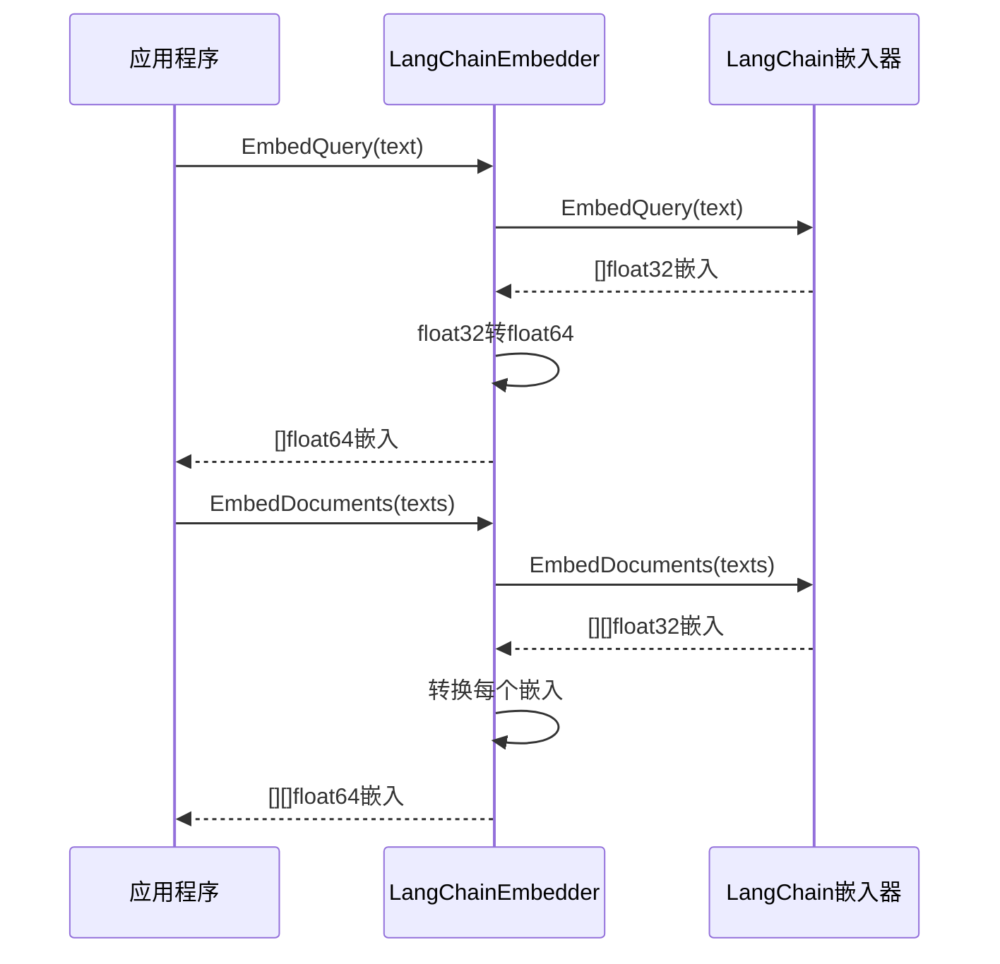

**图表来源**
- [prebuilt/rag_langchain_adapter.go](file://prebuilt/rag_langchain_adapter.go#L135-L170)

**章节来源**
- [prebuilt/rag_langchain_adapter.go](file://prebuilt/rag_langchain_adapter.go#L123-L171)

### Mock嵌入器实现

MockEmbedder为开发和测试提供了快速、确定性的替代方案：

#### 嵌入生成算法

```mermaid
flowchart TD
A[输入文本] --> B[字符编码]
B --> C[加权求和]
C --> D[Sin函数变换]
D --> E[向量归一化]
E --> F[输出嵌入向量]
subgraph "数学公式"
G[embedding[i] = sin(sum / 1000.0)]
H[norm = √(Σ(v²))]
I[embedding[i] = embedding[i] / norm]
end
D --> G
E --> H
F --> I
```

**图表来源**
- [prebuilt/rag_components.go](file://prebuilt/rag_components.go#L306-L332)

#### 特性对比

| 特性 | Mock嵌入器 | 实际嵌入器 |
|------|------------|------------|
| **速度** | 极快（本地计算） | 较慢（API调用） |
| **确定性** | 完全确定 | 取决于模型 |
| **语义质量** | 无语义意义 | 高质量语义表示 |
| **成本** | 免费 | 需要API密钥和费用 |
| **适用场景** | 开发测试 | 生产环境 |

**章节来源**
- [prebuilt/rag_components.go](file://prebuilt/rag_components.go#L280-L332)

### 向量存储与相似度搜索

#### 相似度计算

InMemoryVectorStore使用余弦相似度进行文档检索：

```mermaid
flowchart TD
A[查询文本] --> B[生成查询嵌入]
B --> C[计算与所有文档嵌入的余弦相似度]
C --> D[排序得分]
D --> E[返回Top-K结果]
subgraph "余弦相似度公式"
F[similarity = (A·B) / (||A|| × ||B||)]
end
C --> F
```

**图表来源**
- [prebuilt/rag_components.go](file://prebuilt/rag_components.go#L138-L184)

#### 搜索性能优化

```mermaid
flowchart LR
A[相似度搜索] --> B[嵌入生成]
B --> C[相似度计算]
C --> D[冒泡排序]
D --> E[Top-K筛选]
subgraph "时间复杂度"
F[O(n) 嵌入生成]
G[O(n×d) 相似度计算]
H[O(k) 结果筛选]
end
C --> G
D --> H
```

**图表来源**
- [prebuilt/rag_components.go](file://prebuilt/rag_components.go#L138-L184)

**章节来源**
- [prebuilt/rag_components.go](file://prebuilt/rag_components.go#L138-L184)

### 文档分块与预处理

#### 文本分块策略

SimpleTextSplitter提供了灵活的文档分块机制：

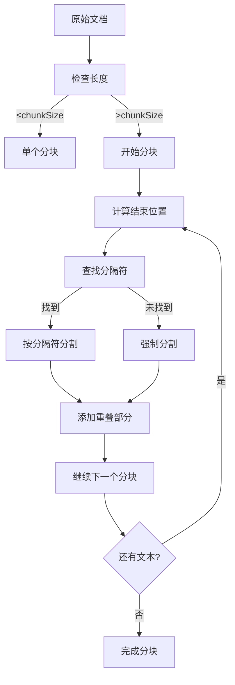

**图表来源**
- [prebuilt/rag_components.go](file://prebuilt/rag_components.go#L54-L92)

**章节来源**
- [prebuilt/rag_components.go](file://prebuilt/rag_components.go#L10-L92)

## 最佳实践

### 嵌入维度配置

不同提供商的嵌入模型具有不同的维度特征：

| 提供商 | 模型 | 维度 | 适用场景 |
|--------|------|------|----------|
| OpenAI | text-embedding-ada-002 | 1536 | 平衡质量和成本 |
| OpenAI | text-embedding-3-large | 3072 | 高质量语义搜索 |
| Cohere | embed-english-v3.0 | 1024 | 英文文本优化 |
| Cohere | embed-multilingual-v3.0 | 1024 | 多语言支持 |

### 批处理优化

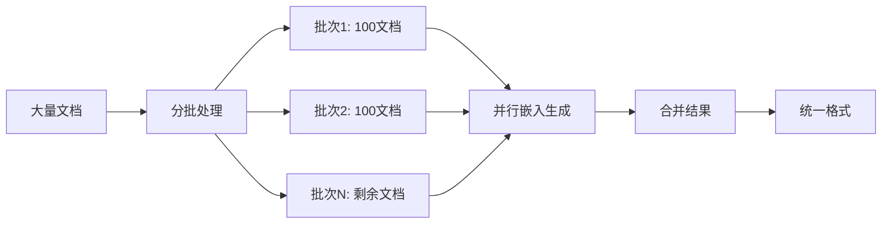

### 缓存策略

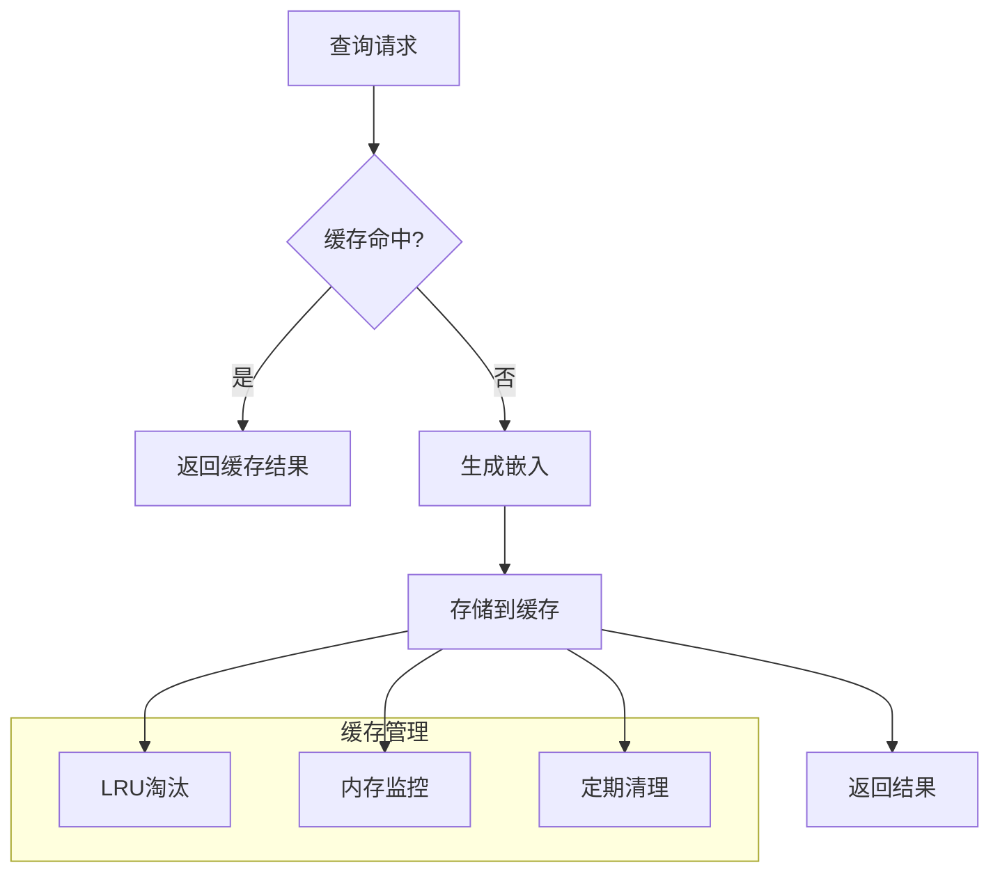

### 错误处理与重试

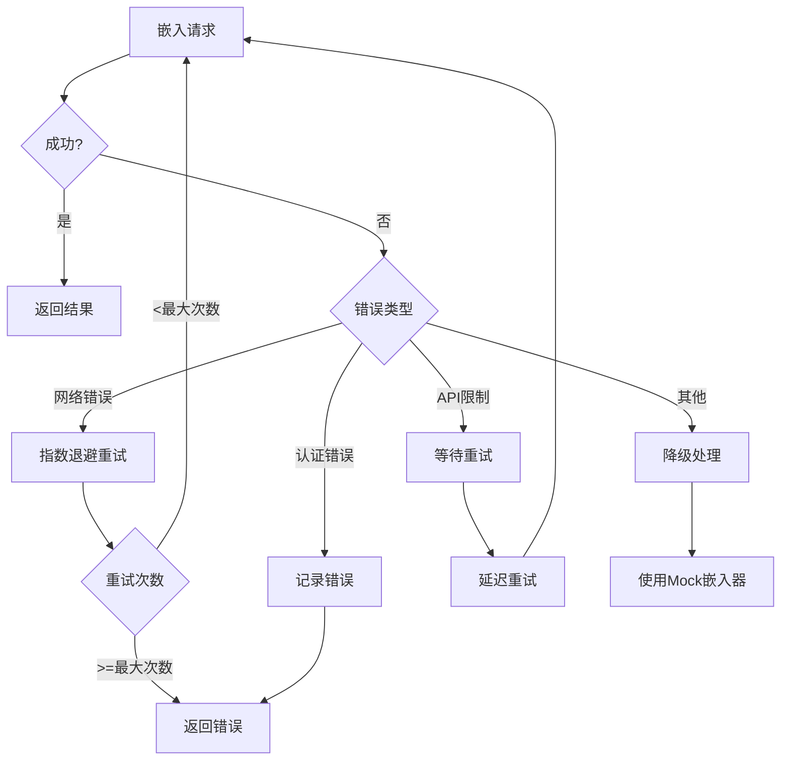

**章节来源**
- [examples/rag_with_embeddings/README.md](file://examples/rag_with_embeddings/README.md#L215-L322)

## 故障排除指南

### 常见问题诊断

#### API密钥配置

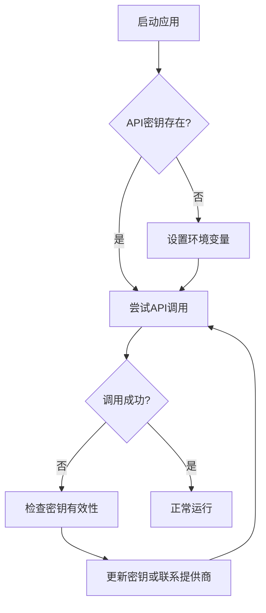

#### 维度不匹配

当向量存储维度与嵌入模型输出维度不一致时：

1. **检查模型维度**：确认使用的嵌入模型的具体维度
2. **验证向量存储配置**：确保InMemoryVectorStore初始化时使用正确的嵌入器
3. **重新生成嵌入**：删除旧的嵌入数据，使用新配置重新生成

#### 速率限制处理

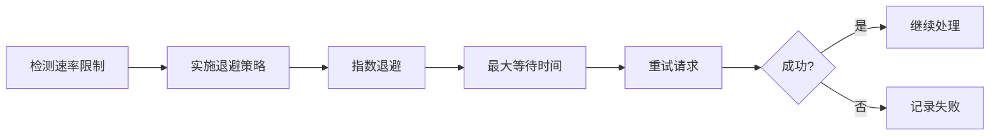

### 性能监控

#### 关键指标

| 指标 | 正常范围 | 监控方法 |
|------|----------|----------|
| 嵌入生成时间 | <100ms/文档 | 时间戳记录 |
| 相似度搜索时间 | <50ms | 性能分析器 |
| API调用成功率 | >95% | 错误计数 |
| 缓存命中率 | >80% | 缓存统计 |

**章节来源**
- [examples/rag_with_embeddings/README.md](file://examples/rag_with_embeddings/README.md#L276-L322)

## 总结

langgraphgo的嵌入模型集成方案提供了完整而灵活的解决方案，通过以下核心特性实现了高效的RAG系统：

### 技术优势

1. **统一接口设计**：Embedder接口提供了标准化的嵌入生成能力
2. **多提供商支持**：通过LangChain适配器无缝集成OpenAI、Cohere等主流提供商
3. **类型安全转换**：自动处理float32与float64之间的类型转换
4. **开发友好**：Mock嵌入器确保开发测试的便利性和一致性

### 应用场景

- **开发测试**：使用Mock嵌入器进行快速原型开发和功能测试
- **生产部署**：集成实际的嵌入模型提供商，如OpenAI、Cohere等
- **混合模式**：根据需求动态切换Mock和实际嵌入器

### 未来发展方向

1. **向量存储优化**：支持更多向量数据库后端
2. **批处理增强**：进一步优化大批量文档的处理性能
3. **缓存策略改进**：实现更智能的嵌入缓存和失效机制
4. **监控集成**：提供内置的性能监控和告警功能

该集成方案为构建高质量的RAG应用奠定了坚实的基础，既保证了开发效率，又确保了生产环境的稳定性和性能。