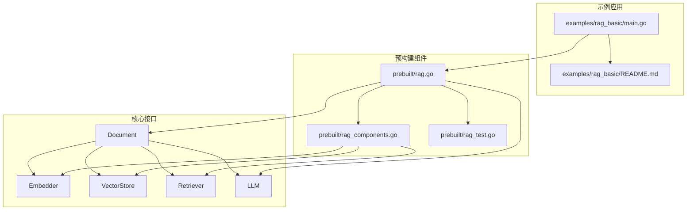
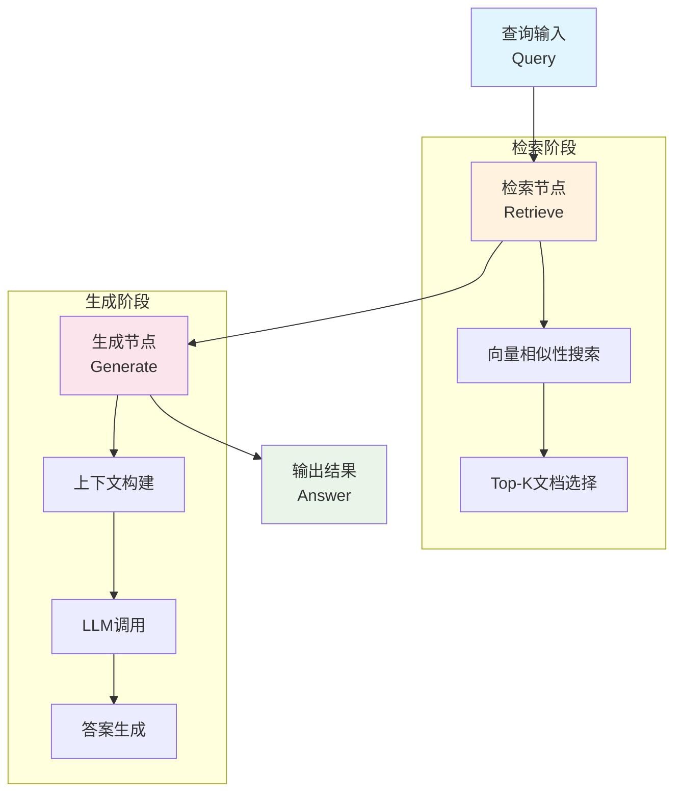
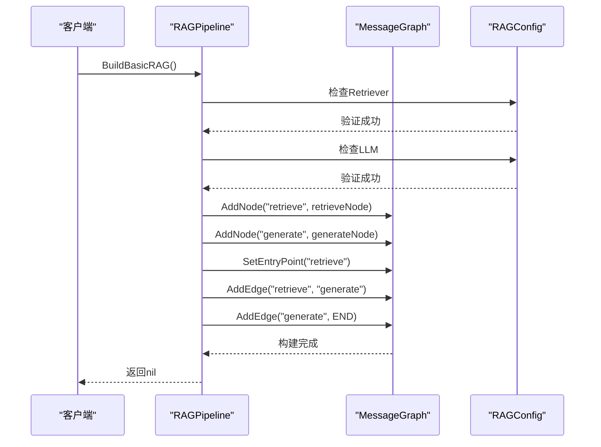
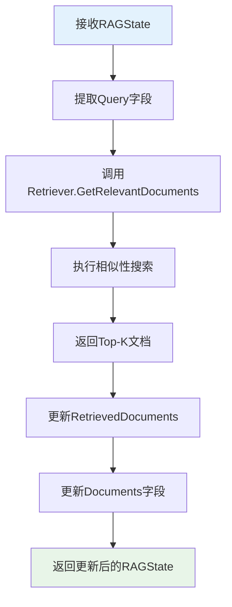
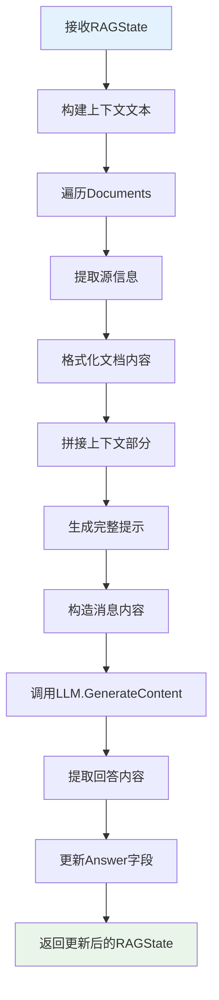
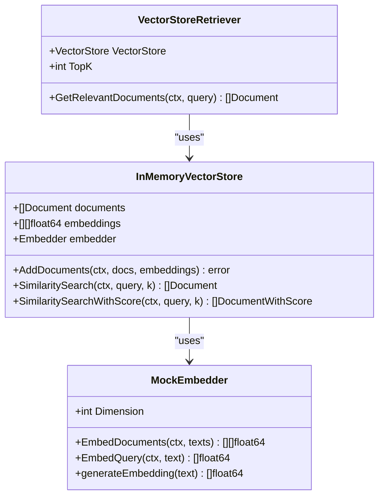
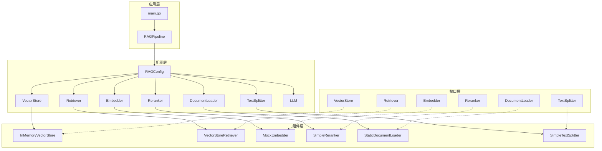

# 基础RAG实现

<cite>
**本文档中引用的文件**
- [examples/rag_basic/main.go](file://examples/rag_basic/main.go)
- [examples/rag_basic/README.md](file://examples/rag_basic/README.md)
- [prebuilt/rag.go](file://prebuilt/rag.go)
- [prebuilt/rag_components.go](file://prebuilt/rag_components.go)
- [prebuilt/rag_test.go](file://prebuilt/rag_test.go)
</cite>

## 目录
1. [简介](#简介)
2. [项目结构](#项目结构)
3. [核心组件](#核心组件)
4. [架构概览](#架构概览)
5. [详细组件分析](#详细组件分析)
6. [依赖关系分析](#依赖关系分析)
7. [性能考虑](#性能考虑)
8. [故障排除指南](#故障排除指南)
9. [结论](#结论)

## 简介

LangGraphGo的基础RAG（检索增强生成）实现提供了一个简单而强大的框架，用于构建基于文档检索的问答系统。该实现遵循经典的"检索->生成"模式，通过向量数据库存储文档嵌入，使用语义相似性进行检索，并利用大型语言模型生成准确的答案。

基础RAG是最简单的RAG实现形式，适合快速原型开发、简单的问答系统以及高质量文档集合的应用场景。它提供了清晰的架构设计和易于理解的代码结构，是学习RAG概念的理想起点。

## 项目结构

基础RAG实现的核心文件组织如下：



**图表来源**
- [examples/rag_basic/main.go](file://examples/rag_basic/main.go#L1-L155)
- [prebuilt/rag.go](file://prebuilt/rag.go#L1-L392)
- [prebuilt/rag_components.go](file://prebuilt/rag_components.go#L1-L333)

**章节来源**
- [examples/rag_basic/main.go](file://examples/rag_basic/main.go#L1-L155)
- [examples/rag_basic/README.md](file://examples/rag_basic/README.md#L1-L51)

## 核心组件

### RAGState数据结构

RAGState是贯穿整个RAG管道的状态容器，负责在各个节点之间传递数据。它包含了查询、文档、上下文和答案等关键信息：

```mermaid
classDiagram
class RAGState {
+string Query
+[]Document Documents
+[]Document RetrievedDocuments
+[]DocumentWithScore RankedDocuments
+string Context
+string Answer
+[]string Citations
+map[string]interface{} Metadata
}
class Document {
+string PageContent
+map[string]interface{} Metadata
}
class DocumentWithScore {
+Document Document
+float64 Score
}
RAGState --> Document : "contains"
RAGState --> DocumentWithScore : "contains"
```

**图表来源**
- [prebuilt/rag.go](file://prebuilt/rag.go#L58-L67)
- [prebuilt/rag.go](file://prebuilt/rag.go#L12-L16)
- [prebuilt/rag.go](file://prebuilt/rag.go#L41-L45)

### RAGConfig配置结构

RAGConfig提供了灵活的配置选项，允许用户自定义RAG系统的各个方面：

| 配置项 | 类型 | 默认值 | 描述 |
|--------|------|--------|------|
| TopK | int | 4 | 检索的文档数量 |
| ScoreThreshold | float64 | 0.7 | 最小相关性分数阈值 |
| UseReranking | bool | false | 是否使用重排序 |
| UseFallback | bool | false | 是否使用备用搜索 |
| SystemPrompt | string | 默认提示 | LLM系统提示 |
| IncludeCitations | bool | true | 是否包含引用 |
| MaxTokens | int | 1000 | 最大生成令牌数 |
| Temperature | float64 | 0.0 | 生成温度 |

**章节来源**
- [prebuilt/rag.go](file://prebuilt/rag.go#L69-L91)
- [prebuilt/rag.go](file://prebuilt/rag.go#L93-L104)

## 架构概览

基础RAG管道采用简单的线性架构，包含两个主要阶段：检索和生成。



**图表来源**
- [prebuilt/rag.go](file://prebuilt/rag.go#L125-L146)
- [prebuilt/rag.go](file://prebuilt/rag.go#L263-L275)
- [prebuilt/rag.go](file://prebuilt/rag.go#L322-L356)

## 详细组件分析

### RAGPipeline构建过程

BuildBasicRAG方法是构建基础RAG管道的核心，它验证必要的组件并设置节点连接：



**图表来源**
- [prebuilt/rag.go](file://prebuilt/rag.go#L125-L146)

#### 检索节点实现

检索节点负责从向量存储中查找与查询相关的文档：



**图表来源**
- [prebuilt/rag.go](file://prebuilt/rag.go#L263-L275)

#### 生成节点实现

生成节点将检索到的文档转换为LLM可理解的上下文，并生成最终答案：



**图表来源**
- [prebuilt/rag.go](file://prebuilt/rag.go#L322-L356)

### 向量存储和检索机制

系统使用内存向量存储来实现高效的相似性搜索：



**图表来源**
- [prebuilt/rag_components.go](file://prebuilt/rag_components.go#L94-L333)

**章节来源**
- [prebuilt/rag.go](file://prebuilt/rag.go#L125-L146)
- [prebuilt/rag.go](file://prebuilt/rag.go#L263-L356)
- [prebuilt/rag_components.go](file://prebuilt/rag_components.go#L94-L333)

## 依赖关系分析

RAG系统具有清晰的分层架构，各组件职责明确：



**图表来源**
- [prebuilt/rag.go](file://prebuilt/rag.go#L1-L392)
- [prebuilt/rag_components.go](file://prebuilt/rag_components.go#L1-L333)

**章节来源**
- [prebuilt/rag.go](file://prebuilt/rag.go#L1-L392)
- [prebuilt/rag_components.go](file://prebuilt/rag_components.go#L1-L333)

## 性能考虑

### 向量相似性计算优化

系统使用余弦相似度计算文档间的相似性，这是一种高效且广泛使用的度量方法。对于大规模文档集合，可以考虑以下优化策略：

- **批量处理**: 一次性处理多个查询的嵌入计算
- **索引优化**: 实现更高效的向量索引结构
- **缓存机制**: 缓存常用查询的相似性结果

### 内存使用优化

内存向量存储适合小到中等规模的数据集。对于大规模部署，建议：

- 使用持久化向量存储（如Chroma、Weaviate）
- 实现分页加载机制
- 考虑内存映射文件技术

### LLM调用优化

- 设置合理的最大令牌数限制
- 使用流式响应减少延迟
- 实现请求队列和限流机制

## 故障排除指南

### 常见配置错误

#### 1. 缺少必需组件

**问题**: `retriever is required for basic RAG`
**原因**: 未设置Retriever组件
**解决方案**: 在配置中提供有效的VectorStoreRetriever实例

**代码路径**: [prebuilt/rag.go](file://prebuilt/rag.go#L127-L129)

#### 2. LLM未正确配置

**问题**: `LLM is required for basic RAG`
**原因**: 未设置LLM组件或配置错误
**解决方案**: 提供有效的llms.Model实例

**代码路径**: [prebuilt/rag.go](file://prebuilt/rag.go#L130-L132)

#### 3. 向量存储为空

**问题**: `no documents in vector store`
**原因**: 向量存储中没有添加任何文档
**解决方案**: 确保在向量存储中添加了至少一个文档

**代码路径**: [prebuilt/rag_components.go](file://prebuilt/rag_components.go#L139-L141)

### 运行时错误处理

#### 1. 嵌入生成失败

**错误类型**: `Failed to generate embeddings`
**可能原因**: 文本编码问题或嵌入模型配置错误
**解决方案**: 检查输入文本格式和嵌入模型设置

#### 2. 相似性搜索超时

**错误类型**: `SimilaritySearch timeout`
**可能原因**: 大量文档导致搜索时间过长
**解决方案**: 减少TopK值或优化向量存储结构

#### 3. LLM响应失败

**错误类型**: `generation failed`
**可能原因**: API密钥无效、网络问题或模型不可用
**解决方案**: 验证LLM配置和网络连接

**章节来源**
- [prebuilt/rag.go](file://prebuilt/rag.go#L127-L132)
- [prebuilt/rag_components.go](file://prebuilt/rag_components.go#L139-L141)
- [examples/rag_basic/main.go](file://examples/rag_basic/main.go#L74-L81)

## 结论

LangGraphGo的基础RAG实现提供了一个简洁而功能完整的框架，用于构建基于文档检索的问答系统。其主要优势包括：

### 设计优势

1. **模块化架构**: 清晰的组件分离使得系统易于理解和扩展
2. **类型安全**: 强类型的RAGState确保数据完整性
3. **灵活配置**: 丰富的配置选项满足不同应用场景需求
4. **测试友好**: 完善的测试覆盖和模拟组件支持

### 应用场景

- **知识库问答**: 构建企业内部知识管理系统
- **文档检索**: 快速查找相关文档内容
- **智能客服**: 基于产品文档的自动回答
- **学术研究**: 文献检索和摘要生成

### 扩展建议

对于生产环境部署，建议考虑以下扩展：

1. **持久化存储**: 使用外部向量数据库替代内存存储
2. **分布式架构**: 支持多节点部署和负载均衡
3. **监控告警**: 实现性能监控和异常告警机制
4. **版本控制**: 对文档和配置进行版本管理

基础RAG实现为开发者提供了一个良好的起点，通过理解其架构和工作原理，可以为进一步的功能扩展和优化奠定坚实基础。