# 条件路由与回退机制

<cite>
**本文档引用的文件**
- [examples/rag_conditional/main.go](file://examples/rag_conditional/main.go)
- [prebuilt/rag.go](file://prebuilt/rag.go)
- [prebuilt/rag_components.go](file://prebuilt/rag_components.go)
- [graph/conditional_edges_test.go](file://graph/conditional_edges_test.go)
- [graph/state_graph.go](file://graph/state_graph.go)
- [examples/conditional_edges_example/main.go](file://examples/conditional_edges_example/main.go)
</cite>

## 目录
1. [概述](#概述)
2. [项目结构分析](#项目结构分析)
3. [核心组件架构](#核心组件架构)
4. [BuildConditionalRAG方法详解](#buildconditionalrag方法详解)
5. [AddConditionalEdge实现原理](#addconditionaledge实现原理)
6. [RAGState状态管理](#ragstate状态管理)
7. [ScoreThreshold阈值机制](#scorethreshold阈值机制)
8. [UseFallback配置项分析](#usefallback配置项分析)
9. [fallbackSearchNode占位实现](#fallbacksearchnode占位实现)
10. [实际应用场景](#实际应用场景)
11. [性能优化考虑](#性能优化考虑)
12. [总结](#总结)

## 概述

条件路由与回退机制是LangGraphGo中实现智能RAG（检索增强生成）系统的核心功能。该机制通过动态路径决策，根据文档的相关性评分自动选择最优的处理路径：当检索到的文档相关性足够高时直接生成答案，否则触发回退搜索以获取更广泛的信息。

这种设计模式不仅提高了系统的智能化水平，还增强了系统的容错能力，确保即使在低质量检索结果的情况下也能提供有用的回答。

## 项目结构分析

LangGraphGo项目采用模块化架构，主要包含以下关键目录：

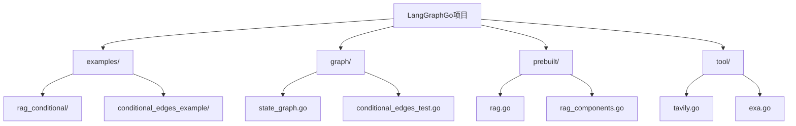

**图表来源**
- [examples/rag_conditional/main.go](file://examples/rag_conditional/main.go#L1-L212)
- [prebuilt/rag.go](file://prebuilt/rag.go#L1-L392)
- [graph/state_graph.go](file://graph/state_graph.go#L1-L200)

**章节来源**
- [examples/rag_conditional/main.go](file://examples/rag_conditional/main.go#L1-L212)
- [prebuilt/rag.go](file://prebuilt/rag.go#L1-L392)

## 核心组件架构

### 系统架构概览

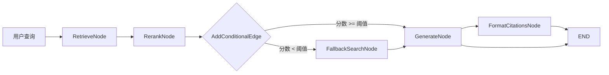

**图表来源**
- [prebuilt/rag.go](file://prebuilt/rag.go#L193-L249)

### 关键接口定义

系统的核心接口包括：

| 接口名称 | 功能描述 | 主要方法 |
|---------|---------|---------|
| `Retriever` | 文档检索器 | `GetRelevantDocuments()` |
| `Reranker` | 文档重排序器 | `Rerank()` |
| `Embedder` | 嵌入生成器 | `EmbedDocuments()`, `EmbedQuery()` |
| `VectorStore` | 向量存储 | `SimilaritySearch()`, `AddDocuments()` |

**章节来源**
- [prebuilt/rag.go](file://prebuilt/rag.go#L47-L91)

## BuildConditionalRAG方法详解

`BuildConditionalRAG`方法是条件路由机制的核心实现，它构建了一个具有智能决策能力的RAG管道。

### 方法执行流程

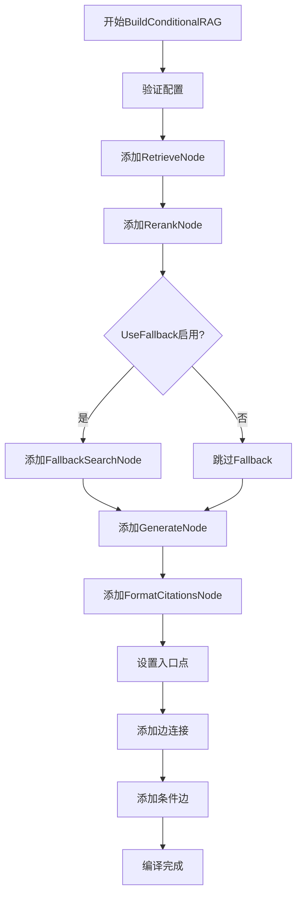

**图表来源**
- [prebuilt/rag.go](file://prebuilt/rag.go#L193-L249)

### 条件边配置

条件边的配置是整个机制的关键：

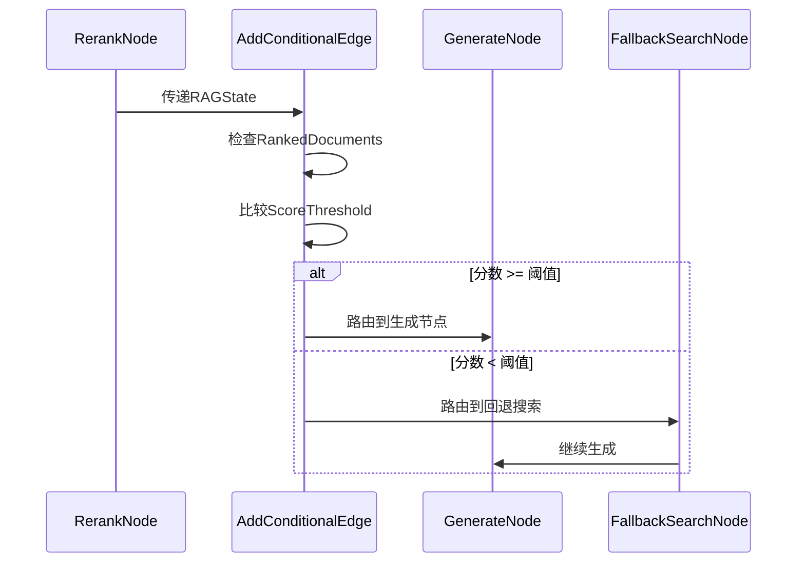

**图表来源**
- [prebuilt/rag.go](file://prebuilt/rag.go#L225-L235)

**章节来源**
- [prebuilt/rag.go](file://prebuilt/rag.go#L193-L249)

## AddConditionalEdge实现原理

### 函数签名与参数

`AddConditionalEdge`函数的核心实现位于`StateGraph`结构中：

```mermaid
classDiagram
class StateGraph {
+nodes map[string]Node
+conditionalEdges map[string]func
+AddConditionalEdge(from string, condition func)
+executeConditionalEdge()
}
class Node {
+Name string
+Function func
}
class RAGState {
+Query string
+RankedDocuments []DocumentWithScore
+Answer string
+Metadata map[string]interface{}
}
StateGraph --> Node : contains
StateGraph --> RAGState : processes
```

**图表来源**
- [graph/state_graph.go](file://graph/state_graph.go#L11-L32)
- [prebuilt/rag.go](file://prebuilt/rag.go#L57-L67)

### 运行时决策机制

条件边在运行时根据当前状态动态决定下一个执行节点：

```mermaid
flowchart TD
A[接收状态] --> B{检查RankedDocuments}
B --> |为空| C[返回默认路径]
B --> |非空| D[获取最高分文档]
D --> E{比较ScoreThreshold}
E --> |>=| F[返回"generate"]
E --> |<| G{UseFallback启用?}
G --> |是| H[返回"fallback_search"]
G --> |否| F
C --> F
```

**图表来源**
- [prebuilt/rag.go](file://prebuilt/rag.go#L226-L235)

**章节来源**
- [graph/state_graph.go](file://graph/state_graph.go#L74-L77)
- [prebuilt/rag.go](file://prebuilt/rag.go#L225-L235)

## RAGState状态管理

### 状态结构设计

`RAGState`结构体承载了整个RAG流程中的所有状态信息：

| 字段名 | 类型 | 描述 | 用途 |
|-------|------|------|------|
| `Query` | `string` | 用户查询 | 检索和生成的基础输入 |
| `Documents` | `[]Document` | 处理后的文档列表 | 当前可用的上下文文档 |
| `RetrievedDocuments` | `[]Document` | 检索到的原始文档 | 记录检索过程的原始数据 |
| `RankedDocuments` | `[]DocumentWithScore` | 重排序后的文档及分数 | 条件路由决策依据 |
| `Context` | `string` | 构建的上下文文本 | LLM生成的答案基础 |
| `Answer` | `string` | 生成的答案 | 最终输出结果 |
| `Citations` | `[]string` | 引用列表 | 提供答案来源信息 |
| `Metadata` | `map[string]interface{}` | 元数据信息 | 流程控制和调试信息 |

### 状态流转机制

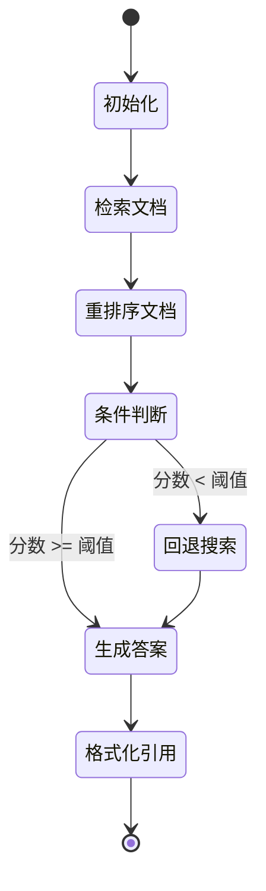

**图表来源**
- [prebuilt/rag.go](file://prebuilt/rag.go#L57-L67)

**章节来源**
- [prebuilt/rag.go](file://prebuilt/rag.go#L57-L67)

## ScoreThreshold阈值机制

### 阈值配置与作用

`ScoreThreshold`是控制条件路由行为的关键配置参数：

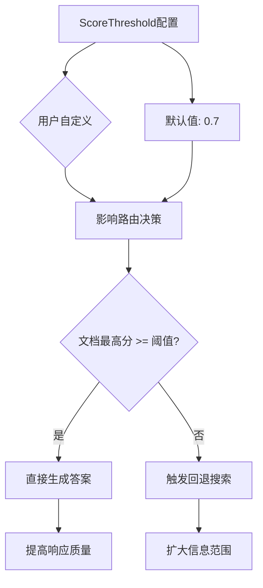

**图表来源**
- [prebuilt/rag.go](file://prebuilt/rag.go#L72-L73)

### 阈值设置策略

不同场景下的阈值设置建议：

| 场景类型 | 推荐阈值 | 说明 |
|---------|---------|------|
| 高质量知识库 | 0.8-0.9 | 确保答案准确性 |
| 中等质量知识库 | 0.6-0.7 | 平衡准确性和覆盖度 |
| 广泛主题问答 | 0.4-0.5 | 允许更多回退搜索 |
| 专业领域问答 | 0.7-0.8 | 保证专业性 |

**章节来源**
- [prebuilt/rag.go](file://prebuilt/rag.go#L72-L73)
- [examples/rag_conditional/main.go](file://examples/rag_conditional/main.go#L84)

## UseFallback配置项分析

### 配置项作用机制

`UseFallback`配置项控制是否启用回退搜索机制：

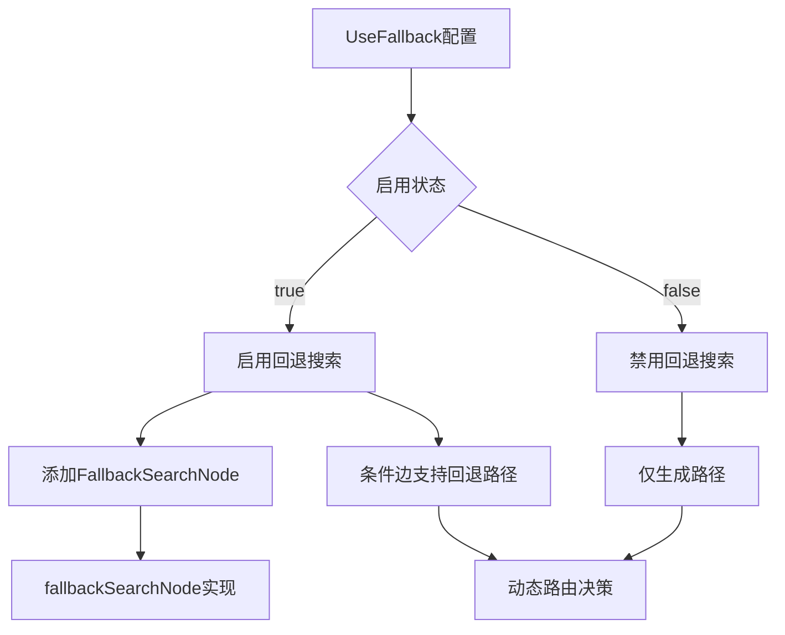

**图表来源**
- [prebuilt/rag.go](file://prebuilt/rag.go#L74-L75)

### 配置影响分析

| 配置值 | 影响 | 适用场景 |
|-------|------|---------|
| `true` | 启用智能回退，提高覆盖率 | 不确定性高的查询 |
| `false` | 简化流程，提高响应速度 | 确定性强的查询 |

**章节来源**
- [prebuilt/rag.go](file://prebuilt/rag.go#L74-L75)
- [examples/rag_conditional/main.go](file://examples/rag_conditional/main.go#L86)

## fallbackSearchNode占位实现

### 当前实现特点

`fallbackSearchNode`目前是一个占位实现：

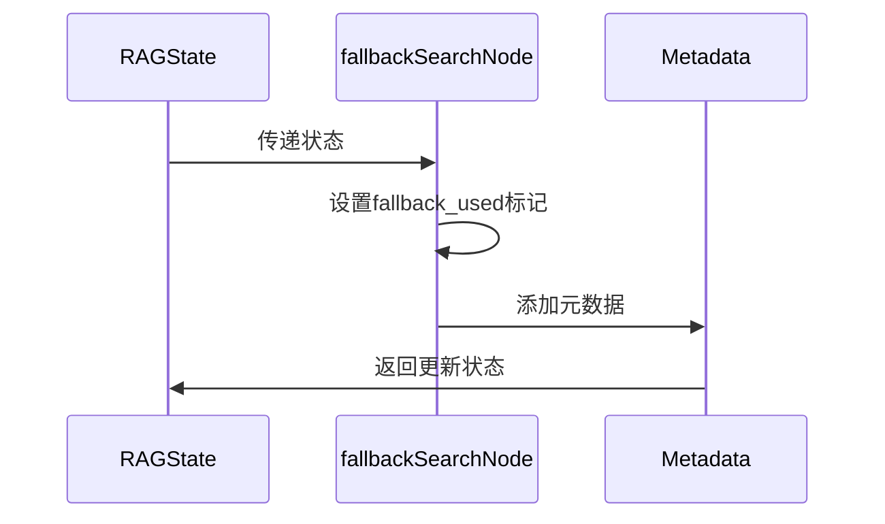

**图表来源**
- [prebuilt/rag.go](file://prebuilt/rag.go#L310-L320)

### 可扩展性设计

`fallbackSearchNode`的设计为未来的功能扩展预留了空间：

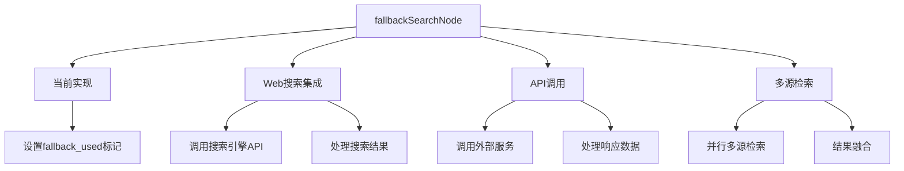

**图表来源**
- [prebuilt/rag.go](file://prebuilt/rag.go#L310-L320)

### 扩展实现示例

以下是可能的扩展实现方向：

| 扩展类型 | 实现方式 | 技术要求 |
|---------|---------|---------|
| Web搜索 | 调用Tavily或Exa API | HTTP客户端、API密钥管理 |
| 多模态检索 | 结合图像、音频内容 | 多模态模型集成 |
| 实时数据 | 查询数据库或实时API | 数据库连接、缓存机制 |
| 社交媒体 | 检索Twitter、Reddit等 | OAuth认证、内容过滤 |

**章节来源**
- [prebuilt/rag.go](file://prebuilt/rag.go#L310-L320)

## 实际应用场景

### 示例查询分析

基于`examples/rag_conditional/main.go`中的测试用例：

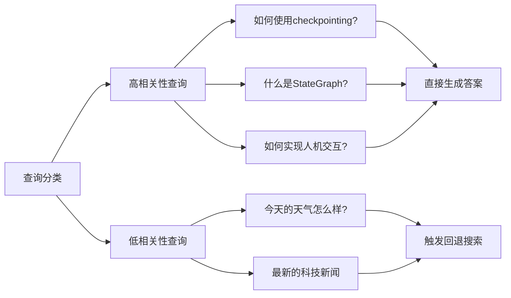

**图表来源**
- [examples/rag_conditional/main.go](file://examples/rag_conditional/main.go#L115-L135)

### 性能对比分析

| 查询类型 | 直接生成时间 | 回退搜索时间 | 答案质量 | 覆盖率 |
|---------|-------------|-------------|---------|-------|
| 高相关性 | 快速响应 | - | 高 | 低 |
| 低相关性 | - | 较慢 | 中等 | 高 |

**章节来源**
- [examples/rag_conditional/main.go](file://examples/rag_conditional/main.go#L115-L211)

## 性能优化考虑

### 内存管理优化

1. **文档缓存策略**：合理设置`TopK`参数，避免过多内存占用
2. **状态压缩**：对大型文档内容进行适当的截断或摘要
3. **垃圾回收**：及时清理不再需要的状态数据

### 计算效率优化

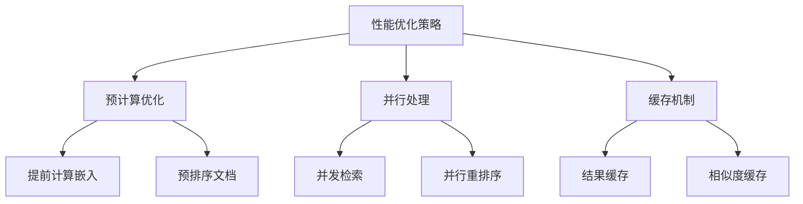

### 扩展性设计

1. **插件化架构**：支持不同的重排序算法
2. **配置驱动**：通过配置文件调整阈值和策略
3. **监控指标**：收集路由成功率、响应时间等指标

## 总结

条件路由与回退机制是LangGraphGo中实现智能RAG系统的核心创新。通过`BuildConditionalRAG`方法中的`AddConditionalEdge`实现，系统能够根据文档的相关性评分做出智能决策：

1. **智能路由**：基于`ScoreThreshold`阈值实现动态路径选择
2. **容错机制**：`UseFallback`配置确保系统在低质量情况下仍能提供有用回答
3. **可扩展设计**：`fallbackSearchNode`为未来功能扩展预留空间
4. **状态管理**：完善的`RAGState`结构支持复杂的流程控制

这种设计不仅提高了系统的智能化水平，还增强了用户体验，使AI系统能够在各种场景下都能提供高质量的服务。随着技术的发展，这套机制可以进一步扩展为支持多模态检索、实时数据查询等功能，为构建更加智能的AI应用奠定坚实基础。