# 高级RAG模式

<cite>
**本文档中引用的文件**
- [examples/rag_advanced/main.go](file://examples/rag_advanced/main.go)
- [examples/rag_conditional/main.go](file://examples/rag_conditional/main.go)
- [prebuilt/rag.go](file://prebuilt/rag.go)
- [prebuilt/rag_components.go](file://prebuilt/rag_components.go)
- [examples/rag_advanced/README.md](file://examples/rag_advanced/README.md)
- [examples/rag_conditional/README.md](file://examples/rag_conditional/README.md)
- [graph/graph.go](file://graph/graph.go)
- [graph/conditional_edges_test.go](file://graph/conditional_edges_test.go)
</cite>

## 目录
1. [简介](#简介)
2. [项目结构概览](#项目结构概览)
3. [核心组件分析](#核心组件分析)
4. [架构概览](#架构概览)
5. [详细组件分析](#详细组件分析)
6. [高级配置参数](#高级配置参数)
7. [条件路由策略](#条件路由策略)
8. [检索后重排序机制](#检索后重排序机制)
9. [答案生成与引用标注](#答案生成与引用标注)
10. [性能考虑](#性能考虑)
11. [故障排除指南](#故障排除指南)
12. [结论](#结论)

## 简介

LangGraphGo的高级RAG（检索增强生成）模式提供了两种先进的检索增强生成策略：`rag_advanced`中的检索后重排序机制和`rag_conditional`中的条件路由策略。这些模式通过复杂的图结构实现了智能化的文档检索和答案生成流程，能够根据文档相关性分数动态调整处理策略，提供更准确、更可靠的问答服务。

高级RAG模式的核心优势在于：
- **智能文档评分**：通过重排序机制提高检索质量
- **动态路由决策**：基于相关性阈值选择最优处理路径
- **多源知识融合**：支持向量检索与传统搜索的结合
- **透明度和可追溯性**：完整的引用标注和处理记录

## 项目结构概览

高级RAG模式在LangGraphGo项目中的组织结构体现了清晰的分层设计：


**图表来源**
- [examples/rag_advanced/main.go](file://examples/rag_advanced/main.go#L1-L223)
- [examples/rag_conditional/main.go](file://examples/rag_conditional/main.go#L1-L212)
- [prebuilt/rag.go](file://prebuilt/rag.go#L1-L392)

**章节来源**
- [examples/rag_advanced/main.go](file://examples/rag_advanced/main.go#L1-L50)
- [examples/rag_conditional/main.go](file://examples/rag_conditional/main.go#L1-L50)

## 核心组件分析

### RAG管道架构

高级RAG模式的核心是`RAGPipeline`结构体，它封装了整个检索增强生成的工作流程：

```mermaid
classDiagram
class RAGPipeline {
+config *RAGConfig
+graph *MessageGraph
+BuildAdvancedRAG() error
+BuildConditionalRAG() error
+Compile() (*Runnable, error)
+GetGraph() *MessageGraph
}
class RAGConfig {
+TopK int
+ScoreThreshold float64
+UseReranking bool
+UseFallback bool
+SystemPrompt string
+IncludeCitations bool
+Retriever Retriever
+Reranker Reranker
+LLM llms.Model
}
class RAGState {
+Query string
+Documents []Document
+RetrievedDocuments []Document
+RankedDocuments []DocumentWithScore
+Context string
+Answer string
+Citations []string
+Metadata map[string]interface{}
}
RAGPipeline --> RAGConfig : "配置"
RAGPipeline --> RAGState : "状态管理"
```

**图表来源**
- [prebuilt/rag.go](file://prebuilt/rag.go#L108-L123)
- [prebuilt/rag.go](file://prebuilt/rag.go#L69-L91)
- [prebuilt/rag.go](file://prebuilt/rag.go#L58-L67)

### 图结构节点

高级RAG模式使用图结构来表示复杂的处理流程，每个节点代表一个特定的功能模块：


**图表来源**
- [prebuilt/rag.go](file://prebuilt/rag.go#L148-L191)
- [prebuilt/rag.go](file://prebuilt/rag.go#L193-L248)

**章节来源**
- [prebuilt/rag.go](file://prebuilt/rag.go#L108-L123)
- [prebuilt/rag.go](file://prebuilt/rag.go#L148-L248)

## 架构概览

### 高级RAG架构

高级RAG模式采用三阶段处理流程，专注于通过重排序提升检索质量：


**图表来源**
- [examples/rag_advanced/main.go](file://examples/rag_advanced/main.go#L139-L144)
- [prebuilt/rag.go](file://prebuilt/rag.go#L263-L372)

### 条件RAG架构

条件RAG模式引入了智能路由机制，根据文档相关性分数动态选择处理路径：


**图表来源**
- [examples/rag_conditional/main.go](file://examples/rag_conditional/main.go#L79-L91)
- [prebuilt/rag.go](file://prebuilt/rag.go#L225-L235)

**章节来源**
- [examples/rag_advanced/main.go](file://examples/rag_advanced/main.go#L139-L144)
- [examples/rag_conditional/main.go](file://examples/rag_conditional/main.go#L79-L91)

## 详细组件分析

### BuildAdvancedRAG方法实现

`BuildAdvancedRAG`方法构建了一个包含重排序功能的高级RAG管道：


**图表来源**
- [prebuilt/rag.go](file://prebuilt/rag.go#L148-L191)

关键特性：
- **条件重排序**：只有当`UseReranking=true`且存在`Reranker`时才添加重排序节点
- **可选引用标注**：通过`IncludeCitations`控制是否添加引用格式化步骤
- **灵活的边连接**：根据配置动态调整节点间的连接关系

### BuildConditionalRAG方法实现

`BuildConditionalRAG`方法实现了基于相关性分数的智能路由：


**图表来源**
- [prebuilt/rag.go](file://prebuilt/rag.go#L193-L248)

**章节来源**
- [prebuilt/rag.go](file://prebuilt/rag.go#L148-L191)
- [prebuilt/rag.go](file://prebuilt/rag.go#L193-L248)

## 高级配置参数

### RAGConfig中的关键参数

高级RAG模式通过`RAGConfig`结构体提供了丰富的配置选项：

| 参数名称 | 类型 | 默认值 | 描述 |
|---------|------|--------|------|
| `TopK` | int | 4 | 检索的文档数量 |
| `ScoreThreshold` | float64 | 0.7 | 相关性阈值，用于条件路由 |
| `UseReranking` | bool | false | 是否启用重排序机制 |
| `UseFallback` | bool | false | 是否启用备用搜索 |
| `IncludeCitations` | bool | true | 是否包含引用标注 |
| `SystemPrompt` | string | 标准提示 | 系统提示词 |
| `MaxTokens` | int | 1000 | 生成的最大令牌数 |
| `Temperature` | float64 | 0.0 | 生成温度 |

### ScoreThreshold参数详解

`ScoreThreshold`是条件RAG模式的核心参数，决定了文档相关性的判断标准：


**图表来源**
- [examples/rag_conditional/main.go](file://examples/rag_conditional/main.go#L84)
- [prebuilt/rag.go](file://prebuilt/rag.go#L228)

### UseReranking参数详解

`UseReranking`控制是否启用重排序机制，影响检索质量：

- **true**：启用重排序，提高检索准确性
- **false**：跳过重排序，保持原始检索顺序

**章节来源**
- [prebuilt/rag.go](file://prebuilt/rag.go#L69-L91)
- [examples/rag_conditional/main.go](file://examples/rag_conditional/main.go#L84)

## 条件路由策略

### 条件边的实现原理

条件边是高级RAG模式的核心创新，它允许根据运行时状态动态选择执行路径：


**图表来源**
- [prebuilt/rag.go](file://prebuilt/rag.go#L225-L235)
- [graph/graph.go](file://graph/graph.go#L119-L123)

### 条件路由逻辑

条件路由的核心逻辑基于相关性分数判断：

```go
// 条件路由函数示例
func(ctx context.Context, state interface{}) string {
    ragState := state.(RAGState)
    if len(ragState.RankedDocuments) > 0 && 
       ragState.RankedDocuments[0].Score >= p.config.ScoreThreshold {
        return "generate"  // 高相关性，直接生成
    }
    if p.config.UseFallback {
        return "fallback_search"  // 低相关性，触发备用搜索
    }
    return "generate"  // 无备用搜索，直接生成
}
```

### 动态路由的优势

条件路由策略提供了以下优势：

1. **智能决策**：根据文档质量自动选择最佳处理路径
2. **资源优化**：避免对低质量文档进行昂贵的生成过程
3. **质量保证**：确保只有相关文档才会触发答案生成
4. **容错能力**：为低质量检索提供备选方案

**章节来源**
- [prebuilt/rag.go](file://prebuilt/rag.go#L225-L235)
- [examples/rag_conditional/main.go](file://examples/rag_conditional/main.go#L110-L113)

## 检索后重排序机制

### 重排序算法实现

高级RAG模式中的重排序机制通过`SimpleReranker`实现，采用关键词匹配评分：


**图表来源**
- [prebuilt/rag_components.go](file://prebuilt/rag_components.go#L216-L261)

### 重排序评分公式

重排序采用简单的关键词匹配算法：

```
score = (关键词出现次数 / 文档长度) × 1000
```

这种设计的优点：
- **简单高效**：计算复杂度低，适合实时应用
- **语义相关**：基于关键词匹配捕捉语义相似性
- **可扩展性**：可以替换为更复杂的交叉编码器模型

### 重排序对系统性能的影响

重排序机制对系统性能有以下影响：

| 方面 | 影响 | 说明 |
|------|------|------|
| 检索质量 | 显著提升 | 通过重新评分提高相关文档的排名 |
| 计算开销 | 中等增加 | 需要额外的评分计算 |
| 响应时间 | 略有延迟 | 重排序增加了处理步骤 |
| 内存使用 | 轻微增加 | 需要存储中间评分结果 |

**章节来源**
- [prebuilt/rag_components.go](file://prebuilt/rag_components.go#L216-L261)
- [prebuilt/rag.go](file://prebuilt/rag.go#L277-L308)

## 答案生成与引用标注

### 答案生成流程

答案生成是RAG管道的核心环节，负责将检索到的上下文信息转换为自然语言回答：

```mermaid
sequenceDiagram
participant Pipeline as RAG管道
participant ContextBuilder as 上下文构建器
participant LLM as 语言模型
participant PromptBuilder as 提示构建器
Pipeline->>ContextBuilder : 构建上下文
ContextBuilder->>ContextBuilder : 格式化文档内容
ContextBuilder->>ContextBuilder : 添加元数据信息
ContextBuilder-->>Pipeline : 返回格式化上下文
Pipeline->>PromptBuilder : 构建完整提示
PromptBuilder->>PromptBuilder : 组装系统提示
PromptBuilder->>PromptBuilder : 添加用户问题
PromptBuilder-->>Pipeline : 返回完整提示
Pipeline->>LLM : 发送生成请求
LLM-->>Pipeline : 返回生成的回答
```



**图表来源**
- [prebuilt/rag.go](file://prebuilt/rag.go#L322-L355)

### 引用标注机制

引用标注确保答案的可追溯性和可信度：


**图表来源**
- [prebuilt/rag.go](file://prebuilt/rag.go#L357-L372)

### 引用格式规范

引用标注遵循标准化格式：

```
[1] langgraph_checkpointing.txt
[2] langgraph_stategraph.txt
[3] langgraph_hitl.txt
```

这种格式提供了：
- **唯一标识**：每个引用都有唯一的数字标识
- **来源追踪**：明确显示信息来源
- **可读性强**：简洁明了的格式便于阅读
- **可扩展性**：支持任意数量的引用

**章节来源**
- [prebuilt/rag.go](file://prebuilt/rag.go#L322-L372)

## 性能考虑

### 计算复杂度分析

高级RAG模式的性能特征如下：

| 组件 | 时间复杂度 | 空间复杂度 | 优化建议 |
|------|------------|------------|----------|
| 文档检索 | O(log N) | O(k) | 使用高效的向量数据库 |
| 重排序 | O(d × w) | O(d) | d=文档数，w=平均词数 |
| 语言模型生成 | O(t × v) | O(t) | t=生成令牌数，v=词汇表大小 |
| 引用标注 | O(d) | O(d) | d=文档数 |

### 内存优化策略

1. **流式处理**：对大型文档集合采用流式处理
2. **缓存机制**：缓存频繁访问的嵌入向量
3. **批量操作**：合并多个小操作为批量操作
4. **及时释放**：处理完成后及时释放临时内存

### 并发处理能力

高级RAG模式支持并发处理多个查询：


## 故障排除指南

### 常见问题及解决方案

#### 1. 相关性分数异常

**问题描述**：重排序后的文档相关性分数不符合预期

**解决方案**：
- 检查`ScoreThreshold`设置是否合理
- 验证重排序算法的输入数据质量
- 调整相关性评分权重

#### 2. 备用搜索未触发

**问题描述**：即使文档相关性低，也未触发备用搜索

**解决方案**：
- 确认`UseFallback`配置为true
- 检查备用搜索节点是否正确添加
- 验证条件路由逻辑

#### 3. 引用标注缺失

**问题描述**：生成的答案缺少引用标注

**解决方案**：
- 确认`IncludeCitations`配置为true
- 检查文档元数据是否包含源信息
- 验证引用格式化节点是否正常工作

### 调试技巧

1. **状态监控**：跟踪`RAGState`中的各个字段变化
2. **日志记录**：添加详细的调试日志
3. **可视化工具**：使用图可视化工具查看执行流程
4. **单元测试**：为关键组件编写单元测试

**章节来源**
- [examples/rag_conditional/main.go](file://examples/rag_conditional/main.go#L174-L181)
- [prebuilt/rag.go](file://prebuilt/rag.go#L310-L319)

## 结论

LangGraphGo的高级RAG模式通过创新的图结构设计和智能路由策略，为检索增强生成任务提供了强大而灵活的解决方案。主要优势包括：

### 技术创新点

1. **条件路由机制**：基于文档相关性分数的智能决策
2. **重排序优化**：通过重新评分提升检索质量
3. **图结构抽象**：灵活的节点和边设计支持复杂业务逻辑
4. **模块化架构**：清晰的组件分离便于维护和扩展

### 应用价值

- **生产就绪**：经过充分测试，适合实际应用场景
- **高度可配置**：丰富的配置选项满足不同需求
- **性能优化**：平衡了质量和效率的权衡
- **可扩展性**：良好的架构支持功能扩展

### 未来发展方向

1. **更智能的重排序**：集成交叉编码器等先进模型
2. **多模态支持**：扩展到文本以外的其他数据类型
3. **自适应学习**：基于用户反馈自动优化参数
4. **分布式部署**：支持大规模分布式部署

高级RAG模式代表了当前检索增强生成技术的发展方向，通过结合传统信息检索技术和现代大语言模型，为构建高质量的问答系统提供了坚实的技术基础。