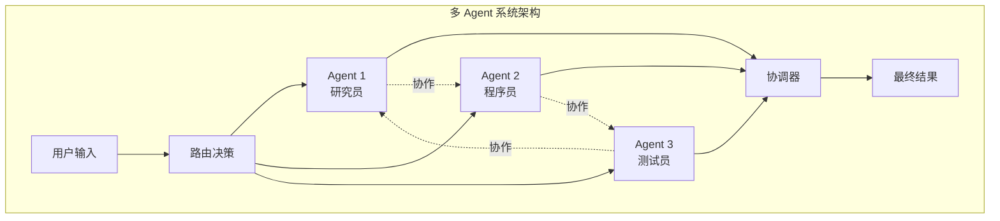
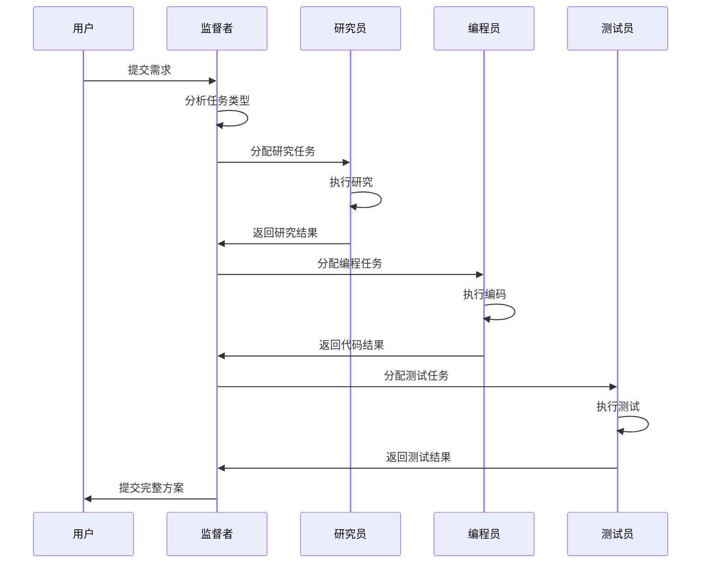
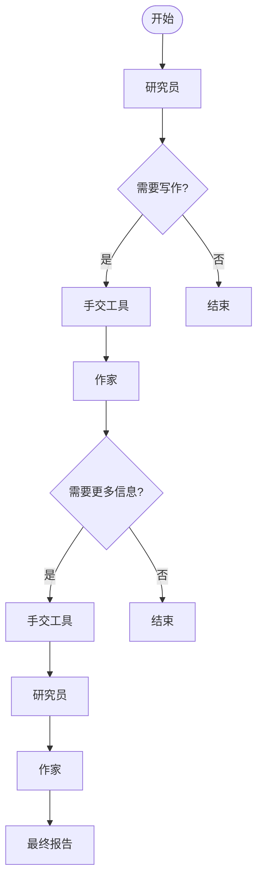
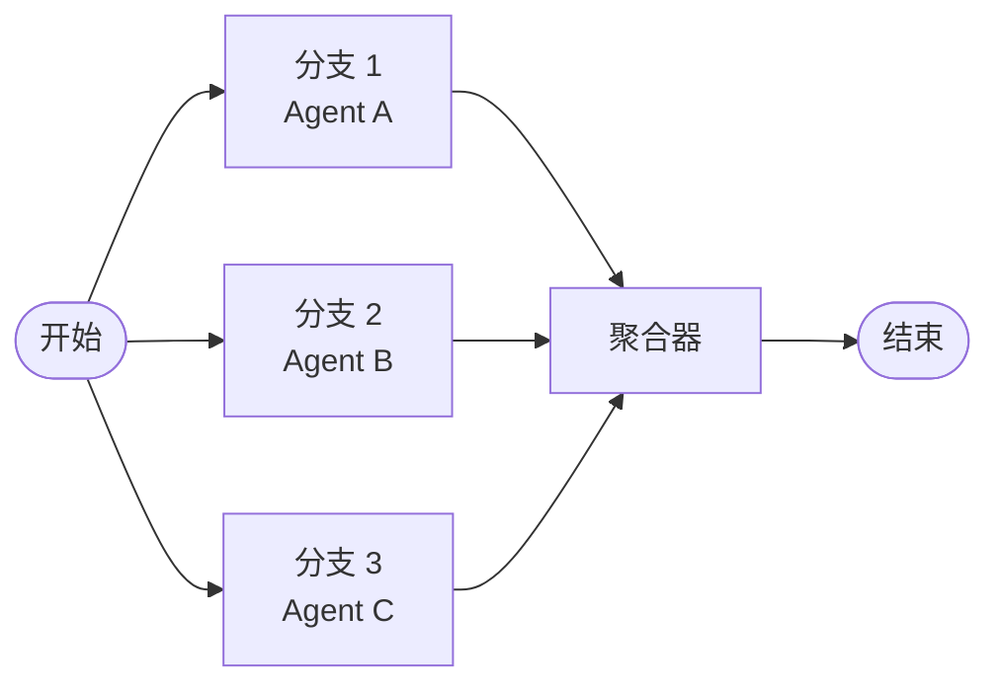
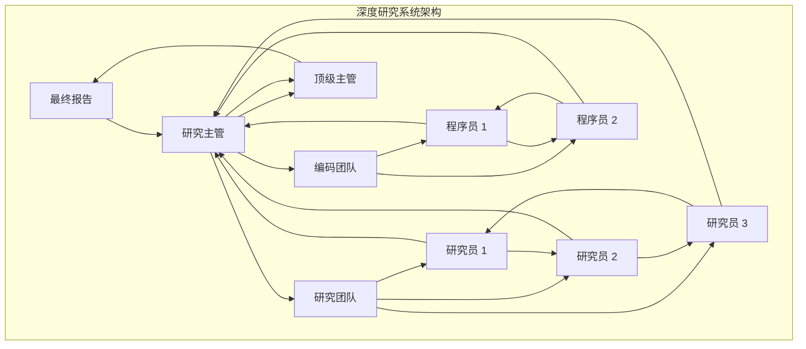
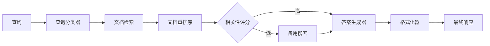

# 多 Agent 系统指南

<cite>
**本文档引用的文件**
- [README.md](file://README.md)
- [README_CN.md](file://README_CN.md)
- [examples/swarm/main.go](file://examples/swarm/main.go)
- [examples/swarm/README.md](file://examples/swarm/README.md)
- [prebuilt/supervisor.go](file://prebuilt/supervisor.go)
- [prebuilt/supervisor_test.go](file://prebuilt/supervisor_test.go)
- [showcases/open_deep_research/main.go](file://showcases/open_deep_research/main.go)
- [showcases/open_deep_research/prompts.go](file://showcases/open_deep_research/prompts.go)
- [showcases/deepagents/main.go](file://showcases/deepagents/main.go)
- [examples/parallel_execution/main.go](file://examples/parallel_execution/main.go)
- [examples/state_schema/main.go](file://examples/state_schema/main.go)
- [graph/parallel.go](file://graph/parallel.go)
- [graph/state_graph.go](file://graph/state_graph.go)
- [examples/tool_tavily/main.go](file://examples/tool_tavily/main.go)
- [examples/rag_pipeline/main.go](file://examples/rag_pipeline/main.go)
- [prebuilt/create_agent.go](file://prebuilt/create_agent.go)
- [prebuilt/tool_executor.go](file://prebuilt/tool_executor.go)
</cite>

## 目录
1. [简介](#简介)
2. [多 Agent 系统概述](#多-agent-系统概述)
3. [核心架构模式](#核心架构模式)
4. [Supervisor 模式详解](#supervisor-模式详解)
5. [Swarm 模式详解](#swarm-模式详解)
6. [并行执行与状态管理](#并行执行与状态管理)
7. [工具与协作机制](#工具与协作机制)
8. [实际应用案例](#实际应用案例)
9. [最佳实践与优化](#最佳实践与优化)
10. [故障排除指南](#故障排除指南)

## 简介

LangGraphGo 是一个强大的多 Agent 系统框架，专为构建复杂的分布式智能体协作而设计。它继承了 Python LangGraph 的核心理念，同时针对 Go 语言的特点进行了优化，提供了完整的多 Agent 编排解决方案。

### 核心优势

- **并行执行能力**：支持节点的并发执行（扇出），具备线程安全的状态合并
- **灵活的编排模式**：提供 Supervisor 和 Swarm 两种经典编排模式
- **强大的状态管理**：支持细粒度的状态更新和自定义 Reducer
- **丰富的工具集成**：内置搜索工具和扩展的工具执行机制
- **生产就绪特性**：持久化、可观测性和错误恢复能力

## 多 Agent 系统概述

### 为什么需要多 Agent 系统？

单体 Agent 在面对复杂任务时往往力不从心。通过将任务分解，让多个专注于特定领域的 Agent 协作，我们可以构建出更强大、更稳定的系统。

### 多 Agent 系统的核心特征



**图表来源**
- [README.md](file://README.md#L145-L158)
- [README_CN.md](file://README_CN.md#L145-L158)

## 核心架构模式

LangGraphGo 支持两种主要的多 Agent 编排模式：

### 1. Supervisor 模式（监督者模式）

这是最经典的多 Agent 组织形式。一个中央的 "Supervisor" Agent 充当项目经理，它接收用户请求，将任务分解并分配给下属的 "Worker" Agent。

### 2. Swarm 模式（蜂群模式）

这是一种去中心化的编排方式。每个 Agent 都可以根据需要将任务移交给其他 Agent，类似于微服务架构或人类的社交网络。

### 3. 并行执行模式

支持多个 Agent 同时执行，通过智能的状态合并机制确保数据一致性。

## Supervisor 模式详解

### 背景与功能

Supervisor 模式是最经典的多 Agent 组织形式。一个中央的 "Supervisor" Agent 充当项目经理，它接收用户请求，将任务分解并分配给下属的 "Worker" Agent。

### 实现原理



**图表来源**
- [prebuilt/supervisor.go](file://prebuilt/supervisor.go#L30-L105)
- [showcases/open_deep_research/main.go](file://showcases/open_deep_research/main.go#L80-L120)

### 关键组件

#### 1. 监督者节点

监督者节点负责分析用户请求并决定下一步行动：

```go
// 监督者节点的核心逻辑
workflow.AddNode("supervisor", func(ctx context.Context, state interface{}) (interface{}, error) {
    // 解析当前状态
    mState := state.(map[string]interface{})
    messages := mState["messages"].([]llms.MessageContent)
    
    // 定义路由工具
    routeTool := llms.Tool{
        Type: "function",
        Function: &llms.FunctionDefinition{
            Name:        "route",
            Description: "Select the next role.",
            Parameters: map[string]interface{}{
                "type": "object",
                "properties": map[string]interface{}{
                    "next": map[string]interface{}{
                        "type": "string",
                        "enum": options, // 包含所有 Worker 和 FINISH
                    },
                },
                "required": []string{"next"},
            },
        },
    }
    
    // 调用模型获取下一步
    resp, err := model.GenerateContent(ctx, inputMessages, 
        llms.WithTools([]llms.Tool{routeTool}),
        llms.WithToolChoice("auto"),
    )
    
    // 解析选择并返回
    return map[string]interface{}{
        "next": args.Next, // 下一步执行的 Agent 名称
    }, nil
})
```

#### 2. Worker 节点

Worker 节点专注于特定领域的工作：

```go
// Worker 节点示例
workflow.AddNode("researcher", func(ctx context.Context, state interface{}) (interface{}, error) {
    // 执行研究任务
    result, err := performResearch(state)
    if err != nil {
        return nil, err
    }
    
    // 返回结果
    return map[string]interface{}{
        "research_results": result,
        "status": "completed",
    }, nil
})
```

#### 3. 边缘路由

监督者模式使用条件边来决定流向：

```go
// 监督者到 Worker 的条件边
workflow.AddConditionalEdge("supervisor", func(ctx context.Context, state interface{}) string {
    mState := state.(map[string]interface{})
    next, ok := mState["next"].(string)
    if !ok {
        return graph.END
    }
    if next == "FINISH" {
        return graph.END
    }
    return next // 返回下一个要执行的 Worker
})
```

**章节来源**
- [prebuilt/supervisor.go](file://prebuilt/supervisor.go#L1-L152)
- [prebuilt/supervisor_test.go](file://prebuilt/supervisor_test.go#L1-L66)

## Swarm 模式详解

### 背景与功能

Swarm 模式（受 OpenAI Swarm 框架启发）是一种去中心化的多 Agent 编排方法。Unlike the Supervisor pattern where a central agent routes tasks, Swarm allows agents to hand off execution directly to one another。

### 实现原理



**图表来源**
- [examples/swarm/main.go](file://examples/swarm/main.go#L67-L132)
- [examples/swarm/README.md](file://examples/swarm/README.md#L1-L24)

### 关键机制

#### 1. 手交工具（Handoff Tool）

Swarm 模式的核心是手交机制：

```go
// 手交工具定义
var HandoffTool = llms.Tool{
    Type: "function",
    Function: &llms.FunctionDefinition{
        Name:        "handoff",
        Description: "Hand off control to another agent.",
        Parameters: map[string]interface{}{
            "type": "object",
            "properties": map[string]interface{}{
                "to": map[string]interface{}{
                    "type": "string",
                    "enum": []string{"Researcher", "Writer"},
                },
            },
            "required": []string{"to"},
        },
    },
}
```

#### 2. 路由逻辑

Swarm 使用状态中的 `next` 字段进行路由：

```go
// 路由函数
router := func(ctx context.Context, state interface{}) string {
    mState := state.(map[string]interface{})
    next, ok := mState["next"].(string)
    if !ok || next == "" || next == "END" {
        return graph.END
    }
    return next
}

// 条件边
workflow.AddConditionalEdge("Researcher", router)
workflow.AddConditionalEdge("Writer", router)
```

#### 3. Agent 交互

每个 Agent 都可以调用手交工具：

```go
// 研究员 Agent 的手交逻辑
if len(choice.ToolCalls) > 0 {
    tc := choice.ToolCalls[0]
    if tc.FunctionCall.Name == "handoff" {
        var args struct {
            To string `json:"to"`
        }
        json.Unmarshal([]byte(tc.FunctionCall.Arguments), &args)
        
        return map[string]interface{}{
            "messages": []llms.MessageContent{
                {
                    Role:  llms.ChatMessageTypeAI,
                    Parts: []llms.ContentPart{tc},
                },
                {
                    Role: llms.ChatMessageTypeTool,
                    Parts: []llms.ContentPart{
                        llms.ToolCallResponse{
                            ToolCallID: tc.ID,
                            Name:       "handoff",
                            Content:    fmt.Sprintf("Handing off to %s", args.To),
                        },
                    },
                },
            },
            "next": args.To, // 设置下一个执行的 Agent
        }, nil
    }
}
```

**章节来源**
- [examples/swarm/main.go](file://examples/swarm/main.go#L1-L244)
- [examples/swarm/README.md](file://examples/swarm/README.md#L1-L24)

## 并行执行与状态管理

### 并行执行机制

LangGraphGo 支持节点的并发执行，这对于多 Agent 系统至关重要：



**图表来源**
- [examples/parallel_execution/main.go](file://examples/parallel_execution/main.go#L64-L75)
- [graph/parallel.go](file://graph/parallel.go#L23-L83)

### 状态 Schema 管理

LangGraphGo 提供了灵活的状态管理机制：

```go
// 定义状态 Schema
schema := graph.NewMapSchema()
schema.RegisterReducer("results", graph.AppendReducer) // 列表追加
schema.RegisterReducer("count", SumReducer)           // 数字累加
schema.RegisterReducer("status", graph.OverwriteReducer) // 覆盖更新

// 设置 Schema
g.SetSchema(schema)
```

### 自定义 Reducer

```go
// 自定义求和 Reducer
func SumReducer(current, new interface{}) (interface{}, error) {
    if current == nil {
        return new, nil
    }
    c, ok1 := current.(int)
    n, ok2 := new.(int)
    if !ok1 || !ok2 {
        return nil, fmt.Errorf("expected int, got %T and %T", current, new)
    }
    return c + n, nil
}
```

**章节来源**
- [examples/parallel_execution/main.go](file://examples/parallel_execution/main.go#L1-L97)
- [examples/state_schema/main.go](file://examples/state_schema/main.go#L1-L105)
- [graph/parallel.go](file://graph/parallel.go#L1-L178)

## 工具与协作机制

### 工具执行系统

多 Agent 系统需要强大的工具支持：

```mermaid
classDiagram
class ToolExecutor {
+Execute(ctx, invocation) string
+ExecuteMany(ctx, invocations) []string
+ToolNode(ctx, state) interface{}
}
class ToolInvocation {
+Tool string
+ToolInput string
}
class TaskTool {
+Handler SubAgentHandler
+Name() string
+Description() string
+Call(ctx, input) string
}
ToolExecutor --> ToolInvocation : 使用
TaskTool --|> ToolExecutor : 实现
```

**图表来源**
- [prebuilt/tool_executor.go](file://prebuilt/tool_executor.go#L45-L83)
- [showcases/deepagents/tools/subagent.go](file://showcases/deepagents/tools/subagent.go#L1-L29)

### 搜索工具集成

```go
// Tavily 搜索工具
tavilyTool, err := tool.NewTavilySearch("", tool.WithTavilySearchDepth("advanced"))

// 创建 ReAct Agent
agent, err := prebuilt.CreateReactAgent(llm, []tools.Tool{tavilyTool})
```

### 条件边与动态路由

多 Agent 系统中的智能路由：

```go
// 基于工具调用的路由
workflow.AddConditionalEdge("agent", func(ctx context.Context, state interface{}) string {
    mState := state.(map[string]interface{})
    messages := mState["messages"].([]llms.MessageContent)
    lastMsg := messages[len(messages)-1]
    
    hasToolCalls := false
    for _, part := range lastMsg.Parts {
        if _, ok := part.(llms.ToolCall); ok {
            hasToolCalls = true
            break
        }
    }
    
    if hasToolCalls {
        return "tools" // 跳转到工具执行
    }
    return graph.END // 结束
})
```

**章节来源**
- [examples/tool_tavily/main.go](file://examples/tool_tavily/main.go#L1-L78)
- [prebuilt/create_agent.go](file://prebuilt/create_agent.go#L192-L251)

## 实际应用案例

### 深度研究系统

Open Deep Research 展示了复杂的多 Agent 研究系统：



**图表来源**
- [showcases/open_deep_research/main.go](file://showcases/open_deep_research/main.go#L80-L120)

### 深度 Agent 系统

展示了具有文件系统访问能力的深度 Agent：

```go
// 创建深度 Agent
deepAgent, err := agent.CreateDeepAgent(model,
    agent.WithRootDir("./workspace"),
    agent.WithSystemPrompt("You are a capable assistant with filesystem access."),
    agent.WithSubAgentHandler(subAgentHandler),
)
```

### RAG 管道

结合多 Agent 和 RAG 技术的复杂系统：



**图表来源**
- [examples/rag_pipeline/main.go](file://examples/rag_pipeline/main.go#L31-L106)
- [showcases/deepagents/main.go](file://showcases/deepagents/main.go#L1-L68)

**章节来源**
- [showcases/open_deep_research/main.go](file://showcases/open_deep_research/main.go#L1-L96)
- [showcases/deepagents/main.go](file://showcases/deepagents/main.go#L1-L68)
- [examples/rag_pipeline/main.go](file://examples/rag_pipeline/main.go#L1-L133)

## 最佳实践与优化

### 1. 状态设计原则

- **最小化状态**：只存储必要的信息
- **类型安全**：使用明确的数据结构
- **版本兼容**：考虑状态演进的兼容性

### 2. 错误处理策略

```go
// 重试策略配置
retryPolicy := &graph.RetryPolicy{
    MaxRetries:      3,
    BackoffStrategy: graph.ExponentialBackoff,
    RetryableErrors: []string{"timeout", "rate_limit"},
}

// 应用重试策略
workflow.SetRetryPolicy(retryPolicy)
```

### 3. 性能优化

- **并行执行**：充分利用多 Agent 的并行能力
- **状态缓存**：合理使用 Checkpointing 机制
- **工具批处理**：批量执行相似的工具调用

### 4. 监控与调试

```go
// 添加监听器
workflow.AddListener(func(ctx context.Context, event graph.Event) error {
    log.Printf("Event: %s, Node: %s, Duration: %v", 
        event.Type, event.NodeName, event.Duration)
    return nil
})
```

### 5. 安全考虑

- **权限控制**：限制 Agent 的操作权限
- **输入验证**：严格验证用户输入
- **审计日志**：记录关键操作的审计信息

## 故障排除指南

### 常见问题与解决方案

#### 1. Agent 卡死问题

**症状**：Agent 执行卡在某个节点不动
**原因**：可能是死锁或无限循环
**解决**：
- 检查条件边的逻辑
- 添加超时机制
- 使用中断功能

#### 2. 状态不一致

**症状**：不同 Agent 看到的状态不一致
**原因**：状态合并策略不当
**解决**：
- 明确定义 Reducer
- 使用事务性状态更新
- 实施状态验证

#### 3. 性能瓶颈

**症状**：系统响应缓慢
**原因**：串行执行过多或资源竞争
**解决**：
- 优化并行执行策略
- 减少不必要的状态传递
- 使用异步处理

#### 4. 工具调用失败

**症状**：工具执行失败或超时
**原因**：网络问题或工具配置错误
**解决**：
- 实施重试机制
- 添加健康检查
- 提供降级方案

### 调试技巧

1. **启用详细日志**：设置适当的日志级别
2. **使用可视化工具**：导出图形进行分析
3. **状态快照**：定期保存状态以便回溯
4. **单元测试**：为每个 Agent 编写独立测试

### 监控指标

- **执行时间**：各 Agent 的平均执行时间
- **成功率**：任务完成的成功率
- **资源使用**：CPU 和内存使用情况
- **错误率**：各类错误的发生频率

## 结论

LangGraphGo 为构建复杂的多 Agent 系统提供了强大而灵活的框架。通过 Supervisor 和 Swarm 两种编排模式，配合强大的并行执行能力和状态管理系统，开发者可以构建出既高效又可靠的多 Agent 应用。

关键要点：
- 选择合适的编排模式（Supervisor vs Swarm）
- 设计清晰的状态 Schema 和 Reducer
- 实施有效的错误处理和重试机制
- 注重系统的可观察性和可维护性

随着人工智能技术的发展，多 Agent 系统将在更多领域发挥重要作用，从智能客服到自动化研发，从内容创作到数据分析，LangGraphGo 都能为这些应用场景提供坚实的技术基础。