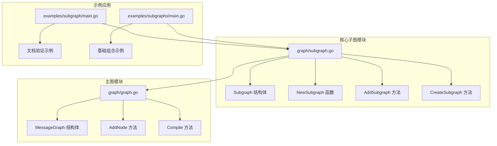
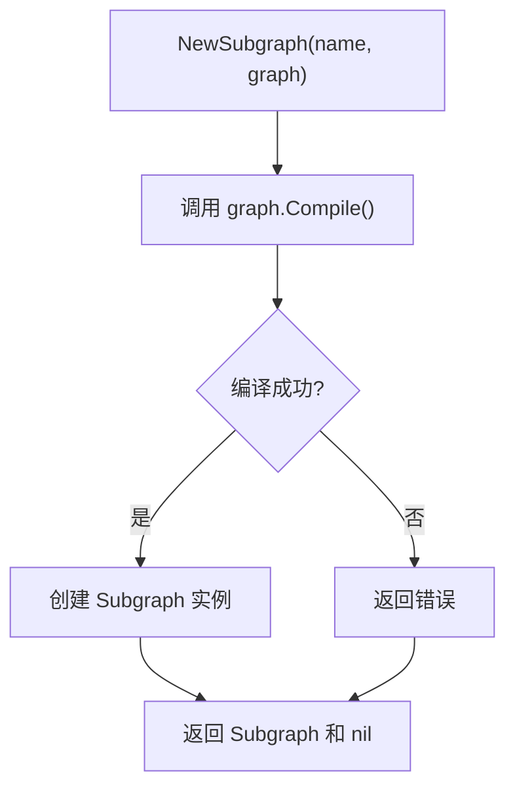
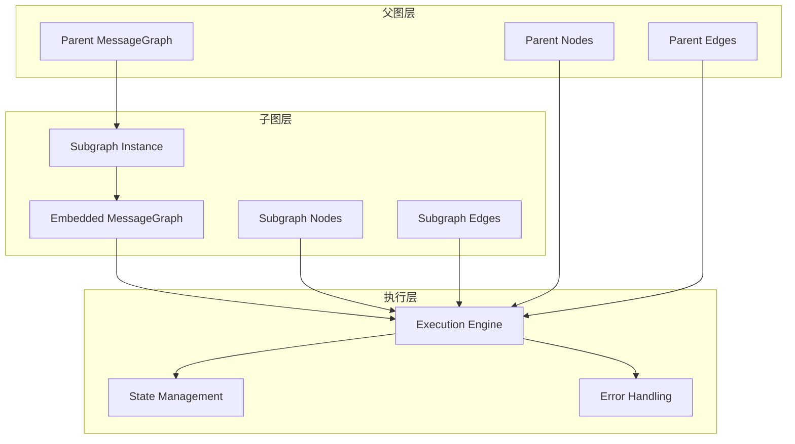
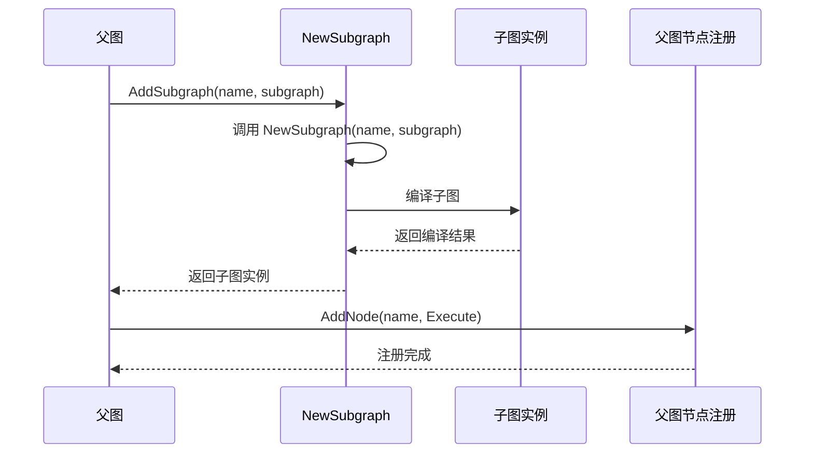
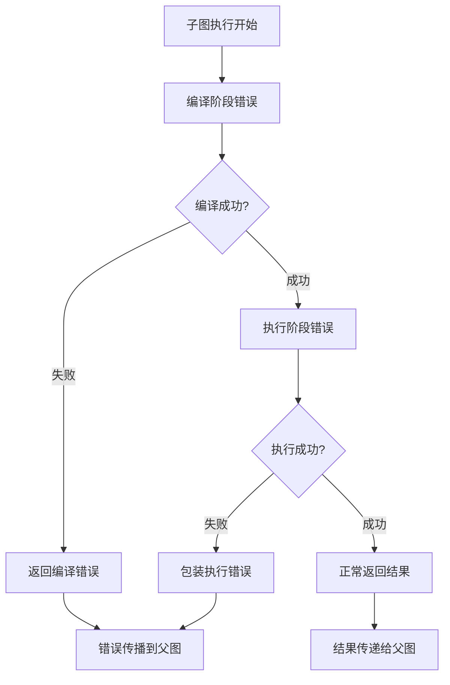
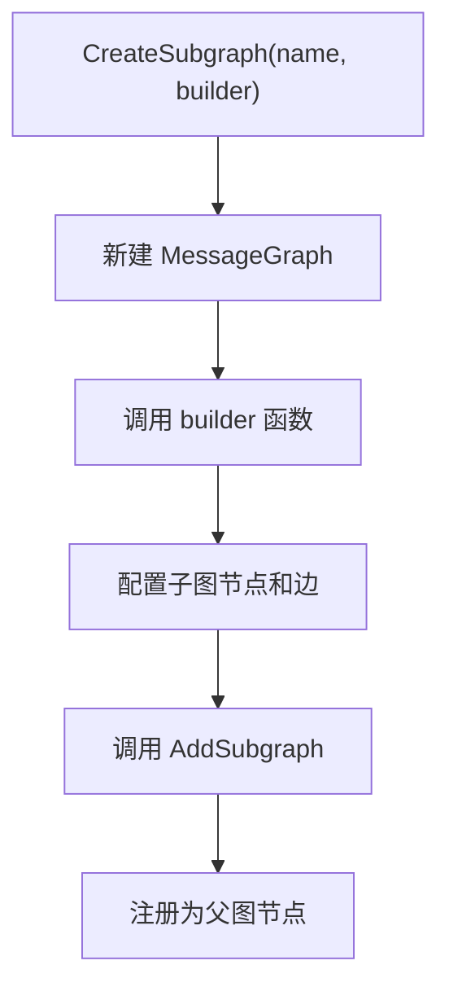
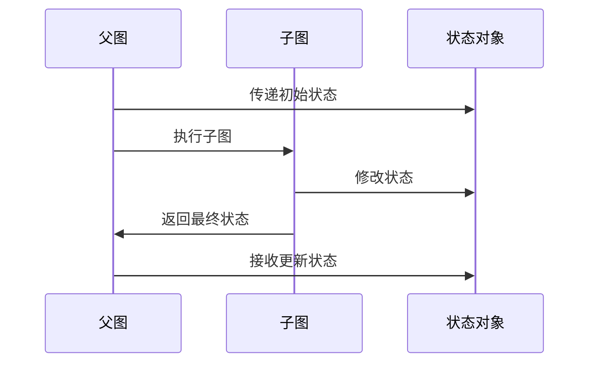
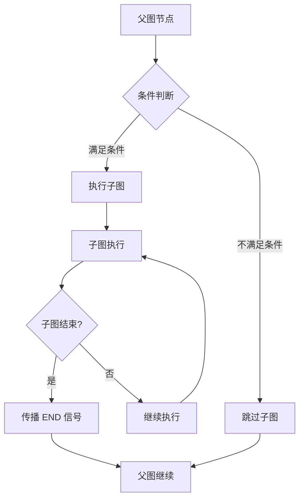
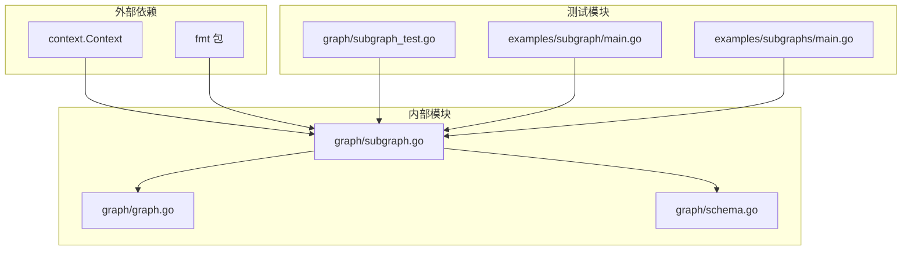

# 单层子图实现

<cite>
**本文档中引用的文件**
- [graph/subgraph.go](file://graph/subgraph.go)
- [graph/graph.go](file://graph/graph.go)
- [examples/subgraph/main.go](file://examples/subgraph/main.go)
- [examples/subgraphs/main.go](file://examples/subgraphs/main.go)
- [graph/subgraph_test.go](file://graph/subgraph_test.go)
- [examples/subgraph/README.md](file://examples/subgraph/README.md)
</cite>

## 目录
1. [简介](#简介)
2. [项目结构概览](#项目结构概览)
3. [核心组件分析](#核心组件分析)
4. [架构概览](#架构概览)
5. [详细组件分析](#详细组件分析)
6. [依赖关系分析](#依赖关系分析)
7. [性能考虑](#性能考虑)
8. [故障排除指南](#故障排除指南)
9. [结论](#结论)

## 简介

LangGraphGo 的单层子图实现提供了一种强大的模块化工作流设计模式，允许开发者将复杂的业务逻辑分解为可重用的子图组件。通过 `NewMessageGraph` 构建的子图可以作为独立模块嵌入到父图中，实现层次化的流程控制和状态管理。

本文档详细解析了子图的创建、集成和执行过程，包括 `NewSubgraph` 函数的使用方式、`AddSubgraph` 方法的工作原理、错误处理机制以及子图与父图之间的状态传递规则。

## 项目结构概览

LangGraphGo 的子图功能主要分布在以下关键文件中：



**图表来源**
- [graph/subgraph.go](file://graph/subgraph.go#L1-L200)
- [graph/graph.go](file://graph/graph.go#L1-L492)

**章节来源**
- [graph/subgraph.go](file://graph/subgraph.go#L1-L200)
- [examples/subgraph/main.go](file://examples/subgraph/main.go#L1-L166)

## 核心组件分析

### Subgraph 结构体

`Subgraph` 是子图的核心数据结构，封装了子图的名称、底层消息图和编译后的可运行实例：

```mermaid
classDiagram
class Subgraph {
+string name
+*MessageGraph graph
+*Runnable runnable
+Execute(ctx, state) (interface{}, error)
}
class MessageGraph {
+map[string]Node nodes
+[]Edge edges
+map[string]func state string conditionalEdges
+string entryPoint
+AddNode(name, fn) void
+AddEdge(from, to) void
+Compile() (*Runnable, error)
}
class Runnable {
+*MessageGraph graph
+*Tracer tracer
+Invoke(ctx, state) (interface{}, error)
+SetTracer(tracer) void
}
Subgraph --> MessageGraph : "包含"
Subgraph --> Runnable : "编译后"
MessageGraph --> Runnable : "编译产生"
```

**图表来源**
- [graph/subgraph.go](file://graph/subgraph.go#L8-L13)
- [graph/graph.go](file://graph/graph.go#L74-L93)

### NewSubgraph 函数

`NewSubgraph` 函数负责创建新的子图实例，它接受子图名称和底层消息图作为参数：



**图表来源**
- [graph/subgraph.go](file://graph/subgraph.go#L15-L27)

**章节来源**
- [graph/subgraph.go](file://graph/subgraph.go#L15-L27)

## 架构概览

LangGraphGo 的子图架构采用分层设计，支持多级嵌套和灵活的状态传递：



**图表来源**
- [graph/subgraph.go](file://graph/subgraph.go#L38-L47)
- [graph/graph.go](file://graph/graph.go#L140-L178)

## 详细组件分析

### AddSubgraph 方法详解

`AddSubgraph` 方法是将子图作为节点添加到父图的核心方法：



**图表来源**
- [graph/subgraph.go](file://graph/subgraph.go#L38-L47)

#### 错误处理机制

子图的错误处理遵循分层原则：



**图表来源**
- [graph/subgraph.go](file://graph/subgraph.go#L17-L20)
- [graph/subgraph.go](file://graph/subgraph.go#L30-L36)

### CreateSubgraph 方法

`CreateSubgraph` 提供了更便捷的子图创建方式，通过构建器函数定义子图：



**图表来源**
- [graph/subgraph.go](file://graph/subgraph.go#L49-L54)

**章节来源**
- [graph/subgraph.go](file://graph/subgraph.go#L38-L54)

### 子图状态传递规则

子图与父图之间的状态传递遵循以下规则：

1. **状态共享**：子图接收父图传递的完整状态对象
2. **状态修改**：子图可以修改状态，这些修改会传递回父图
3. **状态合并**：默认情况下，子图的最终状态会覆盖父图的状态
4. **类型兼容性**：状态必须是可序列化的接口类型



**图表来源**
- [graph/graph.go](file://graph/graph.go#L174-L491)

**章节来源**
- [examples/subgraph/main.go](file://examples/subgraph/main.go#L11-L166)

### 条件边调用与执行结束信号

子图支持条件边调用和执行结束信号的传播：



**图表来源**
- [graph/graph.go](file://graph/graph.go#L410-L437)

**章节来源**
- [graph/graph.go](file://graph/graph.go#L410-L437)

## 依赖关系分析

子图系统的依赖关系体现了清晰的分层架构：



**图表来源**
- [graph/subgraph.go](file://graph/subgraph.go#L1-L7)
- [graph/graph.go](file://graph/graph.go#L1-L10)

**章节来源**
- [graph/subgraph.go](file://graph/subgraph.go#L1-L7)
- [graph/graph.go](file://graph/graph.go#L1-L10)

## 性能考虑

子图系统在设计时充分考虑了性能优化：

1. **延迟编译**：子图仅在需要时进行编译
2. **状态共享**：避免不必要的状态复制
3. **并发安全**：支持并行执行多个子图
4. **内存管理**：及时清理临时状态

## 故障排除指南

### 常见问题及解决方案

1. **子图编译失败**
   - 检查子图是否设置了入口点
   - 验证所有节点是否正确添加

2. **状态传递异常**
   - 确保状态对象是可序列化的
   - 检查类型转换是否正确

3. **循环引用问题**
   - 避免子图直接或间接引用自身
   - 使用 CompositeGraph 处理复杂组合

**章节来源**
- [graph/subgraph_test.go](file://graph/subgraph_test.go#L1-L48)

## 结论

LangGraphGo 的单层子图实现提供了一个强大而灵活的工作流模块化框架。通过 `NewSubgraph` 和 `AddSubgraph` 方法，开发者可以轻松地将复杂的业务逻辑分解为可重用的子图组件。子图与父图之间的状态传递机制确保了数据的一致性和完整性，而完善的错误处理机制则保证了系统的稳定性。

这种设计不仅提高了代码的可维护性和可测试性，还为构建复杂的业务工作流提供了坚实的基础。通过合理的子图设计，可以实现高度模块化和可扩展的应用架构。