# 多层嵌套工作流

<cite>
**本文档中引用的文件**
- [graph/subgraph.go](file://graph/subgraph.go)
- [graph/graph.go](file://graph/graph.go)
- [graph/state_graph.go](file://graph/state_graph.go)
- [graph/context.go](file://graph/context.go)
- [graph/schema.go](file://graph/schema.go)
- [examples/subgraph/main.go](file://examples/subgraph/main.go)
- [examples/subgraphs/main.go](file://examples/subgraphs/main.go)
- [examples/subgraph/README.md](file://examples/subgraph/README.md)
- [examples/subgraphs/README.md](file://examples/subgraphs/README.md)
</cite>

## 目录
1. [简介](#简介)
2. [项目结构概览](#项目结构概览)
3. [核心组件分析](#核心组件分析)
4. [架构设计原理](#架构设计原理)
5. [详细组件分析](#详细组件分析)
6. [状态共享与合并机制](#状态共享与合并机制)
7. [性能考虑](#性能考虑)
8. [错误处理与调试](#错误处理与调试)
9. [最佳实践](#最佳实践)
10. [总结](#总结)

## 简介

LangGraphGo 是一个强大的工作流编排框架，支持多层嵌套工作流的设计与实现。该框架允许开发者将一个图（Child Graph）作为节点嵌入另一个图（Parent Graph），形成层级化的工作流结构。这种设计模式类似于函数式编程中的模块化思想，能够有效管理复杂度，提高代码的可维护性和复用性。

多层嵌套工作流的核心优势包括：
- **模块化设计**：将复杂的业务逻辑分解为独立的子图组件
- **状态共享**：在父子图之间无缝传递和合并状态数据
- **可复用性**：创建可在多个场景中重复使用的图形组件
- **层次化结构**：构建清晰的嵌套工作流架构

## 项目结构概览

LangGraphGo 的项目结构体现了其模块化设计理念：

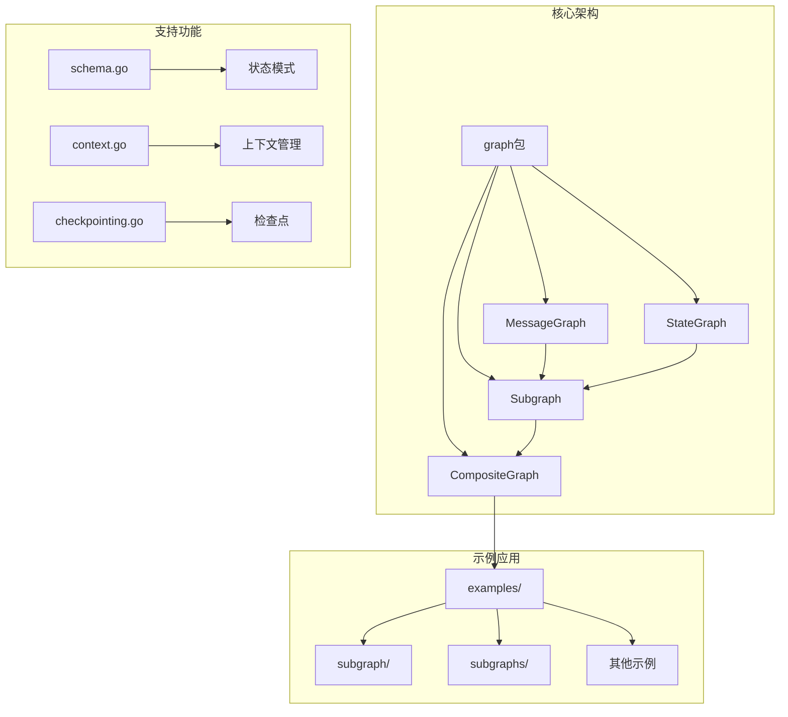

**图表来源**
- [graph/graph.go](file://graph/graph.go#L75-L93)
- [graph/subgraph.go](file://graph/subgraph.go#L8-L26)
- [examples/subgraph/main.go](file://examples/subgraph/main.go#L1-L50)

## 核心组件分析

### MessageGraph 基础架构

MessageGraph 是 LangGraphGo 的核心组件，提供了基础的工作流编排能力：

```mermaid
classDiagram
class MessageGraph {
+nodes map[string]Node
+edges []Edge
+conditionalEdges map[string]func
+entryPoint string
+stateMerger StateMerger
+Schema StateSchema
+AddNode(name, fn) void
+AddEdge(from, to) void
+AddConditionalEdge(from, condition) void
+SetEntryPoint(name) void
+Compile() Runnable
}
class Node {
+Name string
+Function func
}
class Edge {
+From string
+To string
}
class Runnable {
+graph *MessageGraph
+tracer *Tracer
+Invoke(ctx, state) interface{}
+InvokeWithConfig(ctx, state, config) interface{}
}
MessageGraph --> Node : "包含"
MessageGraph --> Edge : "包含"
MessageGraph --> Runnable : "编译为"
```

**图表来源**
- [graph/graph.go](file://graph/graph.go#L75-L93)
- [graph/graph.go](file://graph/graph.go#L52-L60)
- [graph/graph.go](file://graph/graph.go#L140-L146)

**章节来源**
- [graph/graph.go](file://graph/graph.go#L75-L101)

### Subgraph 嵌套机制

Subgraph 组件是实现多层嵌套的核心，它将一个 MessageGraph 包装成可作为节点使用的组件：

```mermaid
classDiagram
class Subgraph {
+name string
+graph *MessageGraph
+runnable *Runnable
+Execute(ctx, state) interface{}
}
class MessageGraph {
+AddSubgraph(name, subgraph) error
+CreateSubgraph(name, builder) error
}
class RecursiveSubgraph {
+name string
+graph *MessageGraph
+maxDepth int
+condition func
+Execute(ctx, state) interface{}
+executeRecursive(ctx, state, depth) interface{}
}
class CompositeGraph {
+graphs map[string]*MessageGraph
+main *MessageGraph
+AddGraph(name, graph) void
+Connect(fromGraph, fromNode, toGraph, toNode) error
+Compile() Runnable
}
MessageGraph --> Subgraph : "创建"
MessageGraph --> RecursiveSubgraph : "创建"
CompositeGraph --> MessageGraph : "组合"
```

**图表来源**
- [graph/subgraph.go](file://graph/subgraph.go#L8-L26)
- [graph/subgraph.go](file://graph/subgraph.go#L108-L127)
- [graph/subgraph.go](file://graph/subgraph.go#L56-L67)

**章节来源**
- [graph/subgraph.go](file://graph/subgraph.go#L8-L200)

## 架构设计原理

### parent.AddSubgraph 调用协议

`AddSubgraph` 方法是实现多层嵌套的关键接口，其调用协议遵循以下模式：

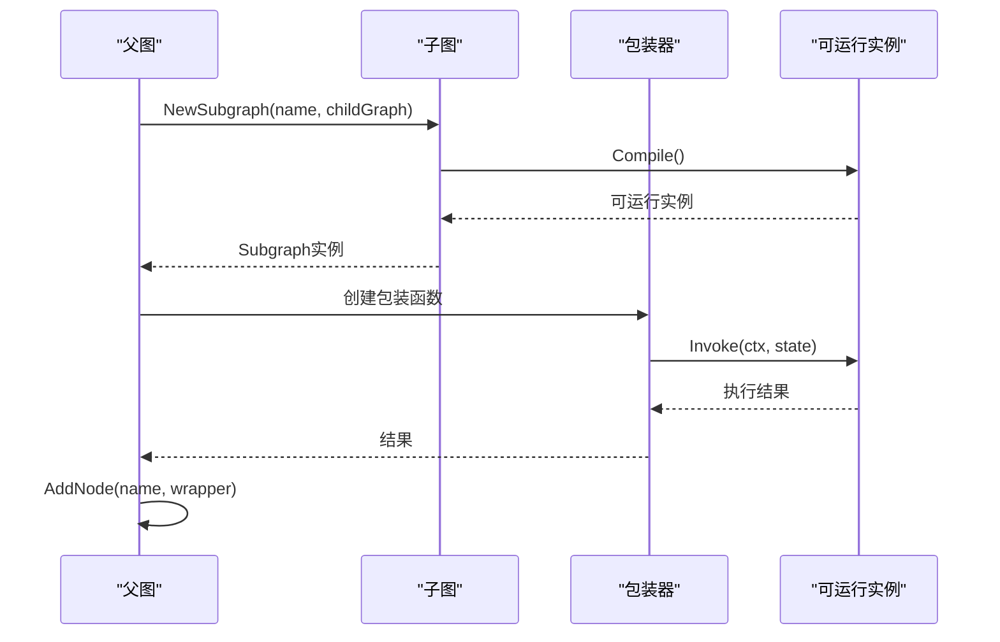

**图表来源**
- [graph/subgraph.go](file://graph/subgraph.go#L38-L46)
- [graph/subgraph.go](file://graph/subgraph.go#L15-L26)

### 上下文传递模式

LangGraphGo 通过 Context 接口实现上下文的传递，支持中断和恢复机制：

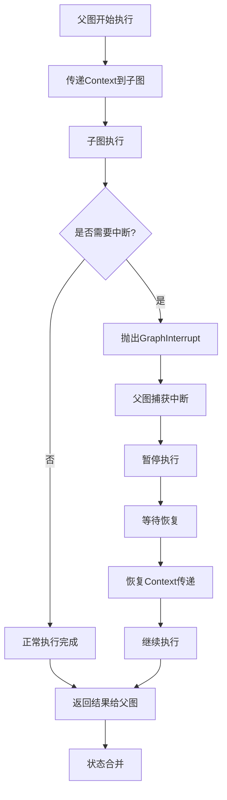

**图表来源**
- [graph/context.go](file://graph/context.go#L5-L16)
- [graph/graph.go](file://graph/graph.go#L24-L33)

**章节来源**
- [graph/context.go](file://graph/context.go#L1-L17)

## 详细组件分析

### 基础子图嵌套

基础子图嵌套是最简单的多层嵌套形式，展示了基本的父子关系：

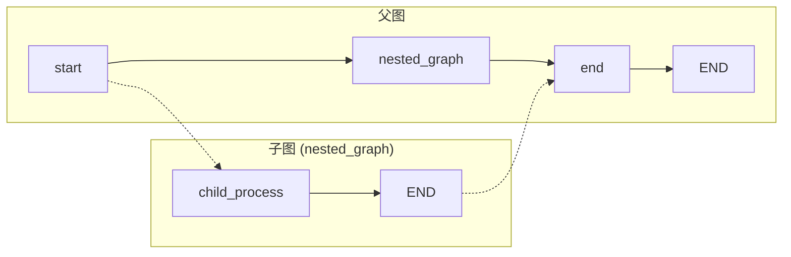

**图表来源**
- [examples/subgraphs/main.go](file://examples/subgraphs/main.go#L15-L58)

### Builder 函数模式

Builder 函数模式提供了更灵活的子图创建方式：

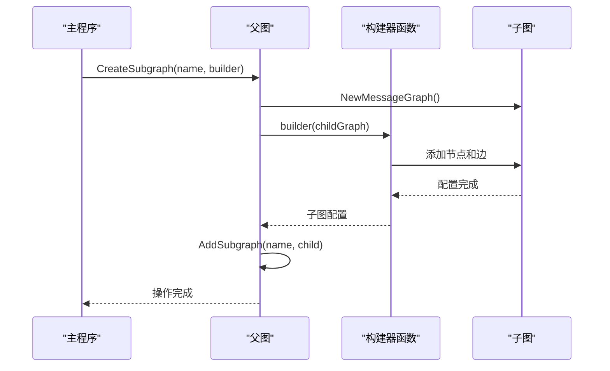

**图表来源**
- [examples/subgraph/main.go](file://examples/subgraph/main.go#L131-L166)

### 递归子图机制

递归子图支持自引用的嵌套结构，可以实现循环处理：

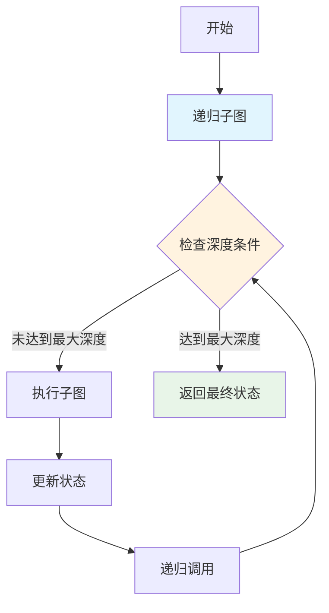

**图表来源**
- [graph/subgraph.go](file://graph/subgraph.go#L130-L159)

### 复合图架构

CompositeGraph 提供了更高级的组合能力，支持多个图之间的连接：

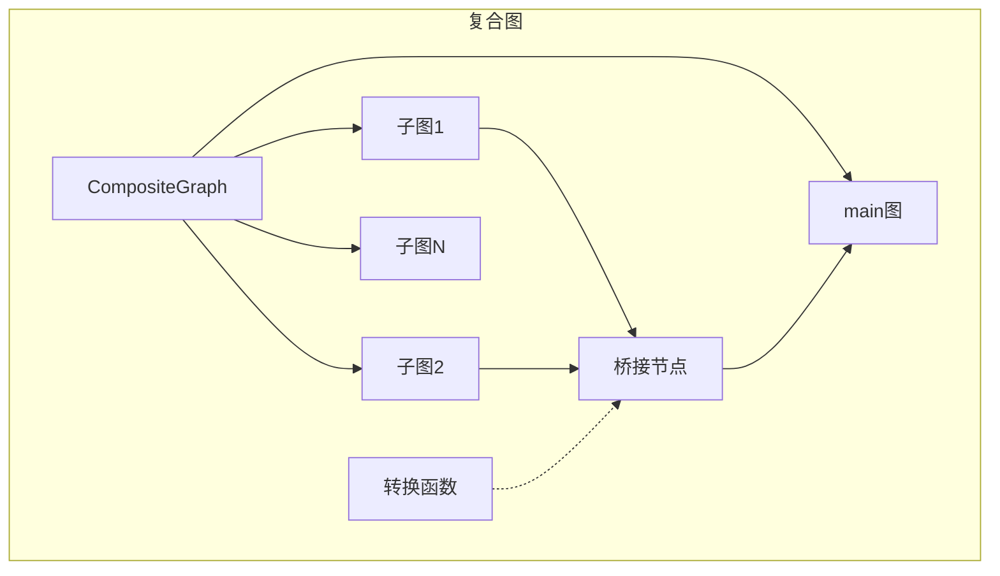

**图表来源**
- [graph/subgraph.go](file://graph/subgraph.go#L56-L106)

**章节来源**
- [examples/subgraph/main.go](file://examples/subgraph/main.go#L1-L166)
- [examples/subgraphs/main.go](file://examples/subgraphs/main.go#L1-L59)

## 状态共享与合并机制

### map[string]interface{} 类型的状态共享

LangGraphGo 使用 `map[string]interface{}` 作为默认的状态类型，支持灵活的数据结构：

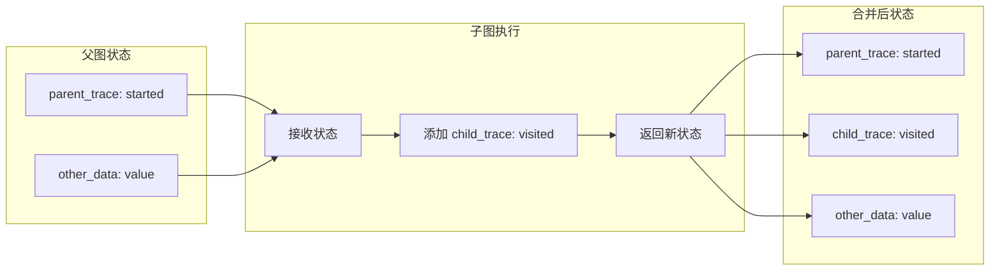

**图表来源**
- [examples/subgraphs/main.go](file://examples/subgraphs/main.go#L17-L20)

### 状态合并策略

LangGraphGo 提供了多种状态合并策略：

| 合并策略 | 描述 | 使用场景 |
|---------|------|----------|
| 默认合并 | 使用最后一个节点的结果覆盖当前状态 | 简单流程 |
| Schema 合并 | 使用 StateSchema 定义的规则合并状态 | 结构化数据 |
| 自定义合并器 | 使用 StateMerger 函数自定义合并逻辑 | 复杂业务逻辑 |
| 条件合并 | 基于条件选择不同的合并策略 | 动态流程 |

### 数据流动与累积过程

状态在嵌套层级间的流动遵循以下模式：

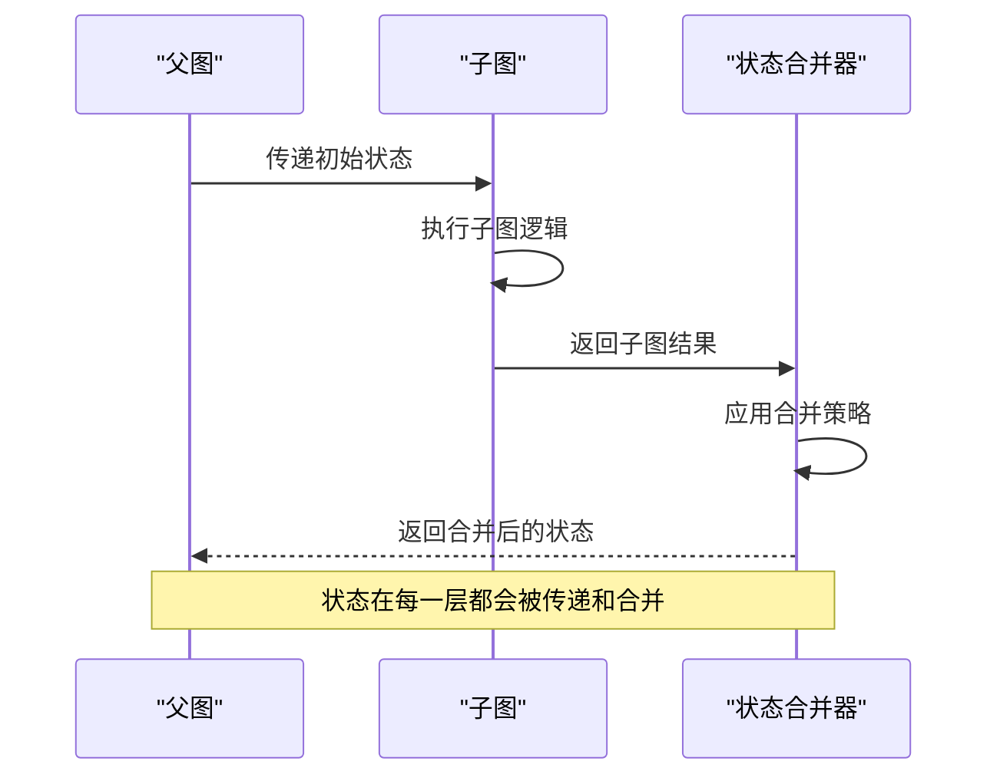

**图表来源**
- [graph/state_graph.go](file://graph/state_graph.go#L177-L225)
- [graph/schema.go](file://graph/schema.go#L62-L100)

**章节来源**
- [graph/schema.go](file://graph/schema.go#L1-L186)
- [examples/subgraphs/main.go](file://examples/subgraphs/main.go#L17-L20)

## 性能考虑

### 嵌套深度对性能的影响

嵌套深度对性能的影响主要体现在以下几个方面：

1. **内存使用**：每层嵌套都会增加调用栈深度和状态副本
2. **执行时间**：递归调用会增加函数调用开销
3. **并发控制**：深层嵌套可能影响并发执行效率

### 性能优化建议

| 优化策略 | 描述 | 实现方法 |
|---------|------|----------|
| 限制递归深度 | 设置合理的最大深度避免无限递归 | RecursiveSubgraph.maxDepth |
| 状态压缩 | 对大型状态进行压缩或分片处理 | 自定义 StateSchema |
| 并发优化 | 在合适的层级启用并行执行 | Parallel Execution |
| 缓存机制 | 缓存重复计算的结果 | 自定义缓存策略 |

### 内存管理

LangGraphGo 通过以下机制管理内存使用：

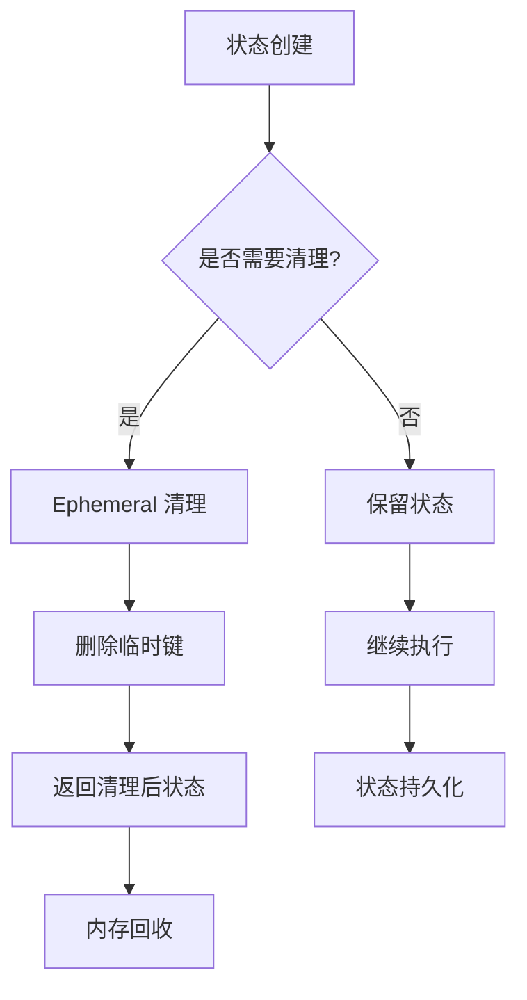

**图表来源**
- [graph/schema.go](file://graph/schema.go#L102-L137)

## 错误处理与调试

### 错误传播路径

错误在嵌套结构中的传播遵循以下路径：

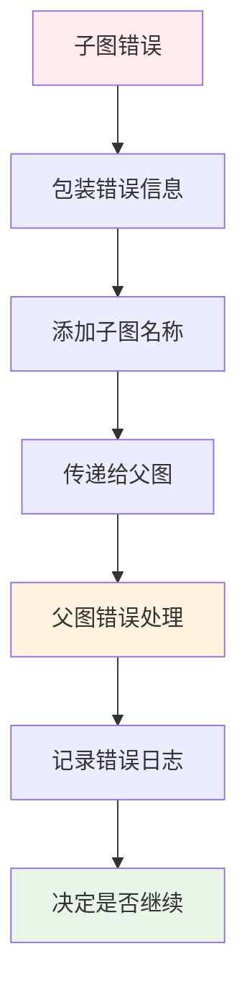

### 调试复杂嵌套结构的最佳实践

1. **分层调试**：逐层验证每个子图的功能
2. **状态快照**：在关键节点保存状态快照
3. **日志记录**：启用详细的执行日志
4. **断点设置**：在重要边界设置断点

### 错误处理策略

| 错误类型 | 处理策略 | 实现方式 |
|---------|----------|----------|
| 子图执行失败 | 传播错误并记录堆栈 | fmt.Errorf + 错误包装 |
| 状态合并失败 | 回滚到上一状态 | 检查点机制 |
| 递归深度超限 | 抛出深度限制错误 | 递归子图深度检查 |
| 上下文取消 | 正常终止执行 | Context Done 检查 |

**章节来源**
- [graph/subgraph.go](file://graph/subgraph.go#L30-L35)
- [graph/state_graph.go](file://graph/state_graph.go#L299-L330)

## 最佳实践

### 设计原则

1. **单一职责**：每个子图应该有明确的单一职责
2. **松耦合**：子图之间应尽量减少依赖
3. **状态隔离**：合理设计状态的可见性和修改范围
4. **错误边界**：在适当的层级处理错误

### 代码组织建议

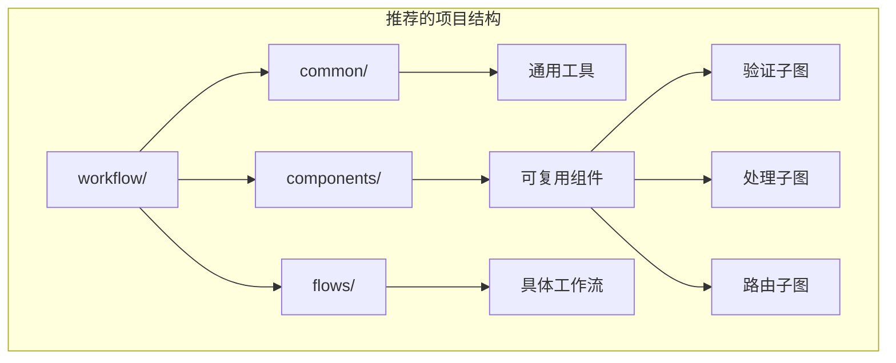

### 性能监控

建议实施以下监控指标：

| 指标类型 | 监控内容 | 收集方法 |
|---------|----------|----------|
| 执行时间 | 各层级的执行耗时 | Tracer 组件 |
| 内存使用 | 状态大小和增长趋势 | 内存分析器 |
| 错误率 | 各层级的错误发生率 | 异常统计 |
| 并发度 | 同时执行的节点数量 | 并发控制器 |

### 测试策略

1. **单元测试**：测试每个子图的独立功能
2. **集成测试**：测试子图之间的交互
3. **端到端测试**：测试完整的工作流
4. **压力测试**：测试高并发场景下的表现

## 总结

LangGraphGo 的多层嵌套工作流架构提供了一个强大而灵活的解决方案，用于构建复杂的业务流程。通过 `AddSubgraph` 方法，开发者可以轻松地将一个图作为节点嵌入另一个图，形成清晰的层级化结构。

### 核心优势

1. **模块化设计**：支持将复杂流程分解为可复用的子图组件
2. **状态管理**：提供灵活的状态共享和合并机制
3. **错误处理**：完善的错误传播和恢复机制
4. **性能优化**：支持递归控制和并发执行

### 应用场景

- **微服务编排**：将不同的服务封装为子图
- **业务流程管理**：构建复杂的业务处理流程
- **AI 工作流**：组合多个 AI 模块形成完整的工作流
- **数据处理管道**：构建多阶段的数据处理流水线

### 发展方向

随着项目的不断发展，LangGraphGo 的多层嵌套工作流功能将继续演进，可能的方向包括：

- 更智能的状态预测和优化
- 更丰富的错误恢复策略
- 更好的性能监控和分析工具
- 更灵活的扩展机制

通过深入理解和正确使用这些功能，开发者可以构建出既强大又易于维护的复杂工作流系统。