# 子图与嵌套工作流

<cite>
**本文档中引用的文件**
- [examples/subgraph/main.go](file://examples/subgraph/main.go)
- [examples/subgraphs/main.go](file://examples/subgraphs/main.go)
- [graph/subgraph.go](file://graph/subgraph.go)
- [graph/subgraph_test.go](file://graph/subgraph_test.go)
- [graph/graph.go](file://graph/graph.go)
- [graph/schema.go](file://graph/schema.go)
- [examples/subgraph/README.md](file://examples/subgraph/README.md)
- [examples/subgraphs/README.md](file://examples/subgraphs/README.md)
</cite>

## 目录
1. [简介](#简介)
2. [项目结构概览](#项目结构概览)
3. [核心概念](#核心概念)
4. [子图基础实现](#子图基础实现)
5. [状态传递机制](#状态传递机制)
6. [调用协议与执行流程](#调用协议与执行流程)
7. [错误传播规则](#错误传播规则)
8. [分层架构示例](#分层架构示例)
9. [子图复用策略](#子图复用策略)
10. [版本管理问题](#版本管理问题)
11. [高级特性](#高级特性)
12. [最佳实践](#最佳实践)
13. [总结](#总结)

## 简介

LangGraph Go 提供了强大的子图（Subgraph）功能，允许开发者创建嵌套的工作流架构。子图是可以在父图中作为节点运行的独立图实例，这种设计模式支持模块化开发、状态共享和代码复用，是构建复杂业务逻辑的重要工具。

子图的核心优势包括：
- **模块化设计**：将复杂工作流分解为更小的可管理组件
- **状态共享**：在父子图之间无缝传递和共享状态
- **代码复用**：创建可在多个上下文中使用的通用子图
- **层次化架构**：构建清晰的嵌套工作流结构

## 项目结构概览

LangGraph Go 的子图功能主要分布在以下目录结构中：

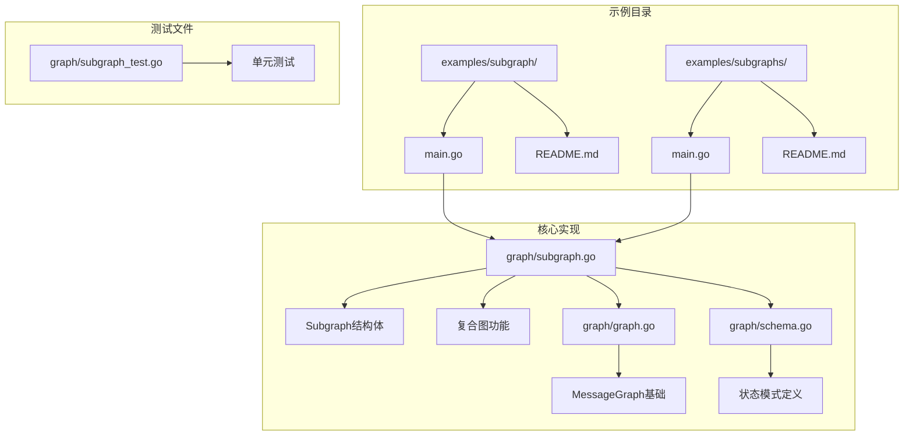

**图表来源**
- [examples/subgraph/main.go](file://examples/subgraph/main.go#L1-L166)
- [examples/subgraphs/main.go](file://examples/subgraphs/main.go#L1-L59)
- [graph/subgraph.go](file://graph/subgraph.go#L1-L200)

## 核心概念

### Subgraph 结构体

子图的核心是一个封装了 MessageGraph 的结构体：

```mermaid
classDiagram
class Subgraph {
+string name
+MessageGraph graph
+Runnable runnable
+Execute(ctx, state) interface{}
}
class MessageGraph {
+map nodes
+[]Edge edges
+string entryPoint
+AddNode(name, fn)
+AddEdge(from, to)
+Compile() Runnable
}
class Runnable {
+MessageGraph graph
+Invoke(ctx, state) interface{}
}
Subgraph --> MessageGraph : "包含"
Subgraph --> Runnable : "编译为"
MessageGraph --> Runnable : "生成"
```

**图表来源**
- [graph/subgraph.go](file://graph/subgraph.go#L8-L13)
- [graph/graph.go](file://graph/graph.go#L75-L93)

### 复合图架构

复合图（CompositeGraph）提供了更高级的子图组合能力：

```mermaid
classDiagram
class CompositeGraph {
+map[string]*MessageGraph graphs
+MessageGraph main
+AddGraph(name, graph)
+Connect(fromGraph, fromNode, toGraph, toNode)
+Compile() Runnable
}
class RecursiveSubgraph {
+string name
+MessageGraph graph
+int maxDepth
+func condition
+Execute(ctx, state) interface{}
+executeRecursive(ctx, state, depth) interface{}
}
CompositeGraph --> MessageGraph : "管理多个"
RecursiveSubgraph --> MessageGraph : "递归执行"
```

**图表来源**
- [graph/subgraph.go](file://graph/subgraph.go#L56-L67)
- [graph/subgraph.go](file://graph/subgraph.go#L108-L114)

**章节来源**
- [graph/subgraph.go](file://graph/subgraph.go#L1-L200)

## 子图基础实现

### 创建子图的基本方法

LangGraph Go 提供了多种创建子图的方式：

#### 方法一：直接添加子图

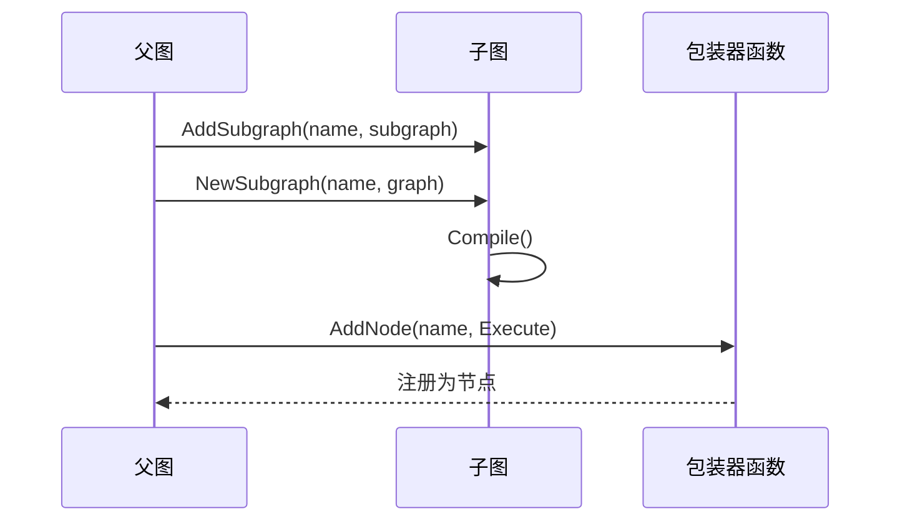

**图表来源**
- [graph/subgraph.go](file://graph/subgraph.go#L38-L47)

#### 方法二：使用构建器函数

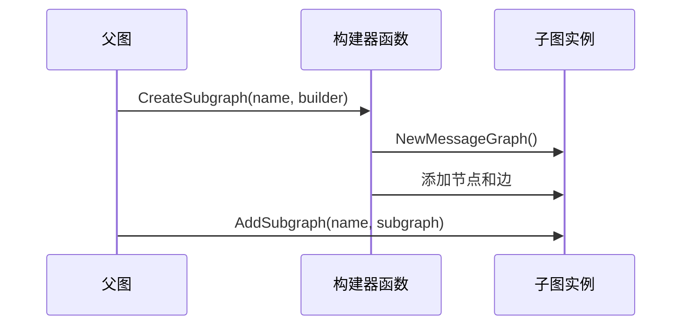

**图表来源**
- [graph/subgraph.go](file://graph/subgraph.go#L49-L54)

### 子图生命周期

子图的完整生命周期包括编译、执行和状态管理：

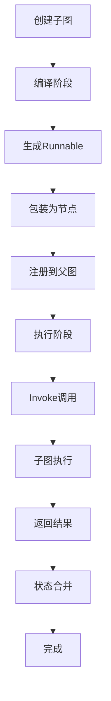

**图表来源**
- [graph/subgraph.go](file://graph/subgraph.go#L15-L36)

**章节来源**
- [graph/subgraph.go](file://graph/subgraph.go#L15-L54)

## 状态传递机制

### 状态共享原理

子图与父图之间的状态传递是通过简单的参数传递实现的：

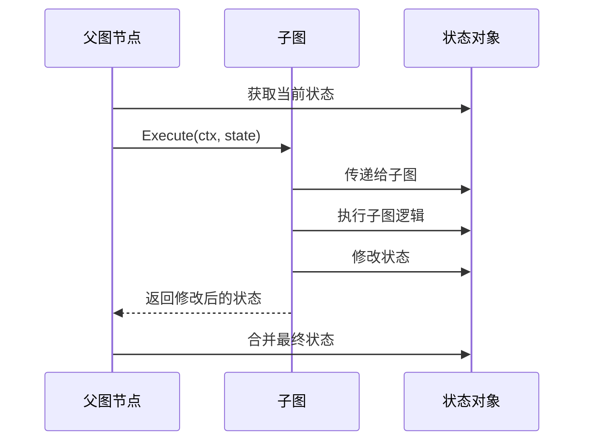

**图表来源**
- [graph/subgraph.go](file://graph/subgraph.go#L30-L36)

### 状态类型支持

LangGraph Go 支持多种状态类型的传递：

| 状态类型 | 描述 | 使用场景 |
|---------|------|----------|
| `map[string]interface{}` | 动态键值对 | 通用状态传递 |
| 自定义结构体 | 类型安全的状态 | 强类型应用 |
| 基础类型 | 简单数据传递 | 标量值处理 |

### 状态验证与转换

虽然 LangGraph Go 本身不强制状态验证，但可以通过以下方式实现：

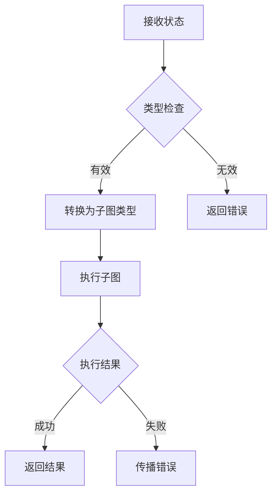

**章节来源**
- [graph/schema.go](file://graph/schema.go#L1-L186)

## 调用协议与执行流程

### 执行协议

子图的执行遵循标准的节点调用协议：

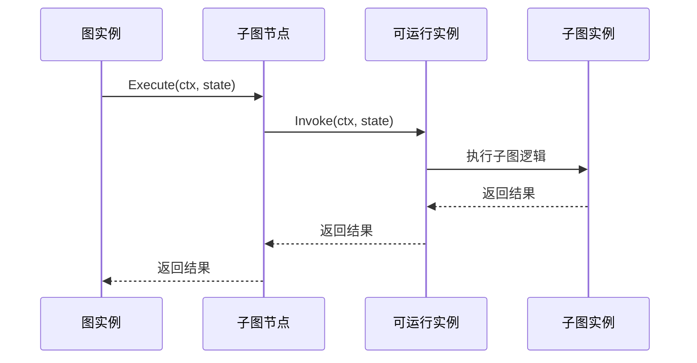

**图表来源**
- [graph/subgraph.go](file://graph/subgraph.go#L30-L36)

### 条件路由子图

LangGraph Go 还支持基于条件的子图路由：

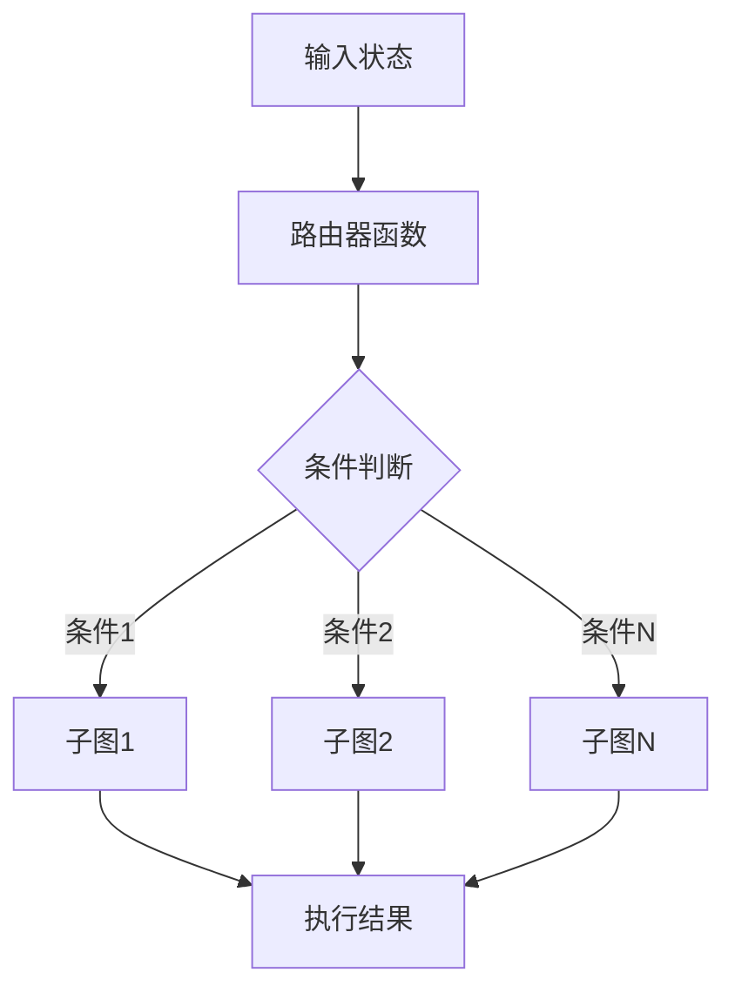

**图表来源**
- [graph/subgraph.go](file://graph/subgraph.go#L173-L199)

**章节来源**
- [graph/subgraph.go](file://graph/subgraph.go#L30-L199)

## 错误传播规则

### 错误处理层次

子图系统实现了分层的错误处理机制：

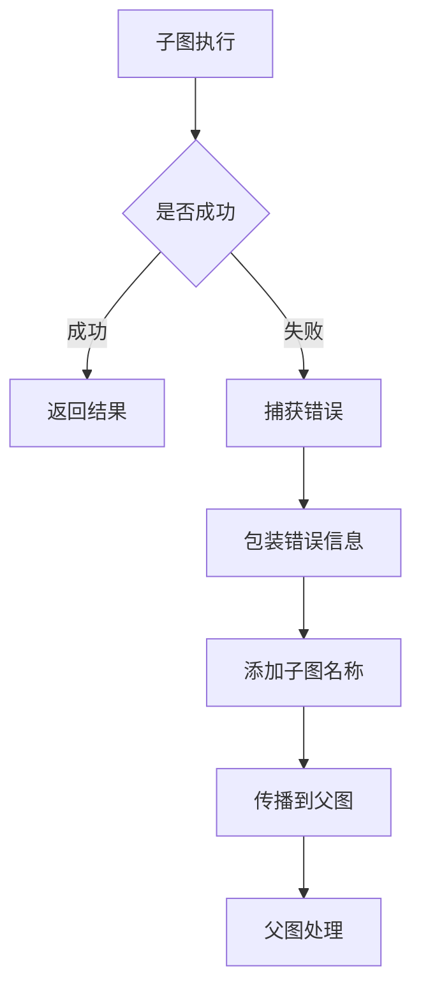

**图表来源**
- [graph/subgraph.go](file://graph/subgraph.go#L31-L35)

### 错误类型与处理

| 错误类型 | 处理方式 | 示例场景 |
|---------|----------|----------|
| 编译错误 | 立即返回 | 子图配置错误 |
| 执行错误 | 包装后传播 | 子图内部逻辑错误 |
| 状态错误 | 验证后处理 | 状态格式不匹配 |

### 错误恢复策略

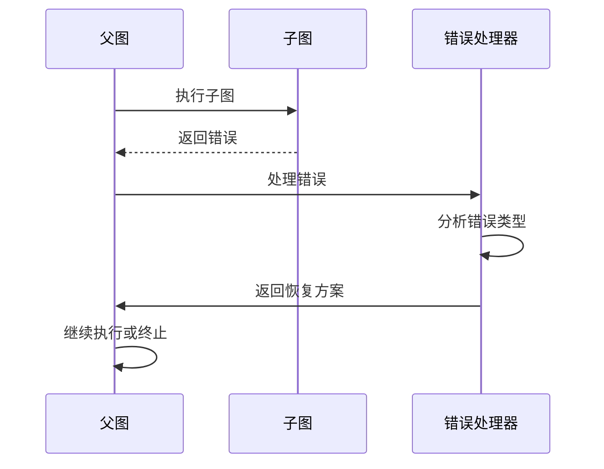

**章节来源**
- [graph/subgraph.go](file://graph/subgraph.go#L18-L36)

## 分层架构示例

### 文档处理工作流

以文档处理为例，展示分层架构的设计：

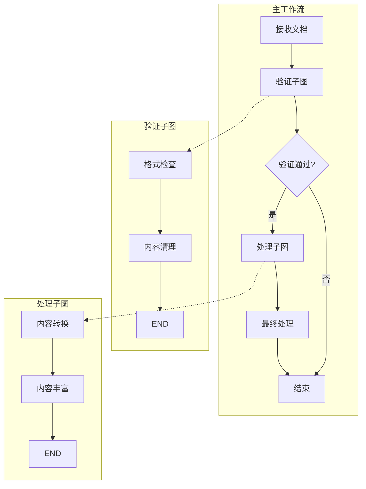

**图表来源**
- [examples/subgraph/main.go](file://examples/subgraph/main.go#L18-L100)

### 状态流转示例

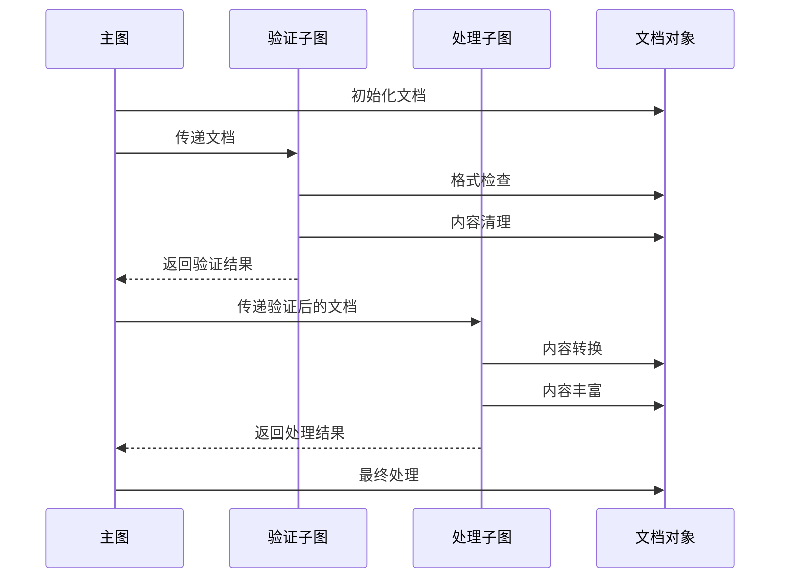

**图表来源**
- [examples/subgraph/main.go](file://examples/subgraph/main.go#L108-L129)

**章节来源**
- [examples/subgraph/main.go](file://examples/subgraph/main.go#L1-L166)

## 子图复用策略

### 复用模式分类

LangGraph Go 支持多种子图复用模式：

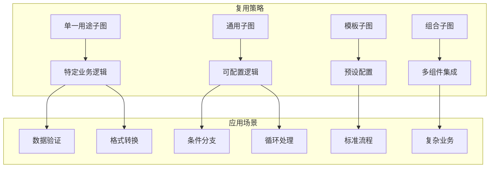

### 复用最佳实践

| 实践原则 | 描述 | 实现要点 |
|---------|------|----------|
| 单一职责 | 每个子图专注一个功能 | 清晰的边界定义 |
| 参数化设计 | 支持配置和定制 | 接口标准化 |
| 版本兼容 | 保持向后兼容性 | API稳定性 |
| 文档完善 | 提供详细的使用说明 | 示例和测试 |

### 复用示例

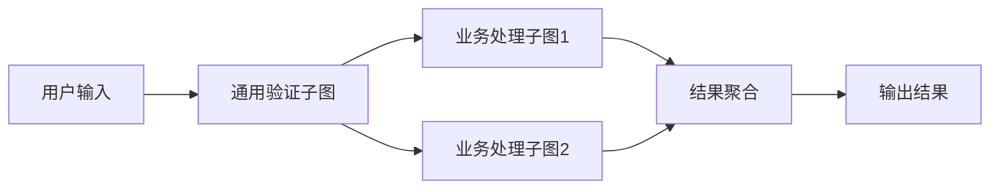

**章节来源**
- [examples/subgraphs/main.go](file://examples/subgraphs/main.go#L1-L59)

## 版本管理问题

### 版本控制挑战

子图的版本管理面临以下挑战：

```mermaid
mindmap
root((版本管理挑战))
兼容性问题
API变更
状态结构变化
行为改变
性能影响
编译开销
内存占用
执行效率
测试复杂度
回归测试
集成测试
兼容性测试
维护成本
文档更新
迁移指南
社区支持
```

### 版本管理策略

| 策略类型 | 适用场景 | 实施方法 |
|---------|----------|----------|
| 语义版本控制 | 大规模项目 | MAJOR.MINOR.PATCH |
| 特性标志 | 渐进式发布 | 功能开关 |
| 双版本并存 | 迁移期 | 版本适配器 |
| 渐进式废弃 | 长期维护 | 警告机制 |

### 迁移路径规划

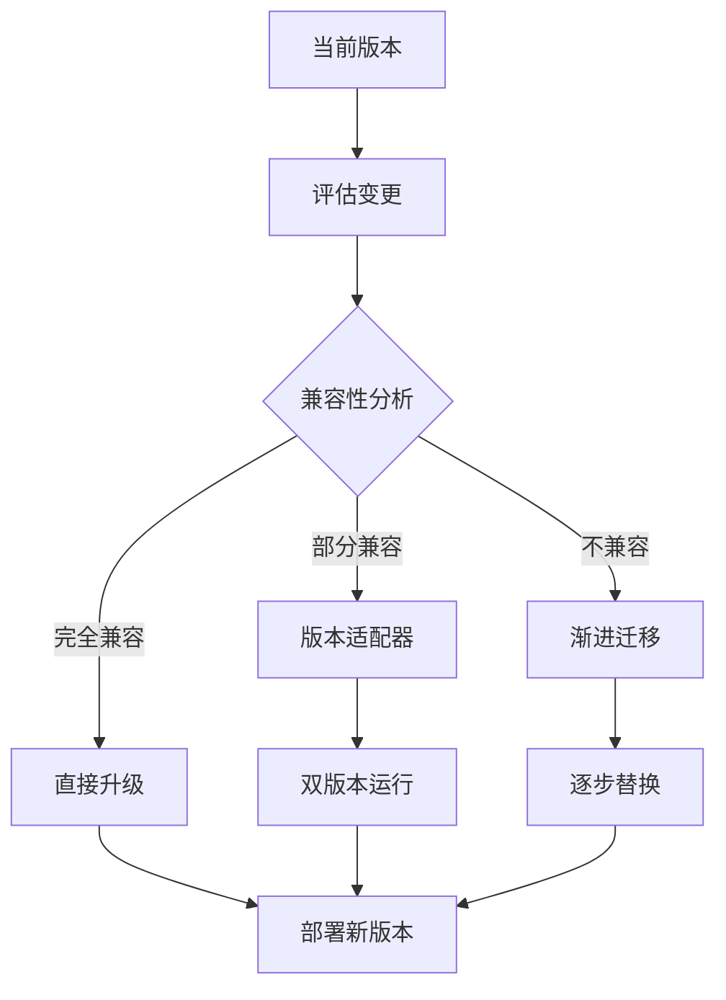

## 高级特性

### 递归子图

LangGraph Go 支持递归执行的子图：

```mermaid
classDiagram
class RecursiveSubgraph {
+string name
+MessageGraph graph
+int maxDepth
+func condition
+Execute(ctx, state) interface{}
+executeRecursive(ctx, state, depth) interface{}
}
note for RecursiveSubgraph "支持深度限制和条件控制"
```

**图表来源**
- [graph/subgraph.go](file://graph/subgraph.go#L108-L114)

### 复合图功能

复合图提供了更灵活的子图组合能力：

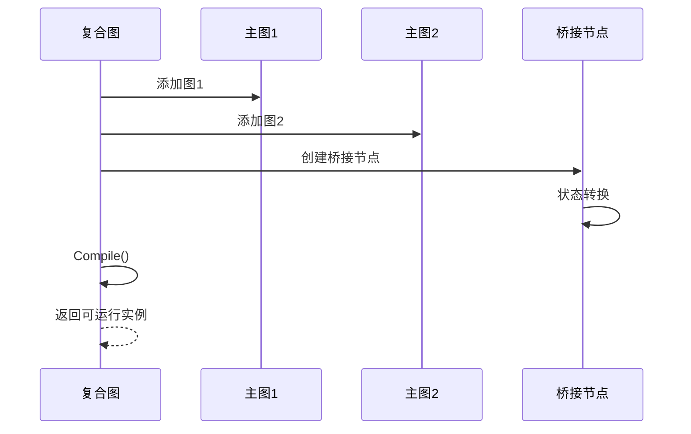

**图表来源**
- [graph/subgraph.go](file://graph/subgraph.go#L56-L106)

**章节来源**
- [graph/subgraph.go](file://graph/subgraph.go#L108-L199)

## 最佳实践

### 设计原则

1. **单一职责原则**：每个子图应该专注于一个特定的功能领域
2. **接口一致性**：保持子图间接口的一致性和可预测性
3. **错误处理优先**：在子图层面就处理好各种异常情况
4. **性能考虑**：避免过度嵌套和不必要的状态复制

### 开发建议

```mermaid
flowchart TD
A[需求分析] --> B[子图拆分]
B --> C[接口设计]
C --> D[实现开发]
D --> E[单元测试]
E --> F[集成测试]
F --> G[性能优化]
G --> H[文档编写]
H --> I[版本发布]
I --> J[监控反馈]
J --> A
```

### 常见陷阱

| 陷阱类型 | 描述 | 解决方案 |
|---------|------|----------|
| 循环依赖 | 子图间形成循环引用 | 使用依赖注入或事件驱动 |
| 状态污染 | 子图修改全局状态 | 使用不可变状态或深拷贝 |
| 性能瓶颈 | 过度嵌套导致性能下降 | 优化嵌套层级和状态传递 |
| 错误掩盖 | 子图错误被父图忽略 | 实现完善的错误传播机制 |

### 测试策略

```mermaid
graph TB
subgraph "测试层次"
A[单元测试] --> A1[子图功能测试]
B[集成测试] --> B1[父子图交互测试]
C[端到端测试] --> C1[完整工作流测试]
D[性能测试] --> D1[并发执行测试]
end
subgraph "测试工具"
A1 --> E[Mock框架]
B1 --> F[测试容器]
C1 --> G[真实环境]
D1 --> H[性能分析器]
end
```

## 总结

LangGraph Go 的子图功能为构建复杂工作流提供了强大而灵活的解决方案。通过模块化设计、状态共享和错误传播等机制，开发者可以创建出既可复用又易于维护的业务逻辑。

### 核心优势

1. **模块化架构**：支持将复杂系统分解为可管理的组件
2. **状态一致性**：提供透明的状态传递和共享机制
3. **执行灵活性**：支持同步、异步和条件执行模式
4. **错误处理**：完善的错误传播和恢复机制

### 应用场景

- **微服务架构**：将业务逻辑分解为独立的服务组件
- **工作流引擎**：构建复杂的业务流程管理系统
- **数据处理管道**：实现多阶段的数据转换和处理
- **AI 应用**：组合多个 AI 模块形成完整的解决方案

### 发展方向

随着 LangGraph Go 的持续发展，子图功能将在以下方面得到进一步增强：

- 更丰富的内置子图类型
- 更好的性能优化和内存管理
- 更完善的调试和监控工具
- 更强的类型安全和验证机制

通过合理运用子图功能，开发者可以构建出更加优雅、可维护和可扩展的应用系统。