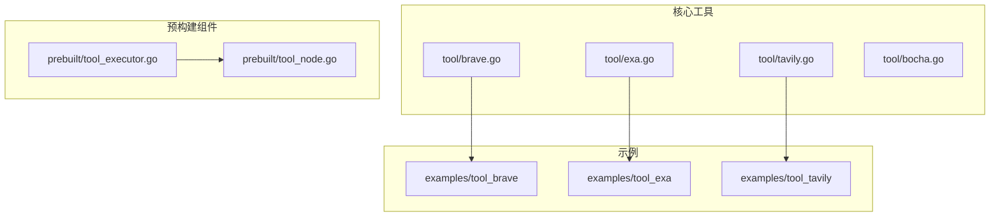
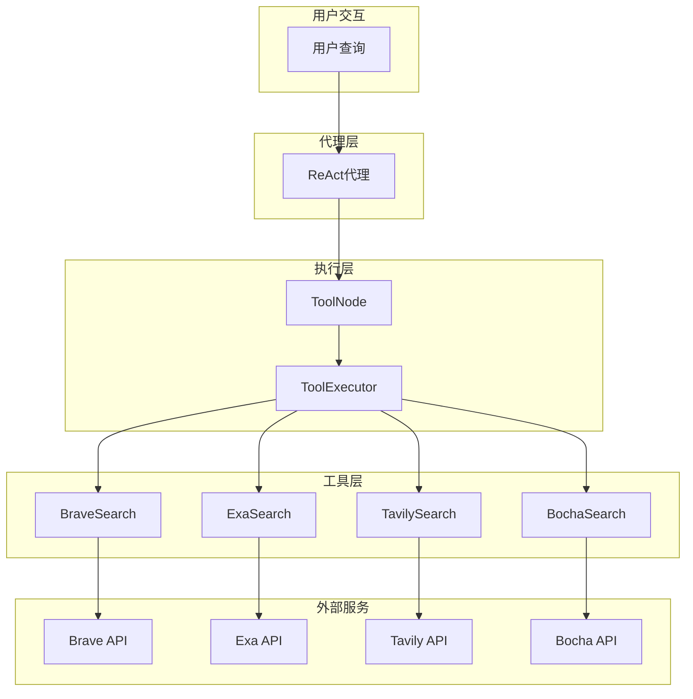
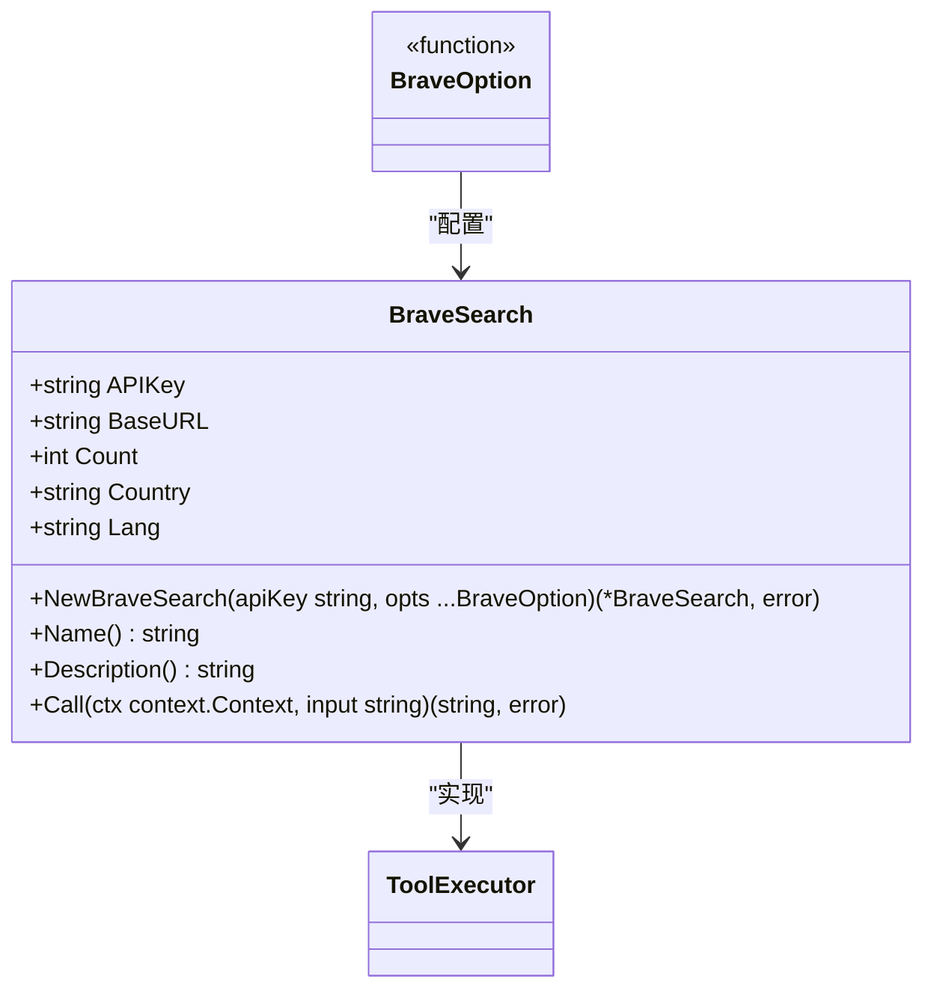
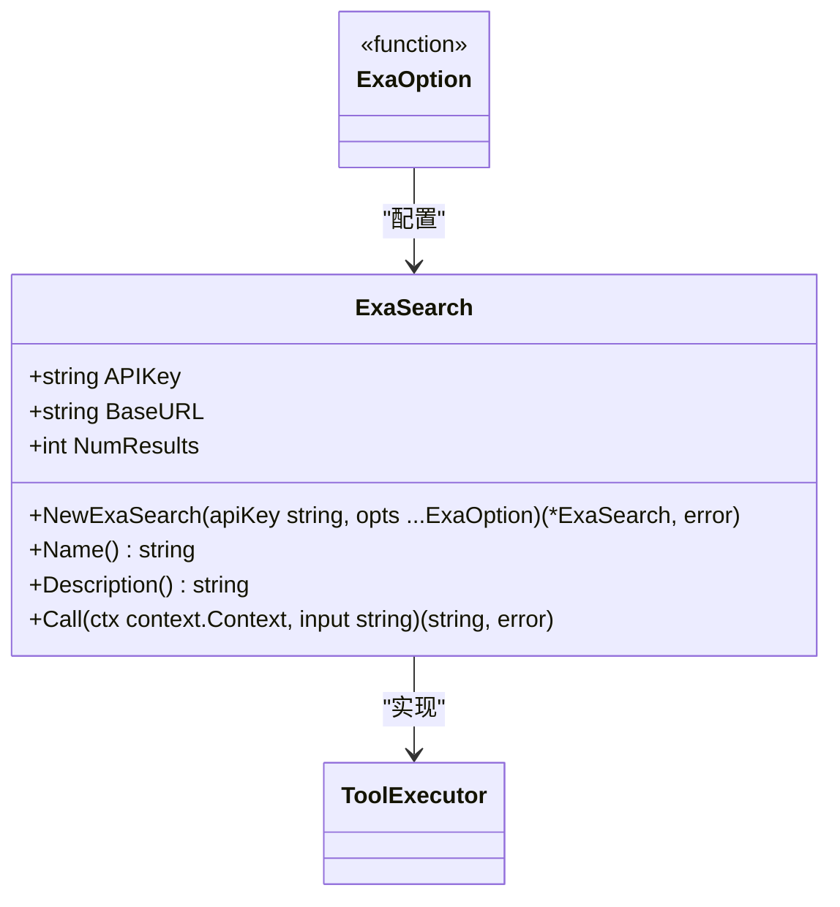
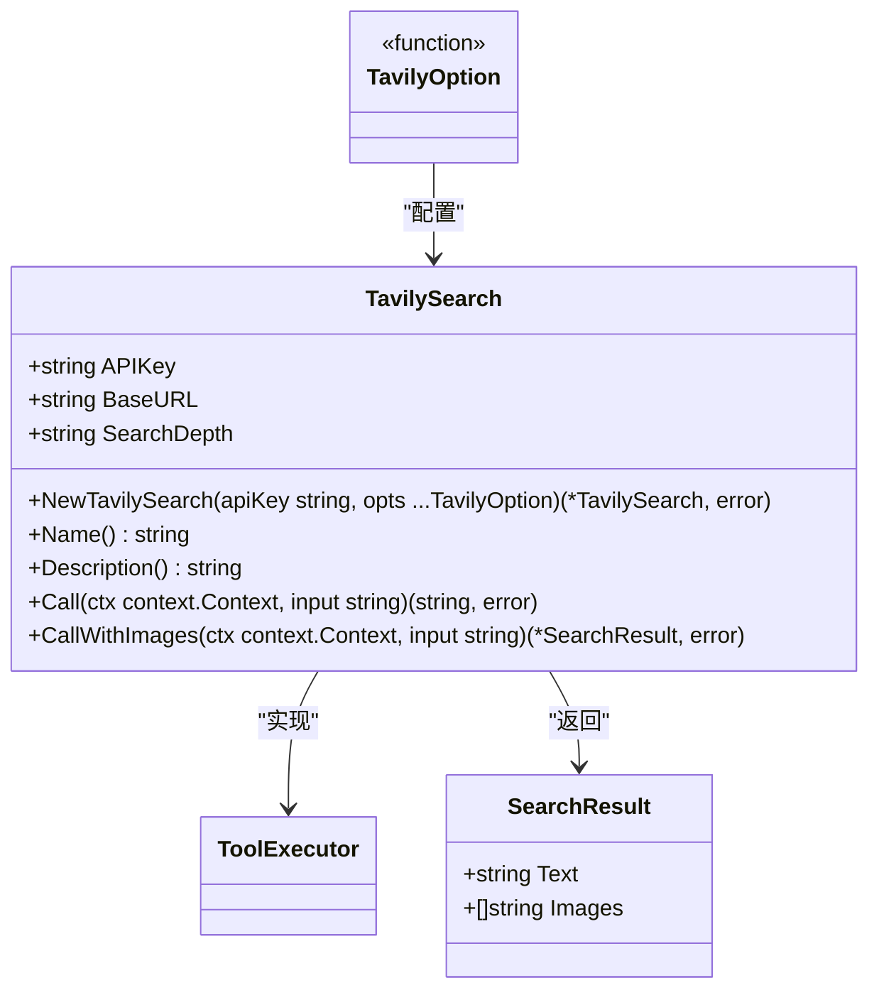
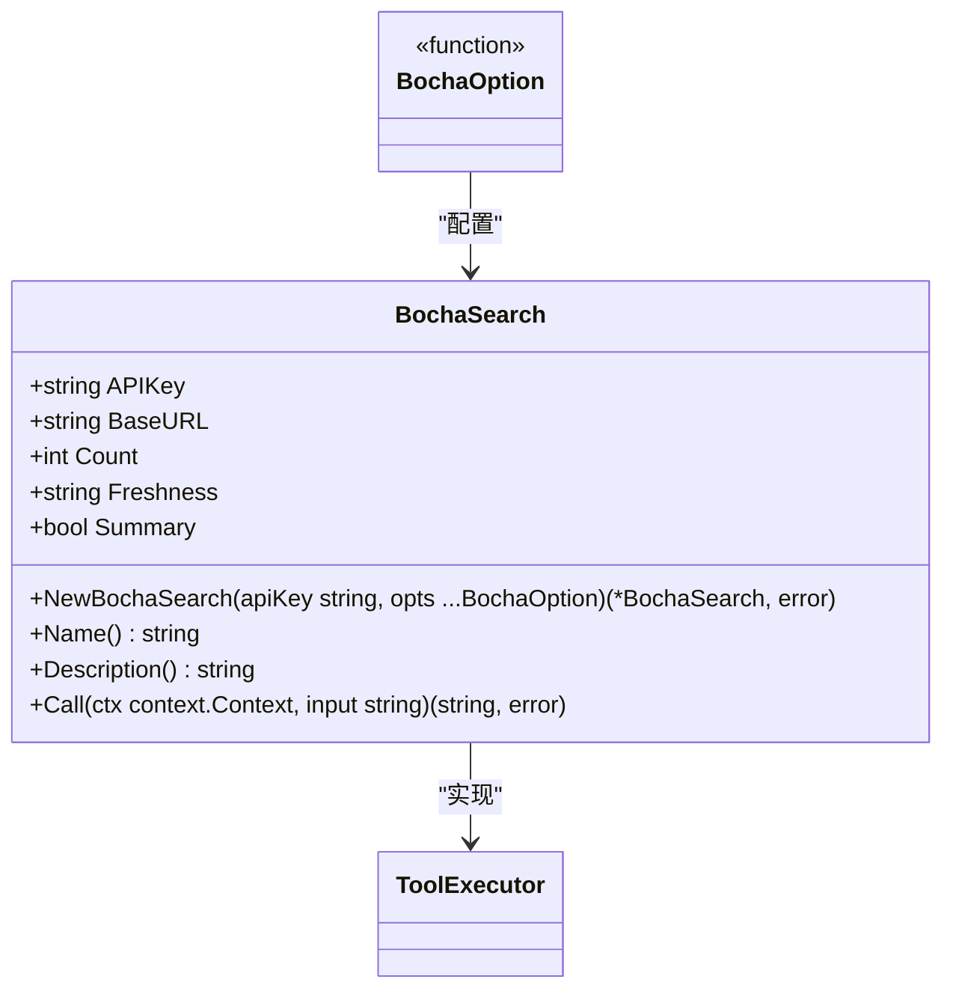
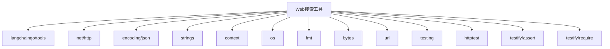

# Web搜索工具

<cite>
**本文档中引用的文件**  
- [brave.go](file://tool/brave.go)
- [exa.go](file://tool/exa.go)
- [tavily.go](file://tool/tavily.go)
- [bocha.go](file://tool/bocha.go)
- [tool_test.go](file://tool/tool_test.go)
- [main.go](file://examples/tool_brave/main.go)
- [main.go](file://examples/tool_exa/main.go)
- [main.go](file://examples/tool_tavily/main.go)
- [README.md](file://examples/tool_brave/README.md)
- [README.md](file://examples/tool_exa/README.md)
- [README.md](file://examples/tool_tavily/README.md)
- [tool_executor.go](file://prebuilt/tool_executor.go)
- [tool_node.go](file://prebuilt/tool_node.go)
- [prompts.go](file://showcases/BettaFish/query_engine/prompts.go)
</cite>

## 目录
1. [简介](#简介)
2. [项目结构](#项目结构)
3. [核心组件](#核心组件)
4. [架构概述](#架构概述)
5. [详细组件分析](#详细组件分析)
6. [依赖分析](#依赖分析)
7. [性能考虑](#性能考虑)
8. [故障排除指南](#故障排除指南)
9. [结论](#结论)

## 简介
Web搜索工具是LangGraphGo框架中的关键功能，允许AI代理通过集成多种搜索API来访问实时网络信息。这些工具使代理能够回答需要最新数据的问题，执行研究任务，并为用户提供基于当前信息的响应。本文件详细介绍了LangGraphGo中实现的四种主要Web搜索工具：Brave Search、Exa Search、Tavily Search和Bocha Search，以及它们如何与ReAct代理框架集成。

## 项目结构
Web搜索工具在LangGraphGo代码库中组织良好，主要位于`tool`目录下。每个搜索服务都有一个专用的Go文件，实现了统一的工具接口。示例代码位于`examples`目录中，按工具类型分组，提供了如何在实际应用中使用这些工具的清晰指导。



**图源**
- [brave.go](file://tool/brave.go)
- [exa.go](file://tool/exa.go)
- [tavily.go](file://tool/tavily.go)
- [bocha.go](file://tool/bocha.go)
- [tool_executor.go](file://prebuilt/tool_executor.go)
- [tool_node.go](file://prebuilt/tool_node.go)

**节源**
- [tool](file://tool)
- [examples](file://examples)
- [prebuilt](file://prebuilt)

## 核心组件
Web搜索工具的核心组件包括四个主要的搜索客户端（Brave、Exa、Tavily和Bocha），它们都实现了`tools.Tool`接口。这些工具通过`prebuilt`包中的`ToolExecutor`和`ToolNode`与LangGraphGo的代理系统集成。每个工具都设计为可配置，支持自定义API端点、结果数量和其他特定于服务的参数。

**节源**
- [brave.go](file://tool/brave.go#L13-L159)
- [exa.go](file://tool/exa.go#L13-L128)
- [tavily.go](file://tool/tavily.go#L13-L194)
- [bocha.go](file://tool/bocha.go#L13-L197)
- [tool_executor.go](file://prebuilt/tool_executor.go#L10-L84)
- [tool_node.go](file://prebuilt/tool_node.go#L12-L108)

## 架构概述
Web搜索工具的架构基于模块化设计，允许轻松集成新的搜索服务。工具层负责与外部API通信，而执行器层处理工具调用的调度和执行。代理层使用ReAct模式决定何时调用哪个工具，从而创建一个能够进行推理和行动的智能系统。



**图源**
- [tool_node.go](file://prebuilt/tool_node.go#L12-L108)
- [tool_executor.go](file://prebuilt/tool_executor.go#L10-L84)
- [brave.go](file://tool/brave.go#L13-L159)
- [exa.go](file://tool/exa.go#L13-L128)
- [tavily.go](file://tool/tavily.go#L13-L194)
- [bocha.go](file://tool/bocha.go#L13-L197)

## 详细组件分析

### Brave Search分析
Brave Search工具提供了一个隐私优先的搜索选项，使用Brave Search API来检索网络结果。它支持按国家和语言定制搜索，并允许用户指定返回的结果数量。



**图源**
- [brave.go](file://tool/brave.go#L13-L159)

**节源**
- [brave.go](file://tool/brave.go#L13-L159)
- [main.go](file://examples/tool_brave/main.go#L1-L82)
- [README.md](file://examples/tool_brave/README.md#L1-L55)

### Exa Search分析
Exa Search工具专为LLM优化，提供高质量的内容搜索。它使用POST请求发送查询，并返回包含文本内容的搜索结果，非常适合需要深入内容分析的应用。



**图源**
- [exa.go](file://tool/exa.go#L13-L128)

**节源**
- [exa.go](file://tool/exa.go#L13-L128)
- [main.go](file://examples/tool_exa/main.go#L1-L73)
- [README.md](file://examples/tool_exa/README.md#L1-L42)

### Tavily Search分析
Tavily Search工具提供全面、准确和可信的搜索结果，特别适合需要回答当前事件问题的应用。它支持基本和高级搜索深度，并且有一个特殊的方法可以返回带有图片的搜索结果。



**图源**
- [tavily.go](file://tool/tavily.go#L13-L194)

**节源**
- [tavily.go](file://tool/tavily.go#L13-L194)
- [main.go](file://examples/tool_tavily/main.go#L1-L78)
- [README.md](file://examples/tool_tavily/README.md#L1-L42)

### Bocha Search分析
Bocha Search工具由Bocha AI驱动，提供实时信息搜索。它支持按新鲜度过滤结果，并可以选择是否返回摘要，使其成为需要最新数据的应用的理想选择。



**图源**
- [bocha.go](file://tool/bocha.go#L13-L197)

**节源**
- [bocha.go](file://tool/bocha.go#L13-L197)

### 工具执行器分析
`ToolExecutor`和`ToolNode`是Web搜索工具与LangGraphGo代理系统集成的关键组件。`ToolExecutor`管理可用工具的注册和执行，而`ToolNode`作为图中的节点，处理工具调用的调度。

```mermaid
classDiagram
class ToolExecutor {
+map[string]tools.Tool tools
+NewToolExecutor(inputTools []tools.Tool) *ToolExecutor
+Execute(ctx context.Context, invocation ToolInvocation) (string, error)
+ExecuteMany(ctx context.Context, invocations []ToolInvocation) ([]string, error)
+ToolNode(ctx context.Context, state interface{}) (interface{}, error)
}
class ToolNode {
+*ToolExecutor Executor
+NewToolNode(inputTools []tools.Tool) *ToolNode
+Invoke(ctx context.Context, state interface{}) (interface{}, error)
}
class ToolInvocation {
+string Tool
+string ToolInput
}
ToolNode --> ToolExecutor : "使用"
ToolExecutor --> ToolInvocation : "接受"
```

**图源**
- [tool_executor.go](file://prebuilt/tool_executor.go#L10-L84)
- [tool_node.go](file://prebuilt/tool_node.go#L12-L108)

**节源**
- [tool_executor.go](file://prebuilt/tool_executor.go#L10-L84)
- [tool_node.go](file://prebuilt/tool_node.go#L12-L108)

## 依赖分析
Web搜索工具依赖于`github.com/tmc/langchaingo/tools`接口来确保与LangGraphGo框架的兼容性。它们还依赖于标准库中的`net/http`包来处理HTTP请求，以及`encoding/json`包来处理JSON序列化。测试文件显示了对`github.com/stretchr/testify/assert`和`github.com/stretchr/testify/require`的依赖，用于编写断言和测试。



**图源**
- [brave.go](file://tool/brave.go#L3-L11)
- [exa.go](file://tool/exa.go#L3-L11)
- [tavily.go](file://tool/tavily.go#L3-L11)
- [bocha.go](file://tool/bocha.go#L3-L11)
- [tool_test.go](file://tool/tool_test.go#L3-L12)

**节源**
- [brave.go](file://tool/brave.go#L3-L11)
- [exa.go](file://tool/exa.go#L3-L11)
- [tavily.go](file://tool/tavily.go#L3-L11)
- [bocha.go](file://tool/bocha.go#L3-L11)
- [tool_test.go](file://tool/tool_test.go#L3-L12)

## 性能考虑
Web搜索工具的性能主要受外部API响应时间和网络延迟的影响。为了优化性能，建议使用连接池和适当的超时设置。此外，缓存频繁查询的结果可以显著减少响应时间并降低API使用成本。工具的并发执行能力也允许并行处理多个搜索请求，从而提高整体吞吐量。

## 故障排除指南
在使用Web搜索工具时，最常见的问题是API密钥未正确设置。确保相应的环境变量（如`BRAVE_API_KEY`、`EXA_API_KEY`等）已正确配置。如果遇到连接问题，请检查网络连接和防火墙设置。对于解析错误，验证API响应格式是否与工具期望的格式匹配。测试文件提供了模拟服务器的示例，可用于在不依赖外部服务的情况下测试工具功能。

**节源**
- [tool_test.go](file://tool/tool_test.go#L34-L203)
- [main.go](file://examples/tool_brave/main.go#L18-L24)
- [main.go](file://examples/tool_exa/main.go#L18-L23)
- [main.go](file://examples/tool_tavily/main.go#L18-L23)

## 结论
LangGraphGo的Web搜索工具提供了一套强大而灵活的功能，使AI代理能够访问实时网络信息。通过支持多种搜索服务和可配置选项，这些工具可以适应各种应用场景。其模块化架构和与ReAct代理框架的紧密集成使得开发复杂的、能够进行推理和行动的AI系统成为可能。随着新搜索服务的不断出现，这种设计也便于扩展和集成。