# 并行执行

<cite>
**本文档中引用的文件**
- [examples/parallel_execution/main.go](file://examples/parallel_execution/main.go)
- [examples/parallel_execution/README.md](file://examples/parallel_execution/README.md)
- [graph/parallel.go](file://graph/parallel.go)
- [graph/parallel_test.go](file://graph/parallel_test.go)
- [graph/state_graph.go](file://graph/state_graph.go)
- [graph/schema.go](file://graph/schema.go)
- [graph/parallel_execution_test.go](file://graph/parallel_execution_test.go)
</cite>

## 目录
1. [简介](#简介)
2. [项目结构](#项目结构)
3. [核心组件](#核心组件)
4. [架构概览](#架构概览)
5. [详细组件分析](#详细组件分析)
6. [依赖关系分析](#依赖关系分析)
7. [性能考虑](#性能考虑)
8. [故障排除指南](#故障排除指南)
9. [结论](#结论)

## 简介

LangGraphGo 的并行执行功能允许在图中同时运行多个节点，显著提升处理效率。本教程基于 `parallel_execution` 示例，深入解释如何在图中实现并行任务执行，包括并行节点的声明方式、同步点的处理机制以及结果聚合策略。

并行执行的核心思想是利用多核处理器的优势，通过同时运行多个独立的任务来减少整体执行时间。LangGraphGo 提供了多种并行执行模式，包括简单的并行节点组、MapReduce 模式以及经典的扇出-扇入（Fan-out/Fan-in）模式。

## 项目结构

并行执行功能主要分布在以下关键文件中：

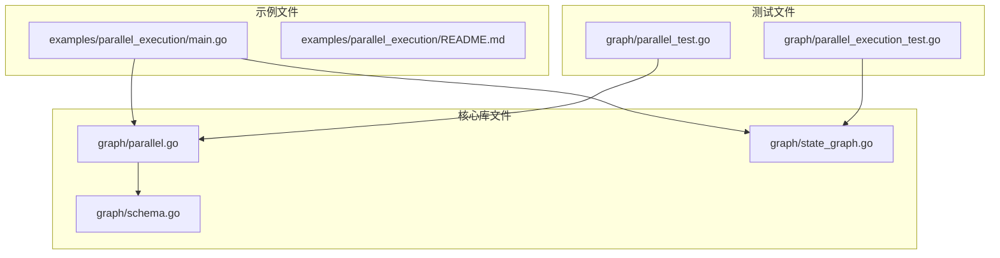

**图表来源**
- [examples/parallel_execution/main.go](file://examples/parallel_execution/main.go#L1-L97)
- [graph/parallel.go](file://graph/parallel.go#L1-L178)
- [graph/state_graph.go](file://graph/state_graph.go#L1-L200)

**章节来源**
- [examples/parallel_execution/main.go](file://examples/parallel_execution/main.go#L1-L97)
- [examples/parallel_execution/README.md](file://examples/parallel_execution/README.md#L1-L16)

## 核心组件

### ParallelNode 结构体

`ParallelNode` 是并行执行的核心数据结构，负责管理一组可以同时执行的节点：

```mermaid
classDiagram
class ParallelNode {
+[]Node nodes
+string name
+Execute(ctx, state) (interface{}, error)
}
class Node {
+string Name
+func Function
}
class MessageGraph {
+AddParallelNodes(groupName, nodes)
+FanOutFanIn(source, workers, collector, workerFuncs, collectFunc)
}
ParallelNode --> Node : "包含多个"
MessageGraph --> ParallelNode : "使用"
```

**图表来源**
- [graph/parallel.go](file://graph/parallel.go#L9-L21)
- [graph/parallel.go](file://graph/parallel.go#L36-L82)

### 并行执行流程

并行执行遵循以下工作流程：

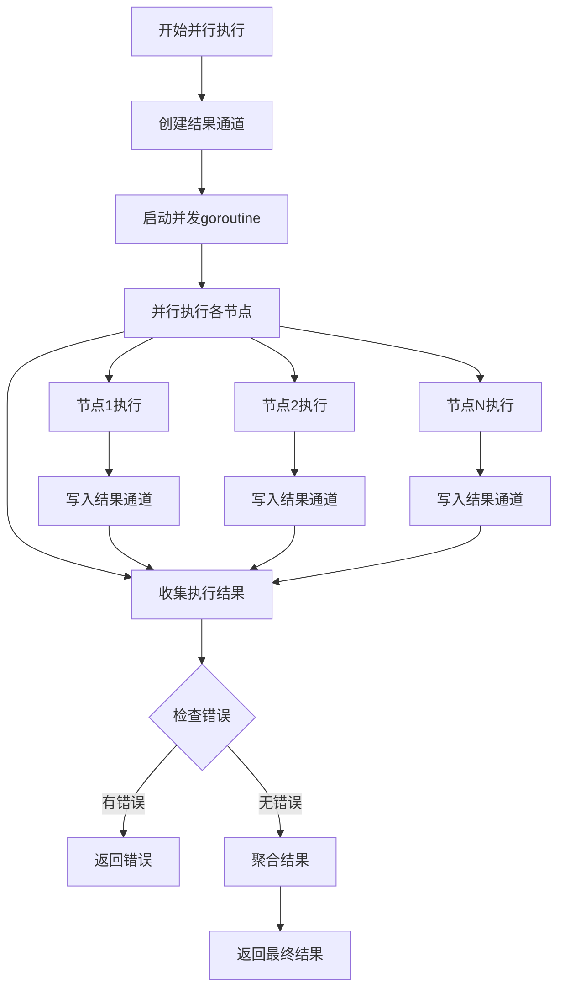

**图表来源**
- [graph/parallel.go](file://graph/parallel.go#L24-L82)

**章节来源**
- [graph/parallel.go](file://graph/parallel.go#L9-L82)

## 架构概览

LangGraphGo 的并行执行架构采用分层设计，从底层的并发控制到高层的用户接口：

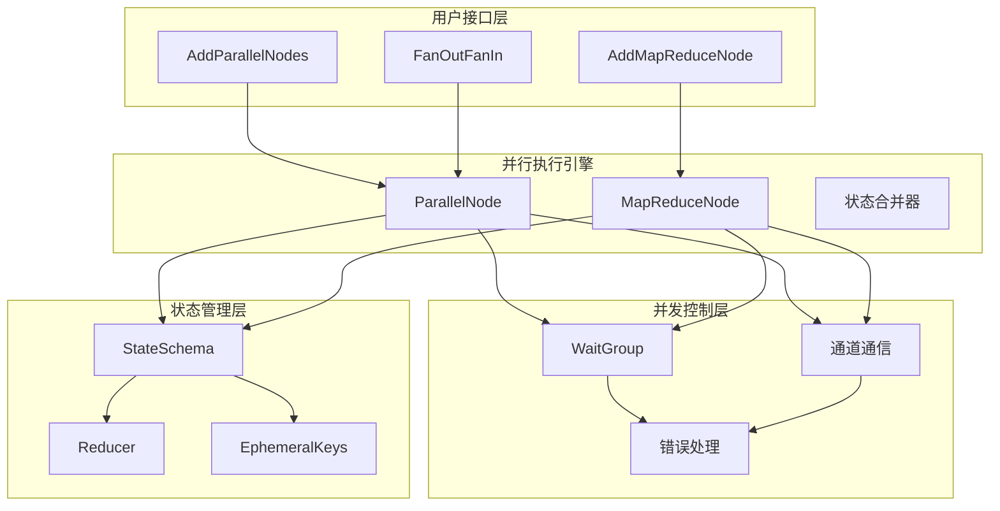

**图表来源**
- [graph/parallel.go](file://graph/parallel.go#L85-L177)
- [graph/state_graph.go](file://graph/state_graph.go#L10-L32)

## 详细组件分析

### 并行节点声明

在 LangGraphGo 中，可以通过多种方式声明并行节点：

#### 基础并行节点组

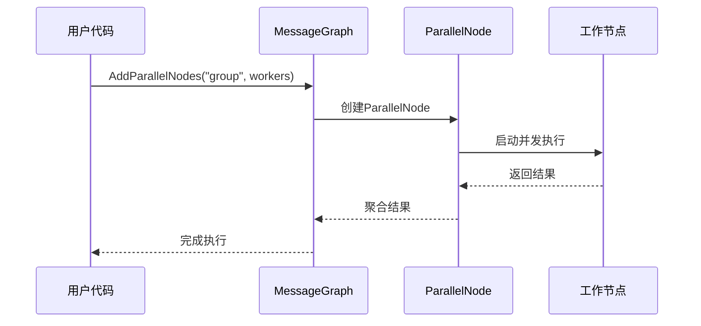

**图表来源**
- [graph/parallel.go](file://graph/parallel.go#L85-L98)

#### MapReduce 模式

MapReduce 模式提供了更高级的并行处理能力：

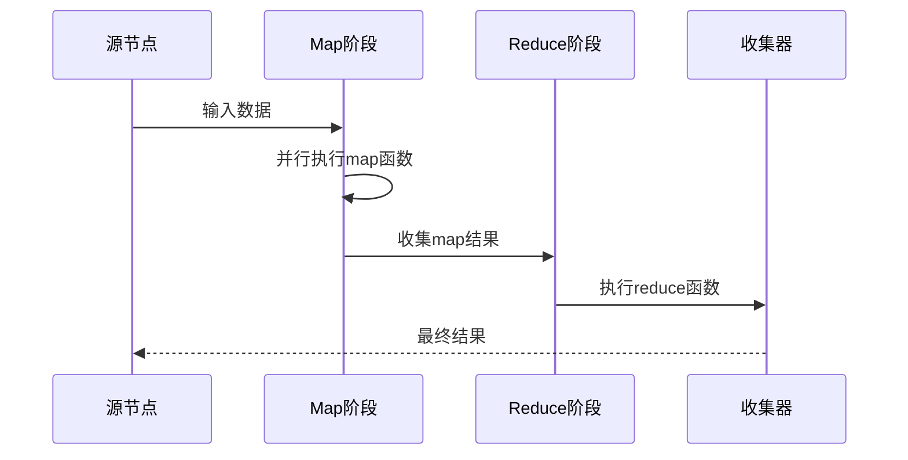

**图表来源**
- [graph/parallel.go](file://graph/parallel.go#L101-L131)

### 同步点处理机制

LangGraphGo 使用多种机制确保并行执行的正确同步：

#### WaitGroup 同步

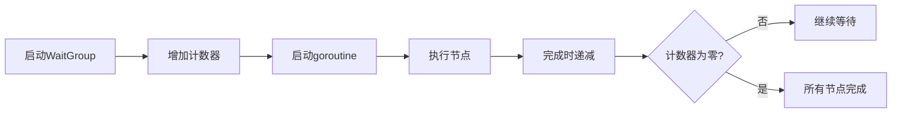

**图表来源**
- [graph/parallel.go](file://graph/parallel.go#L33-L64)

#### 错误传播机制

并行执行中的错误处理采用快速失败原则：

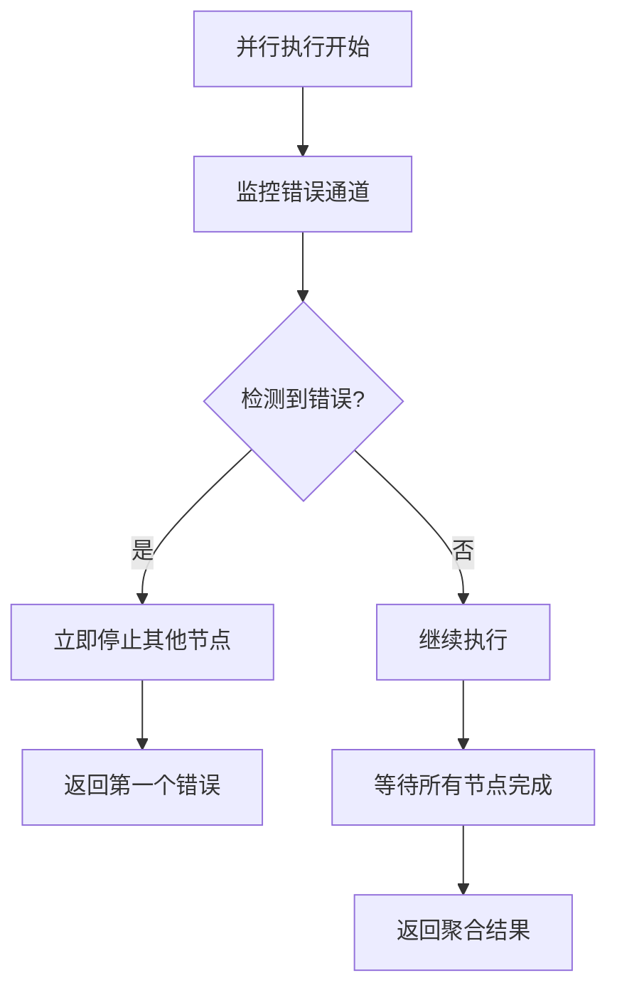

**图表来源**
- [graph/parallel.go](file://graph/parallel.go#L66-L79)

### 结果聚合策略

LangGraphGo 提供了灵活的结果聚合策略：

#### 默认聚合

默认情况下，所有并行节点的结果会被收集到一个数组中：

| 聚合类型 | 描述 | 使用场景 |
|---------|------|----------|
| 数组聚合 | 将所有结果按顺序收集到数组 | 多个独立任务的输出 |
| 映射聚合 | 按节点名称组织结果 | 需要区分不同节点输出 |
| 自定义聚合 | 使用用户提供的聚合函数 | 特殊业务逻辑需求 |

#### 状态 Schema 集成

并行执行与状态 Schema 紧密集成，支持复杂的状态更新：

```mermaid
classDiagram
class StateSchema {
<<interface>>
+Init() interface{}
+Update(current, new) (interface{}, error)
}
class MapSchema {
+map[string]Reducer Reducers
+map[string]bool EphemeralKeys
+RegisterReducer(key, reducer)
+Update(current, new) (interface{}, error)
}
class Reducer {
<<function>>
+func(current, new) (interface{}, error)
}
StateSchema <|-- MapSchema
MapSchema --> Reducer : "使用"
```

**图表来源**
- [graph/schema.go](file://graph/schema.go#L12-L186)

**章节来源**
- [graph/parallel.go](file://graph/parallel.go#L85-L177)
- [graph/schema.go](file://graph/schema.go#L12-L186)

### 扇出-扇入模式

扇出-扇入（Fan-out/Fan-in）是最常用的并行模式：

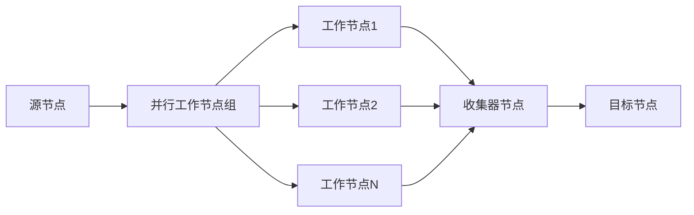

**图表来源**
- [graph/parallel.go](file://graph/parallel.go#L154-L177)

**章节来源**
- [graph/parallel.go](file://graph/parallel.go#L154-L177)

## 依赖关系分析

并行执行功能涉及多个模块的协作：

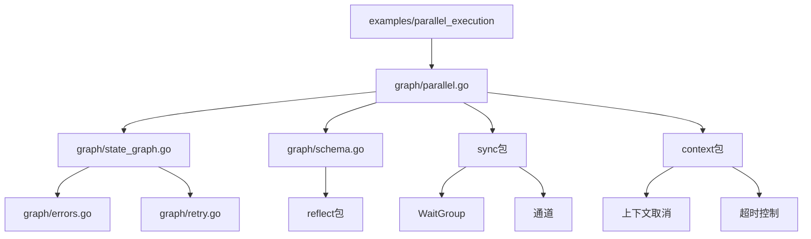

**图表来源**
- [examples/parallel_execution/main.go](file://examples/parallel_execution/main.go#L1-L10)
- [graph/parallel.go](file://graph/parallel.go#L1-L8)

**章节来源**
- [examples/parallel_execution/main.go](file://examples/parallel_execution/main.go#L1-L10)
- [graph/parallel.go](file://graph/parallel.go#L1-L8)

## 性能考虑

### 并发度优化

并行执行的性能取决于多个因素：

| 因素 | 影响 | 优化建议 |
|------|------|----------|
| CPU核心数 | 并发执行的最大限制 | 根据硬件配置调整并发度 |
| 任务复杂度 | 单个任务的执行时间 | 匹配任务复杂度与并发度 |
| 内存使用 | 并发任务的内存占用 | 监控内存使用情况 |
| 网络I/O | 异步操作的影响 | 使用异步I/O提高效率 |

### 资源竞争问题

并行执行可能引发资源竞争问题：

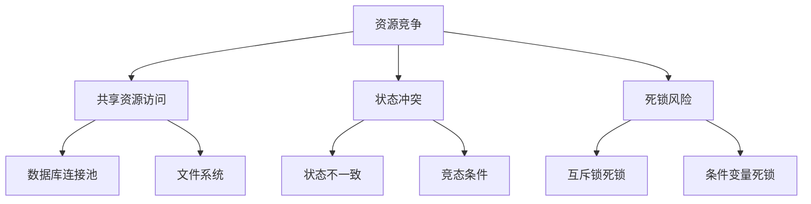

LangGraphGo 通过以下机制解决资源竞争问题：
- **状态隔离**：每个节点拥有独立的状态副本
- **原子操作**：使用状态 Schema 确保状态更新的原子性
- **错误恢复**：提供完善的错误处理和重试机制

## 故障排除指南

### 常见问题及解决方案

#### 并行执行超时

当并行任务执行时间过长时，可以通过设置上下文超时来解决：

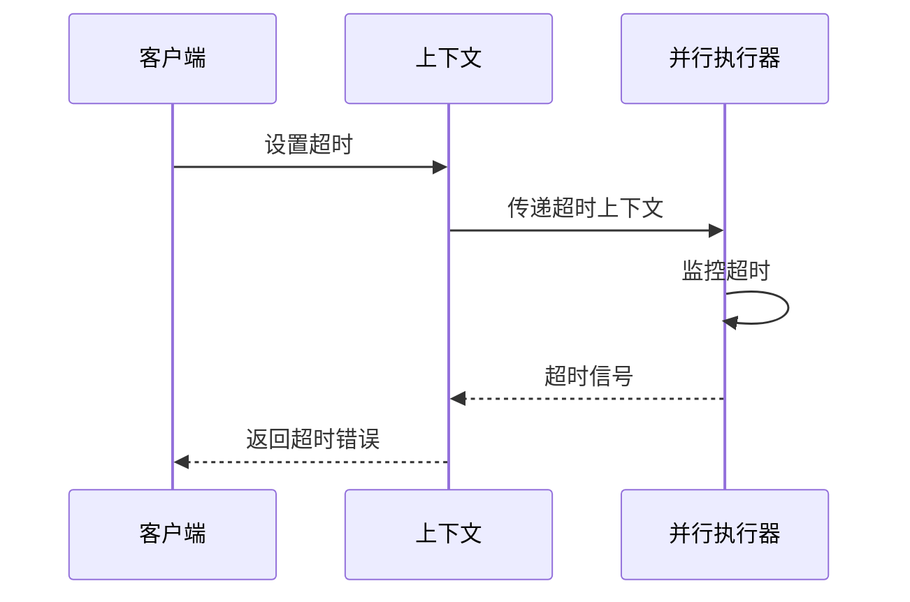

**图表来源**
- [graph/parallel_test.go](file://graph/parallel_test.go#L214-L263)

#### 内存泄漏问题

长时间运行的并行任务可能导致内存泄漏：

| 问题类型 | 症状 | 解决方案 |
|---------|------|----------|
| goroutine 泄漏 | 内存持续增长 | 正确使用 defer 和上下文取消 |
| 通道阻塞 | 程序挂起 | 实现超时和错误处理 |
| 状态累积 | 状态对象过大 | 使用状态清理机制 |

**章节来源**
- [graph/parallel_test.go](file://graph/parallel_test.go#L181-L263)

### 性能监控

建议实施以下监控措施：

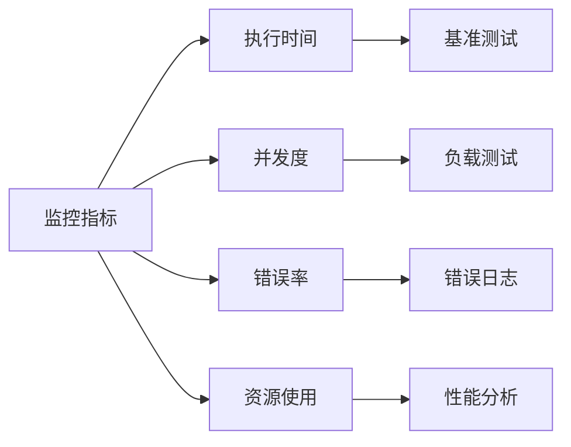

## 结论

LangGraphGo 的并行执行功能为构建高性能的图式应用程序提供了强大的基础设施。通过合理使用并行节点、MapReduce 模式和扇出-扇入架构，开发者可以显著提升应用程序的处理效率。

关键要点总结：

1. **并行节点声明**：使用 `AddParallelNodes` 方法轻松创建并行节点组
2. **同步机制**：内置的 WaitGroup 和错误处理确保正确的同步和错误传播
3. **状态管理**：与 StateSchema 的深度集成支持复杂的状态更新逻辑
4. **性能优化**：通过合理的并发度配置和资源管理获得最佳性能
5. **错误处理**：完善的错误处理和恢复机制保证系统的稳定性

并行执行功能不仅提升了处理效率，还为构建复杂的分布式工作流提供了坚实的基础。随着应用程序规模的增长，这些并行执行机制将成为提升系统性能的关键因素。