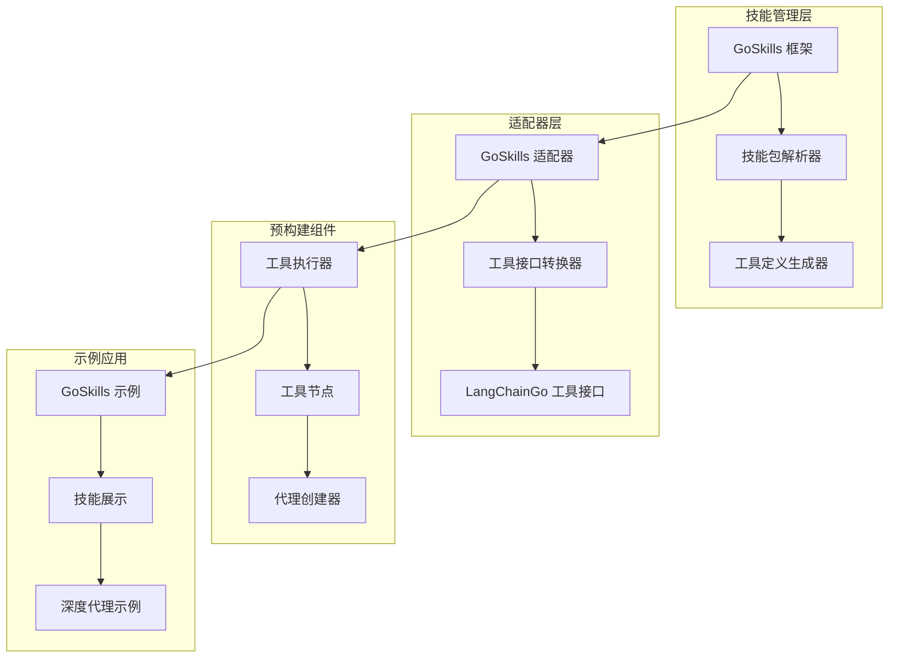
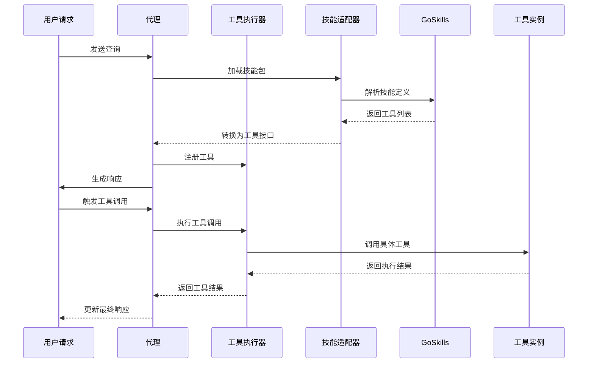
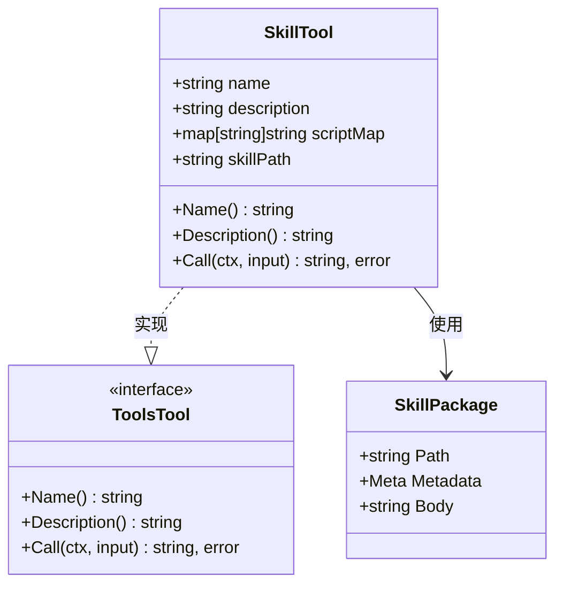
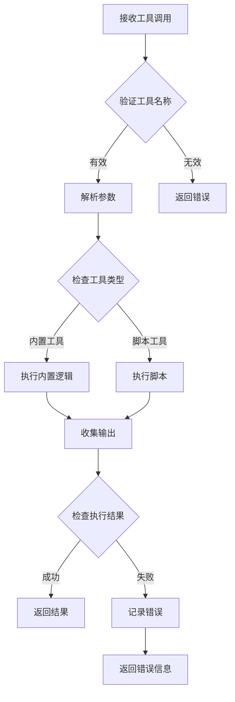
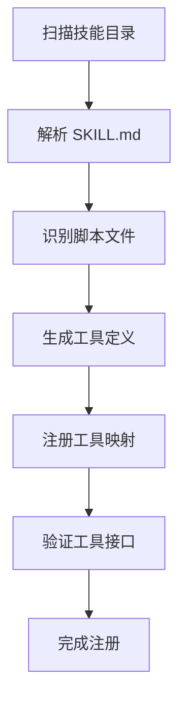
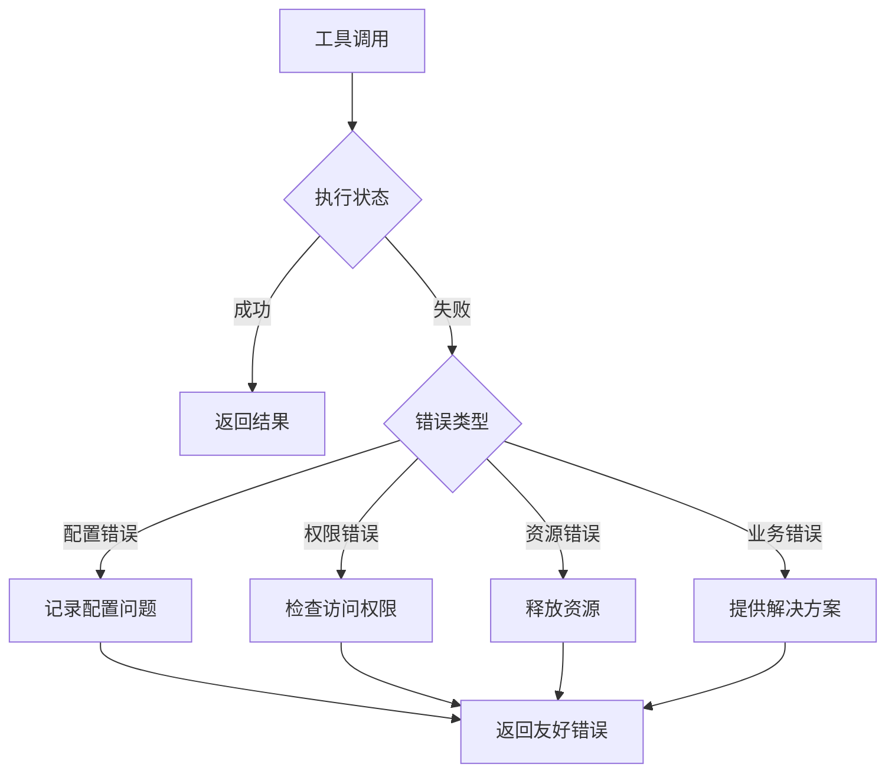

# 技能集成

<cite>
**本文档中引用的文件**
- [adapter/goskills/goskills.go](file://adapter/goskills/goskills.go)
- [examples/goskills_example/main.go](file://examples/goskills_example/main.go)
- [examples/goskills_example/skills/hello_world/SKILL.md](file://examples/goskills_example/skills/hello_world/SKILL.md)
- [examples/goskills_example/README_CN.md](file://examples/goskills_example/README_CN.md)
- [prebuilt/tool_executor.go](file://prebuilt/tool_executor.go)
- [prebuilt/tool_node.go](file://prebuilt/tool_node.go)
- [tool/exa.go](file://tool/exa.go)
- [tool/tavily.go](file://tool/tavily.go)
- [testdata/skills/.claude-plugin/marketplace.json](file://testdata/skills/.claude-plugin/marketplace.json)
- [testdata/skills/skill-creator/SKILL.md](file://testdata/skills/skill-creator/SKILL.md)
- [showcases/BettaFish/main.go](file://showcases/BettaFish/main.go)
- [showcases/deepagents/main.go](file://showcases/deepagents/main.go)
</cite>

## 目录
1. [简介](#简介)
2. [项目结构](#项目结构)
3. [核心组件](#核心组件)
4. [架构概览](#架构概览)
5. [详细组件分析](#详细组件分析)
6. [技能开发指南](#技能开发指南)
7. [集成最佳实践](#集成最佳实践)
8. [性能考虑](#性能考虑)
9. [故障排除指南](#故障排除指南)
10. [结论](#结论)

## 简介

LangGraphGo 的技能集成功能提供了一个强大而灵活的框架，用于将外部技能无缝集成到语言模型代理中。该系统通过 GoSkills 框架实现了技能的模块化管理和工具化接口，使开发者能够轻松扩展代理的能力，而无需编写复杂的自定义工具实现。

技能集成的核心价值在于：
- **模块化设计**：每个技能都是独立的可重用单元
- **标准化接口**：统一的工具接口确保兼容性
- **动态加载**：运行时动态发现和加载技能
- **类型安全**：强类型的参数传递和验证
- **扩展性强**：支持多种编程语言和工具类型

## 项目结构

LangGraphGo 的技能集成系统采用分层架构设计，主要包含以下核心模块：



**图表来源**
- [adapter/goskills/goskills.go](file://adapter/goskills/goskills.go#L1-L213)
- [prebuilt/tool_executor.go](file://prebuilt/tool_executor.go#L1-L84)

**章节来源**
- [adapter/goskills/goskills.go](file://adapter/goskills/goskills.go#L1-L213)
- [examples/goskills_example/main.go](file://examples/goskills_example/main.go#L1-L170)

## 核心组件

### GoSkills 适配器

GoSkills 适配器是连接 GoSkills 框架和 LangGraphGo 生态系统的关键组件。它提供了两个核心功能：

1. **技能到工具的转换** (`SkillsToTools`)
2. **MCP 工具的转换** (`MCPToTools`)

适配器的核心设计原则是保持向后兼容性和最小侵入性，同时提供丰富的功能扩展能力。

### 工具执行器

工具执行器负责管理工具的生命周期和执行流程。它提供了以下关键功能：

- **工具映射管理**：维护工具名称到具体实现的映射关系
- **并发安全**：支持并发工具调用
- **错误处理**：统一的错误处理和恢复机制
- **状态管理**：跟踪工具执行状态和结果

### 工具节点

工具节点是图执行中的核心组件，负责：
- **消息解析**：从 AI 消息中提取工具调用信息
- **参数验证**：验证工具调用参数的有效性
- **结果封装**：将工具执行结果封装为标准格式
- **状态更新**：更新图的状态以反映工具执行结果

**章节来源**
- [prebuilt/tool_executor.go](file://prebuilt/tool_executor.go#L1-L84)
- [prebuilt/tool_node.go](file://prebuilt/tool_node.go#L1-L108)

## 架构概览

技能集成系统采用事件驱动的架构模式，支持异步和同步两种执行模式：



**图表来源**
- [examples/goskills_example/main.go](file://examples/goskills_example/main.go#L55-L85)
- [prebuilt/tool_executor.go](file://prebuilt/tool_executor.go#L32-L49)

## 详细组件分析

### 技能适配器实现

技能适配器的核心是 `SkillTool` 结构体，它实现了 `tools.Tool` 接口：



**图表来源**
- [adapter/goskills/goskills.go](file://adapter/goskills/goskills.go#L16-L22)

适配器支持多种内置工具类型，包括：
- **脚本执行工具**：Python 和 Shell 脚本执行
- **文件操作工具**：读取和写入文件
- **搜索工具**：Web 搜索和信息检索
- **网络工具**：HTTP 请求和网页抓取

### 工具执行流程

工具执行采用流水线模式，支持链式调用和并行执行：



**图表来源**
- [adapter/goskills/goskills.go](file://adapter/goskills/goskills.go#L34-L164)

### 预构建代理集成

预构建代理通过工具节点实现技能集成：

```mermaid
classDiagram
class ToolNode {
+ToolExecutor Executor
+Invoke(ctx, state) interface{}, error
}
class ToolExecutor {
+map[string]Tool tools
+Execute(ctx, invocation) string, error
+ExecuteMany(ctx, invocations) []string, error
+ToolNode(ctx, state) interface{}, error
}
class CreateAgent {
+WithSystemMessage(message) Option
+WithStateModifier(modifier) Option
+WithTools(tools) Option
}
ToolNode --> ToolExecutor : 使用
CreateAgent --> ToolNode : 创建
```

**图表来源**
- [prebuilt/tool_node.go](file://prebuilt/tool_node.go#L12-L16)
- [prebuilt/tool_executor.go](file://prebuilt/tool_executor.go#L16-L19)

**章节来源**
- [adapter/goskills/goskills.go](file://adapter/goskills/goskills.go#L34-L164)
- [prebuilt/tool_executor.go](file://prebuilt/tool_executor.go#L1-L84)
- [prebuilt/tool_node.go](file://prebuilt/tool_node.go#L1-L108)

## 技能开发指南

### 技能结构规范

每个技能都必须遵循特定的目录结构和元数据规范：

```
skills/
├── skill-name/
│   ├── SKILL.md              # 技能元数据和描述
│   ├── scripts/              # 可选：脚本文件
│   │   ├── script1.py        # Python 脚本
│   │   ├── script2.sh        # Shell 脚本
│   │   └── ...               # 其他脚本
│   ├── references/           # 可选：参考文档
│   │   ├── api_reference.md  # API 参考
│   │   └── usage_guide.md    # 使用指南
│   └── assets/              # 可选：资源文件
│       ├── template.html     # 模板文件
│       └── example.png       # 示例图片
```

### 技能元数据格式

技能的元数据通过 YAML 头部定义：

```yaml
---
name: skill_name
description: 技能的简短描述
version: 1.0.0
license: MIT
---
```

### 脚本开发最佳实践

1. **参数验证**：始终验证输入参数的有效性
2. **错误处理**：提供详细的错误信息和恢复建议
3. **输出格式**：保持一致的输出格式
4. **安全性**：避免执行不受信任的代码
5. **性能优化**：合理控制资源使用

### 工具注册机制

技能适配器自动扫描 `scripts/` 目录并注册可用的工具：



**图表来源**
- [examples/goskills_example/main.go](file://examples/goskills_example/main.go#L45-L53)

**章节来源**
- [examples/goskills_example/skills/hello_world/SKILL.md](file://examples/goskills_example/skills/hello_world/SKILL.md#L1-L37)
- [testdata/skills/skill-creator/SKILL.md](file://testdata/skills/skill-creator/SKILL.md#L108-L163)

## 集成最佳实践

### 性能优化策略

1. **延迟加载**：仅在需要时加载技能
2. **缓存机制**：缓存频繁使用的工具结果
3. **并发控制**：限制并发工具调用数量
4. **资源管理**：及时释放不再需要的资源

### 错误处理模式



### 安全考虑

1. **输入验证**：严格验证所有输入参数
2. **沙箱执行**：在隔离环境中执行脚本
3. **权限控制**：限制工具的系统访问权限
4. **审计日志**：记录所有工具调用和修改

### 测试策略

1. **单元测试**：测试单个工具的功能
2. **集成测试**：测试工具间的协作
3. **端到端测试**：测试完整的技能流程
4. **性能测试**：评估工具执行性能

**章节来源**
- [examples/goskills_example/README_CN.md](file://examples/goskills_example/README_CN.md#L1-L123)

## 性能考虑

技能集成系统的性能主要受以下几个因素影响：

### 工具加载性能

- **技能包解析**：扫描和解析技能目录的时间
- **依赖检查**：验证脚本依赖和环境要求
- **缓存策略**：合理使用缓存减少重复加载

### 执行性能

- **并发度控制**：平衡并发执行和资源消耗
- **内存管理**：及时清理临时文件和对象
- **网络优化**：优化外部服务调用

### 扩展性设计

系统设计支持水平扩展，可以通过以下方式提升性能：

1. **分布式部署**：将技能分布到多个节点
2. **负载均衡**：智能分配工具调用请求
3. **监控告警**：实时监控系统性能指标

## 故障排除指南

### 常见问题及解决方案

| 问题类型 | 症状 | 可能原因 | 解决方案 |
|---------|------|----------|----------|
| 技能加载失败 | 技能未出现在工具列表中 | SKILL.md 格式错误 | 检查 YAML 头部语法 |
| 脚本执行失败 | 工具调用返回错误 | 脚本权限不足 | 设置正确的执行权限 |
| 参数解析错误 | 工具调用参数无效 | 输入格式不正确 | 验证参数格式和类型 |
| 内存泄漏 | 系统内存持续增长 | 资源未正确释放 | 检查资源清理逻辑 |

### 调试技巧

1. **启用详细日志**：增加调试信息输出
2. **使用断点调试**：在关键位置设置断点
3. **监控资源使用**：观察 CPU 和内存使用情况
4. **分析执行路径**：追踪工具调用流程

### 监控和诊断

建立完善的监控体系：
- **性能指标**：响应时间、吞吐量、错误率
- **资源监控**：CPU、内存、磁盘使用情况
- **健康检查**：定期检查系统健康状态
- **告警机制**：异常情况及时通知

**章节来源**
- [tool/exa.go](file://tool/exa.go#L71-L127)
- [tool/tavily.go](file://tool/tavily.go#L72-L121)

## 结论

LangGraphGo 的技能集成功能为构建强大的语言模型代理提供了坚实的基础。通过 GoSkills 框架的模块化设计和标准化接口，开发者可以轻松地扩展代理的能力，而无需深入了解底层实现细节。

### 主要优势

1. **易用性**：简单的 API 设计和直观的配置方式
2. **灵活性**：支持多种编程语言和工具类型
3. **可扩展性**：良好的架构设计支持大规模扩展
4. **可靠性**：完善的错误处理和恢复机制

### 发展方向

未来的发展重点包括：
- **更多内置工具**：扩展工具库覆盖更多应用场景
- **性能优化**：进一步提升系统性能和响应速度
- **生态建设**：建立更完善的技能生态系统
- **标准化推进**：推动技能标准的制定和推广

通过持续的改进和优化，技能集成系统将继续为开发者提供更加强大和便捷的工具，助力构建更加智能和高效的语言模型应用。