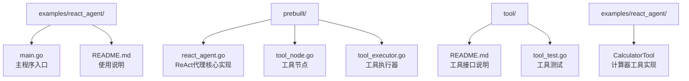
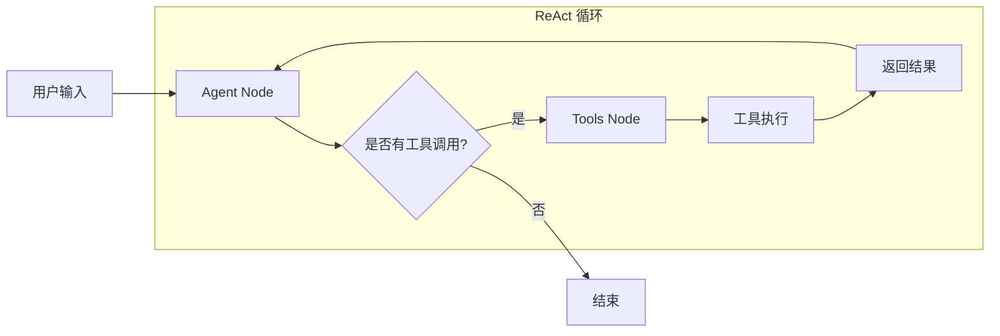
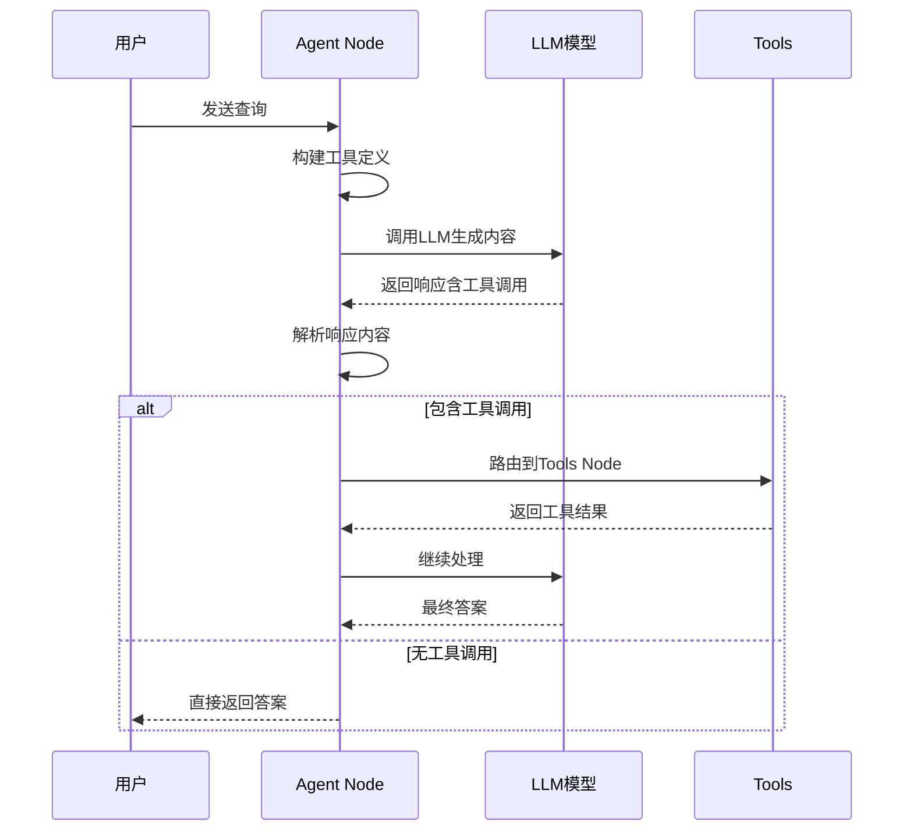
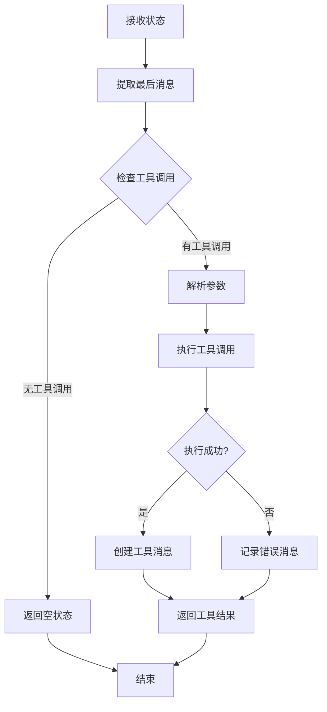
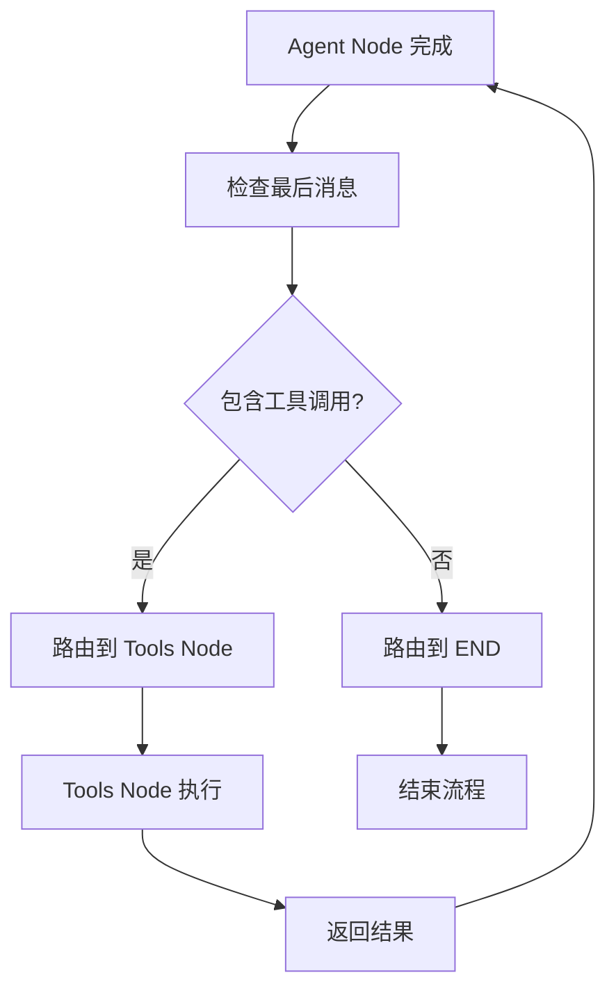
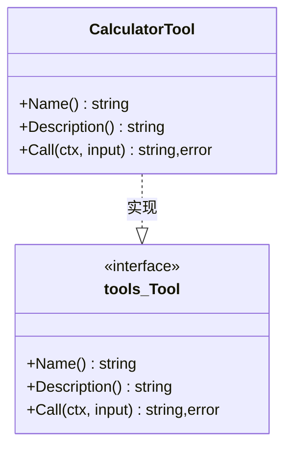
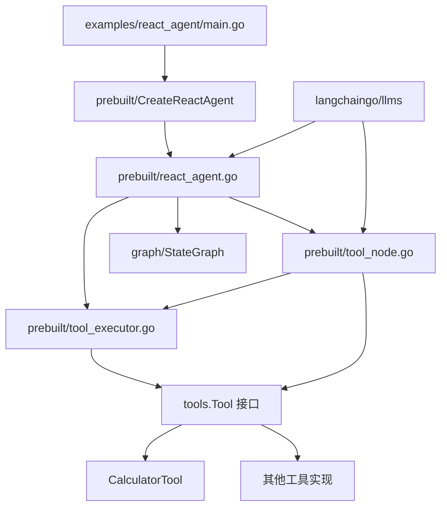

# ReAct代理

<cite>
**本文档中引用的文件**
- [examples/react_agent/main.go](file://examples/react_agent/main.go)
- [prebuilt/react_agent.go](file://prebuilt/react_agent.go)
- [prebuilt/tool_node.go](file://prebuilt/tool_node.go)
- [prebuilt/tool_executor.go](file://prebuilt/tool_executor.go)
- [examples/react_agent/README.md](file://examples/react_agent/README.md)
- [prebuilt/react_agent_test.go](file://prebuilt/react_agent_test.go)
- [tool/README.md](file://tool/README.md)
</cite>

## 目录
1. [简介](#简介)
2. [项目结构](#项目结构)
3. [核心组件](#核心组件)
4. [架构概览](#架构概览)
5. [详细组件分析](#详细组件分析)
6. [依赖关系分析](#依赖关系分析)
7. [性能考虑](#性能考虑)
8. [故障排除指南](#故障排除指南)
9. [结论](#结论)

## 简介

ReAct（推理-行动）代理是一种智能代理模式，它结合了语言模型的推理能力和外部工具的执行能力。该模式通过"思考-行动-观察"的循环机制，使代理能够自主地分析问题、调用工具、观察结果并迭代直到完成任务。

在 LangGraphGo 中，ReAct 代理通过 `prebuilt.CreateReactAgent` 函数自动构建状态图，实现了这一经典的智能代理模式。该系统包含三个核心组件：Agent Node 负责 LLM 决策，Tools Node 执行工具调用，以及条件边根据 LLM 输出进行路由控制。

## 项目结构

ReAct 代理示例位于 `examples/react_agent` 目录下，主要包含以下文件：



**图表来源**
- [examples/react_agent/main.go](file://examples/react_agent/main.go#L1-L122)
- [prebuilt/react_agent.go](file://prebuilt/react_agent.go#L1-L182)
- [prebuilt/tool_node.go](file://prebuilt/tool_node.go#L1-L108)
- [prebuilt/tool_executor.go](file://prebuilt/tool_executor.go#L1-L84)

**章节来源**
- [examples/react_agent/main.go](file://examples/react_agent/main.go#L1-L122)
- [examples/react_agent/README.md](file://examples/react_agent/README.md#L1-L74)

## 核心组件

ReAct 代理系统由以下核心组件构成：

### 1. 工具接口（tools.Tool）
所有工具必须实现的标准接口，包含三个基本方法：
- `Name()`：返回工具名称
- `Description()`：返回工具描述
- `Call()`：执行工具调用

### 2. Agent Node
负责调用 LLM 进行决策的核心节点，它接收对话历史并决定是否需要调用工具或提供最终答案。

### 3. Tools Node  
执行 Agent Node 调用的工具，处理工具调用请求并将结果返回给代理。

### 4. 条件边
根据 LLM 输出动态路由到不同节点的逻辑，决定是继续执行工具还是结束流程。

**章节来源**
- [examples/react_agent/main.go](file://examples/react_agent/main.go#L17-L64)
- [prebuilt/react_agent.go](file://prebuilt/react_agent.go#L28-L181)

## 架构概览

ReAct 代理采用状态图架构，通过条件边实现动态路由：



**图表来源**
- [prebuilt/react_agent.go](file://prebuilt/react_agent.go#L157-L178)

该架构的核心特点：
- **循环执行**：支持多次工具调用直到完成任务
- **条件路由**：基于 LLM 输出动态选择执行路径
- **状态管理**：维护对话历史和中间结果
- **错误处理**：优雅处理工具调用失败的情况

## 详细组件分析

### Agent Node 分析

Agent Node 是 ReAct 代理的核心决策节点，负责调用 LLM 并处理其输出：



**图表来源**
- [prebuilt/react_agent.go](file://prebuilt/react_agent.go#L28-L94)

Agent Node 的关键功能包括：
- **工具定义转换**：将工具列表转换为 LLM 可识别的格式
- **响应解析**：处理 LLM 的文本回复和工具调用
- **消息构建**：创建符合聊天协议的消息格式

**章节来源**
- [prebuilt/react_agent.go](file://prebuilt/react_agent.go#L28-L94)

### Tools Node 分析

Tools Node 负责执行 Agent Node 调用的工具：



**图表来源**
- [prebuilt/tool_node.go](file://prebuilt/tool_node.go#L26-L107)

Tools Node 的核心特性：
- **参数解析**：从 JSON 字符串中提取工具输入
- **并发安全**：支持多个工具的顺序执行
- **错误恢复**：捕获并报告工具执行错误
- **消息格式化**：创建符合协议的工具响应消息

**章节来源**
- [prebuilt/tool_node.go](file://prebuilt/tool_node.go#L26-L107)

### Tool Executor 分析

Tool Executor 提供统一的工具执行接口：

```mermaid
classDiagram
class ToolExecutor {
+map~string,Tool~ tools
+NewToolExecutor(tools) ToolExecutor
+Execute(ctx, invocation) string,error
+ExecuteMany(ctx, invocations) []string,error
+ToolNode(ctx, state) interface{},error
}
class ToolInvocation {
+string Tool
+string ToolInput
}
class CalculatorTool {
+Name() string
+Description() string
+Call(ctx, input) string,error
}
ToolExecutor --> ToolInvocation : 使用
ToolExecutor --> CalculatorTool : 管理
```

**图表来源**
- [prebuilt/tool_executor.go](file://prebuilt/tool_executor.go#L10-L84)

Tool Executor 的设计特点：
- **映射存储**：使用工具名称快速查找对应工具
- **批量执行**：支持多个工具的顺序执行
- **灵活输入**：接受多种格式的状态输入
- **类型安全**：确保工具调用的正确性

**章节来源**
- [prebuilt/tool_executor.go](file://prebuilt/tool_executor.go#L10-L84)

### 条件边分析

条件边根据 LLM 输出决定执行路径：



**图表来源**
- [prebuilt/react_agent.go](file://prebuilt/react_agent.go#L159-L175)

条件边的判断逻辑：
- **工具调用检测**：扫描消息部分中的工具调用标记
- **动态路由**：根据检测结果选择不同的执行路径
- **循环终止**：当没有工具调用时终止循环

**章节来源**
- [prebuilt/react_agent.go](file://prebuilt/react_agent.go#L159-L175)

### CalculatorTool 实现分析

CalculatorTool 展示了工具接口的标准实现：



**图表来源**
- [examples/react_agent/main.go](file://examples/react_agent/main.go#L17-L64)

CalculatorTool 的实现要点：
- **输入验证**：检查输入格式是否为 "a op b" 形式
- **运算处理**：支持加减乘除四种基本运算
- **错误处理**：处理无效输入和除零错误
- **结果格式化**：返回格式化的浮点数结果

**章节来源**
- [examples/react_agent/main.go](file://examples/react_agent/main.go#L17-L64)

## 依赖关系分析

ReAct 代理系统的依赖关系展现了清晰的分层架构：



**图表来源**
- [examples/react_agent/main.go](file://examples/react_agent/main.go#L1-L15)
- [prebuilt/react_agent.go](file://prebuilt/react_agent.go#L1-L11)

主要依赖关系：
- **工具接口**：所有工具都实现标准的 `tools.Tool` 接口
- **LLM 集成**：与 langchaingo 的 LLM 模型无缝集成
- **状态管理**：使用 LangGraph 的状态图框架
- **类型安全**：通过接口确保组件间的正确交互

**章节来源**
- [examples/react_agent/main.go](file://examples/react_agent/main.go#L1-L15)
- [prebuilt/react_agent.go](file://prebuilt/react_agent.go#L1-L11)

## 性能考虑

ReAct 代理系统在设计时考虑了以下性能优化：

### 1. 延迟优化
- **异步执行**：工具调用可以并行执行以提高效率
- **缓存机制**：工具执行结果可被缓存避免重复计算
- **流式处理**：支持流式响应减少等待时间

### 2. 资源管理
- **连接池**：复用 LLM 连接减少建立开销
- **内存优化**：及时清理中间状态避免内存泄漏
- **并发控制**：限制同时执行的工具数量防止资源耗尽

### 3. 错误处理
- **超时机制**：设置合理的工具调用超时时间
- **重试策略**：对临时性错误实施指数退避重试
- **降级处理**：在工具不可用时提供备选方案

## 故障排除指南

### 常见问题及解决方案

#### 1. 工具调用失败
**症状**：工具返回错误信息或无响应
**原因**：输入格式不正确、工具未注册、网络连接问题
**解决**：检查工具接口实现、验证输入格式、确认网络连接

#### 2. 循环执行异常
**症状**：代理陷入无限循环
**原因**：条件边逻辑错误、工具返回误导性结果
**解决**：检查条件判断逻辑、添加最大迭代次数限制

#### 3. LLM 调用失败
**症状**：Agent Node 无法获得响应
**原因**：API 密钥无效、模型配置错误、请求频率过高
**解决**：验证 API 配置、检查配额限制、实现请求限流

**章节来源**
- [prebuilt/react_agent_test.go](file://prebuilt/react_agent_test.go#L1-L115)

## 结论

ReAct 代理代表了智能代理领域的重要进展，通过将语言模型的推理能力与外部工具的执行能力相结合，创造了一种强大而灵活的智能系统架构。

### 主要优势
- **模块化设计**：清晰的组件分离便于扩展和维护
- **标准化接口**：统一的工具接口简化了新工具的集成
- **动态路由**：基于内容的智能路由提高了执行效率
- **错误恢复**：完善的错误处理机制增强了系统稳定性

### 应用场景
ReAct 代理特别适用于需要复杂推理和多步骤操作的任务，如：
- 复杂数据分析和计算
- 多轮对话和上下文理解
- 需要访问外部知识库的任务
- 自动化工作流程管理

通过深入理解 ReAct 代理的工作机制，开发者可以更好地利用这一强大的工具来构建智能应用，实现更复杂的业务需求。