# 代理协调器

<cite>
**本文档中引用的文件**
- [examples/supervisor/main.go](file://examples/supervisor/main.go)
- [prebuilt/supervisor.go](file://prebuilt/supervisor.go)
- [showcases/open_deep_research/main.go](file://showcases/open_deep_research/main.go)
- [showcases/open_deep_research/state.go](file://showcases/open_deep_research/state.go)
- [showcases/open_deep_research/supervisor.go](file://showcases/open_deep_research/supervisor.go)
- [showcases/open_deep_research/researcher.go](file://showcases/open_deep_research/researcher.go)
- [showcases/open_deep_research/prompts.go](file://showcases/open_deep_research/prompts.go)
- [showcases/open_deep_research/utils.go](file://showcases/open_deep_research/utils.go)
- [showcases/open_deep_research/config.go](file://showcases/open_deep_research/config.go)
- [examples/supervisor/README.md](file://examples/supervisor/README.md)
- [showcases/open_deep_research/README.md](file://showcases/open_deep_research/README.md)
</cite>

## 目录
1. [引言](#引言)
2. [项目结构概览](#项目结构概览)
3. [核心组件分析](#核心组件分析)
4. [架构概览](#架构概览)
5. [详细组件分析](#详细组件分析)
6. [状态流转与迭代控制](#状态流转与迭代控制)
7. [条件路由机制](#条件路由机制)
8. [并行执行与工作流管理](#并行执行与工作流管理)
9. [性能考虑](#性能考虑)
10. [故障排除指南](#故障排除指南)
11. [结论](#结论)

## 引言

Supervisor 模式是多代理系统中一种重要的协调机制，它通过中央协调器（Supervisor）来管理和分配任务给专业化的工作代理（Worker Agent）。这种模式在复杂的多智能体协作场景中发挥着关键作用，特别是在需要动态任务分配、状态协调和流程控制的场景中。

本文档基于 LangGraphGo 代码库中的两个主要示例：基础 Supervisor 示例和 Open Deep Research 多代理研究系统，深入分析 Supervisor 模式的实现原理、工作机制和最佳实践。

## 项目结构概览

LangGraphGo 项目采用模块化设计，包含多个示例和展示项目，其中 Supervisor 模式相关的组件分布在以下目录中：

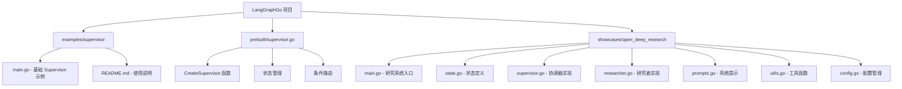

**图表来源**
- [examples/supervisor/main.go](file://examples/supervisor/main.go#L1-L138)
- [prebuilt/supervisor.go](file://prebuilt/supervisor.go#L1-L153)
- [showcases/open_deep_research/main.go](file://showcases/open_deep_research/main.go#L1-L96)

**章节来源**
- [examples/supervisor/README.md](file://examples/supervisor/README.md#L1-L16)
- [showcases/open_deep_research/README.md](file://showcases/open_deep_research/README.md#L1-L190)

## 核心组件分析

### 基础 Supervisor 组件

基础 Supervisor 示例展示了最简单的多代理协调模式：

```mermaid
classDiagram
class Supervisor {
+CreateSupervisor(model, members) StateRunnable
-workflow StateGraph
-members map[string]*StateRunnable
-schema MapSchema
}
class StateRunnable {
+Invoke(ctx, state) interface{}
+Compile() StateRunnable
}
class MathAgent {
+calculate(expression) string
+tools []Tool
}
class GeneralAgent {
+respond(query) string
+tools []Tool
}
Supervisor --> StateRunnable : "orchestrates"
StateRunnable <|-- MathAgent
StateRunnable <|-- GeneralAgent
```

**图表来源**
- [examples/supervisor/main.go](file://examples/supervisor/main.go#L71-L87)
- [prebuilt/supervisor.go](file://prebuilt/supervisor.go#L14-L153)

### Open Deep Research 超级系统

Open Deep Research 展示了更复杂的企业级 Supervisor 实现：

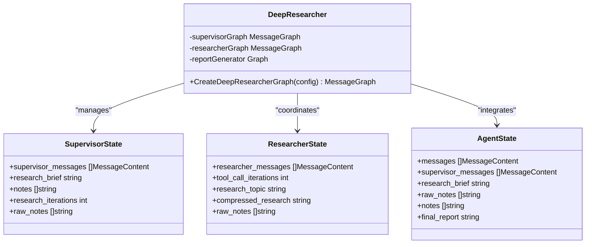

**图表来源**
- [showcases/open_deep_research/state.go](file://showcases/open_deep_research/state.go#L44-L77)
- [showcases/open_deep_research/main.go](file://showcases/open_deep_research/main.go#L34-L35)

**章节来源**
- [examples/supervisor/main.go](file://examples/supervisor/main.go#L71-L87)
- [showcases/open_deep_research/state.go](file://showcases/open_deep_research/state.go#L44-L77)

## 架构概览

Supervisor 模式的核心架构遵循分层设计原则，包含以下关键层次：

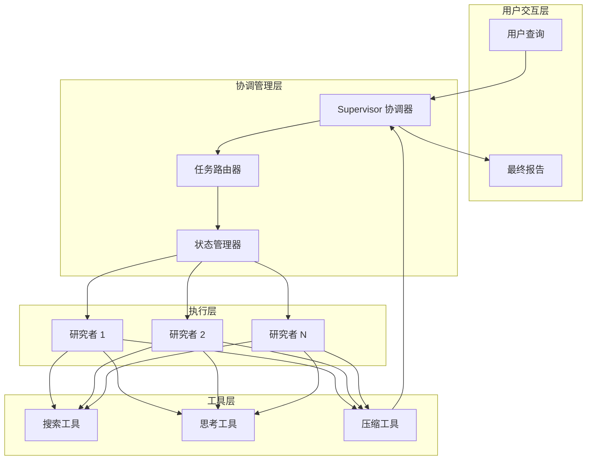

**图表来源**
- [showcases/open_deep_research/supervisor.go](file://showcases/open_deep_research/supervisor.go#L14-L331)
- [showcases/open_deep_research/researcher.go](file://showcases/open_deep_research/researcher.go#L12-L225)

## 详细组件分析

### 基础 Supervisor 实现

基础 Supervisor 通过 `CreateSupervisor` 函数创建，该函数实现了以下核心功能：

#### 状态架构设计

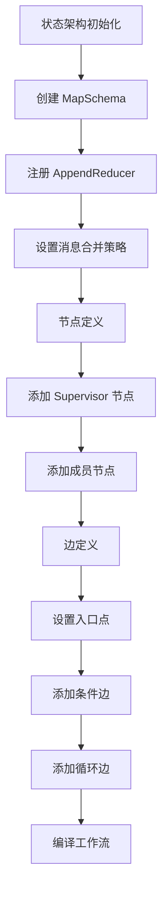

**图表来源**
- [prebuilt/supervisor.go](file://prebuilt/supervisor.go#L15-L152)

#### Supervisor 节点逻辑

Supervisor 节点的核心职责包括：
- 分析当前对话历史
- 生成系统提示词
- 调用 LLM 进行路由决策
- 解析工具调用参数
- 返回下一个执行节点

**章节来源**
- [prebuilt/supervisor.go](file://prebuilt/supervisor.go#L29-L106)

### Open Deep Research 协调器

Open Deep Research 的 Supervisor 实现更加复杂，支持多种工具调用和并行处理：

#### 协调器状态管理

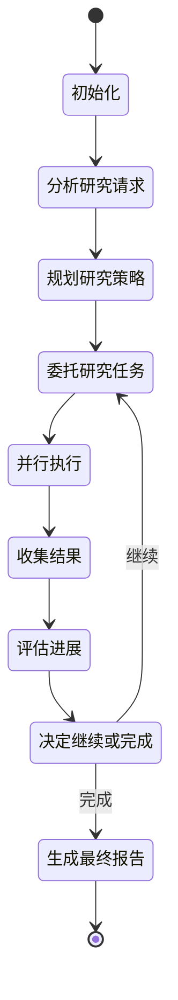

**图表来源**
- [showcases/open_deep_research/supervisor.go](file://showcases/open_deep_research/supervisor.go#L25-L331)

#### 工具调用处理

Open Deep Research 支持三种主要工具：

| 工具名称 | 功能描述 | 参数结构 | 使用场景 |
|---------|----------|----------|----------|
| ConductResearch | 委托研究任务 | research_topic (详细主题描述) | 创建新的研究子任务 |
| ResearchComplete | 标记研究完成 | complete (布尔值) | 研究完成后终止流程 |
| think_tool | 反思和规划 | reflection (反思内容) | 策略性思考和决策 |

**章节来源**
- [showcases/open_deep_research/supervisor.go](file://showcases/open_deep_research/supervisor.go#L82-L134)

### 研究者代理实现

研究者代理负责具体的搜索和信息收集工作：

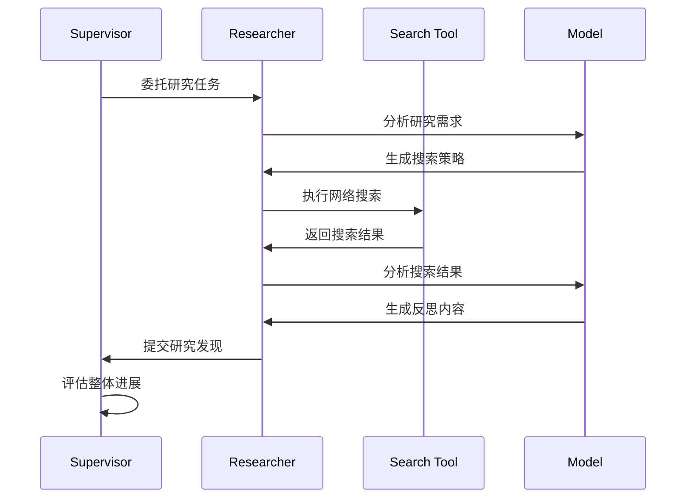

**图表来源**
- [showcases/open_deep_research/researcher.go](file://showcases/open_deep_research/researcher.go#L27-L225)

**章节来源**
- [showcases/open_deep_research/researcher.go](file://showcases/open_deep_research/researcher.go#L27-L171)

## 状态流转与迭代控制

### 基础 Supervisor 状态流转

基础 Supervisor 的状态流转相对简单，主要围绕任务分配和完成：

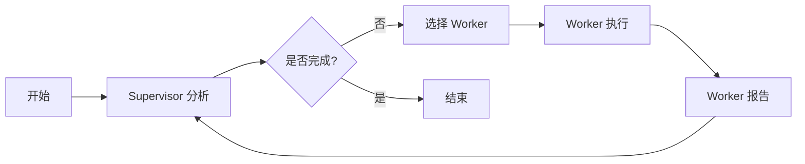

**图表来源**
- [prebuilt/supervisor.go](file://prebuilt/supervisor.go#L133-L149)

### Open Deep Research 迭代控制

Open Deep Research 实现了更复杂的迭代控制机制：

#### 迭代限制机制

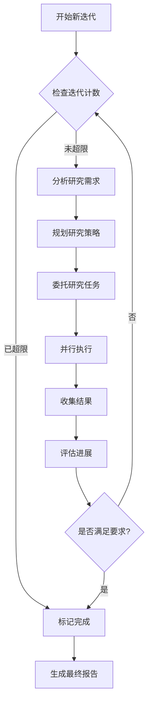

**图表来源**
- [showcases/open_deep_research/supervisor.go](file://showcases/open_deep_research/supervisor.go#L36-L62)

#### 并发控制

系统通过配置参数控制并发研究单元的数量：

| 配置参数 | 默认值 | 说明 |
|---------|--------|------|
| MaxConcurrentResearchUnits | 3 | 最大并行研究任务数 |
| MaxResearcherIterations | 10 | 最大研究迭代次数 |
| MaxToolCallIterations | 20 | 每个研究者的最大工具调用次数 |

**章节来源**
- [showcases/open_deep_research/supervisor.go](file://showcases/open_deep_research/supervisor.go#L187-L204)
- [showcases/open_deep_research/config.go](file://showcases/open_deep_research/config.go#L48-L53)

## 条件路由机制

### 基础 Supervisor 条件路由

基础 Supervisor 使用简单的字符串匹配进行条件路由：

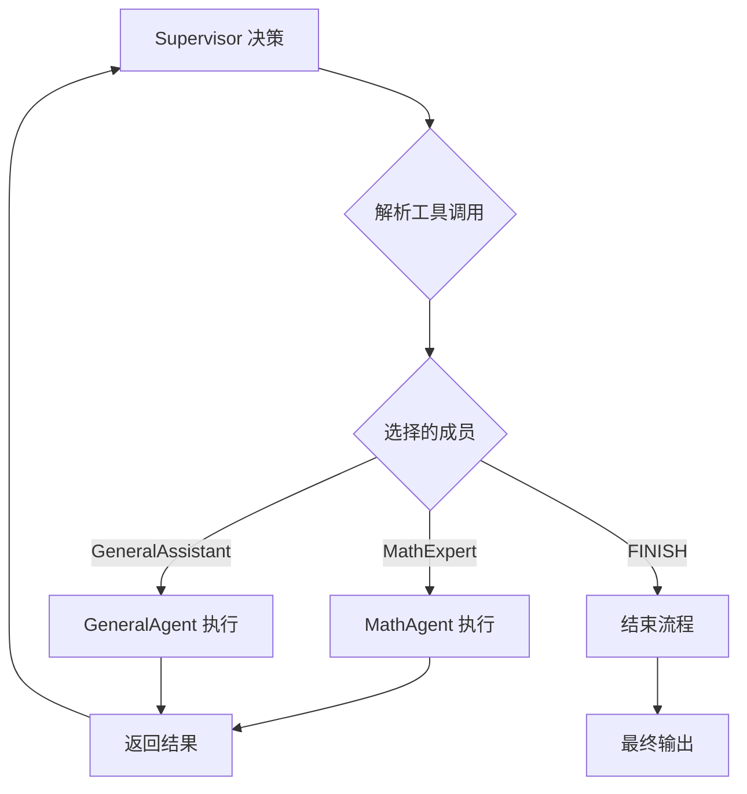

**图表来源**
- [prebuilt/supervisor.go](file://prebuilt/supervisor.go#L133-L144)

### Open Deep Research 高级路由

Open Deep Research 实现了更复杂的条件路由逻辑：

#### 工具调用路由

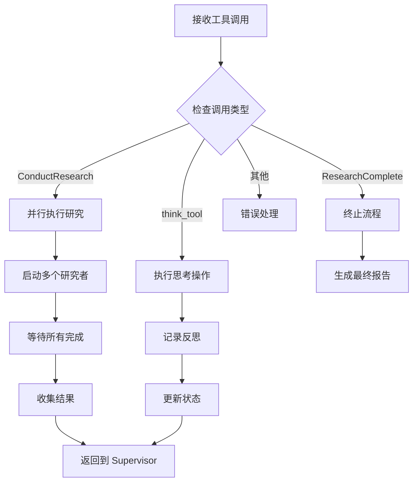

**图表来源**
- [showcases/open_deep_research/supervisor.go](file://showcases/open_deep_research/supervisor.go#L305-L325)

#### 并行执行机制

系统支持最多 `MaxConcurrentResearchUnits` 个研究任务同时执行：

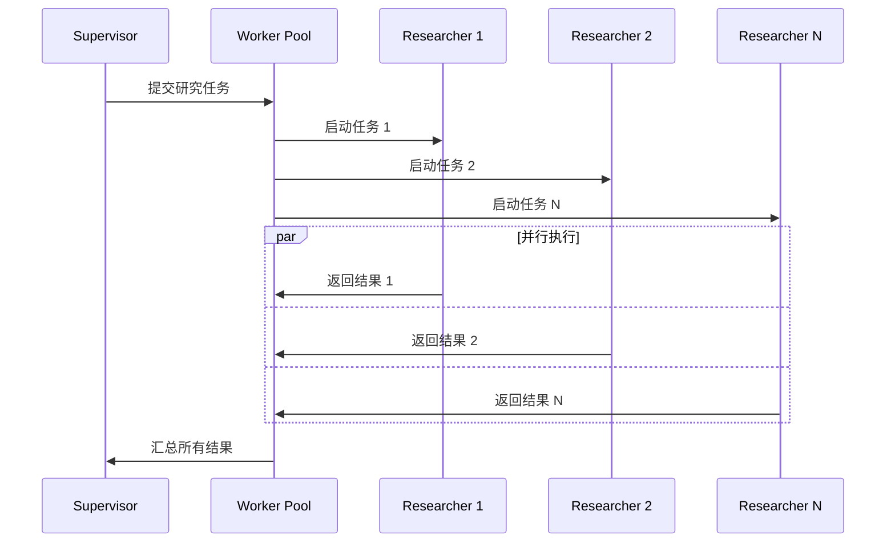

**图表来源**
- [showcases/open_deep_research/supervisor.go](file://showcases/open_deep_research/supervisor.go#L205-L299)

**章节来源**
- [prebuilt/supervisor.go](file://prebuilt/supervisor.go#L133-L144)
- [showcases/open_deep_research/supervisor.go](file://showcases/open_deep_research/supervisor.go#L305-L325)

## 并行执行与工作流管理

### 并行执行架构

Open Deep Research 实现了真正的并行执行能力：

#### 并发控制实现

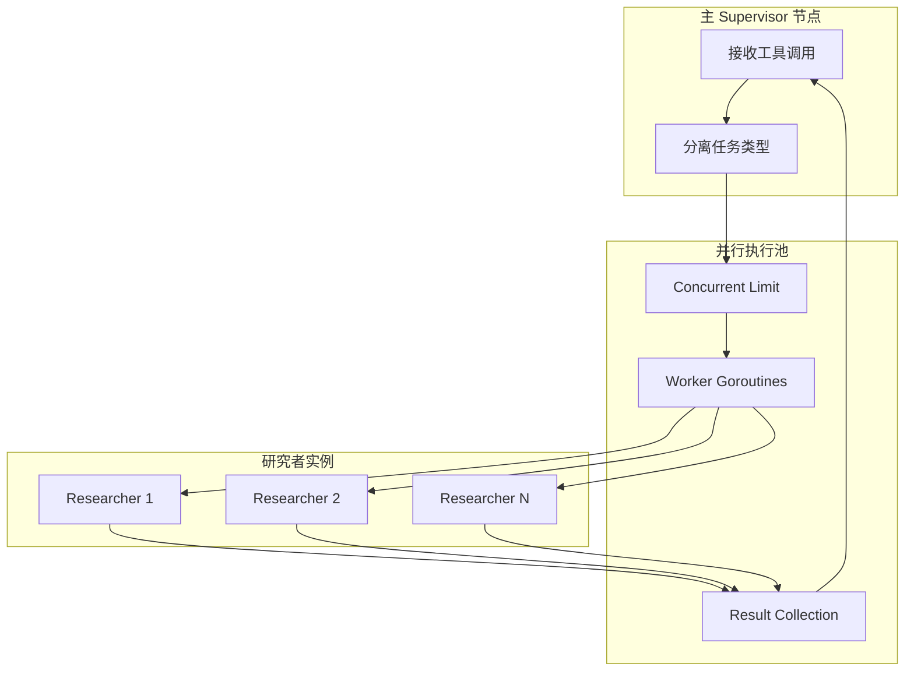

**图表来源**
- [showcases/open_deep_research/supervisor.go](file://showcases/open_deep_research/supervisor.go#L205-L299)

#### 状态合并机制

系统使用专门的状态合并函数来处理并行执行的结果：

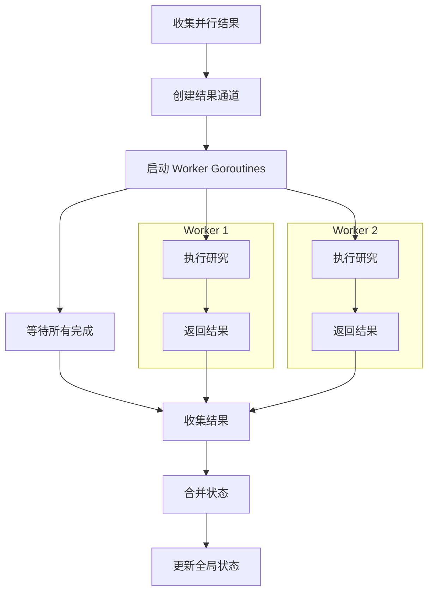

**图表来源**
- [showcases/open_deep_research/supervisor.go](file://showcases/open_deep_research/supervisor.go#L212-L299)

### 工作流编译与优化

系统在运行时动态编译工作流以优化性能：

| 优化策略 | 实现方式 | 性能提升 |
|---------|----------|----------|
| 延迟编译 | 按需编译子图 | 减少内存占用 |
| 状态缓存 | 复用编译结果 | 提高执行速度 |
| 边缘优化 | 预计算常用路径 | 减少运行时开销 |

**章节来源**
- [showcases/open_deep_research/supervisor.go](file://showcases/open_deep_research/supervisor.go#L232-L252)

## 性能考虑

### 内存管理

系统采用了多种内存优化策略：

- **状态共享**: 多个节点共享相同的状态架构
- **延迟加载**: 只在需要时编译工作流
- **资源池化**: 复用 LLM 连接和工具实例

### 并发优化

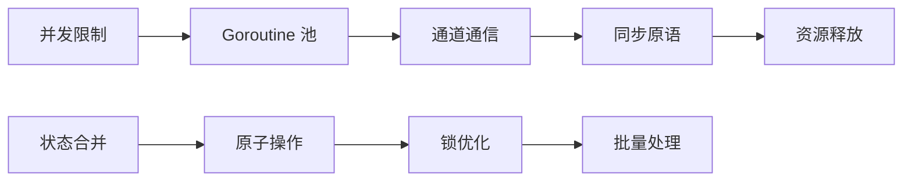

### API 调用优化

系统实现了智能的 API 调用策略：

- **批量处理**: 将多个小请求合并为批量请求
- **缓存机制**: 缓存频繁访问的数据
- **重试策略**: 实现指数退避重试

## 故障排除指南

### 常见问题与解决方案

#### Supervisor 无法选择下一步

**症状**: Supervisor 始终返回 FINISH 或无响应

**原因分析**:
- LLM 输出格式不正确
- 工具定义不完整
- 状态传递错误

**解决方案**:
1. 检查系统提示词的完整性
2. 验证工具定义的 JSON Schema
3. 确认状态键名的一致性

#### 并行执行超时

**症状**: 研究任务长时间无响应

**原因分析**:
- API 调用超时
- 死锁或竞态条件
- 资源不足

**解决方案**:
1. 设置合理的超时时间
2. 检查并发控制逻辑
3. 监控系统资源使用情况

#### 状态丢失或损坏

**症状**: 中间结果丢失或状态不一致

**原因分析**:
- 状态合并函数错误
- 并发写入冲突
- 序列化失败

**解决方案**:
1. 验证状态合并逻辑
2. 添加适当的同步机制
3. 实现状态验证和恢复

**章节来源**
- [showcases/open_deep_research/supervisor.go](file://showcases/open_deep_research/supervisor.go#L82-L97)
- [showcases/open_deep_research/supervisor.go](file://showcases/open_deep_research/supervisor.go#L221-L239)

## 结论

Supervisor 模式在多代理系统中提供了强大而灵活的任务协调能力。通过 LangGraphGo 的实现，我们可以看到：

### 主要优势

1. **灵活性**: 支持动态任务分配和路由
2. **可扩展性**: 易于添加新的 Worker 类型
3. **可靠性**: 完善的错误处理和恢复机制
4. **性能**: 高效的并行执行和状态管理

### 最佳实践建议

1. **合理设计状态架构**: 使用适当的 reducer 和合并策略
2. **优化条件路由**: 基于业务逻辑设计高效的路由规则
3. **监控和调试**: 实现完善的日志记录和监控机制
4. **测试覆盖**: 充分测试各种边界情况和异常场景

### 未来发展方向

随着多代理系统的复杂度增加，Supervisor 模式可能会向以下方向发展：
- 更智能的自适应路由算法
- 更精细的资源调度机制
- 更强大的异常恢复能力
- 更好的跨域协作支持

通过深入理解和正确应用 Supervisor 模式，开发者可以构建出更加智能和高效的多代理系统，为复杂的业务场景提供强有力的技术支撑。