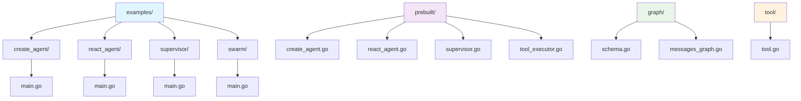
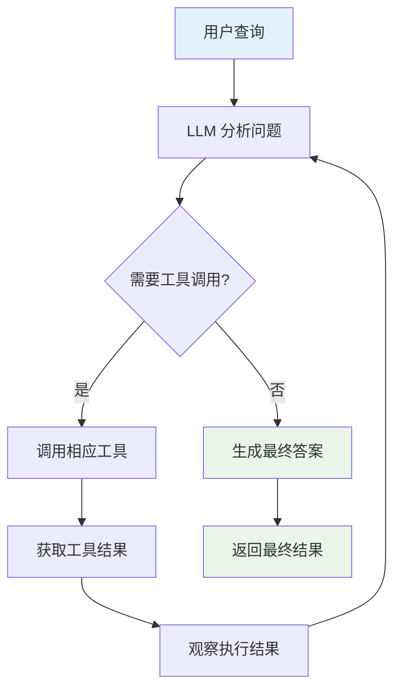
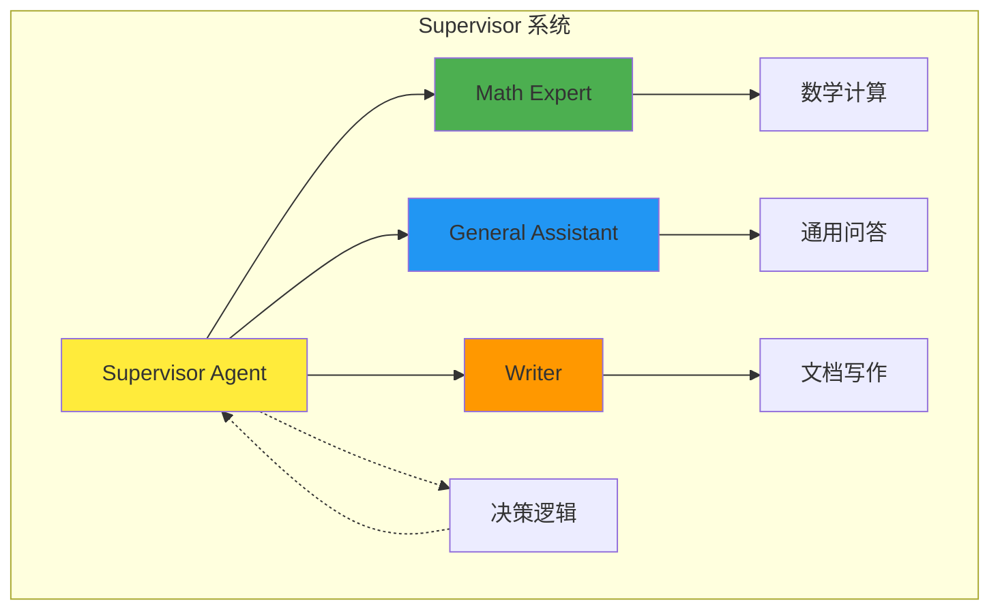
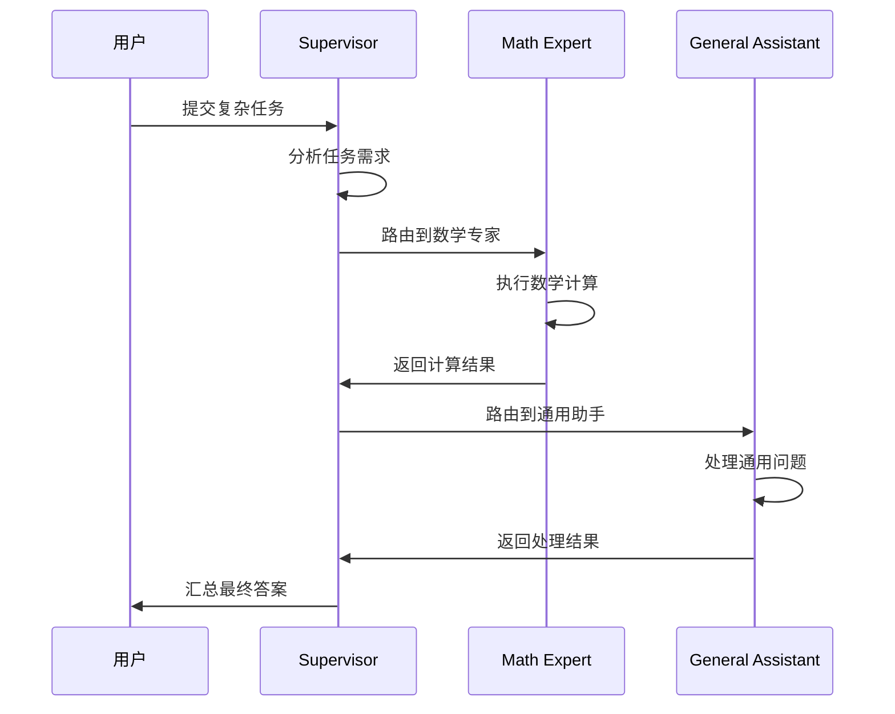
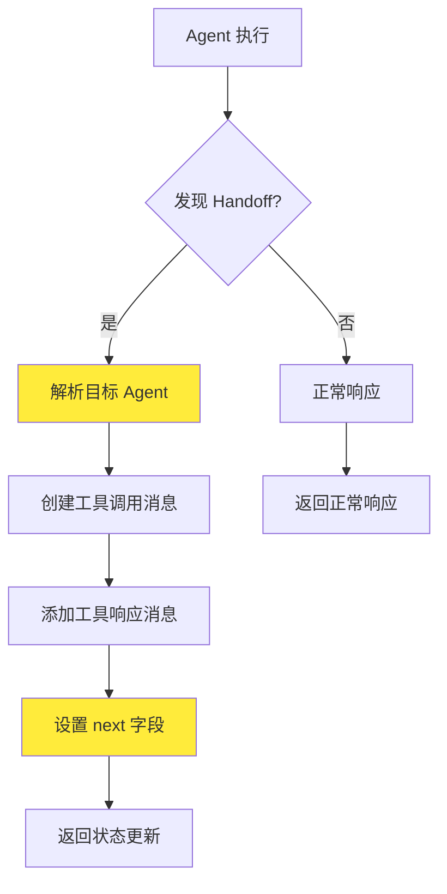
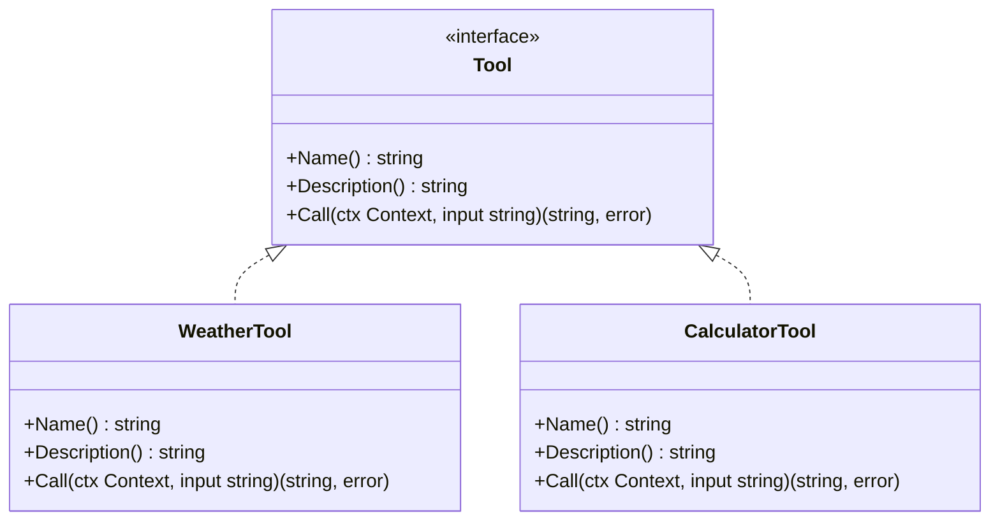
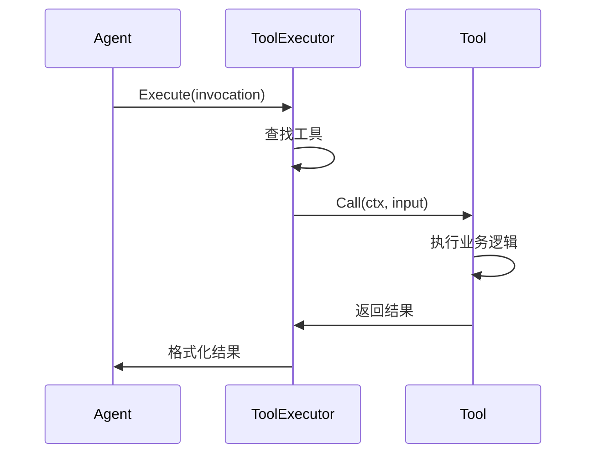
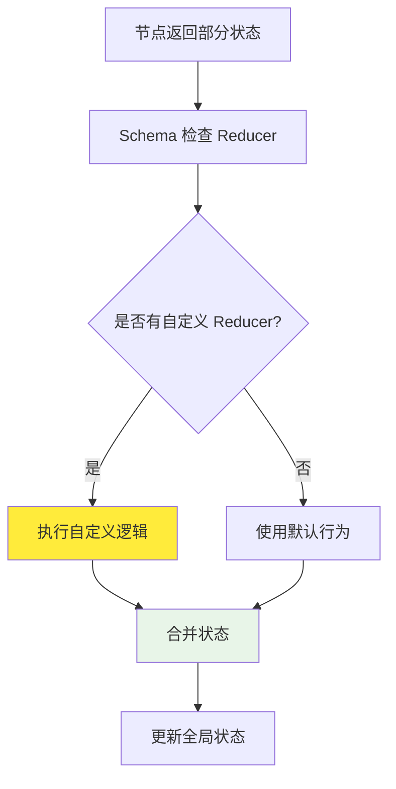
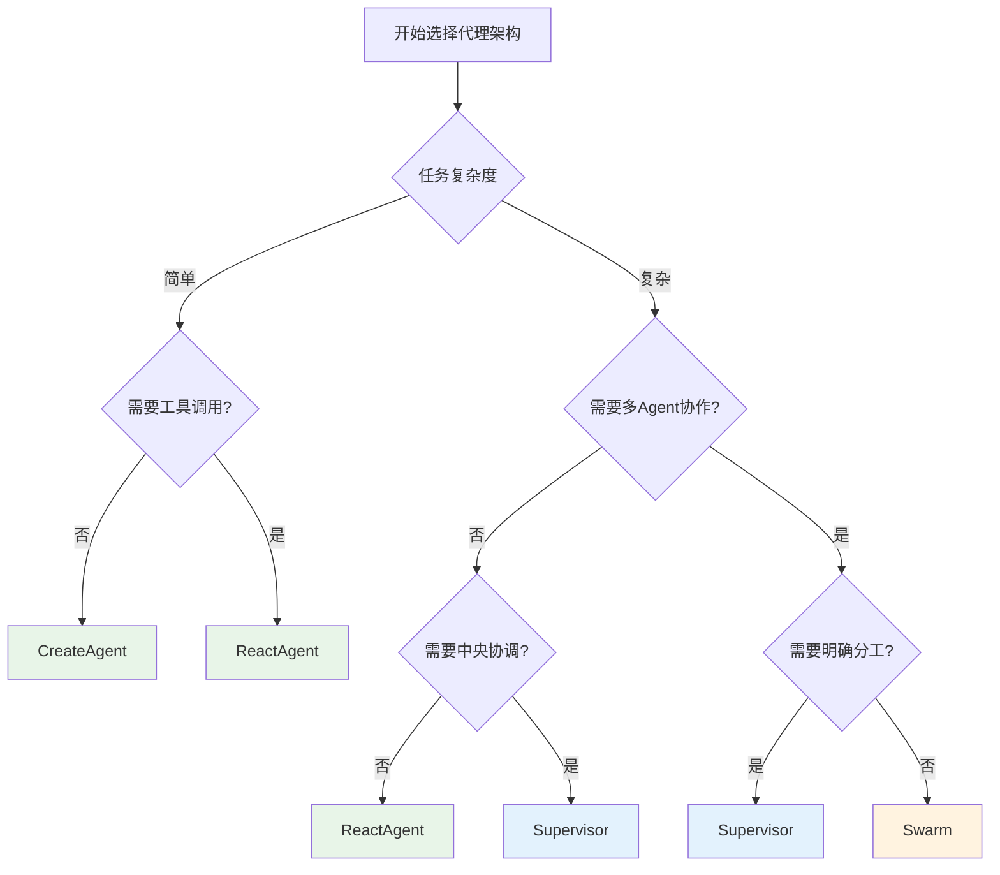

# 智能代理示例

<cite>
**本文档中引用的文件**
- [examples/create_agent/main.go](file://examples/create_agent/main.go)
- [examples/react_agent/main.go](file://examples/react_agent/main.go)
- [examples/supervisor/main.go](file://examples/supervisor/main.go)
- [examples/swarm/main.go](file://examples/swarm/main.go)
- [prebuilt/create_agent.go](file://prebuilt/create_agent.go)
- [prebuilt/react_agent.go](file://prebuilt/react_agent.go)
- [prebuilt/supervisor.go](file://prebuilt/supervisor.go)
- [prebuilt/tool_executor.go](file://prebuilt/tool_executor.go)
- [examples/create_agent/README_CN.md](file://examples/create_agent/README_CN.md)
- [examples/react_agent/README_CN.md](file://examples/react_agent/README_CN.md)
- [examples/supervisor/README_CN.md](file://examples/supervisor/README_CN.md)
- [examples/swarm/README_CN.md](file://examples/swarm/README_CN.md)
- [tool/tool.go](file://tool/tool.go)
- [graph/schema.go](file://graph/schema.go)
- [graph/messages_graph.go](file://graph/messages_graph.go)
</cite>

## 目录
1. [简介](#简介)
2. [项目结构概览](#项目结构概览)
3. [基础代理创建](#基础代理创建)
4. [ReAct Agent 思考-行动循环](#react-agent-思考-行动循环)
5. [Supervisor 多代理协调](#supervisor-多代理协调)
6. [Swarm 代理群协作](#swarm-代理群协作)
7. [工具系统详解](#工具系统详解)
8. [状态管理模式](#状态管理模式)
9. [架构对比与选择指南](#架构对比与选择指南)
10. [最佳实践与故障排除](#最佳实践与故障排除)
11. [总结](#总结)

## 简介

LangGraphGo 是一个强大的框架，用于构建智能代理系统。本教程将通过四个核心示例：`create_agent`、`react_agent`、`supervisor` 和 `swarm`，深入讲解不同类型智能代理的创建和使用方法。这些示例涵盖了从基础代理创建到复杂的多代理协作的各种场景。

智能代理的核心思想是让 AI 系统能够自主思考、采取行动、观察结果并不断改进。通过本教程，您将学会如何根据具体需求选择合适的代理架构，并掌握构建高效智能系统的技能。

## 项目结构概览

LangGraphGo 的智能代理示例分布在以下目录结构中：



**图表来源**
- [examples/create_agent/main.go](file://examples/create_agent/main.go#L1-L86)
- [examples/react_agent/main.go](file://examples/react_agent/main.go#L1-L122)
- [examples/supervisor/main.go](file://examples/supervisor/main.go#L1-L138)
- [examples/swarm/main.go](file://examples/swarm/main.go#L1-L244)

每个示例都专注于特定的代理类型和应用场景：

- **create_agent**: 展示基础代理创建和配置
- **react_agent**: 演示 ReAct 思考-行动循环
- **supervisor**: 展示多代理协调机制
- **swarm**: 演示去中心化代理协作模式

**章节来源**
- [examples/create_agent/main.go](file://examples/create_agent/main.go#L1-L86)
- [examples/react_agent/main.go](file://examples/react_agent/main.go#L1-L122)
- [examples/supervisor/main.go](file://examples/supervisor/main.go#L1-L138)
- [examples/swarm/main.go](file://examples/swarm/main.go#L1-L244)

## 基础代理创建

### 核心概念

基础代理创建是构建智能系统的第一步。`CreateAgent` 函数提供了一个灵活且可扩展的框架，其设计灵感来源于 LangChain 1.0，支持函数式选项来配置代理的行为。

#### 主要特性

1. **函数式选项模式**: 使用可选参数来配置代理，使 API 更加整洁
2. **系统消息定制**: 可以设置代理的行为规范和角色定义
3. **状态修改器**: 允许在消息发送给 LLM 之前进行拦截和修改
4. **工具集成**: 支持多种外部工具的无缝集成

### 架构设计

```mermaid
classDiagram
class CreateAgentOptions {
+string SystemMessage
+func StateModifier
+CheckpointStore Checkpointer
}
class CreateAgent {
+model llms.Model
+inputTools []tools.Tool
+opts []CreateAgentOption
+CreateAgent() StateRunnable
}
class ToolExecutor {
+tools map[string]tools.Tool
+Execute() string
+ExecuteMany() []string
+ToolNode() interface{}
}
class StateGraph {
+AddNode()
+AddEdge()
+SetEntryPoint()
+Compile() StateRunnable
}
CreateAgent --> CreateAgentOptions : "uses"
CreateAgent --> ToolExecutor : "creates"
CreateAgent --> StateGraph : "builds"
ToolExecutor --> StateGraph : "executes in"
```

**图表来源**
- [prebuilt/create_agent.go](file://prebuilt/create_agent.go#L13-L42)
- [prebuilt/create_agent.go](file://prebuilt/create_agent.go#L46-L251)
- [prebuilt/tool_executor.go](file://prebuilt/tool_executor.go#L16-L84)

### 实现流程

基础代理的创建遵循以下步骤：

1. **初始化 LLM**: 创建语言模型实例
2. **定义工具**: 创建代理可以使用的工具列表
3. **配置选项**: 使用函数式选项设置系统消息和状态修改器
4. **创建代理**: 调用 `CreateAgent` 函数构建完整的代理图
5. **执行调用**: 使用初始用户消息运行代理

### 关键组件分析

#### 系统消息配置

系统消息决定了代理的基本行为和角色定位。通过 `WithSystemMessage` 选项，可以轻松设置代理的专业领域和行为准则。

#### 状态修改器

状态修改器是一个强大的功能，允许在消息发送给 LLM 之前对其进行动态修改。这对于实现高级提示工程技术非常有用。

#### 工具执行流程

代理通过工具执行器来处理外部工具调用。工具执行器负责：
- 工具映射和查找
- 参数解析和验证
- 异常处理和错误恢复
- 结果格式化和返回

**章节来源**
- [prebuilt/create_agent.go](file://prebuilt/create_agent.go#L46-L251)
- [examples/create_agent/main.go](file://examples/create_agent/main.go#L30-L86)

## ReAct Agent 思考-行动循环

### ReAct 模型原理

ReAct (Reasoning and Acting) 是构建智能 Agent 的基础模式，其核心思想是让模型通过推理、行动、观察和迭代来解决问题。

#### 四阶段循环



**图表来源**
- [examples/react_agent/main.go](file://examples/react_agent/main.go#L1-L122)
- [prebuilt/react_agent.go](file://prebuilt/react_agent.go#L1-L182)

### 核心组件

#### Agent 节点

Agent 节点是 ReAct 循环的核心，负责：
- 接收对话历史并分析问题
- 决定是否需要调用外部工具
- 生成适当的响应或工具调用

#### 工具节点

工具节点专门处理 Agent 节点发起的工具调用：
- 解析工具调用参数
- 执行相应的工具函数
- 格式化工具执行结果
- 创建工具消息反馈

#### 条件边

条件边决定了 ReAct 循环的流向：
- 如果包含工具调用，路由到工具节点
- 如果没有工具调用，结束执行

### 实现细节

ReAct Agent 的实现采用了简洁而高效的架构：

1. **状态管理**: 使用消息列表来维护对话历史
2. **工具集成**: 自动将可用工具转换为模型可理解的格式
3. **循环控制**: 通过条件边实现智能的执行流程控制
4. **错误处理**: 提供完善的错误处理和异常恢复机制

### 应用场景

ReAct Agent 特别适合以下场景：
- 需要外部工具辅助的复杂计算
- 需要搜索或查询信息的任务
- 需要多步骤推理的问题解决
- 需要与外部系统交互的应用

**章节来源**
- [prebuilt/react_agent.go](file://prebuilt/react_agent.go#L1-L182)
- [examples/react_agent/main.go](file://examples/react_agent/main.go#L1-L122)

## Supervisor 多代理协调

### Supervisor 架构概述

Supervisor 模式实现了一个中央协调者来管理多个专门的 Worker Agent。这种架构适用于需要明确分工和协调的复杂任务场景。

#### 系统组成



**图表来源**
- [examples/supervisor/main.go](file://examples/supervisor/main.go#L1-L138)
- [prebuilt/supervisor.go](file://prebuilt/supervisor.go#L1-L153)

### 核心机制

#### 成员管理

Supervisor 系统通过成员映射来管理各个 Worker Agent：
- 动态添加和移除 Agent
- 统一的状态管理模式
- 标准化的接口协议

#### 路由决策

Supervisor 使用强化学习或规则引擎来做出路由决策：
- 分析当前任务需求
- 评估各 Agent 的能力匹配度
- 选择最优的执行 Agent
- 处理任务完成信号

#### 协作流程



**图表来源**
- [examples/supervisor/main.go](file://examples/supervisor/main.go#L71-L138)
- [prebuilt/supervisor.go](file://prebuilt/supervisor.go#L29-L152)

### 实现特点

#### 状态共享

所有 Agent 共享相同的消息历史，确保上下文连续性：
- 统一的对话历史管理
- 透明的任务进展跟踪
- 一致的上下文理解

#### 边界控制

通过条件边实现精确的流程控制：
- 明确的执行边界
- 灵活的路由策略
- 可扩展的 Agent 生态

#### 错误恢复

完善的错误处理机制：
- Agent 故障检测
- 自动重试机制
- 降级服务策略

**章节来源**
- [prebuilt/supervisor.go](file://prebuilt/supervisor.go#L1-L153)
- [examples/supervisor/main.go](file://examples/supervisor/main.go#L1-L138)

## Swarm 代理群协作

### Swarm 模型原理

Swarm 模式借鉴了 OpenAI Swarm 框架的设计理念，实现了去中心化的多 Agent 协作。与 Supervisor 模式不同，Swarm 允许 Agent 直接相互移交控制权，模拟真实的专家团队协作方式。

#### 去中心化协作

```mermaid
graph LR
subgraph "Swarm 协作网络"
A[Researcher] < --> B[Writer]
A < --> C[Analyst]
B < --> D[Editor]
C < --> D
E[User Query] --> A
A --> F[Research Results]
F --> B
B --> G[Final Report]
style A fill:#4caf50
style B fill:#2196f3
style C fill:#ff9800
style D fill:#9c27b0
end
```

**图表来源**
- [examples/swarm/main.go](file://examples/swarm/main.go#L1-L244)

### 核心机制

#### Handoff 工具

Handoff 工具是 Swarm 模式的核心创新，它允许 Agent 之间直接移交控制权：

```go
var HandoffTool = llms.Tool{
    Type: "function",
    Function: &llms.FunctionDefinition{
        Name:        "handoff",
        Description: "Hand off control to another agent.",
        Parameters: map[string]interface{}{
            "type": "object",
            "properties": map[string]interface{}{
                "to": map[string]interface{}{
                    "type": "string",
                    "enum": []string{"Researcher", "Writer"},
                },
            },
            "required": []string{"to"},
        },
    },
}
```

#### 路由机制

Swarm 使用条件边来实现智能路由：
- 检查状态中的 `next` 字段
- 根据目标 Agent 更新执行流程
- 处理循环移交和终止条件

#### 状态管理

Swarm 采用共享状态模式：
- 所有 Agent 访问相同的消息历史
- 透明的任务进展可见性
- 一致的上下文理解

### 实现细节

#### Agent 节点处理

每个 Agent 节点都需要处理 Handoff 工具调用：



**图表来源**
- [examples/swarm/main.go](file://examples/swarm/main.go#L67-L131)
- [examples/swarm/main.go](file://examples/swarm/main.go#L135-L189)

#### 流程控制

Swarm 的流程控制通过路由器函数实现：
- 检查 `next` 字段的值
- 确定下一个执行的 Agent
- 处理终止条件
- 实现循环移交

### 应用优势

Swarm 模式特别适合以下场景：
- 复杂的多阶段任务分解
- 需要专业知识分工的项目
- 动态调整的协作流程
- 灵活的专家团队组织

**章节来源**
- [examples/swarm/main.go](file://examples/swarm/main.go#L1-L244)

## 工具系统详解

### 工具接口设计

LangGraphGo 的工具系统基于统一的接口设计，确保各种工具能够无缝集成到代理系统中。

#### 标准接口



**图表来源**
- [examples/create_agent/main.go](file://examples/create_agent/main.go#L15-L28)
- [examples/react_agent/main.go](file://examples/react_agent/main.go#L17-L64)

### 工具执行器

工具执行器是工具系统的核心组件，负责工具的查找、调用和结果处理。

#### 执行流程



**图表来源**
- [prebuilt/tool_executor.go](file://prebuilt/tool_executor.go#L33-L39)

#### 多工具支持

工具执行器支持多种调用模式：
- 单个工具调用
- 批量工具调用
- 状态解析和转换

### 工具节点

工具节点是图执行器中的专用组件，负责处理工具调用消息。

#### 消息处理

工具节点能够处理来自 LLM 的工具调用消息：
- 解析工具调用参数
- 执行工具函数
- 创建工具响应消息
- 更新对话历史

**章节来源**
- [prebuilt/tool_executor.go](file://prebuilt/tool_executor.go#L1-L84)
- [examples/create_agent/main.go](file://examples/create_agent/main.go#L15-L28)
- [examples/react_agent/main.go](file://examples/react_agent/main.go#L17-L64)

## 状态管理模式

### 状态架构

LangGraphGo 的状态管理系统提供了灵活且强大的状态更新机制，支持复杂的状态演进和数据管理。

#### 状态模式

```mermaid
classDiagram
class StateSchema {
<<interface>>
+Init() interface{}
+Update(current, new) interface{}
}
class MapSchema {
+Reducers map[string]Reducer
+EphemeralKeys map[string]bool
+RegisterReducer()
+Update()
}
class Reducer {
<<function>>
+current interface{}
+new interface{}
+return interface{}
}
StateSchema <|.. MapSchema
MapSchema --> Reducer : "uses"
```

**图表来源**
- [graph/schema.go](file://graph/schema.go#L8-L45)

### Reducer 类型

#### 内置 Reducers

1. **AppendReducer**: 将新元素追加到列表末尾
2. **OverwriteReducer**: 用新值替换旧值（默认行为）
3. **SumReducer**: 对数值进行累加

#### 自定义 Reducer

开发者可以创建自定义 Reducer 来满足特定需求：

```go
func SetReducer(current interface{}, new interface{}) (interface{}, error) {
    // 实现集合去重逻辑
    set := make(map[string]bool)
    // 合并当前值和新值
    // 返回去重后的结果
}
```

### 状态更新流程



**图表来源**
- [graph/schema.go](file://graph/schema.go#L1-L45)

### 应用场景

状态管理模式适用于各种复杂场景：
- 对话历史管理
- 任务进度跟踪
- 状态标志维护
- 数据聚合和统计

**章节来源**
- [graph/schema.go](file://graph/schema.go#L1-L45)
- [examples/state_schema/main.go](file://examples/state_schema/main.go#L1-L49)

## 架构对比与选择指南

### 架构特性对比

| 特性 | CreateAgent | ReactAgent | Supervisor | Swarm |
|------|-------------|------------|------------|-------|
| **架构类型** | 单一代理 | 单一代理 | 中央协调 | 去中心化 |
| **工具集成** | 原生支持 | 原生支持 | 通过成员支持 | 通过工具支持 |
| **协作模式** | 自主决策 | 自主决策 | 中央调度 | 直接移交 |
| **复杂度** | 低 | 中等 | 中等 | 高 |
| **适用场景** | 简单工具调用 | 复杂推理任务 | 明确分工 | 动态协作 |

### 选择决策树



### 场景推荐

#### CreateAgent 场景
- 简单的工具调用需求
- 快速原型开发
- 个人助理应用
- 基础问答系统

#### ReactAgent 场景
- 需要外部工具辅助的复杂计算
- 搜索和信息查询任务
- 多步骤推理问题
- 与外部系统集成

#### Supervisor 场景
- 明确的专业分工
- 复杂的多阶段任务
- 需要中央协调的项目
- 专家系统架构

#### Swarm 场景
- 动态调整的协作流程
- 多专业领域的综合任务
- 灵活的专家团队组织
- 复杂的项目管理

### 性能考虑

不同架构的性能特征：

1. **CreateAgent**: 最高性能，最小开销
2. **ReactAgent**: 中等性能，适合推理密集型任务
3. **Supervisor**: 中等性能，适合协调密集型任务
4. **Swarm**: 较低性能，适合协作密集型任务

## 最佳实践与故障排除

### 开发最佳实践

#### 1. 工具设计原则

- **单一职责**: 每个工具只负责一个特定功能
- **幂等性**: 工具调用应该是幂等的
- **错误处理**: 提供清晰的错误信息
- **参数验证**: 验证输入参数的有效性

#### 2. 状态管理

- **最小化状态**: 只存储必要的状态信息
- **类型安全**: 使用强类型来避免运行时错误
- **持久化**: 考虑重要状态的持久化需求

#### 3. 错误处理

- **优雅降级**: 处理工具失败的情况
- **重试机制**: 实现指数退避重试
- **监控告警**: 建立完善的监控体系

### 常见问题与解决方案

#### 1. 工具调用失败

**问题**: 工具执行过程中出现错误
**解决方案**:
- 实现完善的错误捕获和处理
- 提供有意义的错误信息
- 考虑降级方案

#### 2. 状态不一致

**问题**: 多 Agent 协作时状态同步问题
**解决方案**:
- 使用统一的状态管理模式
- 实现状态版本控制
- 建立状态验证机制

#### 3. 性能瓶颈

**问题**: 大规模部署时性能下降
**解决方案**:
- 优化工具执行效率
- 实现缓存机制
- 考虑异步处理

### 调试技巧

#### 1. 日志记录

```go
// 启用详细日志
log.SetLevel(log.DebugLevel)
```

#### 2. 状态检查

```go
// 检查中间状态
fmt.Printf("Intermediate state: %+v\n", state)
```

#### 3. 工具测试

```go
// 单独测试工具
result, err := tool.Call(ctx, input)
if err != nil {
    log.Printf("Tool error: %v", err)
}
```

## 总结

LangGraphGo 提供了构建智能代理系统的完整解决方案，通过四个核心示例展示了不同的代理架构和应用场景。

### 核心收获

1. **基础代理创建**: 学会了使用 `CreateAgent` 构建灵活的智能代理
2. **ReAct 思考-行动循环**: 掌握了 ReAct 模式的实现和应用
3. **多代理协调**: 理解了 Supervisor 模式的中央协调机制
4. **去中心化协作**: 学会了 Swarm 模式的代理群协作模式

### 技术要点

- **工具系统**: 统一的工具接口和执行器设计
- **状态管理**: 灵活的状态模式和 Reducer 机制
- **流程控制**: 智能的条件边和路由机制
- **错误处理**: 完善的异常处理和恢复机制

### 应用指导

选择合适的代理架构需要考虑：
- 任务的复杂度和需求
- 是否需要多 Agent 协作
- 对中央协调的需求程度
- 对协作灵活性的要求

通过本教程的学习，您已经掌握了构建智能代理系统的核心技能，可以根据具体需求选择最适合的架构模式，创造出高效、智能的代理应用。