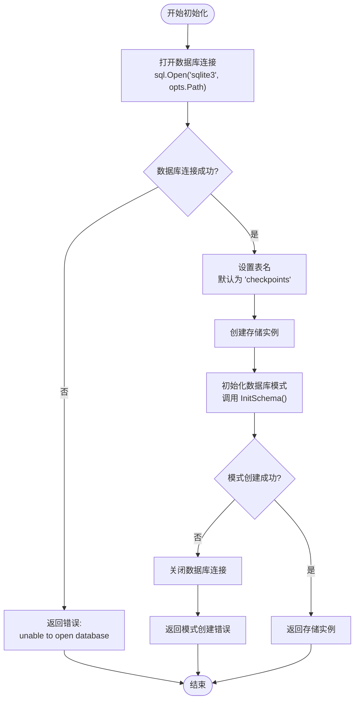
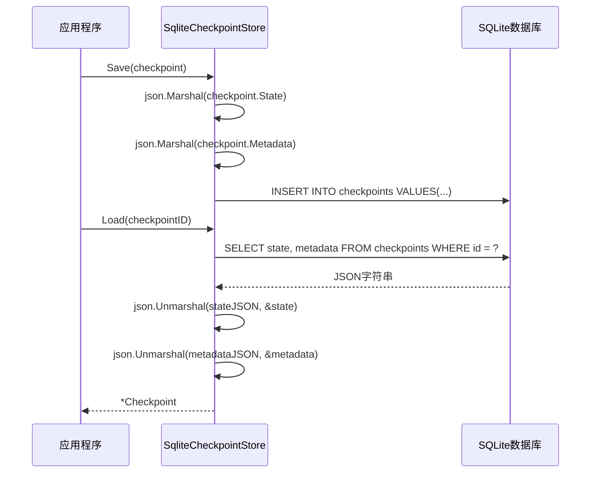
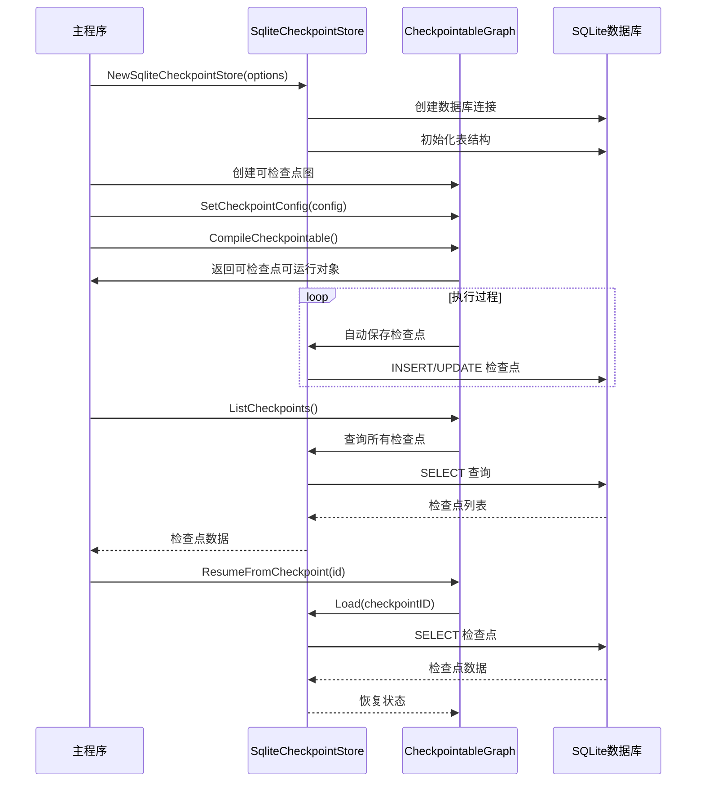

# SQLite 检查点存储

<cite>
**本文档引用的文件**
- [checkpoint/sqlite/sqlite.go](file://checkpoint/sqlite/sqlite.go)
- [examples/checkpointing/sqlite/main.go](file://examples/checkpointing/sqlite/main.go)
- [checkpoint/sqlite/sqlite_test.go](file://checkpoint/sqlite/sqlite_test.go)
- [graph/checkpointing.go](file://graph/checkpointing.go)
- [go.mod](file://go.mod)
- [examples/checkpointing/README.md](file://examples/checkpointing/README.md)
- [examples/checkpointing/main.go](file://examples/checkpointing/main.go)
</cite>

## 目录
1. [简介](#简介)
2. [项目架构概览](#项目架构概览)
3. [核心组件分析](#核心组件分析)
4. [初始化过程详解](#初始化过程详解)
5. [数据库模式设计](#数据库模式设计)
6. [文件路径配置](#文件路径配置)
7. [状态序列化与反序列化](#状态序列化与反序列化)
8. [性能特性分析](#性能特性分析)
9. [使用示例](#使用示例)
10. [故障排除指南](#故障排除指南)
11. [总结](#总结)

## 简介

SQLite 检查点存储是 LangGraphGo 框架中用于持久化图状态的一种轻量级解决方案。它基于 SQLite 文件型数据库，提供了零配置、单文件部署的优势，特别适用于边缘设备、桌面应用程序或开发测试环境。

SQLite 检查点存储实现了 `CheckpointStore` 接口，支持完整的检查点生命周期管理，包括保存、加载、列表查询、删除和清理操作。通过 JSON 序列化技术，它能够将复杂的图状态转换为可持久化的数据格式。

## 项目架构概览

LangGraphGo 提供了多种检查点存储实现，形成了一个统一的接口体系：

```mermaid
classDiagram
class CheckpointStore {
<<interface>>
+Save(ctx, checkpoint) error
+Load(ctx, checkpointID) *Checkpoint
+List(ctx, executionID) []*Checkpoint
+Delete(ctx, checkpointID) error
+Clear(ctx, executionID) error
}
class SqliteCheckpointStore {
-db *sql.DB
-tableName string
+InitSchema(ctx) error
+Close() error
+Save(ctx, checkpoint) error
+Load(ctx, checkpointID) *Checkpoint
+List(ctx, executionID) []*Checkpoint
+Delete(ctx, checkpointID) error
+Clear(ctx, executionID) error
}
class SqliteOptions {
+Path string
+TableName string
}
class Checkpoint {
+ID string
+NodeName string
+State interface{}
+Metadata map[string]interface{}
+Timestamp time.Time
+Version int
}
CheckpointStore <|-- SqliteCheckpointStore
SqliteCheckpointStore --> SqliteOptions
SqliteCheckpointStore --> Checkpoint
```

**图表来源**
- [checkpoint/sqlite/sqlite.go](file://checkpoint/sqlite/sqlite.go#L13-L17)
- [graph/checkpointing.go](file://graph/checkpointing.go#L22-L38)

**章节来源**
- [checkpoint/sqlite/sqlite.go](file://checkpoint/sqlite/sqlite.go#L1-L236)
- [graph/checkpointing.go](file://graph/checkpointing.go#L1-L560)

## 核心组件分析

### SqliteCheckpointStore 结构体

`SqliteCheckpointStore` 是 SQLite 检查点存储的核心实现，包含两个关键字段：

- `db`: 数据库连接对象，负责与 SQLite 数据库的所有交互
- `tableName`: 表名，默认为 "checkpoints"，支持自定义配置

### SqliteOptions 配置结构

`SqliteOptions` 提供了 SQLite 存储的配置选项：

- `Path`: 数据库文件路径，支持相对路径、绝对路径或特殊值如 ":memory:"
- `TableName`: 表名，默认为 "checkpoints"

### Checkpoint 数据结构

每个检查点包含以下信息：

- `ID`: 唯一标识符
- `NodeName`: 执行节点名称
- `State`: 图状态数据（任意类型）
- `Metadata`: 元数据信息
- `Timestamp`: 创建时间戳
- `Version`: 版本号

**章节来源**
- [checkpoint/sqlite/sqlite.go](file://checkpoint/sqlite/sqlite.go#L13-L23)

## 初始化过程详解

SQLite 检查点存储的初始化遵循严格的步骤顺序：



**图表来源**
- [checkpoint/sqlite/sqlite.go](file://checkpoint/sqlite/sqlite.go#L25-L47)

### 数据库连接建立

初始化过程首先尝试建立数据库连接：

```go
db, err := sql.Open("sqlite3", opts.Path)
```

支持的路径类型：
- **文件路径**: 如 "./checkpoints.db" 或 "/var/lib/app/checkpoints.db"
- **内存数据库**: 使用 ":memory:" 创建临时数据库
- **URL 格式**: 支持 SQLite URL 格式参数

### 模式初始化

`InitSchema` 方法创建必要的数据库表和索引：

```sql
CREATE TABLE IF NOT EXISTS {tableName} (
    id TEXT PRIMARY KEY,
    execution_id TEXT NOT NULL,
    node_name TEXT NOT NULL,
    state TEXT NOT NULL,
    metadata TEXT,
    timestamp DATETIME NOT NULL,
    version INTEGER NOT NULL
);
CREATE INDEX IF NOT EXISTS idx_{tableName}_execution_id 
ON {tableName} (execution_id);
```

该模式设计考虑了以下优化：
- 主键索引确保唯一性约束
- 执行 ID 索引支持高效的查询操作
- 文本字段存储序列化后的状态和元数据

**章节来源**
- [checkpoint/sqlite/sqlite.go](file://checkpoint/sqlite/sqlite.go#L25-L70)

## 数据库模式设计

SQLite 检查点存储采用简洁而高效的数据库模式设计：

### 表结构定义

| 字段名 | 数据类型 | 约束 | 描述 |
|--------|----------|------|------|
| id | TEXT | PRIMARY KEY | 检查点唯一标识符 |
| execution_id | TEXT | NOT NULL | 执行线程标识符 |
| node_name | TEXT | NOT NULL | 执行节点名称 |
| state | TEXT | NOT NULL | JSON 序列化的状态数据 |
| metadata | TEXT | NULLABLE | JSON 序列化的元数据 |
| timestamp | DATETIME | NOT NULL | 创建时间戳 |
| version | INTEGER | NOT NULL | 版本号 |

### 索引策略

- **主键索引**: 自动为 `id` 字段创建主键索引
- **执行 ID 索引**: 为 `execution_id` 创建复合索引，优化按执行线程查询

### 数据完整性保证

- **唯一性**: `id` 字段确保每个检查点的唯一性
- **非空约束**: 关键字段如 `execution_id`、`node_name`、`state`、`timestamp` 和 `version` 必须提供值
- **版本控制**: `version` 字段支持状态版本追踪

**章节来源**
- [checkpoint/sqlite/sqlite.go](file://checkpoint/sqlite/sqlite.go#L51-L62)

## 文件路径配置

### 环境变量配置

SQLite 检查点存储支持通过环境变量配置数据库文件路径：

```go
dbPath := os.Getenv("SQLITE_DB_PATH")
if dbPath == "" {
    dbPath = "./checkpoints.db"
}
```

### 路径配置选项

| 配置方式 | 示例 | 适用场景 |
|----------|------|----------|
| 环境变量 | `SQLITE_DB_PATH=/var/lib/app/checkpoints.db` | 生产环境，集中配置 |
| 默认路径 | `./checkpoints.db` | 开发测试，当前目录 |
| 绝对路径 | `/data/checkpoints.sqlite` | 固定位置存储 |
| 内存数据库 | `:memory:` | 测试环境，临时数据 |

### 文件权限管理

在生产环境中需要注意以下文件权限要求：

- **读写权限**: 应用程序需要对数据库文件所在目录具有读写权限
- **目录权限**: 确保包含数据库文件的目录具有适当的访问权限
- **磁盘空间**: 定期监控磁盘空间使用情况，避免因空间不足导致写入失败

### 最佳实践建议

1. **路径选择**: 在生产环境中使用绝对路径，避免相对路径带来的不确定性
2. **备份策略**: 定期备份数据库文件，防止数据丢失
3. **权限控制**: 设置适当的文件权限，限制不必要的访问
4. **监控告警**: 实施磁盘空间和文件访问的监控机制

**章节来源**
- [examples/checkpointing/sqlite/main.go](file://examples/checkpointing/sqlite/main.go#L21-L25)

## 状态序列化与反序列化

### JSON 序列化机制

SQLite 检查点存储使用 JSON 序列化技术处理复杂的状态数据：



**图表来源**
- [checkpoint/sqlite/sqlite.go](file://checkpoint/sqlite/sqlite.go#L78-L161)

### 序列化处理流程

#### 保存时的序列化

1. **状态序列化**: 将 `checkpoint.State` 转换为 JSON 字符串
2. **元数据序列化**: 将 `checkpoint.Metadata` 转换为 JSON 字符串
3. **执行 ID 提取**: 从元数据中提取 `execution_id` 字段
4. **数据库插入**: 使用 UPSERT 语句确保数据一致性

#### 加载时的反序列化

1. **数据库查询**: 获取序列化的状态和元数据字符串
2. **状态反序列化**: 将 JSON 字符串还原为原始状态结构
3. **元数据反序列化**: 还原元数据到 map 结构
4. **类型转换**: 将 map 转换为具体的 Go 类型

### 结构体转换实现细节

在实际应用中，从 JSON 反序列化得到的通常是 `map[string]interface{}` 类型，需要转换为目标结构体：

```go
// 示例：从 map 转换为目标结构体
var resumed ProcessState
importJSON, _ := json.Marshal(resumedState)
json.Unmarshal(importJSON, &resumed)
```

这种转换方法的优点：
- **通用性**: 适用于任何结构体类型
- **灵活性**: 不依赖特定的结构体定义
- **简单性**: 使用标准库即可完成转换

### 性能考虑

- **序列化开销**: 大型复杂状态可能产生较大的 JSON 字符串
- **内存使用**: 序列化过程会增加临时内存消耗
- **I/O 操作**: 频繁的读写操作可能影响性能

**章节来源**
- [checkpoint/sqlite/sqlite.go](file://checkpoint/sqlite/sqlite.go#L78-L161)
- [examples/checkpointing/sqlite/main.go](file://examples/checkpointing/sqlite/main.go#L136-L140)

## 性能特性分析

### 零配置优势

SQLite 检查点存储的最大优势在于其零配置特性：

- **无需安装**: 内置于 Go 程序中，无外部依赖
- **即用性强**: 单文件部署，开箱即用
- **维护简单**: 无复杂的配置文件和环境设置

### 单文件部署优势

- **便携性**: 整个应用可以打包为单个可执行文件
- **部署简化**: 减少部署复杂度和运维成本
- **环境一致性**: 确保开发、测试、生产环境的一致性

### 高并发写入限制

SQLite 在高并发写入场景下存在以下限制：

#### 并发写入限制

- **文件锁定**: SQLite 使用文件级锁定，同一时间只能有一个写操作
- **性能瓶颈**: 多个写操作会排队等待，形成性能瓶颈
- **适用场景**: 更适合读多写少的应用场景

#### 性能优化建议

1. **批量操作**: 尽可能合并多个写操作
2. **异步处理**: 使用异步方式减少阻塞
3. **读写分离**: 对于读密集型应用，考虑读写分离策略
4. **缓存机制**: 在内存中缓存频繁访问的数据

### 存储效率分析

- **存储开销**: JSON 序列化会增加一定的存储空间
- **压缩效果**: 对于大型状态数据，JSON 格式通常有较好的压缩比
- **索引效率**: 合理的索引设计可以显著提升查询性能

### 内存使用特点

- **内存占用**: 相比其他存储方案，SQLite 的内存占用较低
- **连接池**: Go 的 `database/sql` 包自动管理连接池
- **垃圾回收**: 依赖 Go 的垃圾回收机制管理内存

**章节来源**
- [checkpoint/sqlite/sqlite.go](file://checkpoint/sqlite/sqlite.go#L1-L11)

## 使用示例

### 基础使用示例

以下展示了如何在实际应用中使用 SQLite 检查点存储：



**图表来源**
- [examples/checkpointing/sqlite/main.go](file://examples/checkpointing/sqlite/main.go#L32-L47)
- [examples/checkpointing/sqlite/main.go](file://examples/checkpointing/sqlite/main.go#L102-L146)

### 配置选项详解

#### 基本配置

```go
store, err := sqlite.NewSqliteCheckpointStore(sqlite.SqliteOptions{
    Path:      dbPath,           // 数据库文件路径
    TableName: "example_checkpoints", // 自定义表名
})
```

#### 检查点配置

```go
config := graph.CheckpointConfig{
    Store:          store,           // 检查点存储
    AutoSave:       true,           // 自动保存
    SaveInterval:   2 * time.Second, // 保存间隔
    MaxCheckpoints: 5,             // 最大检查点数量
}
```

### 状态恢复流程

状态恢复是一个重要的功能，允许从任意检查点重新开始执行：

1. **检查点选择**: 从可用的检查点列表中选择目标检查点
2. **数据加载**: 从数据库加载检查点数据
3. **状态重建**: 反序列化状态数据
4. **类型转换**: 将通用类型转换为目标结构体
5. **执行恢复**: 从检查点继续执行

### 错误处理策略

在实际应用中，需要妥善处理各种可能的错误：

- **数据库连接错误**: 检查文件权限和路径有效性
- **序列化错误**: 验证状态数据的可序列化性
- **并发冲突**: 处理数据库锁定和事务冲突
- **资源耗尽**: 监控磁盘空间和内存使用

**章节来源**
- [examples/checkpointing/sqlite/main.go](file://examples/checkpointing/sqlite/main.go#L32-L146)

## 故障排除指南

### 常见问题及解决方案

#### 数据库连接问题

**问题**: 无法打开数据库文件
**原因**: 
- 文件路径不存在
- 权限不足
- 磁盘空间不足

**解决方案**:
```go
// 检查文件路径
if _, err := os.Stat(dbPath); os.IsNotExist(err) {
    // 创建目录
    os.MkdirAll(filepath.Dir(dbPath), 0755)
}

// 检查权限
file, err := os.OpenFile(dbPath, os.O_RDWR|os.O_CREATE, 0644)
if err != nil {
    // 处理权限错误
}
```

#### 序列化问题

**问题**: 状态数据无法序列化或反序列化
**原因**:
- 循环引用
- 不支持的类型
- 数据损坏

**解决方案**:
```go
// 使用自定义序列化器
type SerializableState struct {
    Step    int
    Data    string
    History []string
}

// 实现 json.Marshaler 和 json.Unmarshaler 接口
func (s *SerializableState) MarshalJSON() ([]byte, error) {
    // 自定义序列化逻辑
}

func (s *SerializableState) UnmarshalJSON(data []byte) error {
    // 自定义反序列化逻辑
}
```

#### 性能问题

**问题**: 写入性能差
**原因**:
- 频繁的小批量写入
- 缺乏适当的索引
- 数据库锁定竞争

**解决方案**:
```go
// 批量写入优化
type BatchWriter struct {
    store *sqlite.SqliteCheckpointStore
    buffer []*graph.Checkpoint
    maxBatchSize int
}

func (bw *BatchWriter) Write(checkpoint *graph.Checkpoint) error {
    bw.buffer = append(bw.buffer, checkpoint)
    if len(bw.buffer) >= bw.maxBatchSize {
        return bw.Flush()
    }
    return nil
}
```

### 监控和调试

#### 日志记录

```go
import "log"

func (s *SqliteCheckpointStore) Save(ctx context.Context, checkpoint *graph.Checkpoint) error {
    log.Printf("Saving checkpoint: ID=%s, Node=%s, Version=%d", 
               checkpoint.ID, checkpoint.NodeName, checkpoint.Version)
    
    // 保存逻辑...
    
    log.Printf("Checkpoint saved successfully: ID=%s", checkpoint.ID)
    return nil
}
```

#### 性能监控

```go
type MonitoredStore struct {
    store *sqlite.SqliteCheckpointStore
    metrics *MetricsCollector
}

func (ms *MonitoredStore) Save(ctx context.Context, checkpoint *graph.Checkpoint) error {
    start := time.Now()
    defer func() {
        ms.metrics.RecordSaveDuration(time.Since(start))
    }()
    
    return ms.store.Save(ctx, checkpoint)
}
```

**章节来源**
- [checkpoint/sqlite/sqlite_test.go](file://checkpoint/sqlite/sqlite_test.go#L1-L83)

## 总结

SQLite 检查点存储为 LangGraphGo 提供了一个轻量级、易用且功能完整的状态持久化解决方案。它特别适合以下应用场景：

### 适用场景

1. **边缘设备**: 资源受限的环境，需要简单的本地存储
2. **桌面应用**: 需要本地状态持久化的应用程序
3. **开发测试**: 快速原型开发和测试环境
4. **小型系统**: 不需要复杂数据库功能的简单应用

### 优势总结

- **零配置部署**: 无需额外的数据库服务器
- **单文件管理**: 简化了部署和维护流程
- **跨平台兼容**: 支持所有主流操作系统
- **成熟稳定**: SQLite 是经过验证的可靠数据库引擎

### 使用建议

1. **环境变量配置**: 在生产环境中使用 `SQLITE_DB_PATH` 环境变量
2. **定期备份**: 建立数据库文件的定期备份策略
3. **监控告警**: 实施磁盘空间和文件访问的监控
4. **性能评估**: 在高负载场景下进行性能测试和优化

### 发展方向

随着应用需求的增长，可以考虑以下演进路径：
- **水平扩展**: 从单文件存储迁移到分布式数据库
- **性能优化**: 引入缓存层和批量处理机制
- **功能增强**: 添加数据压缩和加密功能
- **监控集成**: 集成更完善的监控和诊断工具

SQLite 检查点存储为 LangGraphGo 应用提供了一个可靠的起点，随着应用的发展，可以根据具体需求选择合适的演进路径。