# 流式输出

<cite>
**本文档中引用的文件**
- [examples/streaming_modes/main.go](file://examples/streaming_modes/main.go)
- [examples/streaming_pipeline/main.go](file://examples/streaming_pipeline/main.go)
- [examples/streaming_modes/README.md](file://examples/streaming_modes/README.md)
- [examples/streaming_pipeline/README.md](file://examples/streaming_pipeline/README.md)
- [examples/listeners/main.go](file://examples/listeners/main.go)
- [graph/streaming.go](file://graph/streaming.go)
- [graph/listeners.go](file://graph/listeners.go)
- [graph/retry.go](file://graph/retry.go)
- [showcases/deerflow/web/index.html](file://showcases/deerflow/web/index.html)
- [showcases/deerflow/web/app.js](file://showcases/deerflow/web/app.js)
- [showcases/deerflow/main.go](file://showcases/deerflow/main.go)
</cite>

## 目录
1. [简介](#简介)
2. [项目结构](#项目结构)
3. [核心组件](#核心组件)
4. [架构概览](#架构概览)
5. [详细组件分析](#详细组件分析)
6. [流模式详解](#流模式详解)
7. [背压处理机制](#背压处理机制)
8. [错误处理与超时](#错误处理与超时)
9. [前端可视化示例](#前端可视化示例)
10. [最佳实践](#最佳实践)
11. [故障排除指南](#故障排除指南)
12. [总结](#总结)

## 简介

LangGraph Go 提供了强大的流式输出功能，支持实时数据处理和用户交互。该系统通过多种流模式（Streaming Modes）提供灵活的数据传输方式，从逐令牌输出到完整状态更新，满足不同应用场景的需求。

流式输出的核心优势包括：
- **实时反馈**：用户可以立即看到处理进度
- **背压控制**：防止系统过载
- **错误恢复**：优雅处理各种异常情况
- **多模式支持**：根据需求选择合适的流模式

## 项目结构

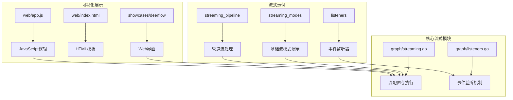

**图表来源**
- [examples/streaming_modes/main.go](file://examples/streaming_modes/main.go#L1-L55)
- [examples/streaming_pipeline/main.go](file://examples/streaming_pipeline/main.go#L1-L80)
- [graph/streaming.go](file://graph/streaming.go#L1-L476)

## 核心组件

### 流配置系统

流式输出的核心是 `StreamConfig` 结构体，它定义了流行为的各种参数：

```mermaid
classDiagram
class StreamConfig {
+int BufferSize
+bool EnableBackpressure
+int MaxDroppedEvents
+StreamMode Mode
+DefaultStreamConfig() StreamConfig
}
class StreamMode {
<<enumeration>>
StreamModeValues
StreamModeUpdates
StreamModeMessages
StreamModeDebug
}
class StreamResult {
+Events <-chan StreamEvent
+Result <-chan interface{}
+Errors <-chan error
+Done <-chan struct{}
+Cancel context.CancelFunc
}
StreamConfig --> StreamMode
StreamConfig --> StreamResult
```

**图表来源**
- [graph/streaming.go](file://graph/streaming.go#L24-L46)
- [graph/streaming.go](file://graph/streaming.go#L9-L21)

### 事件监听机制

系统通过监听器模式实现事件捕获和处理：

```mermaid
classDiagram
class NodeListener {
<<interface>>
+OnNodeEvent(ctx, event, nodeName, state, err)
}
class StreamingListener {
-eventChan chan~StreamEvent~
-config StreamConfig
-mutex sync.RWMutex
-droppedEvents int
-closed bool
+emitEvent(event)
+shouldEmit(event) bool
+handleBackpressure()
}
class StreamEvent {
+Timestamp time.Time
+NodeName string
+Event NodeEvent
+State interface{}
+Error error
+Metadata map[string]interface{}
+Duration time.Duration
}
NodeListener <|.. StreamingListener
StreamingListener --> StreamEvent
```

**图表来源**
- [graph/listeners.go](file://graph/listeners.go#L51-L55)
- [graph/streaming.go](file://graph/streaming.go#L66-L74)

**章节来源**
- [graph/streaming.go](file://graph/streaming.go#L24-L64)
- [graph/listeners.go](file://graph/listeners.go#L51-L87)

## 架构概览

LangGraph Go 的流式输出架构采用分层设计，确保高性能和可扩展性：

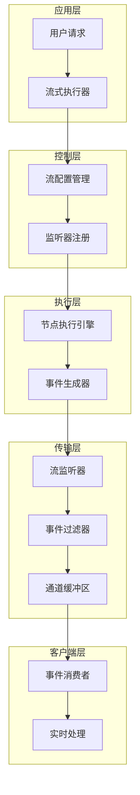

**图表来源**
- [graph/streaming.go](file://graph/streaming.go#L289-L358)
- [examples/streaming_pipeline/main.go](file://examples/streaming_pipeline/main.go#L50-L71)

## 详细组件分析

### 流式执行器

`StreamingExecutor` 是流式输出的主要入口点，提供了高级的执行接口：

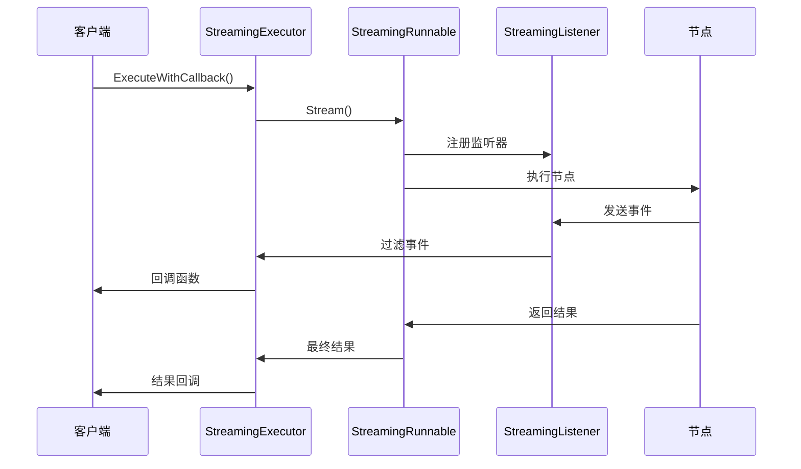

**图表来源**
- [graph/streaming.go](file://graph/streaming.go#L414-L465)
- [examples/streaming_pipeline/main.go](file://examples/streaming_pipeline/main.go#L52-L71)

### 事件类型系统

系统定义了丰富的事件类型来表示不同的执行阶段：

| 事件类型 | 描述 | 触发时机 |
|---------|------|----------|
| `NodeEventStart` | 节点开始执行 | 节点函数被调用时 |
| `NodeEventComplete` | 节点成功完成 | 节点返回成功结果时 |
| `NodeEventError` | 节点执行出错 | 节点返回错误时 |
| `EventChainStart` | 链开始执行 | 图执行开始时 |
| `EventChainEnd` | 链执行完成 | 图执行结束时 |
| `EventToolStart` | 工具开始执行 | 工具调用开始时 |
| `EventToolEnd` | 工具执行完成 | 工具调用结束时 |
| `EventLLMStart` | LLM调用开始 | LLM请求发送时 |
| `EventLLMEnd` | LLM调用完成 | LLM响应接收时 |

**章节来源**
- [graph/listeners.go](file://graph/listeners.go#L14-L48)

## 流模式详解

### 更新模式 (Updates Mode)

更新模式是最常用的流模式，只发送节点输出：

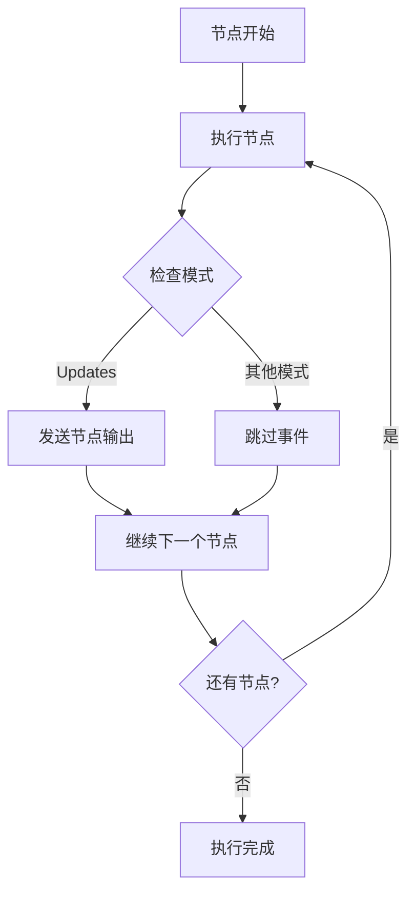

**图表来源**
- [graph/streaming.go](file://graph/streaming.go#L124-L126)

### 值模式 (Values Mode)

值模式发送完整的图状态：

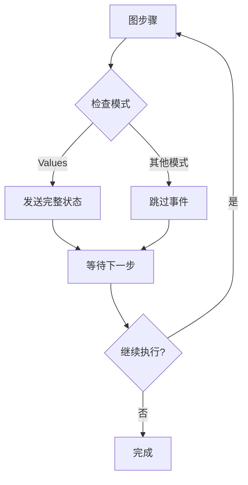

**图表来源**
- [graph/streaming.go](file://graph/streaming.go#L117-L122)

### 消息模式 (Messages Mode)

消息模式专门用于 LLM 输出流：

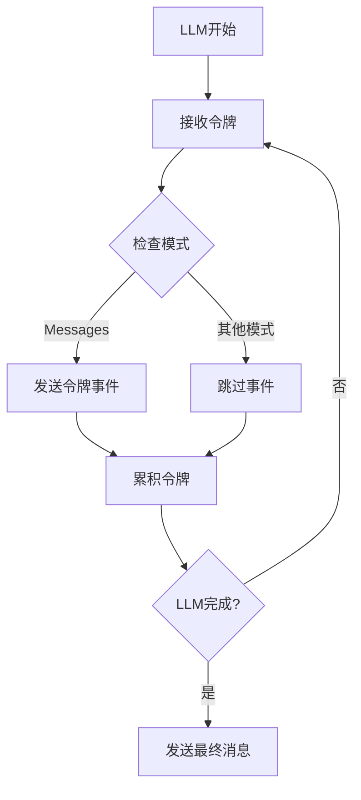

**图表来源**
- [graph/streaming.go](file://graph/streaming.go#L127-L129)

### 调试模式 (Debug Mode)

调试模式提供最详细的事件信息：

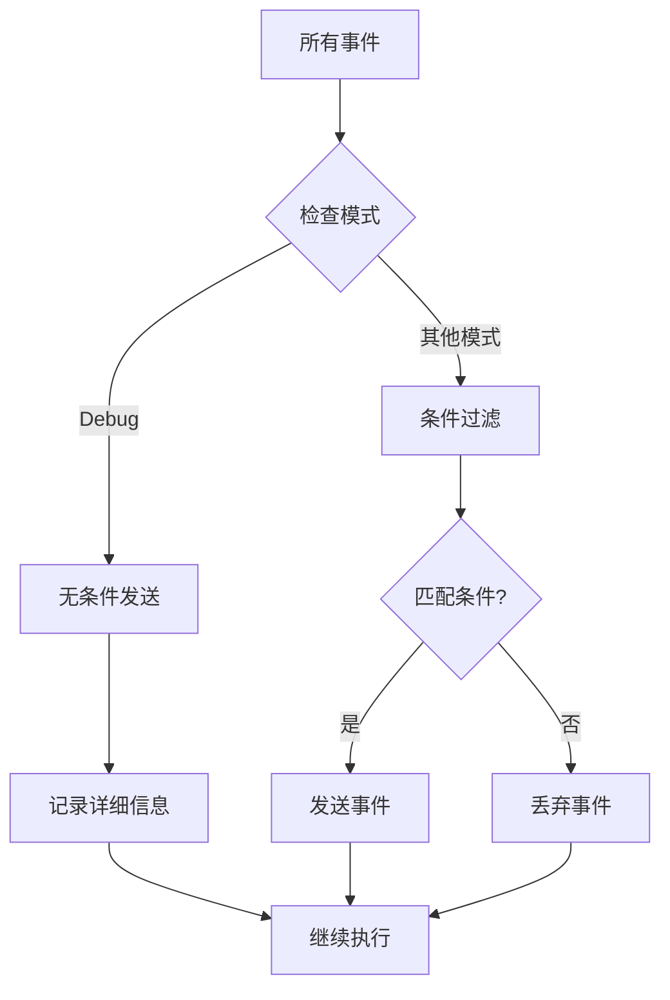

**图表来源**
- [graph/streaming.go](file://graph/streaming.go#L114-L116)

**章节来源**
- [examples/streaming_modes/main.go](file://examples/streaming_modes/main.go#L32-L35)
- [examples/streaming_pipeline/main.go](file://examples/streaming_pipeline/main.go#L32-L42)

## 背压处理机制

### 背压检测与处理

系统实现了智能的背压处理机制来防止内存溢出：

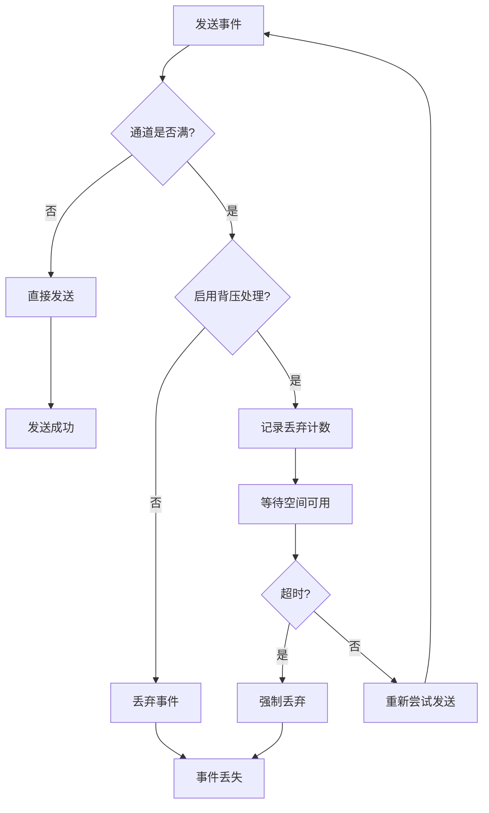

**图表来源**
- [graph/streaming.go](file://graph/streaming.go#L99-L109)
- [graph/streaming.go](file://graph/streaming.go#L252-L261)

### 配置参数

| 参数 | 类型 | 默认值 | 描述 |
|------|------|--------|------|
| `BufferSize` | int | 1000 | 事件通道缓冲区大小 |
| `EnableBackpressure` | bool | true | 是否启用背压处理 |
| `MaxDroppedEvents` | int | 100 | 最大允许丢弃事件数 |

**章节来源**
- [graph/streaming.go](file://graph/streaming.go#L25-L33)

## 错误处理与超时

### 上下文取消机制

系统完全支持 Go 的上下文取消机制：

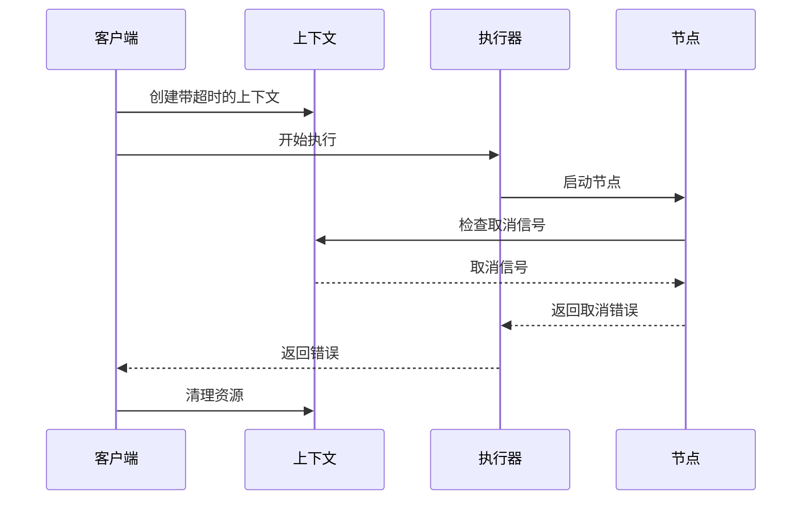

**图表来源**
- [graph/retry.go](file://graph/retry.go#L126-L150)

### 超时处理

系统提供了多种超时处理机制：

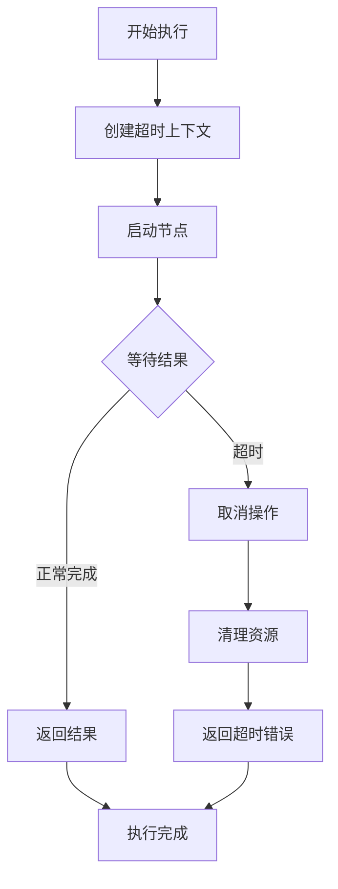

**图表来源**
- [graph/retry.go](file://graph/retry.go#L128-L149)

### 错误恢复策略

| 策略 | 适用场景 | 实现方式 |
|------|----------|----------|
| **重试机制** | 临时性错误 | 指数退避算法 |
| **熔断器** | 服务不可用 | 状态机切换 |
| **限流** | 防止过载 | 时间窗口计数 |
| **超时** | 长时间无响应 | 上下文超时 |

**章节来源**
- [graph/retry.go](file://graph/retry.go#L101-L363)

## 前端可视化示例

### WebSocket 实现

前端通过 Server-Sent Events (SSE) 实现实时通信：

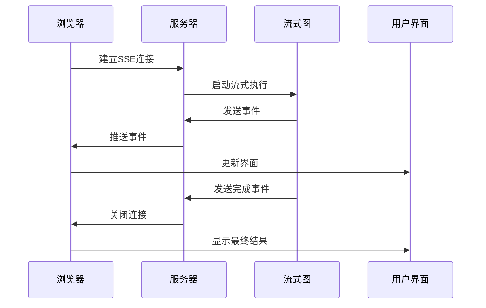

**图表来源**
- [showcases/deerflow/web/app.js](file://showcases/deerflow/web/app.js#L69-L109)
- [showcases/deerflow/main.go](file://showcases/deerflow/main.go#L67-L163)

### HTML 结构

前端界面采用响应式设计，包含聊天和报告面板：

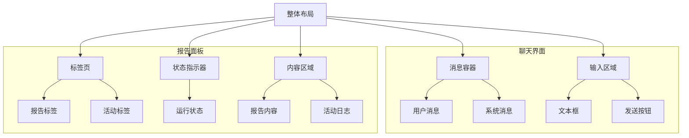

**图表来源**
- [showcases/deerflow/web/index.html](file://showcases/deerflow/web/index.html#L40-L96)

### JavaScript 处理逻辑

前端通过事件源处理不同类型的消息：

| 事件类型 | 处理方式 | 显示内容 |
|----------|----------|----------|
| `update` | 更新状态指示器 | 步骤信息、进度 |
| `log` | 添加到日志列表 | 详细执行日志 |
| `result` | 显示最终报告 | Markdown格式报告 |
| `error` | 显示错误消息 | 错误详情 |

**章节来源**
- [showcases/deerflow/web/app.js](file://showcases/deerflow/web/app.js#L72-L102)
- [showcases/deerflow/web/index.html](file://showcases/deerflow/web/index.html#L1-L103)

## 最佳实践

### 性能优化建议

1. **合理设置缓冲区大小**
   - 小型应用：100-500
   - 中型应用：1000-5000
   - 大型应用：10000+

2. **选择合适的流模式**
   - 实时反馈：使用 Updates 模式
   - 调试开发：使用 Debug 模式
   - 生产环境：根据需求选择

3. **监控背压情况**
   - 定期检查丢弃事件数量
   - 调整缓冲区大小
   - 实施降级策略

### 错误处理最佳实践

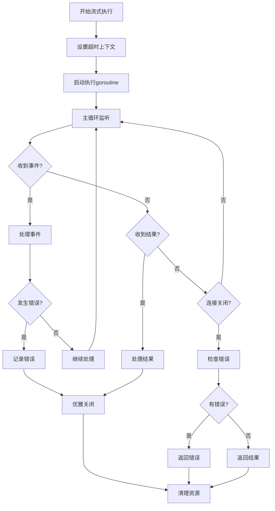

### 并发安全考虑

1. **使用互斥锁保护共享状态**
2. **避免在监听器中阻塞**
3. **正确处理通道关闭**
4. **实施优雅关闭机制**

## 故障排除指南

### 常见问题及解决方案

| 问题 | 症状 | 解决方案 |
|------|------|----------|
| **事件丢失** | 部分事件未到达客户端 | 增加缓冲区大小或启用背压 |
| **内存泄漏** | 内存使用持续增长 | 检查通道关闭逻辑 |
| **连接超时** | 客户端连接中断 | 调整超时设置 |
| **性能下降** | 处理速度变慢 | 优化事件过滤逻辑 |

### 调试技巧

1. **启用调试模式**：使用 `StreamModeDebug` 获取详细信息
2. **监控指标**：跟踪事件发送和接收统计
3. **日志记录**：添加适当的日志语句
4. **压力测试**：模拟高并发场景

### 性能监控

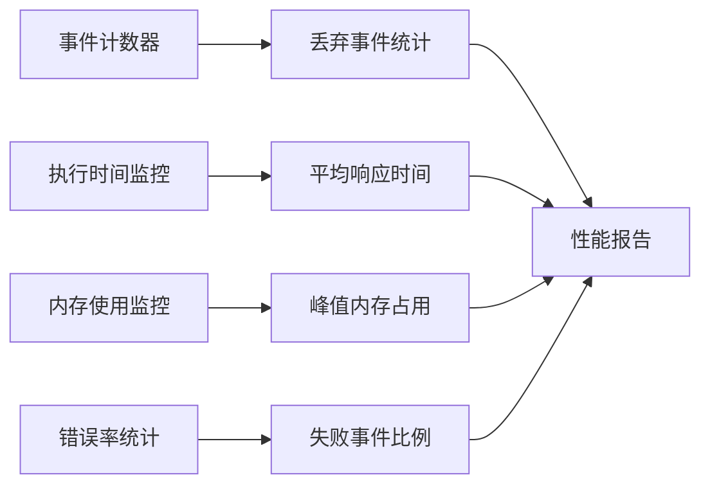

**章节来源**
- [examples/streaming_pipeline/main.go](file://examples/streaming_pipeline/main.go#L76-L79)

## 总结

LangGraph Go 的流式输出系统提供了强大而灵活的实时数据处理能力。通过多种流模式、智能背压处理和完善的错误恢复机制，开发者可以构建高性能的实时应用程序。

### 主要特性回顾

1. **多样化的流模式**：从简单的节点输出到完整的状态更新
2. **智能背压处理**：防止系统过载和内存溢出
3. **完善的错误处理**：支持超时、重试和熔断机制
4. **实时前端集成**：通过 SSE 实现真正的实时通信
5. **高度可配置**：灵活的参数调整和监控选项

### 应用场景

- **AI对话系统**：实时显示生成过程
- **数据分析平台**：流式处理大量数据
- **监控仪表板**：实时显示系统状态
- **协作工具**：实时同步编辑状态

通过合理使用这些功能，开发者可以创建响应迅速、用户体验优秀的现代应用程序。