# 状态模式定义

<cite>
**本文档引用的文件**
- [graph/schema.go](file://graph/schema.go)
- [examples/state_schema/main.go](file://examples/state_schema/main.go)
- [graph/state_graph.go](file://graph/state_graph.go)
- [graph/schema_test.go](file://graph/schema_test.go)
- [graph/checkpointing.go](file://graph/checkpointing.go)
- [graph/messages_graph.go](file://graph/messages_graph.go)
</cite>

## 目录
1. [简介](#简介)
2. [StateSchema 接口设计](#stateschema-接口设计)
3. [MapSchema 实现详解](#mapschema-实现详解)
4. [归约函数系统](#归约函数系统)
5. [StateGraph 集成机制](#stategraph-集成机制)
6. [检查点恢复与状态合并](#检查点恢复与状态合并)
7. [实际应用示例](#实际应用示例)
8. [常见错误与解决方案](#常见错误与解决方案)
9. [最佳实践](#最佳实践)
10. [总结](#总结)

## 简介

StateSchema 是 LangGraphGo 中状态管理的核心抽象，它定义了状态结构的组织方式和更新逻辑。通过 StateSchema，开发者可以为不同类型的状态字段指定特定的更新行为，从而实现类型安全的状态图构建和复杂的业务逻辑处理。

StateSchema 的设计理念基于以下核心原则：
- **类型安全性**: 通过明确的状态结构定义，避免类型断言失败
- **灵活性**: 支持多种更新策略（覆盖、追加、累加等）
- **可扩展性**: 易于添加新的归约函数和状态类型
- **一致性**: 确保状态更新的可预测性和一致性

## StateSchema 接口设计

StateSchema 接口是整个状态管理系统的基础，它定义了状态初始化和更新的核心契约。

### 核心接口定义

```mermaid
classDiagram
class StateSchema {
<<interface>>
+Init() interface{}
+Update(current, new interface{}) (interface{}, error)
}
class CleaningStateSchema {
<<interface>>
+Cleanup(state interface{}) interface{}
}
class MapSchema {
+Reducers map[string]Reducer
+EphemeralKeys map[string]bool
+RegisterReducer(key string, reducer Reducer)
+RegisterChannel(key string, reducer Reducer, isEphemeral bool)
+Init() interface{}
+Update(current, new interface{}) (interface{}, error)
+Cleanup(state interface{}) interface{}
}
StateSchema <|-- CleaningStateSchema : extends
StateSchema <|.. MapSchema : implements
CleaningStateSchema <|.. MapSchema : implements
```

**图表来源**
- [graph/schema.go](file://graph/schema.go#L12-L27)

### Init 方法的作用

Init 方法负责返回状态的初始值，这是状态管理的第一步：

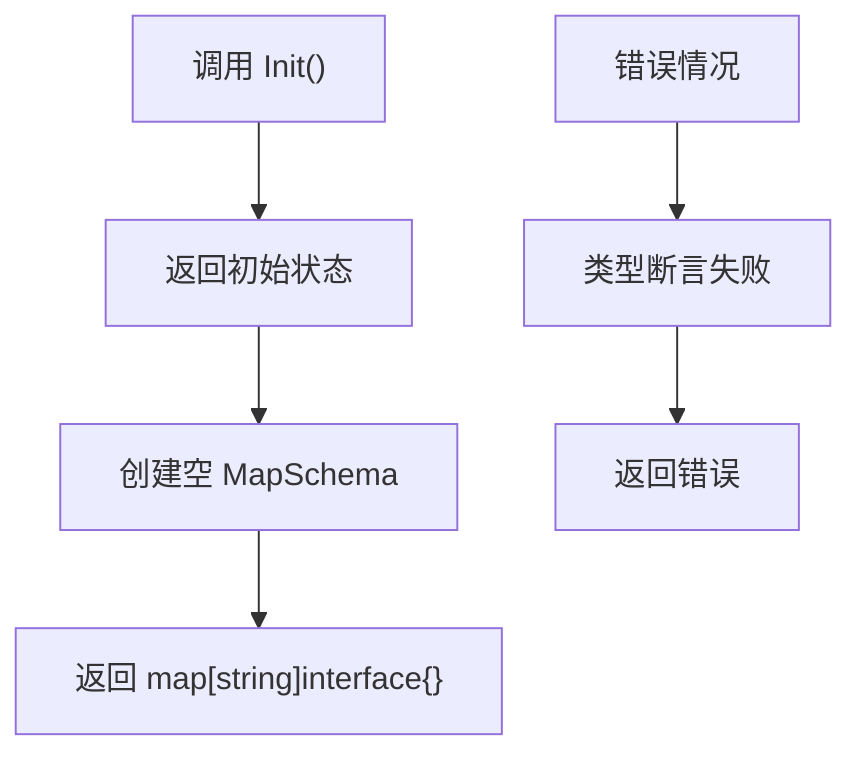

**图表来源**
- [graph/schema.go](file://graph/schema.go#L58-L60)

### Update 方法的工作流程

Update 方法实现了状态合并的核心逻辑，它协调当前状态和新状态的合并过程：

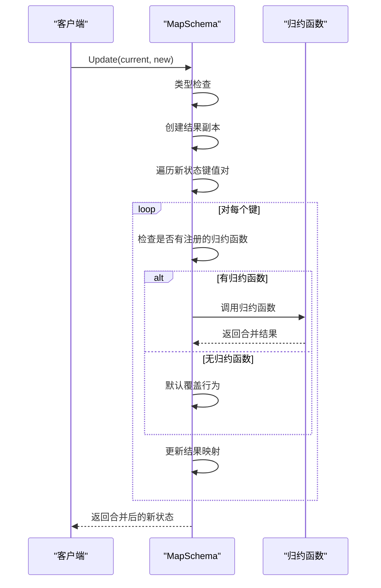

**图表来源**
- [graph/schema.go](file://graph/schema.go#L63-L99)

**章节来源**
- [graph/schema.go](file://graph/schema.go#L12-L19)

## MapSchema 实现详解

MapSchema 是 StateSchema 接口的主要实现，专门用于处理 `map[string]interface{}` 类型的状态结构。

### 数据结构设计

MapSchema 采用两个独立的映射来管理状态：

| 字段 | 类型 | 用途 |
|------|------|------|
| `Reducers` | `map[string]Reducer` | 存储特定键的归约函数 |
| `EphemeralKeys` | `map[string]bool` | 标记临时键，支持清理功能 |

### 注册机制

MapSchema 提供了两种注册方法：

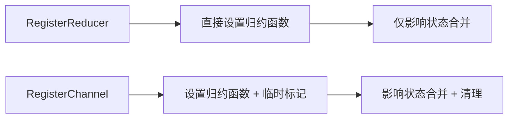

**图表来源**
- [graph/schema.go](file://graph/schema.go#L45-L54)

### 状态合并算法

MapSchema 的 Update 方法实现了智能的状态合并算法：

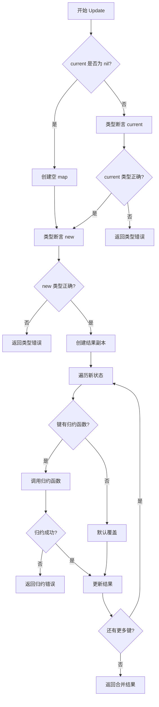

**图表来源**
- [graph/schema.go](file://graph/schema.go#L63-L99)

**章节来源**
- [graph/schema.go](file://graph/schema.go#L29-L100)

## 归约函数系统

归约函数是 StateSchema 系统的核心组件，它们定义了不同数据类型的更新行为。

### 内置归约函数

LangGraphGo 提供了两种内置的归约函数：

#### OverwriteReducer
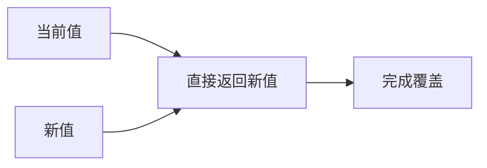

**图表来源**
- [graph/schema.go](file://graph/schema.go#L142-L143)

#### AppendReducer
AppendReducer 支持多种数据类型的追加操作：

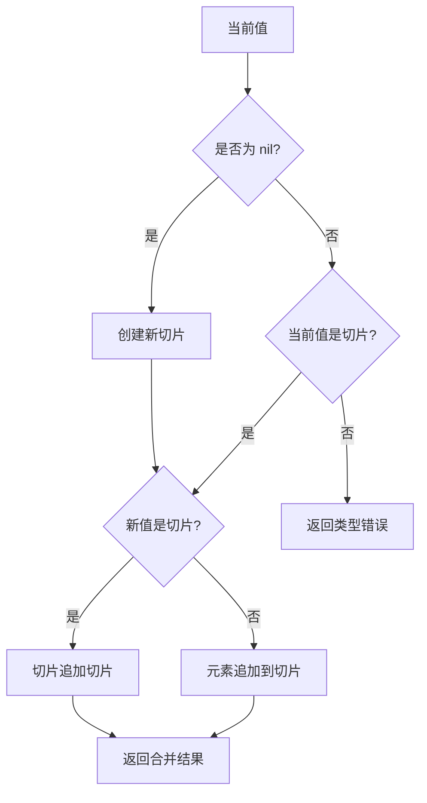

**图表来源**
- [graph/schema.go](file://graph/schema.go#L147-L185)

### 自定义归约函数

开发者可以创建自定义归约函数来满足特定的业务需求：

```mermaid
classDiagram
class CustomReducer {
+SumReducer(current, new interface{}) (interface{}, error)
+MultiplyReducer(current, new interface{}) (interface{}, error)
+MergeMapReducer(current, new interface{}) (interface{}, error)
}
class Reducer {
<<function>>
+func(current, new interface{}) (interface{}, error)
}
CustomReducer ..|> Reducer : implements
```

**图表来源**
- [examples/state_schema/main.go](file://examples/state_schema/main.go#L11-L22)

**章节来源**
- [graph/schema.go](file://graph/schema.go#L141-L185)
- [examples/state_schema/main.go](file://examples/state_schema/main.go#L11-L22)

## StateGraph 集成机制

StateGraph 通过 Schema 字段与 StateSchema 系统深度集成，实现了类型安全的状态管理和执行控制。

### Schema 在 StateGraph 中的角色

```mermaid
classDiagram
class StateGraph {
+Schema StateSchema
+nodes map[string]Node
+AddNode(name string, fn NodeFunc)
+SetSchema(schema StateSchema)
+Compile() (*StateRunnable, error)
}
class StateRunnable {
+graph *StateGraph
+Invoke(ctx, initialState) (interface{}, error)
+InvokeWithConfig(ctx, initialState, config) (interface{}, error)
}
StateGraph --> StateSchema : uses
StateGraph --> StateRunnable : creates
```

**图表来源**
- [graph/state_graph.go](file://graph/state_graph.go#L11-L31)

### 执行过程中的状态更新

在 StateGraph 的执行过程中，Schema 负责管理状态的合并：

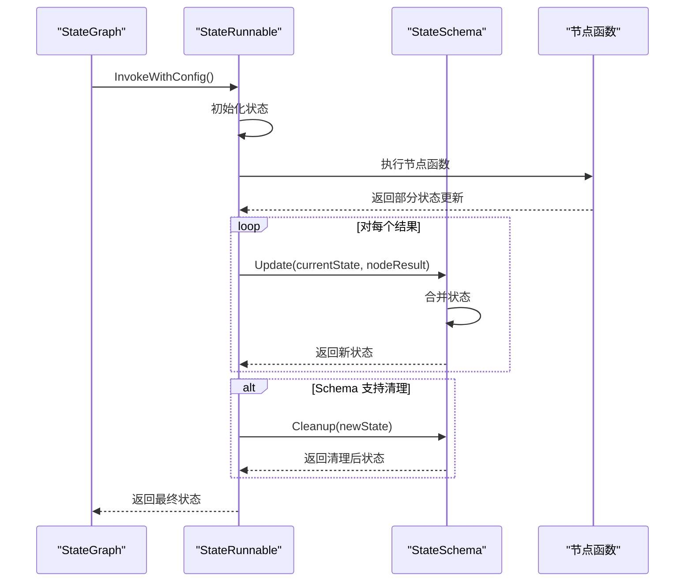

**图表来源**
- [graph/state_graph.go](file://graph/state_graph.go#L200-L210)

### 节点函数与 Schema 的交互

节点函数返回的部分状态更新通过 Schema 进行合并：

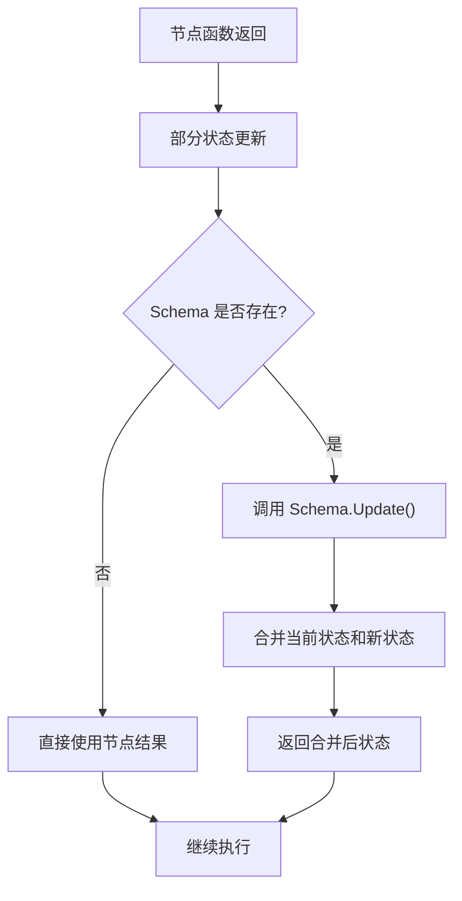

**图表来源**
- [graph/state_graph.go](file://graph/state_graph.go#L200-L210)

**章节来源**
- [graph/state_graph.go](file://graph/state_graph.go#L94-L97)
- [graph/state_graph.go](file://graph/state_graph.go#L105-L113)

## 检查点恢复与状态合并

StateSchema 在检查点恢复机制中发挥关键作用，确保状态的一致性和可恢复性。

### 检查点恢复流程

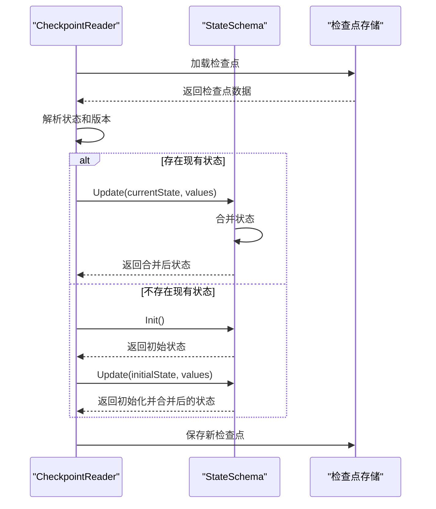

**图表来源**
- [graph/checkpointing.go](file://graph/checkpointing.go#L481-L514)

### 状态合并策略

在检查点恢复过程中，StateSchema 实现了智能的状态合并策略：

| 场景 | 处理方式 | 原因 |
|------|----------|------|
| 初始状态不存在 | Schema.Init() + Schema.Update() | 确保状态一致性 |
| 存在现有状态 | Schema.Update(currentState, values) | 保持状态连续性 |
| 类型不匹配 | 返回类型错误 | 防止数据损坏 |
| 归约失败 | 返回归约错误 | 及时发现逻辑问题 |

**章节来源**
- [graph/checkpointing.go](file://graph/checkpointing.go#L481-L514)

## 实际应用示例

通过具体的代码示例，展示 StateSchema 的实际应用场景和最佳实践。

### 计数器和日志累积示例

这是 StateSchema 最常见的应用场景之一：

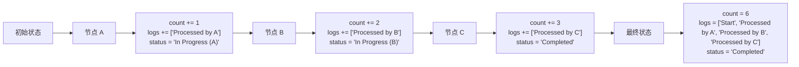

**图表来源**
- [examples/state_schema/main.go](file://examples/state_schema/main.go#L44-L69)

### 消息图的应用

MessagesGraph 展示了更复杂的状态管理模式：

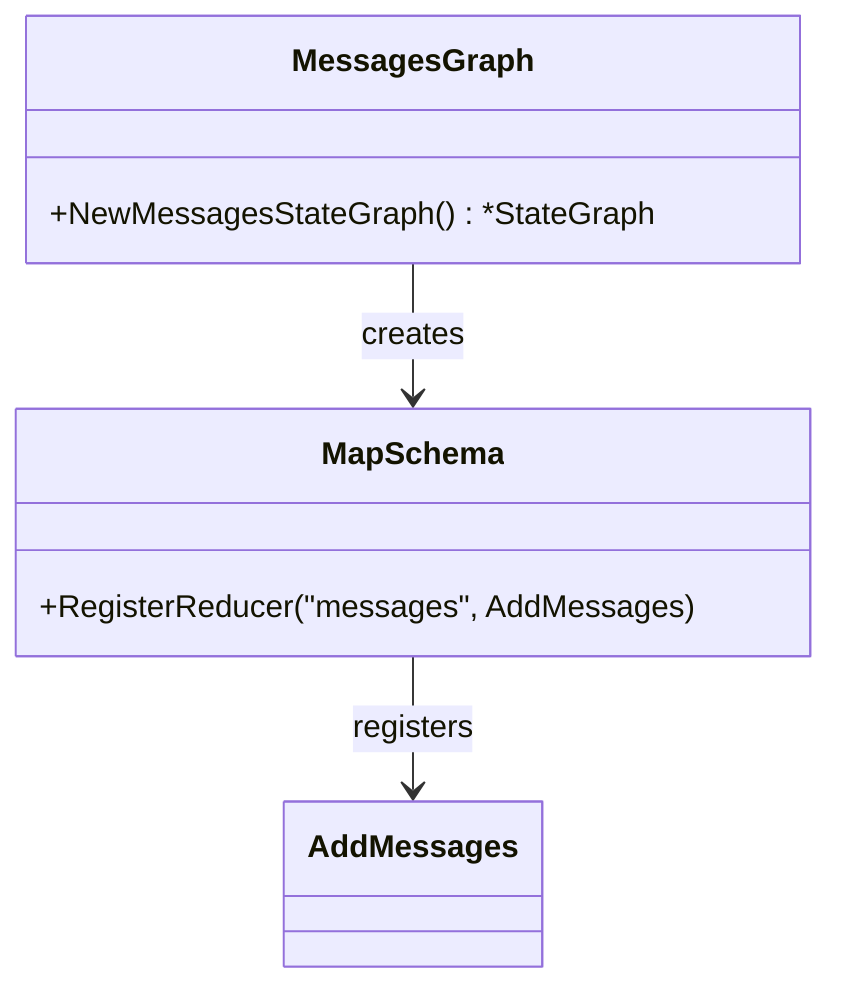

**图表来源**
- [graph/messages_graph.go](file://graph/messages_graph.go#L3-L11)

**章节来源**
- [examples/state_schema/main.go](file://examples/state_schema/main.go#L24-L105)
- [graph/messages_graph.go](file://graph/messages_graph.go#L3-L11)

## 常见错误与解决方案

在使用 StateSchema 时，开发者经常遇到一些典型问题，以下是详细的解决方案。

### 类型断言失败

**问题描述**: 当状态类型与预期不符时发生类型断言失败。

**根本原因**: 
- Schema.Init() 返回的类型与实际使用类型不匹配
- 节点函数返回的状态类型不符合 Schema 的期望

**解决方案**:

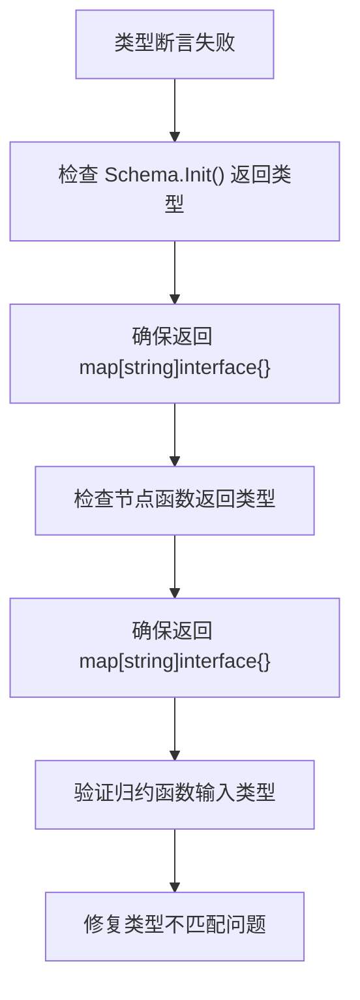

### 归约函数逻辑错误

**问题描述**: 归约函数内部逻辑错误导致状态更新异常。

**常见场景**:
- 数值归约函数处理非数值类型
- 切片归约函数处理非切片类型
- 归约函数返回错误但未正确处理

**解决方案**:

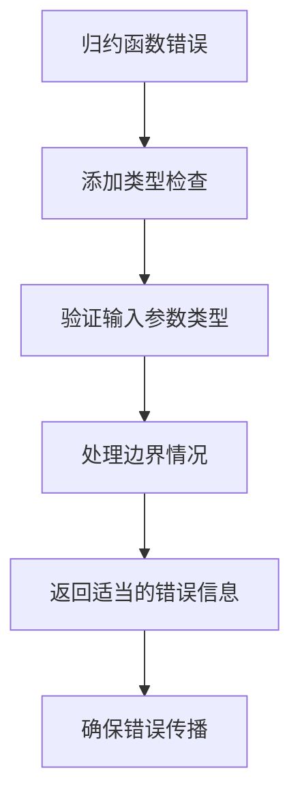

### 状态结构不一致

**问题描述**: 不同节点返回的状态结构不一致，导致合并失败。

**解决方案**:

| 问题类型 | 解决方案 | 实现方式 |
|----------|----------|----------|
| 缺失键 | 在 Schema 中注册默认值 | 使用 OverwriteReducer 设置默认值 |
| 类型冲突 | 统一数据类型转换 | 在节点函数中进行类型转换 |
| 结构差异 | 使用通用归约函数 | 开发兼容多种类型的归约函数 |

### 性能优化问题

**问题描述**: 大量状态更新导致性能下降。

**优化策略**:

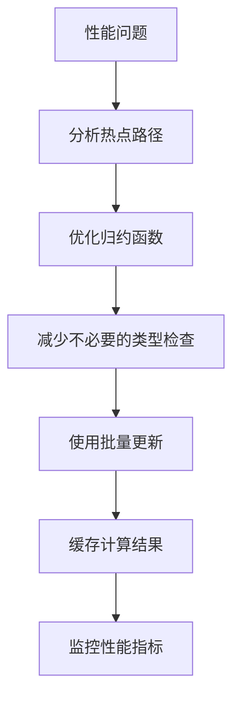

**章节来源**
- [graph/schema.go](file://graph/schema.go#L68-L76)
- [graph/schema.go](file://graph/schema.go#L87-L91)

## 最佳实践

基于对 StateSchema 系统的深入理解，以下是推荐的最佳实践。

### Schema 设计原则

1. **单一职责**: 每个 Schema 应该专注于特定领域的状态管理
2. **类型安全**: 充分利用 Go 的类型系统，避免运行时类型错误
3. **可测试性**: 设计易于单元测试的 Schema 结构
4. **向后兼容**: 考虑未来可能的状态结构变化

### 归约函数开发指南

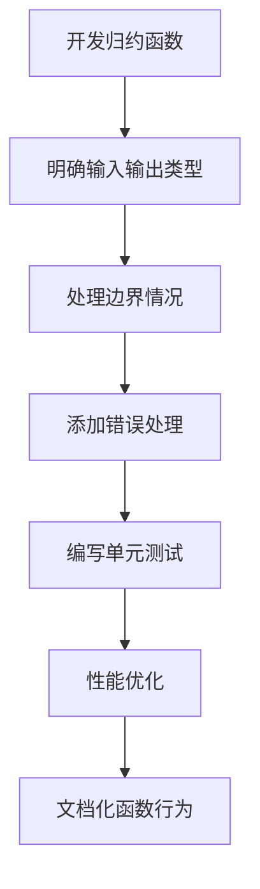

### 状态结构设计建议

| 设计原则 | 说明 | 示例 |
|----------|------|------|
| 一致性 | 相同类型的数据使用相同的归约函数 | 所有计数器都使用 SumReducer |
| 清晰性 | 状态结构应该直观易懂 | 使用有意义的键名 |
| 灵活性 | 支持未来的扩展需求 | 预留通用字段 |
| 性能 | 考虑大数据量的处理效率 | 优化频繁更新的字段 |

### 错误处理策略

```mermaid
classDiagram
class ErrorHandler {
+validateInput(input interface{}) error
+handleTypeError(expected, actual reflect.Type) error
+handleLogicError(operation string, err error) error
+logError(context string, err error)
}
class ValidationLayer {
+preUpdateValidation(state interface{}) error
+postUpdateValidation(newState interface{}) error
+typeSafetyCheck(value interface{}, expectedType reflect.Type) error
}
ErrorHandler --> ValidationLayer : uses
```

### 测试策略

有效的测试应该覆盖以下方面：

- **单元测试**: 测试单个归约函数的行为
- **集成测试**: 测试 Schema 在 StateGraph 中的表现
- **边界测试**: 测试极端情况和错误条件
- **性能测试**: 验证大规模状态更新的性能

## 总结

StateSchema 作为 LangGraphGo 状态管理系统的核心抽象，提供了强大而灵活的状态管理能力。通过 Init 和 Update 方法的协同工作，它确保了状态初始化和合并的正确性，同时通过归约函数系统支持多样化的更新策略。

### 关键优势

1. **类型安全性**: 通过明确的接口定义避免运行时错误
2. **灵活性**: 支持自定义归约函数和复杂的状态结构
3. **可扩展性**: 易于添加新的状态类型和更新逻辑
4. **一致性**: 确保状态更新的可预测性和一致性

### 应用价值

StateSchema 不仅简化了状态管理的复杂性，还为构建可靠的、类型安全的状态图提供了坚实的基础。它使得开发者能够专注于业务逻辑的实现，而不必担心状态管理的技术细节。

### 发展方向

随着 LangGraphGo 的持续发展，StateSchema 系统可能会在以下方面进一步演进：
- 更丰富的内置归约函数
- 更强的类型推导能力
- 更好的性能优化
- 更完善的错误诊断和调试工具

通过深入理解和正确使用 StateSchema，开发者可以构建出更加健壮和高效的状态驱动应用程序。