# 状态管理与模式

<cite>
**本文档中引用的文件**
- [examples/state_schema/main.go](file://examples/state_schema/main.go)
- [examples/custom_reducer/main.go](file://examples/custom_reducer/main.go)
- [examples/memory_basic/main.go](file://examples/memory_basic/main.go)
- [examples/memory_chatbot/main.go](file://examples/memory_chatbot/main.go)
- [graph/state_graph.go](file://graph/state_graph.go)
- [graph/schema.go](file://graph/schema.go)
- [graph/checkpointing.go](file://graph/checkpointing.go)
- [prebuilt/langchain_memory_adapter.go](file://prebuilt/langchain_memory_adapter.go)
- [examples/state_schema/README_CN.md](file://examples/state_schema/README_CN.md)
- [examples/custom_reducer/README_CN.md](file://examples/custom_reducer/README_CN.md)
</cite>

## 目录
1. [简介](#简介)
2. [核心概念](#核心概念)
3. [StateSchema 架构详解](#stateschema-架构详解)
4. [自定义 Reducer 实现](#自定义-reducer-实现)
5. [内存管理机制](#内存管理机制)
6. [类型安全设计](#类型安全设计)
7. [状态持久化](#状态持久化)
8. [实际应用场景](#实际应用场景)
9. [常见错误与解决方案](#常见错误与解决方案)
10. [最佳实践](#最佳实践)

## 简介

LangGraphGo 提供了一套强大而灵活的状态管理系统，支持复杂的状态更新逻辑、类型安全的状态结构和持久化机制。该系统的核心设计理念是将状态视为一个结构化的对象，其中不同的字段可以采用不同的更新策略，这种设计类似于 Python 库中的 `TypedDict` 和 `Annotated` 概念。

## 核心概念

### 状态 Schema (StateSchema)

StateSchema 定义了状态的结构以及更新如何合并。它是整个状态管理系统的核心抽象，负责协调不同字段的更新行为。

```mermaid
classDiagram
class StateSchema {
<<interface>>
+Init() interface{}
+Update(current, new) (interface{}, error)
}
class CleaningStateSchema {
<<interface>>
+Cleanup(state) interface{}
}
class MapSchema {
+Reducers map[string]Reducer
+EphemeralKeys map[string]bool
+RegisterReducer(key, reducer)
+RegisterChannel(key, reducer, isEphemeral)
+Init() interface{}
+Update(current, new) (interface{}, error)
+Cleanup(state) interface{}
}
class Reducer {
<<function>>
+Reduce(current, new) (interface{}, error)
}
StateSchema <|-- CleaningStateSchema
StateSchema <|.. MapSchema
MapSchema --> Reducer : uses
```

**图表来源**
- [graph/schema.go](file://graph/schema.go#L12-L27)
- [graph/schema.go](file://graph/schema.go#L29-L42)

### Reducer 函数

Reducer 是一个函数，接受当前值和新值，并返回合并后的值。系统提供了多种内置 Reducer：

- **OverwriteReducer**: 用新值替换旧值（默认行为）
- **AppendReducer**: 将新项追加到列表中
- **SumReducer**: 对数值进行累加（自定义示例）

**章节来源**
- [graph/schema.go](file://graph/schema.go#L8-L10)
- [graph/schema.go](file://graph/schema.go#L140-L144)
- [graph/schema.go](file://graph/schema.go#L146-L185)

## StateSchema 架构详解

### MapSchema 实现

MapSchema 是最常用的 StateSchema 实现，专门处理 `map[string]interface{}` 类型的状态。

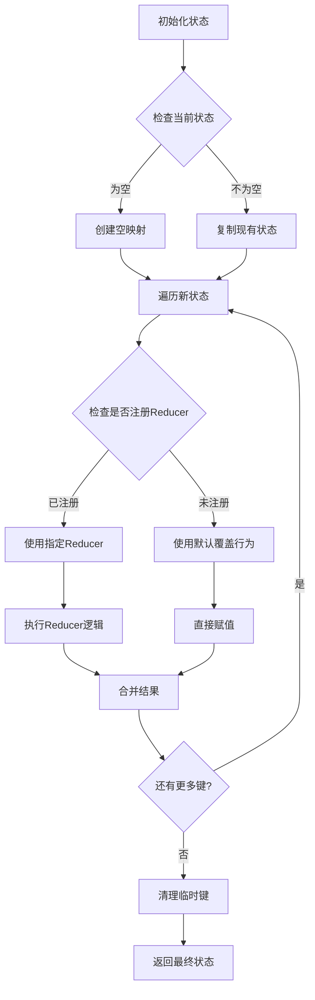

**图表来源**
- [graph/schema.go](file://graph/schema.go#L62-L99)

### Reducer 注册机制

每个 StateSchema 可以为特定键注册不同的 Reducer：

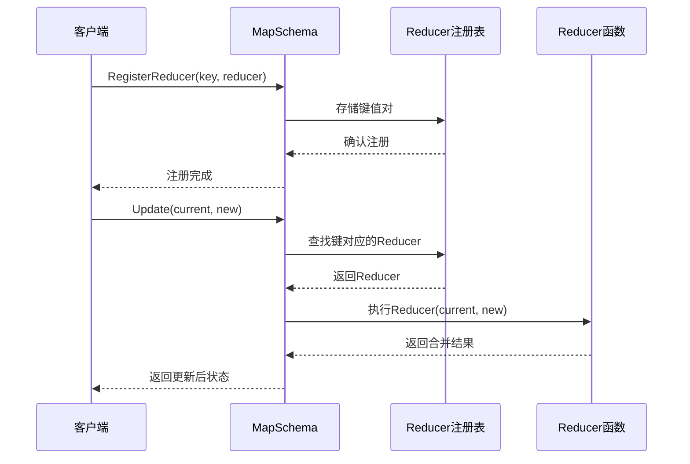

**图表来源**
- [graph/schema.go](file://graph/schema.go#L44-L55)

**章节来源**
- [graph/schema.go](file://graph/schema.go#L29-L42)
- [graph/schema.go](file://graph/schema.go#L44-L55)

## 自定义 Reducer 实现

### SumReducer 示例

自定义 Reducer 是状态管理的强大工具，允许开发者定义复杂的合并逻辑。

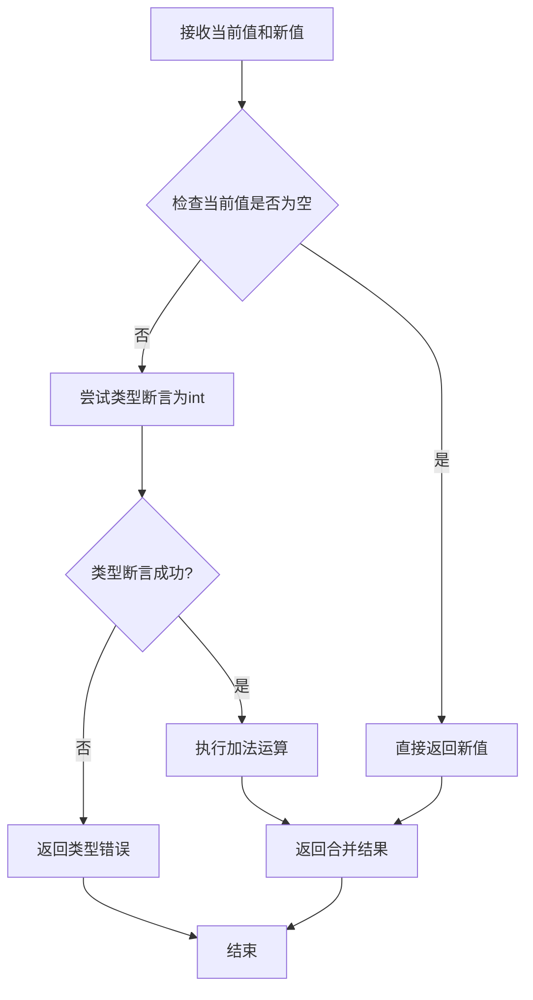

**图表来源**
- [examples/state_schema/main.go](file://examples/state_schema/main.go#L11-L22)

### SetReducer 实现

SetReducer 展示了更复杂的自定义逻辑，用于去重和集合合并：

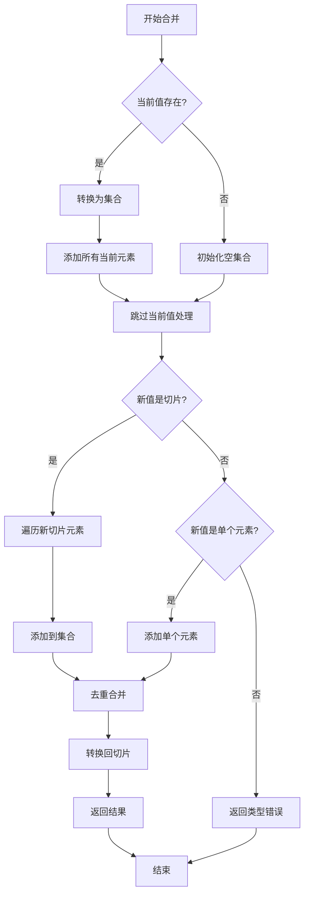

**图表来源**
- [examples/custom_reducer/main.go](file://examples/custom_reducer/main.go#L11-L42)

**章节来源**
- [examples/state_schema/main.go](file://examples/state_schema/main.go#L11-L22)
- [examples/custom_reducer/main.go](file://examples/custom_reducer/main.go#L11-L42)

## 内存管理机制

### LangChain 内存适配器

LangGraphGo 提供了与 LangChain 兼容的记忆管理接口，支持多种内存策略：

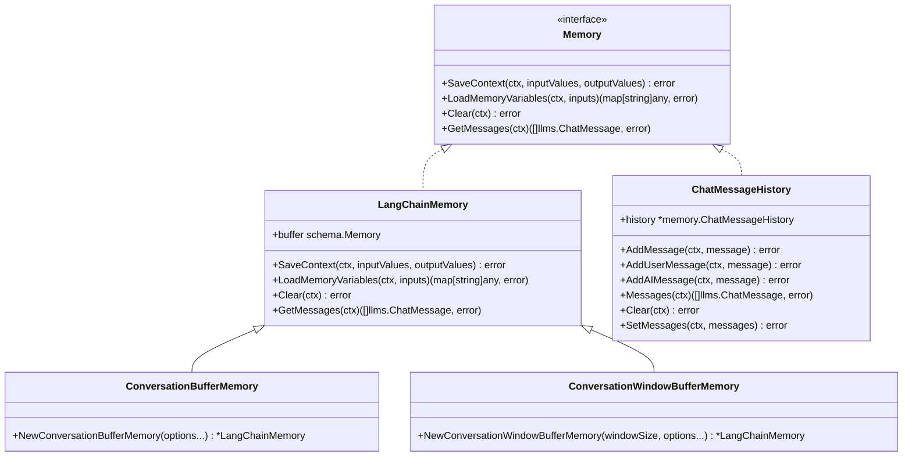

**图表来源**
- [prebuilt/langchain_memory_adapter.go](file://prebuilt/langchain_memory_adapter.go#L11-L21)
- [prebuilt/langchain_memory_adapter.go](file://prebuilt/langchain_memory_adapter.go#L23-L33)

### 内存类型对比

| 内存类型 | 特点 | 适用场景 | 限制 |
|---------|------|----------|------|
| ConversationBuffer | 保存完整对话历史 | 需要完整上下文的场景 | 可能占用大量内存 |
| ConversationWindowBuffer | 仅保留最近N轮对话 | 控制内存使用的场景 | 丢失早期上下文 |
| ChatMessageHistory | 直接操作消息历史 | 需要精确控制消息的场景 | 不自动管理大小 |

**章节来源**
- [examples/memory_basic/main.go](file://examples/memory_basic/main.go#L17-L35)
- [examples/memory_chatbot/main.go](file://examples/memory_chatbot/main.go#L31-L48)
- [prebuilt/langchain_memory_adapter.go](file://prebuilt/langchain_memory_adapter.go#L23-L57)

## 类型安全设计

### StateGraph 的类型安全机制

StateGraph 通过 Schema 系统确保类型安全的状态更新：

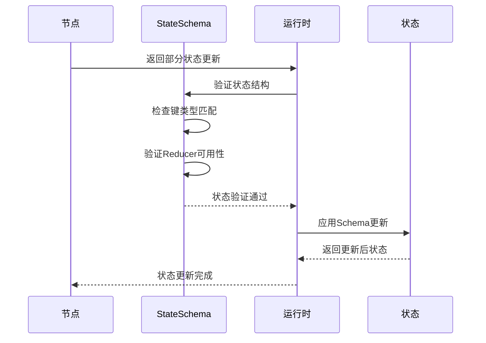

**图表来源**
- [graph/state_graph.go](file://graph/state_graph.go#L200-L209)

### 泛型支持与类型推断

虽然 Go 是静态类型语言，但通过接口和反射机制实现了类似泛型的功能：

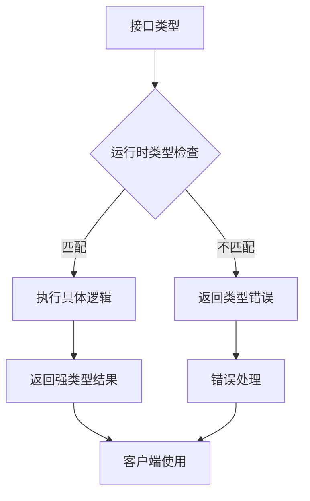

**图表来源**
- [graph/schema.go](file://graph/schema.go#L150-L160)

**章节来源**
- [graph/state_graph.go](file://graph/state_graph.go#L105-L113)
- [graph/schema.go](file://graph/schema.go#L62-L99)

## 状态持久化

### Checkpoint 系统

LangGraphGo 提供了完整的状态持久化机制，支持多种存储后端：

```mermaid
classDiagram
class Checkpoint {
+ID string
+NodeName string
+State interface{}
+Metadata map[string]interface{}
+Timestamp time.Time
+Version int
}
class CheckpointStore {
<<interface>>
+Save(ctx, checkpoint) error
+Load(ctx, checkpointID) (*Checkpoint, error)
+List(ctx, executionID) ([]*Checkpoint, error)
+Delete(ctx, checkpointID) error
+Clear(ctx, executionID) error
}
class MemoryCheckpointStore {
+checkpoints map[string]*Checkpoint
+mutex sync.RWMutex
+Save(ctx, checkpoint) error
+Load(ctx, checkpointID) (*Checkpoint, error)
+List(ctx, executionID) ([]*Checkpoint, error)
+Delete(ctx, checkpointID) error
+Clear(ctx, executionID) error
}
class FileCheckpointStore {
+writer io.Writer
+reader io.Reader
+mutex sync.RWMutex
+Save(ctx, checkpoint) error
+Load(ctx, checkpointID) (*Checkpoint, error)
+List(ctx, executionID) ([]*Checkpoint, error)
+Delete(ctx, checkpointID) error
+Clear(ctx, executionID) error
}
CheckpointStore <|.. MemoryCheckpointStore
CheckpointStore <|.. FileCheckpointStore
Checkpoint --> CheckpointStore : managed by
```

**图表来源**
- [graph/checkpointing.go](file://graph/checkpointing.go#L12-L20)
- [graph/checkpointing.go](file://graph/checkpointing.go#L22-L38)
- [graph/checkpointing.go](file://graph/checkpointing.go#L40-L51)

### 检查点生命周期

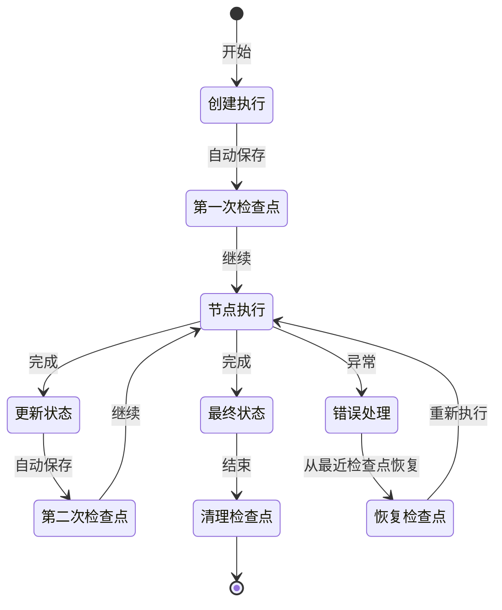

**图表来源**
- [graph/checkpointing.go](file://graph/checkpointing.go#L230-L251)

**章节来源**
- [graph/checkpointing.go](file://graph/checkpointing.go#L12-L560)

## 实际应用场景

### 对话机器人中的上下文维护

在对话机器人中，状态管理需要处理多轮对话的上下文：

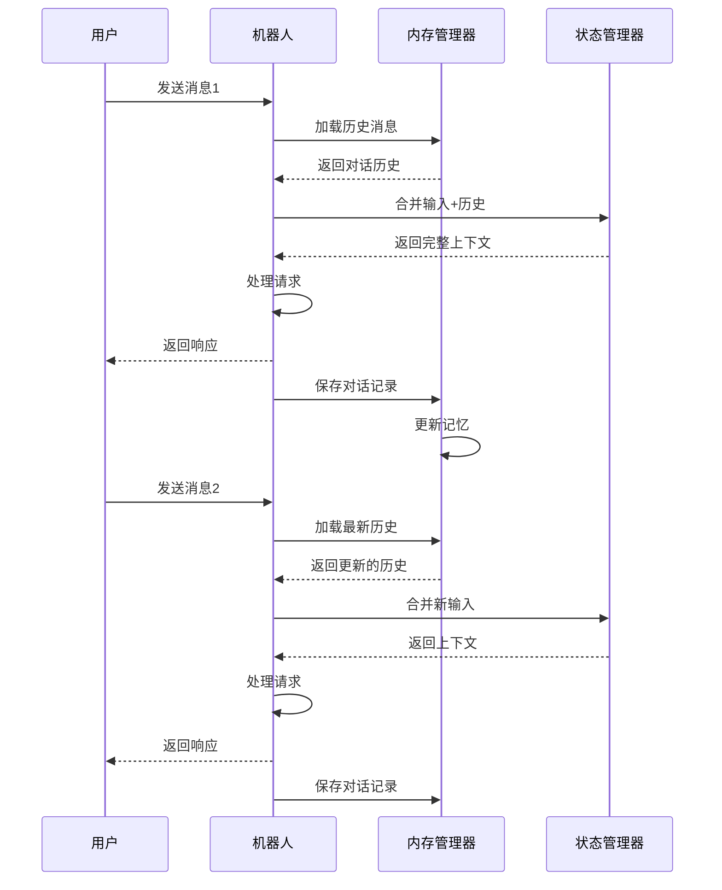

**图表来源**
- [examples/memory_chatbot/main.go](file://examples/memory_chatbot/main.go#L76-L100)

### 复杂工作流的状态管理

在复杂的工作流中，不同阶段可能需要不同类型的状态更新：

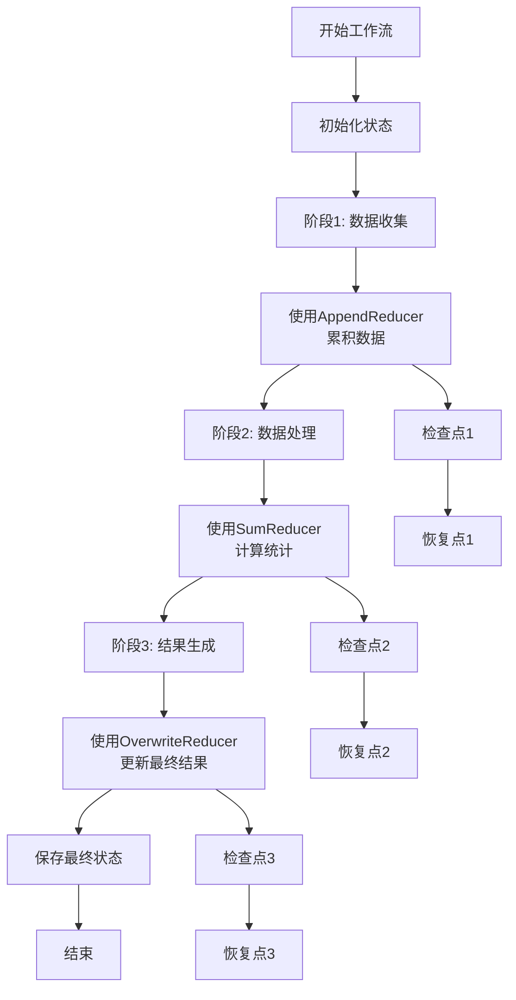

**图表来源**
- [examples/state_schema/main.go](file://examples/state_schema/main.go#L44-L70)

**章节来源**
- [examples/memory_chatbot/main.go](file://examples/memory_chatbot/main.go#L31-L186)
- [examples/state_schema/main.go](file://examples/state_schema/main.go#L44-L70)

## 常见错误与解决方案

### 状态冲突问题

状态冲突通常发生在多个节点同时尝试修改同一状态字段时：

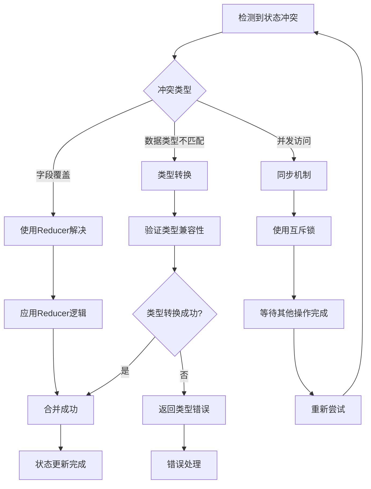

**图表来源**
- [graph/schema.go](file://graph/schema.go#L86-L96)

### 更新丢失问题

更新丢失通常是由于 Schema 配置不当或节点返回值格式错误：

| 问题类型 | 原因 | 解决方案 |
|---------|------|----------|
| Schema未注册 | 键没有对应的Reducer | 明确注册所有需要的Reducer |
| 类型不匹配 | 返回值类型与期望不符 | 确保节点返回正确的类型 |
| 键名错误 | 节点返回了不存在的键 | 检查Schema定义和节点实现 |
| 并发竞争 | 多个节点同时修改相同状态 | 使用适当的Reducer或同步机制 |

### 内存泄漏预防

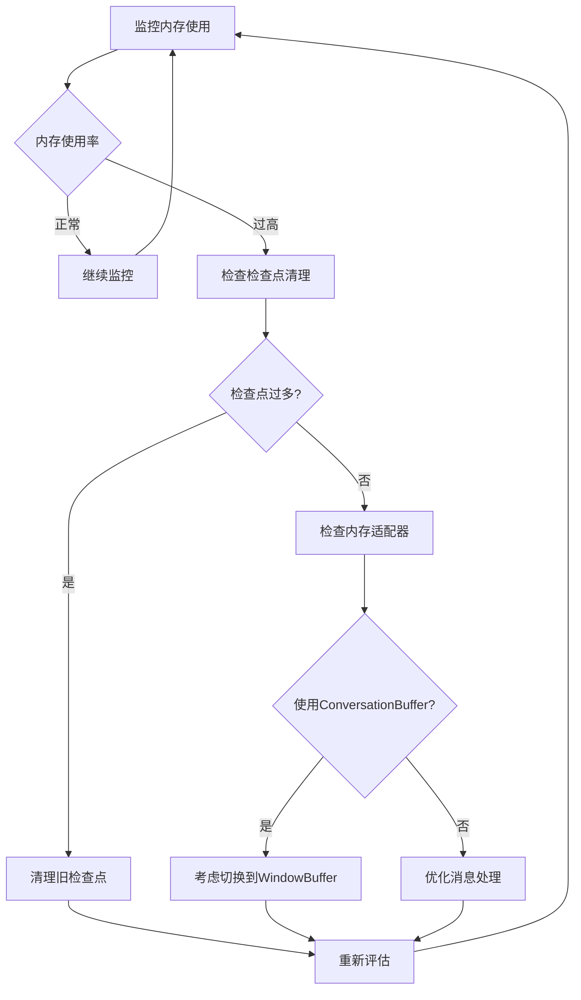

**图表来源**
- [graph/checkpointing.go](file://graph/checkpointing.go#L293-L295)

**章节来源**
- [graph/schema.go](file://graph/schema.go#L86-L96)
- [graph/checkpointing.go](file://graph/checkpointing.go#L293-L295)

## 最佳实践

### Schema 设计原则

1. **明确的键命名**: 使用描述性的键名，避免歧义
2. **合理的Reducer选择**: 根据业务需求选择合适的更新策略
3. **类型一致性**: 确保相同键的值类型保持一致
4. **最小化状态**: 只存储必要的信息，避免过度设计

### 性能优化建议

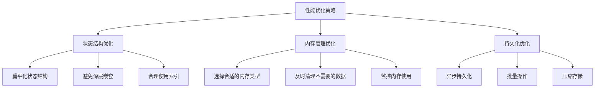

### 错误处理策略

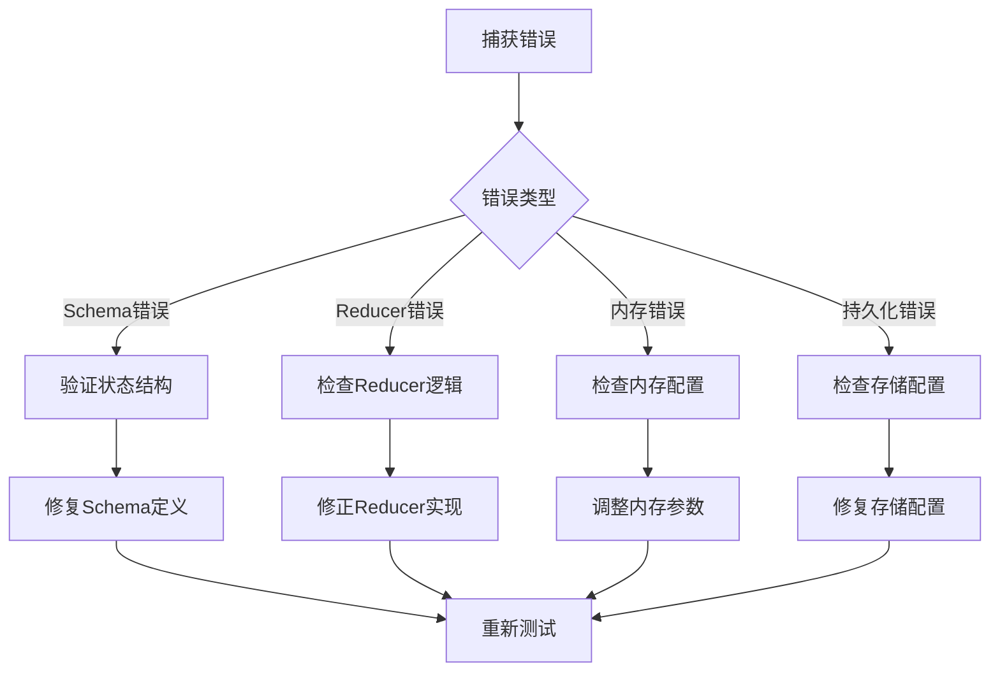

### 测试策略

1. **单元测试**: 针对每个Reducer编写独立测试
2. **集成测试**: 测试整个StateGraph的行为
3. **压力测试**: 验证在高负载下的稳定性
4. **恢复测试**: 验证检查点系统的可靠性

通过遵循这些最佳实践，可以构建出健壮、高效且易于维护的状态管理系统，为复杂的多步骤应用程序提供强大的状态管理能力。