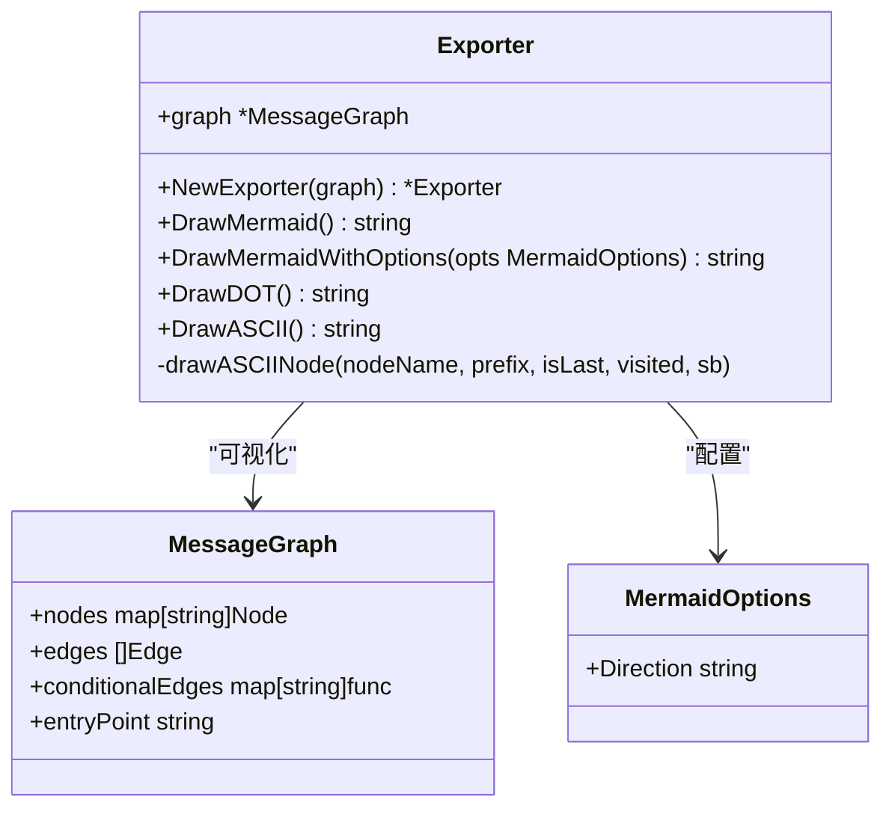
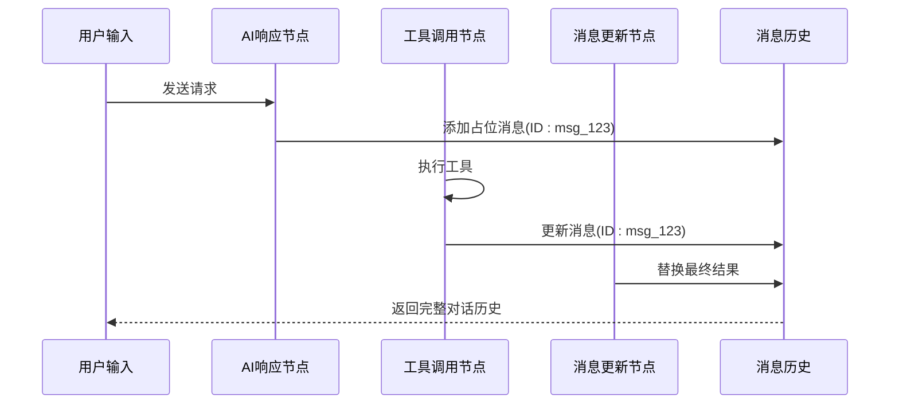
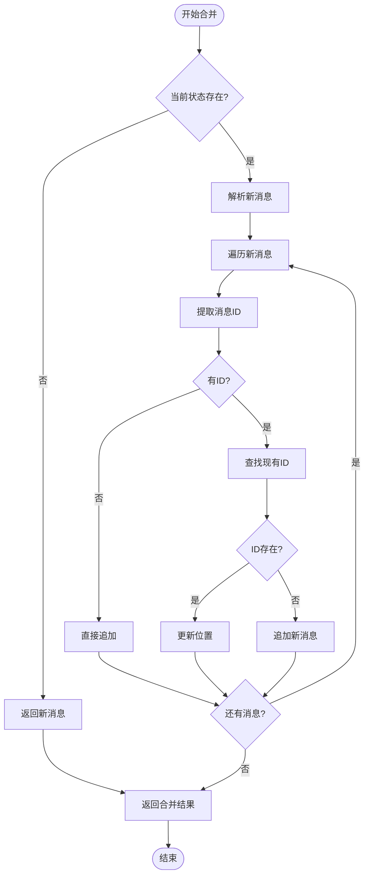
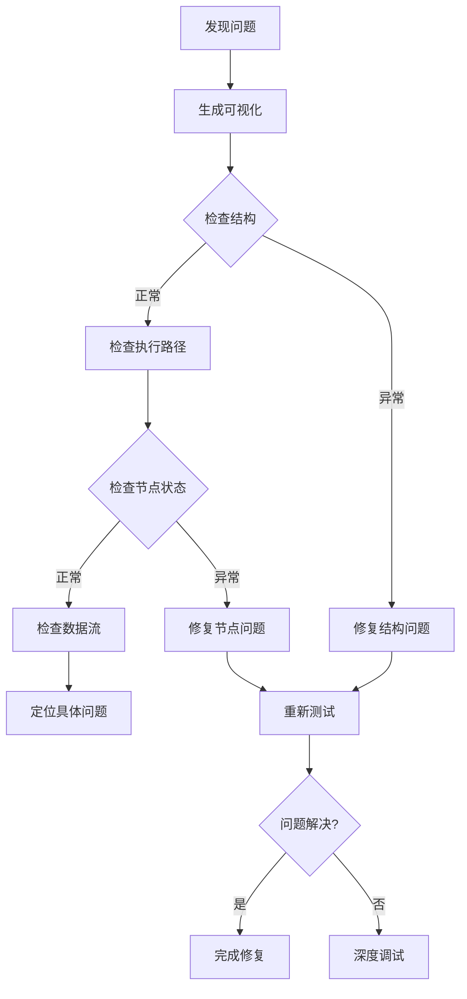

# 可视化与调试工具

<cite>
**本文档引用的文件**
- [examples/visualization/main.go](file://examples/visualization/main.go)
- [examples/smart_messages/main.go](file://examples/smart_messages/main.go)
- [graph/visualization.go](file://graph/visualization.go)
- [graph/add_messages.go](file://graph/add_messages.go)
- [graph/tracing.go](file://graph/tracing.go)
- [examples/visualization/README.md](file://examples/visualization/README.md)
- [examples/smart_messages/README.md](file://examples/smart_messages/README.md)
- [graph/add_messages_test.go](file://graph/add_messages_test.go)
- [graph/visualization_test.go](file://graph/visualization_test.go)
- [graph/state_graph.go](file://graph/state_graph.go)
- [graph/messages_graph.go](file://graph/messages_graph.go)
</cite>

## 目录
1. [简介](#简介)
2. [可视化功能](#可视化功能)
3. [智能消息系统](#智能消息系统)
4. [调试与监控](#调试与监控)
5. [最佳实践](#最佳实践)
6. [故障排除指南](#故障排除指南)
7. [总结](#总结)

## 简介

LangGraphGo 提供了一套强大的可视化与调试工具，帮助开发者理解和优化复杂的图结构工作流。这些工具包括图形可视化、智能消息合并、执行跟踪和状态监控等功能，为开发和调试阶段提供了全面的支持。

## 可视化功能

### 核心架构

可视化功能基于 `Exporter` 结构体实现，支持多种输出格式以满足不同的使用场景。



**图表来源**
- [graph/visualization.go](file://graph/visualization.go#L9-L25)
- [graph/visualization.go](file://graph/visualization.go#L19-L24)

### 输出格式支持

#### 1. Mermaid 图表格式

Mermaid 格式是最直观的可视化方式，可以直接在 Mermaid Live Editor 中渲染。

```mermaid
flowchart TD
START([\"START\"])
START --> validate_input[\"validate_input\"]
style START fill:#90EE90
style validate_input fill:#87CEEB
validate_input --> fetch_data[\"fetch_data\"]
fetch_data --> transform[\"transform\"]
transform -.-> transform_condition((?))
style transform_condition fill:#FFFFE0,stroke:#333,stroke-dasharray: 5 5
transform --> enrich[\"enrich\"]
enrich --> validate_output[\"validate_output\"]
validate_output --> save[\"save\"]
save --> notify[\"notify\"]
notify --> END([\"END\"])
style END fill:#FFB6C1
```

**图表来源**
- [examples/visualization/main.go](file://examples/visualization/main.go#L71-L72)

#### 2. Graphviz DOT 格式

DOT 格式适合程序化处理和高质量图像生成。

```mermaid
graph TD
START [label="START", shape=ellipse, style=filled, fillcolor=lightgreen]
START -> validate_input
validate_input [style=filled, fillcolor=lightblue]
validate_input -> fetch_data
fetch_data -> transform
transform -> transform_condition [style=dashed, label="?"]
transform_condition [label="?", shape=diamond, style=filled, fillcolor=lightyellow]
transform -> enrich
enrich -> validate_output
validate_output -> save
save -> notify
notify -> END [label="END", shape=ellipse, style=filled, fillcolor=lightpink]
```

**图表来源**
- [examples/visualization/main.go](file://examples/visualization/main.go#L78-L79)

#### 3. ASCII 树形表示

ASCII 格式提供文本化的树形结构，便于在终端环境中查看。

```
Graph Execution Flow:
├── START
├── validate_input
├── fetch_data
├── transform
├─── enrich
├─── validate_output
├─── save
└─── notify
```

**图表来源**
- [examples/visualization/main.go](file://examples/visualization/main.go#L83-L84)

### 使用方法

可视化功能通过以下步骤启用：

1. **创建图结构**：定义节点和边
2. **编译图**：生成可执行的 Runnable 实例
3. **获取 Exporter**：通过 `GetGraph()` 方法获取可视化器
4. **生成输出**：选择合适的格式进行可视化

**章节来源**
- [examples/visualization/main.go](file://examples/visualization/main.go#L1-L97)
- [graph/visualization.go](file://graph/visualization.go#L1-L226)

## 智能消息系统

### 设计理念

智能消息系统解决了现代 LLM 应用中消息历史管理的核心问题，特别是在工具调用和函数调用场景中。



**图表来源**
- [examples/smart_messages/main.go](file://examples/smart_messages/main.go#L21-L62)

### 核心功能

#### 1. ID 基础的去重与更新

智能消息系统支持基于 ID 的消息去重和更新机制：

- **ID 提取**：支持接口、映射键和结构体字段三种方式
- **智能合并**：相同 ID 的消息会替换原有消息
- **灵活兼容**：同时支持标准消息和自定义消息结构

#### 2. 消息类型支持

系统支持多种消息类型的智能处理：

| 消息类型 | 处理方式 | 示例 |
|---------|---------|------|
| 标准消息 | 直接追加 | `llms.MessageContent` |
| 带 ID 的消息 | ID 去重 | `{"id": "msg_123", "content": "..."}` |
| 结构体消息 | 字段提取 | `struct{ID string; Content string}` |
| 接口消息 | 方法调用 | `MessageWithID.GetID()` |

### 实现原理

智能消息合并通过 `AddMessages` 函数实现，该函数采用以下算法：



**图表来源**
- [graph/add_messages.go](file://graph/add_messages.go#L22-L105)

### 使用场景

#### 1. 工具调用优化

在工具调用场景中，智能消息系统可以避免重复的消息记录：

```go
// 初始占位消息
placeholder := map[string]interface{}{
    "id":      "tool_call_123",
    "role":    "ai",
    "content": "正在处理...",
}

// 工具执行完成后的更新消息
result := map[string]interface{}{
    "id":      "tool_call_123", // 相同ID
    "role":    "ai", 
    "content": "处理完成，结果已准备好",
}
```

#### 2. 流式响应处理

对于流式响应，可以使用相同的 ID 来逐步更新消息内容。

**章节来源**
- [examples/smart_messages/main.go](file://examples/smart_messages/main.go#L1-L91)
- [graph/add_messages.go](file://graph/add_messages.go#L1-L135)

## 调试与监控

### 执行跟踪系统

LangGraphGo 提供了完整的执行跟踪系统，支持实时监控和调试。

```mermaid
classDiagram
class Tracer {
+hooks []TraceHook
+spans map[string]*TraceSpan
+NewTracer() *Tracer
+AddHook(hook TraceHook)
+StartSpan(ctx, event, nodeName) *TraceSpan
+EndSpan(ctx, span, state, err)
+TraceEdgeTraversal(ctx, from, to)
}
class TraceSpan {
+ID string
+ParentID string
+Event TraceEvent
+NodeName string
+FromNode string
+ToNode string
+StartTime time.Time
+EndTime time.Time
+Duration time.Duration
+State interface{}
+Error error
+Metadata map[string]interface{}
}
class TraceHook {
<<interface>>
+OnEvent(ctx, span *TraceSpan)
}
Tracer --> TraceSpan : "管理"
Tracer --> TraceHook : "通知"
```

**图表来源**
- [graph/tracing.go](file://graph/tracing.go#L84-L138)

### 跟踪事件类型

| 事件类型 | 描述 | 触发时机 |
|---------|------|---------|
| `TraceEventGraphStart` | 图启动 | 图开始执行时 |
| `TraceEventNodeStart` | 节点开始 | 节点开始执行时 |
| `TraceEventNodeEnd` | 节点结束 | 节点成功完成时 |
| `TraceEventNodeError` | 节点错误 | 节点执行失败时 |
| `TraceEventEdgeTraversal` | 边遍历 | 节点间连接时 |

### 监控指标

跟踪系统提供以下监控指标：

- **执行时间**：每个节点的执行耗时
- **状态快照**：节点执行时的状态数据
- **错误信息**：详细的错误堆栈和上下文
- **元数据**：自定义的监控和调试信息

### 集成方式

#### 1. 基本跟踪

```go
tracer := graph.NewTracer()
tracer.AddHook(graph.TraceHookFunc(func(ctx context.Context, span *graph.TraceSpan) {
    fmt.Printf("[TRACE] %s: %v (%v)\n", 
        span.NodeName, span.Event, span.Duration)
}))
```

#### 2. 上下文传播

跟踪系统自动处理上下文传播，支持父子关系：

```go
parentSpan := tracer.StartSpan(ctx, graph.TraceEventGraphStart, "")
parentCtx := graph.ContextWithSpan(ctx, parentSpan)

// 子节点继承父级上下文
childSpan := tracer.StartSpan(parentCtx, graph.TraceEventNodeStart, "child_node")
```

**章节来源**
- [graph/tracing.go](file://graph/tracing.go#L43-L138)

## 最佳实践

### 开发阶段

#### 1. 可视化工作流设计

- **早期验证**：在设计阶段使用可视化工具验证工作流拓扑
- **迭代优化**：通过不同格式的可视化发现潜在问题
- **文档生成**：利用可视化输出自动生成技术文档

#### 2. 消息历史管理

- **合理使用 ID**：为需要更新的消息分配唯一标识符
- **类型统一**：保持消息类型的相对一致性
- **性能考虑**：避免过长的消息历史影响性能

#### 3. 调试策略

- **分层监控**：从全局到局部逐步深入调试
- **状态检查**：定期检查关键节点的状态变化
- **错误追踪**：建立完善的错误处理和日志记录机制

### 生产环境

#### 1. 性能监控

- **执行时间分析**：监控各节点的执行时间分布
- **资源使用**：跟踪内存和 CPU 使用情况
- **并发控制**：合理设置并发度避免资源竞争

#### 2. 故障恢复

- **重试机制**：配置合理的重试策略
- **降级处理**：为关键节点设置降级方案
- **健康检查**：定期检查系统健康状态

#### 3. 安全考虑

- **输入验证**：严格验证所有输入数据
- **权限控制**：限制对敏感节点的访问
- **审计日志**：记录所有关键操作的审计信息

### 快速定位问题

#### 1. 可视化诊断



#### 2. 调试工具组合使用

- **可视化 + 跟踪**：结合图形化和实时跟踪进行综合分析
- **智能消息 + 状态检查**：利用消息合并特性和状态监控定位问题
- **并发分析**：使用跟踪系统分析并发执行问题

## 故障排除指南

### 常见问题及解决方案

#### 1. 可视化问题

**问题**：生成的可视化不正确或缺少某些节点

**解决方案**：
- 检查图结构是否完整
- 确认所有节点都已正确添加
- 验证边连接关系的正确性

**问题**：Mermaid 图表显示异常

**解决方案**：
- 检查输出格式的兼容性
- 验证特殊字符的转义处理
- 确认浏览器支持程度

#### 2. 智能消息问题

**问题**：消息没有正确更新

**解决方案**：
- 确认消息 ID 的唯一性和一致性
- 检查消息类型的兼容性
- 验证 ID 提取逻辑的正确性

**问题**：混合类型消息处理失败

**解决方案**：
- 统一消息类型定义
- 使用适当的类型转换
- 检查反射处理的边界条件

#### 3. 调试跟踪问题

**问题**：跟踪信息丢失或不完整

**解决方案**：
- 检查跟踪钩子的注册
- 验证上下文传播的正确性
- 确认跟踪事件的触发时机

**问题**：性能影响过大

**解决方案**：
- 优化跟踪钩子的实现
- 减少不必要的状态快照
- 使用采样策略降低开销

### 性能优化建议

#### 1. 可视化性能

- **缓存机制**：缓存常用的可视化结果
- **增量更新**：只更新变化的部分
- **异步处理**：将可视化生成放在后台线程

#### 2. 消息处理性能

- **批量操作**：批量处理多个消息
- **索引优化**：为频繁查询的字段建立索引
- **内存管理**：及时释放不需要的消息数据

#### 3. 跟踪系统优化

- **事件过滤**：只记录关键事件
- **采样策略**：对高频事件进行采样
- **异步写入**：将跟踪数据异步写入存储

**章节来源**
- [graph/add_messages_test.go](file://graph/add_messages_test.go#L1-L104)
- [graph/visualization_test.go](file://graph/visualization_test.go#L1-L51)

## 总结

LangGraphGo 的可视化与调试工具为开发者提供了全面的工作流管理和问题诊断能力。通过可视化功能，开发者可以直观地理解复杂的工作流拓扑；通过智能消息系统，可以高效地管理消息历史和状态更新；通过调试跟踪系统，可以实时监控执行过程并快速定位问题。

这些工具的组合使用能够显著提高开发效率，减少调试时间，并确保系统的稳定性和可靠性。在实际应用中，建议根据具体的使用场景选择合适的工具组合，并遵循最佳实践来获得最佳效果。

随着项目的不断发展，这些工具也在持续改进和完善，为构建更复杂、更可靠的图结构应用提供强有力的支持。