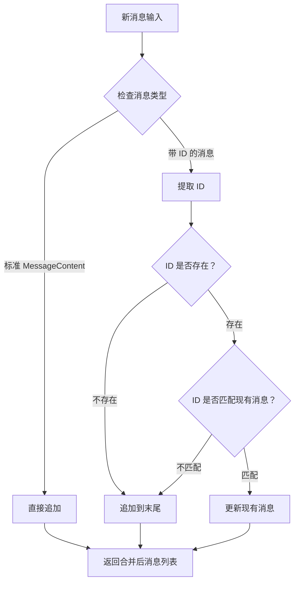
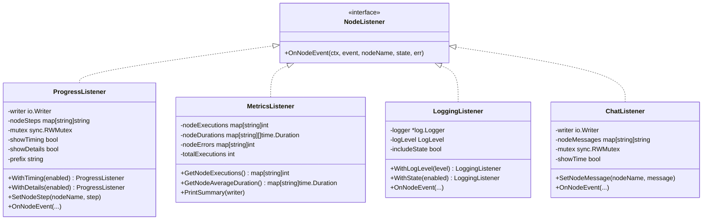
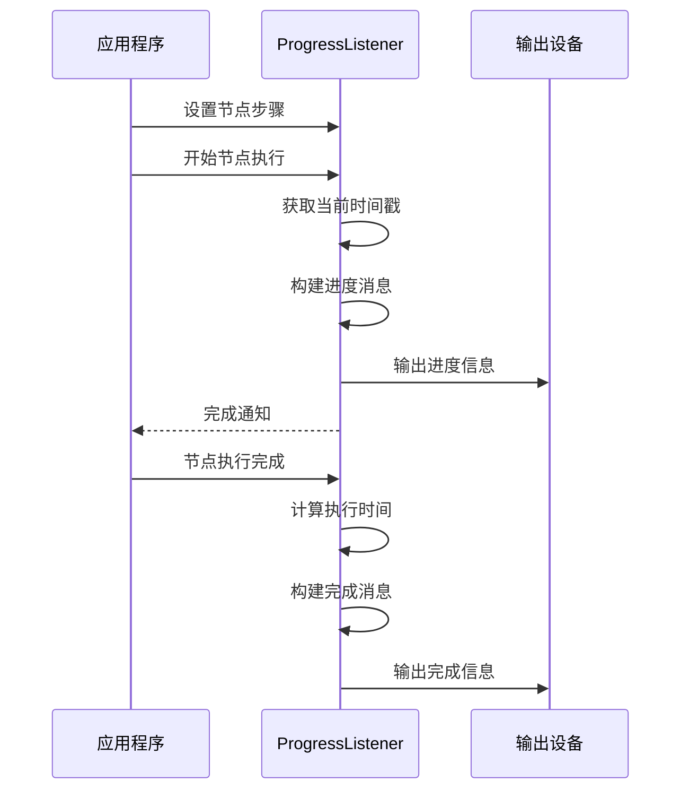
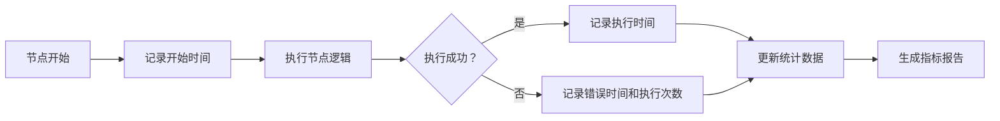
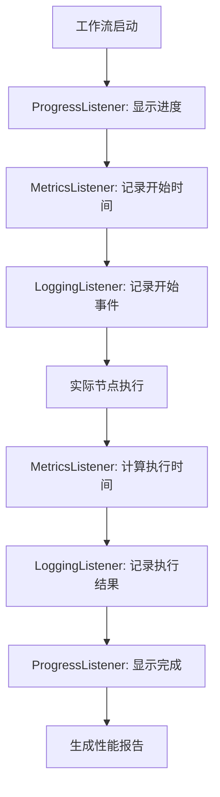

# 智能消息与调试支持

<cite>
**本文档中引用的文件**
- [examples/smart_messages/main.go](file://examples/smart_messages/main.go)
- [examples/smart_messages/README.md](file://examples/smart_messages/README.md)
- [graph/add_messages.go](file://graph/add_messages.go)
- [graph/builtin_listeners.go](file://graph/builtin_listeners.go)
- [graph/listeners.go](file://graph/listeners.go)
- [graph/tracing.go](file://graph/tracing.go)
- [graph/messages_graph.go](file://graph/messages_graph.go)
- [examples/listeners/main.go](file://examples/listeners/main.go)
- [examples/listeners/README.md](file://examples/listeners/README.md)
</cite>

## 目录
1. [简介](#简介)
2. [智能消息机制](#智能消息机制)
3. [内置监听器系统](#内置监听器系统)
4. [调试支持功能](#调试支持功能)
5. [配置选项详解](#配置选项详解)
6. [最佳实践指南](#最佳实践指南)
7. [性能分析与优化](#性能分析与优化)
8. [故障排除指南](#故障排除指南)
9. [总结](#总结)

## 简介

LangGraphGo 提供了一套强大的智能消息机制和调试支持系统，旨在帮助开发者构建高效、可观察的图形化工作流。本文档深入探讨了智能消息的 ID 匹配机制、内置监听器的功能特性，以及如何利用这些工具进行有效的调试和性能优化。

智能消息机制通过基于 ID 的去重和更新功能，解决了传统消息追加方式在聊天应用中的局限性。而内置监听器系统则提供了全面的执行监控、性能分析和调试支持功能，使开发者能够深入了解工作流的执行过程。

## 智能消息机制

### 核心概念

智能消息机制的核心是 `AddMessages` reducer 函数，它实现了基于 ID 的消息合并逻辑。这种设计特别适用于需要更新先前消息的场景，如工具调用后的响应更新。



**图表来源**
- [graph/add_messages.go](file://graph/add_messages.go#L21-L135)

### ID 提取机制

智能消息系统支持多种 ID 提取方式，确保最大的灵活性：

1. **接口方式**：实现 `MessageWithID` 接口
2. **映射方式**：使用包含 `"id"` 键的 map
3. **结构体方式**：通过结构体字段 `"ID"`

```mermaid
classDiagram
class MessageWithID {
<<interface>>
+GetID() string
+GetContent() MessageContent
}
class CustomMessage {
+string ID
+string Content
+GetID() string
+GetContent() MessageContent
}
class MapMessage {
+map[string]interface{} data
+GetID() string
}
MessageWithID <|-- CustomMessage
MessageWithID <|.. MapMessage
```

**图表来源**
- [graph/add_messages.go](file://graph/add_messages.go#L10-L16)
- [graph/add_messages.go](file://graph/add_messages.go#L107-L134)

### 消息合并算法

`AddMessages` 函数采用高效的合并策略：

1. **初始化阶段**：验证输入参数，处理空值情况
2. **消息解析**：将新消息转换为统一的切片格式
3. **索引构建**：为现有消息建立 ID 到索引的映射
4. **合并处理**：逐个处理新消息，执行更新或追加操作
5. **类型转换**：确保返回值与原始类型兼容

**章节来源**
- [graph/add_messages.go](file://graph/add_messages.go#L21-L104)

### 实际应用场景

智能消息机制在以下场景中发挥重要作用：

- **工具调用响应**：LLM 生成工具调用消息后，工具执行完成时更新响应
- **逐步推理**：AI 在思考过程中逐步更新中间结果
- **状态同步**：多节点协作时的状态信息同步

**章节来源**
- [examples/smart_messages/main.go](file://examples/smart_messages/main.go#L1-L91)
- [examples/smart_messages/README.md](file://examples/smart_messages/README.md#L1-L45)

## 内置监听器系统

### 监听器架构

LangGraphGo 提供了完整的监听器生态系统，支持多种类型的事件监听和处理：



**图表来源**
- [graph/builtin_listeners.go](file://graph/builtin_listeners.go#L13-L433)
- [graph/listeners.go](file://graph/listeners.go#L51-L335)

### 事件类型系统

监听器系统支持丰富的事件类型，涵盖工作流执行的各个阶段：

| 事件类型 | 描述 | 触发时机 |
|---------|------|----------|
| `NodeEventStart` | 节点开始执行 | 节点函数被调用前 |
| `NodeEventComplete` | 节点执行完成 | 节点函数成功返回后 |
| `NodeEventError` | 节点执行出错 | 节点函数返回错误时 |
| `NodeEventProgress` | 节点执行进度 | 节点内部的进度通知 |
| `EventChainStart` | 图执行开始 | 整个工作流启动时 |
| `EventChainEnd` | 图执行结束 | 工作流正常完成时 |
| `EventToolStart` | 工具执行开始 | 工具调用开始时 |
| `EventToolEnd` | 工具执行结束 | 工具调用完成时 |

**章节来源**
- [graph/listeners.go](file://graph/listeners.go#L10-L49)

## 调试支持功能

### 执行进度追踪

ProgressListener 提供了直观的执行进度显示功能：



**图表来源**
- [graph/builtin_listeners.go](file://graph/builtin_listeners.go#L70-L116)

### 节点耗时统计

MetricsListener 实现了精确的性能统计功能：

- **执行次数统计**：记录每个节点的执行次数
- **平均执行时间**：计算节点的平均执行时间
- **错误率统计**：跟踪节点失败率
- **总执行次数**：全局执行计数器



**图表来源**
- [graph/builtin_listeners.go](file://graph/builtin_listeners.go#L202-L351)

### 详细日志输出

LoggingListener 提供结构化的日志记录功能：

- **分级日志**：支持 DEBUG、INFO、WARN、ERROR 级别
- **状态包含**：可选择是否包含执行状态信息
- **上下文保持**：维护日志的上下文关联性

**章节来源**
- [graph/builtin_listeners.go](file://graph/builtin_listeners.go#L118-L200)

## 配置选项详解

### WithTiming 配置

启用或禁用时间戳显示：

```go
// 启用时间戳（默认）
listener.WithTiming(true)

// 禁用时间戳
listener.WithTiming(false)
```

### WithDetails 配置

控制详细输出级别：

```go
// 启用详细状态信息
listener.WithDetails(true)

// 禁用详细状态信息（默认）
listener.WithDetails(false)
```

### 自定义前缀和消息

ProgressListener 支持自定义显示效果：

```go
// 设置自定义前缀
listener.WithPrefix("🚀")

// 为特定节点设置自定义消息
listener.SetNodeStep("process", "正在处理数据...")
```

### 聊天风格监听器

ChatListener 提供友好的实时反馈：

```go
// 创建聊天风格监听器
chat := NewChatListener()

// 为节点设置自定义消息
chat.SetNodeMessage("analyze", "🔍 分析数据中...")

// 启用时间戳
chat.WithTime(true)
```

**章节来源**
- [graph/builtin_listeners.go](file://graph/builtin_listeners.go#L45-L433)

## 最佳实践指南

### 开发阶段调试

在开发阶段，建议使用以下组合：

```go
// 创建综合调试监听器组
progress := NewProgressListener().
    WithTiming(true).
    WithDetails(true)

metrics := NewMetricsListener()

logging := NewLoggingListener().
    WithLogLevel(LogLevelDebug).
    WithState(true)

// 将所有监听器附加到关键节点
node.AddListener(progress)
node.AddListener(metrics)
node.AddListener(logging)
```

### 生产环境监控

生产环境中推荐的配置：

```go
// 性能监控监听器
metrics := NewMetricsListener()

// 结构化日志监听器
logging := NewLoggingListener().
    WithLogLevel(LogLevelInfo).
    WithState(false)

// 聊天风格监听器（用于实时反馈）
chat := NewChatListener().
    WithTime(false)
```

### 多监听器协调

合理组织多个监听器的职责分工：

- **ProgressListener**：提供用户友好的进度显示
- **MetricsListener**：收集性能指标数据
- **LoggingListener**：记录详细的执行日志
- **ChatListener**：提供实时交互反馈

**章节来源**
- [examples/listeners/main.go](file://examples/listeners/main.go#L1-L132)

## 性能分析与优化

### 执行轨迹分析

通过监听器组合可以构建完整的执行轨迹：



### 性能瓶颈定位

利用 MetricsListener 进行性能分析：

1. **识别慢节点**：通过平均执行时间发现性能瓶颈
2. **错误率分析**：定位频繁失败的节点
3. **资源使用监控**：跟踪内存和 CPU 使用情况
4. **并发性能评估**：分析多节点并发执行效果

### 优化策略

基于监控数据的优化建议：

- **缓存机制**：对重复计算的结果进行缓存
- **异步处理**：将耗时操作移至后台执行
- **批量处理**：合并小任务减少开销
- **资源池化**：复用昂贵的资源对象

**章节来源**
- [graph/builtin_listeners.go](file://graph/builtin_listeners.go#L202-L351)

## 故障排除指南

### 常见问题诊断

#### 消息未正确更新

**症状**：期望的消息更新未生效，出现重复消息

**排查步骤**：
1. 检查消息 ID 是否正确设置
2. 验证 ID 类型是否一致（字符串）
3. 确认消息结构符合预期格式

**解决方案**：
```go
// 确保 ID 是字符串类型
message := map[string]interface{}{
    "id":      "msg_123",           // 必须是字符串
    "role":    "ai",
    "content": "更新内容",
}
```

#### 监听器无输出

**症状**：监听器配置后没有收到任何事件通知

**排查步骤**：
1. 确认监听器已正确添加到节点
2. 检查事件类型过滤条件
3. 验证上下文传播

**解决方案**：
```go
// 确保监听器添加到正确的节点
node := graph.AddNode("process", processFunc)
node.AddListener(progressListener)
```

#### 性能监控数据异常

**症状**：MetricsListener 显示的执行时间不合理

**排查步骤**：
1. 检查系统时钟同步
2. 确认并发安全
3. 验证时间计算逻辑

**章节来源**
- [graph/builtin_listeners.go](file://graph/builtin_listeners.go#L202-L351)
- [graph/add_messages.go](file://graph/add_messages.go#L107-L134)

### 调试技巧

1. **分层调试**：从简单到复杂逐步增加监听器
2. **事件过滤**：使用特定的事件类型进行针对性调试
3. **状态检查**：利用 WithDetails 选项查看完整状态
4. **时间对比**：结合 WithTiming 选项进行时间分析

## 总结

LangGraphGo 的智能消息机制和调试支持系统为开发者提供了强大而灵活的工具集。智能消息通过 ID 匹配实现了消息的更新与去重，解决了传统聊天应用中的消息管理难题。内置监听器系统则提供了全面的监控、调试和性能分析能力。

通过合理配置和使用这些功能，开发者可以：
- 构建更加智能和响应式的聊天应用
- 实现精确的执行监控和性能分析
- 快速定位和解决工作流中的问题
- 优化系统性能和用户体验

在实际项目中，建议根据不同的使用场景选择合适的监听器组合，并在开发、测试和生产环境中采用相应的配置策略，以最大化这些功能的价值。