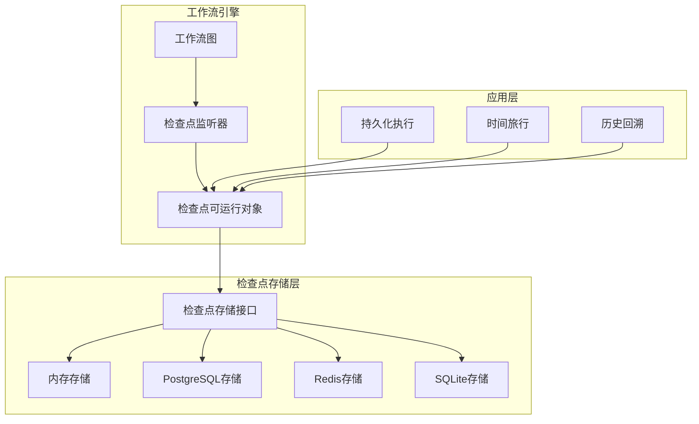
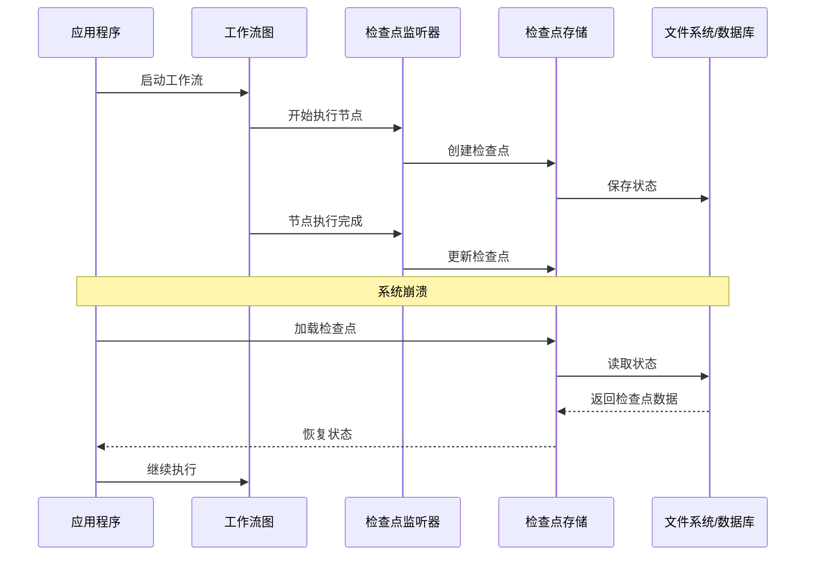
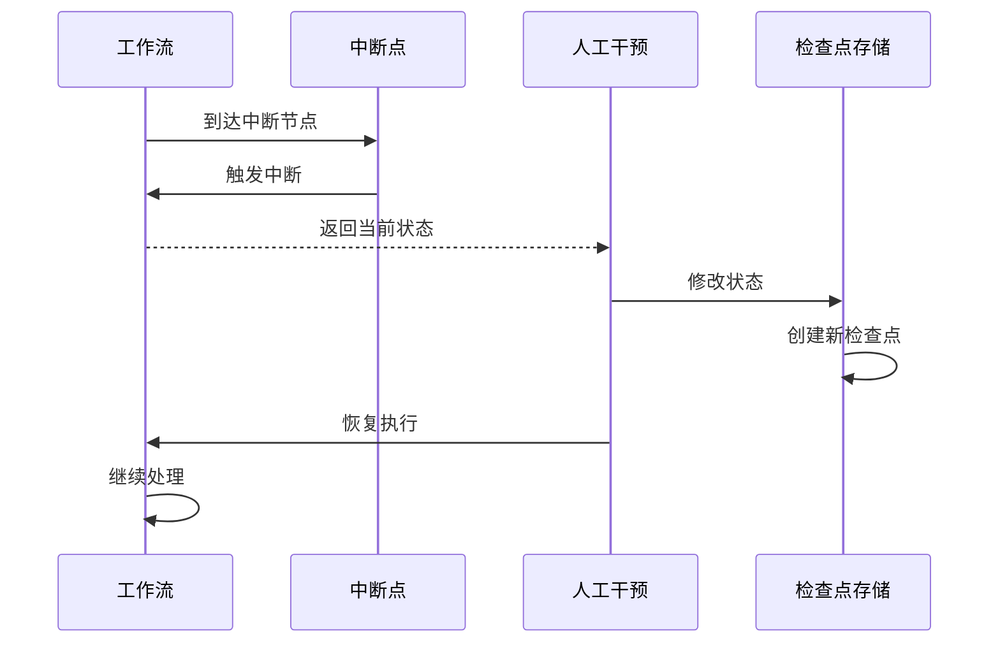
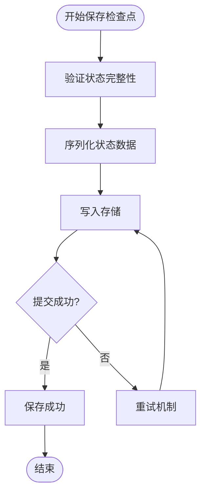
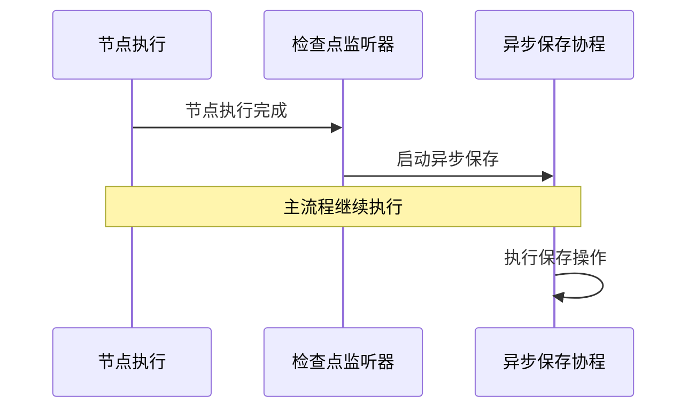
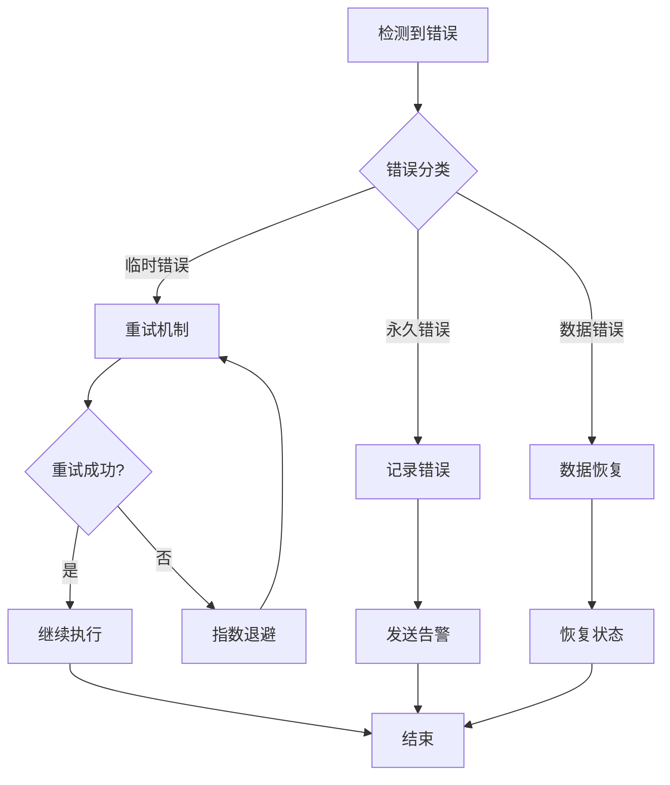

# 持久化执行与时间旅行

<cite>
**本文档引用的文件**
- [examples/durable_execution/main.go](file://examples/durable_execution/main.go)
- [examples/time_travel/main.go](file://examples/time_travel/main.go)
- [examples/checkpointing/main.go](file://examples/checkpointing/main.go)
- [examples/checkpointing/README.md](file://examples/checkpointing/README.md)
- [examples/checkpointing/postgres/main.go](file://examples/checkpointing/postgres/main.go)
- [examples/checkpointing/redis/main.go](file://examples/checkpointing/redis/main.go)
- [examples/checkpointing/sqlite/main.go](file://examples/checkpointing/sqlite/main.go)
- [graph/checkpointing.go](file://graph/checkpointing.go)
- [checkpoint/postgres/postgres.go](file://checkpoint/postgres/postgres.go)
- [checkpoint/redis/redis.go](file://checkpoint/redis/redis.go)
- [checkpoint/sqlite/sqlite.go](file://checkpoint/sqlite/sqlite.go)
</cite>

## 目录
1. [引言](#引言)
2. [核心概念](#核心概念)
3. [系统架构](#系统架构)
4. [持久化执行详解](#持久化执行详解)
5. [时间旅行机制](#时间旅行机制)
6. [检查点存储实现](#检查点存储实现)
7. [数据一致性保障](#数据一致性保障)
8. [性能优化策略](#性能优化策略)
9. [生产环境实践指南](#生产环境实践指南)
10. [故障排除指南](#故障排除指南)
11. [总结](#总结)

## 引言

LangGraphGo 的持久化执行与时间旅行机制是构建高可用、可恢复工作流系统的核心技术。这些机制通过检查点存储保障长时间运行任务的容错性与恢复能力，同时支持人类介入式的工作流管理和历史状态回溯。

持久化执行确保即使在系统崩溃或服务中断的情况下，工作流也能从中断点继续执行；时间旅行机制则允许开发者和用户查看历史状态、修改中间结果，甚至从过去的某个状态重新开始执行。

## 核心概念

### 检查点（Checkpoint）

检查点是系统在特定执行时刻保存的状态快照，包含以下关键信息：

- **ID**: 唯一标识符
- **节点名称**: 当前执行的节点
- **状态数据**: 完整的工作流状态
- **元数据**: 执行上下文信息
- **时间戳**: 创建时间
- **版本号**: 状态版本

### 线程标识符（Thread ID）

每个执行实例通过唯一的线程标识符进行隔离，确保不同工作流实例之间的状态不会相互干扰。

### 自动保存机制

系统支持自动保存和手动保存两种模式：
- **自动保存**: 在每个节点执行完成后自动创建检查点
- **手动保存**: 开发者可以随时调用保存接口

## 系统架构



**图表来源**
- [graph/checkpointing.go](file://graph/checkpointing.go#L22-L38)
- [checkpoint/postgres/postgres.go](file://checkpoint/postgres/postgres.go#L22-L26)
- [checkpoint/redis/redis.go](file://checkpoint/redis/redis.go#L13-L18)
- [checkpoint/sqlite/sqlite.go](file://checkpoint/sqlite/sqlite.go#L13-L17)

## 持久化执行详解

### 故障恢复机制

持久化执行的核心是故障恢复能力。当系统发生崩溃时，可以通过检查点恢复到最近的稳定状态。



**图表来源**
- [examples/durable_execution/main.go](file://examples/durable_execution/main.go#L150-L242)
- [graph/checkpointing.go](file://graph/checkpointing.go#L235-L251)

### 恢复流程实现

在持久化执行中，系统需要识别是否可以从检查点恢复，并确定从哪个节点继续执行：

1. **检查点发现**: 首先查找是否存在有效的检查点
2. **状态加载**: 从存储中加载最新的检查点状态
3. **节点推理**: 根据检查点信息推断应该从哪个节点继续
4. **状态注入**: 将检查点状态作为初始状态传递给工作流
5. **继续执行**: 从检查点标记的节点开始执行后续步骤

**章节来源**
- [examples/durable_execution/main.go](file://examples/durable_execution/main.go#L150-L242)

### 配置选项

持久化执行支持多种配置选项来满足不同的需求：

| 配置项 | 类型 | 默认值 | 描述 |
|--------|------|--------|------|
| Store | CheckpointStore | MemoryCheckpointStore | 存储后端 |
| AutoSave | bool | true | 是否自动保存检查点 |
| SaveInterval | time.Duration | 30s | 保存间隔 |
| MaxCheckpoints | int | 10 | 最大检查点数量 |

**章节来源**
- [graph/checkpointing.go](file://graph/checkpointing.go#L188-L201)

## 时间旅行机制

### 人类介入式工作流

时间旅行机制最典型的应用场景是人类介入式工作流（Human-in-the-loop, HITL）。这种模式允许工作流在特定节点暂停，等待人工决策后再继续执行。



**图表来源**
- [examples/time_travel/main.go](file://examples/time_travel/main.go#L58-L115)

### 状态更新与回滚

时间旅行机制支持动态修改工作流状态，并创建新的检查点记录变更历史：

1. **状态查询**: 获取当前工作流状态
2. **状态修改**: 通过 reducer 函数合并新状态
3. **检查点创建**: 保存修改后的状态
4. **历史追踪**: 新的检查点成为后续操作的基础

**章节来源**
- [examples/time_travel/main.go](file://examples/time_travel/main.go#L74-L115)

### 历史状态访问

系统提供了多种方式访问历史状态：

- **最新检查点**: 获取最近的检查点状态
- **指定检查点**: 通过 ID 获取特定检查点
- **检查点列表**: 获取所有历史检查点
- **状态快照**: 创建当前状态的快照

**章节来源**
- [graph/checkpointing.go](file://graph/checkpointing.go#L398-L463)

## 检查点存储实现

### 内存存储

内存存储适用于开发和测试环境，提供最快的访问速度但不具备持久化能力。

```mermaid
classDiagram
class MemoryCheckpointStore {
+map[string]*Checkpoint checkpoints
+sync.RWMutex mutex
+Save(ctx, checkpoint) error
+Load(ctx, id) *Checkpoint
+List(ctx, executionID) []*Checkpoint
+Delete(ctx, id) error
+Clear(ctx, executionID) error
}
class Checkpoint {
+string ID
+string NodeName
+interface{} State
+map[string]interface{} Metadata
+time.Time Timestamp
+int Version
}
MemoryCheckpointStore --> Checkpoint : manages
```

**图表来源**
- [graph/checkpointing.go](file://graph/checkpointing.go#L40-L111)

### PostgreSQL 存储

PostgreSQL 存储提供企业级的持久化能力，支持复杂查询和事务处理。

**主要特性**:
- ACID 事务保证
- 复杂查询支持
- 高并发访问
- 数据备份和恢复

**表结构设计**:
```sql
CREATE TABLE checkpoints (
    id TEXT PRIMARY KEY,
    execution_id TEXT NOT NULL,
    node_name TEXT NOT NULL,
    state JSONB NOT NULL,
    metadata JSONB,
    timestamp TIMESTAMPTZ NOT NULL,
    version INTEGER NOT NULL
);
CREATE INDEX idx_checkpoints_execution_id ON checkpoints (execution_id);
```

**章节来源**
- [checkpoint/postgres/postgres.go](file://checkpoint/postgres/postgres.go#L65-L84)

### Redis 存储

Redis 存储提供高性能的缓存式持久化，适合对响应时间要求极高的场景。

**主要特性**:
- 极快的读写速度
- 内存管理优化
- 过期时间控制
- 分布式部署支持

**数据结构**:
- 检查点：`langgraph:checkpoint:{id}`
- 执行索引：`langgraph:execution:{executionId}:checkpoints`

**章节来源**
- [checkpoint/redis/redis.go](file://checkpoint/redis/redis.go#L49-L56)

### SQLite 存储

SQLite 存储提供轻量级的本地文件存储，适合单机部署和小型应用。

**主要特性**:
- 无外部依赖
- 单文件部署
- 轻量级性能
- 便携式设计

**章节来源**
- [checkpoint/sqlite/sqlite.go](file://checkpoint/sqlite/sqlite.go#L50-L70)

## 数据一致性保障

### 事务处理

不同存储后端采用不同的事务策略：

| 存储类型 | 事务支持 | 一致性级别 | 性能影响 |
|----------|----------|------------|----------|
| 内存存储 | 无 | 最终一致 | 最低 |
| PostgreSQL | 支持 | 强一致 | 中等 |
| Redis | 支持 | 强一致 | 很低 |
| SQLite | 支持 | 强一致 | 较低 |

### 并发控制

系统采用多层并发控制机制：

1. **存储层锁**: 数据库连接池和 Redis 管道
2. **应用层锁**: Go 的 sync 包提供的互斥锁
3. **逻辑锁**: 基于检查点 ID 的乐观锁

### 数据完整性验证

每次检查点保存都包含完整性验证：



**图表来源**
- [checkpoint/postgres/postgres.go](file://checkpoint/postgres/postgres.go#L92-L135)
- [checkpoint/redis/redis.go](file://checkpoint/redis/redis.go#L57-L83)
- [checkpoint/sqlite/sqlite.go](file://checkpoint/sqlite/sqlite.go#L77-L121)

## 性能优化策略

### 异步保存

检查点保存采用异步方式，避免阻塞主执行流程：



**图表来源**
- [graph/checkpointing.go](file://graph/checkpointing.go#L324-L330)

### 批量操作

对于大量检查点的操作，系统支持批量处理：

- **批量保存**: 使用数据库事务或 Redis 管道
- **批量删除**: 批量清理过期检查点
- **批量查询**: 分页查询历史检查点

### 缓存策略

实现多级缓存提升性能：

1. **内存缓存**: 最近使用的检查点
2. **LRU 淘汰**: 基于访问频率的淘汰策略
3. **预加载**: 预测可能需要的检查点

### 连接池管理

数据库连接采用连接池管理：

- **PostgreSQL**: pgxpool 提供连接池
- **Redis**: go-redis 自带连接池
- **SQLite**: 基于文件的并发控制

**章节来源**
- [checkpoint/postgres/postgres.go](file://checkpoint/postgres/postgres.go#L35-L50)
- [checkpoint/redis/redis.go](file://checkpoint/redis/redis.go#L30-L47)
- [checkpoint/sqlite/sqlite.go](file://checkpoint/sqlite/sqlite.go#L26-L48)

## 生产环境实践指南

### 存储选择指南

根据应用场景选择合适的存储后端：

| 场景 | 推荐存储 | 理由 |
|------|----------|------|
| 高并发生产系统 | PostgreSQL | 强一致性，事务支持 |
| 微服务架构 | Redis | 高性能，分布式友好 |
| 单机部署 | SQLite | 简单可靠，无外部依赖 |
| 开发测试 | 内存存储 | 快速迭代，成本低 |

### 监控指标

生产环境监控的关键指标：

- **检查点保存延迟**: 平均保存时间
- **存储空间使用**: 检查点占用的空间
- **查询响应时间**: 获取检查点的延迟
- **错误率**: 保存和加载失败的比例
- **并发访问量**: 同时访问的请求数

### 备份策略

制定完善的备份策略：

1. **定期备份**: 每日全量备份，每小时增量备份
2. **异地备份**: 跨地域的数据复制
3. **版本保留**: 保留一定时间的历史版本
4. **灾难恢复**: 制定详细的恢复计划

### 安全考虑

生产环境的安全措施：

- **访问控制**: 基于角色的权限管理
- **数据加密**: 静态和传输中的数据加密
- **审计日志**: 记录所有检查点操作
- **网络隔离**: 数据库和应用的网络隔离

**章节来源**
- [examples/checkpointing/README.md](file://examples/checkpointing/README.md#L12-L20)

## 故障排除指南

### 常见问题诊断

| 问题症状 | 可能原因 | 解决方案 |
|----------|----------|----------|
| 检查点保存失败 | 存储空间不足 | 清理旧检查点，扩展存储 |
| 查询超时 | 数据量过大 | 添加索引，分页查询 |
| 数据不一致 | 并发冲突 | 实现重试机制 |
| 内存泄漏 | 缓存未清理 | 调整缓存策略 |

### 调试技巧

1. **启用详细日志**: 设置适当的日志级别
2. **检查点验证**: 验证序列化和反序列化的正确性
3. **性能分析**: 使用 pprof 分析性能瓶颈
4. **压力测试**: 模拟高并发场景

### 错误处理最佳实践



**图表来源**
- [graph/checkpointing.go](file://graph/checkpointing.go#L324-L330)

## 总结

LangGraphGo 的持久化执行与时间旅行机制为构建可靠的分布式工作流系统提供了强大的基础设施。通过检查点存储的多样化实现，开发者可以根据具体需求选择最适合的存储方案。

关键优势包括：

1. **高可用性**: 故障恢复能力确保系统稳定性
2. **灵活性**: 支持多种存储后端和配置选项
3. **可观测性**: 完整的检查点历史便于调试和分析
4. **可扩展性**: 模块化设计支持水平扩展

在生产环境中部署时，需要重点关注性能优化、数据安全和监控告警等方面，确保系统的长期稳定运行。通过合理的架构设计和运维策略，持久化执行与时间旅行机制能够为企业级应用提供坚实的技术支撑。