# 持久化执行保障

<cite>
**本文档引用的文件**
- [examples/durable_execution/main.go](file://examples/durable_execution/main.go)
- [examples/durable_execution/README.md](file://examples/durable_execution/README.md)
- [checkpoint/sqlite/sqlite.go](file://checkpoint/sqlite/sqlite.go)
- [checkpoint/postgres/postgres.go](file://checkpoint/postgres/postgres.go)
- [checkpoint/redis/redis.go](file://checkpoint/redis/redis.go)
- [graph/checkpointing.go](file://graph/checkpointing.go)
- [examples/checkpointing/main.go](file://examples/checkpointing/main.go)
- [examples/checkpointing/README.md](file://examples/checkpointing/README.md)
- [examples/time_travel/main.go](file://examples/time_travel/main.go)
- [graph/interrupt_test.go](file://graph/interrupt_test.go)
- [checkpoint/sqlite/sqlite_test.go](file://checkpoint/sqlite/sqlite_test.go)
- [checkpoint/redis/redis_test.go](file://checkpoint/redis/redis_test.go)
</cite>

## 目录
1. [引言](#引言)
2. [持久化执行核心概念](#持久化执行核心概念)
3. [检查点存储架构](#检查点存储架构)
4. [自动保存机制](#自动保存机制)
5. [状态恢复与执行延续](#状态恢复与执行延续)
6. [自定义存储适配器设计](#自定义存储适配器设计)
7. [生产级存储后端集成](#生产级存储后端集成)
8. [配置管理与线程隔离](#配置管理与线程隔离)
9. [故障恢复边界与重试策略](#故障恢复边界与重试策略)
10. [性能优化与I/O优化](#性能优化与io优化)
11. [最佳实践与工程建议](#最佳实践与工程建议)
12. [总结](#总结)

## 引言

持久化执行（Durable Execution）是 LangGraphGo 中保障长时间运行工作流容错性与恢复能力的核心机制。通过检查点存储（Checkpoint Store），系统能够在进程崩溃后恢复执行流，确保数据一致性，避免重复计算，并支持人类介入和时间旅行等高级功能。

持久化执行解决了现代分布式系统中的关键挑战：
- **容错性**：系统崩溃后能够从最近的检查点恢复
- **幂等性**：重复执行相同的操作不会产生副作用
- **可观察性**：支持状态检查和历史回溯
- **可维护性**：支持长时间运行的任务和人类协作

## 持久化执行核心概念

### 检查点（Checkpoint）结构

检查点是持久化执行的基础数据结构，记录了执行过程中的关键状态信息：

```mermaid
classDiagram
class Checkpoint {
+string ID
+string NodeName
+interface State
+map[string]interface{} Metadata
+time.Time Timestamp
+int Version
+Marshal() []byte
+Unmarshal([]byte) error
}
class CheckpointStore {
<<interface>>
+Save(ctx, checkpoint) error
+Load(ctx, checkpointID) Checkpoint
+List(ctx, executionID) []Checkpoint
+Delete(ctx, checkpointID) error
+Clear(ctx, executionID) error
}
class CheckpointableRunnable {
+CheckpointableRunnable runnable
+CheckpointConfig config
+string executionID
+Invoke(ctx, initialState) interface
+InvokeWithConfig(ctx, initialState, config) interface
+SaveCheckpoint(ctx, nodeName, state) error
+LoadCheckpoint(ctx, checkpointID) Checkpoint
+ListCheckpoints(ctx) []Checkpoint
+ResumeFromCheckpoint(ctx, checkpointID) interface
}
CheckpointableRunnable --> CheckpointStore : uses
CheckpointableRunnable --> Checkpoint : manages
```

**图表来源**
- [graph/checkpointing.go](file://graph/checkpointing.go#L12-L20)
- [graph/checkpointing.go](file://graph/checkpointing.go#L22-L38)

### 核心组件关系

持久化执行涉及多个核心组件的协同工作：

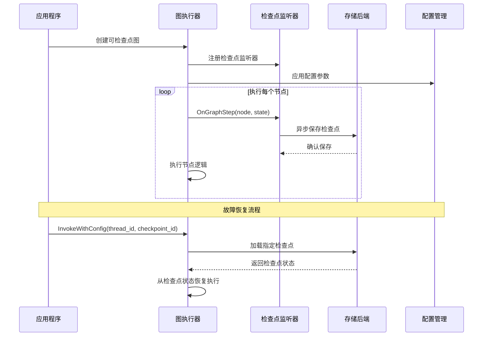

**图表来源**
- [graph/checkpointing.go](file://graph/checkpointing.go#L297-L330)
- [examples/durable_execution/main.go](file://examples/durable_execution/main.go#L150-L241)

**章节来源**
- [graph/checkpointing.go](file://graph/checkpointing.go#L12-L20)
- [examples/durable_execution/main.go](file://examples/durable_execution/main.go#L17-L90)

## 检查点存储架构

### 存储接口设计

LangGraphGo 定义了统一的检查点存储接口，支持多种存储后端：

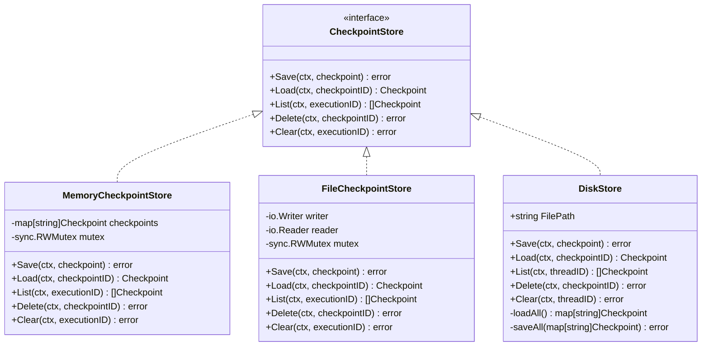

**图表来源**
- [graph/checkpointing.go](file://graph/checkpointing.go#L22-L38)
- [graph/checkpointing.go](file://graph/checkpointing.go#L40-L111)
- [examples/durable_execution/main.go](file://examples/durable_execution/main.go#L17-L90)

### 内存存储实现

内存存储提供最快的访问速度，适用于测试和短生命周期任务：

| 特性 | 描述 | 实现细节 |
|------|------|----------|
| 存储位置 | 程序内存 | 基于 map[string]*Checkpoint 的内存映射 |
| 并发控制 | 读写锁 | 使用 sync.RWMutex 确保线程安全 |
| 数据持久性 | 非持久化 | 进程重启后数据丢失 |
| 性能特征 | 最高性能 | O(1) 查找，无 I/O 开销 |
| 适用场景 | 测试、开发、短期任务 | 不适合生产环境 |

**章节来源**
- [graph/checkpointing.go](file://graph/checkpointing.go#L40-L111)

## 自动保存机制

### 检查点监听器

自动保存机制通过检查点监听器实现实时状态持久化：

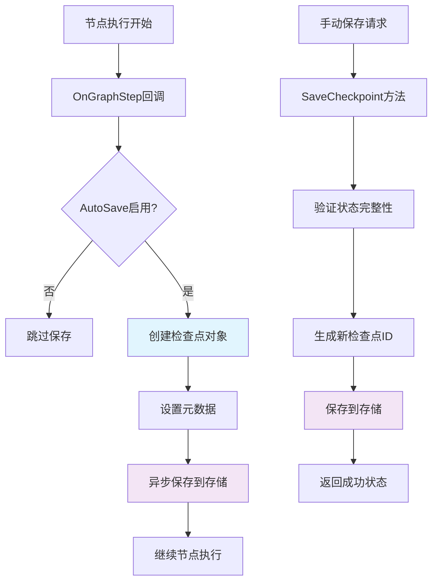

**图表来源**
- [graph/checkpointing.go](file://graph/checkpointing.go#L297-L330)
- [graph/checkpointing.go](file://graph/checkpointing.go#L254-L267)

### 保存时机与策略

自动保存的触发时机和策略可以通过配置进行精细控制：

| 配置项 | 类型 | 默认值 | 描述 |
|--------|------|--------|------|
| AutoSave | bool | true | 是否在每个节点执行后自动保存 |
| SaveInterval | time.Duration | 30s | 自动保存的时间间隔（当 AutoSave=false 时生效） |
| MaxCheckpoints | int | 10 | 单次执行的最大检查点数量限制 |
| Store | CheckpointStore | MemoryCheckpointStore | 检查点存储后端 |

**章节来源**
- [graph/checkpointing.go](file://graph/checkpointing.go#L188-L201)
- [graph/checkpointing.go](file://graph/checkpointing.go#L297-L330)

## 状态恢复与执行延续

### 恢复流程设计

状态恢复是持久化执行的核心功能，需要处理多种恢复场景：

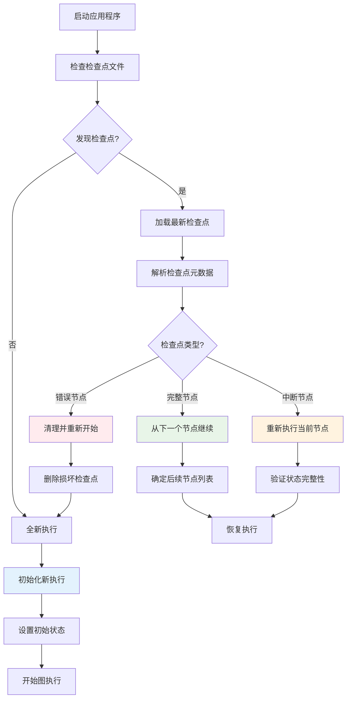

**图表来源**
- [examples/durable_execution/main.go](file://examples/durable_execution/main.go#L150-L241)

### 配置参数解析

恢复过程中需要正确解析和应用配置参数：

| 参数名称 | 类型 | 必需性 | 描述 | 恢复行为 |
|----------|------|--------|------|----------|
| thread_id | string | 可选 | 执行线程标识符，默认使用执行ID | 用于区分不同的执行实例 |
| checkpoint_id | string | 可选 | 指定要恢复的检查点ID | 优先使用指定的检查点 |
| ResumeFrom | []string | 可选 | 指定恢复时的起始节点列表 | 覆盖默认的入口节点 |

**章节来源**
- [examples/durable_execution/main.go](file://examples/durable_execution/main.go#L174-L241)
- [graph/checkpointing.go](file://graph/checkpointing.go#L398-L462)

## 自定义存储适配器设计

### 设计模式分析

LangGraphGo 提供了灵活的存储适配器设计模式，支持自定义存储后端：

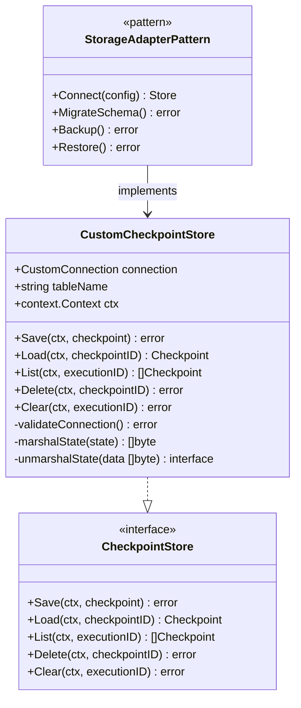

**图表来源**
- [examples/durable_execution/main.go](file://examples/durable_execution/main.go#L17-L90)

### 实现要点

自定义存储适配器需要实现以下关键功能：

1. **连接管理**：建立和维护与存储系统的连接
2. **数据序列化**：将检查点状态序列化为存储格式
3. **事务支持**：确保保存操作的原子性
4. **错误处理**：优雅处理网络异常和存储错误
5. **性能优化**：实现批量操作和缓存机制

**章节来源**
- [examples/durable_execution/main.go](file://examples/durable_execution/main.go#L17-L90)

## 生产级存储后端集成

### PostgreSQL 集成

PostgreSQL 提供企业级的关系型数据库支持：

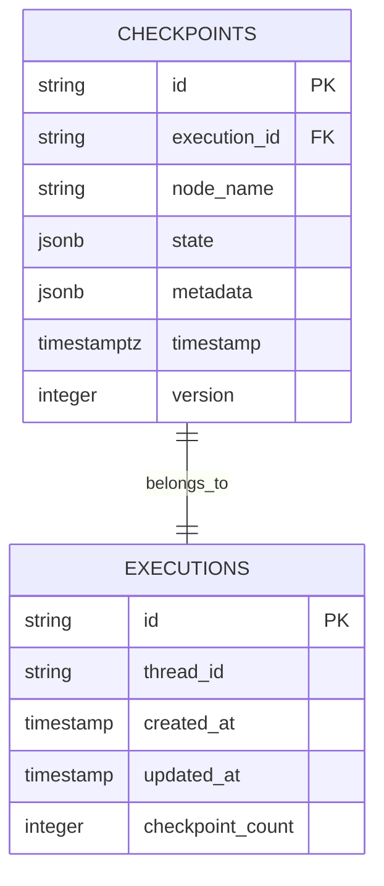

**图表来源**
- [checkpoint/postgres/postgres.go](file://checkpoint/postgres/postgres.go#L66-L77)

| 特性 | PostgreSQL 实现 | 优势 | 适用场景 |
|------|----------------|------|----------|
| 数据类型 | JSONB | 支持复杂嵌套结构 | 复杂状态对象 |
| 索引策略 | 复合索引 | 高效查询性能 | 大量并发访问 |
| 事务支持 | ACID | 强一致性保证 | 关键业务流程 |
| 备份恢复 | WAL日志 | 完整的数据保护 | 生产环境部署 |

**章节来源**
- [checkpoint/postgres/postgres.go](file://checkpoint/postgres/postgres.go#L22-L250)

### Redis 集成

Redis 提供高性能的内存存储解决方案：

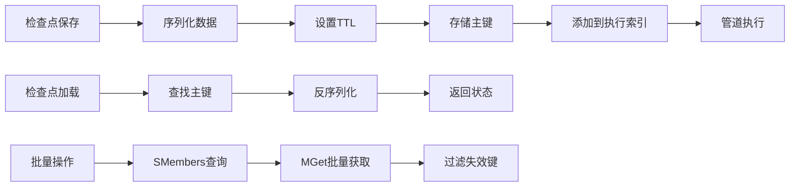

**图表来源**
- [checkpoint/redis/redis.go](file://checkpoint/redis/redis.go#L58-L84)

### SQLite 集成

SQLite 提供轻量级的本地存储方案：

| 组件 | 功能 | 实现特点 |
|------|------|----------|
| 数据库文件 | 持久化存储 | 单文件架构，易于备份 |
| 表结构设计 | 结构化存储 | 主键约束，外键关联 |
| 索引优化 | 查询加速 | 时间戳索引，执行ID索引 |
| 事务管理 | 数据一致性 | WAL模式，原子操作 |
| 文件锁定 | 并发控制 | 排他锁，防止数据损坏 |

**章节来源**
- [checkpoint/sqlite/sqlite.go](file://checkpoint/sqlite/sqlite.go#L13-L236)

## 配置管理与线程隔离

### 线程ID机制

线程ID（Thread ID）提供了执行实例之间的完全隔离：

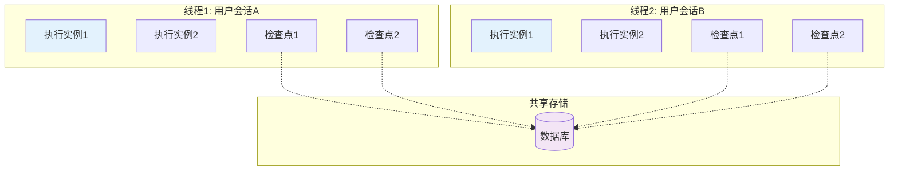

**图表来源**
- [graph/checkpointing.go](file://graph/checkpointing.go#L398-L431)

### 配置参数详解

| 参数类别 | 参数名 | 类型 | 默认值 | 作用域 | 描述 |
|----------|--------|------|--------|--------|------|
| 全局配置 | Store | CheckpointStore | MemoryCheckpointStore | 全局 | 检查点存储后端 |
| 执行配置 | AutoSave | bool | true | 单次执行 | 是否自动保存检查点 |
| 执行配置 | SaveInterval | time.Duration | 30s | 单次执行 | 自动保存间隔时间 |
| 执行配置 | MaxCheckpoints | int | 10 | 单次执行 | 最大检查点数量 |
| 恢复配置 | thread_id | string | 自动生成 | 恢复操作 | 指定恢复的执行线程 |
| 恢复配置 | checkpoint_id | string | 无 | 恢复操作 | 指定恢复的具体检查点 |

**章节来源**
- [graph/checkpointing.go](file://graph/checkpointing.go#L188-L201)
- [graph/checkpointing.go](file://graph/checkpointing.go#L398-L462)

## 故障恢复边界与重试策略

### 恢复边界定义

故障恢复需要明确界定不同类型的故障及其处理策略：

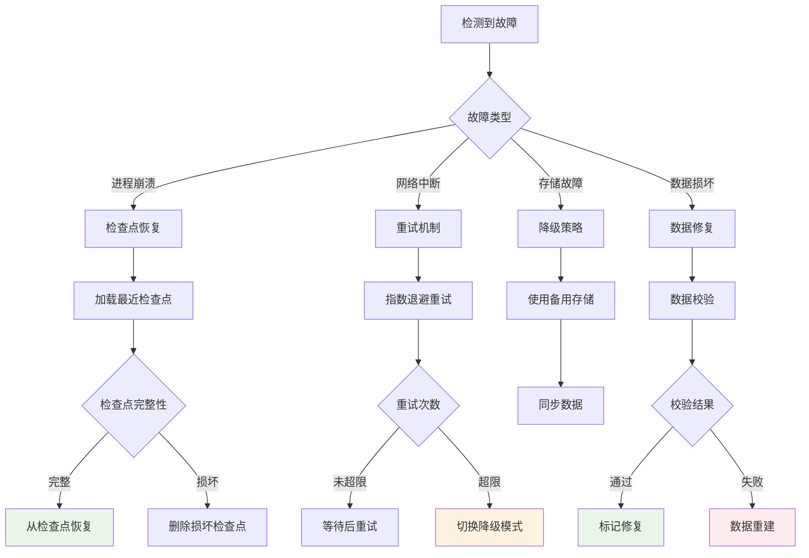

### 重试策略配置

| 策略类型 | 参数配置 | 默认值 | 适用场景 |
|----------|----------|--------|----------|
| 指数退避 | BaseDelay, MaxDelay, Multiplier | 100ms, 30s, 2.0 | 网络不稳定环境 |
| 固定间隔 | Interval, MaxRetries | 1s, 5 | 简单重试场景 |
| 智能重试 | AdaptiveThreshold, BackoffFactor | 3, 1.5 | 动态负载环境 |
| 紧急恢复 | EmergencyMode, Timeout | false, 5s | 关键业务恢复 |

**章节来源**
- [graph/checkpointing.go](file://graph/checkpointing.go#L297-L330)

## 性能优化与I/O优化

### 异步保存机制

为了最小化对主线程的影响，检查点保存采用异步方式进行：

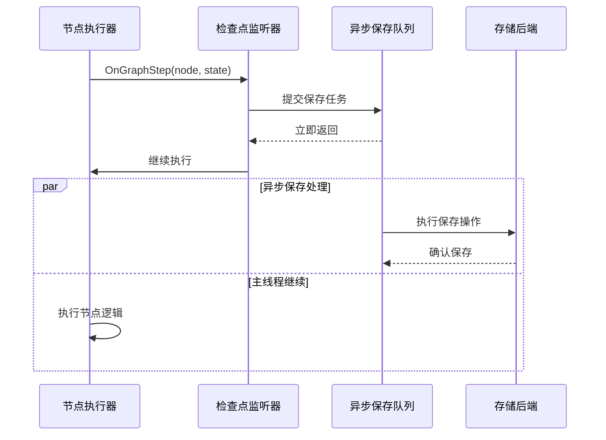

**图表来源**
- [graph/checkpointing.go](file://graph/checkpointing.go#L325-L329)

### I/O 优化策略

| 优化技术 | 实现方式 | 性能提升 | 适用场景 |
|----------|----------|----------|----------|
| 批量写入 | 管道操作 | 减少网络往返 | 高频检查点保存 |
| 压缩存储 | JSON压缩 | 减少存储空间 | 大型状态对象 |
| 缓存机制 | 内存缓存 | 提升读取速度 | 频繁状态查询 |
| 连接池 | 数据库连接池 | 减少连接开销 | 高并发访问 |
| 分片存储 | 按时间分片 | 优化查询性能 | 长期运行任务 |

### 内存管理优化

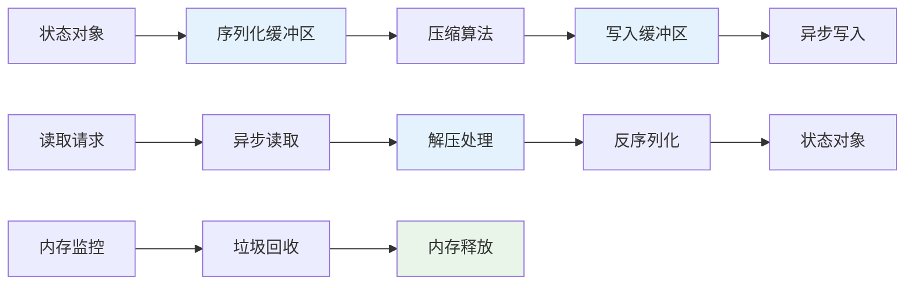

**章节来源**
- [graph/checkpointing.go](file://graph/checkpointing.go#L325-L329)
- [checkpoint/redis/redis.go](file://checkpoint/redis/redis.go#L65-L84)

## 最佳实践与工程建议

### 架构设计原则

1. **单一职责**：每个存储后端专注于特定的存储特性
2. **接口隔离**：检查点存储接口保持简洁，功能分离
3. **依赖注入**：通过配置参数注入不同的存储实现
4. **错误隔离**：存储层错误不影响业务逻辑执行

### 数据一致性保障

| 一致性级别 | 实现方式 | 适用场景 | 性能影响 |
|------------|----------|----------|----------|
| 强一致性 | 事务提交 | 关键业务流程 | 中等 |
| 最终一致性 | 异步复制 | 高吞吐场景 | 低 |
| 最近一致性 | 缓存同步 | 实时性要求不高 | 很低 |
| 最小一致性 | 异步保存 | 性能优先场景 | 极低 |

### 监控与运维

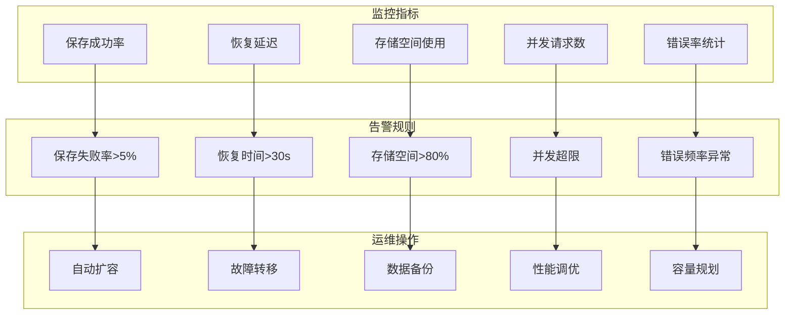

### 安全考虑

1. **数据加密**：敏感状态数据应进行加密存储
2. **访问控制**：实现细粒度的权限管理
3. **审计日志**：记录所有检查点操作的审计信息
4. **备份策略**：定期备份检查点数据
5. **灾难恢复**：制定详细的灾难恢复计划

**章节来源**
- [examples/durable_execution/README.md](file://examples/durable_execution/README.md#L1-L60)
- [examples/checkpointing/README.md](file://examples/checkpointing/README.md#L1-L51)

## 总结

持久化执行机制是 LangGraphGo 实现高可用、可恢复图工作流系统的核心技术。通过检查点存储、自动保存、状态恢复等关键功能，系统能够在各种故障场景下保持业务连续性。

### 核心优势

1. **容错性强**：支持进程崩溃后的自动恢复
2. **可观察性好**：提供完整的执行历史和状态快照
3. **扩展性佳**：支持多种存储后端和自定义适配器
4. **性能优异**：异步保存机制最小化对业务的影响
5. **易于集成**：标准化的接口设计便于系统集成

### 技术演进方向

随着分布式系统的不断发展，持久化执行机制将继续演进：

- **云原生支持**：更好的容器化和微服务集成
- **边缘计算**：支持边缘设备的检查点持久化
- **AI驱动优化**：智能预测和优化检查点保存策略
- **多活架构**：支持多地多活的高可用部署
- **实时分析**：提供检查点数据的实时分析能力

通过深入理解和正确应用持久化执行机制，开发者可以构建更加可靠、高效的图工作流系统，满足现代应用对高可用性和可恢复性的严格要求。