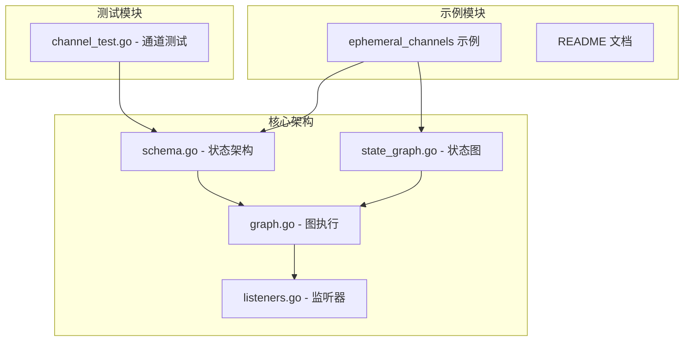
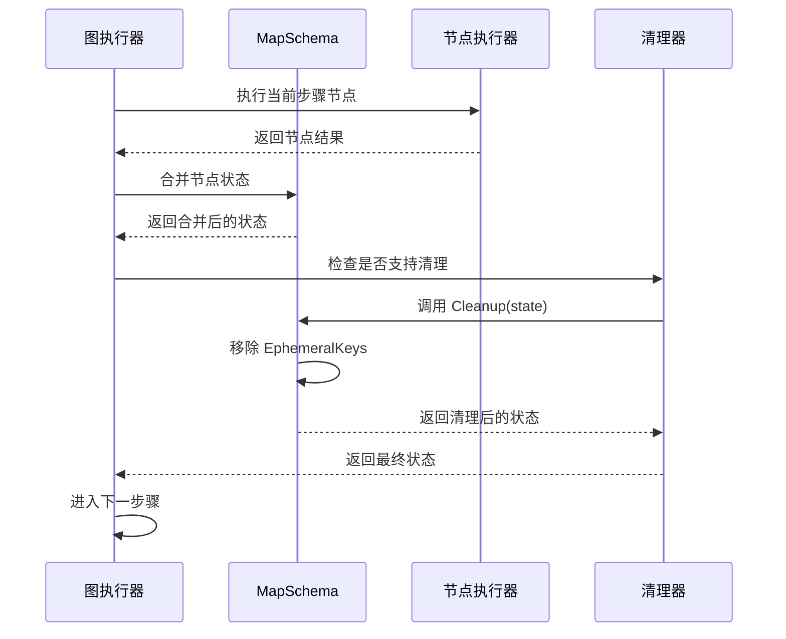
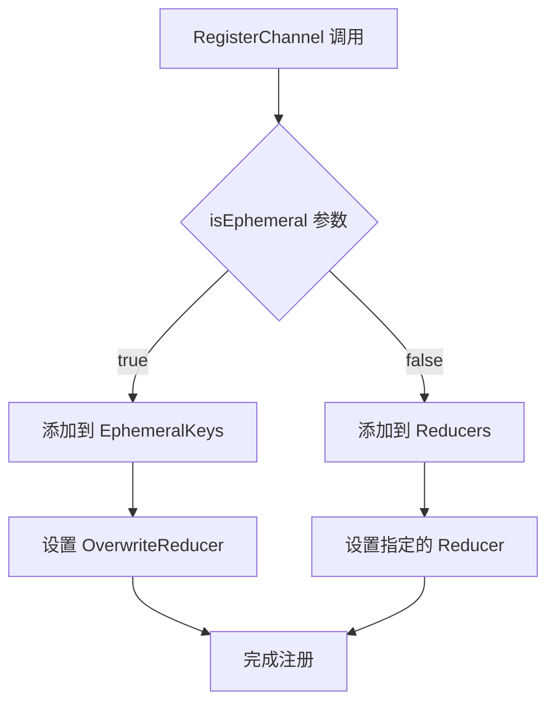
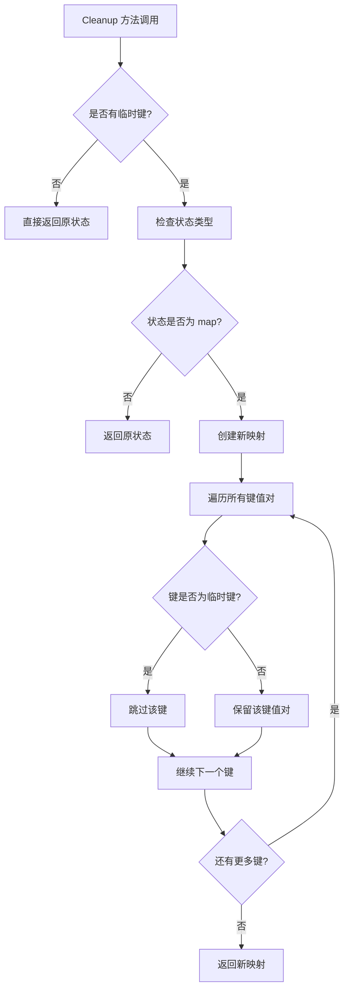
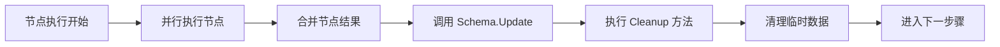
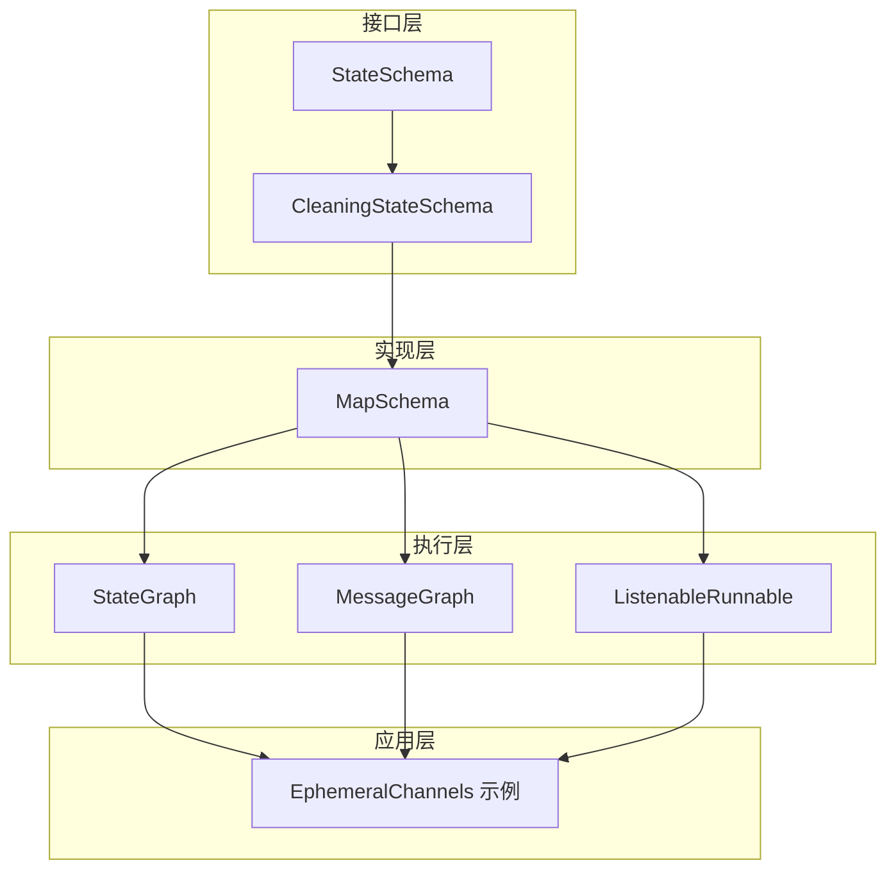

# 临时通道管理

<cite>
**本文档引用的文件**
- [examples/ephemeral_channels/main.go](file://examples/ephemeral_channels/main.go)
- [examples/ephemeral_channels/README.md](file://examples/ephemeral_channels/README.md)
- [examples/ephemeral_channels/README_CN.md](file://examples/ephemeral_channels/README_CN.md)
- [graph/schema.go](file://graph/schema.go)
- [graph/state_graph.go](file://graph/state_graph.go)
- [graph/graph.go](file://graph/graph.go)
- [graph/listeners.go](file://graph/listeners.go)
- [graph/channel_test.go](file://graph/channel_test.go)
</cite>

## 目录
1. [引言](#引言)
2. [项目结构概述](#项目结构概述)
3. [核心组件分析](#核心组件分析)
4. [架构概览](#架构概览)
5. [详细组件分析](#详细组件分析)
6. [依赖关系分析](#依赖关系分析)
7. [性能考虑](#性能考虑)
8. [故障排除指南](#故障排除指南)
9. [结论](#结论)

## 引言

临时通道（Ephemeral Channels）是 LangGraphGo 中一个重要的设计模式，专门用于处理需要在执行过程中短暂存在的数据。这些数据具有以下特征：仅在紧接的下一步或特定的超步（super-step）内有效，在步骤完成后会被自动清理。临时通道机制确保了状态的整洁性，防止临时数据污染主状态，同时提高了持久化检查点的效率。

临时通道的设计解决了有状态应用中的一个重要问题：并非所有数据都需要在整个对话历史中持久保存。通过区分持久性和临时性数据，系统能够更高效地管理内存使用，减少不必要的状态传播，并提供更好的上下文隔离。

## 项目结构概述

临时通道功能主要分布在以下几个关键模块中：



**图表来源**
- [examples/ephemeral_channels/main.go](file://examples/ephemeral_channels/main.go#L1-L75)
- [graph/schema.go](file://graph/schema.go#L1-L186)
- [graph/state_graph.go](file://graph/state_graph.go#L1-L200)

**章节来源**
- [examples/ephemeral_channels/main.go](file://examples/ephemeral_channels/main.go#L1-L75)
- [graph/schema.go](file://graph/schema.go#L1-L186)

## 核心组件分析

### CleaningStateSchema 接口

CleaningStateSchema 接口是临时通道功能的核心抽象，它扩展了基本的 StateSchema 接口，增加了清理能力：

```mermaid
classDiagram
class StateSchema {
<<interface>>
+Init() interface{}
+Update(current, new) interface{}
}
class CleaningStateSchema {
<<interface>>
+Cleanup(state) interface{}
}
class MapSchema {
+Reducers map[string]Reducer
+EphemeralKeys map[string]bool
+RegisterChannel(key, reducer, isEphemeral)
+Cleanup(state) interface{}
}
StateSchema <|-- CleaningStateSchema
CleaningStateSchema <|.. MapSchema
```

**图表来源**
- [graph/schema.go](file://graph/schema.go#L13-L26)
- [graph/schema.go](file://graph/schema.go#L29-L34)

### MapSchema 实现

MapSchema 是 CleaningStateSchema 的具体实现，负责维护持久化和临时性通道的分离：

| 属性 | 类型 | 描述 | 默认值 |
|------|------|------|--------|
| Reducers | map[string]Reducer | 键值对的更新函数映射 | 空映射 |
| EphemeralKeys | map[string]bool | 临时通道键的集合 | 空映射 |

**章节来源**
- [graph/schema.go](file://graph/schema.go#L29-L34)
- [graph/schema.go](file://graph/schema.go#L49-L54)

## 架构概览

临时通道机制在 LangGraphGo 的执行流程中扮演着关键角色，其工作流程如下：



**图表来源**
- [graph/graph.go](file://graph/graph.go#L460-L464)
- [graph/state_graph.go](file://graph/state_graph.go#L276-L278)

**章节来源**
- [graph/graph.go](file://graph/graph.go#L460-L464)
- [graph/state_graph.go](file://graph/state_graph.go#L276-L278)

## 详细组件分析

### 临时通道的注册机制

临时通道通过 MapSchema 的 RegisterChannel 方法进行注册，该方法接受三个参数：



**图表来源**
- [graph/schema.go](file://graph/schema.go#L49-L54)

### 清理算法实现

MapSchema 的 Cleanup 方法实现了高效的临时数据清理：



**图表来源**
- [graph/schema.go](file://graph/schema.go#L102-L136)

### 执行流程中的清理时机

临时通道的清理发生在每个执行步骤的末尾，具体位置包括：

1. **图执行循环** (`graph.go`)：在所有节点执行完成后
2. **监听器执行** (`listeners.go`)：在单节点执行完成后
3. **状态图执行** (`state_graph.go`)：在并行节点执行完成后



**图表来源**
- [graph/graph.go](file://graph/graph.go#L460-L464)
- [graph/listeners.go](file://graph/listeners.go#L309-L311)
- [graph/state_graph.go](file://graph/state_graph.go#L276-L278)

**章节来源**
- [graph/schema.go](file://graph/schema.go#L102-L136)
- [graph/graph.go](file://graph/graph.go#L460-L464)
- [graph/listeners.go](file://graph/listeners.go#L309-L311)

### 常用 Reducer 函数

LangGraphGo 提供了两种常用的 reducer 函数来处理不同类型的数据：

| Reducer 名称 | 功能描述 | 使用场景 | 实现特点 |
|-------------|----------|----------|----------|
| OverwriteReducer | 替换旧值为新值 | 临时数据、配置项 | 总是返回新值 |
| AppendReducer | 追加到现有切片 | 历史记录、消息列表 | 支持单元素和切片追加 |

**章节来源**
- [graph/schema.go](file://graph/schema.go#L141-L185)

## 依赖关系分析

临时通道功能的依赖关系体现了良好的分层架构设计：



**图表来源**
- [graph/schema.go](file://graph/schema.go#L13-L26)
- [graph/state_graph.go](file://graph/state_graph.go#L11-L32)

**章节来源**
- [graph/schema.go](file://graph/schema.go#L13-L26)
- [graph/state_graph.go](file://graph/state_graph.go#L11-L32)

## 性能考虑

临时通道机制在设计时充分考虑了性能优化：

### 内存效率
- **延迟清理**：临时数据只在需要时才被清理，避免不必要的内存分配
- **就地修改**：对于非临时键，直接复用原始状态映射以减少内存拷贝
- **条件检查**：在执行清理前先检查是否存在临时键，避免空操作

### 时间复杂度
- **注册操作**：O(1)，通过哈希表实现快速查找和插入
- **清理操作**：O(n)，其中 n 是状态映射中的键数量，但通常远小于总键数
- **状态更新**：O(k)，k 是需要更新的键数量，通常远小于总键数

## 故障排除指南

### 常见问题及解决方案

| 问题描述 | 可能原因 | 解决方案 | 验证方法 |
|----------|----------|----------|----------|
| 临时数据未被清理 | 未正确标记为临时通道 | 检查 RegisterChannel 的 isEphemeral 参数 | 观察最终状态是否包含临时键 |
| 数据意外泄露 | 清理时机错误 | 确认清理逻辑在正确的执行阶段 | 添加调试日志跟踪清理过程 |
| 性能问题 | 频繁的临时数据操作 | 优化临时数据的使用频率 | 分析内存使用模式 |

### 调试技巧

1. **启用详细日志**：在执行过程中添加状态快照记录
2. **监控清理效果**：验证每次步骤结束后的状态变化
3. **单元测试覆盖**：编写针对临时通道行为的专门测试

**章节来源**
- [graph/channel_test.go](file://graph/channel_test.go#L1-L75)

## 结论

临时通道（Ephemeral Channels）机制是 LangGraphGo 中一个精心设计的功能，它通过以下方式提升了系统的整体质量：

### 主要优势
1. **清晰的状态管理**：明确区分持久性和临时性数据，提高代码可读性
2. **自动化的生命周期管理**：无需手动干预，系统自动处理临时数据的创建和销毁
3. **高效的资源利用**：减少不必要的状态传播，降低内存占用
4. **灵活的配置选项**：支持多种 reducer 函数，适应不同数据类型的处理需求

### 设计亮点
- **接口驱动**：通过 CleaningStateSchema 接口实现可扩展性
- **执行时机精确**：在每个步骤结束时进行清理，确保状态的一致性
- **性能优化**：采用条件检查和就地修改等优化策略
- **测试友好**：提供了完善的测试用例和验证机制

临时通道机制不仅解决了有状态应用中的实际问题，还展示了良好的软件设计原则：关注点分离、自动化管理和性能优化。这种设计模式可以作为其他类似系统的重要参考，特别是在需要处理复杂状态流转的应用场景中。