# 事件监听器机制

<cite>
**本文档引用的文件**
- [listeners.go](file://graph/listeners.go)
- [listeners_test.go](file://graph/listeners_test.go)
- [builtin_listeners.go](file://graph/builtin_listeners.go)
- [builtin_listeners_test.go](file://graph/builtin_listeners_test.go)
- [main.go](file://examples/listeners/main.go)
- [streaming.go](file://graph/streaming.go)
- [schema.go](file://graph/schema.go)
- [context.go](file://graph/context.go)
</cite>

## 目录
1. [简介](#简介)
2. [核心架构概览](#核心架构概览)
3. [事件类型系统](#事件类型系统)
4. [监听器接口设计](#监听器接口设计)
5. [节点级事件监听](#节点级事件监听)
6. [全局事件监听](#全局事件监听)
7. [内置监听器实现](#内置监听器实现)
8. [异步执行模型](#异步执行模型)
9. [生命周期管理](#生命周期管理)
10. [实践应用示例](#实践应用示例)
11. [性能考虑](#性能考虑)
12. [故障排除指南](#故障排除指南)
13. [总结](#总结)

## 简介

langgraphgo 的事件监听器机制是一个强大而灵活的架构设计，它为工作流执行过程中的各个阶段提供了全面的可观测性和控制能力。该机制通过监听器模式实现了横切关注点的解耦，支持日志记录、性能监控、错误追踪等多种功能的无缝集成。

事件监听器机制的核心价值在于：
- **非侵入性监控**：无需修改业务逻辑即可添加监控功能
- **异步执行**：监听器不会阻塞主执行流程
- **容错性**：单个监听器的异常不会影响整体执行
- **灵活性**：支持节点级和全局级的监听配置

## 核心架构概览

事件监听器机制采用分层架构设计，主要包含以下核心组件：

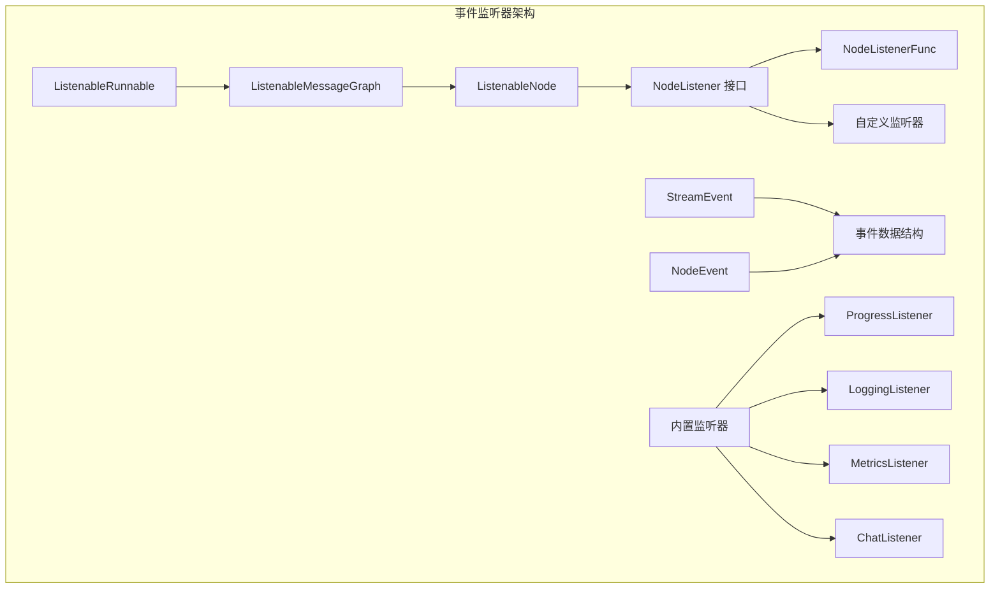

**图表来源**
- [listeners.go](file://graph/listeners.go#L89-L335)

**章节来源**
- [listeners.go](file://graph/listeners.go#L1-L335)

## 事件类型系统

langgraphgo 定义了丰富的事件类型来覆盖工作流执行的各个阶段：

### 核心事件类型

| 事件类型 | 常量名 | 触发时机 | 语义含义 |
|---------|--------|----------|----------|
| 节点开始 | `NodeEventStart` | 节点函数开始执行前 | 标识节点执行的起点 |
| 节点进度 | `NodeEventProgress` | 节点执行过程中的任意时刻 | 表示节点正在处理中 |
| 节点完成 | `NodeEventComplete` | 节点成功执行完成后 | 标识节点执行的成功结束 |
| 节点错误 | `NodeEventError` | 节点执行过程中发生错误时 | 记录节点执行失败的原因 |

### 扩展事件类型

| 事件类型 | 常量名 | 触发时机 | 应用场景 |
|---------|--------|----------|----------|
| 链开始 | `EventChainStart` | 整个工作流开始执行时 | 工作流级别的初始化 |
| 链结束 | `EventChainEnd` | 整个工作流执行完成时 | 工作流级别的清理 |
| 工具开始 | `EventToolStart` | 调用外部工具或服务前 | 外部依赖的监控 |
| 工具结束 | `EventToolEnd` | 外部工具调用完成后 | 外部依赖的性能统计 |
| LLM 开始 | `EventLLMStart` | 发起大语言模型请求前 | AI 服务的调用监控 |
| LLM 结束 | `EventLLMEnd` | 大语言模型响应返回后 | AI 服务的性能分析 |
| 流式令牌 | `EventToken` | 流式响应产生新令牌时 | 实时响应的监控 |
| 自定义事件 | `EventCustom` | 用户自定义事件 | 特定业务需求的扩展 |

**章节来源**
- [listeners.go](file://graph/listeners.go#L13-L48)

## 监听器接口设计

### NodeListener 接口

`NodeListener` 是事件监听器的核心接口，定义了统一的事件处理契约：

```mermaid
classDiagram
class NodeListener {
<<interface>>
+OnNodeEvent(ctx Context, event NodeEvent, nodeName string, state interface{}, err error)
}
class NodeListenerFunc {
+OnNodeEvent(ctx Context, event NodeEvent, nodeName string, state interface{}, err error)
}
class ProgressListener {
+OnNodeEvent(ctx Context, event NodeEvent, nodeName string, state interface{}, err error)
-writer io.Writer
-nodeSteps map[string]string
-mutex sync.RWMutex
-showTiming bool
-showDetails bool
-prefix string
}
class LoggingListener {
+OnNodeEvent(ctx Context, event NodeEvent, nodeName string, state interface{}, err error)
-logger *log.Logger
-logLevel LogLevel
-includeState bool
}
class MetricsListener {
+OnNodeEvent(ctx Context, event NodeEvent, nodeName string, state interface{}, err error)
+GetNodeExecutions() map[string]int
+GetNodeErrors() map[string]int
+GetNodeAverageDuration() map[string]time.Duration
+GetTotalExecutions() int
+PrintSummary(writer io.Writer)
+Reset()
}
NodeListener <|-- NodeListenerFunc
NodeListener <|-- ProgressListener
NodeListener <|-- LoggingListener
NodeListener <|-- MetricsListener
```

**图表来源**
- [listeners.go](file://graph/listeners.go#L51-L116)
- [builtin_listeners.go](file://graph/builtin_listeners.go#L13-L433)

### 函数适配器模式

`NodeListenerFunc` 提供了函数到接口的适配器实现，允许开发者使用简单的函数作为监听器：

**章节来源**
- [listeners.go](file://graph/listeners.go#L51-L63)

## 节点级事件监听

### ListenableNode 设计

`ListenableNode` 是 `Node` 的增强版本，为单个节点提供了完整的监听器支持：

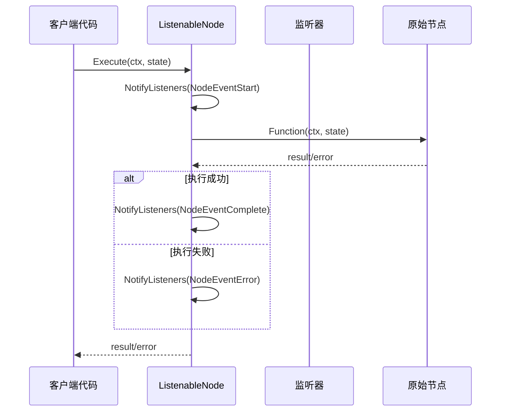

**图表来源**
- [listeners.go](file://graph/listeners.go#L159-L174)

### 监听器注册与管理

#### 添加监听器

使用 `AddListener` 方法可以为特定节点添加监听器：

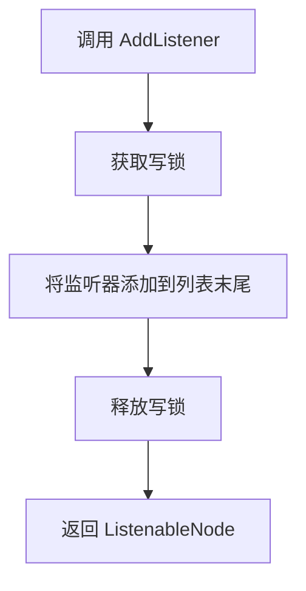

**图表来源**
- [listeners.go](file://graph/listeners.go#L104-L111)

#### 获取监听器列表

`GetListeners` 方法提供线程安全的监听器访问：

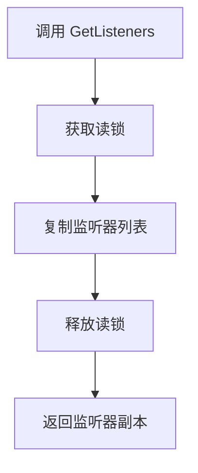

**图表来源**
- [listeners.go](file://graph/listeners.go#L177-L185)

#### 移除监听器

`RemoveListener` 方法支持从节点中移除指定的监听器：

**章节来源**
- [listeners.go](file://graph/listeners.go#L104-L125)

## 全局事件监听

### ListenableMessageGraph 扩展

`ListenableMessageGraph` 在消息图的基础上增加了全局监听器支持：

```mermaid
classDiagram
class ListenableMessageGraph {
+MessageGraph *MessageGraph
+listenableNodes map[string]*ListenableNode
+AddNode(name string, fn func) *ListenableNode
+GetListenableNode(name string) *ListenableNode
+AddGlobalListener(listener NodeListener)
+RemoveGlobalListener(listener NodeListener)
}
class ListenableNode {
+Node Node
+listeners []NodeListener
+mutex sync.RWMutex
+AddListener(listener NodeListener) *ListenableNode
+RemoveListener(listener NodeListener)
+NotifyListeners(ctx Context, event NodeEvent, state interface{}, err error)
+Execute(ctx Context, state interface{}) (interface{}, error)
+GetListeners() []NodeListener
}
ListenableMessageGraph --> ListenableNode : 管理多个
```

**图表来源**
- [listeners.go](file://graph/listeners.go#L187-L234)

### 全局监听器操作

#### 添加全局监听器

`AddGlobalListener` 方法会将监听器添加到图中的所有节点：

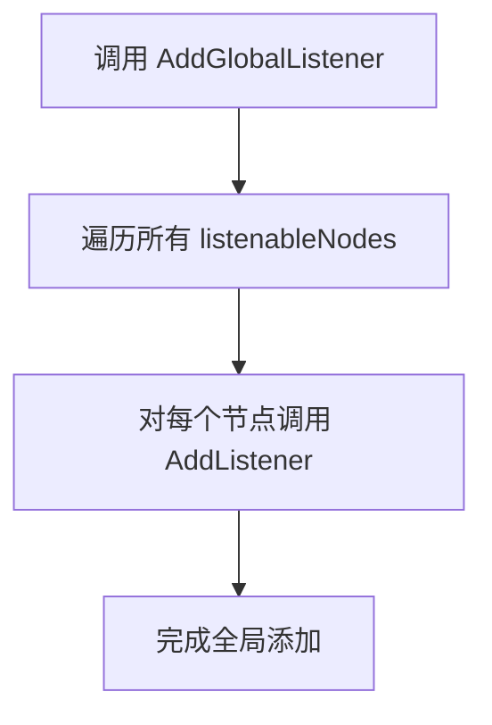

**图表来源**
- [listeners.go](file://graph/listeners.go#L222-L226)

#### 移除全局监听器

`RemoveGlobalListener` 方法会从所有节点中移除指定监听器：

**章节来源**
- [listeners.go](file://graph/listeners.go#L222-L234)

## 内置监听器实现

langgraphgo 提供了多种内置监听器，满足常见的监控和调试需求：

### ProgressListener - 进度监听器

提供可视化的进度跟踪功能：

| 功能特性 | 描述 | 配置方法 |
|---------|------|----------|
| 时间戳显示 | 显示事件发生的时间 | `WithTiming(bool)` |
| 详细状态 | 显示当前状态信息 | `WithDetails(bool)` |
| 自定义前缀 | 设置进度条前缀符号 | `WithPrefix(string)` |
| 节点步骤定制 | 为特定节点设置自定义消息 | `SetNodeStep(string, string)` |

### LoggingListener - 日志监听器

提供结构化的日志记录功能：

| 功能特性 | 描述 | 配置方法 |
|---------|------|----------|
| 日志级别控制 | 支持 DEBUG、INFO、WARN、ERROR 级别 | `WithLogLevel(LogLevel)` |
| 状态包含 | 可选择是否记录状态信息 | `WithState(bool)` |
| 自定义 Logger | 使用自定义的日志记录器 | `NewLoggingListenerWithLogger(*log.Logger)` |

### MetricsListener - 性能指标监听器

收集详细的性能和执行指标：

| 指标类型 | 方法 | 返回值 |
|---------|------|--------|
| 节点执行次数 | `GetNodeExecutions()` | `map[string]int` |
| 节点错误次数 | `GetNodeErrors()` | `map[string]int` |
| 平均执行时间 | `GetNodeAverageDuration()` | `map[string]time.Duration` |
| 总执行次数 | `GetTotalExecutions()` | `int` |
| 指标摘要 | `PrintSummary(io.Writer)` | `void` |
| 重置指标 | `Reset()` | `void` |

### ChatListener - 聊天风格监听器

提供友好的聊天式输出：

| 功能特性 | 描述 | 配置方法 |
|---------|------|----------|
| 时间戳显示 | 显示事件发生的时间 | `WithTime(bool)` |
| 自定义消息 | 为特定节点设置自定义消息 | `SetNodeMessage(string, string)` |
| 主题化输出 | 使用表情符号增强可读性 | 内置表情符号映射 |

**章节来源**
- [builtin_listeners.go](file://graph/builtin_listeners.go#L13-L433)

## 异步执行模型

### 并发通知机制

事件监听器采用异步并发模型，确保监听器不会阻塞主执行流程：

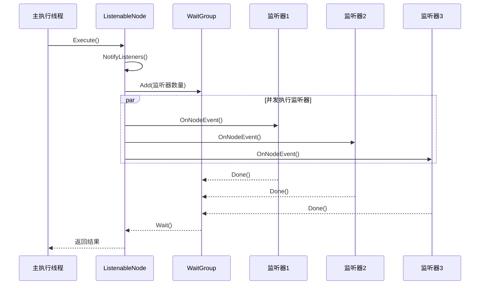

**图表来源**
- [listeners.go](file://graph/listeners.go#L127-L157)

### Panic 恢复机制

为了确保主执行流程的稳定性，监听器采用了完善的 panic 恢复机制：

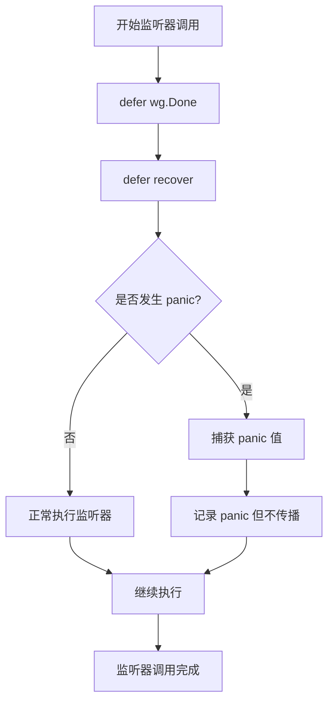

**图表来源**
- [listeners.go](file://graph/listeners.go#L140-L152)

**章节来源**
- [listeners.go](file://graph/listeners.go#L127-L157)

## 生命周期管理

### 监听器生命周期

事件监听器遵循明确的生命周期管理原则：

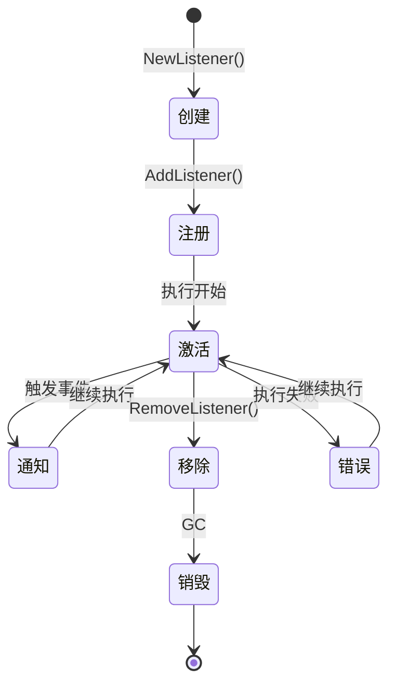

### 线程安全保证

所有监听器操作都通过互斥锁确保线程安全：

| 操作 | 锁类型 | 保护范围 |
|------|--------|----------|
| 添加监听器 | 写锁 | 修改监听器列表 |
| 移除监听器 | 写锁 | 修改监听器列表 |
| 获取监听器 | 读锁 | 访问监听器列表 |
| 通知监听器 | 读锁 | 访问监听器列表 |

**章节来源**
- [listeners.go](file://graph/listeners.go#L104-L125)
- [listeners.go](file://graph/listeners.go#L177-L185)

## 实践应用示例

### 基础监听器使用

以下展示了如何在实际项目中使用事件监听器：

#### 1. 基本监听器配置

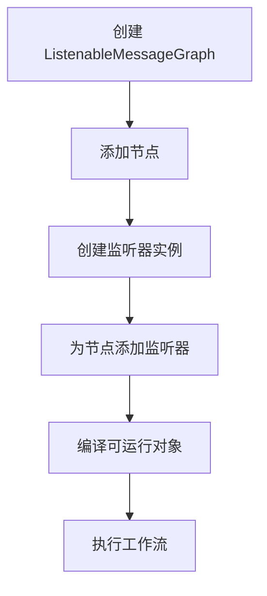

**图表来源**
- [main.go](file://examples/listeners/main.go#L12-L132)

#### 2. 多类型监听器组合

在复杂的工作流中，通常需要组合多种类型的监听器：

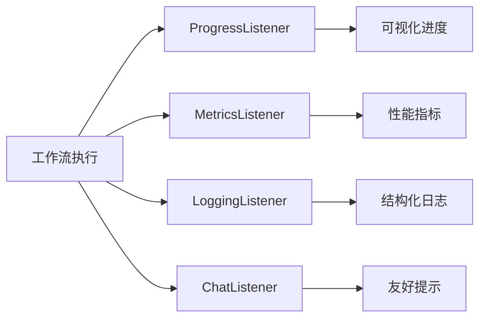

**图表来源**
- [main.go](file://examples/listeners/main.go#L15-L30)

#### 3. 全局监听器应用

对于大型系统，使用全局监听器可以简化配置：

**章节来源**
- [main.go](file://examples/listeners/main.go#L1-L132)

### 高级应用场景

#### 1. 分布式系统监控

在分布式环境中，监听器可以用于：
- 跨服务的执行链路追踪
- 性能瓶颈的识别和定位
- 异常情况的实时告警

#### 2. A/B 测试支持

通过监听器可以实现：
- 不同配置下的执行对比
- 性能指标的统计分析
- 用户体验的量化评估

#### 3. 调试和诊断

监听器在开发和调试阶段的作用：
- 详细的执行步骤跟踪
- 状态变化的实时监控
- 错误发生的精确定位

## 性能考虑

### 监听器性能影响

虽然监听器提供了强大的功能，但也可能对性能产生影响：

| 性能因素 | 影响程度 | 优化建议 |
|---------|----------|----------|
| 监听器数量 | 中等 | 控制同时激活的监听器数量 |
| 监听器复杂度 | 高 | 避免在监听器中执行耗时操作 |
| 并发数量 | 低 | 利用异步并发避免阻塞 |
| 数据序列化 | 中等 | 最小化传递的数据量 |

### 性能监控最佳实践

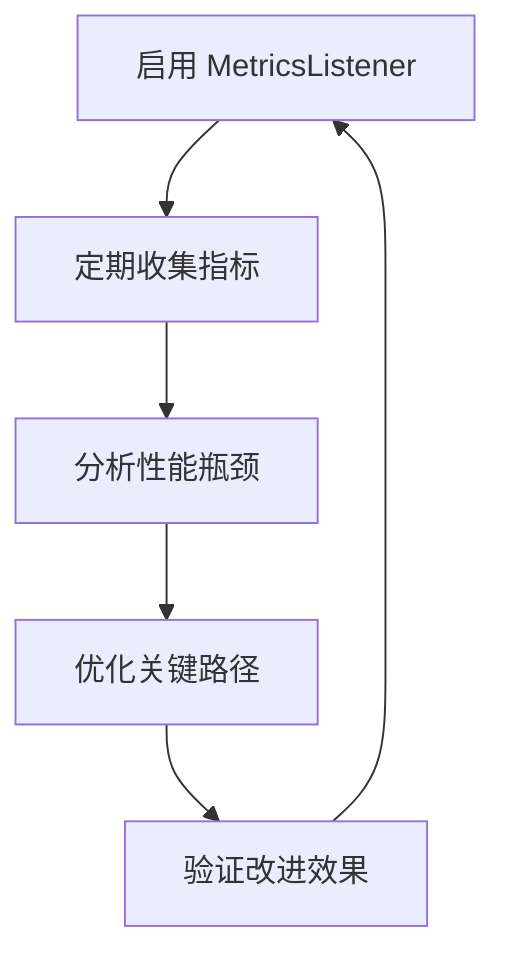

### 内存管理

监听器的内存使用需要注意：
- 监听器实例的生命周期管理
- 大状态对象的传递优化
- 缓存策略的合理使用

## 故障排除指南

### 常见问题及解决方案

#### 1. 监听器未被调用

**症状**：监听器的 `OnNodeEvent` 方法没有被触发

**可能原因**：
- 监听器未正确添加到节点
- 节点未被执行
- 监听器被意外移除

**解决方法**：
- 检查 `GetListeners()` 方法的返回值
- 确认节点确实被执行
- 验证监听器添加顺序

#### 2. 性能问题

**症状**：工作流执行变慢

**可能原因**：
- 监听器执行过于复杂
- 监听器数量过多
- 监听器阻塞了主流程

**解决方法**：
- 简化监听器逻辑
- 使用异步处理
- 减少不必要的监听器

#### 3. 内存泄漏

**症状**：长时间运行后内存持续增长

**可能原因**：
- 监听器持有大量状态数据
- 监听器未及时清理
- 循环引用导致 GC 无法回收

**解决方法**：
- 及时清理监听器持有的数据
- 避免循环引用
- 定期重置监听器状态

### 调试技巧

#### 1. 使用内置监听器进行调试

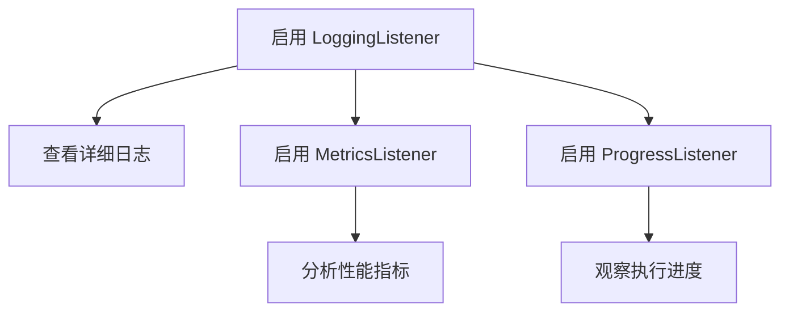

#### 2. 自定义监听器调试

创建专门的调试监听器来捕获特定信息：
- 执行时间测量
- 状态变化跟踪
- 错误堆栈分析

**章节来源**
- [listeners_test.go](file://graph/listeners_test.go#L371-L423)

## 总结

langgraphgo 的事件监听器机制是一个设计精良、功能完备的架构组件。它通过以下核心特性实现了强大的可观测性和控制能力：

### 核心优势

1. **模块化设计**：监听器接口清晰，易于扩展和定制
2. **异步执行**：确保监听器不会影响主执行流程
3. **容错性强**：完善的 panic 恢复机制保证系统稳定性
4. **性能优化**：并发执行和线程安全的设计
5. **功能丰富**：内置多种实用的监听器实现

### 应用价值

- **开发效率提升**：无需修改业务逻辑即可添加监控功能
- **运维能力增强**：提供全面的执行监控和诊断能力
- **质量保障**：帮助快速定位和解决问题
- **性能优化**：提供详细的性能指标和分析数据

### 最佳实践建议

1. **合理选择监听器类型**：根据具体需求选择合适的内置监听器
2. **控制监听器复杂度**：避免在监听器中执行耗时操作
3. **注意资源管理**：及时清理监听器持有的资源
4. **测试充分验证**：在生产环境使用前充分测试监听器行为

通过深入理解和正确使用事件监听器机制，开发者可以构建更加可观测、可维护和高性能的工作流系统。