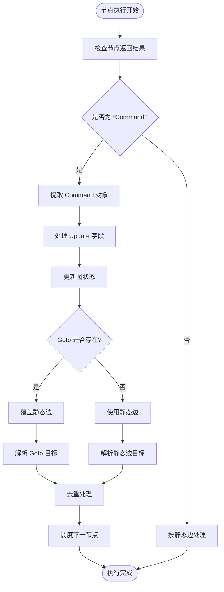
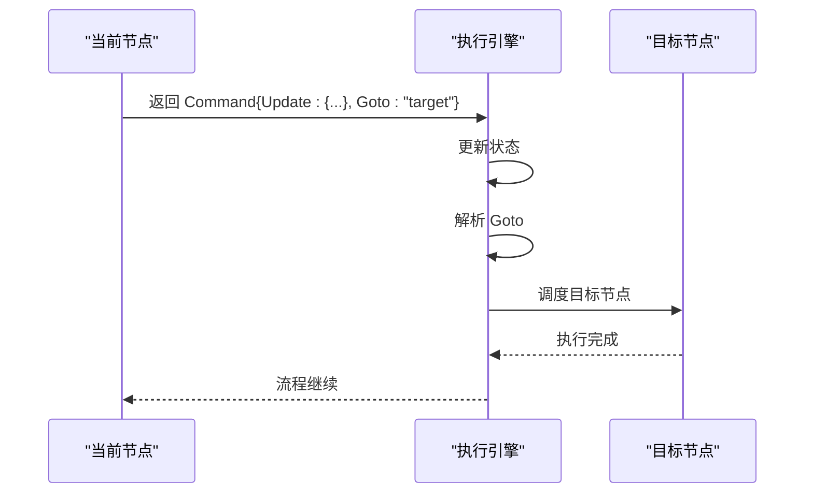
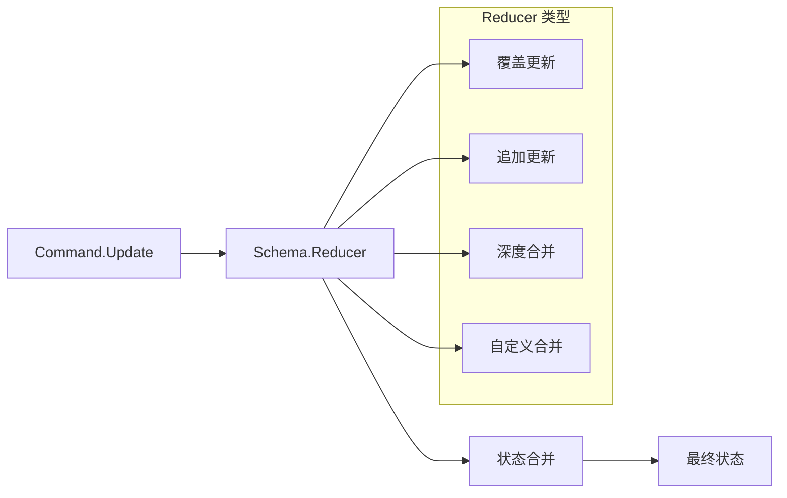
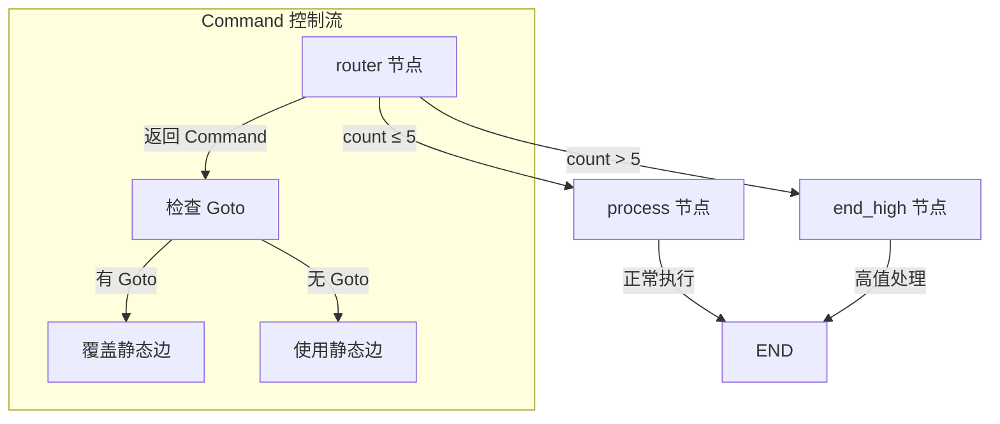
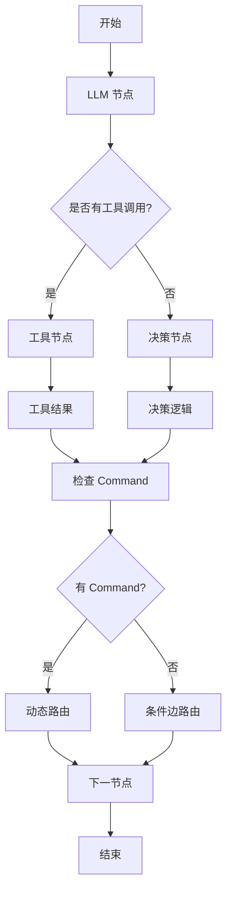
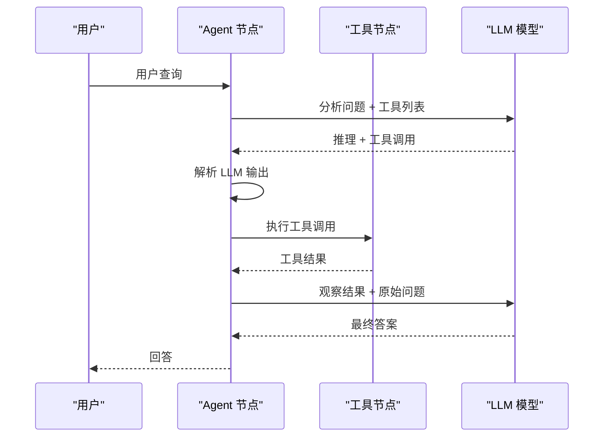
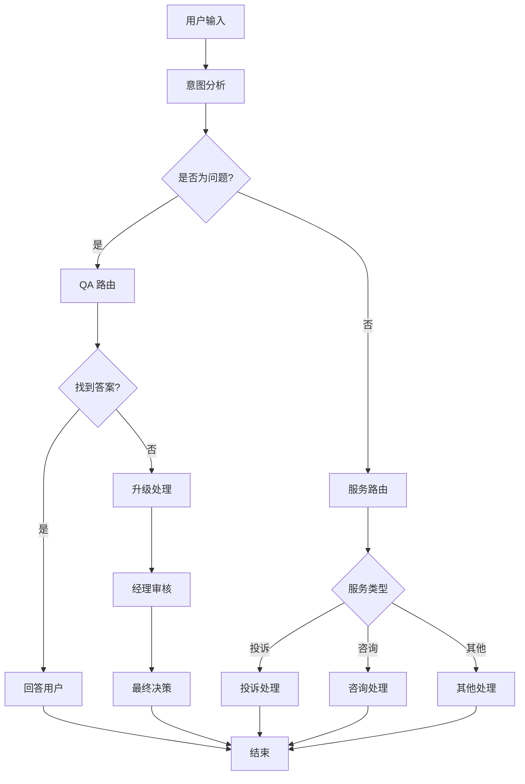
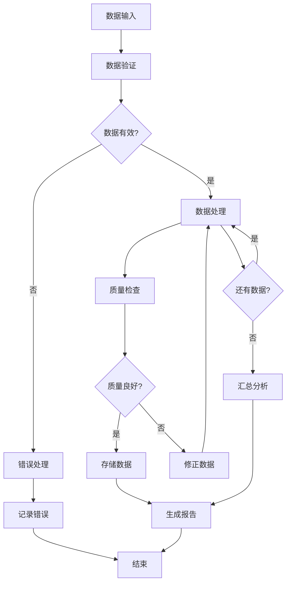
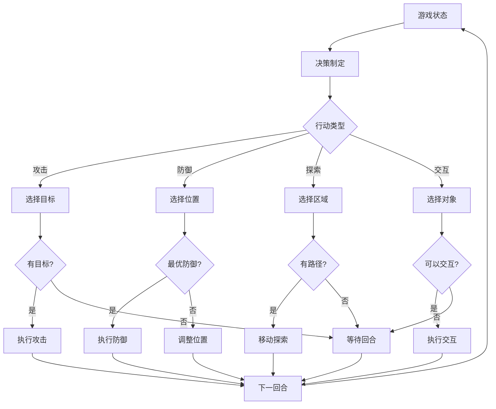

# 命令API与运行时控制

<cite>
**本文档中引用的文件**
- [graph/command.go](file://graph/command.go)
- [examples/command_api/main.go](file://examples/command_api/main.go)
- [examples/command_api/README.md](file://examples/command_api/README.md)
- [examples/command_api/README_CN.md](file://examples/command_api/README_CN.md)
- [graph/state_graph.go](file://graph/state_graph.go)
- [graph/graph.go](file://graph/graph.go)
- [graph/command_test.go](file://graph/command_test.go)
- [prebuilt/react_agent.go](file://prebuilt/react_agent.go)
- [examples/conditional_edges_example/main.go](file://examples/conditional_edges_example/main.go)
- [examples/react_agent/main.go](file://examples/react_agent/main.go)
</cite>

## 目录
1. [简介](#简介)
2. [Command 结构体概述](#command-结构体概述)
3. [核心字段详解](#核心字段详解)
4. [图执行流程中的 Command 处理](#图执行流程中的-command-处理)
5. [动态路由机制](#动态路由机制)
6. [状态更新与合并](#状态更新与合并)
7. [Command API 示例分析](#command-api-示例分析)
8. [与条件边的互补关系](#与条件边的互补关系)
9. [ReAct Agent 中的应用](#react-agent-中的应用)
10. [高级应用场景](#高级应用场景)
11. [最佳实践与注意事项](#最佳实践与注意事项)
12. [总结](#总结)

## 简介

在复杂的智能代理工作流中，静态的图定义（编译时定义的边）往往无法满足动态决策的需求。LangGraphGo 的 **Command API** 提供了一种强大的机制，允许节点在运行时动态控制流程流向，实现真正的动态路由和状态管理。这种机制使得代理能够根据 LLM 输出、工具调用结果或其他运行时条件做出灵活的决策。

Command API 的核心价值在于：
- **动态路由能力**：节点可以基于运行时状态决定下一步执行哪个节点
- **状态同步更新**：在改变流程的同时更新图状态
- **灵活性**：支持提前退出、跳过步骤、动态循环等复杂模式
- **与现有机制的无缝集成**：既保持向后兼容，又提供增强功能

## Command 结构体概述

Command 结构体是 Command API 的核心数据结构，它允许节点函数返回一个包含状态更新和流程控制指令的对象。

```mermaid
classDiagram
class Command {
+interface{} Update
+interface{} Goto
+NewCommand(update, goto) Command
+IsCommand(obj) bool
}
class StateGraph {
+ExecuteNode(node, state) interface{}
+ProcessCommand(cmd, state) interface{}
+ResolveNextNodes(currentNodes) []string
}
class NodeFunction {
+Execute(ctx, state) (interface{}, error)
}
Command --> StateGraph : "被处理"
NodeFunction --> Command : "返回"
StateGraph --> Command : "解析"
```

**图表来源**
- [graph/command.go](file://graph/command.go#L5-L14)
- [graph/state_graph.go](file://graph/state_graph.go#L225-L235)

**章节来源**
- [graph/command.go](file://graph/command.go#L1-L15)

## 核心字段详解

### Update 字段：状态更新机制

Update 字段允许节点在改变流程的同时更新图状态。这个字段可以是任何类型的数据，会被 Schema 的 Reducer 处理。

**主要特点：**
- **类型灵活**：可以是 map、struct、primitive 类型等
- **Schema 集成**：通过 Schema/Reducer 系统进行状态合并
- **增量更新**：支持部分状态更新而非完全替换

### Goto 字段：动态路由控制

Goto 字段是 Command API 的核心特性，它允许节点动态指定下一个要执行的节点。

**支持的格式：**
- **单个节点**：`"node_name"` (string 类型)
- **多个节点**：`[]string{"node1", "node2"}` (slice 类型)
- **动态计算**：可以在运行时根据状态动态确定目标节点

**优先级规则：**
- 当 Goto 存在时，会覆盖所有静态边定义
- 支持多节点并发执行（Fan-out）
- 自动去重，避免重复调度同一节点

**章节来源**
- [graph/command.go](file://graph/command.go#L6-L13)

## 图执行流程中的 Command 处理

Command API 在图执行流程中的处理遵循严格的优先级和顺序原则。



**图表来源**
- [graph/state_graph.go](file://graph/state_graph.go#L225-L268)
- [graph/graph.go](file://graph/graph.go#L393-L437)

### 执行阶段详解

#### 1. 结果类型检查
图执行引擎首先检查节点返回的结果类型：
- 如果是 `*Command` 类型，进入 Command 处理流程
- 否则按传统方式处理静态边

#### 2. Command 解析
提取 Command 对象的两个核心字段：
- **Update**：状态更新负载
- **Goto**：目标节点信息

#### 3. 状态更新
使用 Schema/Reducer 系统将 Update 字段合并到当前状态中：
- 应用 Reducer 函数进行状态合并
- 支持深度嵌套对象的增量更新
- 维护状态的一致性和完整性

#### 4. 路由决策
根据 Goto 字段的内容决定下一节点：
- 单个字符串：直接调度该节点
- 字符串切片：并发调度多个节点
- 空值：使用静态边定义

**章节来源**
- [graph/state_graph.go](file://graph/state_graph.go#L225-L268)
- [graph/graph.go](file://graph/graph.go#L393-L437)

## 动态路由机制

动态路由是 Command API 最强大的功能之一，它允许节点根据运行时条件做出智能决策。

### 基本路由模式



**图表来源**
- [examples/command_api/main.go](file://examples/command_api/main.go#L27-L40)

### 高级路由策略

#### 条件路由
基于状态条件选择不同路径：
- 数值比较：`if count > threshold { goto "high" }`
- 文本匹配：`if contains(query, "urgent") { goto "priority" }`
- 复合条件：结合多个状态变量进行决策

#### 动态选择
根据运行时计算结果确定目标：
- 工具调用结果：`if toolResult.success { goto "success" }`
- LLM 输出分析：`if contains(response, "tool:") { goto "execute_tool" }`
- 外部服务响应：`if serviceStatus.available { goto "primary" }`

#### 循环控制
实现动态循环和终止：
- 条件终止：`if iterationCount >= maxIterations { goto END }`
- 状态驱动循环：`if !hasWorkToDo() { goto END }`
- 异常处理：`if errorOccurred() { goto "recovery" }`

**章节来源**
- [examples/command_api/main.go](file://examples/command_api/main.go#L23-L40)

## 状态更新与合并

Command API 的状态更新机制与传统的静态边更新有着本质的区别。

### 更新策略对比

| 特性 | 静态边更新 | Command Update |
|------|------------|----------------|
| 触发时机 | 节点执行完成后 | 节点执行时 |
| 更新范围 | 整个节点输出 | 指定字段更新 |
| 合并策略 | 替换整个状态 | 增量合并 |
| 性能影响 | 较大（全量复制） | 较小（增量更新） |

### Schema 集成机制



**图表来源**
- [graph/state_graph.go](file://graph/state_graph.go#L369-L376)

### 合并算法

状态合并采用分层算法确保数据一致性：

1. **浅层合并**：基本类型和简单对象的直接替换
2. **深层合并**：嵌套对象的递归合并
3. **数组处理**：根据 Reducer 类型决定是替换还是追加
4. **冲突解决**：优先级规则和合并策略

**章节来源**
- [graph/state_graph.go](file://graph/state_graph.go#L369-L376)
- [graph/graph.go](file://graph/graph.go#L369-L376)

## Command API 示例分析

让我们深入分析 command_api 示例，理解 Command API 的实际应用。

### 示例架构



**图表来源**
- [examples/command_api/main.go](file://examples/command_api/main.go#L15-L56)

### 关键实现细节

#### 路由节点逻辑
路由器节点展示了 Command API 的核心用法：

```go
// 检查状态条件
if count > 5 {
    // 动态跳转：跳过 process 直接到 end_high
    return &graph.Command{
        Update: map[string]interface{}{"status": "high"},
        Goto:   "end_high",
    }, nil
}

// 正常流程：更新状态并让静态边处理
return &graph.Command{
    Update: map[string]interface{}{"status": "normal"},
    Goto:   "process",
}, nil
```

#### 执行效果分析
- **Case 1 (count=3)**：正常流程，经过 router → process → END
- **Case 2 (count=10)**：动态跳转，经过 router → end_high → END

这种设计的优势：
- **灵活性**：无需为每个分支添加静态边
- **可维护性**：逻辑集中在一个节点中
- **性能**：避免不必要的节点执行

**章节来源**
- [examples/command_api/main.go](file://examples/command_api/main.go#L23-L40)

## 与条件边的互补关系

Command API 和条件边（Conditional Edges）在功能上存在互补关系，共同构成了 LangGraphGo 的完整路由体系。

### 功能对比

| 特性 | Command API | 条件边 |
|------|-------------|--------|
| 决策时机 | 运行时节点内 | 节点间转换时 |
| 决策依据 | 节点内部逻辑 | 状态内容分析 |
| 实现位置 | 节点函数中 | 图定义中 |
| 性能开销 | 较低 | 中等 |
| 灵活性 | 极高 | 高 |

### 使用场景建议

#### 适合使用 Command API 的场景
- **LLM 决策**：根据 LLM 输出内容动态路由
- **工具调用结果**：基于工具执行结果选择后续步骤
- **复杂业务逻辑**：需要在节点内进行复杂条件判断
- **动态循环**：实现运行时可变的循环结构

#### 适合使用条件边的场景
- **简单状态判断**：基于状态字段的简单条件
- **预定义路由**：固定的路由规则
- **性能敏感**：对执行效率要求较高的场景
- **清晰的业务流程**：业务逻辑相对固定的场景

### 混合使用模式



**图表来源**
- [prebuilt/react_agent.go](file://prebuilt/react_agent.go#L159-L176)

**章节来源**
- [examples/conditional_edges_example/main.go](file://examples/conditional_edges_example/main.go#L159-L176)
- [prebuilt/react_agent.go](file://prebuilt/react_agent.go#L159-L176)

## ReAct Agent 中的应用

ReAct Agent 是 Command API 的典型应用场景，展示了如何在智能代理中实现推理与行动的循环。

### ReAct 工作流程



**图表来源**
- [prebuilt/react_agent.go](file://prebuilt/react_agent.go#L28-L94)

### Command API 在 ReAct 中的作用

#### 条件路由实现
ReAct Agent 使用条件边实现推理与行动的切换：

```go
workflow.AddConditionalEdge("agent", func(ctx context.Context, state interface{}) string {
    mState := state.(map[string]interface{})
    messages := mState["messages"].([]llms.MessageContent)
    lastMsg := messages[len(messages)-1]
    
    hasToolCalls := false
    for _, part := range lastMsg.Parts {
        if _, ok := part.(llms.ToolCall); ok {
            hasToolCalls = true
            break
        }
    }
    
    if hasToolCalls {
        return "tools"  // 路由到工具节点
    }
    return graph.END    // 结束执行
})
```

#### 动态决策支持
Command API 可以进一步增强 ReAct Agent 的能力：

```go
// 示例：基于工具结果的动态路由
workflow.AddNode("decision", func(ctx context.Context, state interface{}) (interface{}, error) {
    // 分析工具结果
    if toolResult.Success {
        // 根据结果决定下一步
        if shouldContinue(toolResult) {
            return &graph.Command{
                Update: map[string]interface{}{"step": "continue"},
                Goto:   "agent",  // 继续推理循环
            }, nil
        }
        return &graph.Command{
            Update: map[string]interface{}{"step": "complete"},
            Goto:   graph.END,  // 完成任务
        }, nil
    }
    
    // 处理错误情况
    return &graph.Command{
        Update: map[string]interface{}{"step": "retry"},
        Goto:   "agent",  // 重新尝试
    }, nil
})
```

**章节来源**
- [prebuilt/react_agent.go](file://prebuilt/react_agent.go#L159-L176)
- [examples/react_agent/main.go](file://examples/react_agent/main.go#L96-L121)

## 高级应用场景

### 1. 智能客服系统



### 2. 数据处理流水线



### 3. 游戏 AI 系统



## 最佳实践与注意事项

### 1. 性能优化建议

#### 避免过度使用 Command
- **适度使用**：仅在必要时使用 Command API
- **批量操作**：尽量减少频繁的状态更新
- **缓存策略**：对重复计算的结果进行缓存

#### 优化状态更新
```go
// 不推荐：频繁的小更新
return &graph.Command{
    Update: map[string]interface{}{"step": i},
    Goto:   "next",
}, nil

// 推荐：批量更新
updates := make(map[string]interface{})
for i := 0; i < 100; i++ {
    updates[fmt.Sprintf("data_%d", i)] = processData(i)
}
return &graph.Command{
    Update: updates,
    Goto:   "next",
}, nil
```

### 2. 错误处理策略

#### Command 验证
```go
func validateCommand(cmd *graph.Command) error {
    if cmd.Goto != nil {
        switch v := cmd.Goto.(type) {
        case string:
            if v == "" {
                return fmt.Errorf("goto cannot be empty string")
            }
        case []string:
            if len(v) == 0 {
                return fmt.Errorf("goto slice cannot be empty")
            }
            for _, node := range v {
                if node == "" {
                    return fmt.Errorf("goto slice contains empty node name")
                }
            }
        default:
            return fmt.Errorf("invalid goto type: %T", v)
        }
    }
    return nil
}
```

#### 异常恢复
```go
func robustNode(ctx context.Context, state interface{}) (interface{}, error) {
    defer func() {
        if r := recover(); r != nil {
            log.Printf("Node panic recovered: %v", r)
        }
    }()
    
    // 节点逻辑
    result, err := expensiveOperation(state)
    if err != nil {
        return &graph.Command{
            Update: map[string]interface{}{"error": err.Error()},
            Goto:   "error_handler",
        }, nil
    }
    
    return result, nil
}
```

### 3. 调试与监控

#### Command 执行跟踪
```go
func tracedNode(ctx context.Context, state interface{}) (interface{}, error) {
    start := time.Now()
    defer func() {
        duration := time.Since(start)
        log.Printf("Node execution time: %v", duration)
    }()
    
    result, err := originalNode(ctx, state)
    if err != nil {
        return nil, err
    }
    
    if cmd, ok := result.(*graph.Command); ok {
        log.Printf("Command issued: Update=%v, Goto=%v", 
            cmd.Update, cmd.Goto)
    }
    
    return result, nil
}
```

#### 状态变更日志
```go
func loggingNode(ctx context.Context, state interface{}) (interface{}, error) {
    oldState := cloneState(state)
    
    result, err := originalNode(ctx, state)
    if err != nil {
        return nil, err
    }
    
    newState := extractFinalState(result)
    diff := compareStates(oldState, newState)
    
    if len(diff) > 0 {
        log.Printf("State changed: %v", diff)
    }
    
    return result, nil
}
```

### 4. 安全考虑

#### 输入验证
```go
func secureNode(ctx context.Context, state interface{}) (interface{}, error) {
    // 验证输入状态
    if err := validateState(state); err != nil {
        return nil, fmt.Errorf("invalid state: %w", err)
    }
    
    // 限制 Command 大小
    const maxSize = 1024 * 1024 // 1MB
    if size := estimateSize(state); size > maxSize {
        return nil, fmt.Errorf("state too large: %d bytes", size)
    }
    
    return originalNode(ctx, state)
}
```

#### 访问控制
```go
func authorizedNode(ctx context.Context, state interface{}) (interface{}, error) {
    user := getUserFromContext(ctx)
    if !hasPermission(user, "execute_node") {
        return &graph.Command{
            Update: map[string]interface{}{"access_denied": true},
            Goto:   "security_handler",
        }, nil
    }
    
    return originalNode(ctx, state)
}
```

## 总结

Command API 是 LangGraphGo 中一个革命性的功能，它彻底改变了传统图执行的方式。通过将控制流决策权交给节点函数，Command API 实现了真正意义上的动态工作流。

### 核心优势

1. **动态性**：节点可以根据运行时状态做出智能决策
2. **灵活性**：支持复杂的路由模式和状态更新策略
3. **性能**：相比条件边具有更好的执行效率
4. **简洁性**：减少了图定义的复杂度和维护成本

### 应用价值

- **智能代理**：ReAct Agent、对话系统、客服机器人
- **数据处理**：复杂的数据流水线、ETL 系统
- **业务流程**：动态业务规则、智能审批系统
- **游戏开发**：复杂的游戏 AI、剧情系统

### 发展趋势

随着 AI 技术的发展，Command API 将在以下方面发挥更大作用：
- **多模态处理**：结合视觉、语音等多种输入形式
- **实时决策**：基于流式数据的实时路由
- **自适应学习**：根据历史执行记录优化路由策略
- **分布式执行**：支持大规模分布式工作流

Command API 不仅仅是一个技术特性，更是构建下一代智能系统的基础设施。它为开发者提供了前所未有的控制力和灵活性，使得复杂的智能代理成为可能。