# 监听器与事件系统

<cite>
**本文档中引用的文件**
- [graph/listeners.go](file://graph/listeners.go)
- [graph/builtin_listeners.go](file://graph/builtin_listeners.go)
- [graph/command.go](file://graph/command.go)
- [graph/schema.go](file://graph/schema.go)
- [graph/callbacks.go](file://graph/callbacks.go)
- [graph/state_graph.go](file://graph/state_graph.go)
- [examples/listeners/main.go](file://examples/listeners/main.go)
- [examples/command_api/main.go](file://examples/command_api/main.go)
- [examples/ephemeral_channels/main.go](file://examples/ephemeral_channels/main.go)
- [graph/listeners_test.go](file://graph/listeners_test.go)
- [graph/command_test.go](file://graph/command_test.go)
</cite>

## 目录
1. [简介](#简介)
2. [项目结构概览](#项目结构概览)
3. [监听器核心架构](#监听器核心架构)
4. [事件类型与生命周期](#事件类型与生命周期)
5. [内置监听器实现](#内置监听器实现)
6. [命令 API 系统](#命令-api系统)
7. [临时通道机制](#临时通道机制)
8. [事件驱动架构实现](#事件驱动架构实现)
9. [异步执行模型](#异步执行模型)
10. [错误处理策略](#错误处理策略)
11. [性能优化考虑](#性能优化考虑)
12. [最佳实践指南](#最佳实践指南)
13. [总结](#总结)

## 简介

langgraphgo 的事件监听器与事件系统是一个高度灵活且强大的架构组件，它为图执行提供了细粒度的监控、控制和状态管理能力。该系统通过监听器模式实现了事件驱动的架构，支持动态流程控制、临时状态管理以及复杂的监控需求。

核心特性包括：
- **多类型事件支持**：覆盖节点执行、工具调用、LLM交互等各个阶段
- **异步执行模型**：确保监听器不会阻塞主执行流程
- **灵活的命令 API**：允许节点动态控制流程走向
- **临时通道机制**：自动管理短期状态数据的生命周期
- **内置监听器套件**：提供进度跟踪、指标收集、日志记录等功能

## 项目结构概览

事件监听器系统的核心文件组织如下：

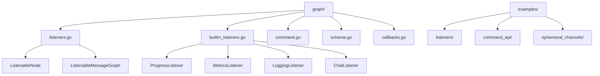

**图表来源**
- [graph/listeners.go](file://graph/listeners.go#L1-L50)
- [graph/builtin_listeners.go](file://graph/builtin_listeners.go#L1-L50)

## 监听器核心架构

### 基础接口设计

监听器系统基于清晰的接口层次结构构建：

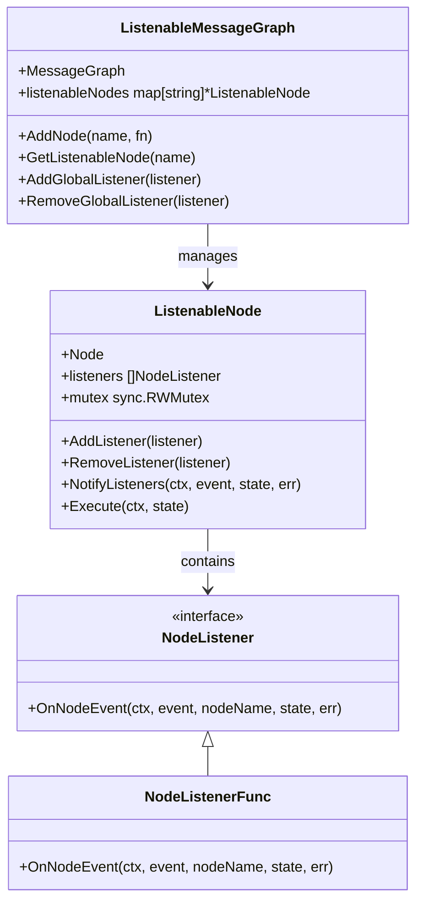

**图表来源**
- [graph/listeners.go](file://graph/listeners.go#L51-L104)
- [graph/listeners.go](file://graph/listeners.go#L89-L120)

### 监听器注册机制

监听器可以通过多种方式进行注册：

1. **节点级注册**：为特定节点添加监听器
2. **全局注册**：为整个图的所有节点添加监听器
3. **函数式注册**：使用 NodeListenerFunc 类型简化监听器定义

**章节来源**
- [graph/listeners.go](file://graph/listeners.go#L104-L125)
- [examples/listeners/main.go](file://examples/listeners/main.go#L50-L64)

## 事件类型与生命周期

### 支持的事件类型

系统定义了丰富的事件类型来覆盖各种执行阶段：

| 事件类型 | 描述 | 触发时机 |
|---------|------|----------|
| `NodeEventStart` | 节点开始执行 | 节点函数调用前 |
| `NodeEventProgress` | 执行进度更新 | 节点执行过程中的任意时刻 |
| `NodeEventComplete` | 节点成功完成 | 节点函数正常返回 |
| `NodeEventError` | 节点执行出错 | 节点函数返回错误 |
| `EventChainStart` | 图执行开始 | 整体图执行启动时 |
| `EventChainEnd` | 图执行结束 | 整体图执行完成时 |
| `EventToolStart` | 工具调用开始 | 外部工具被调用前 |
| `EventToolEnd` | 工具调用结束 | 外部工具调用完成后 |
| `EventLLMStart` | LLM调用开始 | 大语言模型调用前 |
| `EventLLMEnd` | LLM调用结束 | 大语言模型调用完成后 |
| `EventToken` | 流式输出标记 | 流式响应生成标记时 |
| `EventCustom` | 自定义事件 | 用户自定义事件类型 |

### 事件生命周期流程

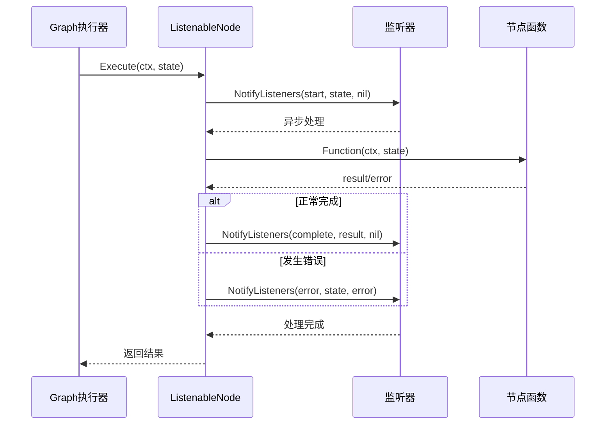

**图表来源**
- [graph/listeners.go](file://graph/listeners.go#L159-L174)
- [graph/listeners.go](file://graph/listeners.go#L128-L156)

**章节来源**
- [graph/listeners.go](file://graph/listeners.go#L10-L48)

## 内置监听器实现

### ProgressListener - 进度跟踪监听器

ProgressListener 提供直观的进度显示功能：

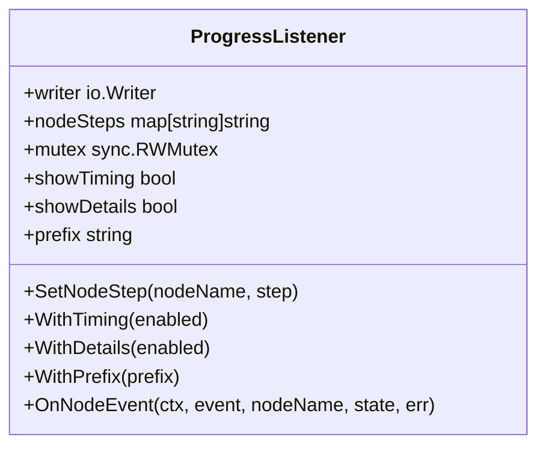

**图表来源**
- [graph/builtin_listeners.go](file://graph/builtin_listeners.go#L14-L31)

### MetricsListener - 性能指标监听器

MetricsListener 收集详细的执行统计信息：

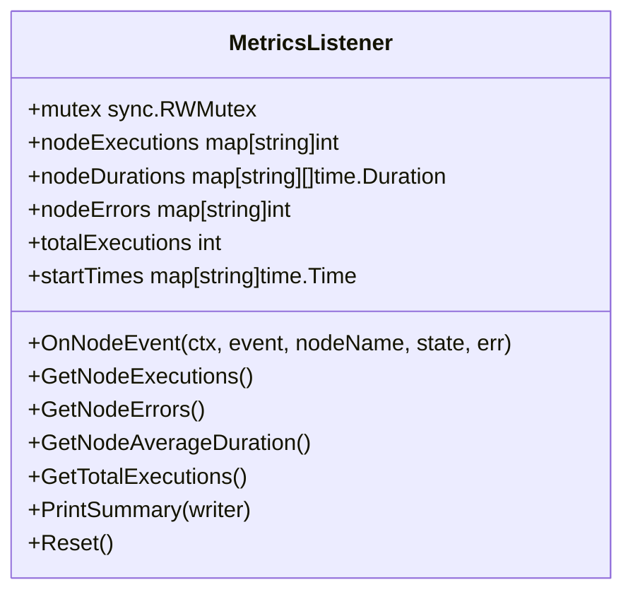

**图表来源**
- [graph/builtin_listeners.go](file://graph/builtin_listeners.go#L202-L220)

### LoggingListener - 结构化日志监听器

提供分级日志记录功能：

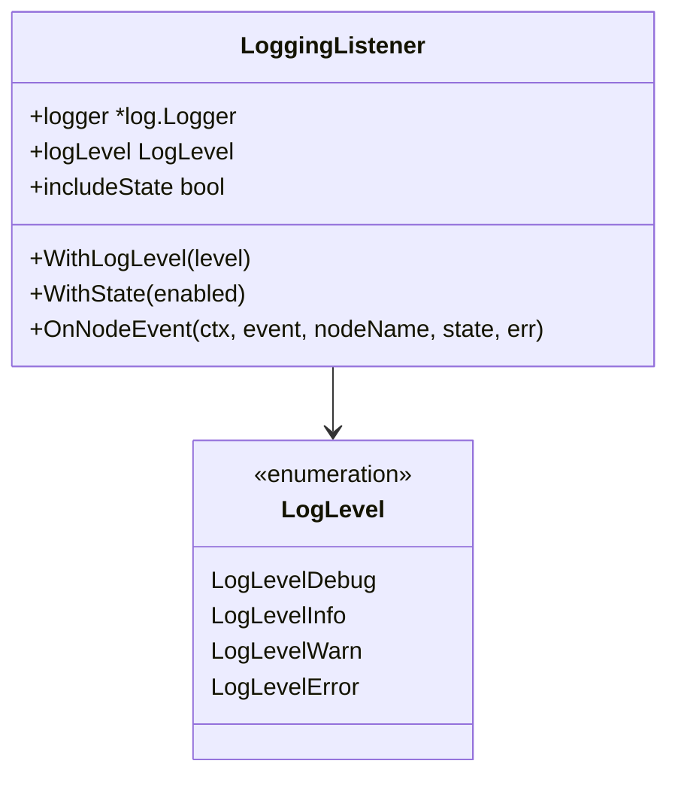

**图表来源**
- [graph/builtin_listeners.go](file://graph/builtin_listeners.go#L118-L141)
- [graph/builtin_listeners.go](file://graph/builtin_listeners.go#L125-L133)

### ChatListener - 实时聊天风格监听器

提供友好的用户交互体验：

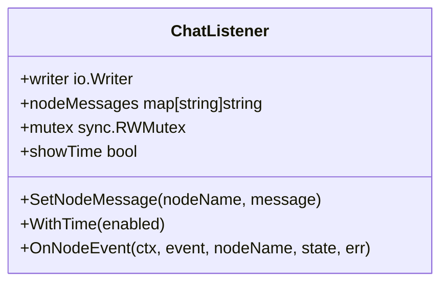

**图表来源**
- [graph/builtin_listeners.go](file://graph/builtin_listeners.go#L353-L361)

**章节来源**
- [graph/builtin_listeners.go](file://graph/builtin_listeners.go#L14-L433)

## 命令 API 系统

### Command 结构设计

Command API 允许节点动态控制执行流程：

```mermaid
classDiagram
class Command {
+Update interface{}
+Goto interface{}
}
note for Command "Update : 更新状态的值<br/>Goto : 下一个节点或节点列表<br/>支持单个字符串或[]string"
```

**图表来源**
- [graph/command.go](file://graph/command.go#L4-L14)

### 动态流程控制机制

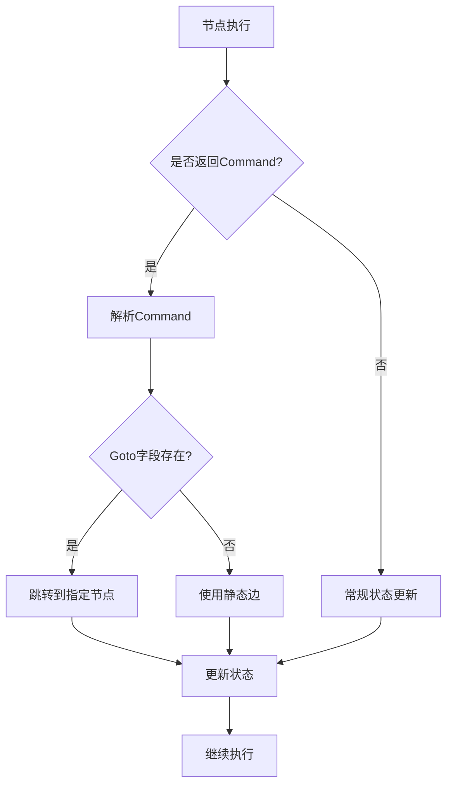

**图表来源**
- [graph/state_graph.go](file://graph/state_graph.go#L177-L199)

### 命令使用示例

命令 API 的典型使用场景包括：

1. **条件路由**：根据状态动态选择执行路径
2. **快速退出**：在满足特定条件时提前终止流程
3. **状态重置**：清空或重置某些状态字段
4. **多分支执行**：同时执行多个后续节点

**章节来源**
- [graph/command.go](file://graph/command.go#L1-L15)
- [examples/command_api/main.go](file://examples/command_api/main.go#L22-L38)

## 临时通道机制

### 临时通道概念

临时通道（Ephemeral Channels）是一种特殊的通道类型，用于管理那些只需要在短时间内存在的状态数据：

```mermaid
classDiagram
class StateSchema {
<<interface>>
+Init() interface{}
+Update(current, new) (interface{}, error)
}
class CleaningStateSchema {
<<interface>>
+Cleanup(state) interface{}
}
class MapSchema {
+Reducers map[string]Reducer
+EphemeralKeys map[string]bool
+RegisterChannel(key, reducer, isEphemeral)
+Cleanup(state) interface{}
}
StateSchema <|-- CleaningStateSchema
CleaningStateSchema <|.. MapSchema
```

**图表来源**
- [graph/schema.go](file://graph/schema.go#L12-L27)
- [graph/schema.go](file://graph/schema.go#L29-L42)

### 生命周期管理

临时通道的生命周期遵循以下规则：

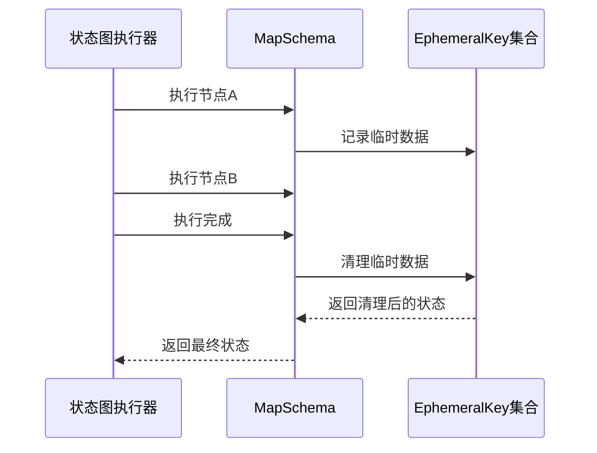

**图表来源**
- [graph/schema.go](file://graph/schema.go#L102-L136)

### 使用场景

临时通道适用于以下场景：

1. **中间计算结果**：避免污染长期状态
2. **临时标志位**：控制流程但不持久化
3. **调试信息**：仅在当前步骤有用的诊断数据
4. **临时缓存**：加速计算但不需要持久化的中间结果

**章节来源**
- [graph/schema.go](file://graph/schema.go#L29-L136)
- [examples/ephemeral_channels/main.go](file://examples/ephemeral_channels/main.go#L1-L75)

## 事件驱动架构实现

### 架构概览

langgraphgo 的事件驱动架构采用分层设计：

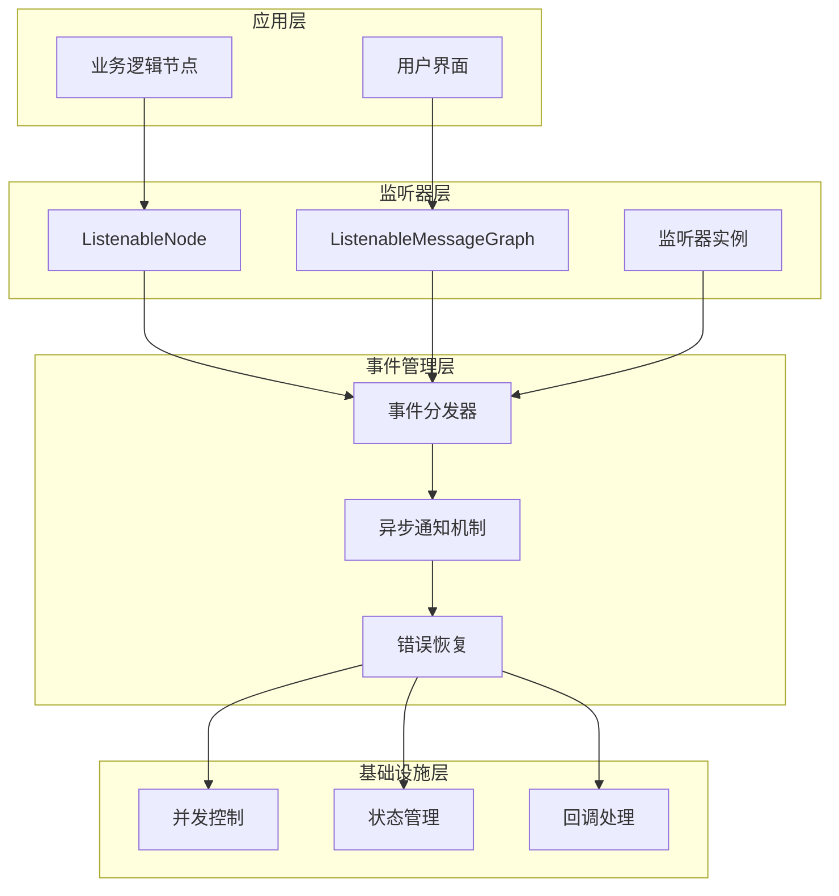

**图表来源**
- [graph/listeners.go](file://graph/listeners.go#L89-L120)
- [graph/listeners.go](file://graph/listeners.go#L159-L174)

### 监听器与主执行的隔离

系统通过以下机制确保监听器与主执行流程的完全隔离：

1. **异步执行**：监听器在独立的 goroutine 中执行
2. **错误隔离**：监听器的 panic 不会影响主流程
3. **上下文传递**：保持执行上下文的一致性
4. **状态保护**：监听器不能修改正在执行的状态

**章节来源**
- [graph/listeners.go](file://graph/listeners.go#L134-L156)

## 异步执行模型

### 并发控制机制

监听器系统采用 WaitGroup 来协调异步执行：

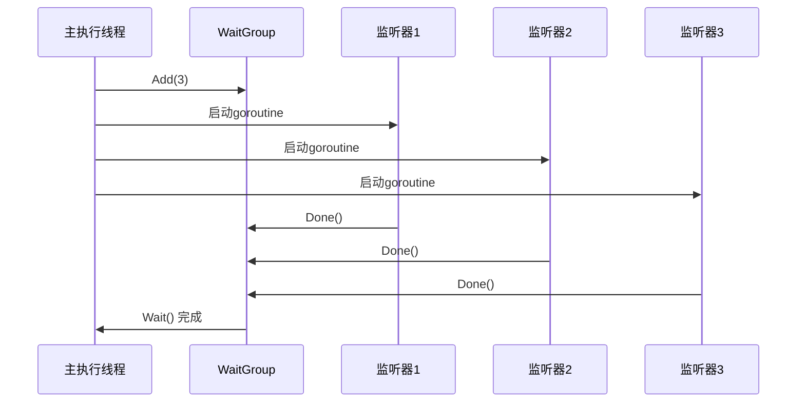

**图表来源**
- [graph/listeners.go](file://graph/listeners.go#L134-L156)

### 错误恢复机制

系统实现了完善的错误恢复策略：

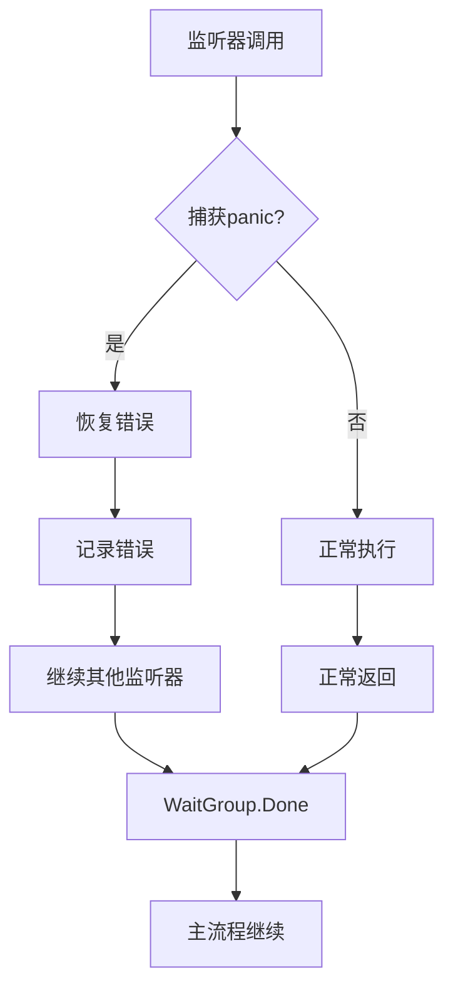

**图表来源**
- [graph/listeners.go](file://graph/listeners.go#L143-L148)

**章节来源**
- [graph/listeners.go](file://graph/listeners.go#L134-L156)

## 错误处理策略

### 分层错误处理

系统采用分层的错误处理策略：

1. **监听器级别**：每个监听器独立处理自己的错误
2. **节点级别**：监听器错误不影响节点执行
3. **图级别**：主流程只关注关键错误

### 恢复机制

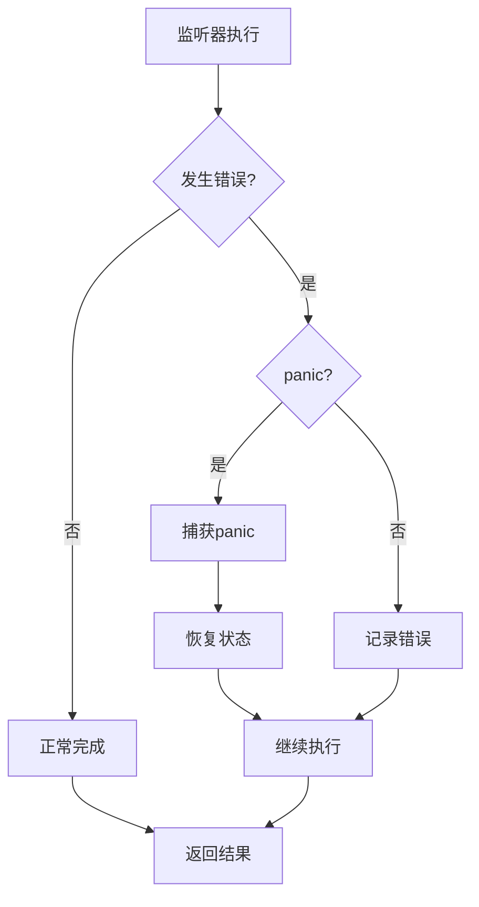

**图表来源**
- [graph/listeners.go](file://graph/listeners.go#L143-L148)

**章节来源**
- [graph/listeners.go](file://graph/listeners.go#L143-L148)

## 性能优化考虑

### 监听器性能优化

1. **批量通知**：一次性通知所有监听器，避免多次锁竞争
2. **异步执行**：不阻塞主执行流程
3. **内存池化**：重用事件对象减少 GC 压力
4. **条件过滤**：根据事件类型选择性通知监听器

### 内存管理

临时通道的清理机制确保内存使用的可控性：

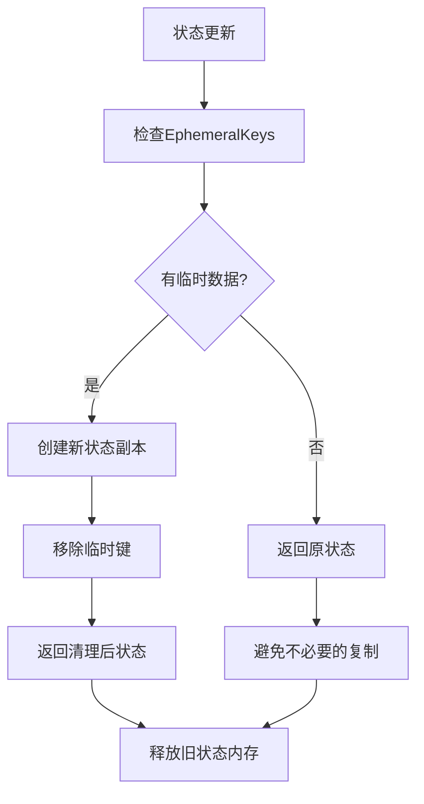

**图表来源**
- [graph/schema.go](file://graph/schema.go#L102-L136)

**章节来源**
- [graph/schema.go](file://graph/schema.go#L102-L136)

## 最佳实践指南

### 监听器开发最佳实践

1. **轻量级设计**：监听器应该快速执行，避免长时间阻塞
2. **无副作用**：监听器不应该修改传入的状态参数
3. **错误安全**：妥善处理可能的错误情况
4. **上下文感知**：正确使用传入的 context 参数

### 命令 API 使用指南

1. **明确意图**：Command 的使用应该有明确的目的
2. **状态一致性**：确保 Update 和 Goto 的组合不会导致状态不一致
3. **边界检查**：验证目标节点的存在性和有效性
4. **性能考虑**：避免在 Command 中进行复杂的计算

### 临时通道使用建议

1. **合理分类**：只有真正需要临时性的数据才使用临时通道
2. **命名规范**：使用清晰的命名来标识临时数据
3. **生命周期理解**：清楚了解临时通道的清理时机
4. **调试辅助**：可以作为调试工具但不要依赖其进行业务逻辑

### 监控与调试

推荐的监控策略：

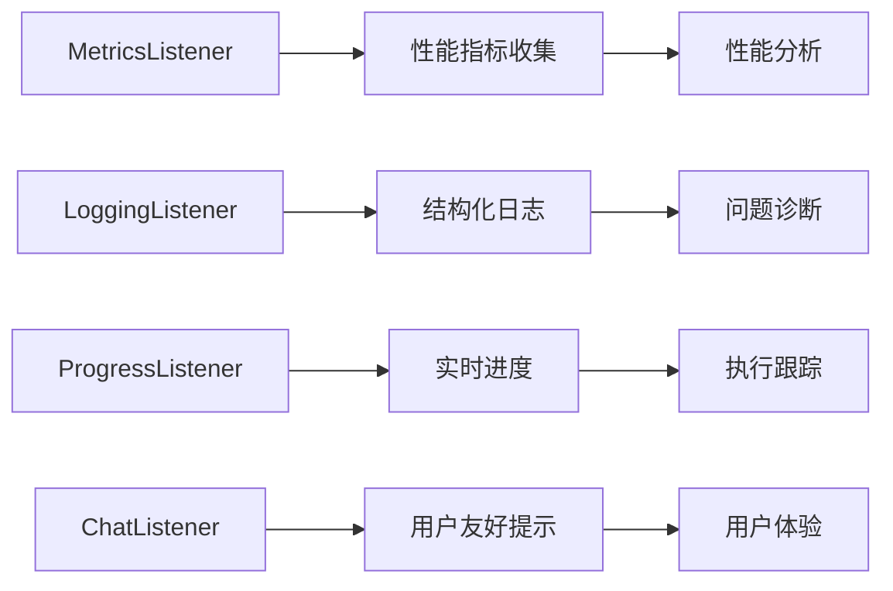

**章节来源**
- [examples/listeners/main.go](file://examples/listeners/main.go#L15-L64)
- [examples/command_api/main.go](file://examples/command_api/main.go#L14-L72)
- [examples/ephemeral_channels/main.go](file://examples/ephemeral_channels/main.go#L14-L74)

## 总结

langgraphgo 的事件监听器与事件系统提供了一个完整而强大的框架，用于构建可观察、可控制和可扩展的图执行环境。该系统的主要优势包括：

### 核心价值

1. **可观测性**：通过丰富的事件类型和内置监听器，提供全面的执行监控
2. **灵活性**：命令 API 允许动态流程控制，适应复杂的业务需求
3. **可维护性**：模块化的监听器设计使得功能扩展变得简单
4. **可靠性**：完善的错误处理和恢复机制确保系统稳定性

### 技术创新

- **异步事件处理**：确保监听器不会影响主执行流程
- **生命周期管理**：自动化的临时状态清理
- **分层架构**：清晰的职责分离和良好的扩展性
- **类型安全**：强类型的事件系统和命令 API

### 应用前景

该事件系统不仅适用于传统的图执行场景，还可以扩展到：
- 实时协作系统
- 动态工作流管理
- 智能代理系统
- 数据处理管道

通过深入理解和正确使用这些机制，开发者可以构建出既强大又优雅的事件驱动应用程序。