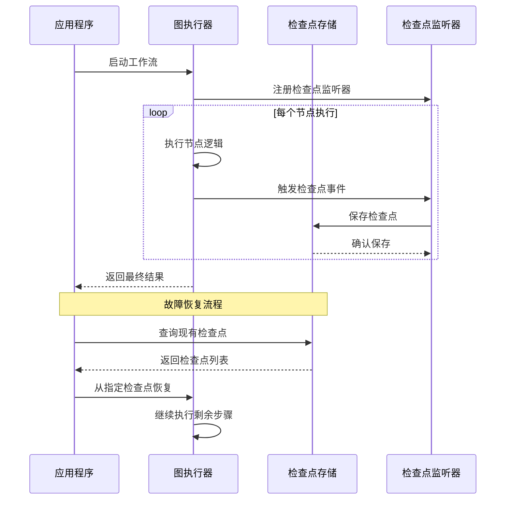
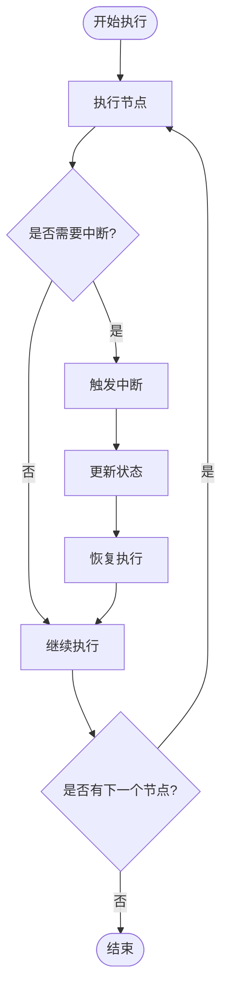
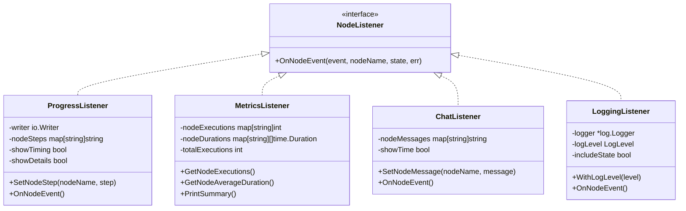
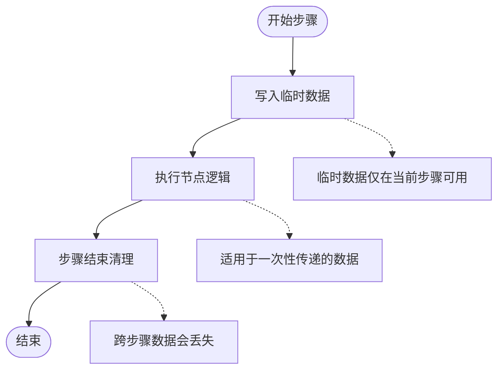
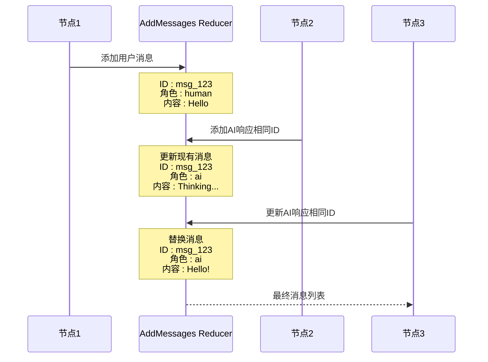
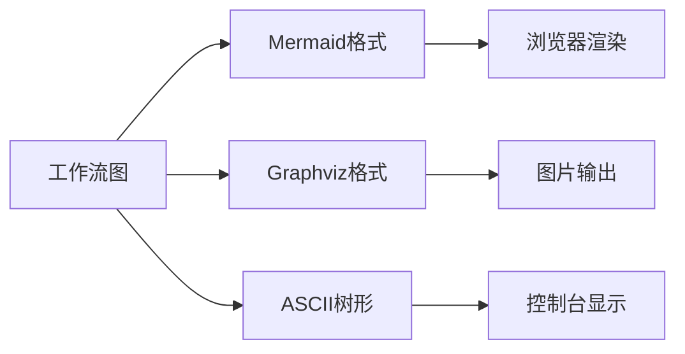
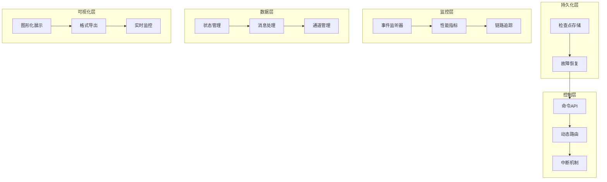

# 高级特性示例

<cite>
**本文档中引用的文件**
- [examples/durable_execution/main.go](file://examples/durable_execution/main.go)
- [examples/time_travel/main.go](file://examples/time_travel/main.go)
- [examples/listeners/main.go](file://examples/listeners/main.go)
- [examples/command_api/main.go](file://examples/command_api/main.go)
- [examples/ephemeral_channels/main.go](file://examples/ephemeral_channels/main.go)
- [examples/smart_messages/main.go](file://examples/smart_messages/main.go)
- [examples/visualization/main.go](file://examples/visualization/main.go)
- [examples/checkpointing/main.go](file://examples/checkpointing/main.go)
- [graph/checkpointing.go](file://graph/checkpointing.go)
- [graph/listeners.go](file://graph/listeners.go)
- [graph/command.go](file://graph/command.go)
- [graph/state_graph.go](file://graph/state_graph.go)
- [graph/visualization.go](file://graph/visualization.go)
- [graph/builtin_listeners.go](file://graph/builtin_listeners.go)
- [graph/callbacks.go](file://graph/callbacks.go)
</cite>

## 目录
1. [简介](#简介)
2. [持久化执行保障机制](#持久化执行保障机制)
3. [时间旅行式状态回溯功能](#时间旅行式状态回溯功能)
4. [事件监听器系统](#事件监听器系统)
5. [命令API动态控制流](#命令api动态控制流)
6. [临时通道生命周期管理](#临时通道生命周期管理)
7. [智能消息处理](#智能消息处理)
8. [可视化功能实现](#可视化功能实现)
9. [企业级能力支撑体系](#企业级能力支撑体系)
10. [总结](#总结)

## 简介

langgraphgo 是一个功能强大的图状工作流引擎，提供了多种企业级高级特性。这些特性包括持久化执行保障机制、时间旅行式状态回溯、事件监听器系统、命令API动态控制流、临时通道管理、智能消息处理和可视化功能等。这些特性共同构成了一个完整的企业级工作流解决方案，能够满足复杂业务场景的需求。

## 持久化执行保障机制

### 核心概念

持久化执行保障机制是 langgraphgo 的核心特性之一，它确保长时间运行的工作流能够在系统故障或重启后继续执行，而不会丢失进度。

### 实现原理



**图表来源**
- [graph/checkpointing.go](file://graph/checkpointing.go#L230-L250)
- [examples/durable_execution/main.go](file://examples/durable_execution/main.go#L145-L170)

### 存储后端支持

langgraphgo 支持多种检查点存储后端：

| 存储类型 | 特性 | 适用场景 |
|---------|------|----------|
| 内存存储 | 高性能，数据易失 | 开发测试环境 |
| 文件存储 | 持久化，简单部署 | 单机应用 |
| PostgreSQL | 分布式，事务安全 | 生产环境 |
| Redis | 高速缓存，集群支持 | 高并发场景 |

### 使用示例

持久化执行的核心配置包括：

```go
// 配置检查点存储
config := graph.CheckpointConfig{
    Store:          graph.NewMemoryCheckpointStore(),
    AutoSave:       true,
    SaveInterval:   30 * time.Second,
    MaxCheckpoints: 10,
}

// 创建可持久化的图
g := graph.NewCheckpointableMessageGraph()
g.SetCheckpointConfig(config)
```

**章节来源**
- [examples/durable_execution/main.go](file://examples/durable_execution/main.go#L98-L110)
- [examples/checkpointing/main.go](file://examples/checkpointing/main.go#L21-L27)

## 时间旅行式状态回溯功能

### 核心特性

时间旅行功能允许在工作流执行过程中暂停执行，修改状态，然后继续执行。这种能力对于人工干预、调试和错误修复至关重要。

### 中断机制



**图表来源**
- [examples/time_travel/main.go](file://examples/time_travel/main.go#L59-L72)

### 状态更新流程

时间旅行功能的核心在于状态的动态更新：

```go
// 设置中断配置
config := &graph.Config{
    InterruptBefore: []string{"B"},
    Configurable: map[string]interface{}{
        "thread_id": "thread_1",
    },
}

// 执行到中断点
res, err := runnable.InvokeWithConfig(ctx, initialState, config)
if err != nil {
    // 处理中断错误
    if _, ok := err.(*graph.GraphInterrupt); ok {
        fmt.Println("工作流被中断")
    }
}

// 更新状态（人工干预）
newConfig, err := runnable.UpdateState(ctx, config, 
    map[string]interface{}{"count": 50}, "human")

// 恢复执行
resumeConfig := &graph.Config{
    Configurable: newConfig.Configurable,
    ResumeFrom:   []string{"B"},
}
finalRes, err := runnable.InvokeWithConfig(ctx, nil, resumeConfig)
```

### 时间旅行的应用场景

| 场景 | 描述 | 实现方式 |
|------|------|----------|
| 人工审核 | 在关键决策点暂停，等待人工确认 | `InterruptBefore` 配置 |
| 错误修正 | 发现数据错误时修改状态 | `UpdateState` 方法 |
| 调试模式 | 开发过程中的状态检查 | 条件中断设置 |
| A/B测试 | 对比不同状态下的执行结果 | 多次时间旅行执行 |

**章节来源**
- [examples/time_travel/main.go](file://examples/time_travel/main.go#L44-L114)

## 事件监听器系统

### 监听器架构

langgraphgo 提供了完整的事件监听器系统，支持多种类型的监听器来监控和记录工作流执行过程。



**图表来源**
- [graph/listeners.go](file://graph/listeners.go#L51-L62)
- [graph/builtin_listeners.go](file://graph/builtin_listeners.go#L13-L433)

### 内置监听器详解

#### 进度监听器（ProgressListener）

提供实时的进度跟踪和状态更新：

```go
progressListener := graph.NewProgressListener().
    WithTiming(true).
    WithDetails(true)

// 为特定节点设置自定义消息
progressListener.SetNodeStep("process", "处理输入数据")
progressListener.SetNodeStep("analyze", "分析处理结果")
```

#### 性能指标监听器（MetricsListener）

收集详细的性能指标：

```go
metricsListener := graph.NewMetricsListener()

// 获取执行统计信息
fmt.Printf("总执行次数: %d\n", metricsListener.GetTotalExecutions())
nodeExecutions := metricsListener.GetNodeExecutions()
avgDurations := metricsListener.GetNodeAverageDuration()
```

#### 聊天风格监听器（ChatListener）

提供友好的聊天界面反馈：

```go
chatListener := graph.NewChatListener()
chatListener.SetNodeMessage("process", "正在处理您的数据...")
chatListener.SetNodeMessage("analyze", "正在分析结果...")
```

#### 日志监听器（LoggingListener）

结构化的日志记录：

```go
loggingListener := graph.NewLoggingListener().
    WithLogLevel(graph.LogLevelInfo).
    WithState(true)
```

### 监听器注册和使用

```go
// 创建可监听的图
g := graph.NewListenableMessageGraph()

// 添加节点并注册监听器
processNode := g.AddNode("process", processFunc)
processNode.AddListener(progressListener)
processNode.AddListener(metricsListener)
processNode.AddListener(chatListener)
processNode.AddListener(loggingListener)

// 编译并执行
runnable, err := g.CompileListenable()
result, err := runnable.Invoke(ctx, initialState)
```

**章节来源**
- [examples/listeners/main.go](file://examples/listeners/main.go#L15-L132)
- [graph/builtin_listeners.go](file://graph/builtin_listeners.go#L23-L433)

## 命令API动态控制流

### 动态控制流概念

命令API允许节点在执行过程中动态决定下一步的执行路径，而不是依赖静态的图形边连接。

### 命令结构

```mermaid
classDiagram
class Command {
+Update interface{}
+Goto interface{}
}
class NodeFunction {
+Execute(state) interface{}
}
NodeFunction --> Command : 返回
Command --> StateGraph : 控制流程
```

**图表来源**
- [graph/command.go](file://graph/command.go#L4-L14)

### 使用示例

```go
// 定义路由节点
g.AddNode("router", func(ctx context.Context, state interface{}) (interface{}, error) {
    m := state.(map[string]interface{})
    count := m["count"].(int)
    
    if count > 5 {
        // 动态跳转：跳过process直接到end_high
        return &graph.Command{
            Update: map[string]interface{}{"status": "high"},
            Goto:   "end_high",
        }, nil
    }
    
    // 正常流程：更新状态并继续
    return &graph.Command{
        Update: map[string]interface{}{"status": "normal"},
        Goto:   "process",
    }, nil
})
```

### 动态控制流的优势

| 特性 | 描述 | 应用场景 |
|------|------|----------|
| 条件路由 | 基于状态动态选择路径 | A/B测试、多分支逻辑 |
| 流程优化 | 根据数据特征调整执行顺序 | 性能优化、资源分配 |
| 异常处理 | 遇到错误时跳过或重试 | 错误恢复、降级策略 |
| 自适应执行 | 根据上下文动态调整 | 智能推荐、个性化处理 |

**章节来源**
- [examples/command_api/main.go](file://examples/command_api/main.go#L22-L72)
- [graph/state_graph.go](file://graph/state_graph.go#L177-L193)

## 临时通道生命周期管理

### 临时通道概念

临时通道（Ephemeral Channels）是一种特殊的通道类型，其值只在当前步骤内有效，在步骤结束后会被自动清理。

### 生命周期管理



**图表来源**
- [examples/ephemeral_channels/main.go](file://examples/ephemeral_channels/main.go#L17-L22)

### 配置示例

```go
// 创建状态图
g := graph.NewStateGraph()

// 注册临时通道
schema := graph.NewMapSchema()
schema.RegisterChannel("temp_data", graph.OverwriteReducer, true)  // 第三个参数为true表示临时通道
schema.RegisterReducer("history", graph.AppendReducer)               // 持久化通道

g.SetSchema(schema)

// 生产者节点：生成临时数据
g.AddNode("producer", func(ctx context.Context, state interface{}) (interface{}, error) {
    return map[string]interface{}{
        "temp_data": "secret_code_123",
        "history":   []string{"producer_ran"},
    }, nil
})

// 消费者节点：尝试访问临时数据
g.AddNode("consumer", func(ctx context.Context, state interface{}) (interface{}, error) {
    m := state.(map[string]interface{})
    
    // 临时数据应该不存在
    if _, ok := m["temp_data"]; !ok {
        fmt.Println("临时数据已清理")
    }
    
    return map[string]interface{}{
        "history": []string{"consumer_ran"},
    }, nil
})
```

### 临时通道的应用场景

| 场景 | 描述 | 示例 |
|------|------|------|
| 一次性令牌 | 临时认证令牌 | API密钥、会话ID |
| 中间计算结果 | 计算过程中的中间值 | 中间变量、临时缓存 |
| 上下文信息 | 当前步骤的上下文数据 | 错误码、状态标志 |
| 资源句柄 | 临时打开的资源 | 文件句柄、数据库连接 |

**章节来源**
- [examples/ephemeral_channels/main.go](file://examples/ephemeral_channels/main.go#L14-L75)

## 智能消息处理

### 消息合并机制

智能消息处理通过 AddMessages reducer 实现高效的消息管理和去重。

### 消息处理流程



**图表来源**
- [examples/smart_messages/main.go](file://examples/smart_messages/main.go#L21-L56)

### 消息处理示例

```go
// 创建消息状态图
g := graph.NewMessagesStateGraph()

// 定义节点
g.AddNode("user_input", func(ctx context.Context, state interface{}) (interface{}, error) {
    return map[string]interface{}{
        "messages": []llms.MessageContent{
            {Role: llms.ChatMessageTypeHuman, Parts: []llms.ContentPart{llms.TextPart("Hello, AI!")}},
        },
    }, nil
})

g.AddNode("ai_response", func(ctx context.Context, state interface{}) (interface{}, error) {
    // 使用ID进行upsert操作
    return map[string]interface{}{
        "messages": []map[string]interface{}{
            {
                "id":      "msg_123",
                "role":    "ai",
                "content": "Thinking...",
            },
        },
    }, nil
})

g.AddNode("ai_update", func(ctx context.Context, state interface{}) (interface{}, error) {
    // 相同ID的消息会替换之前的
    return map[string]interface{}{
        "messages": []map[string]interface{}{
            {
                "id":      "msg_123",
                "role":    "ai",
                "content": "Hello! How can I help you today?",
            },
        },
    }, nil
})
```

### 消息处理特性

| 特性 | 描述 | 优势 |
|------|------|------|
| ID去重 | 基于消息ID去重 | 避免重复消息 |
| Upsert支持 | 更新现有消息 | 实时消息更新 |
| 类型安全 | 支持多种消息格式 | 灵活的消息处理 |
| 性能优化 | 高效的消息合并算法 | 大量消息场景 |

**章节来源**
- [examples/smart_messages/main.go](file://examples/smart_messages/main.go#L16-L91)

## 可视化功能实现

### 可视化输出格式

langgraphgo 提供多种可视化输出格式，便于理解和调试工作流。

### 支持的可视化格式



**图表来源**
- [examples/visualization/main.go](file://examples/visualization/main.go#L65-L96)

### 可视化导出示例

```go
// 创建工作流图
g := graph.NewMessageGraph()
// 添加节点和边...

// 编译图
runnable, err := g.Compile()
if err != nil {
    panic(err)
}

// 获取可视化导出器
exporter := runnable.GetGraph()

// 生成Mermaid格式
mermaid := exporter.DrawMermaid()
fmt.Println("Mermaid格式:")
fmt.Println(mermaid)

// 生成Graphviz格式
dot := exporter.DrawDOT()
fmt.Println("Graphviz格式:")
fmt.Println(dot)

// 生成ASCII格式
ascii := exporter.DrawASCII()
fmt.Println("ASCII格式:")
fmt.Println(ascii)
```

### 可视化输出示例

#### Mermaid 格式输出
```
flowchart TD
    START([START])
    START --> validate_input
    validate_input --> fetch_data
    fetch_data --> transform
    transform -.-> transform_condition((?))
    style transform_condition fill:#FFFFE0,stroke:#333,stroke-dasharray: 5 5
    enrich --> validate_output
    validate_output --> save
    save --> notify
    notify --> END([END])
    style END fill:#FFB6C1
    style validate_input fill:#87CEEB
```

#### ASCII 格式输出
```
Graph Execution Flow:
├── START
├── validate_input
├── fetch_data
├── transform
├── enrich
├── validate_output
├── save
└── notify
```

### 可视化功能的应用场景

| 场景 | 输出格式 | 用途 |
|------|----------|------|
| 开发调试 | ASCII/Mermaid | 快速查看工作流结构 |
| 文档生成 | Mermaid/DOT | 自动生成技术文档 |
| 团队协作 | Mermaid | 共享工作流设计 |
| 报告展示 | 图片格式 | 向管理层展示 |

**章节来源**
- [examples/visualization/main.go](file://examples/visualization/main.go#L65-L97)
- [graph/visualization.go](file://graph/visualization.go#L25-L226)

## 企业级能力支撑体系

### 架构概览

langgraphgo 的高级特性共同构成了一个完整的企业级工作流支撑体系：



### 企业级特性对比

| 特性 | langgraphgo | 传统方案 | 优势 |
|------|-------------|----------|------|
| 持久化执行 | ✅ 内置支持 | ❌ 需要额外开发 | 减少开发成本，提高可靠性 |
| 时间旅行 | ✅ 原生支持 | ❌ 复杂实现 | 支持人工干预和调试 |
| 监控体系 | ✅ 完整监听器 | ❌ 基础日志 | 全面的可观测性 |
| 动态控制 | ✅ 命令API | ❌ 静态流程 | 灵活的业务逻辑 |
| 消息处理 | ✅ 智能合并 | ❌ 手动管理 | 高效的消息管理 |
| 可视化 | ✅ 多格式输出 | ❌ 缺乏工具 | 易于理解和维护 |

### 最佳实践建议

#### 1. 检查点策略
```go
// 生产环境配置
config := graph.CheckpointConfig{
    Store:          graph.NewPostgresCheckpointStore(db),
    AutoSave:       true,
    SaveInterval:   5 * time.Minute,
    MaxCheckpoints: 20,
}
```

#### 2. 监控配置
```go
// 多层次监控
metrics := graph.NewMetricsListener()
progress := graph.NewProgressListener().WithTiming(true)
chat := graph.NewChatListener().SetNodeMessage("process", "正在处理...")
logging := graph.NewLoggingListener().WithLogLevel(graph.LogLevelInfo)

// 注册到所有节点
for _, node := range graph.Nodes {
    node.AddListener(metrics)
    node.AddListener(progress)
    node.AddListener(chat)
    node.AddListener(logging)
}
```

#### 3. 错误处理
```go
// 结构化错误处理
defer func() {
    if r := recover(); r != nil {
        // 记录错误并触发检查点
        err := fmt.Errorf("panic recovered: %v", r)
        // 保存错误状态检查点
        checkpoint.SaveErrorState(err)
    }
}()
```

## 总结

langgraphgo 的高级特性为企业级应用提供了完整的解决方案：

1. **持久化执行保障机制**确保了长时间运行任务的可靠性
2. **时间旅行式状态回溯功能**提供了灵活的人工干预能力
3. **事件监听器系统**实现了全面的监控和可观测性
4. **命令API动态控制流**支持复杂的业务逻辑动态调整
5. **临时通道生命周期管理**优化了内存使用和数据隔离
6. **智能消息处理**提高了消息管理和去重效率
7. **可视化功能实现**简化了工作流的理解和维护

这些特性相互配合，形成了一个强大而灵活的企业级工作流平台，能够满足现代应用对可靠性、可观测性和灵活性的严格要求。通过合理配置和使用这些高级特性，开发者可以构建出既稳定又高效的复杂业务流程系统。