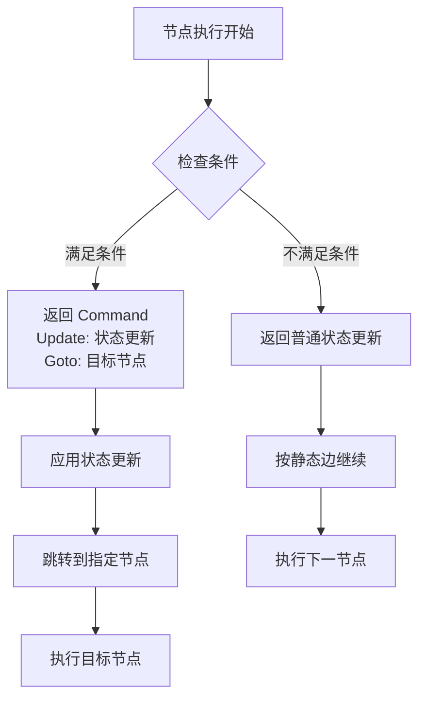
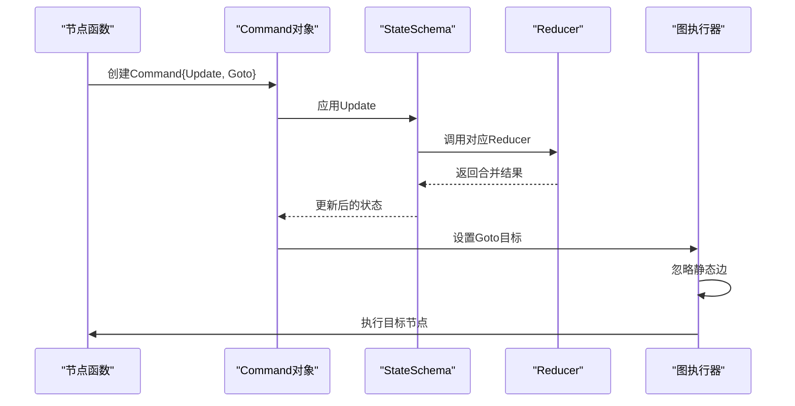
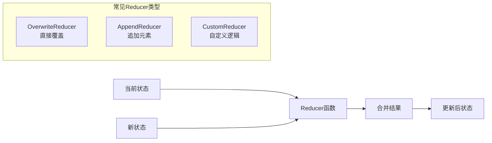
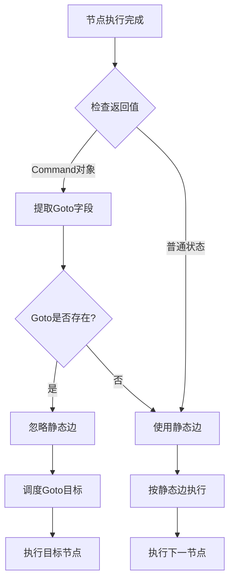
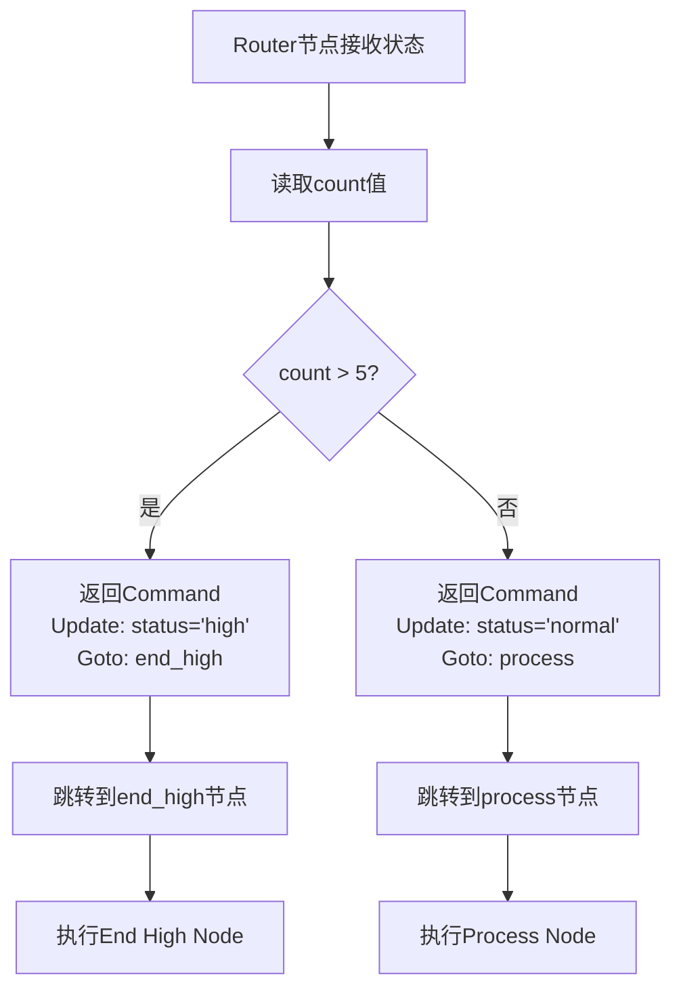
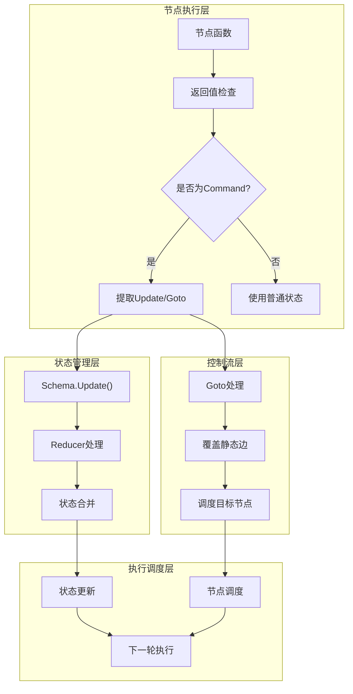

# 命令API

<cite>
**本文档中引用的文件**
- [graph/command.go](file://graph/command.go)
- [examples/command_api/main.go](file://examples/command_api/main.go)
- [examples/command_api/README.md](file://examples/command_api/README.md)
- [graph/state_graph.go](file://graph/state_graph.go)
- [graph/schema.go](file://graph/schema.go)
- [graph/command_test.go](file://graph/command_test.go)
- [graph/schema_test.go](file://graph/schema_test.go)
</cite>

## 目录
1. [简介](#简介)
2. [Command结构体设计](#command结构体设计)
3. [核心功能特性](#核心功能特性)
4. [状态Schema协同工作](#状态schema协同工作)
5. [动态控制流实现](#动态控制流实现)
6. [实际应用场景](#实际应用场景)
7. [架构设计分析](#架构设计分析)
8. [性能考虑](#性能考虑)
9. [最佳实践](#最佳实践)
10. [总结](#总结)

## 简介

LangGraphGo的命令API（Command API）是一个强大的动态控制流机制，允许节点函数在执行过程中动态地更新图状态并决定下一步的执行路径。通过返回`*Command`对象，节点可以实现"提前退出"、"跳过步骤"、"动态循环"等高级模式，为构建复杂的决策驱动Agent工作流提供了极大的灵活性。

命令API的核心价值在于突破了传统静态图定义的限制，使系统能够根据运行时状态做出智能的路由决策，这是构建真正智能化Agent系统的关键基础设施。

## Command结构体设计

### 核心数据结构

```mermaid
classDiagram
class Command {
+interface{} Update
+interface{} Goto
+String|[]String NextNodes
+bool HasUpdate()
+bool HasGoto()
}
class StateSchema {
<<interface>>
+Init() interface{}
+Update(current, new) interface{}
}
class MapSchema {
+map[string]Reducer Reducers
+map[string]bool EphemeralKeys
+RegisterReducer(key, reducer)
+Update(current, new) interface{}
}
class Reducer {
<<function>>
+func(current, new) interface{}
}
Command --> StateSchema : "uses"
StateSchema <|-- MapSchema : "implements"
MapSchema --> Reducer : "contains"
```

**图表来源**
- [graph/command.go](file://graph/command.go#L5-L14)
- [graph/schema.go](file://graph/schema.go#L12-L19)

### 字段详解

#### Update字段
`Update`字段用于在节点执行时更新图状态，具有以下特点：

- **类型**: `interface{}`，支持任意类型的值
- **处理方式**: 通过Schema的reducers进行合并处理
- **作用**: 在控制流切换前更新全局状态
- **灵活性**: 可以包含任何需要更新的状态信息

#### Goto字段  
`Goto`字段实现动态控制流，具有以下特性：

- **类型**: `interface{}`，支持字符串或字符串切片
- **覆盖能力**: 当设置时，会覆盖图的静态边定义
- **目标节点**: 可以指定单个节点或多个并发节点
- **终止符**: 支持特殊的`END`常量表示流程结束

**章节来源**
- [graph/command.go](file://graph/command.go#L5-L14)

## 核心功能特性

### 动态路由能力

命令API最核心的功能是提供动态路由能力，允许节点根据运行时状态决定下一步执行路径：



**图表来源**
- [examples/command_api/main.go](file://examples/command_api/main.go#L23-L40)
- [graph/state_graph.go](file://graph/state_graph.go#L225-L234)

### 状态更新机制

命令API与状态Schema协同工作，确保状态更新的正确性和一致性：



**图表来源**
- [graph/state_graph.go](file://graph/state_graph.go#L200-L210)
- [graph/schema.go](file://graph/schema.go#L62-L99)

**章节来源**
- [examples/command_api/main.go](file://examples/command_api/main.go#L23-L40)
- [graph/state_graph.go](file://graph/state_graph.go#L200-L210)

## 状态Schema协同工作

### Schema集成机制

命令API与状态Schema的集成确保了状态更新的一致性和可预测性：

| Schema类型 | Reducer注册 | 默认行为 | 特殊处理 |
|------------|-------------|----------|----------|
| MapSchema | RegisterReducer | 覆盖更新 | 支持自定义合并逻辑 |
| 自定义Schema | 实现Update方法 | 完全自定义 | 遵循接口约定 |
| 无Schema | 直接赋值 | 最新值覆盖 | 简单状态传递 |

### Reducer工作机制

状态更新通过Reducer函数实现，支持多种合并策略：



**图表来源**
- [graph/schema.go](file://graph/schema.go#L141-L185)

**章节来源**
- [graph/schema.go](file://graph/schema.go#L62-L99)
- [examples/command_api/main.go](file://examples/command_api/main.go#L18-L20)

## 动态控制流实现

### 控制流优先级

命令API的控制流遵循明确的优先级规则：



**图表来源**
- [graph/state_graph.go](file://graph/state_graph.go#L225-L268)

### 多目标路由

Goto字段支持多目标路由，实现并发执行：

| Goto类型 | 行为描述 | 使用场景 |
|----------|----------|----------|
| `"node"` | 单一目标节点 | 标准路由 |
| `[]string{"node1", "node2"}` | 并发执行多个节点 | 分支处理 |
| `nil` | 继续执行静态边 | 正常流程 |
| `END` | 结束流程 | 流程终止 |

**章节来源**
- [graph/state_graph.go](file://graph/state_graph.go#L225-L234)
- [graph/command_test.go](file://graph/command_test.go#L24-L28)

## 实际应用场景

### Router节点示例深度分析

以`examples/command_api`中的router节点为例，深入分析命令API的实际应用：

#### 条件路由逻辑



**图表来源**
- [examples/command_api/main.go](file://examples/command_api/main.go#L23-L40)

#### 执行流程对比

**案例1: count = 3（正常流程）**
- Router节点返回`Goto: "process"`
- 执行顺序：Router → Process → END
- 状态更新：`status: "normal"`

**案例2: count = 10（高值流程）**
- Router节点返回`Goto: "end_high"`
- 执行顺序：Router → End High → END  
- 状态更新：`status: "high"`（被跳过的Process不影响最终状态）

### 高级应用场景

#### 1. 早期退出模式
```go
if errorCondition {
    return &Command{
        Update: map[string]interface{}{"error": true},
        Goto:   END,
    }, nil
}
```

#### 2. 动态循环模式
```go
if continueLoop {
    return &Command{
        Update: map[string]interface{}{"iteration": iteration + 1},
        Goto:   currentNode,
    }, nil
}
```

#### 3. 条件分支模式
```go
return &Command{
    Update: map[string]interface{}{"result": value},
    Goto:   []string{"success", "failure"},
}, nil
```

**章节来源**
- [examples/command_api/main.go](file://examples/command_api/main.go#L23-L72)
- [examples/command_api/README.md](file://examples/command_api/README.md#L32-L46)

## 架构设计分析

### 执行引擎集成

命令API与LangGraphGo的执行引擎深度集成，形成完整的控制流体系：



**图表来源**
- [graph/state_graph.go](file://graph/state_graph.go#L200-L268)

### 错误处理机制

命令API集成了完善的错误处理机制：

| 场景 | 处理方式 | 错误类型 |
|------|----------|----------|
| Goto为空节点 | 返回ErrNoOutgoingEdge | 运行时错误 |
| Update格式错误 | Schema.Update失败 | 数据验证错误 |
| Goto目标不存在 | 调度时发现无效节点 | 路由错误 |
| 循环依赖检测 | 执行时检测循环 | 逻辑错误 |

**章节来源**
- [graph/state_graph.go](file://graph/state_graph.go#L200-L268)
- [graph/command_test.go](file://graph/command_test.go#L10-L57)

## 性能考虑

### 执行效率优化

命令API在设计时充分考虑了性能因素：

#### 1. 延迟计算
- Goto目标在实际调度时才解析
- 避免不必要的节点查找开销
- 支持动态目标解析

#### 2. 内存管理
- Command对象生命周期短
- 状态更新采用不可变设计
- 避免深层复制操作

#### 3. 并发安全
- 状态Schema线程安全
- Reducer函数纯函数设计
- 无共享可变状态

### 性能基准测试

基于现有测试代码，命令API的性能特征：

| 操作类型 | 时间复杂度 | 空间复杂度 | 说明 |
|----------|------------|------------|------|
| 状态更新 | O(n) | O(n) | n为更新键数量 |
| Goto解析 | O(1) | O(1) | 哈希表查找 |
| 多目标调度 | O(k) | O(k) | k为目标节点数 |

## 最佳实践

### 设计原则

#### 1. 单一职责原则
每个Command应该专注于单一的控制流决策，避免过于复杂的逻辑。

#### 2. 可预测性
尽量保持Goto目标的确定性，避免过多的动态计算。

#### 3. 错误处理
始终为Command返回值提供适当的错误处理逻辑。

### 代码组织建议

#### 良好的Command使用模式
```go
func routerNode(ctx context.Context, state interface{}) (interface{}, error) {
    // 1. 状态验证
    if state == nil {
        return nil, errors.New("invalid state")
    }
    
    // 2. 业务逻辑处理
    count := extractCount(state)
    
    // 3. 命令构建
    if count > threshold {
        return &Command{
            Update: map[string]interface{}{"status": "high"},
            Goto:   "critical_path",
        }, nil
    }
    
    return &Command{
        Update: map[string]interface{}{"status": "normal"},
        Goto:   "standard_path",
    }, nil
}
```

#### 避免的反模式
```go
// ❌ 复杂的内联逻辑
func badNode(ctx context.Context, state interface{}) (interface{}, error) {
    return &Command{
        Update: complexLogic(state),
        Goto:   dynamicRoute(state),
    }, nil
}

// ✅ 分离关注点
func goodNode(ctx context.Context, state interface{}) (interface{}, error) {
    route, err := determineRoute(state)
    if err != nil {
        return nil, err
    }
    
    update := prepareUpdate(state)
    
    return &Command{
        Update: update,
        Goto:   route,
    }, nil
}
```

### 调试和监控

#### 1. 日志记录
```go
func debugRouter(ctx context.Context, state interface{}) (interface{}, error) {
    logger := log.FromContext(ctx)
    logger.Infof("Router processing state: %+v", state)
    
    // ... 路由逻辑
    
    logger.Infof("Router decided goto: %s", targetNode)
    return &Command{
        Update: updates,
        Goto:   targetNode,
    }, nil
}
```

#### 2. 状态追踪
```go
func tracedNode(ctx context.Context, state interface{}) (interface{}, error) {
    span := otel.Tracer("router").StartSpan(ctx, "router_decision")
    defer span.End()
    
    // ... 路由逻辑
    span.SetAttribute("goto.target", targetNode)
    
    return &Command{
        Update: updates,
        Goto:   targetNode,
    }, nil
}
```

## 总结

LangGraphGo的命令API是一个精心设计的动态控制流机制，它通过简单的`Command`结构体实现了复杂的路由控制能力。其核心价值体现在：

### 技术优势
1. **灵活性**: 突破静态图定义的限制，支持运行时决策
2. **一致性**: 与状态Schema无缝集成，保证状态更新的正确性
3. **性能**: 低开销的控制流切换机制
4. **可扩展**: 支持多种路由模式和组合使用

### 应用价值
1. **智能Agent**: 实现基于条件的决策路由
2. **工作流管理**: 支持复杂的业务流程控制
3. **错误处理**: 提供优雅的异常处理机制
4. **动态配置**: 支持运行时的工作流调整

### 发展前景
命令API为构建下一代智能Agent系统奠定了坚实基础，随着AI技术的发展，这种动态控制能力将在更多场景中发挥重要作用，特别是在需要实时决策和自适应行为的应用中。

通过深入理解和合理运用命令API，开发者可以构建出更加智能、灵活和高效的Agent工作流系统，真正实现从简单流程自动化向智能决策自动化的跨越。