# 扩展机制

<cite>
**本文档中引用的文件**
- [graph/listeners.go](file://graph/listeners.go)
- [graph/builtin_listeners.go](file://graph/builtin_listeners.go)
- [graph/tracing.go](file://graph/tracing.go)
- [graph/command.go](file://graph/command.go)
- [prebuilt/tool_executor.go](file://prebuilt/tool_executor.go)
- [examples/listeners/main.go](file://examples/listeners/main.go)
- [examples/command_api/main.go](file://examples/command_api/main.go)
- [graph/streaming.go](file://graph/streaming.go)
- [graph/graph.go](file://graph/graph.go)
</cite>

## 目录
1. [简介](#简介)
2. [Listeners 设计模式](#listeners-设计模式)
3. [Tracing 分布式追踪](#tracing-分布式追踪)
4. [Command API 动态控制流](#command-api-动态控制流)
5. [Streaming 实时流式处理](#streaming-实时流式处理)
6. [扩展机制集成](#扩展机制集成)
7. [最佳实践](#最佳实践)
8. [总结](#总结)

## 简介

LangGraph Go 提供了一套完整的扩展机制，支持开发者在运行时监控、调试和控制复杂的工作流执行。这些扩展点包括监听器系统（Listeners）、分布式追踪（Tracing）、命令 API（Command API）和实时流式处理（Streaming）。这些机制共同构建了一个可观察、可调试且高度可定制的系统架构。

## Listeners 设计模式

### 核心概念

Listeners 是 LangGraph Go 中最重要的扩展机制之一，采用观察者模式设计，允许开发者在节点执行的不同阶段插入自定义逻辑。

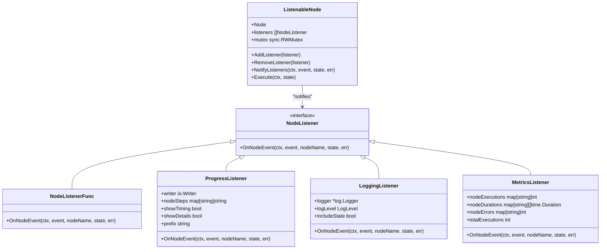

**图表来源**
- [graph/listeners.go](file://graph/listeners.go#L51-L87)
- [graph/builtin_listeners.go](file://graph/builtin_listeners.go#L13-L433)

### 生命周期钩子

Listeners 提供了丰富的生命周期钩子，涵盖节点执行的各个阶段：

| 事件类型 | 描述 | 触发时机 |
|---------|------|----------|
| `NodeEventStart` | 节点开始执行 | 节点函数被调用前 |
| `NodeEventProgress` | 节点执行进度 | 节点执行过程中的任意时刻 |
| `NodeEventComplete` | 节点成功完成 | 节点函数正常返回时 |
| `NodeEventError` | 节点执行错误 | 节点函数返回非空错误时 |
| `EventChainStart` | 图执行开始 | 整个图开始执行时 |
| `EventChainEnd` | 图执行结束 | 整个图成功完成时 |
| `EventToolStart` | 工具调用开始 | 工具节点开始执行时 |
| `EventToolEnd` | 工具调用结束 | 工具节点完成执行时 |
| `EventLLMStart` | LLM调用开始 | LLM节点开始执行时 |
| `EventLLMEnd` | LLM调用结束 | LLM节点完成执行时 |

### 内置监听器类型

#### ProgressListener（进度监听器）

提供可视化的进度跟踪功能，支持自定义消息和格式化选项：

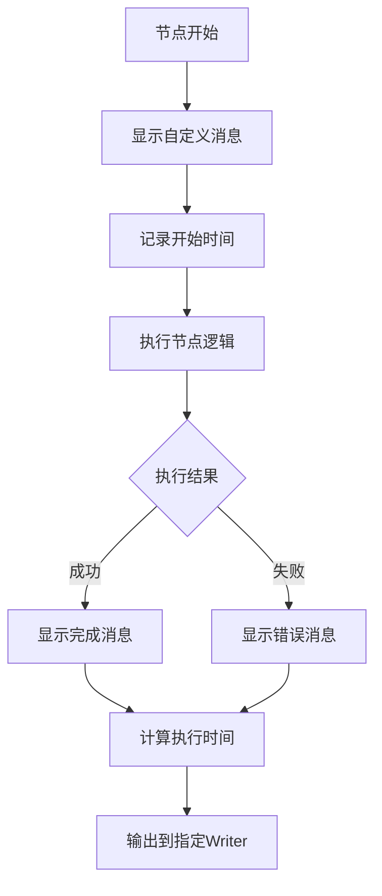

**图表来源**
- [graph/builtin_listeners.go](file://graph/builtin_listeners.go#L70-L116)

#### LoggingListener（日志监听器）

提供结构化日志记录功能，支持不同级别的日志输出：

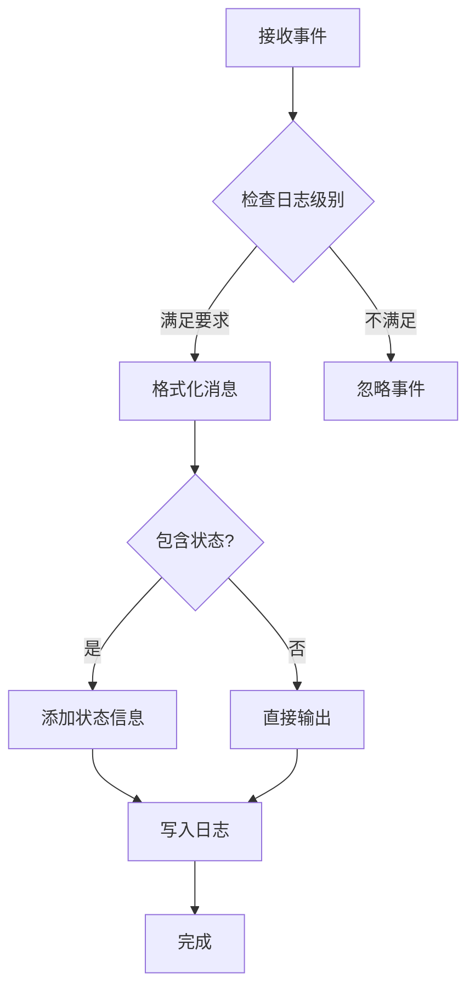

**图表来源**
- [graph/builtin_listeners.go](file://graph/builtin_listeners.go#L165-L200)

#### MetricsListener（指标监听器）

收集详细的性能和执行指标：

| 指标类型 | 数据结构 | 用途 |
|---------|----------|------|
| 节点执行次数 | `map[string]int` | 统计每个节点的执行频率 |
| 节点执行时间 | `map[string][]time.Duration` | 计算平均执行时间和分布 |
| 节点错误次数 | `map[string]int` | 监控节点故障率 |
| 总执行次数 | `int` | 全局执行统计 |

#### ChatListener（聊天监听器）

提供实时聊天风格的更新提示：

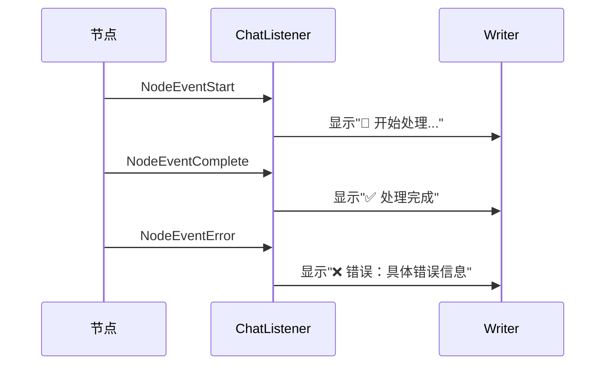

**图表来源**
- [graph/builtin_listeners.go](file://graph/builtin_listeners.go#L392-L432)

### 监听器管理

ListenableNode 提供了灵活的监听器管理机制：

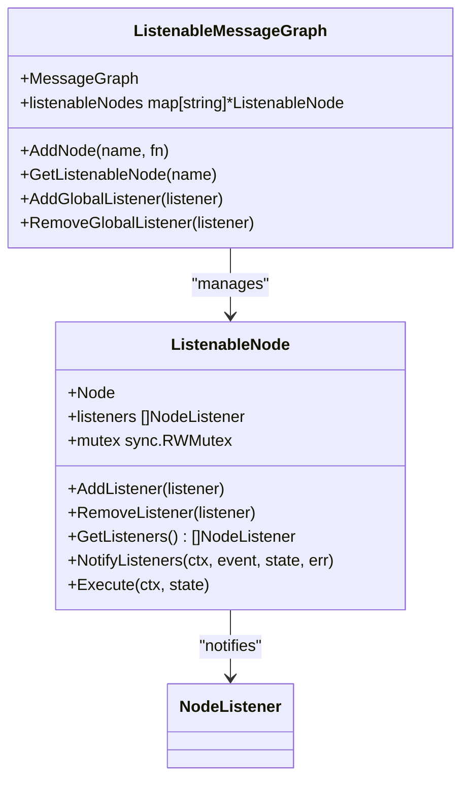

**图表来源**
- [graph/listeners.go](file://graph/listeners.go#L89-L234)

**章节来源**
- [graph/listeners.go](file://graph/listeners.go#L1-L335)
- [graph/builtin_listeners.go](file://graph/builtin_listeners.go#L1-L433)
- [examples/listeners/main.go](file://examples/listeners/main.go#L1-L132)

## Tracing 分布式追踪

### 架构设计

Tracing 模块提供了与外部追踪系统的集成能力，支持 OpenTelemetry 等标准追踪协议。

```mermaid
classDiagram
class TraceSpan {
+ID string
+ParentID string
+Event TraceEvent
+NodeName string
+FromNode string
+ToNode string
+StartTime time.Time
+EndTime time.Time
+Duration time.Duration
+State interface{}
+Error error
+Metadata map[string]interface{}
}
class TraceHook {
<<interface>>
+OnEvent(ctx, span)
}
class Tracer {
+hooks []TraceHook
+spans map[string]*TraceSpan
+AddHook(hook)
+StartSpan(ctx, event, nodeName) *TraceSpan
+EndSpan(ctx, span, state, err)
+TraceEdgeTraversal(ctx, fromNode, toNode)
+GetSpans() map[string]*TraceSpan
+Clear()
}
class TracedRunnable {
+Runnable
+tracer *Tracer
+Invoke(ctx, initialState)
+GetTracer() *Tracer
}
TraceHook --> TraceSpan : "receives"
Tracer --> TraceSpan : "manages"
Tracer --> TraceHook : "notifies"
TracedRunnable --> Tracer : "uses"
```

**图表来源**
- [graph/tracing.go](file://graph/tracing.go#L31-L287)

### 追踪事件类型

| 事件类型 | 描述 | 用途 |
|---------|------|------|
| `TraceEventGraphStart` | 图执行开始 | 标记整个工作流的开始 |
| `TraceEventGraphEnd` | 图执行结束 | 标记整个工作流的成功完成 |
| `TraceEventNodeStart` | 节点开始 | 标记单个节点的开始执行 |
| `TraceEventNodeEnd` | 节点结束 | 标记单个节点的成功完成 |
| `TraceEventNodeError` | 节点错误 | 标记节点执行过程中的错误 |
| `TraceEventEdgeTraversal` | 边遍历 | 标记节点间的控制流转移 |

### 上下文传播

Tracing 系统通过上下文传播支持分布式追踪：

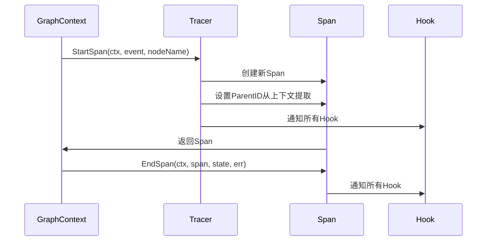

**图表来源**
- [graph/tracing.go](file://graph/tracing.go#L103-L148)

### 与外部系统集成

虽然当前版本主要关注内部追踪，但 Tracer 接口设计为支持外部系统集成：

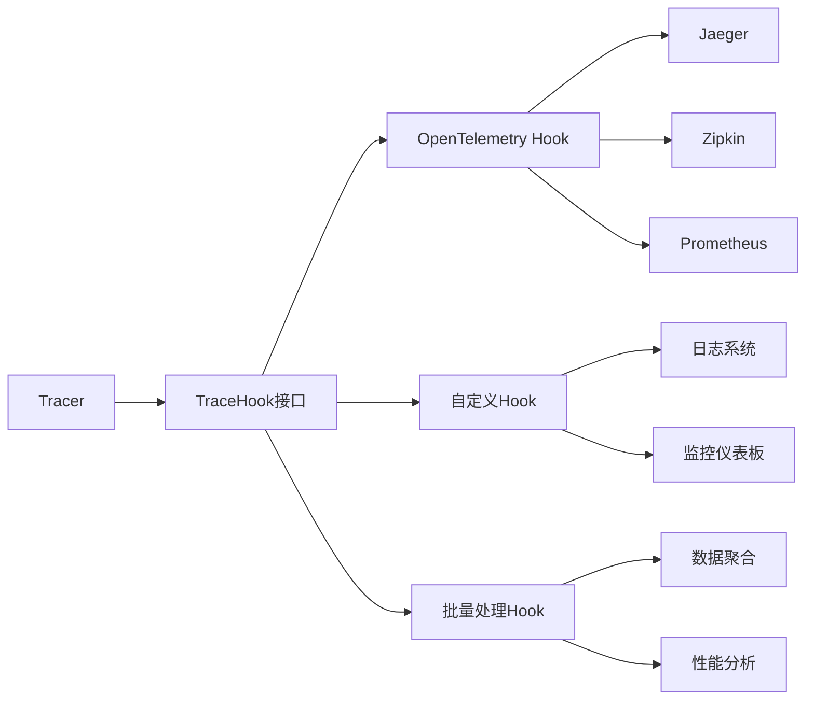

**章节来源**
- [graph/tracing.go](file://graph/tracing.go#L1-L287)

## Command API 动态控制流

### 核心概念

Command API 允许节点在执行过程中动态控制流程，提供比静态图定义更灵活的控制能力。

```mermaid
classDiagram
class Command {
+Update interface{}
+Goto interface{}
}
class ToolExecutor {
+tools map[string]tools.Tool
+Execute(ctx, invocation) string
+ExecuteMany(ctx, invocations) []string
+ToolNode(ctx, state)
}
class ToolInvocation {
+Tool string
+ToolInput string
}
Command --> ToolInvocation : "used by"
ToolExecutor --> Command : "returns"
ToolExecutor --> ToolInvocation : "processes"
```

**图表来源**
- [graph/command.go](file://graph/command.go#L1-L15)
- [prebuilt/tool_executor.go](file://prebuilt/tool_executor.go#L1-L84)

### 动态路由机制

Command API 的核心是 `Command` 结构体，它包含两个关键字段：

| 字段 | 类型 | 描述 | 使用场景 |
|------|------|------|----------|
| `Update` | `interface{}` | 状态更新值 | 在控制流改变前更新图状态 |
| `Goto` | `interface{}` | 下一节点指定 | 覆盖静态边，动态控制执行路径 |

### 实现原理

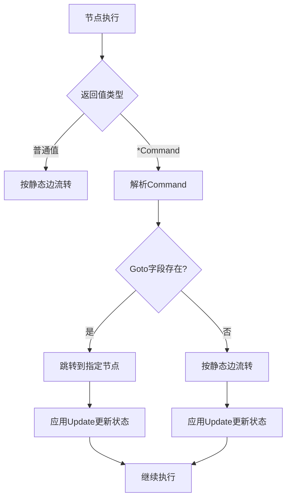

**图表来源**
- [examples/command_api/main.go](file://examples/command_api/main.go#L22-L40)

### 工具调用示例

ToolExecutor 展示了如何在实际场景中使用 Command API：

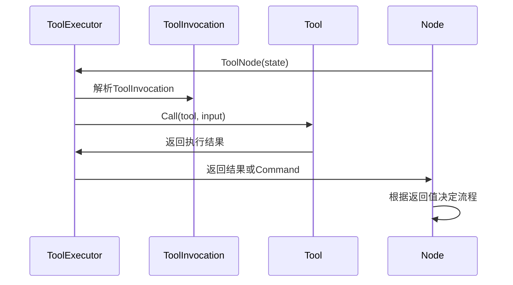

**图表来源**
- [prebuilt/tool_executor.go](file://prebuilt/tool_executor.go#L57-L84)

### 使用场景

Command API 适用于以下场景：

1. **条件路由**：基于节点执行结果动态选择路径
2. **早期退出**：在满足特定条件时提前终止流程
3. **跳过步骤**：根据业务逻辑跳过某些中间步骤
4. **动态循环**：实现复杂的循环控制逻辑
5. **工具调用决策**：根据工具执行结果调整后续流程

**章节来源**
- [graph/command.go](file://graph/command.go#L1-L15)
- [prebuilt/tool_executor.go](file://prebuilt/tool_executor.go#L1-L84)
- [examples/command_api/main.go](file://examples/command_api/main.go#L1-L73)

## Streaming 实时流式处理

### 架构概览

Streaming 系统提供了实时事件流式处理能力，支持多种流式模式和背压处理。

```mermaid
classDiagram
class StreamEvent {
+Timestamp time.Time
+NodeName string
+Event NodeEvent
+State interface{}
+Error error
+Metadata map[string]interface{}
+Duration time.Duration
}
class StreamingListener {
+eventChan chan StreamEvent
+config StreamConfig
+closed bool
+droppedEvents int
+mutex sync.RWMutex
+OnNodeEvent(ctx, event, nodeName, state, err)
+emitEvent(event)
+shouldEmit(event) bool
+Close()
+GetDroppedEventsCount() int
}
class StreamingRunnable {
+runnable *ListenableRunnable
+config StreamConfig
+Stream(ctx, initialState) *StreamResult
}
class StreamResult {
+Events chan StreamEvent
+Result chan interface{}
+Errors chan error
+Done chan struct{}
+Cancel context.CancelFunc
}
StreamingListener --> StreamEvent : "emits"
StreamingRunnable --> StreamResult : "produces"
StreamingRunnable --> StreamingListener : "uses"
```

**图表来源**
- [graph/streaming.go](file://graph/streaming.go#L65-L423)

### 流式模式

| 模式 | 值 | 描述 | 使用场景 |
|------|-----|------|----------|
| `StreamModeDebug` | `"debug"` | 发射所有内部事件 | 深度调试和问题排查 |
| `StreamModeValues` | `"values"` | 发射完整状态变化 | 调试和UI渲染 |
| `StreamModeUpdates` | `"updates"` | 发射节点输出更新 | 进度显示和状态跟踪 |
| `StreamModeMessages` | `"messages"` | 发射消息和令牌 | LLM流式输出 |

### 背压处理

Streaming 系统实现了智能的背压处理机制：

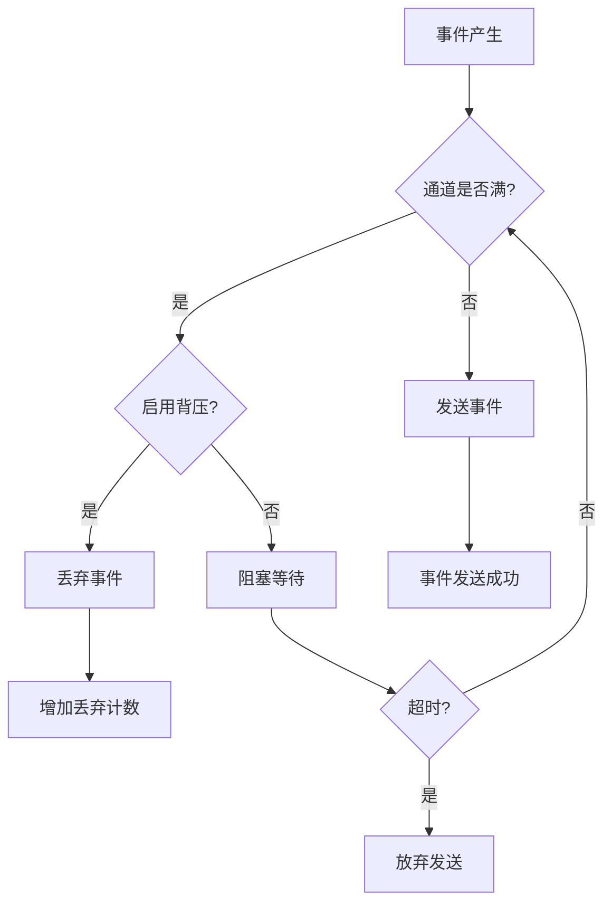

**图表来源**
- [graph/streaming.go](file://graph/streaming.go#L99-L109)

### 执行流程

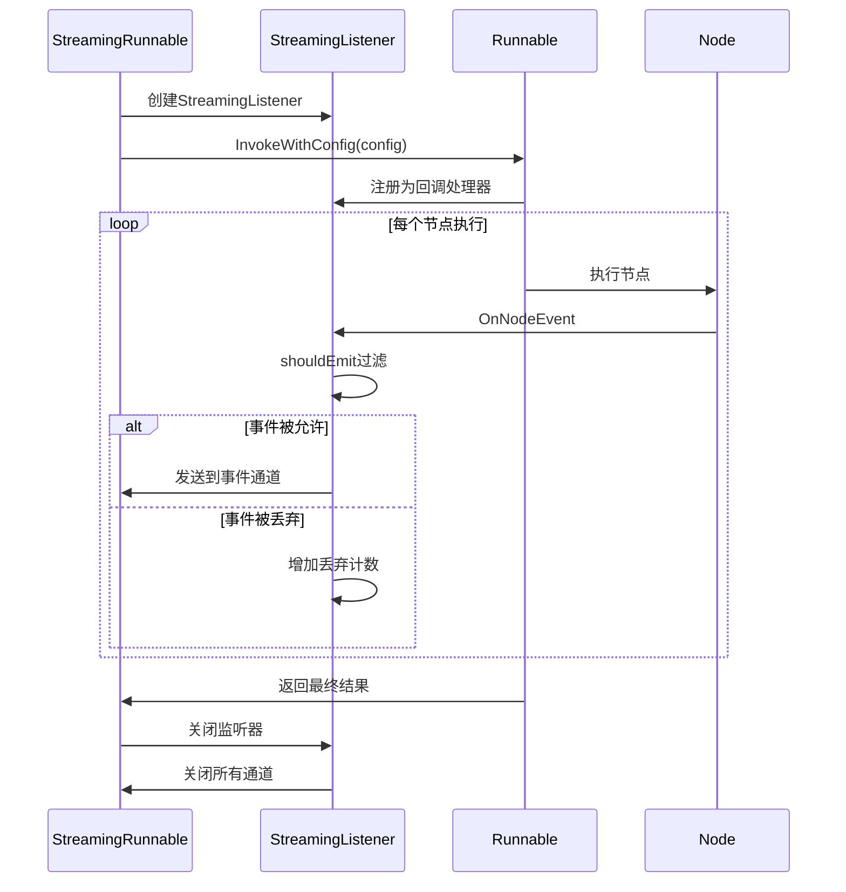

**图表来源**
- [graph/streaming.go](file://graph/streaming.go#L289-L357)

**章节来源**
- [graph/streaming.go](file://graph/streaming.go#L1-L423)

## 扩展机制集成

### 综合架构

多个扩展机制可以协同工作，构建完整的可观测性体系：

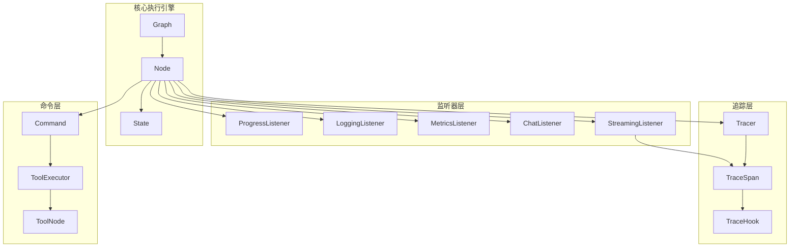

### 配置示例

以下是综合使用各种扩展机制的配置示例：

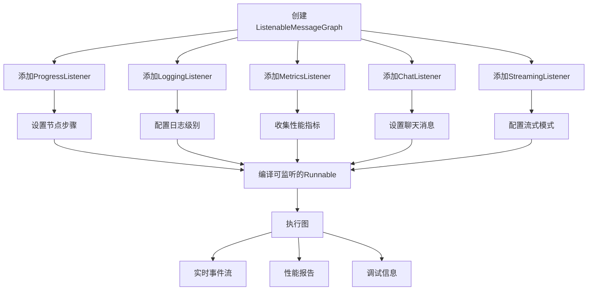

### 监控和调试工作流

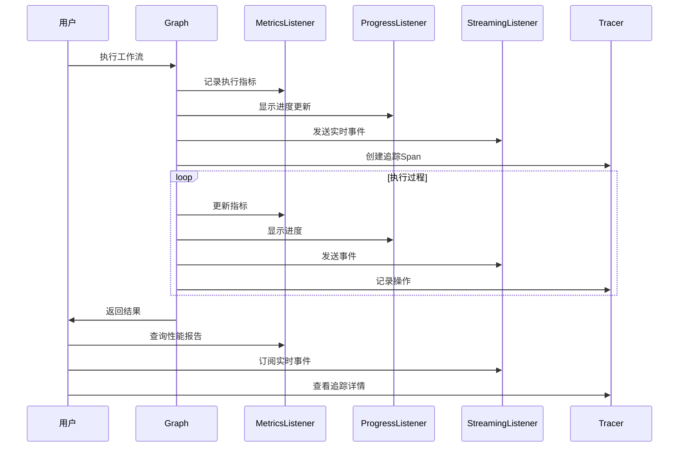

**章节来源**
- [examples/listeners/main.go](file://examples/listeners/main.go#L1-L132)

## 最佳实践

### 监听器使用建议

1. **选择合适的监听器类型**
   - 使用 ProgressListener 进行用户界面反馈
   - 使用 LoggingListener 进行生产环境日志
   - 使用 MetricsListener 进行性能监控
   - 使用 ChatListener 提供交互式体验

2. **避免过度监听**
   - 不要在高频率节点上使用重量级监听器
   - 考虑使用异步处理减少对主流程的影响
   - 合理设置监听器的过滤条件

3. **资源管理**
   - 及时移除不需要的监听器
   - 实现监听器的清理逻辑
   - 注意内存泄漏风险

### Tracing 集成策略

1. **分层追踪**
   - 在不同抽象层次使用不同的追踪事件
   - 保持追踪上下文的完整性
   - 合理设置追踪采样率

2. **外部系统集成**
   - 实现 TraceHook 接口适配外部追踪系统
   - 处理追踪数据的批量传输
   - 实现追踪数据的本地缓存

### Command API 使用指南

1. **状态更新策略**
   - 使用 Schema/Reducer 正确合并状态
   - 避免在 Command 中传递大型对象
   - 考虑状态的序列化和反序列化成本

2. **路由决策**
   - 保持路由逻辑的简单性和可预测性
   - 实现适当的错误处理和回退机制
   - 避免过于复杂的嵌套路由

### Streaming 性能优化

1. **缓冲区管理**
   - 根据内存限制设置合理的缓冲区大小
   - 实现背压处理策略
   - 监控丢弃事件的数量

2. **事件过滤**
   - 使用适当的流式模式减少不必要的事件
   - 实现客户端侧的事件过滤
   - 考虑事件压缩和传输优化

## 总结

LangGraph Go 的扩展机制提供了一个完整而灵活的框架，支持开发者在运行时监控、调试和控制复杂的工作流执行。通过 Listener 系统的生命周期钩子、Tracing 模块的分布式追踪、Command API 的动态控制流和 Streaming 系统的实时事件处理，这些机制共同构建了一个可观察、可调试且高度可定制的系统架构。

这些扩展机制的设计遵循了单一职责原则和开放封闭原则，既保证了系统的稳定性，又提供了足够的灵活性。通过合理使用这些扩展点，开发者可以构建出功能强大、易于维护的复杂工作流系统。

未来的改进方向包括：
- 更好的 OpenTelemetry 集成
- 更丰富的内置监听器类型
- 更智能的自动配置和优化
- 更完善的监控和告警机制